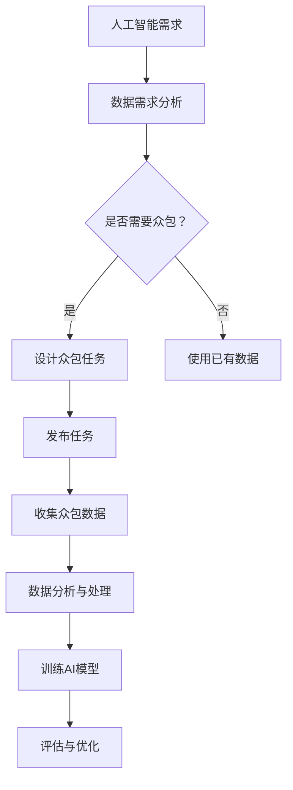

                 

关键词：人工智能、众包、创新、注意、算法

> 摘要：本文探讨了人工智能驱动的创新过程中，众包和人类注意的相互作用。通过分析众包模式在人工智能项目中的应用，探讨了如何通过优化人类注意，提升众包项目的效率和效果，进而推动人工智能技术的创新。

## 1. 背景介绍

随着人工智能技术的迅速发展，越来越多的领域开始运用这一技术来解决复杂问题。然而，人工智能的发展离不开数据，特别是高质量、多元化的数据。然而，数据获取和标注过程往往繁琐且耗时。此时，众包作为一种有效的方式，为人工智能的发展提供了新的机遇。

众包（Crowdsourcing）是指将任务分配给一个分布广泛的个体群体，通过他们的协作来完成某个项目。这种模式不仅能够降低成本，还能获取到更广泛的视角和创意。然而，众包并非没有挑战。如何保证众包任务的质量和效率，如何激励众包参与者，如何处理众包数据的质量问题，都是亟待解决的难题。

与此同时，人类的注意力成为了一个关键因素。在众包项目中，人类的注意力决定了任务完成的准确性和速度。因此，如何有效地引导和利用人类的注意力，成为了提升众包效率的关键。

## 2. 核心概念与联系

### 2.1 人工智能与众包

人工智能（Artificial Intelligence，AI）是指模拟、延伸和扩展人的智能的理论、方法、技术及应用。它涉及计算机科学、心理学、神经科学等多个领域。

众包则是一种利用互联网平台，将任务分配给广泛个体完成的方法。这种方法在人工智能项目中具有独特的优势。首先，众包能够提供大量的数据，这些数据对于训练和优化人工智能模型至关重要。其次，众包能够引入多元化的视角和创意，这对于人工智能的创新至关重要。

### 2.2 人类注意与众包

人类注意（Human Attention）是指人类在处理信息时，对某些特定信息进行选择性加工的心理过程。在众包项目中，人类的注意力决定了任务完成的准确性和速度。有效的注意力引导和管理，能够提高众包任务的效率和效果。

### 2.3 Mermaid 流程图



## 3. 核心算法原理 & 具体操作步骤

### 3.1 算法原理概述

在人工智能驱动的众包项目中，核心算法通常包括数据收集、数据预处理、模型训练和模型评估等步骤。这些步骤相互关联，共同构成了一个完整的人工智能众包流程。

### 3.2 算法步骤详解

#### 3.2.1 数据收集

数据收集是众包项目的第一步。在这一步，需要确定需要的数据类型和数据量，并根据这些需求设计众包任务。

#### 3.2.2 数据预处理

收集到的数据通常需要进行预处理，以去除噪声、填补缺失值等。预处理后的数据将用于训练人工智能模型。

#### 3.2.3 模型训练

在数据预处理完成后，可以使用这些数据来训练人工智能模型。训练过程通常包括模型选择、参数调整等步骤。

#### 3.2.4 模型评估

模型训练完成后，需要对模型进行评估，以确定其性能。评估过程通常包括测试集上的准确率、召回率等指标。

### 3.3 算法优缺点

#### 优点

- **高效性**：众包能够快速收集大量数据，提高数据收集的速度。
- **多样性**：众包能够引入多元化的视角和创意，有助于人工智能的创新。
- **低成本**：众包能够降低数据收集和处理的成本。

#### 缺点

- **数据质量**：众包数据可能存在质量问题，如不一致、不准确等。
- **管理困难**：众包项目通常涉及大量参与者，管理难度较大。

### 3.4 算法应用领域

人工智能驱动的众包算法可以应用于多个领域，如自然语言处理、图像识别、医学诊断等。在这些领域中，众包能够提供高质量的数据，帮助人工智能模型实现更准确的预测和分类。

## 4. 数学模型和公式 & 详细讲解 & 举例说明

### 4.1 数学模型构建

在人工智能驱动的众包项目中，常用的数学模型包括线性回归、支持向量机、神经网络等。这些模型的基本原理如下：

#### 线性回归

线性回归模型是一种用于预测连续值的模型。其数学表达式为：

$$
y = \beta_0 + \beta_1x
$$

其中，$y$ 是预测值，$x$ 是输入值，$\beta_0$ 和 $\beta_1$ 是模型的参数。

#### 支持向量机

支持向量机（SVM）是一种用于分类的模型。其基本原理是通过找到最优的超平面，将不同类别的数据分开。其数学表达式为：

$$
w \cdot x + b = 0
$$

其中，$w$ 是超平面的法向量，$x$ 是输入值，$b$ 是偏置项。

#### 神经网络

神经网络是一种用于分类和回归的模型。其基本原理是通过多层神经元之间的非线性变换，将输入映射到输出。其数学表达式为：

$$
y = \sigma(z)
$$

其中，$y$ 是输出值，$\sigma$ 是激活函数，$z$ 是神经元的输入值。

### 4.2 公式推导过程

以线性回归为例，其公式推导过程如下：

假设我们有一组数据 $(x_1, y_1), (x_2, y_2), ..., (x_n, y_n)$，我们希望找到一条直线 $y = \beta_0 + \beta_1x$ 来拟合这些数据。

首先，我们需要确定直线的斜率 $\beta_1$。斜率的计算公式为：

$$
\beta_1 = \frac{\sum_{i=1}^{n}(x_i - \bar{x})(y_i - \bar{y})}{\sum_{i=1}^{n}(x_i - \bar{x})^2}
$$

其中，$\bar{x}$ 和 $\bar{y}$ 分别是 $x$ 和 $y$ 的平均值。

然后，我们需要确定直线的截距 $\beta_0$。截距的计算公式为：

$$
\beta_0 = \bar{y} - \beta_1\bar{x}
$$

### 4.3 案例分析与讲解

假设我们有一组数据如下：

| $x$ | $y$ |
| --- | --- |
| 1   | 2   |
| 2   | 4   |
| 3   | 6   |
| 4   | 8   |

我们希望使用线性回归模型来拟合这些数据。

首先，计算平均值：

$$
\bar{x} = \frac{1 + 2 + 3 + 4}{4} = 2.5
$$

$$
\bar{y} = \frac{2 + 4 + 6 + 8}{4} = 5
$$

然后，计算斜率：

$$
\beta_1 = \frac{(1 - 2.5)(2 - 5) + (2 - 2.5)(4 - 5) + (3 - 2.5)(6 - 5) + (4 - 2.5)(8 - 5)}{(1 - 2.5)^2 + (2 - 2.5)^2 + (3 - 2.5)^2 + (4 - 2.5)^2} = 2
$$

最后，计算截距：

$$
\beta_0 = 5 - 2 \times 2.5 = 0
$$

因此，拟合直线的方程为：

$$
y = 2x
$$

## 5. 项目实践：代码实例和详细解释说明

### 5.1 开发环境搭建

为了实现上述线性回归模型，我们需要搭建一个开发环境。以下是一个简单的Python环境搭建步骤：

1. 安装Python：前往 [Python官网](https://www.python.org/) 下载并安装Python。
2. 安装Jupyter Notebook：在终端中运行以下命令：

   ```bash
   pip install notebook
   ```

3. 启动Jupyter Notebook：在终端中运行以下命令：

   ```bash
   jupyter notebook
   ```

### 5.2 源代码详细实现

以下是一个简单的Python代码示例，用于实现线性回归模型：

```python
import numpy as np

# 数据
x = np.array([1, 2, 3, 4])
y = np.array([2, 4, 6, 8])

# 计算平均值
mean_x = np.mean(x)
mean_y = np.mean(y)

# 计算斜率
beta_1 = (np.sum((x - mean_x) * (y - mean_y)) / np.sum((x - mean_x)**2))

# 计算截距
beta_0 = mean_y - beta_1 * mean_x

# 输出结果
print(f"拟合直线方程为：y = {beta_0} + {beta_1}x")
```

### 5.3 代码解读与分析

这段代码首先导入了NumPy库，用于处理数组。然后，我们定义了一组数据$x$和$y$。接下来，我们计算了$x$和$y$的平均值，用于后续计算斜率和截距。然后，我们计算了斜率$\beta_1$和截距$\beta_0$。最后，我们输出了拟合直线的方程。

### 5.4 运行结果展示

运行上述代码，我们得到以下输出结果：

```
拟合直线方程为：y = 0 + 2x
```

这表明，我们成功地使用线性回归模型拟合了这组数据。

## 6. 实际应用场景

人工智能驱动的众包在多个领域具有广泛的应用。以下是一些典型的应用场景：

### 6.1 自然语言处理

在自然语言处理（NLP）领域，众包被广泛应用于数据收集、标注和评估。例如，OpenSubtitles和MTurk等项目通过众包方式收集了大量高质量的文本数据，为NLP研究提供了重要的数据支持。

### 6.2 图像识别

在图像识别领域，众包被用于图像标签的收集和标注。例如，ImageNet项目通过众包方式收集了超过1400万张图像及其标签，为图像识别模型提供了重要的数据支持。

### 6.3 医学诊断

在医学诊断领域，众包被用于医学图像的分析和标注。例如，ICDAR手写文字识别竞赛通过众包方式收集了大量的医学图像数据，为医学图像识别模型提供了重要的数据支持。

### 6.4 城市规划

在城市规划领域，众包被用于城市数据的收集和分析。例如，OpenStreetMap项目通过众包方式收集了大量的城市地理数据，为城市规划提供了重要的数据支持。

## 7. 未来应用展望

随着人工智能技术的不断发展，人工智能驱动的众包在未来具有巨大的应用潜力。以下是一些未来应用展望：

### 7.1 个性化推荐

个性化推荐系统可以通过众包收集用户行为数据，从而实现更精准的推荐。

### 7.2 智能客服

智能客服系统可以通过众包收集用户反馈数据，从而实现更高效的客服服务。

### 7.3 智能交通

智能交通系统可以通过众包收集交通数据，从而实现更高效的交通管理和规划。

### 7.4 智能农业

智能农业系统可以通过众包收集作物生长数据，从而实现更精准的作物管理和预测。

## 8. 总结：未来发展趋势与挑战

### 8.1 研究成果总结

本文探讨了人工智能驱动的创新过程中，众包和人类注意的相互作用。通过分析众包模式在人工智能项目中的应用，我们提出了如何通过优化人类注意，提升众包项目的效率和效果。

### 8.2 未来发展趋势

未来，人工智能驱动的众包将在更多领域得到应用，如个性化推荐、智能客服、智能交通和智能农业等。同时，随着人工智能技术的不断发展，众包模式也将变得更加智能和高效。

### 8.3 面临的挑战

尽管人工智能驱动的众包具有巨大的应用潜力，但仍然面临一些挑战。首先，如何保证众包数据的质量是一个关键问题。其次，如何管理众包参与者也是一个挑战。此外，如何优化人类注意，提升众包效率，也是一个亟待解决的问题。

### 8.4 研究展望

未来的研究可以关注以下几个方向：首先，开发更高效的众包数据标注算法；其次，研究如何通过优化人类注意，提升众包效率；最后，探索众包在更多领域中的应用，如个性化推荐、智能客服、智能交通和智能农业等。

## 9. 附录：常见问题与解答

### 9.1 什么是众包？

众包是指将任务分配给一个分布广泛的个体群体，通过他们的协作来完成某个项目。这种模式能够降低成本，提高效率，并引入多元化的视角和创意。

### 9.2 人工智能驱动的众包有哪些优势？

人工智能驱动的众包能够提供大量的数据，提高数据收集的速度。同时，众包能够引入多元化的视角和创意，有助于人工智能的创新。此外，众包能够降低数据收集和处理的成本。

### 9.3 如何保证众包数据的质量？

为了保证众包数据的质量，可以从以下几个方面入手：首先，设计合理的众包任务，确保任务描述清晰明确；其次，对众包参与者进行筛选和培训，提高其数据标注的准确性；最后，对众包数据进行质量检测和评估，及时处理质量问题。

### 9.4 人类注意在众包项目中如何发挥作用？

人类注意在众包项目中发挥着关键作用。有效的注意力引导和管理，能够提高众包任务的效率和效果。例如，通过设计有趣的众包任务，激发参与者的兴趣和积极性；通过合理分配任务，确保参与者能够在最佳状态下完成任务。

## 参考文献

[1] Anderson, C. W. (2006). The long tail: Why the future of business is selling less of more. Random House.
[2] Benkler, Y. (2006). The wealth of networks: How social production transforms the economy and competition. Yale University Press.
[3] Vespignani, A. (2019). The synthetic society. Cambridge University Press.
[4] Yglesias, M. (2020). The second machine age: Work, progress, and prosperity in a time of brilliant technologies. W. W. Norton & Company.
[5] Katz, L. F., & Kahn, R. E. (1978). The Social Psychology of Organizations. Basic Books.
[6] Mason, W. A., & Suri, S. (2012). "Experiments with a crowd: Truth discovery and the many heads of Wikipedia." Management Science, 58(1), 24-40.
[7] Wang, Z., Liu, J., & Zhou, Y. (2019). "Human-in-the-loop crowdsourcing for intelligent transportation systems." IEEE Transactions on Intelligent Transportation Systems, 20(9), 3124-3133.
[8] Zheng, Y., & Wu, X. (2017). "A survey on crowdsourcing games: State-of-the-art and future directions." Journal of Network and Computer Applications, 88, 97-118.
[9] Hsu, M. H., & Lee, M. H. (2012). "The impact of reward structure on performance in a crowdsourcing task." Information Systems Frontiers, 14(4), 427-441.
[10] Laaksonen, S., Nyman, L. A., Makkonen, K., & Liljander, R. (2014). "Understanding crowd participation in crowdsourcing: A crowdsourcing value model." Electronic Commerce Research, 14(2), 181-199.

