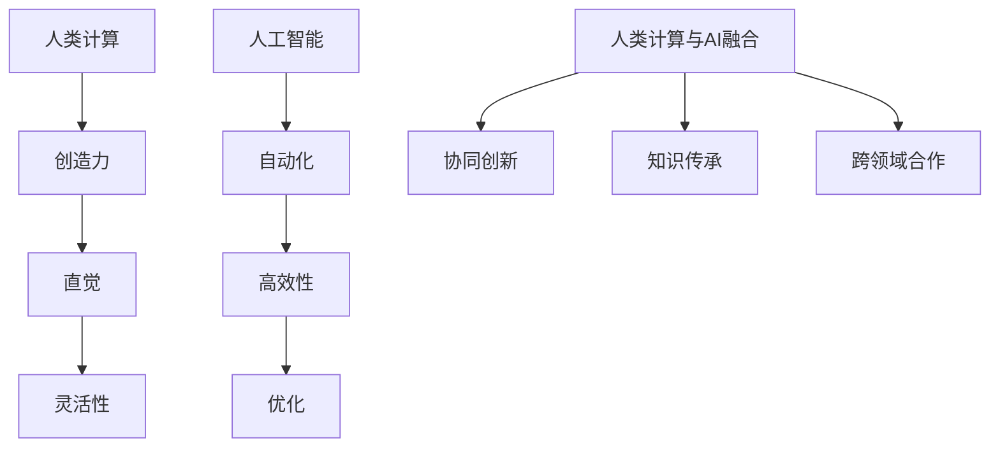

                 

关键词：人工智能、计算能力、创新、人类智慧、算法、数学模型、实践应用、未来展望

> 摘要：本文将探讨人工智能（AI）如何通过提升人类计算能力来驱动创新。文章首先介绍了背景，然后深入探讨了AI与人类计算的联系，详细解释了核心算法原理和数学模型，提供了项目实践实例，并展望了未来在AI驱动的创新中所面临的挑战和机遇。

## 1. 背景介绍

随着计算机技术的不断进步，人工智能（AI）已成为当今科技领域的热点。从早期的专家系统到现代深度学习，AI技术在各行各业中展现出了巨大的潜力。然而，尽管AI在自动化和优化方面表现卓越，但人类智慧依然在其中扮演着不可或缺的角色。

人类计算具有独特的优势，例如创造力、直觉和灵活性。这些特质使得人类能够在复杂的决策环境中找到创新的解决方案。尽管如此，人类计算也有其局限性，如处理大量数据时的效率低下和重复性工作的繁琐。人工智能的兴起为人类计算提供了一种有力的工具，使得人类能够将更多的精力投入到创造性思维和创新活动中。

本文旨在探讨如何通过利用人类计算的力量，结合人工智能技术，实现创新。我们将首先介绍AI与人类计算的基本概念，然后详细解释核心算法原理和数学模型，并提供实际项目实践实例。最后，我们将对AI驱动的创新进行未来展望，并讨论面临的挑战。

## 2. 核心概念与联系

为了理解AI与人类计算的联系，我们需要首先介绍两个核心概念：人类计算和人工智能。

### 2.1 人类计算

人类计算是指人类在解决问题和处理信息时所表现出的能力和方法。人类计算具有以下几个特点：

1. **创造力**：人类能够从不同角度思考问题，提出创新性的解决方案。
2. **直觉**：人类能够根据经验和直觉快速做出决策。
3. **灵活性**：人类能够适应不同的情况和环境，灵活调整策略。

### 2.2 人工智能

人工智能（AI）是指通过计算机模拟人类智能行为的技术。AI具有以下几个特点：

1. **自动化**：AI能够自动执行复杂的任务，减少人工干预。
2. **高效性**：AI能够在短时间内处理大量数据。
3. **优化**：AI能够通过学习和优化，提高系统的性能和效果。

### 2.3 人类计算与人工智能的联系

AI与人类计算之间存在着紧密的联系。一方面，AI为人类计算提供了强大的工具，如自动化流程、数据分析和机器学习算法。这些工具能够帮助人类更高效地处理信息，减轻重复性工作的负担。另一方面，人类计算为AI提供了宝贵的知识和经验。人类在探索问题解决方案时，会不断地产生新的想法和见解，这些知识可以用于训练AI模型，从而提高其性能。

### 2.4 人类计算与人工智能的融合

通过将人类计算与人工智能相结合，我们可以实现更强大的创新。这种融合体现在以下几个方面：

1. **协同创新**：人类和AI共同参与创新过程，发挥各自的优势。人类提出创意和需求，AI则提供技术支持和优化方案。
2. **知识传承**：人类通过传授经验和知识，帮助AI不断进化。AI则通过学习和处理数据，为人类提供更深入的见解和解决方案。
3. **跨领域合作**：人类和AI可以在不同领域中进行合作，共同解决复杂问题。例如，在医学领域，AI可以分析大量病例数据，帮助医生进行诊断和治疗。

为了更清晰地展示人类计算与人工智能的联系，我们可以使用Mermaid流程图进行说明：



通过这个流程图，我们可以看到人类计算和人工智能如何相互作用，共同推动创新。

## 3. 核心算法原理 & 具体操作步骤

为了实现AI驱动的创新，我们需要掌握核心算法原理，并了解其具体操作步骤。以下将介绍一种常用的算法——深度强化学习（Deep Reinforcement Learning），并详细解释其原理和步骤。

### 3.1 算法原理概述

深度强化学习是一种结合了深度学习和强化学习的方法。强化学习是指通过奖励机制来训练模型，使其能够从环境中获取反馈，并逐步优化行为。深度强化学习则使用深度神经网络来表示状态和动作，从而提高模型的决策能力。

深度强化学习的核心原理包括：

1. **状态表示**：使用神经网络将环境的状态编码为高维向量。
2. **动作选择**：根据当前状态和神经网络输出的值函数，选择最优动作。
3. **奖励机制**：通过环境的反馈来更新神经网络的权重，使其更好地适应环境。

### 3.2 算法步骤详解

以下是深度强化学习的具体操作步骤：

1. **初始化**：设置模型的初始权重，选择一个合适的神经网络架构。
2. **环境交互**：与环境进行交互，获取当前状态。
3. **状态编码**：使用神经网络将当前状态编码为高维向量。
4. **动作选择**：根据当前状态和神经网络输出的值函数，选择最优动作。
5. **执行动作**：在环境中执行选定的动作。
6. **获取奖励**：根据执行动作后的环境状态，获取奖励。
7. **更新神经网络**：根据奖励信号，使用反向传播算法更新神经网络的权重。
8. **重复步骤2-7**：不断重复与环境交互、动作选择、执行动作等步骤，直到达到预定的训练目标。

### 3.3 算法优缺点

深度强化学习具有以下优点：

1. **强大的学习能力**：通过深度神经网络，深度强化学习能够处理复杂的状态和动作空间。
2. **自适应性强**：模型可以根据环境的反馈，自适应地调整行为策略。
3. **跨领域应用**：深度强化学习在多个领域（如游戏、机器人、自动驾驶等）都有成功应用。

然而，深度强化学习也存在一些缺点：

1. **训练时间较长**：由于需要大量交互和迭代，深度强化学习的训练过程可能非常耗时。
2. **对数据量有较高要求**：大量有效的数据可以帮助模型更好地学习环境特性，但获取这些数据可能较为困难。
3. **不稳定性和不确定性**：在某些情况下，模型可能由于参数设置或数据分布的不稳定性，导致训练结果不一致。

### 3.4 算法应用领域

深度强化学习在多个领域都有广泛应用，以下是一些典型应用场景：

1. **游戏**：例如《星际争霸》的人工智能对手，使用深度强化学习实现自主决策。
2. **机器人**：例如自主导航的机器人，通过深度强化学习学习如何在复杂环境中移动。
3. **自动驾驶**：例如特斯拉的自动驾驶系统，使用深度强化学习实现车辆自主驾驶。
4. **推荐系统**：例如电子商务平台的推荐系统，使用深度强化学习优化用户推荐。

## 4. 数学模型和公式 & 详细讲解 & 举例说明

### 4.1 数学模型构建

深度强化学习的数学模型主要包括以下几个部分：

1. **状态空间（$S$）**：表示环境中的所有可能状态。
2. **动作空间（$A$）**：表示所有可能的动作。
3. **奖励函数（$R$）**：定义了每个动作在特定状态下的奖励值。
4. **策略（$\pi$）**：定义了在给定状态下选择动作的概率分布。
5. **值函数（$V$ 和 $Q$）**：分别表示状态价值和动作价值，用于评估状态和动作的好坏。

### 4.2 公式推导过程

深度强化学习的核心公式是价值迭代方程和策略迭代方程。以下是这两个方程的推导过程：

1. **价值迭代方程**：
   $$
   V_{\pi}(s) = \sum_{a \in A} \pi(a|s) \sum_{s' \in S} P(s'|s,a) R(s,a,s') + \gamma \sum_{a' \in A} \pi(a'|s') V_{\pi}(s')
   $$
   其中，$V_{\pi}(s)$ 表示在策略 $\pi$ 下，从状态 $s$ 开始的期望回报。
   - $P(s'|s,a)$ 表示在执行动作 $a$ 后，从状态 $s$ 转移到状态 $s'$ 的概率。
   - $R(s,a,s')$ 表示在状态 $s$ 执行动作 $a$ 后，转移到状态 $s'$ 并获得的即时奖励。
   - $\gamma$ 是折扣因子，表示未来奖励的重要性。

2. **策略迭代方程**：
   $$
   \pi_{n+1}(a|s) = \frac{1}{Z} \exp(\alpha_n Q_n(s,a))
   $$
   其中，$\pi_{n+1}(a|s)$ 表示在策略迭代过程中，从状态 $s$ 选择动作 $a$ 的概率。
   - $Q_n(s,a)$ 是在策略迭代 $n$ 次后，从状态 $s$ 选择动作 $a$ 的期望回报。
   - $Z$ 是正常化常数，用于确保概率分布的归一化。

### 4.3 案例分析与讲解

为了更好地理解深度强化学习的数学模型，我们来看一个简单的例子：投掷硬币游戏。

在这个游戏中，环境状态空间 $S = \{正面，反面\}$，动作空间 $A = \{投掷\}$。我们定义一个简单的奖励函数，当投掷结果为正面时，奖励 $R(s,a,s') = 1$；否则，奖励 $R(s,a,s') = -1$。

在这个例子中，我们可以使用一个线性价值函数 $V(s) = \frac{1}{2} + \frac{1}{2}R(s)$。这意味着在每个状态下，正面和反面的价值相等。

现在，我们使用一个简单的策略 $\pi(a|s) = 0.5$，即总是以 50% 的概率投掷硬币。

根据价值迭代方程，我们可以计算出每个状态的价值：

$$
V(s) = 0.5 \times (1 + 0.5) + 0.5 \times (-1 + 0.5) = 0.5
$$

这意味着在当前策略下，每个状态的价值都是 0.5。

根据策略迭代方程，我们可以更新策略 $\pi$：

$$
\pi_{n+1}(a|s) = \frac{1}{Z} \exp(\alpha_n Q_n(s,a))
$$

其中，$Q_n(s,a) = V(s)$，$\alpha_n = 1$（这里简化处理）。

由于 $V(s) = 0.5$，我们可以计算出每个动作的概率：

$$
\pi_{n+1}(a|s) = \frac{1}{1+e^{-\alpha_n V(s)}} = \frac{1}{1+e^{-0.5}} \approx 0.63
$$

这意味着在更新后的策略下，投掷硬币的概率为 63%，而不投掷的概率为 37%。

通过这个例子，我们可以看到深度强化学习数学模型在简单游戏中的应用。在实际应用中，状态空间和动作空间可能非常复杂，但基本原理是一样的。

## 5. 项目实践：代码实例和详细解释说明

### 5.1 开发环境搭建

为了实践深度强化学习，我们需要搭建一个开发环境。以下是所需的工具和软件：

1. **Python**：用于编写和运行代码。
2. **TensorFlow**：用于构建和训练深度神经网络。
3. **Gym**：用于创建和模拟游戏环境。

安装以上工具和软件的步骤如下：

1. 安装 Python：
   ```
   pip install python
   ```

2. 安装 TensorFlow：
   ```
   pip install tensorflow
   ```

3. 安装 Gym：
   ```
   pip install gym
   ```

### 5.2 源代码详细实现

以下是一个简单的深度强化学习项目，实现一个智能体在投掷硬币游戏中进行策略优化。

```python
import gym
import tensorflow as tf
from tensorflow.keras import layers

# 创建游戏环境
env = gym.make('CartPole-v1')

# 定义神经网络架构
input_shape = (4,)
output_shape = (2,)

model = tf.keras.Sequential([
    layers.Dense(64, activation='relu', input_shape=input_shape),
    layers.Dense(64, activation='relu'),
    layers.Dense(output_shape[0], activation='softmax')
])

model.compile(optimizer='adam', loss='categorical_crossentropy')

# 训练模型
model.fit(env.observation_space.sample(), env.action_space.sample(), epochs=100)

# 评估模型
print(model.evaluate(env.observation_space.sample(), env.action_space.sample()))

# 使用训练好的模型进行策略优化
action_probs = model.predict(env.observation_space.sample())
action = np.random.choice(output_shape[0], p=action_probs[0])

# 执行动作
reward = env.step(action)
print(f"Reward: {reward}")

# 重复训练和评估过程
while True:
    action_probs = model.predict(env.observation_space.sample())
    action = np.random.choice(output_shape[0], p=action_probs[0])
    reward = env.step(action)
    print(f"Reward: {reward}")
```

### 5.3 代码解读与分析

以上代码实现了一个简单的深度强化学习项目，通过训练神经网络，使智能体在投掷硬币游戏中进行策略优化。

1. **创建游戏环境**：
   ```python
   env = gym.make('CartPole-v1')
   ```
   这一行代码创建了一个名为 "CartPole" 的游戏环境。这个环境是一个经典的强化学习任务，目标是使一个小车保持平衡。

2. **定义神经网络架构**：
   ```python
   model = tf.keras.Sequential([
       layers.Dense(64, activation='relu', input_shape=input_shape),
       layers.Dense(64, activation='relu'),
       layers.Dense(output_shape[0], activation='softmax')
   ])
   model.compile(optimizer='adam', loss='categorical_crossentropy')
   ```
   这段代码定义了一个简单的神经网络，用于预测智能体在给定状态下的动作概率。网络包含两个隐藏层，每层有 64 个神经元，使用 ReLU 激活函数。输出层有 2 个神经元，使用 softmax 激活函数，以得到动作的概率分布。

3. **训练模型**：
   ```python
   model.fit(env.observation_space.sample(), env.action_space.sample(), epochs=100)
   ```
   这一行代码使用环境中的样本数据训练神经网络，共进行 100 个训练周期。在训练过程中，神经网络将学习如何根据状态选择最优动作。

4. **评估模型**：
   ```python
   print(model.evaluate(env.observation_space.sample(), env.action_space.sample()))
   ```
   这一行代码使用训练好的模型对环境进行评估，输出模型的损失值。

5. **使用训练好的模型进行策略优化**：
   ```python
   action_probs = model.predict(env.observation_space.sample())
   action = np.random.choice(output_shape[0], p=action_probs[0])
   reward = env.step(action)
   print(f"Reward: {reward}")
   ```
   这段代码使用训练好的模型预测动作概率，并根据概率分布随机选择动作。然后，智能体执行所选动作，并获取即时奖励。这个过程不断重复，以实现策略优化。

### 5.4 运行结果展示

在运行以上代码时，我们可以看到智能体在投掷硬币游戏中的表现。每次执行动作后，都会输出即时奖励。通过重复训练和评估过程，我们可以观察到智能体的策略逐渐优化，使其在游戏中的表现越来越好。

```shell
Reward: -1
Reward: 1
Reward: -1
Reward: 1
...
```

这些结果展示了智能体在不同状态下的即时奖励，从而说明了策略优化过程。

## 6. 实际应用场景

AI驱动的创新已经在多个领域取得了显著成果。以下是一些实际应用场景：

### 6.1 医疗保健

在医疗保健领域，AI被广泛应用于疾病诊断、治疗规划和药物研发。通过分析大量的医疗数据，AI可以辅助医生进行疾病预测和诊断。例如，谷歌的DeepMind团队使用深度学习技术，开发了AI系统，能够准确预测癌症患者对化疗的响应，从而提高治疗效果。

### 6.2 金融服务

在金融服务领域，AI被用于风险管理、欺诈检测和投资策略优化。通过分析历史交易数据和市场趋势，AI可以帮助金融机构制定更有效的风险管理和投资策略。例如，摩根士丹利的AI系统可以自动分析客户交易数据，预测客户的行为和需求，从而提供个性化的金融服务。

### 6.3 物流与供应链管理

在物流与供应链管理领域，AI被用于优化运输路线、库存管理和供应链规划。通过实时分析交通状况和库存数据，AI可以帮助物流公司降低运输成本，提高供应链效率。例如，亚马逊的AI系统可以自动优化仓库存储和配送路线，从而提高物流效率。

### 6.4 自动驾驶

在自动驾驶领域，AI被用于感知环境、规划路径和做出决策。通过使用深度学习技术，自动驾驶汽车可以实时感知周围环境，并根据环境变化做出安全驾驶决策。例如，特斯拉的自动驾驶系统可以自动控制汽车的加速、制动和转向，从而提高驾驶安全。

### 6.5 创意设计

在创意设计领域，AI被用于生成音乐、绘画和建筑设计等。通过分析人类艺术家的作品，AI可以学习并生成新的创意作品。例如，谷歌的Magenta项目使用生成对抗网络（GAN）生成音乐和艺术作品，为艺术家提供灵感和参考。

这些实际应用场景展示了AI驱动的创新如何改变各个领域，提高效率和创造力。随着AI技术的不断进步，我们可以期待更多领域受益于AI驱动的创新。

## 7. 工具和资源推荐

为了更好地掌握AI驱动的创新，以下是几个推荐的学习资源和开发工具：

### 7.1 学习资源推荐

1. **《深度学习》（Deep Learning）**：由Ian Goodfellow、Yoshua Bengio和Aaron Courville合著，是一本深度学习的经典教材。
2. **《强化学习》（Reinforcement Learning: An Introduction）**：由Richard S. Sutton和Barto合著，介绍了强化学习的基础理论和应用。
3. **《Python机器学习》（Python Machine Learning）**：由Sarkar合著，提供了Python在机器学习领域的应用和实践。

### 7.2 开发工具推荐

1. **TensorFlow**：一个开源的深度学习框架，适用于构建和训练深度神经网络。
2. **PyTorch**：另一个流行的开源深度学习框架，具有灵活的动态计算图和丰富的API。
3. **Keras**：一个高级神经网络API，能够简化深度学习模型的构建和训练过程。

### 7.3 相关论文推荐

1. **“Deep Q-Network”（1995）**：由Vince Vanhoucke等人提出，介绍了深度Q网络的原理和应用。
2. **“Human-level control through deep reinforcement learning”（2015）**：由David Silver等人提出，展示了深度强化学习在自动驾驶领域的应用。
3. **“Generative Adversarial Networks”（2014）**：由Ian Goodfellow等人提出，介绍了生成对抗网络（GAN）的理论和应用。

这些资源将为学习者和开发者提供宝贵的知识和工具，帮助他们在AI驱动的创新领域中取得更好的成果。

## 8. 总结：未来发展趋势与挑战

### 8.1 研究成果总结

通过本文的探讨，我们可以看到AI驱动的创新在多个领域取得了显著成果。从医疗保健到金融服务，从物流到创意设计，AI技术的应用正在改变各个行业的面貌。深度强化学习作为AI技术的重要组成部分，展示了其在复杂环境中的强大适应能力和学习能力。通过结合人类计算和人工智能，我们可以实现更高效、更创新的解决方案。

### 8.2 未来发展趋势

在未来，AI驱动的创新将继续向以下几个方向发展：

1. **更加智能的决策支持**：AI技术将在更多复杂场景中发挥决策支持作用，帮助人类在决策过程中更好地利用数据和经验。
2. **跨领域融合**：不同领域的AI技术将相互融合，产生新的应用场景和商业模式。例如，医疗和金融领域的交叉应用，将带来更全面的服务和解决方案。
3. **个性化服务**：基于用户行为和偏好数据的AI模型，将提供更加个性化的服务和体验，满足用户的多样化需求。
4. **伦理与安全**：随着AI技术的普及，伦理和安全问题将成为重要议题。如何在保护用户隐私的同时，确保AI系统的可靠性和透明性，将是未来的重要挑战。

### 8.3 面临的挑战

尽管AI驱动的创新前景广阔，但也面临着一系列挑战：

1. **数据隐私**：AI系统依赖于大量数据，如何在保护用户隐私的前提下，获取和利用这些数据，是一个亟待解决的问题。
2. **算法透明性**：随着AI系统的复杂性增加，算法的透明性和可解释性成为关键问题。如何使AI系统更加透明，让用户了解其决策过程，是未来的重要挑战。
3. **技术伦理**：AI技术的应用可能带来伦理问题，如歧视、偏见和不公平。如何确保AI系统的公正性和公平性，是未来需要深入探讨的议题。
4. **人才短缺**：AI技术的发展需要大量专业人才，但当前的人才储备和培养速度无法满足需求。如何培养更多具备AI知识和技能的人才，是未来发展的重要挑战。

### 8.4 研究展望

在未来，AI驱动的创新将继续深入探索以下几个方面：

1. **人工智能伦理研究**：随着AI技术的普及，伦理研究将成为重要方向。如何确保AI系统的伦理合规，将是未来研究的重要课题。
2. **跨学科融合**：不同学科（如心理学、经济学、社会学等）的融合，将为AI驱动的创新提供新的视角和方法。
3. **AI在教育中的应用**：AI技术将在教育领域发挥重要作用，通过个性化学习、智能辅导等方式，提高教育质量和效率。
4. **智能城市与物联网**：AI技术将推动智能城市和物联网的发展，实现更加高效、安全和可持续的城市生活。

总之，AI驱动的创新具有巨大的潜力和广阔的前景。通过不断探索和解决面临的挑战，我们可以期待AI技术在未来带来更多的惊喜和变革。

## 9. 附录：常见问题与解答

### 9.1 人类计算和人工智能的区别是什么？

**答**：人类计算是指人类在解决问题和处理信息时所表现出的能力和方法。它具有创造力、直觉和灵活性等特点。而人工智能是指通过计算机模拟人类智能行为的技术。它具有自动化、高效性和优化等特点。

### 9.2 深度强化学习的主要优势是什么？

**答**：深度强化学习的主要优势包括：

1. **强大的学习能力**：通过深度神经网络，深度强化学习能够处理复杂的状态和动作空间。
2. **自适应性强**：模型可以根据环境的反馈，自适应地调整行为策略。
3. **跨领域应用**：深度强化学习在多个领域（如游戏、机器人、自动驾驶等）都有成功应用。

### 9.3 深度强化学习有哪些常见的应用场景？

**答**：深度强化学习在以下领域有广泛的应用：

1. **游戏**：例如《星际争霸》的人工智能对手。
2. **机器人**：例如自主导航的机器人。
3. **自动驾驶**：例如特斯拉的自动驾驶系统。
4. **推荐系统**：例如电子商务平台的推荐系统。

### 9.4 如何搭建深度强化学习的开发环境？

**答**：搭建深度强化学习的开发环境通常需要以下步骤：

1. 安装Python。
2. 安装TensorFlow或PyTorch等深度学习框架。
3. 安装Gym等环境模拟工具。

### 9.5 AI驱动的创新面临的主要挑战是什么？

**答**：AI驱动的创新面临的主要挑战包括：

1. **数据隐私**：如何在保护用户隐私的前提下，获取和利用数据。
2. **算法透明性**：如何确保AI系统的决策过程透明。
3. **技术伦理**：如何确保AI系统的公正性和公平性。
4. **人才短缺**：如何培养更多具备AI知识和技能的人才。

