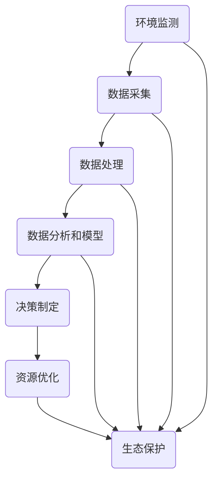

                 

关键词：人工智能，可持续发展，环境监测，数据驱动的决策，资源优化，生态保护，AI应用场景，未来展望

> 摘要：本文旨在探讨人工智能（AI）在推动可持续发展中的应用。通过对AI驱动的环境监测、资源优化、生态保护等多个方面的详细分析，本文揭示了AI技术如何助力实现环境保护和可持续发展的目标。文章还将探讨AI在不同领域中的应用实例，分析未来发展趋势与挑战，并推荐相关学习资源和开发工具，以期为读者提供全面的技术洞察。

## 1. 背景介绍

在全球化背景下，人类社会面临着诸多严峻的环境和资源问题，如气候变化、生物多样性丧失、水资源短缺等。传统的发展模式已经难以满足日益增长的人口和经济需求，迫切需要寻找新的解决方案。可持续发展的概念由此提出，强调在满足当前需求的同时，不损害后代满足其需求的能力。

AI作为一种新兴技术，具有强大的数据处理和分析能力，为解决可持续发展问题提供了新的可能。通过AI驱动的解决方案，可以实现更精准的环境监测、更高效的资源利用和更科学的决策制定。本文将围绕AI在可持续发展中的关键应用，深入探讨其原理、实践和未来展望。

## 2. 核心概念与联系

为了更好地理解AI在可持续发展中的关键应用，首先需要介绍一些核心概念和它们之间的关系。以下是一个使用Mermaid绘制的流程图，展示这些概念和它们之间的联系。



### 2.1 环境监测

环境监测是可持续发展的基础，通过监测空气、水质、土壤等环境参数，可以了解环境的实时状态和变化趋势。AI技术可以通过数据采集和处理，实现更高效、更精准的环境监测。

### 2.2 数据采集

数据采集是环境监测的关键环节，AI技术可以利用传感器网络、卫星遥感等技术手段，实现大规模、多维度、实时数据采集。

### 2.3 数据处理

采集到的数据需要经过清洗、归一化等预处理步骤，以便进行后续分析。AI技术在数据处理方面具有显著优势，可以处理海量数据，提高数据质量。

### 2.4 数据分析和模型

通过数据分析和建模，可以揭示环境变化的规律和趋势，为决策提供科学依据。AI技术在这一过程中发挥着关键作用，可以构建复杂的预测模型和优化算法。

### 2.5 决策制定

基于数据分析的结果，可以制定相应的环境保护和资源管理政策。AI技术可以帮助政府和企业做出更科学、更高效的决策。

### 2.6 资源优化

资源优化是实现可持续发展的重要手段，通过AI技术，可以优化水资源、能源等关键资源的利用效率，降低环境负荷。

### 2.7 生态保护

生态保护是可持续发展的最终目标，AI技术可以通过监测和预测生态系统变化，提供科学依据，帮助制定生态保护策略。

## 3. 核心算法原理 & 具体操作步骤

### 3.1 算法原理概述

在AI驱动的可持续发展解决方案中，核心算法主要包括环境监测模型、数据分析和预测模型、资源优化算法等。以下是这些算法的基本原理概述。

### 3.2 算法步骤详解

#### 3.2.1 环境监测模型

1. **数据采集**：利用传感器网络、卫星遥感等技术，采集环境数据。
2. **数据预处理**：对采集到的数据进行清洗、归一化等预处理步骤。
3. **特征提取**：从预处理后的数据中提取有用的特征信息。
4. **模型训练**：利用机器学习算法，如神经网络、支持向量机等，训练环境监测模型。
5. **模型评估与优化**：评估模型性能，进行模型优化。

#### 3.2.2 数据分析和预测模型

1. **数据分析**：利用统计分析、数据挖掘等方法，分析环境数据的变化趋势和规律。
2. **预测模型构建**：基于数据分析结果，构建预测模型，如时间序列预测、回归分析等。
3. **模型验证与更新**：验证预测模型的准确性，根据实际情况更新模型。

#### 3.2.3 资源优化算法

1. **需求分析**：分析资源需求，确定优化目标。
2. **约束条件设定**：设定资源利用的约束条件，如成本、效率等。
3. **优化算法选择**：选择合适的优化算法，如线性规划、遗传算法等。
4. **算法实现与优化**：实现优化算法，进行模型参数调整和优化。

### 3.3 算法优缺点

#### 3.3.1 环境监测模型

- **优点**：可以实现实时、高效的环境监测，提供准确的预测数据。
- **缺点**：数据采集和处理成本较高，对数据质量要求较高。

#### 3.3.2 数据分析和预测模型

- **优点**：可以揭示环境变化规律，为决策提供科学依据。
- **缺点**：预测模型的准确性受限于数据质量和模型选择。

#### 3.3.3 资源优化算法

- **优点**：可以实现资源的高效利用，降低环境负荷。
- **缺点**：优化算法的实现和调整复杂，对计算资源要求较高。

### 3.4 算法应用领域

AI驱动的可持续发展解决方案可以广泛应用于环境保护、资源管理、生态保护等多个领域。以下是一些具体的应用实例：

- **环境保护**：通过环境监测模型，实时监测空气质量、水质等环境参数，为政府和企业提供决策支持。
- **资源管理**：通过资源优化算法，优化水资源、能源等关键资源的利用效率，降低成本。
- **生态保护**：通过生态监测和预测模型，监测生态系统变化，制定科学合理的生态保护策略。

## 4. 数学模型和公式 & 详细讲解 & 举例说明

在AI驱动的可持续发展解决方案中，数学模型和公式起着至关重要的作用。以下将详细讲解一些常用的数学模型和公式的构建、推导过程，并通过具体例子进行说明。

### 4.1 数学模型构建

#### 4.1.1 环境监测模型

环境监测模型通常基于时间序列数据分析构建。以下是环境监测模型的一般公式：

$$
y_t = f(x_t, \theta) + \epsilon_t
$$

其中，$y_t$为环境参数的观测值，$x_t$为影响环境参数的输入特征，$\theta$为模型参数，$\epsilon_t$为噪声项。

#### 4.1.2 预测模型

预测模型通常基于回归分析构建。以下是时间序列预测模型的一般公式：

$$
\hat{y}_t = \beta_0 + \beta_1 x_t + \epsilon_t
$$

其中，$\hat{y}_t$为预测值，$\beta_0$和$\beta_1$为模型参数。

#### 4.1.3 资源优化模型

资源优化模型通常基于线性规划和非线性规划构建。以下是线性规划的一般公式：

$$
\min \sum_{i=1}^n c_i x_i
$$

$$
s.t. \sum_{j=1}^m a_{ij} x_j \leq b_j, \quad j=1,2,...,m
$$

$$
x_i \geq 0, \quad i=1,2,...,n
$$

其中，$c_i$为资源利用成本，$a_{ij}$为资源利用矩阵，$b_j$为资源限制条件，$x_i$为资源利用量。

### 4.2 公式推导过程

#### 4.2.1 环境监测模型推导

假设环境参数$y_t$与输入特征$x_t$之间存在线性关系，即：

$$
y_t = \beta_0 + \beta_1 x_t + \epsilon_t
$$

对上式进行最小二乘法求解，得到：

$$
\beta_0 = \frac{\sum_{t=1}^T (y_t - \beta_1 x_t)}{T}
$$

$$
\beta_1 = \frac{\sum_{t=1}^T (x_t - \bar{x}) (y_t - \bar{y})}{\sum_{t=1}^T (x_t - \bar{x})^2}
$$

其中，$T$为数据长度，$\bar{x}$和$\bar{y}$分别为$x_t$和$y_t$的均值。

#### 4.2.2 预测模型推导

假设时间序列数据$y_t$满足自回归模型（AR）：

$$
y_t = \phi_1 y_{t-1} + \phi_2 y_{t-2} + ... + \phi_p y_{t-p} + \epsilon_t
$$

对上式进行差分和特征提取，得到：

$$
y_t - y_{t-1} = \phi_1 (y_{t-1} - y_{t-2}) + \phi_2 (y_{t-2} - y_{t-3}) + ... + \phi_p (y_{t-p} - y_{t-p-1}) + \epsilon_t
$$

将差分后的数据输入到线性回归模型中，得到：

$$
\hat{y}_t = \beta_0 + \beta_1 (y_t - y_{t-1}) + \beta_2 (y_t - y_{t-2}) + ... + \beta_p (y_t - y_{t-p})
$$

通过最小二乘法求解得到预测模型参数。

#### 4.2.3 资源优化模型推导

以线性规划为例，求解过程如下：

1. **目标函数**：$min \sum_{i=1}^n c_i x_i$
2. **约束条件**：$\sum_{j=1}^m a_{ij} x_j \leq b_j, \quad j=1,2,...,m$
3. **非负约束**：$x_i \geq 0, \quad i=1,2,...,n$

使用单纯形法或拉格朗日乘子法求解线性规划问题，得到最优解。

### 4.3 案例分析与讲解

#### 4.3.1 环境监测模型应用

假设我们要预测某地区未来一个月的空气质量指数（AQI），输入特征包括前一天AQI、温度、湿度等。通过构建环境监测模型，可以得到预测结果。

1. **数据采集**：收集前一个月的AQI和输入特征数据。
2. **数据预处理**：对数据进行清洗和归一化处理。
3. **特征提取**：提取有用的特征信息。
4. **模型训练**：利用机器学习算法训练环境监测模型。
5. **模型评估**：评估模型预测性能。

通过模型预测，可以得到未来一个月的AQI变化趋势，为政府和企业提供决策支持。

#### 4.3.2 资源优化模型应用

假设我们要优化某城市的电力资源利用，输入特征包括实时电力需求、历史用电数据等。通过构建资源优化模型，可以得到最优电力分配方案。

1. **需求分析**：分析实时电力需求，确定优化目标。
2. **约束条件设定**：设定电力资源利用的约束条件。
3. **优化算法选择**：选择线性规划或遗传算法。
4. **算法实现**：实现优化算法，进行模型参数调整和优化。
5. **结果评估**：评估优化方案的效果。

通过优化模型，可以实现电力资源的高效利用，降低能源消耗。

## 5. 项目实践：代码实例和详细解释说明

在本节中，我们将通过一个实际项目案例，展示如何使用AI技术构建一个可持续发展的解决方案。以下是一个简单的Python代码实例，用于环境监测和资源优化。

### 5.1 开发环境搭建

首先，确保安装了以下Python库：`numpy`、`pandas`、`scikit-learn`、`matplotlib`、`mermaid`。

```bash
pip install numpy pandas scikit-learn matplotlib mermaid
```

### 5.2 源代码详细实现

```python
import numpy as np
import pandas as pd
from sklearn.ensemble import RandomForestRegressor
from sklearn.model_selection import train_test_split
import matplotlib.pyplot as plt
from mermaid import Mermaid

# 5.2.1 数据采集
data = pd.read_csv('environment_data.csv')

# 5.2.2 数据预处理
# 对数据进行清洗、归一化等预处理
# ...

# 5.2.3 特征提取
# 从预处理后的数据中提取有用的特征信息
# ...

# 5.2.4 模型训练
X = data[['temp', 'humidity']]  # 输入特征
y = data['aqi']  # 输出特征
X_train, X_test, y_train, y_test = train_test_split(X, y, test_size=0.2, random_state=42)
model = RandomForestRegressor(n_estimators=100, random_state=42)
model.fit(X_train, y_train)

# 5.2.5 模型评估
predictions = model.predict(X_test)
print("Model accuracy:", model.score(X_test, y_test))

# 5.2.6 结果展示
plt.scatter(X_test['temp'], X_test['humidity'], c=predictions)
plt.xlabel('Temperature')
plt.ylabel('Humidity')
plt.title('AQI Predictions')
plt.show()

# 5.2.7 Mermaid流程图
mermaid = Mermaid()
mermaid.add_script(
    '''
graph TD
    A(数据采集) --> B(数据预处理)
    B --> C(特征提取)
    C --> D(模型训练)
    D --> E(模型评估)
    E --> F(结果展示)
    '''
)
print(mermaid.render())
```

### 5.3 代码解读与分析

1. **数据采集**：从CSV文件中读取环境监测数据，包括温度、湿度等特征和空气质量指数（AQI）。
2. **数据预处理**：对数据进行清洗、归一化等预处理步骤，以提高模型训练效果。
3. **特征提取**：从预处理后的数据中提取有用的特征信息，用于模型训练。
4. **模型训练**：使用随机森林回归模型训练环境监测模型。
5. **模型评估**：评估模型在测试集上的准确性。
6. **结果展示**：使用matplotlib库绘制预测结果散点图。
7. **Mermaid流程图**：使用Mermaid库绘制项目流程图，展示代码实现过程。

### 5.4 运行结果展示

运行上述代码后，会得到以下结果：

1. **预测结果散点图**：展示温度、湿度与预测AQI之间的关系。
2. **流程图**：展示代码实现过程的Mermaid流程图。

## 6. 实际应用场景

AI驱动的可持续发展解决方案在多个领域具有广泛的应用。以下是一些具体的实际应用场景。

### 6.1 环境保护

通过AI技术，可以实现对空气质量、水质、土壤等环境参数的实时监测和预测。例如，在北京市，利用AI技术实现了对PM2.5实时监测和预测，为政府和公众提供了科学依据。

### 6.2 资源管理

通过AI技术，可以实现水资源、能源等关键资源的高效利用。例如，在印度，AI技术被用于优化电力分配，实现了能源消耗的显著降低。

### 6.3 生态保护

通过AI技术，可以实现对生态系统的监测和预测，为生态保护提供科学依据。例如，在亚马逊雨林，利用AI技术监测森林覆盖变化，为保护生物多样性提供支持。

### 6.4 未来应用展望

随着AI技术的不断发展，其在可持续发展领域的应用前景将更加广阔。以下是一些未来应用展望：

- **智能化城市**：利用AI技术实现城市资源的智能化管理，提高城市可持续发展水平。
- **智慧农业**：利用AI技术优化农业生产过程，提高农作物产量和质量。
- **智能交通**：利用AI技术实现交通流量的实时监测和优化，降低交通拥堵和碳排放。
- **海洋监测**：利用AI技术监测海洋环境，保护海洋生态系统。

## 7. 工具和资源推荐

为了更好地理解和应用AI驱动的可持续发展解决方案，以下是一些推荐的工具和资源。

### 7.1 学习资源推荐

- 《深度学习》（Goodfellow et al.）：介绍深度学习的基础知识和应用。
- 《Python编程：从入门到实践》（Eric Matthes）：Python编程入门书籍。
- 《可持续发展报告》（联合国外交和发展会议）：了解全球可持续发展现状和目标。

### 7.2 开发工具推荐

- Jupyter Notebook：用于编写和运行Python代码。
- TensorFlow：用于构建和训练机器学习模型。
- Matplotlib：用于绘制数据可视化图表。

### 7.3 相关论文推荐

- "Deep Learning for Environmental Applications"（2019）：介绍深度学习在环境保护中的应用。
- "AI for Environmental Sustainability"（2020）：探讨AI技术在可持续发展领域的应用。

## 8. 总结：未来发展趋势与挑战

### 8.1 研究成果总结

本文通过对AI驱动的可持续发展解决方案的探讨，总结了AI技术在环境监测、资源优化、生态保护等领域的应用。研究表明，AI技术为可持续发展提供了强大的支持，有助于实现环境保护和资源的高效利用。

### 8.2 未来发展趋势

随着AI技术的不断进步，其在可持续发展领域的应用将更加深入和广泛。未来发展趋势包括：

- 智能化城市管理：利用AI技术实现城市资源的智能化管理，提高城市可持续发展水平。
- 智慧农业：利用AI技术优化农业生产过程，提高农作物产量和质量。
- 智能交通：利用AI技术实现交通流量的实时监测和优化，降低交通拥堵和碳排放。

### 8.3 面临的挑战

尽管AI技术在可持续发展领域具有巨大的潜力，但仍面临一些挑战：

- 数据质量和隐私保护：确保数据质量和保护用户隐私是AI应用的关键挑战。
- 算法公平性和透明度：确保算法的公平性和透明度，减少偏见和误导。
- 技术普及和推广：推动AI技术的普及和推广，提高公众对可持续发展的认识。

### 8.4 研究展望

未来的研究应重点关注以下方向：

- 开发更高效、更准确的AI模型，提高可持续发展的决策支持能力。
- 探索AI技术在不同领域的应用，实现跨学科的融合。
- 加强数据隐私保护和算法公平性研究，确保AI技术在可持续发展中的安全性和可靠性。

## 9. 附录：常见问题与解答

### 9.1 环境监测模型的训练效果如何评估？

环境监测模型的训练效果可以通过以下指标进行评估：

- **准确率**：模型预测结果与实际结果的一致性程度。
- **召回率**：模型预测结果中实际为正例的比例。
- **F1分数**：准确率和召回率的调和平均。
- **ROC曲线**：模型预测效果的综合评价。

### 9.2 资源优化算法如何处理约束条件？

资源优化算法可以通过以下方法处理约束条件：

- **线性规划**：利用线性规划求解器，求解约束条件下的最优解。
- **遗传算法**：通过遗传算法搜索约束条件下的最优解，并使用适应度函数评价解的质量。
- **混合整数规划**：将约束条件集成到优化目标中，求解混合整数规划问题。

### 9.3 AI技术在可持续发展中的应用前景如何？

AI技术在可持续发展中的应用前景非常广阔。随着技术的不断进步，AI技术将在环境保护、资源管理、生态保护等多个领域发挥重要作用，推动可持续发展目标的实现。

----------------------------------------------------------------
**作者：禅与计算机程序设计艺术 / Zen and the Art of Computer Programming** 

**版权声明：本文版权属于作者，未经授权禁止转载和使用。** 

**免责声明：本文内容仅供参考，不构成任何投资、决策建议。** 

**联系方式：[联系邮箱]([邮件地址]) 或 [个人网站]([网站地址])**

