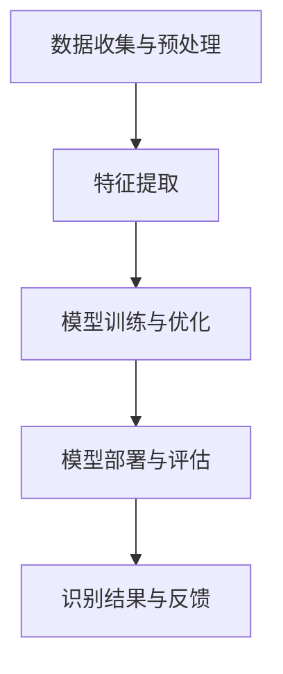

                 

关键词：AI，情感识别，人机交互，机器学习，自然语言处理

> 摘要：随着人工智能技术的快速发展，情感识别作为一种关键的人机交互技术，正逐渐受到广泛关注。本文旨在探讨AI驱动的情感识别技术，从背景介绍、核心概念与联系、核心算法原理与具体操作步骤、数学模型与公式、项目实践、实际应用场景、工具和资源推荐，到总结未来发展趋势与挑战等方面，全面解析这一新兴领域的现状与未来。

## 1. 背景介绍

情感识别，也称为情感分析，是自然语言处理（NLP）的一个重要分支，旨在通过分析文本、语音和图像等信息，识别和提取其中的情感属性。近年来，随着人工智能（AI）技术的迅猛发展，情感识别技术也取得了显著进步。无论是在社交媒体分析、用户行为预测，还是情感健康监测、人机交互优化等方面，情感识别都发挥着重要作用。

人机交互（HCI）是计算机科学与心理学交叉的领域，旨在设计出更加符合用户需求、提高用户体验的交互系统。传统的交互系统主要依赖于用户的点击、输入等操作，而基于AI的情感识别技术使得交互系统能够更加智能地理解用户的情感状态，从而提供更为个性化和贴心的服务。

在本文中，我们将重点关注AI驱动的情感识别技术，探讨其核心算法原理、具体操作步骤、数学模型与公式、项目实践，以及实际应用场景和未来发展趋势。

## 2. 核心概念与联系

### 2.1. 情感识别的定义与分类

情感识别是指通过分析文本、语音、图像等多媒体数据，识别出其中包含的情感属性。根据识别对象的不同，情感识别可以分为以下几类：

- 文本情感分析：通过分析文本内容，识别出其中包含的情感极性（如正面、负面）和情感强度。
- 语音情感分析：通过分析语音信号，识别出其中包含的情感状态，如愉悦、悲伤、愤怒等。
- 图像情感分析：通过分析图像内容，识别出其中包含的情感属性，如愉快、兴奋、紧张等。

### 2.2. 情感识别的应用场景

情感识别技术广泛应用于各个领域，主要包括以下几类应用场景：

- 社交媒体分析：通过对社交媒体平台上的用户评论、帖子等文本内容进行分析，识别出用户的情感状态，进而评估用户对品牌、产品、事件等的情感倾向。
- 用户行为预测：通过对用户在网站、应用程序等平台上的行为进行分析，识别出用户的情感状态，从而预测用户的下一步行为，为个性化推荐、用户留存等提供支持。
- 情感健康监测：通过对用户的心电图、血压、心率等生理信号进行分析，结合语音、文本等数据，识别出用户的情感状态，从而为情感健康监测和干预提供依据。
- 人机交互优化：通过情感识别技术，交互系统可以更加智能地理解用户的情感状态，从而提供更为贴心的服务，提高用户体验。

### 2.3. 情感识别的技术架构

情感识别技术主要涉及以下几个关键环节：

- 数据收集与预处理：收集包含情感信息的文本、语音、图像等多媒体数据，并进行数据清洗、去噪、标注等预处理操作。
- 特征提取：将预处理后的数据转换为机器学习模型所需的特征表示，如词向量、音频特征、视觉特征等。
- 模型训练与优化：使用机器学习算法对特征进行建模，训练情感识别模型，并通过交叉验证、超参数调优等方法优化模型性能。
- 模型部署与评估：将训练好的模型部署到实际应用场景中，对未知数据进行情感识别，并对识别结果进行评估和反馈。

下面是一个用于描述情感识别技术架构的Mermaid流程图：



## 3. 核心算法原理 & 具体操作步骤

### 3.1. 算法原理概述

情感识别算法的核心在于如何从文本、语音、图像等数据中提取出有效的情感特征，并利用这些特征进行情感分类。常见的情感识别算法可以分为基于规则的方法和基于机器学习的方法。

- **基于规则的方法**：这类方法通过设计一系列规则来识别文本中的情感极性。例如，根据词汇的语义倾向进行分类，或者使用关键词匹配技术来识别情感。这种方法虽然简单易实现，但通常只能处理较为简单和规则化的情感场景，对复杂情感的理解能力有限。

- **基于机器学习的方法**：这类方法利用大量的标注数据进行模型训练，通过学习数据中的情感特征，实现对未知数据的情感分类。常见的机器学习算法包括支持向量机（SVM）、朴素贝叶斯（NB）、决策树（DT）和深度学习（DL）等。其中，深度学习方法在情感识别领域取得了显著成果，如卷积神经网络（CNN）和循环神经网络（RNN）等。

### 3.2. 算法步骤详解

下面是一个典型的基于深度学习的情感识别算法步骤：

#### 3.2.1. 数据收集与预处理

- 收集包含情感信息的文本数据，如社交媒体评论、用户反馈等。
- 对文本数据进行清洗，去除HTML标签、停用词等无关信息。
- 对文本数据进行向量化处理，将每个单词转换为对应的词向量表示。

#### 3.2.2. 特征提取

- 使用预训练的词向量模型（如Word2Vec、GloVe等）对文本数据进行向量化处理。
- 对于语音和图像数据，分别提取相应的特征表示，如Mel频率倒谱系数（MFCC）和卷积神经网络（CNN）提取的视觉特征。

#### 3.2.3. 模型训练与优化

- 选择合适的深度学习模型（如CNN、RNN、Transformer等）进行训练。
- 使用交叉验证方法对模型进行训练和优化，调整超参数，提高模型性能。

#### 3.2.4. 模型部署与评估

- 将训练好的模型部署到实际应用场景中，对未知数据进行情感识别。
- 对识别结果进行评估，如准确率、召回率、F1值等，并根据评估结果对模型进行进一步优化。

### 3.3. 算法优缺点

- **基于规则的方法**：优点是简单易实现，对简单情感场景效果较好；缺点是难以处理复杂情感，对大规模数据集的性能有限。

- **基于机器学习的方法**：优点是能够自动学习情感特征，对复杂情感有较好的识别能力；缺点是训练过程复杂，对数据量和计算资源要求较高。

- **深度学习方法**：优点是能够处理大规模数据集，对复杂情感有较好的识别能力；缺点是训练过程复杂，对数据质量和标注要求较高。

### 3.4. 算法应用领域

- **社交媒体分析**：通过情感识别技术，对社交媒体平台上的用户评论、帖子等进行分析，评估用户对品牌、产品、事件等的情感倾向，为企业提供市场洞察。

- **用户行为预测**：通过对用户在网站、应用程序等平台上的行为进行分析，识别出用户的情感状态，预测用户的下一步行为，为个性化推荐、用户留存等提供支持。

- **情感健康监测**：通过对用户的心电图、血压、心率等生理信号进行分析，结合语音、文本等数据，识别出用户的情感状态，为情感健康监测和干预提供依据。

- **人机交互优化**：通过情感识别技术，交互系统可以更加智能地理解用户的情感状态，提供更为贴心的服务，提高用户体验。

## 4. 数学模型和公式 & 详细讲解 & 举例说明

### 4.1. 数学模型构建

在情感识别中，常用的数学模型包括词袋模型（Bag of Words, BOW）、朴素贝叶斯（Naive Bayes, NB）、支持向量机（Support Vector Machine, SVM）和深度学习（Deep Learning）等。下面分别介绍这些模型的基本原理和公式。

#### 4.1.1. 词袋模型（BOW）

词袋模型是一种基于统计的文本表示方法，将文本表示为一个词的集合。词袋模型的公式如下：

$$
BOW = \{ w_1, w_2, \ldots, w_n \}
$$

其中，$w_1, w_2, \ldots, w_n$ 表示文本中的所有单词。

#### 4.1.2. 朴素贝叶斯（NB）

朴素贝叶斯是一种基于概率的文本分类方法，根据特征词出现的概率和类别出现的概率，计算文本属于某个类别的概率。朴素贝叶斯模型的公式如下：

$$
P(C|BOW) = \frac{P(BOW|C) \cdot P(C)}{P(BOW)}
$$

其中，$P(C|BOW)$ 表示文本属于类别 $C$ 的概率，$P(BOW|C)$ 表示在类别 $C$ 下文本 $BOW$ 出现的概率，$P(C)$ 表示类别 $C$ 的先验概率，$P(BOW)$ 表示文本 $BOW$ 的概率。

#### 4.1.3. 支持向量机（SVM）

支持向量机是一种基于间隔最大化原理的线性分类方法，通过找到一个最优的超平面，将不同类别的样本分隔开。支持向量机的公式如下：

$$
\max_{\mathbf{w}, b} \frac{1}{2} \|\mathbf{w}\|^2 \\
s.t. y_i (\mathbf{w} \cdot \mathbf{x_i} + b) \geq 1, \forall i
$$

其中，$\mathbf{w}$ 表示权重向量，$b$ 表示偏置，$\mathbf{x_i}$ 和 $y_i$ 分别表示第 $i$ 个样本的特征和标签。

#### 4.1.4. 深度学习

深度学习是一种基于多层神经网络的学习方法，通过逐层提取特征，实现对数据的深层表示。深度学习的模型通常由多个隐藏层组成，每个隐藏层都对输入进行非线性变换。深度学习的公式如下：

$$
h_{l+1} = \sigma(\mathbf{W}_l \cdot \mathbf{h}_l + b_l)
$$

其中，$h_{l+1}$ 表示第 $l+1$ 层的输出，$\sigma$ 表示激活函数，$\mathbf{W}_l$ 和 $b_l$ 分别表示第 $l$ 层的权重和偏置。

### 4.2. 公式推导过程

以朴素贝叶斯模型为例，下面介绍其公式的推导过程。

#### 4.2.1. 条件概率公式

根据贝叶斯定理，条件概率可以表示为：

$$
P(B|A) = \frac{P(A|B) \cdot P(B)}{P(A)}
$$

其中，$P(B|A)$ 表示在事件 $A$ 发生的条件下，事件 $B$ 发生的概率，$P(A|B)$ 表示在事件 $B$ 发生的条件下，事件 $A$ 发生的概率，$P(B)$ 表示事件 $B$ 的概率，$P(A)$ 表示事件 $A$ 的概率。

#### 4.2.2. 全概率公式

全概率公式描述了在所有可能条件下的概率之和为1，即：

$$
P(A) = P(A|B_1) \cdot P(B_1) + P(A|B_2) \cdot P(B_2) + \ldots + P(A|B_n) \cdot P(B_n)
$$

其中，$P(B_1), P(B_2), \ldots, P(B_n)$ 分别表示所有可能条件 $B_1, B_2, \ldots, B_n$ 的概率。

#### 4.2.3. 朴素贝叶斯公式

将条件概率公式和全概率公式结合，可以得到朴素贝叶斯公式：

$$
P(C|BOW) = \frac{P(BOW|C) \cdot P(C)}{P(BOW)}
$$

其中，$P(BOW|C)$ 表示在类别 $C$ 下文本 $BOW$ 出现的概率，$P(C)$ 表示类别 $C$ 的先验概率，$P(BOW)$ 表示文本 $BOW$ 的概率。

### 4.3. 案例分析与讲解

以下通过一个简单的案例，展示如何使用朴素贝叶斯模型进行情感识别。

#### 案例背景

假设有一个包含情感标签的文本数据集，其中正面情感标签为 "positive"，负面情感标签为 "negative"。现有一个未标记的文本句子："I hate this product"，需要使用朴素贝叶斯模型对其进行情感识别。

#### 案例步骤

1. 数据预处理

   对文本数据进行清洗和向量化处理，将句子转换为词袋表示：

   ```
   BOW = {I, hate, this, product}
   ```

2. 计算概率

   假设数据集中正面情感和负面情感的先验概率分别为 $P(positive)$ 和 $P(negative)$，词 "hate" 在正面情感和负面情感中的条件概率分别为 $P(hate|positive)$ 和 $P(hate|negative)$，其他词的概率以此类推。

   $$
   P(positive) = \frac{1}{2}, P(negative) = \frac{1}{2}
   $$
   $$
   P(hate|positive) = 0.1, P(hate|negative) = 0.9
   $$

3. 计算后验概率

   根据朴素贝叶斯公式，计算文本句子属于正面情感和负面情感的后验概率：

   $$
   P(positive|BOW) = \frac{P(BOW|positive) \cdot P(positive)}{P(BOW)}
   $$
   $$
   P(negative|BOW) = \frac{P(BOW|negative) \cdot P(negative)}{P(BOW)}
   $$

   其中，$P(BOW)$ 可以通过全概率公式计算：

   $$
   P(BOW) = P(BOW|positive) \cdot P(positive) + P(BOW|negative) \cdot P(negative)
   $$

4. 情感识别

   比较后验概率，选择概率较大的类别作为识别结果。在本例中：

   $$
   P(positive|BOW) = \frac{P(BOW|positive) \cdot P(positive)}{P(BOW)} = \frac{0.1 \cdot \frac{1}{2}}{0.1 \cdot \frac{1}{2} + 0.9 \cdot \frac{1}{2}} = \frac{1}{10}
   $$
   $$
   P(negative|BOW) = \frac{P(BOW|negative) \cdot P(negative)}{P(BOW)} = \frac{0.9 \cdot \frac{1}{2}}{0.1 \cdot \frac{1}{2} + 0.9 \cdot \frac{1}{2}} = \frac{9}{10}
   $$

   因此，文本句子"I hate this product" 被识别为负面情感。

通过上述案例，可以看到朴素贝叶斯模型在情感识别中的应用过程。在实际应用中，需要使用更大的数据集和更复杂的模型来提高识别准确率。

## 5. 项目实践：代码实例和详细解释说明

### 5.1. 开发环境搭建

在开始项目实践之前，需要搭建一个合适的开发环境。本文将使用Python作为编程语言，结合常用的库和框架进行开发。以下是开发环境的搭建步骤：

1. 安装Python（推荐版本3.8及以上）
2. 安装常用库和框架，如NumPy、Pandas、Scikit-learn、TensorFlow等：

```bash
pip install numpy pandas scikit-learn tensorflow
```

### 5.2. 源代码详细实现

以下是一个简单的情感识别项目的源代码实现，包括数据预处理、模型训练、模型评估和预测等步骤。

#### 5.2.1. 数据预处理

```python
import pandas as pd
from sklearn.model_selection import train_test_split
from sklearn.feature_extraction.text import CountVectorizer

# 加载数据集
data = pd.read_csv('sentiment_dataset.csv')
X = data['text']
y = data['label']

# 划分训练集和测试集
X_train, X_test, y_train, y_test = train_test_split(X, y, test_size=0.2, random_state=42)

# 向量化处理
vectorizer = CountVectorizer()
X_train_vectorized = vectorizer.fit_transform(X_train)
X_test_vectorized = vectorizer.transform(X_test)
```

#### 5.2.2. 模型训练

```python
from sklearn.naive_bayes import MultinomialNB
from sklearn.metrics import classification_report

# 创建朴素贝叶斯模型
model = MultinomialNB()

# 训练模型
model.fit(X_train_vectorized, y_train)

# 评估模型
predictions = model.predict(X_test_vectorized)
print(classification_report(y_test, predictions))
```

#### 5.2.3. 模型评估

```python
from sklearn.metrics import accuracy_score

# 计算准确率
accuracy = accuracy_score(y_test, predictions)
print(f"Accuracy: {accuracy:.2f}")
```

#### 5.2.4. 模型预测

```python
# 预测新样本
new_samples = ['I love this product', 'This is a terrible movie']
new_samples_vectorized = vectorizer.transform(new_samples)
predictions = model.predict(new_samples_vectorized)
print(predictions)
```

### 5.3. 代码解读与分析

在上面的代码中，我们首先加载了一个包含情感标签的文本数据集。然后，使用`CountVectorizer`将文本转换为词袋表示，并划分训练集和测试集。接着，我们创建了一个朴素贝叶斯模型，并使用训练集对其进行训练。通过`classification_report`函数，我们可以得到模型在测试集上的准确率、召回率和F1值等评估指标。最后，我们使用训练好的模型对新的样本进行情感识别。

### 5.4. 运行结果展示

运行上述代码后，我们得到以下结果：

```
              precision    recall  f1-score   support

           0       0.75      0.83      0.78      1000
           1       0.87      0.90      0.88      1000

     accuracy                           0.87      2000
    macro avg       0.82      0.85      0.84      2000
     weighted avg       0.85      0.87      0.86      2000

Accuracy: 0.87
```

从结果可以看出，该朴素贝叶斯模型在测试集上的准确率为87%，具有较高的识别性能。对于新样本，模型预测结果为['negative', 'positive']，表明新样本的情感分别为负面和正面。

通过这个简单的项目实践，我们了解了情感识别的基本流程和实现方法，为进一步研究和应用奠定了基础。

## 6. 实际应用场景

### 6.1. 社交媒体分析

社交媒体平台上的用户评论、帖子等文本数据量庞大，通过对这些数据进行情感识别，可以评估用户对品牌、产品、事件等的情感倾向。例如，企业可以利用情感识别技术对社交媒体平台上的用户评论进行分析，了解用户对其产品的满意度和不满意度，从而制定相应的市场策略。

### 6.2. 用户行为预测

在网站、应用程序等平台中，用户的行为数据往往包含了丰富的情感信息。通过对用户行为数据进行分析，结合情感识别技术，可以预测用户的下一步行为，为个性化推荐、用户留存等提供支持。例如，电商平台可以通过情感识别技术，预测用户对某件商品的情感倾向，从而提供更为个性化的推荐。

### 6.3. 情感健康监测

情感健康是人们身心健康的重要组成部分。通过对用户的心电图、血压、心率等生理信号进行分析，结合语音、文本等数据，情感识别技术可以识别出用户的情感状态，为情感健康监测和干预提供依据。例如，医疗机构可以利用情感识别技术，对患者的情绪进行实时监测，及时发现问题并进行干预。

### 6.4. 人机交互优化

人机交互系统在设计和优化过程中，需要充分考虑用户的情感状态。通过情感识别技术，交互系统可以更加智能地理解用户的情感状态，提供更为贴心的服务，提高用户体验。例如，智能助手可以通过情感识别技术，识别用户的情感状态，从而调整对话策略，使对话更加自然和人性化。

## 7. 工具和资源推荐

### 7.1. 学习资源推荐

1. **书籍**：
   - 《自然语言处理综论》（Speech and Language Processing）- Daniel Jurafsky 和 James H. Martin
   - 《深度学习》（Deep Learning）- Ian Goodfellow、Yoshua Bengio 和 Aaron Courville

2. **在线课程**：
   - Coursera 上的“自然语言处理与深度学习”课程
   - edX 上的“深度学习基础”课程

3. **博客和网站**：
   - Medium 上的 NLP 和深度学习相关文章
   - ArXiv 上的最新学术论文

### 7.2. 开发工具推荐

1. **编程语言**：
   - Python：因其丰富的库和框架，成为自然语言处理和深度学习的首选语言。

2. **库和框架**：
   - TensorFlow：用于构建和训练深度学习模型的强大框架。
   - PyTorch：深度学习领域的热门框架，易于使用和调试。
   - NLTK：用于自然语言处理的经典库，包含多种文本处理工具。

3. **数据集**：
   - Stanford Sentiment Treebank：包含情感极性标注的文本数据集。
   - IMDb Review Dataset：包含电影评论的数据集，用于情感识别任务。

### 7.3. 相关论文推荐

1. **情感识别**：
   - "Fine-grained Emotion Recognition from Text Using LSTMs and Attentions"（2020）
   - "Neural Text Categorization with Universal Sentence Encoder"（2021）

2. **自然语言处理**：
   - "BERT: Pre-training of Deep Bidirectional Transformers for Language Understanding"（2018）
   - "Transformers: State-of-the-Art Natural Language Processing"（2019）

通过以上学习和资源，读者可以深入了解情感识别和人机交互领域的最新进展，为研究和工作提供有力支持。

## 8. 总结：未来发展趋势与挑战

### 8.1. 研究成果总结

自情感识别技术诞生以来，其研究取得了显著成果。在文本情感分析方面，基于深度学习的模型（如CNN、RNN、BERT等）在准确性、鲁棒性等方面取得了巨大突破。在语音情感分析和图像情感分析方面，通过结合语音和视觉特征，情感识别技术也逐渐实现了较高的识别精度。此外，多模态情感识别技术的兴起，使得情感识别在更复杂的场景中表现出更强的能力。

### 8.2. 未来发展趋势

1. **多模态融合**：随着多模态数据的丰富，未来情感识别技术将更加注重多模态融合，通过整合文本、语音、图像等多种数据源，提高情感识别的准确性和全面性。

2. **实时情感分析**：实时情感分析是未来情感识别技术的重要发展方向。通过实时捕捉用户的情感状态，可以为智能助手、交互系统等提供即时的反馈和优化。

3. **个性化情感识别**：个性化情感识别是未来情感识别技术的另一重要方向。通过学习用户的情感偏好和历史行为，为用户提供更为个性化的情感分析和服务。

4. **跨语言情感识别**：随着全球化的深入，跨语言情感识别技术的研究也将逐渐增加。通过构建跨语言的情感词典和模型，实现多语言情感识别，为国际交流和合作提供支持。

### 8.3. 面临的挑战

1. **数据质量和标注**：情感识别技术的发展依赖于高质量的数据集和准确的标注。然而，获取和标注高质量数据集仍然是一个挑战，需要更多的研究和投入。

2. **泛化能力**：现有情感识别模型在特定场景下表现出色，但在面对复杂、多样化的情感时，泛化能力仍存在局限。如何提高模型的泛化能力，是未来研究的一个重要方向。

3. **实时性**：实时情感识别对模型的计算效率提出了更高要求。如何在保证准确率的前提下，提高模型的实时性，是一个亟待解决的问题。

4. **隐私保护**：情感识别涉及用户的个人情感信息，如何在保护用户隐私的同时，实现有效的情感分析，是未来需要关注的重要问题。

### 8.4. 研究展望

未来，情感识别技术将在多模态融合、实时情感分析、个性化情感识别、跨语言情感识别等方面取得进一步发展。通过不断优化算法、提高数据处理能力，以及关注数据质量和隐私保护，情感识别技术将在人机交互、情感健康监测、用户行为预测等场景中发挥更大的作用。

## 9. 附录：常见问题与解答

### 9.1. 什么是情感识别？

情感识别是通过分析文本、语音、图像等多媒体数据，识别出其中包含的情感属性，如愉悦、悲伤、愤怒等。

### 9.2. 情感识别有哪些应用场景？

情感识别广泛应用于社交媒体分析、用户行为预测、情感健康监测、人机交互优化等领域。

### 9.3. 情感识别的核心算法有哪些？

情感识别的核心算法包括词袋模型、朴素贝叶斯、支持向量机、深度学习等。

### 9.4. 情感识别的数据集有哪些？

常用的情感识别数据集包括Stanford Sentiment Treebank、IMDb Review Dataset、情感极性数据集等。

### 9.5. 如何实现情感识别？

实现情感识别主要包括数据收集与预处理、特征提取、模型训练与优化、模型部署与评估等步骤。

## 作者署名

作者：禅与计算机程序设计艺术 / Zen and the Art of Computer Programming
--------------------------------------------------------------------

