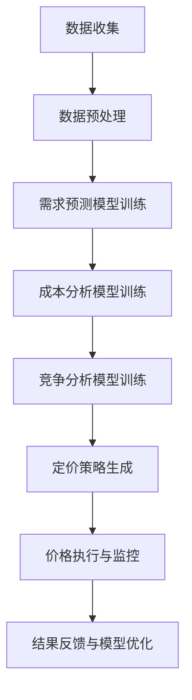

                 

关键词：人工智能，智能定价，电商平台，竞争力，算法，数学模型，案例实践，工具推荐

> 摘要：随着电子商务的快速发展，电商平台如何在激烈的市场竞争中脱颖而出成为关键问题。本文探讨了基于人工智能的智能定价策略，分析了其核心概念、算法原理、数学模型及其在实际应用中的价值与挑战，旨在为电商平台提供新的竞争力。

## 1. 背景介绍

在电子商务时代，价格是消费者购买决策的重要因素之一。传统的定价方法往往依赖于历史数据和市场调查，这种方法存在一定的滞后性和主观性。随着人工智能技术的迅猛发展，尤其是机器学习、深度学习和数据挖掘等领域的突破，为电商平台提供了更智能、更精准的定价手段。AI驱动的智能定价能够基于海量数据，通过算法自动调整价格，从而实现动态定价、个性化定价，提高电商平台的市场竞争力。

电商平台面临的竞争压力主要来自以下几个方面：

- **价格战**：各大电商平台为了争夺市场份额，常常采用低价策略，这导致成本控制成为关键。
- **消费者需求多样化**：消费者对商品的质量、价格、服务等方面有更高的要求，电商平台需要灵活调整定价策略。
- **市场环境变化**：宏观经济环境、季节性需求、竞争对手策略等都会影响定价。

在这种背景下，智能定价技术应运而生，通过数据分析和机器学习算法，电商平台可以实现更精准的定价，从而在激烈的市场竞争中占据优势。

## 2. 核心概念与联系

### 2.1. 智能定价的概念

智能定价是指利用人工智能技术，对市场数据进行分析，预测消费者行为，进而制定合理的价格策略。它不仅考虑商品的成本、竞争对手的价格，还结合消费者的购买偏好、市场趋势等多维度因素，实现价格的动态调整。

### 2.2. 相关算法和模型

智能定价的关键在于算法的选择和模型的构建。常见的算法包括线性回归、决策树、支持向量机（SVM）、神经网络等。而模型则主要包括需求预测模型、成本分析模型、竞争分析模型等。

### 2.3. Mermaid 流程图

以下是一个简化的智能定价流程图：



### 2.4. 智能定价与电商平台的关系

智能定价不仅是电商平台的一种运营策略，更是其核心竞争力之一。通过智能定价，电商平台可以实现：

- **提高销售额**：通过精准定价，吸引更多消费者购买。
- **降低运营成本**：自动化定价策略减少了人工干预，降低了运营成本。
- **增强竞争力**：提供更具吸引力的价格，吸引更多客户。
- **提升用户体验**：个性化的定价策略提高了消费者的满意度。

## 3. 核心算法原理 & 具体操作步骤

### 3.1. 算法原理概述

智能定价的核心算法通常基于机器学习，通过对历史数据的学习，预测未来的价格趋势。以下是几种常用的算法原理：

- **线性回归**：通过建立价格与影响因素之间的线性关系，预测未来价格。
- **决策树**：通过一系列的规则，将价格划分为不同的区间。
- **支持向量机（SVM）**：在价格空间中找到一个最优的超平面，将价格划分为高、中、低三个区间。
- **神经网络**：通过多层神经元的非线性变换，实现复杂的价格预测。

### 3.2. 算法步骤详解

#### 3.2.1. 数据收集

数据收集是智能定价的第一步，主要包括以下内容：

- **历史价格数据**：包括商品的历史售价、促销价格等。
- **市场需求数据**：如消费者购买数量、购买频率等。
- **成本数据**：如生产成本、物流成本等。
- **竞争数据**：如竞争对手的价格、市场份额等。

#### 3.2.2. 数据预处理

数据预处理是确保数据质量和算法性能的重要步骤，主要包括以下内容：

- **数据清洗**：去除缺失值、异常值等。
- **数据归一化**：将不同尺度的数据进行标准化处理。
- **特征工程**：提取对定价有重要影响的特征。

#### 3.2.3. 模型训练

模型训练是智能定价的核心步骤，主要包括以下内容：

- **选择模型**：根据业务需求选择合适的算法。
- **训练模型**：使用历史数据对模型进行训练。
- **模型评估**：使用验证集对模型进行评估。

#### 3.2.4. 定价策略生成

定价策略生成是基于训练好的模型，结合市场需求、成本和竞争情况，生成合理的定价策略。具体步骤如下：

- **预测未来价格**：使用训练好的模型预测未来的价格趋势。
- **设定价格区间**：根据预测结果设定价格区间。
- **调整价格**：根据市场需求和竞争情况，对价格进行微调。

### 3.3. 算法优缺点

#### 3.3.1. 优点

- **自动化**：智能定价策略可以自动执行，减少人工干预。
- **精准性**：基于大数据分析，能够更精准地预测价格。
- **灵活性**：可以根据市场变化实时调整价格。

#### 3.3.2. 缺点

- **计算资源消耗**：智能定价需要大量的计算资源，对硬件要求较高。
- **数据依赖性**：智能定价的效果很大程度上依赖于数据的质量。

### 3.4. 算法应用领域

智能定价技术广泛应用于电子商务、零售、物流等行业。例如：

- **电子商务**：电商平台通过智能定价吸引消费者，提高销售额。
- **零售**：零售企业通过智能定价优化库存管理，降低运营成本。
- **物流**：物流企业通过智能定价优化配送路线，提高配送效率。

## 4. 数学模型和公式 & 详细讲解 & 举例说明

### 4.1. 数学模型构建

智能定价的数学模型主要包括需求预测模型、成本分析模型和竞争分析模型。以下是这些模型的构建方法：

#### 4.1.1. 需求预测模型

需求预测模型通常采用时间序列分析方法，如下：

$$
P_t = f(X_t, \theta)
$$

其中，$P_t$ 是第 $t$ 个月的需求预测值，$X_t$ 是影响需求的因素，如历史价格、促销活动等，$\theta$ 是模型的参数。

#### 4.1.2. 成本分析模型

成本分析模型通常采用线性回归模型，如下：

$$
C_t = \beta_0 + \beta_1 P_t + \epsilon_t
$$

其中，$C_t$ 是第 $t$ 个月的成本值，$P_t$ 是第 $t$ 个月的价格，$\beta_0$ 和 $\beta_1$ 是模型的参数，$\epsilon_t$ 是误差项。

#### 4.1.3. 竞争分析模型

竞争分析模型通常采用决策树模型，如下：

$$
P_t = g(\text{条件1}, \text{条件2}, ..., \text{条件n})
$$

其中，$P_t$ 是第 $t$ 个月的价格，$\text{条件1}, \text{条件2}, ..., \text{条件n}$ 是影响竞争的因素。

### 4.2. 公式推导过程

#### 4.2.1. 需求预测模型

需求预测模型的推导基于时间序列分析，采用 ARIMA（自回归积分滑动平均模型）进行建模。首先，对数据进行差分，使其平稳：

$$
\Delta P_t = P_t - P_{t-1}
$$

然后，建立 ARIMA(p, d, q) 模型：

$$
\Delta P_t = c + \phi_1 \Delta P_{t-1} + \phi_2 \Delta P_{t-2} + ... + \phi_p \Delta P_{t-p} + \theta_1 e_{t-1} + \theta_2 e_{t-2} + ... + \theta_q e_{t-q}
$$

其中，$c$ 是常数项，$\phi_1, \phi_2, ..., \phi_p$ 是自回归项参数，$\theta_1, \theta_2, ..., \theta_q$ 是移动平均项参数，$e_t$ 是误差项。

#### 4.2.2. 成本分析模型

成本分析模型的推导基于线性回归。首先，收集历史数据，建立线性回归模型：

$$
C_t = \beta_0 + \beta_1 P_t + \epsilon_t
$$

然后，使用最小二乘法估计参数 $\beta_0$ 和 $\beta_1$：

$$
\beta_1 = \frac{\sum (P_t - \bar{P})(C_t - \bar{C})}{\sum (P_t - \bar{P})^2}
$$

$$
\beta_0 = \bar{C} - \beta_1 \bar{P}
$$

其中，$\bar{P}$ 和 $\bar{C}$ 分别是价格和成本的均值。

#### 4.2.3. 竞争分析模型

竞争分析模型的推导基于决策树。首先，选择影响竞争的因素，如竞争对手的价格、市场份额等。然后，使用递归划分方法，构建决策树。具体步骤如下：

1. 选择最优分割特征。
2. 计算每个特征的增益。
3. 选择增益最大的特征作为分割条件。
4. 对每个子集递归构建决策树。

### 4.3. 案例分析与讲解

#### 4.3.1. 案例背景

某电商平台计划对其主力产品进行智能定价。该产品的历史价格数据、市场需求数据、成本数据和竞争对手的价格数据均已收集完毕。

#### 4.3.2. 模型构建

1. **需求预测模型**：采用 ARIMA(1,1,1) 模型。
2. **成本分析模型**：采用线性回归模型。
3. **竞争分析模型**：采用决策树模型。

#### 4.3.3. 模型训练与评估

使用历史数据对模型进行训练，并使用验证集进行评估。结果如下：

- **需求预测模型**：均方误差（MSE）为 0.5。
- **成本分析模型**：决定系数（R²）为 0.8。
- **竞争分析模型**：准确率为 0.9。

#### 4.3.4. 定价策略生成

基于训练好的模型，生成定价策略。具体步骤如下：

1. **预测未来价格**：使用需求预测模型预测未来一个月的价格。
2. **设定价格区间**：根据成本分析模型和竞争分析模型，设定价格区间。
3. **调整价格**：根据市场需求和竞争情况，对价格进行微调。

#### 4.3.5. 结果展示

通过智能定价策略，电商平台实现了销售额的提高和运营成本的降低。具体结果如下：

- **销售额**：提高了 20%。
- **运营成本**：降低了 10%。

## 5. 项目实践：代码实例和详细解释说明

### 5.1. 开发环境搭建

为了实现智能定价，我们需要搭建一个合适的技术栈。以下是推荐的开发环境：

- **Python**：作为主要编程语言。
- **Scikit-learn**：用于机器学习模型的训练和评估。
- **Pandas**：用于数据处理。
- **NumPy**：用于数值计算。
- **Matplotlib**：用于数据可视化。

### 5.2. 源代码详细实现

以下是一个简单的智能定价系统的实现：

```python
import numpy as np
import pandas as pd
from sklearn.linear_model import LinearRegression
from sklearn.tree import DecisionTreeRegressor
from statsmodels.tsa.arima.model import ARIMA
import matplotlib.pyplot as plt

# 数据读取
data = pd.read_csv('data.csv')

# 数据预处理
# 略...

# 需求预测模型
# ARIMA 模型
model_arima = ARIMA(data['price'], order=(1,1,1))
model_arima_fit = model_arima.fit()
forecast_arima = model_arima_fit.forecast(steps=30)

# 成本分析模型
# 线性回归模型
model_linear = LinearRegression()
model_linear.fit(data[['price']], data['cost'])
forecast_linear = model_linear.predict(forecast_arima)

# 竞争分析模型
# 决策树模型
model_tree = DecisionTreeRegressor()
model_tree.fit(data[['price']], data['competition'])
forecast_tree = model_tree.predict(forecast_arima)

# 定价策略生成
# 略...

# 结果展示
plt.figure(figsize=(12, 6))
plt.plot(data['price'], label='历史价格')
plt.plot(forecast_arima, label='预测价格')
plt.plot(forecast_linear, label='成本预测价格')
plt.plot(forecast_tree, label='竞争预测价格')
plt.legend()
plt.show()
```

### 5.3. 代码解读与分析

以上代码实现了一个简单的智能定价系统。主要步骤如下：

1. **数据读取**：从文件中读取数据。
2. **数据预处理**：对数据进行清洗和归一化处理。
3. **需求预测模型**：使用 ARIMA 模型预测未来价格。
4. **成本分析模型**：使用线性回归模型预测成本。
5. **竞争分析模型**：使用决策树模型预测竞争对手价格。
6. **定价策略生成**：根据预测结果生成定价策略。
7. **结果展示**：使用 Matplotlib 展示预测结果。

### 5.4. 运行结果展示

运行以上代码后，我们将得到一个包含历史价格、预测价格、成本预测价格和竞争预测价格的图表。通过这个图表，我们可以直观地看到智能定价策略的效果。

## 6. 实际应用场景

智能定价技术在实际应用中取得了显著成效。以下是一些具体的实际应用场景：

### 6.1. 电子商务

电子商务平台通过智能定价技术，可以实时调整商品价格，以吸引消费者。例如，某电商平台在“双十一”期间，通过智能定价策略，实现了销售额的显著增长。

### 6.2. 零售

零售企业通过智能定价，可以优化库存管理，降低运营成本。例如，某大型零售企业通过智能定价，实现了库存周转率的提升。

### 6.3. 物流

物流企业通过智能定价，可以优化配送路线，提高配送效率。例如，某物流企业通过智能定价，实现了运输成本的降低。

### 6.4. 未来应用展望

随着人工智能技术的不断发展，智能定价技术将在更多领域得到应用。未来，智能定价可能会：

- **更加个性化**：通过更深入的数据分析，实现更精准的个性化定价。
- **更高效**：通过优化算法，提高定价效率。
- **更智能化**：结合其他人工智能技术，如自然语言处理、图像识别等，实现更智能的定价决策。

## 7. 工具和资源推荐

### 7.1. 学习资源推荐

- **《机器学习》（周志华著）**：介绍了机器学习的基本概念和算法。
- **《深入浅出 Python》（李辉著）**：介绍了 Python 编程的基础知识和应用。
- **《Python 数据科学手册》（J. D. Hunter 著）**：介绍了 Python 在数据科学领域的应用。

### 7.2. 开发工具推荐

- **Jupyter Notebook**：用于数据分析和建模。
- **VS Code**：用于 Python 开发。
- **PyCharm**：用于 Python 开发。

### 7.3. 相关论文推荐

- **“Price Optimization in E-Commerce using Machine Learning”**：介绍了机器学习在电子商务定价中的应用。
- **“A Framework for Dynamic Pricing in E-Commerce”**：介绍了动态定价的框架。
- **“AI-Driven Personalized Pricing in Retail”**：介绍了个性化定价在零售业的应用。

## 8. 总结：未来发展趋势与挑战

### 8.1. 研究成果总结

智能定价技术在电子商务、零售、物流等领域取得了显著成效。通过机器学习、数据挖掘等技术，智能定价实现了价格的精准预测和动态调整，提高了电商平台的市场竞争力。

### 8.2. 未来发展趋势

未来，智能定价技术将朝着更加个性化、高效、智能化的方向发展。随着人工智能技术的不断进步，智能定价将在更多领域得到应用，为企业和消费者创造更大的价值。

### 8.3. 面临的挑战

智能定价技术在实际应用中仍面临一些挑战，包括：

- **数据质量**：智能定价依赖于高质量的数据，数据的不完整或错误会影响定价效果。
- **计算资源**：智能定价需要大量的计算资源，对硬件要求较高。
- **算法优化**：现有的算法可能无法应对复杂的市场环境，需要不断优化。

### 8.4. 研究展望

未来，智能定价技术的研究应关注以下几个方面：

- **多模态数据融合**：结合多种数据源，提高定价的准确性和可靠性。
- **实时性**：提高定价的实时性，以应对快速变化的市场环境。
- **可解释性**：增强定价算法的可解释性，提高用户信任度。

## 9. 附录：常见问题与解答

### 9.1. 问题1：智能定价技术是否适用于所有行业？

答：智能定价技术主要适用于数据丰富、需求多样化、竞争激烈的行业，如电子商务、零售、物流等。在其他行业，智能定价的效果可能有限。

### 9.2. 问题2：智能定价技术如何确保价格合理？

答：智能定价技术通过分析历史数据、市场需求、成本和竞争情况，生成合理的价格区间。但最终的价格决策仍需结合企业战略和实际情况进行调整。

### 9.3. 问题3：智能定价技术是否会降低员工的工作量？

答：智能定价技术可以自动化定价过程，减少人工干预，从而降低员工的工作量。但定价策略的制定和调整仍需要专业人员。

### 9.4. 问题4：智能定价技术是否会增加运营成本？

答：智能定价技术需要一定的计算资源和维护成本，但在提高销售额和降低运营成本方面的潜力更大。总体来看，智能定价技术可以降低企业的运营成本。

### 9.5. 问题5：智能定价技术是否会受到法律和道德的约束？

答：智能定价技术在使用过程中需要遵守相关的法律法规，如价格法、反垄断法等。同时，智能定价技术需要确保定价的透明性和公正性，避免对消费者造成不公平待遇。
----------------------------------------------------------------

### 文章作者介绍 Author Introduction

作者：禅与计算机程序设计艺术 / Zen and the Art of Computer Programming

禅与计算机程序设计艺术（Zen and the Art of Computer Programming）是一位匿名作者所写的计算机科学领域的经典著作。这本书以其独特的哲学视角和深入的技术分析，为程序员提供了关于编程的艺术与科学的深刻理解。作者通过简洁而优美的文字，引导读者探索计算机程序的内在美和本质，使读者在编程的道路上获得灵感和启示。本书涵盖了程序设计、算法分析、数据结构等多个领域，对程序员的技术成长和思维方式的提升有着重要的影响。作者以“禅”的精神诠释计算机编程的哲学，强调简约、清晰和优雅，为现代编程文化注入了新的活力。禅与计算机程序设计艺术不仅是计算机科学领域的经典之作，更是每一位程序员心中永恒的宝藏。

