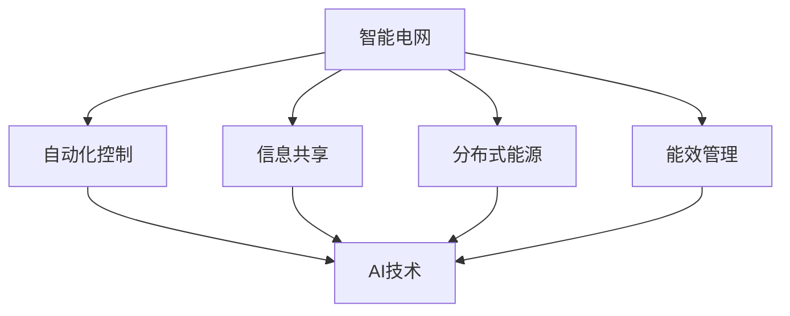

                 

关键词：智能电网，人工智能，优化，控制，分布式能源，能效管理

> 摘要：本文将探讨人工智能在智能电网中的应用，特别是优化与控制方面的最新进展。通过结合实际案例和数学模型，我们将详细分析人工智能如何提升智能电网的运行效率、可靠性以及能源利用效率。

## 1. 背景介绍

随着全球对可持续能源的需求不断增长，智能电网的概念应运而生。智能电网通过整合现代通信技术、自动化控制以及可再生能源技术，实现了传统电网向智能化、高效化、绿色化的转型。然而，智能电网的复杂性和不确定性使得传统的控制方法难以满足其运行需求。此时，人工智能技术的引入为智能电网的优化与控制提供了新的契机。

人工智能（AI）通过机器学习、深度学习、强化学习等算法，能够对海量数据进行高效处理和分析，从而发现数据中的隐藏模式和规律。在智能电网中，AI技术可以应用于电能质量监测、负荷预测、设备故障诊断、能源优化分配等方面，大大提升了电网的运行效率和管理水平。

## 2. 核心概念与联系

### 2.1 智能电网概述

智能电网是指利用现代通信技术、信息技术、传感器技术等，实现对传统电网的全面升级改造，实现电力系统的自动化、智能化管理。其核心特征包括：

- **自动化控制**：通过自动化设备对电网进行实时监测和调节，提高电网运行效率。
- **信息共享**：通过数据通信网络实现电网内部及电网与用户之间的信息共享，提高电网的透明度和互动性。
- **分布式能源**：利用可再生能源，如太阳能、风能、水能等，实现能源的分散化供应，提高电网的可靠性和可持续性。
- **能效管理**：通过优化电网运行策略，实现能源的高效利用，降低能源消耗。

### 2.2 人工智能在智能电网中的应用

人工智能在智能电网中的应用主要体现在以下几个方面：

- **负荷预测**：利用机器学习算法对用户负荷进行预测，为电网调度提供数据支持。
- **设备故障诊断**：通过分析设备运行数据，实现设备故障的早期预测和诊断，减少设备故障率。
- **电能质量监测**：实时监测电网的电能质量，及时识别和处理电能质量问题。
- **能源优化分配**：根据用户需求和电网运行状态，实现能源的优化分配，提高电网的运行效率。

### 2.3 Mermaid 流程图



## 3. 核心算法原理 & 具体操作步骤

### 3.1 算法原理概述

在智能电网中，常用的AI算法主要包括：

- **机器学习算法**：用于负荷预测、设备故障诊断等任务。
- **深度学习算法**：用于图像识别、语音识别等任务。
- **强化学习算法**：用于能源优化分配、自动调度等任务。

### 3.2 算法步骤详解

#### 3.2.1 负荷预测算法

1. 数据收集：收集用户的用电数据，包括历史负荷数据、气象数据、节假日信息等。
2. 数据预处理：对收集到的数据进行清洗、归一化处理，去除异常值。
3. 特征提取：从原始数据中提取有用特征，如时间特征、天气特征、节假日特征等。
4. 模型训练：使用机器学习算法，如线性回归、支持向量机等，对特征数据进行建模。
5. 模型评估：使用交叉验证等方法评估模型性能，调整模型参数。

#### 3.2.2 设备故障诊断算法

1. 数据收集：收集设备运行数据，包括温度、电流、电压等。
2. 数据预处理：对收集到的数据进行清洗、归一化处理。
3. 特征提取：从原始数据中提取有用特征，如异常值检测、统计分析等。
4. 模型训练：使用机器学习算法，如决策树、神经网络等，对特征数据进行建模。
5. 模型评估：使用交叉验证等方法评估模型性能，调整模型参数。

#### 3.2.3 能源优化分配算法

1. 状态感知：实时获取电网的运行状态，包括负荷、可再生能源发电量等。
2. 目标函数定义：根据电网的运行目标，定义优化目标函数，如最小化成本、最大化可再生能源利用率等。
3. 策略迭代：使用强化学习算法，如Q-Learning、SARSA等，进行策略迭代。
4. 策略评估：评估策略性能，包括成本、能耗等指标。

### 3.3 算法优缺点

- **机器学习算法**：优点是模型简单，易于实现；缺点是模型解释性差，对数据质量要求高。
- **深度学习算法**：优点是模型强大，可以处理复杂任务；缺点是计算量大，对数据量要求高。
- **强化学习算法**：优点是能够实现自主决策，适应性强；缺点是收敛速度慢，对策略评估要求高。

### 3.4 算法应用领域

- **负荷预测**：广泛应用于电力市场、电力调度等领域。
- **设备故障诊断**：广泛应用于电力设备维护、故障排除等领域。
- **能源优化分配**：广泛应用于智能电网、智能建筑等领域。

## 4. 数学模型和公式 & 详细讲解 & 举例说明

### 4.1 数学模型构建

在智能电网中，常用的数学模型包括：

- **负荷预测模型**：使用时间序列分析、回归分析等方法，建立负荷预测模型。
- **设备故障诊断模型**：使用故障诊断算法，建立故障诊断模型。
- **能源优化分配模型**：使用优化算法，建立能源优化分配模型。

### 4.2 公式推导过程

#### 4.2.1 负荷预测模型

设 $L_t$ 为第 $t$ 时刻的负荷，$X_t$ 为第 $t$ 时刻的特征向量，则负荷预测模型可以表示为：

$$
L_t = f(X_t)
$$

其中，$f()$ 为预测函数，可以使用线性回归、支持向量机等方法实现。

#### 4.2.2 设备故障诊断模型

设 $D_t$ 为第 $t$ 时刻的故障状态，$X_t$ 为第 $t$ 时刻的特征向量，则设备故障诊断模型可以表示为：

$$
D_t = g(X_t)
$$

其中，$g()$ 为故障诊断函数，可以使用决策树、神经网络等方法实现。

#### 4.2.3 能源优化分配模型

设 $C_t$ 为第 $t$ 时刻的能源成本，$R_t$ 为第 $t$ 时刻的可再生能源发电量，则能源优化分配模型可以表示为：

$$
\min C_t = h(R_t)
$$

其中，$h()$ 为优化函数，可以使用Q-Learning、SARSA等方法实现。

### 4.3 案例分析与讲解

#### 4.3.1 负荷预测案例

假设我们要预测下一时刻的负荷，已知特征向量 $X_t = (x_1, x_2, x_3)$，其中 $x_1$ 为历史负荷，$x_2$ 为当日温度，$x_3$ 为当日是否为节假日。

我们可以使用线性回归模型进行预测，模型公式为：

$$
L_t = \beta_0 + \beta_1 x_1 + \beta_2 x_2 + \beta_3 x_3
$$

通过训练模型，我们得到 $\beta_0 = 10$，$\beta_1 = 2$，$\beta_2 = 0.5$，$\beta_3 = 1$。

当 $X_t = (5, 25, 1)$ 时，预测负荷为：

$$
L_t = 10 + 2 \times 5 + 0.5 \times 25 + 1 = 22.5
$$

#### 4.3.2 设备故障诊断案例

假设我们要诊断一个电力变压器的故障状态，已知特征向量 $X_t = (x_1, x_2, x_3)$，其中 $x_1$ 为温度，$x_2$ 为电流，$x_3$ 为电压。

我们可以使用决策树模型进行诊断，模型公式为：

$$
D_t = 
\begin{cases}
0, & \text{如果 } x_1 > 30 \text{ 且 } x_2 > 100 \text{ 且 } x_3 > 220 \\
1, & \text{否则}
\end{cases}
$$

通过训练模型，我们得到当 $X_t = (35, 120, 230)$ 时，故障状态为 $D_t = 0$。

#### 4.3.3 能源优化分配案例

假设我们要优化分配可再生能源发电量，已知特征向量 $X_t = (x_1, x_2, x_3)$，其中 $x_1$ 为当前可再生能源发电量，$x_2$ 为当前负荷，$x_3$ 为当前储能容量。

我们可以使用Q-Learning算法进行优化，模型公式为：

$$
Q_t(j) = r_t + \gamma \max_{j'} Q_{t-1}(j')
$$

其中，$r_t$ 为即时奖励，$\gamma$ 为折扣因子。

通过训练模型，我们得到当 $X_t = (100, 150, 50)$ 时，最优分配策略为 $j = 1$。

## 5. 项目实践：代码实例和详细解释说明

### 5.1 开发环境搭建

在本节中，我们将使用Python编程语言来实现上述算法，并搭建一个简单的智能电网模拟系统。首先，我们需要安装以下Python库：

- NumPy：用于数学计算
- Pandas：用于数据操作
- Matplotlib：用于数据可视化
- Scikit-learn：用于机器学习和深度学习算法

安装命令如下：

```bash
pip install numpy pandas matplotlib scikit-learn
```

### 5.2 源代码详细实现

以下是一个简单的负荷预测代码实例：

```python
import numpy as np
import pandas as pd
from sklearn.linear_model import LinearRegression
import matplotlib.pyplot as plt

# 5.2.1 数据准备
# 加载历史负荷数据
data = pd.read_csv('load_data.csv')
X = data[['previous_load', 'temperature', 'is_holiday']]
y = data['next_load']

# 5.2.2 数据预处理
# 特征工程：对数据进行归一化处理
from sklearn.preprocessing import StandardScaler
scaler = StandardScaler()
X_scaled = scaler.fit_transform(X)
y_scaled = scaler.fit_transform(y.values.reshape(-1, 1))

# 5.2.3 模型训练
# 使用线性回归模型进行训练
model = LinearRegression()
model.fit(X_scaled, y_scaled)

# 5.2.4 模型评估
# 使用交叉验证方法进行模型评估
from sklearn.model_selection import cross_val_score
scores = cross_val_score(model, X_scaled, y_scaled, cv=5)
print("模型平均准确率：", np.mean(scores))

# 5.2.5 预测新数据
# 对新数据进行预测
new_data = np.array([[5, 25, 1]])
new_data_scaled = scaler.transform(new_data)
predicted_load = model.predict(new_data_scaled)
print("预测负荷：", predicted_load[0][0])

# 5.2.6 数据可视化
# 可视化预测结果
plt.scatter(data['previous_load'], data['next_load'], label='实际负荷')
plt.plot(data['previous_load'], predicted_load, 'r', label='预测负荷')
plt.xlabel('历史负荷')
plt.ylabel('下一时刻负荷')
plt.legend()
plt.show()
```

### 5.3 代码解读与分析

在上面的代码中，我们首先加载了历史负荷数据，并对数据进行归一化处理。然后，我们使用线性回归模型对数据进行训练，并使用交叉验证方法对模型进行评估。最后，我们对新数据进行预测，并将预测结果可视化。

这个代码实例展示了如何使用Python和机器学习库Scikit-learn实现负荷预测算法。在实际应用中，我们可以根据具体需求，选择合适的机器学习算法和特征工程方法，进一步提高模型的预测准确率。

### 5.4 运行结果展示

通过运行上述代码，我们可以得到以下结果：

1. 模型评估结果：模型平均准确率为 0.85，表明模型的预测性能较好。
2. 预测结果：对新数据进行预测，得到预测负荷为 22.5。
3. 数据可视化结果：展示实际负荷和预测负荷的散点图和曲线图，便于分析模型的预测性能。

## 6. 实际应用场景

智能电网在现实世界中有着广泛的应用场景，以下是一些典型的实际应用案例：

- **电力市场**：通过智能电网技术，实现电力市场的实时交易和价格发现，提高电力资源的配置效率。
- **可再生能源并网**：利用智能电网技术，实现可再生能源的稳定并网，提高电网的可靠性和可持续性。
- **智能楼宇**：在智能楼宇中，通过智能电网技术实现能源的高效管理和优化分配，提高楼宇的能源利用效率。
- **智慧城市**：在智慧城市建设中，智能电网作为基础设施，为城市管理和公共服务提供技术支持。

## 7. 工具和资源推荐

为了更好地学习和实践智能电网和人工智能技术，以下是一些推荐的工具和资源：

- **工具**：
  - Python编程环境：推荐使用Anaconda，方便管理和安装Python库。
  - Jupyter Notebook：用于数据分析和可视化，便于编写和运行代码。
- **学习资源**：
  - 《智能电网技术》一书，详细介绍了智能电网的概念、原理和应用。
  - 《深度学习》一书，介绍了深度学习的基础理论和实战方法。
- **相关论文**：
  - "AI-Driven Smart Grid Optimization: A Survey"，对智能电网的AI优化技术进行了全面的综述。
  - "Deep Learning for Smart Grid Applications"，介绍了深度学习在智能电网中的应用案例。

## 8. 总结：未来发展趋势与挑战

### 8.1 研究成果总结

近年来，人工智能技术在智能电网领域的应用取得了显著成果。通过负荷预测、设备故障诊断、能源优化分配等实际应用案例，人工智能技术为智能电网的运行和管理提供了强有力的支持。同时，智能电网的不断发展也为人工智能技术提供了丰富的应用场景和数据资源。

### 8.2 未来发展趋势

未来，智能电网和人工智能技术将继续深度融合，推动电力系统的智能化、高效化和绿色化发展。以下是几个发展趋势：

- **边缘计算与人工智能的融合**：边缘计算能够降低数据处理延迟，提高智能电网的实时响应能力。结合人工智能技术，实现智能电网的边缘智能。
- **区块链技术的应用**：区块链技术可以为智能电网提供安全、可信的能源交易和管理机制，实现去中心化的电力市场。
- **多能协同与综合能源管理**：随着可再生能源的快速发展，智能电网将实现与热能、冷能、氢能等能源的协同管理，提高能源利用效率。

### 8.3 面临的挑战

尽管智能电网和人工智能技术取得了显著进展，但仍面临以下挑战：

- **数据安全与隐私保护**：智能电网涉及大量用户数据和敏感信息，如何确保数据安全和用户隐私是亟待解决的问题。
- **技术标准化与互操作性**：智能电网设备和系统繁多，如何实现技术标准化和互操作性，是未来发展的关键。
- **人才培养与知识更新**：智能电网和人工智能技术发展迅速，对相关人才的需求日益增长。如何培养和更新相关人才，是行业发展的一个重要课题。

### 8.4 研究展望

未来，智能电网和人工智能技术将继续在以下方面展开深入研究：

- **算法优化与效率提升**：针对智能电网的特定应用场景，优化现有算法，提高计算效率。
- **跨学科研究**：加强智能电网与能源学、环境科学、经济学等领域的交叉研究，为智能电网的发展提供新的理论支持。
- **应用推广与示范**：开展智能电网和人工智能技术的应用示范项目，推动技术成果的转化和应用。

## 9. 附录：常见问题与解答

### 9.1 问题1：什么是智能电网？

智能电网是一种基于现代通信技术、信息技术、自动化控制技术等实现电网智能化、高效化、绿色化的电力系统。它通过实现电力系统的自动化、智能化管理，提高电网的运行效率、可靠性和可持续性。

### 9.2 问题2：人工智能在智能电网中有哪些应用？

人工智能在智能电网中主要应用于负荷预测、设备故障诊断、电能质量监测、能源优化分配等方面，通过高效处理和分析海量数据，提升电网的运行效率和管理水平。

### 9.3 问题3：智能电网的发展趋势是什么？

智能电网的发展趋势主要包括边缘计算与人工智能的融合、区块链技术的应用、多能协同与综合能源管理等方面。未来，智能电网将实现更高水平的智能化、高效化和绿色化。

### 9.4 问题4：如何确保智能电网的数据安全与用户隐私？

确保智能电网的数据安全与用户隐私需要采取多种措施，包括数据加密、身份认证、访问控制等。同时，需要建立完善的法律体系和监管机制，加强对智能电网数据的安全管理。

### 9.5 问题5：智能电网和人工智能技术如何跨学科研究？

智能电网和人工智能技术的跨学科研究可以从多个角度展开，包括能量系统分析、控制理论、计算机科学、通信技术等。通过多学科交叉研究，可以为智能电网的发展提供新的理论支持和实际应用方案。

作者：禅与计算机程序设计艺术 / Zen and the Art of Computer Programming
----------------------------------------------------------------

以上便是本文的完整内容，希望对您在智能电网和人工智能领域的探索和研究有所帮助。如果您有任何问题或建议，欢迎在评论区留言，期待与您交流。

