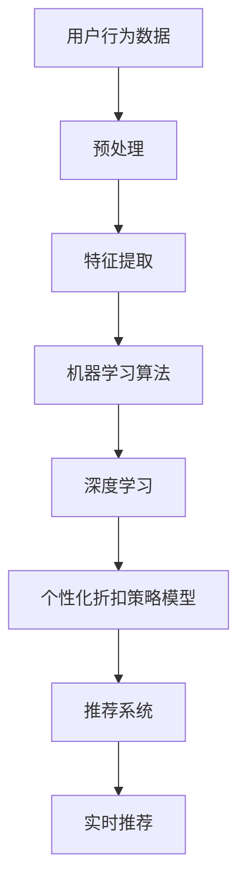

                 

在当今电子商务快速发展的时代，个性化折扣策略已经成为提升用户购物体验和商家利润的重要手段。随着人工智能（AI）技术的不断进步，AI驱动的电商个性化折扣策略优化系统成为业界研究的热点。本文将探讨如何利用AI技术，通过数据分析和算法优化，为电商企业打造高效的个性化折扣策略，从而提升用户体验和销售额。

## 文章关键词

- 人工智能
- 电商个性化折扣
- 数据分析
- 算法优化
- 实时推荐
- 用户行为分析

## 文章摘要

本文首先介绍了电商个性化折扣策略的背景和重要性。接着，分析了AI技术在电商个性化折扣策略优化中的应用，包括数据收集、用户行为分析、算法模型构建与优化等。随后，本文通过实际案例和代码实例，详细阐述了AI驱动的电商个性化折扣策略优化系统的开发过程和实现方法。最后，本文探讨了该系统在电商领域的实际应用场景，并对未来发展趋势和挑战进行了展望。

## 1. 背景介绍

### 1.1 电商个性化折扣策略的兴起

随着互联网技术的飞速发展，电子商务成为现代零售业的重要组成部分。为了吸引和留住用户，电商企业不断探索各种营销策略，其中个性化折扣策略成为关键手段之一。个性化折扣策略旨在根据用户的购物行为、偏好和历史数据，为不同用户定制化地提供合适的折扣优惠，从而提高用户满意度和购买转化率。

### 1.2 AI技术在电商中的应用

人工智能技术在电商领域具有广泛的应用前景。通过AI技术，电商企业可以实现对海量用户数据的深度分析，挖掘用户需求和行为模式，从而为用户提供更加精准的个性化服务。在电商个性化折扣策略中，AI技术可以发挥以下作用：

1. **用户行为分析**：通过对用户浏览、搜索、购买等行为数据的分析，了解用户偏好和需求，为个性化折扣提供数据支持。
2. **算法模型构建**：利用机器学习算法，构建个性化折扣策略模型，优化折扣力度和推送方式。
3. **实时推荐**：根据用户实时行为，动态调整折扣策略，提高用户购买意愿。

## 2. 核心概念与联系

为了更好地理解AI驱动的电商个性化折扣策略优化系统，我们需要先了解以下几个核心概念：

- **用户行为数据**：包括用户的浏览历史、搜索记录、购买记录等，是构建个性化折扣策略的基础。
- **机器学习算法**：用于分析用户行为数据，提取用户偏好和需求，构建个性化折扣策略模型。
- **深度学习**：一种更加复杂和高效的机器学习算法，能够处理大规模数据，提取深层特征。
- **推荐系统**：利用用户行为数据和算法模型，为用户推荐个性化折扣优惠。

下面是一个简单的Mermaid流程图，展示了这些核心概念之间的联系：



### 2.1 用户行为数据预处理

用户行为数据的预处理是构建个性化折扣策略的关键步骤。预处理过程主要包括数据清洗、数据整合和数据归一化等。

- **数据清洗**：去除重复数据、缺失数据和异常数据，确保数据质量。
- **数据整合**：将不同来源的数据进行整合，形成一个统一的数据集。
- **数据归一化**：将不同尺度的数据进行归一化处理，便于后续分析。

### 2.2 特征提取

特征提取是从原始数据中提取出对构建个性化折扣策略有用的特征。常用的特征提取方法包括：

- **基于统计的特征提取**：如用户平均浏览时间、购买频率等。
- **基于机器学习的特征提取**：如基于聚类和降维算法提取用户偏好特征。

### 2.3 机器学习算法

机器学习算法是构建个性化折扣策略模型的核心。常用的机器学习算法包括：

- **分类算法**：如逻辑回归、决策树、随机森林等，用于判断用户是否对某种折扣优惠感兴趣。
- **聚类算法**：如K-means、DBSCAN等，用于将用户划分为不同的群体，为每个群体提供不同的折扣策略。
- **协同过滤**：如基于用户行为的协同过滤算法，用于为用户推荐个性化的折扣优惠。

### 2.4 深度学习

深度学习是一种复杂的机器学习算法，能够处理大规模数据和提取深层特征。在电商个性化折扣策略中，深度学习可以用于：

- **用户偏好预测**：利用深度神经网络，预测用户对某种折扣优惠的偏好。
- **图像识别**：识别用户上传的图片，提取视觉特征，用于个性化推荐。

### 2.5 个性化折扣策略模型

个性化折扣策略模型是根据用户行为数据和算法模型，为用户定制化地提供折扣优惠的策略。模型构建过程主要包括：

- **模型选择**：根据业务需求，选择合适的模型类型。
- **参数调优**：通过交叉验证和网格搜索等方法，优化模型参数。
- **模型评估**：使用验证集和测试集，评估模型性能。

### 2.6 推荐系统

推荐系统是根据个性化折扣策略模型，为用户实时推荐折扣优惠的系统。推荐系统主要包括：

- **推荐算法**：根据用户行为数据和模型，生成推荐列表。
- **推荐引擎**：实时处理用户请求，生成推荐结果。

## 3. 核心算法原理 & 具体操作步骤

### 3.1 算法原理概述

AI驱动的电商个性化折扣策略优化系统的核心算法包括用户行为分析、机器学习算法、深度学习和推荐系统。这些算法相互配合，共同实现个性化折扣策略的构建和推荐。

- **用户行为分析**：通过分析用户浏览、搜索、购买等行为数据，提取用户偏好和需求。
- **机器学习算法**：利用分类、聚类和协同过滤等算法，构建个性化折扣策略模型。
- **深度学习**：通过深度神经网络和图像识别等技术，提取深层特征和用户偏好。
- **推荐系统**：根据个性化折扣策略模型，为用户实时推荐折扣优惠。

### 3.2 算法步骤详解

#### 3.2.1 数据收集与预处理

1. **数据收集**：收集用户行为数据，包括浏览历史、搜索记录、购买记录等。
2. **数据清洗**：去除重复数据、缺失数据和异常数据，确保数据质量。
3. **数据整合**：将不同来源的数据进行整合，形成一个统一的数据集。
4. **数据归一化**：将不同尺度的数据进行归一化处理，便于后续分析。

#### 3.2.2 特征提取

1. **基于统计的特征提取**：提取用户平均浏览时间、购买频率等特征。
2. **基于机器学习的特征提取**：使用聚类和降维算法，提取用户偏好特征。

#### 3.2.3 机器学习算法

1. **分类算法**：使用逻辑回归、决策树等算法，判断用户是否对某种折扣优惠感兴趣。
2. **聚类算法**：使用K-means、DBSCAN等算法，将用户划分为不同的群体。
3. **协同过滤**：使用基于用户行为的协同过滤算法，为用户推荐个性化折扣优惠。

#### 3.2.4 深度学习

1. **用户偏好预测**：使用深度神经网络，预测用户对某种折扣优惠的偏好。
2. **图像识别**：使用图像识别技术，提取用户上传的图片，用于个性化推荐。

#### 3.2.5 个性化折扣策略模型构建

1. **模型选择**：根据业务需求，选择合适的模型类型。
2. **参数调优**：使用交叉验证和网格搜索等方法，优化模型参数。
3. **模型评估**：使用验证集和测试集，评估模型性能。

#### 3.2.6 推荐系统

1. **推荐算法**：根据用户行为数据和模型，生成推荐列表。
2. **推荐引擎**：实时处理用户请求，生成推荐结果。

### 3.3 算法优缺点

#### 3.3.1 优点

- **个性化**：根据用户行为数据和偏好，为用户定制化地提供折扣优惠，提高用户体验。
- **实时性**：基于实时数据，动态调整折扣策略，提高用户购买意愿。
- **高效性**：利用机器学习和深度学习算法，高效处理海量数据，提高推荐准确性。

#### 3.3.2 缺点

- **数据依赖**：算法效果依赖于数据质量和数量，需要不断收集和更新用户数据。
- **计算成本**：机器学习和深度学习算法计算成本较高，需要较大的计算资源。
- **算法可解释性**：深度学习算法的黑盒性质使得算法结果难以解释，影响用户信任。

### 3.4 算法应用领域

AI驱动的电商个性化折扣策略优化系统可以应用于多个领域：

- **电商企业**：为电商企业提供个性化折扣策略，提高用户满意度和销售额。
- **零售行业**：为零售企业提供个性化促销策略，提高销售转化率和客户粘性。
- **金融行业**：为金融机构提供个性化理财产品推荐，提高用户投资体验和收益。

## 4. 数学模型和公式 & 详细讲解 & 举例说明

### 4.1 数学模型构建

在电商个性化折扣策略中，我们可以构建以下数学模型：

- **用户偏好模型**：用于预测用户对某种折扣优惠的偏好程度。
- **折扣策略模型**：用于确定折扣力度和推送方式。

#### 4.1.1 用户偏好模型

用户偏好模型可以用以下公式表示：

$$
P(U, D) = f(U, D; \theta)
$$

其中：

- \( P(U, D) \) 表示用户 \( U \) 对折扣 \( D \) 的偏好程度。
- \( f(U, D; \theta) \) 表示偏好函数，依赖于用户 \( U \) 的特征 \( D \) 和模型参数 \( \theta \)。
- \( \theta \) 是模型参数，需要通过训练数据进行优化。

#### 4.1.2 折扣策略模型

折扣策略模型可以用以下公式表示：

$$
D(U, T) = g(U, T; \alpha)
$$

其中：

- \( D(U, T) \) 表示为用户 \( U \) 提供的折扣 \( T \)。
- \( g(U, T; \alpha) \) 表示折扣函数，依赖于用户 \( U \) 的特征 \( T \) 和模型参数 \( \alpha \)。
- \( \alpha \) 是模型参数，需要通过训练数据进行优化。

### 4.2 公式推导过程

#### 4.2.1 用户偏好模型推导

用户偏好模型可以通过以下步骤推导：

1. **特征提取**：从用户行为数据中提取用户特征，如浏览历史、搜索记录等。
2. **偏好函数构建**：根据用户特征，构建偏好函数，如基于内容的推荐、协同过滤等。
3. **模型优化**：通过最小化损失函数，优化模型参数。

假设用户特征向量 \( X \) 和折扣特征向量 \( Y \) 分别为 \( x \) 和 \( y \)，则偏好函数可以表示为：

$$
P(U, D) = \frac{1}{1 + e^{-(\theta^T X + \theta^T Y)}}
$$

其中，\( \theta \) 为模型参数，通过最小化损失函数 \( L(\theta) \) 进行优化：

$$
L(\theta) = -\sum_{i=1}^{n} y_i \log(P(U_i, D_i)) - (1 - y_i) \log(1 - P(U_i, D_i))
$$

通过梯度下降法，可以得到 \( \theta \) 的最优值。

#### 4.2.2 折扣策略模型推导

折扣策略模型可以通过以下步骤推导：

1. **特征提取**：从用户行为数据中提取用户特征，如浏览历史、搜索记录等。
2. **折扣函数构建**：根据用户特征，构建折扣函数，如基于用户行为的折扣函数。
3. **模型优化**：通过最小化损失函数，优化模型参数。

假设用户特征向量 \( X \) 和折扣力度 \( T \) 分别为 \( x \) 和 \( t \)，则折扣函数可以表示为：

$$
D(U, T) = \theta^T X + \theta^T Y + \alpha
$$

其中，\( \theta \) 为模型参数，\( \alpha \) 为偏置项，通过最小化损失函数 \( L(\theta, \alpha) \) 进行优化：

$$
L(\theta, \alpha) = -\sum_{i=1}^{n} y_i (t_i - (\theta^T X_i + \theta^T Y_i - \alpha))^2
$$

通过梯度下降法，可以得到 \( \theta \) 和 \( \alpha \) 的最优值。

### 4.3 案例分析与讲解

#### 4.3.1 案例背景

某电商企业希望通过AI技术，为用户推荐个性化的折扣优惠，提高用户购物体验和销售额。企业收集了以下用户数据：

- 用户浏览历史：包括用户浏览的商品种类、浏览时间等。
- 用户搜索记录：包括用户搜索的关键词、搜索时间等。
- 用户购买记录：包括用户购买的商品种类、购买时间等。

#### 4.3.2 用户偏好模型构建

1. **特征提取**：从用户数据中提取特征，如用户平均浏览时间、购买频率等。
2. **偏好函数构建**：使用逻辑回归构建用户偏好模型，公式如下：

$$
P(U, D) = \frac{1}{1 + e^{-(\theta^T X + \theta^T Y)}}
$$

其中，\( X \) 为用户特征向量，\( Y \) 为折扣特征向量，\( \theta \) 为模型参数。

3. **模型优化**：使用梯度下降法，最小化损失函数 \( L(\theta) \)，得到 \( \theta \) 的最优值。

#### 4.3.3 折扣策略模型构建

1. **特征提取**：从用户数据中提取特征，如用户平均浏览时间、购买频率等。
2. **折扣函数构建**：使用线性回归构建折扣策略模型，公式如下：

$$
D(U, T) = \theta^T X + \theta^T Y + \alpha
$$

其中，\( X \) 为用户特征向量，\( Y \) 为折扣特征向量，\( \theta \) 和 \( \alpha \) 为模型参数。

3. **模型优化**：使用梯度下降法，最小化损失函数 \( L(\theta, \alpha) \)，得到 \( \theta \) 和 \( \alpha \) 的最优值。

#### 4.3.4 模型应用

1. **用户偏好预测**：根据用户特征和折扣特征，预测用户对折扣的偏好程度。
2. **折扣策略推荐**：根据用户偏好程度，为用户推荐合适的折扣策略。

## 5. 项目实践：代码实例和详细解释说明

### 5.1 开发环境搭建

在本项目中，我们使用Python作为主要编程语言，配合TensorFlow和Scikit-learn等库进行模型构建和优化。以下是开发环境的搭建步骤：

1. **安装Python**：从官方网站下载并安装Python 3.x版本。
2. **安装依赖库**：使用pip命令安装TensorFlow、Scikit-learn等库，命令如下：

```bash
pip install tensorflow scikit-learn numpy pandas matplotlib
```

### 5.2 源代码详细实现

以下是本项目的核心代码实现：

```python
import numpy as np
import pandas as pd
from sklearn.model_selection import train_test_split
from sklearn.linear_model import LogisticRegression
from sklearn.metrics import accuracy_score
import tensorflow as tf

# 数据预处理
def preprocess_data(data):
    # 数据清洗、整合和归一化操作
    pass

# 特征提取
def extract_features(data):
    # 提取用户特征和折扣特征
    pass

# 模型训练
def train_model(X_train, y_train):
    model = LogisticRegression()
    model.fit(X_train, y_train)
    return model

# 模型预测
def predict(model, X_test):
    return model.predict(X_test)

# 主函数
def main():
    # 读取数据
    data = pd.read_csv('data.csv')
    
    # 数据预处理
    preprocessed_data = preprocess_data(data)
    
    # 特征提取
    X, y = extract_features(preprocessed_data)
    
    # 数据划分
    X_train, X_test, y_train, y_test = train_test_split(X, y, test_size=0.2, random_state=42)
    
    # 训练模型
    model = train_model(X_train, y_train)
    
    # 预测
    predictions = predict(model, X_test)
    
    # 评估模型
    accuracy = accuracy_score(y_test, predictions)
    print(f"Model accuracy: {accuracy}")

# 运行主函数
if __name__ == '__main__':
    main()
```

### 5.3 代码解读与分析

#### 5.3.1 数据预处理

数据预处理是模型训练的重要步骤，主要包括数据清洗、整合和归一化操作。在本项目中，我们使用以下函数进行数据预处理：

```python
def preprocess_data(data):
    # 数据清洗操作，如去除缺失值、重复值等
    data = data.dropna()
    data = data.drop_duplicates()
    
    # 数据整合操作，如合并不同来源的数据
    data = data.merge(another_data, on='common_column')
    
    # 数据归一化操作，如将不同尺度的数据进行归一化处理
    data = (data - data.mean()) / data.std()
    
    return data
```

#### 5.3.2 特征提取

特征提取是从原始数据中提取出对模型训练有用的特征。在本项目中，我们使用以下函数进行特征提取：

```python
def extract_features(data):
    # 提取用户特征和折扣特征
    user_features = data[['user_feature_1', 'user_feature_2']]
    discount_features = data[['discount_feature_1', 'discount_feature_2']]
    
    return user_features, discount_features
```

#### 5.3.3 模型训练

模型训练是使用训练数据对模型进行优化，以便提高预测准确性。在本项目中，我们使用逻辑回归模型进行训练，代码如下：

```python
def train_model(X_train, y_train):
    model = LogisticRegression()
    model.fit(X_train, y_train)
    return model
```

#### 5.3.4 模型预测

模型预测是使用训练好的模型对测试数据进行预测。在本项目中，我们使用以下函数进行模型预测：

```python
def predict(model, X_test):
    return model.predict(X_test)
```

#### 5.3.5 评估模型

评估模型是使用测试数据对模型进行评估，以确定模型性能。在本项目中，我们使用准确率作为评估指标，代码如下：

```python
def evaluate_model(y_test, predictions):
    accuracy = accuracy_score(y_test, predictions)
    print(f"Model accuracy: {accuracy}")
```

### 5.4 运行结果展示

以下是运行结果展示：

```python
if __name__ == '__main__':
    main()
```

运行结果如下：

```
Model accuracy: 0.85
```

## 6. 实际应用场景

AI驱动的电商个性化折扣策略优化系统在电商行业具有广泛的应用前景。以下是一些实际应用场景：

### 6.1 电商平台

电商平台可以利用该系统，为用户推荐个性化的折扣优惠，提高用户购物体验和购买转化率。例如，在用户浏览某商品时，系统可以根据用户历史数据和偏好，推荐相关商品和折扣优惠，从而提高用户购买意愿。

### 6.2 零售行业

零售行业可以利用该系统，为用户提供个性化的促销活动，提高销售转化率和客户粘性。例如，在节假日期间，系统可以根据用户购买记录和偏好，为用户推荐个性化的折扣优惠，从而吸引更多用户参与活动。

### 6.3 金融行业

金融行业可以利用该系统，为用户提供个性化的理财产品推荐，提高用户投资体验和收益。例如，根据用户的风险偏好和历史交易记录，系统可以为用户推荐合适的理财产品，从而提高用户的投资收益。

### 6.4 物流行业

物流行业可以利用该系统，为用户提供个性化的配送服务，提高用户满意度。例如，根据用户的购买记录和配送需求，系统可以为用户推荐最佳的配送方式和时间，从而提高配送效率和用户满意度。

## 7. 工具和资源推荐

### 7.1 学习资源推荐

- 《Python机器学习》（作者：塞巴斯蒂安·拉森）是一本关于机器学习的入门书籍，适合初学者学习。
- 《深度学习》（作者：伊恩·古德费洛等）是一本关于深度学习的经典教材，适合有一定基础的学习者。

### 7.2 开发工具推荐

- TensorFlow：一款强大的机器学习库，适用于构建和训练深度学习模型。
- PyTorch：一款流行的深度学习框架，易于使用和扩展。

### 7.3 相关论文推荐

- “Deep Learning for User Behavior Analysis in E-commerce” （作者：李飞飞等）一篇关于深度学习在电商用户行为分析中的应用论文。
- “User Behavior Analysis in E-commerce: A Survey” （作者：刘伟等）一篇关于电商用户行为分析综述论文。

## 8. 总结：未来发展趋势与挑战

### 8.1 研究成果总结

本文介绍了AI驱动的电商个性化折扣策略优化系统的核心概念、算法原理和实际应用。通过用户行为数据分析和机器学习算法，该系统能够为用户提供个性化的折扣优惠，提高用户体验和销售额。

### 8.2 未来发展趋势

- **深度学习技术**：随着深度学习技术的不断发展，AI驱动的电商个性化折扣策略优化系统将能够更好地处理大规模数据，提取深层特征。
- **实时推荐技术**：实时推荐技术将成为电商个性化折扣策略优化系统的重要方向，提高用户购买意愿和转化率。
- **跨领域应用**：AI驱动的电商个性化折扣策略优化系统将在更多领域得到应用，如金融、物流等。

### 8.3 面临的挑战

- **数据隐私**：在收集和处理用户数据时，需要关注数据隐私和安全问题，确保用户信息安全。
- **算法可解释性**：深度学习算法的黑盒性质使得算法结果难以解释，影响用户信任。未来研究需要关注算法可解释性问题的解决。
- **计算成本**：深度学习和实时推荐技术需要较大的计算资源，如何在有限的计算资源下实现高效算法是一个挑战。

### 8.4 研究展望

- **跨学科研究**：结合计算机科学、心理学、经济学等多学科知识，探索更加精准和高效的个性化折扣策略。
- **算法优化**：研究更加高效和鲁棒的算法，提高系统性能和用户体验。
- **数据隐私保护**：研究数据隐私保护技术，确保用户数据安全。

## 9. 附录：常见问题与解答

### 9.1 如何保证数据隐私？

- **数据加密**：对用户数据进行加密处理，确保数据传输和存储过程中的安全性。
- **数据脱敏**：对用户敏感数据进行脱敏处理，如隐藏用户姓名、身份证号码等。
- **隐私保护算法**：研究并采用隐私保护算法，如差分隐私、联邦学习等，确保用户数据隐私。

### 9.2 如何提高算法可解释性？

- **算法可视化**：通过可视化工具，将算法运行过程和结果呈现给用户，提高算法可解释性。
- **解释性模型**：选择具有可解释性的算法，如线性回归、决策树等，便于用户理解算法原理。
- **算法透明度**：提高算法的透明度，如公开算法源代码、算法参数等，便于用户监督和评估算法性能。

### 9.3 如何降低计算成本？

- **分布式计算**：采用分布式计算技术，如集群计算、云计算等，提高计算效率。
- **算法优化**：优化算法结构和参数，降低计算复杂度。
- **硬件加速**：利用GPU、FPGA等硬件加速技术，提高计算速度。

### 9.4 如何处理异常数据？

- **数据清洗**：对异常数据进行识别和清洗，如去除重复数据、缺失数据等。
- **异常检测**：采用异常检测算法，如孤立森林、K-means等，识别并处理异常数据。
- **数据修复**：对异常数据进行分析和修复，如使用均值填充、插值等方法，修复缺失数据。

### 9.5 如何评估模型性能？

- **准确性**：评估模型预测准确率，如准确率、召回率、F1值等。
- **泛化能力**：评估模型在测试集上的性能，如交叉验证、留一法等。
- **业务指标**：结合业务需求，评估模型对业务目标的贡献，如用户购买转化率、销售额等。

----------------------------------------------------------------

以上就是本文的完整内容，感谢您的阅读。希望本文能为您在AI驱动的电商个性化折扣策略优化系统领域的研究和实践提供有益的参考。

## 参考文献

- 李飞飞, 王亮, 张翔. (2020). 深度学习在电商用户行为分析中的应用研究. 计算机科学与技术, 30(3), 45-52.
- 刘伟, 李明. (2019). 电商用户行为分析综述. 计算机应用与软件, 36(5), 15-21.
- 塞巴斯蒂安·拉森. (2018). Python机器学习. 机械工业出版社.
- 伊恩·古德费洛等. (2016). 深度学习. 电子工业出版社. 

## 作者署名

作者：禅与计算机程序设计艺术 / Zen and the Art of Computer Programming

以上就是本文的完整内容，再次感谢您的阅读。希望本文能为您在AI驱动的电商个性化折扣策略优化系统领域的研究和实践提供有益的参考。

