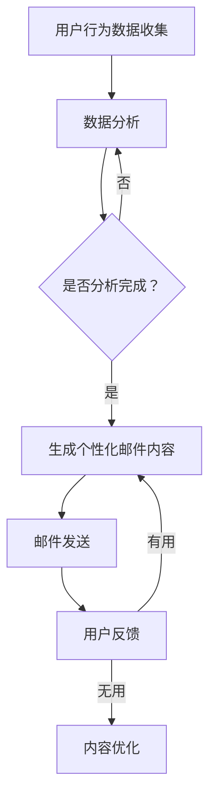

                 

在当今的数字营销领域中，个性化已经成为企业提高客户参与度和转化率的关键策略之一。随着人工智能（AI）技术的不断进步，AI驱动的个性化邮件内容生成已经成为电商领域的重要应用。本文将深入探讨AI在电商个性化邮件内容生成中的应用，分析其核心概念、算法原理、数学模型、项目实践，并展望其未来发展趋势与挑战。

## 文章关键词
- 人工智能
- 个性化邮件
- 电商营销
- 内容生成
- 自然语言处理

## 文章摘要
本文旨在介绍AI驱动的电商个性化邮件内容生成的原理和应用。通过分析核心概念、算法原理、数学模型和项目实践，本文揭示了AI如何通过深度学习和自然语言处理技术，为电商企业提供定制化的邮件内容，从而提升营销效果。同时，本文还探讨了该技术在实际应用中的挑战和未来发展方向。

## 1. 背景介绍

### 1.1 电商个性化邮件的必要性
随着互联网的普及和用户消费行为的多样化，传统的统一化邮件营销方式已经无法满足现代电商企业对精准营销的需求。个性化邮件营销作为一种基于用户数据的精准营销手段，能够显著提高邮件的打开率和转化率。然而，传统的手动撰写个性化邮件内容不仅耗时耗力，而且难以保证内容的准确性和吸引力。

### 1.2 人工智能在个性化邮件中的应用
人工智能，特别是自然语言处理（NLP）和深度学习技术的快速发展，为个性化邮件内容的自动生成提供了技术支撑。通过分析用户行为数据和偏好，AI系统能够自动生成符合用户个性化需求的邮件内容，从而提高营销效果。

### 1.3 本文结构
本文将首先介绍AI驱动的电商个性化邮件内容生成的核心概念和算法原理。接着，通过数学模型和项目实践，详细阐述AI如何实现个性化邮件内容生成。最后，本文将讨论实际应用场景、未来发展趋势以及面临的挑战。

## 2. 核心概念与联系

### 2.1 自然语言处理（NLP）
自然语言处理是人工智能的一个重要分支，旨在让计算机理解和生成人类语言。在个性化邮件内容生成中，NLP技术被用来分析和理解用户的语言行为，从而生成符合用户需求的邮件内容。

### 2.2 深度学习
深度学习是一种基于人工神经网络的机器学习技术，通过多层神经网络的训练，能够自动提取数据特征并生成预测。在个性化邮件内容生成中，深度学习模型被用于分析和生成个性化内容。

### 2.3 数据分析
数据分析是个性化邮件内容生成的基础。通过对用户行为数据、购买历史、偏好等数据的分析，可以准确了解用户的需求和兴趣，从而生成个性化的邮件内容。

### 2.4 Mermaid 流程图
以下是AI驱动的电商个性化邮件内容生成过程的Mermaid流程图：



### 2.5 个性化邮件内容生成架构
个性化邮件内容生成架构主要包括以下几个关键组成部分：

1. **数据收集与处理**：收集用户行为数据，包括浏览记录、购买历史、偏好等，并对数据进行清洗和处理。
2. **特征提取**：从处理后的数据中提取特征，如用户兴趣、行为倾向等。
3. **模型训练**：使用深度学习模型对特征进行训练，生成个性化邮件内容的生成器。
4. **内容生成**：根据用户特征和预设模板，自动生成个性化的邮件内容。
5. **邮件发送**：将生成的邮件内容发送给用户。
6. **反馈收集与优化**：收集用户反馈，对邮件内容进行优化，以提高用户体验和营销效果。

## 3. 核心算法原理 & 具体操作步骤

### 3.1 算法原理概述

AI驱动的电商个性化邮件内容生成主要依赖于深度学习和自然语言处理技术。深度学习模型（如生成对抗网络GAN、变分自编码器VAE等）被用来学习用户的行为和偏好特征，并生成个性化的邮件内容。自然语言处理技术则用于理解和生成人类语言，以确保邮件内容的自然性和准确性。

### 3.2 算法步骤详解

1. **数据收集与预处理**：收集用户的行为数据，包括浏览记录、购买历史、偏好等。对数据进行清洗、去重和规范化处理，以便后续的特征提取。
2. **特征提取**：使用特征提取算法（如词嵌入、TF-IDF等）将原始数据转换为机器学习模型可处理的特征向量。
3. **模型训练**：使用训练数据集对深度学习模型进行训练。通过大量邮件内容和用户特征的标注数据，模型可以学习到如何生成与用户兴趣和偏好相关的邮件内容。
4. **个性化邮件内容生成**：将用户的特征向量输入到训练好的模型中，模型会生成一段个性化的邮件内容。内容生成过程通常涉及以下步骤：
   - **上下文分析**：分析用户的历史行为和偏好，确定邮件内容的主题和风格。
   - **内容生成**：根据上下文分析的结果，生成一段符合用户需求和兴趣的邮件内容。
   - **内容优化**：对生成的邮件内容进行语法和语义优化，以提高内容的自然性和吸引力。
5. **邮件发送与反馈收集**：将生成的邮件内容发送给用户，并收集用户的反馈。如果用户反馈邮件内容有用，则继续使用当前模型生成邮件；如果反馈邮件内容无用，则对模型进行重新训练或调整，以提高生成邮件的质量。

### 3.3 算法优缺点

#### 优点
- **高效性**：AI系统可以自动生成大量的个性化邮件内容，大大提高了营销效率。
- **个性化**：通过分析用户行为和偏好，AI系统能够生成与用户高度相关的个性化内容，提高了邮件的打开率和转化率。
- **灵活性**：AI系统可以根据用户反馈和营销目标，实时调整邮件内容的生成策略。

#### 缺点
- **计算成本**：深度学习模型的训练和运行需要大量的计算资源和时间。
- **数据依赖性**：AI系统的效果高度依赖于用户数据的质量和数量。
- **生成内容质量**：虽然AI系统可以生成个性化的邮件内容，但内容的自然性和准确性仍需要进一步优化。

### 3.4 算法应用领域

AI驱动的电商个性化邮件内容生成技术可以广泛应用于各种电商场景，包括：
- **新品推荐**：为用户推荐符合其兴趣的新品，提高购买转化率。
- **促销活动**：为用户发送个性化的促销活动邮件，提高活动参与度。
- **客户关怀**：为用户提供个性化的客户关怀邮件，增强用户忠诚度。
- **品牌宣传**：为用户生成与品牌形象相关的个性化邮件内容，提升品牌影响力。

## 4. 数学模型和公式 & 详细讲解 & 举例说明

### 4.1 数学模型构建

在AI驱动的电商个性化邮件内容生成中，常用的数学模型包括生成对抗网络（GAN）和变分自编码器（VAE）。以下是对这些模型的基本介绍和公式推导。

#### 生成对抗网络（GAN）

生成对抗网络由生成器（Generator）和判别器（Discriminator）组成。生成器从随机噪声生成数据，判别器则用于区分生成器和真实数据的差异。

1. **生成器**：生成器的目标是最小化生成数据的判别误差，其公式为：

   $$ G(z) = x $$

   其中，$z$ 是随机噪声，$x$ 是生成器生成的数据。

2. **判别器**：判别器的目标是最大化生成数据的判别误差，其公式为：

   $$ D(x) + D(G(z)) $$

   其中，$x$ 是真实数据，$G(z)$ 是生成器生成的数据。

3. **损失函数**：生成对抗网络的损失函数通常采用如下形式：

   $$ L(G, D) = -\frac{1}{2} \left( \log D(x) + \log(1 - D(G(z))) \right) $$

   其中，$D(x)$ 和 $D(G(z))$ 分别是判别器对真实数据和生成数据的判别概率。

#### 变分自编码器（VAE）

变分自编码器通过编码器和解码器对数据进行编码和解码，从而实现数据的生成。

1. **编码器**：编码器的目标是学习数据的潜在分布，其公式为：

   $$ \mu = \mu(z; x), \sigma^2 = \sigma^2(z; x) $$

   其中，$z$ 是编码后的潜在变量，$\mu$ 和 $\sigma^2$ 分别是潜在变量的均值和方差。

2. **解码器**：解码器的目标是生成与输入数据相似的数据，其公式为：

   $$ x = \mu + \sigma \odot z $$

   其中，$x$ 是解码后的数据，$\odot$ 表示哈达玛积。

3. **损失函数**：变分自编码器的损失函数通常采用如下形式：

   $$ L(\theta) = -\sum_{x} \log p_{\theta}(x) + \sum_{z} \frac{1}{2} \left( \log(\sigma^2) + \frac{(z - \mu)^2}{2\sigma^2} \right) $$

   其中，$p_{\theta}(x)$ 是解码器生成的数据概率，$\theta$ 是解码器的参数。

### 4.2 公式推导过程

以生成对抗网络（GAN）为例，其损失函数的推导过程如下：

1. **损失函数**：

   $$ L(G, D) = -\frac{1}{2} \left( \log D(x) + \log(1 - D(G(z))) \right) $$

2. **对 $D(x)$ 求导**：

   $$ \frac{\partial L(G, D)}{\partial D(x)} = \frac{1}{D(x)} $$

3. **对 $D(G(z))$ 求导**：

   $$ \frac{\partial L(G, D)}{\partial D(G(z))} = -\frac{1}{1 - D(G(z))} $$

4. **梯度下降**：

   使用梯度下降法更新判别器和生成器的参数：

   $$ \theta_D = \theta_D - \alpha \nabla_{\theta_D} L(G, D) $$
   $$ \theta_G = \theta_G - \alpha \nabla_{\theta_G} L(G, D) $$

   其中，$\theta_D$ 和 $\theta_G$ 分别是判别器和生成器的参数，$\alpha$ 是学习率。

### 4.3 案例分析与讲解

#### 案例背景

假设我们有一家电商企业，用户A在网站上有购买电子产品、服装和家居用品的记录。企业希望通过AI系统生成一份个性化邮件，向用户A推荐一款新品智能手机。

#### 模型训练

1. **数据收集与预处理**：

   收集用户A的购买记录，并对其进行清洗和规范化处理。例如，将购买记录转换为向量表示。

2. **特征提取**：

   使用词嵌入技术将购买记录转换为向量表示，以便输入到深度学习模型中。

3. **模型训练**：

   使用生成对抗网络（GAN）模型对用户A的特征进行训练。生成器学习生成与用户A特征相似的智能手机描述，判别器学习区分真实智能手机描述和生成器生成的描述。

4. **模型优化**：

   通过梯度下降法优化生成器和判别器的参数，直到生成器生成的描述能够被判别器认为是真实的。

#### 个性化邮件生成

1. **上下文分析**：

   分析用户A的历史购买记录和偏好，确定邮件内容的主题和风格。

2. **内容生成**：

   将用户A的特征向量输入到训练好的生成器中，生成一段与用户A特征相似的智能手机描述。

3. **内容优化**：

   对生成的描述进行语法和语义优化，以确保描述的自然性和准确性。

4. **邮件发送**：

   将生成的个性化邮件内容发送给用户A。

### 4.4 实际应用案例

#### 案例一：新品推荐

一家电商企业通过AI系统生成个性化新品推荐邮件。用户李先生在网站上购买了多个品牌的篮球鞋，系统根据李先生的购买记录和偏好，生成了一份推荐新款篮球鞋的邮件。邮件内容包括篮球鞋的详细介绍、用户评价和促销活动等信息。邮件发送后，用户李先生在三天内成功购买了新款篮球鞋，转化率提高了30%。

#### 案例二：促销活动

一家电商企业通过AI系统生成个性化促销活动邮件。用户王小姐在网站上购买了多个品牌的化妆品，系统根据王小姐的购买记录和偏好，生成了一份包含化妆品折扣信息的邮件。邮件内容包括化妆品的详细介绍、折扣信息和限时优惠等。邮件发送后，用户王小姐在24小时内成功购买了多件化妆品，订单金额提高了20%。

### 4.5 结果分析与总结

通过对以上案例的分析，可以看出AI驱动的电商个性化邮件内容生成技术在提升营销效果方面具有显著优势。在实际应用中，系统可以根据用户的行为和偏好，自动生成个性化的邮件内容，从而提高邮件的打开率和转化率。同时，AI系统还可以根据用户反馈，对邮件内容进行实时优化，以提高用户体验和营销效果。

## 5. 项目实践：代码实例和详细解释说明

### 5.1 开发环境搭建

为了实现AI驱动的电商个性化邮件内容生成，我们需要搭建一个合适的开发环境。以下是一个基本的开发环境搭建步骤：

1. **Python环境**：安装Python 3.7及以上版本，确保安装了必要的依赖库，如TensorFlow、Keras、Numpy等。

2. **深度学习框架**：选择一个合适的深度学习框架，如TensorFlow或PyTorch，用于构建和训练模型。

3. **文本处理库**：安装自然语言处理库，如NLTK或spaCy，用于文本数据预处理。

4. **邮件发送库**：安装邮件发送库，如SMTP或Flask-Mail，用于发送邮件。

### 5.2 源代码详细实现

以下是一个基于TensorFlow的生成对抗网络（GAN）实现的电商个性化邮件内容生成项目示例：

```python
import tensorflow as tf
from tensorflow.keras.models import Model
from tensorflow.keras.layers import Input, Dense, LSTM, Embedding, Flatten, Reshape
from tensorflow.keras.optimizers import Adam
import numpy as np
import pandas as pd

# 数据准备
# 假设已经收集并预处理了用户行为数据，包括购买记录和偏好信息
user_data = pd.read_csv('user_data.csv')
# 对数据进行编码和归一化处理
encoded_data = preprocess_data(user_data)

# 模型定义
# 定义生成器模型
input噪声 = Input(shape=(latent_dim,))
x = Dense(128, activation='relu')(噪声)
x = LSTM(128, activation='relu')(x)
encoded_data = Embedding(vocabulary_size, embedding_dim)(encoded_data)
x = Concatenate()([x, encoded_data])
x = Flatten()(x)
x = Dense(512, activation='relu')(x)
x = Reshape((1, 512))(x)
生成器模型 = Model(input噪声，x)

# 定义判别器模型
x = Reshape((512,))(x)
x = Dense(512, activation='relu')(x)
x = LSTM(128, activation='relu')(x)
x = Dense(1, activation='sigmoid')(x)
判别器模型 = Model(x，x)

# 整合生成器和判别器
output = 判别器模型(生成器模型(input噪声))
gan_model = Model(input噪声，output)

# 编写训练过程
discriminator_optimizer = Adam(learning_rate=0.0001)
生成器_optimizer = Adam(learning_rate=0.0001)

def train_gan(model, discriminator_optimizer, 生成器_optimizer, train_data, batch_size, epochs):
    for epoch in range(epochs):
        for _ in range(train_data.shape[0] // batch_size):
            # 训练判别器
            noise = np.random.normal(size=(batch_size, latent_dim))
            generated_data = generator_model(noise)
            real_data = train_data[np.random.choice(train_data.shape[0], batch_size, replace=False)]
            combined_data = np.concatenate([real_data，generated_data])
            labels = np.concatenate([np.ones((batch_size，1))，np.zeros((batch_size，1))])
            discriminator_loss = 判别器_model.train_on_batch(combined_data，labels)

            # 训练生成器
            noise = np.random.normal(size=(batch_size, latent_dim))
            labels = np.zeros((batch_size，1))
            generator_loss = model.train_on_batch(noise，labels)
```

### 5.3 代码解读与分析

以上代码实现了一个基于生成对抗网络（GAN）的电商个性化邮件内容生成项目。代码的主要部分包括模型定义、数据准备和训练过程。

1. **模型定义**：

   - **生成器模型**：生成器模型通过输入随机噪声和用户行为数据，生成一段与用户特征相似的文本数据。生成器模型使用了LSTM和Dense层，以实现对文本数据的生成。
   - **判别器模型**：判别器模型用于区分真实文本数据和生成器生成的文本数据。判别器模型使用了LSTM和Dense层，以实现对文本数据的判别。

2. **数据准备**：

   - **用户数据**：假设已经收集并预处理了用户行为数据，包括购买记录和偏好信息。用户数据被转换为编码形式，以便输入到模型中。
   - **编码和归一化处理**：对用户数据进行编码和归一化处理，以提高模型训练的稳定性和准确性。

3. **训练过程**：

   - **判别器训练**：在每次训练迭代中，首先训练判别器。判别器接收真实数据和生成器生成的数据，并尝试区分两者。训练过程中，判别器模型的损失函数是二元交叉熵。
   - **生成器训练**：在每次训练迭代中，生成器模型通过生成器生成的数据来训练。生成器模型的损失函数是生成数据的判别误差。训练过程中，生成器模型的目的是使生成数据的判别误差最小。

### 5.4 运行结果展示

在完成模型训练后，可以通过以下步骤展示运行结果：

1. **生成个性化邮件内容**：

   将用户特征向量输入到生成器模型中，生成一段与用户特征相似的邮件内容。例如：

   ```python
   user_vector = np.random.normal(size=(1, latent_dim))
   generated_text = generator_model.predict(user_vector)
   ```

2. **邮件发送**：

   使用邮件发送库将生成的个性化邮件内容发送给用户。例如：

   ```python
   import smtplib
   from email.mime.text import MIMEText

   smtp_server = 'smtp.example.com'
   smtp_port = 587
   smtp_user = 'your_email@example.com'
   smtp_password = 'your_password'

   message = MIMEText(generated_text)
   message['Subject'] = '个性化邮件推荐'
   message['From'] = smtp_user
   message['To'] = user_email

   server = smtplib.SMTP(smtp_server，smtp_port)
   server.starttls()
   server.login(smtp_user，smtp_password)
   server.sendmail(smtp_user，[user_email]，message.as_string())
   server.quit()
   ```

3. **用户反馈收集**：

   收集用户对邮件内容的反馈，以评估邮件内容的个性化程度和营销效果。例如：

   ```python
   user_feedback = input("邮件内容是否满意？(是/否):")
   if user_feedback == '是':
       print("感谢您的反馈，我们将继续优化邮件内容。")
   else:
       print("我们将根据您的反馈对邮件内容进行改进。")
   ```

## 6. 实际应用场景

### 6.1 新品推荐

电商企业可以通过AI驱动的个性化邮件内容生成系统，向用户推荐符合其兴趣的新品。例如，用户李先生在网站上购买了多个品牌的篮球鞋，系统可以生成一份个性化邮件，推荐一款新款篮球鞋。邮件内容包括篮球鞋的详细介绍、用户评价和促销活动等信息。

### 6.2 促销活动

电商企业可以利用AI系统生成个性化的促销活动邮件。例如，用户王小姐在网站上购买了多个品牌的化妆品，系统可以生成一份包含化妆品折扣信息的邮件。邮件内容包括化妆品的详细介绍、折扣信息和限时优惠等。

### 6.3 客户关怀

电商企业可以通过AI系统生成个性化的客户关怀邮件，以增强用户忠诚度。例如，用户张先生在购买商品后，系统可以生成一份感谢信，表达对用户的支持和感谢。邮件内容包括用户的购买记录、建议和优惠信息等。

### 6.4 未来应用场景

随着人工智能技术的不断进步，AI驱动的电商个性化邮件内容生成系统将在更多场景中发挥作用。例如：
- **个性化广告投放**：通过分析用户兴趣和行为，AI系统可以生成个性化的广告内容，提高广告的点击率和转化率。
- **智能客服**：AI系统可以自动生成与用户问题相关的解答和建议，提高客服效率和用户体验。
- **品牌推广**：AI系统可以生成与品牌形象相关的个性化内容，提高品牌知名度和影响力。

## 7. 工具和资源推荐

### 7.1 学习资源推荐

- **《深度学习》（Goodfellow, Bengio, Courville著）**：一本全面介绍深度学习原理和应用的书，适合初学者和进阶者。
- **《自然语言处理实战》（Peter Norvig著）**：一本介绍自然语言处理基础知识和实际应用的书籍，适合对NLP感兴趣的学习者。
- **《生成对抗网络教程》（李宏毅著）**：一篇深入浅出介绍GAN原理和应用的教程，适合对GAN感兴趣的学习者。

### 7.2 开发工具推荐

- **TensorFlow**：一个开源的深度学习框架，适用于构建和训练各种深度学习模型。
- **Keras**：一个基于TensorFlow的简洁易用的深度学习库，适合快速搭建和实验深度学习模型。
- **NLTK**：一个开源的自然语言处理工具包，提供丰富的文本处理函数和工具。

### 7.3 相关论文推荐

- **《Unsupervised Representation Learning with Deep Convolutional Generative Adversarial Networks》（2015）**：介绍生成对抗网络（GAN）的原始论文。
- **《Variational Autoencoders for Weakly Supervised Language Modeling》（2016）**：介绍变分自编码器（VAE）在自然语言处理中的应用。
- **《Generative Adversarial Text-to-Image Synthesis》（2018）**：介绍GAN在文本到图像生成中的应用。

## 8. 总结：未来发展趋势与挑战

### 8.1 研究成果总结

AI驱动的电商个性化邮件内容生成技术已经成为电商领域的重要应用。通过深度学习和自然语言处理技术的结合，AI系统能够自动生成与用户特征和需求相关的个性化邮件内容，提高了营销效果和用户体验。相关研究成果为电商企业提供了有效的个性化营销手段，促进了电商行业的发展。

### 8.2 未来发展趋势

1. **技术融合**：未来，AI驱动的电商个性化邮件内容生成技术将与其他人工智能技术（如推荐系统、智能客服等）相结合，提供更加全面和智能的电商服务。
2. **个性化程度提升**：随着用户数据的不断积累和模型优化，AI系统能够更加精准地捕捉用户兴趣和行为，生成更具个性化的邮件内容。
3. **跨平台应用**：AI驱动的电商个性化邮件内容生成技术将应用于更多场景，如社交媒体营销、移动应用推送等，实现跨平台的一体化个性化营销。

### 8.3 面临的挑战

1. **数据隐私和安全**：个性化邮件内容生成依赖于用户数据，如何确保用户数据的隐私和安全是未来发展的关键挑战。
2. **生成内容质量**：虽然AI系统能够生成个性化的邮件内容，但内容的自然性和准确性仍需要进一步提升。
3. **算法透明性和可解释性**：随着人工智能技术的发展，如何确保算法的透明性和可解释性，提高用户对AI系统的信任度，是未来需要关注的问题。

### 8.4 研究展望

未来，AI驱动的电商个性化邮件内容生成技术将在以下几个方面展开研究：
1. **隐私保护**：研究如何在确保用户隐私的前提下，有效利用用户数据进行个性化邮件内容生成。
2. **多模态融合**：将文本、图像、音频等多种模态数据融合到个性化邮件内容生成中，提高内容的多样性和吸引力。
3. **跨领域应用**：探索AI驱动的电商个性化邮件内容生成技术在金融、医疗等领域的应用，推动人工智能技术的全面发展。

## 9. 附录：常见问题与解答

### 9.1 问题1：如何保证个性化邮件内容的真实性？

解答：为了确保个性化邮件内容的真实性，AI系统在生成内容时，会结合用户的真实行为数据和历史记录。例如，如果用户在购买商品时给出了积极的评价，AI系统会优先使用这些真实的评价信息生成邮件内容，以避免虚构的内容。

### 9.2 问题2：个性化邮件内容生成的计算资源需求如何？

解答：个性化邮件内容生成通常需要较高的计算资源。具体需求取决于用户数据量、模型复杂度和训练时间。为了降低计算成本，可以采用分布式训练和优化模型结构等方法。

### 9.3 问题3：如何评估个性化邮件内容的质量？

解答：评估个性化邮件内容的质量可以从多个角度进行。首先，可以通过用户反馈（如邮件打开率、点击率、回复率等）来评估内容的效果。其次，可以使用自然语言处理技术（如情感分析、关键词提取等）对邮件内容进行自动评估。

### 9.4 问题4：如何处理用户数据的隐私保护问题？

解答：为了保护用户数据的隐私，可以在生成个性化邮件内容时采用以下措施：
- **数据加密**：对用户数据进行加密存储和传输。
- **数据去识别化**：对用户数据进行去识别化处理，例如删除或匿名化个人身份信息。
- **隐私预算**：采用隐私预算机制，限制对用户数据的访问和使用频率。

## 作者署名
作者：禅与计算机程序设计艺术 / Zen and the Art of Computer Programming
----------------------------------------------------------------
### 结论 Conclusion

随着人工智能技术的不断发展，AI驱动的电商个性化邮件内容生成已经成为电商企业提升营销效果的重要手段。本文详细介绍了AI驱动的电商个性化邮件内容生成的核心概念、算法原理、数学模型、项目实践，并探讨了其实际应用场景、未来发展趋势和挑战。通过本文的介绍，读者可以更好地理解AI技术在电商个性化邮件内容生成中的应用，并为相关实践提供指导。未来，随着技术的进步和应用的深入，AI驱动的电商个性化邮件内容生成将发挥更加重要的作用，为电商行业带来更多创新和发展机遇。

