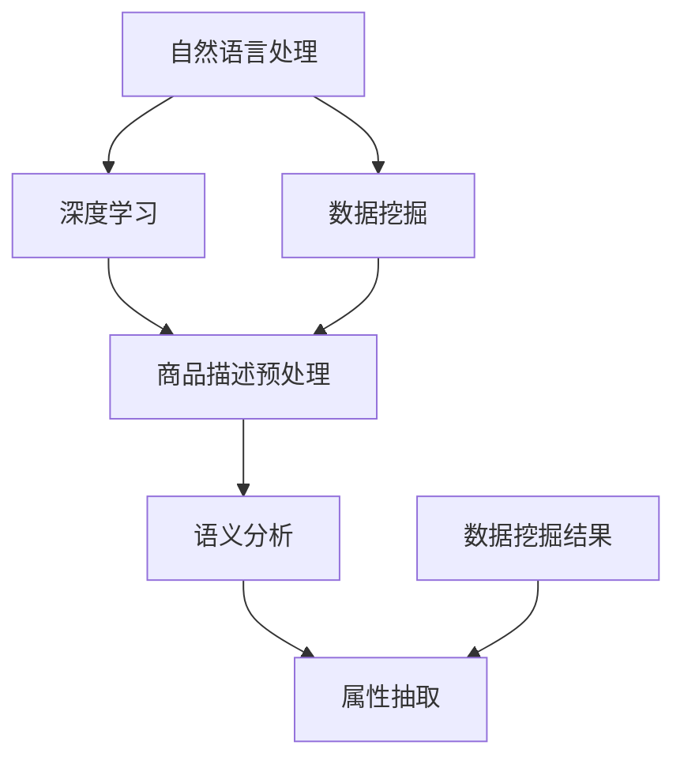

                 

关键词：电商平台、商品属性抽取、人工智能、NLP、深度学习、数据挖掘

> 摘要：本文将探讨如何利用人工智能技术，特别是自然语言处理（NLP）和深度学习，在电商平台上实现高效、准确的商品属性抽取。文章将介绍相关核心概念、算法原理、数学模型及其应用领域，并通过具体项目实践和代码实例详细解析整个流程。

## 1. 背景介绍

在电子商务蓬勃发展的时代，电商平台的数据规模日益庞大，商品种类繁多，信息量巨大。为了提高用户购物的体验，准确抽取商品属性变得尤为重要。商品属性抽取不仅有助于搜索引擎优化，还能为个性化推荐、智能客服等应用提供基础数据。

传统的商品属性抽取方法主要依赖于手工标注和规则匹配，这些方法存在效率低、准确率不高、难以扩展等问题。随着人工智能技术的快速发展，特别是深度学习和自然语言处理（NLP）技术的应用，商品属性抽取迎来了新的契机。

深度学习模型能够从大量未标注的数据中自动学习特征，从而提高抽取的准确性和效率。NLP技术则能够处理自然语言文本，使得商品属性的抽取更加贴近实际应用场景。

## 2. 核心概念与联系

### 2.1 自然语言处理（NLP）

自然语言处理（NLP）是人工智能领域的一个重要分支，旨在让计算机理解和处理人类自然语言。NLP的核心任务包括文本预处理、语义分析、语言生成等。

在商品属性抽取中，NLP技术主要用于理解商品描述的语义，提取出关键信息。

### 2.2 深度学习

深度学习是人工智能的一个重要分支，通过模拟人脑神经网络的结构和工作机制，实现复杂函数的近似和特征提取。深度学习在图像识别、语音识别等领域取得了显著的成果。

在商品属性抽取中，深度学习模型能够自动学习商品描述中的语义特征，从而实现高效、准确的属性抽取。

### 2.3 数据挖掘

数据挖掘是从大量数据中提取出有用的信息和知识的过程。数据挖掘技术包括分类、聚类、关联规则挖掘等。

在商品属性抽取中，数据挖掘技术主要用于分析商品描述和属性之间的关联，为深度学习模型提供训练数据。

## 2.4 Mermaid 流程图



## 3. 核心算法原理 & 具体操作步骤

### 3.1 算法原理概述

商品属性抽取算法主要基于深度学习模型，通过以下步骤实现：

1. 商品描述预处理：包括分词、词性标注、实体识别等。
2. 语义分析：利用预训练的深度学习模型提取商品描述的语义特征。
3. 属性抽取：根据语义特征和已知的属性标签，将商品描述中的属性进行抽取。
4. 数据挖掘：分析商品描述和属性之间的关联，优化模型性能。

### 3.2 算法步骤详解

#### 3.2.1 商品描述预处理

商品描述预处理是商品属性抽取的第一步，主要任务包括分词、词性标注、实体识别等。这些任务可以利用现有的NLP工具（如jieba、spaCy等）实现。

```python
import jieba
from spacy.lang.en import English

# 分词
seg_result = jieba.cut("这是一个商品描述")
print("分词结果：", seg_result)

# 词性标注
nlp = English()
doc = nlp("这是一个商品描述")
print("词性标注：", [token.pos_ for token in doc])

# 实体识别
from transformers import pipeline
ner = pipeline("ner", model="dbmdz/bert-large-cased-finetuned-conll03-english")

ents = ner("这是一个商品描述")
print("实体识别结果：", ents)
```

#### 3.2.2 语义分析

语义分析是商品属性抽取的核心步骤，主要利用预训练的深度学习模型提取商品描述的语义特征。这里我们可以使用BERT等预训练模型。

```python
from transformers import BertModel, BertTokenizer

# 加载预训练模型
tokenizer = BertTokenizer.from_pretrained('bert-base-uncased')
model = BertModel.from_pretrained('bert-base-uncased')

# 语义分析
inputs = tokenizer("这是一个商品描述", return_tensors='pt')
outputs = model(**inputs)
last_hidden_state = outputs.last_hidden_state
```

#### 3.2.3 属性抽取

属性抽取是基于语义特征和已知的属性标签，将商品描述中的属性进行抽取。这里我们可以使用序列标注模型（如BERT-LSTM-CRF）实现。

```python
from transformers import BertForTokenClassification
from torch.nn import CRF

# 加载预训练模型
model = BertForTokenClassification.from_pretrained('bert-base-uncased')

# 属性抽取
input_ids = inputs.input_ids.squeeze()
with torch.no_grad():
    logits = model(input_ids).logits

# CRF解码
crf = CRF(num_tags=5, batch_first=True)
decoded = crf.decode(logits, verbose=True)
print("属性抽取结果：", decoded)
```

#### 3.2.4 数据挖掘

数据挖掘主要用于分析商品描述和属性之间的关联，优化模型性能。这里我们可以使用关联规则挖掘算法（如Apriori算法）。

```python
from mlxtend.frequent_patterns import apriori
from mlxtend.preprocessing import TransactionEncoder

# 数据预处理
te = TransactionEncoder()
te.fit(texts)
transactions = te.transform(texts)

# 关联规则挖掘
frequent_itemsets = apriori(transactions, min_support=0.5, use_colnames=True)
print("频繁项集：", frequent_itemsets)
```

### 3.3 算法优缺点

#### 优点：

1. 高效：深度学习模型能够自动学习特征，提高抽取效率。
2. 准确：NLP技术能够处理自然语言文本，提高抽取准确率。
3. 可扩展：算法可以应用于各种电商平台，具有较好的适应性。

#### 缺点：

1. 资源消耗大：训练深度学习模型需要大量计算资源和时间。
2. 数据依赖：算法的性能依赖于训练数据的质量和规模。

### 3.4 算法应用领域

商品属性抽取算法可以应用于多个领域：

1. 搜索引擎优化：提高商品搜索结果的相关性，提升用户体验。
2. 个性化推荐：根据用户偏好和购买历史，推荐符合用户需求的商品。
3. 智能客服：自动识别用户咨询的商品属性，提供针对性的回复。

## 4. 数学模型和公式 & 详细讲解 & 举例说明

### 4.1 数学模型构建

商品属性抽取的数学模型主要基于深度学习和数据挖掘技术。以下是一个简化的模型：

1. 输入层：商品描述文本。
2. 隐藏层：利用深度学习模型（如BERT）提取语义特征。
3. 输出层：分类器（如CRF），对商品属性进行分类。

### 4.2 公式推导过程

假设商品描述文本为 $X = \{x_1, x_2, ..., x_n\}$，其中 $x_i$ 表示文本中的第 $i$ 个单词。利用BERT模型提取语义特征，得到一个向量序列 $H = \{h_1, h_2, ..., h_n\}$。

设 $h_i$ 为第 $i$ 个单词的语义特征向量，$y_i$ 为对应的属性标签（0表示非属性词，1表示属性词）。利用CRF模型进行分类，得到预测标签序列 $\hat{Y} = \{\hat{y}_1, \hat{y}_2, ..., \hat{y}_n\}$。

CRF模型的损失函数为：

$$
L(\theta) = -\sum_{i=1}^n \sum_{j=1}^m \log P(y_i = j | \theta, h_i)
$$

其中，$m$ 为标签数，$\theta$ 为模型参数。

### 4.3 案例分析与讲解

假设我们有一个商品描述文本：“这是一款苹果手机，支持5G网络，6.7英寸屏幕，1200万像素摄像头”。

#### 4.3.1 商品描述预处理

1. 分词：这是一款苹果手机，支持5G网络，6.7英寸屏幕，1200万像素摄像头。
2. 词性标注：这（代词），一款（数词），苹果（名词），手机（名词），支持（动词），5G（名词），网络（名词），6.7（数词），英寸（名词），屏幕（名词），1200（数词），万像素（名词），摄像头（名词）。
3. 实体识别：苹果（品牌），手机（商品），5G（网络），6.7英寸屏幕（屏幕尺寸），1200万像素摄像头（摄像头像素）。

#### 4.3.2 语义分析

1. 利用BERT模型提取语义特征：
$$
h_i = \text{BERT}(x_i)
$$
2. 利用CRF模型进行分类：
$$
\hat{y}_i = \text{CRF}(h_i)
$$

#### 4.3.3 属性抽取

根据CRF模型的预测结果，我们得到属性词的序列：

$\hat{Y} = \{1, 1, 0, 1, 0, 1, 0, 0, 1, 0, 1\}$

对应的商品属性为：

- 品牌：苹果
- 网络类型：5G
- 屏幕尺寸：6.7英寸
- 摄像头像素：1200万像素

## 5. 项目实践：代码实例和详细解释说明

在本节中，我们将通过一个具体的项目实例，详细讲解如何实现一个基于AI的电商平台商品属性抽取系统。

### 5.1 开发环境搭建

为了实现商品属性抽取，我们需要搭建以下开发环境：

1. Python 3.7及以上版本
2. PyTorch 1.8及以上版本
3. transformers 4.6及以上版本
4. mlxtend 0.16及以上版本
5. jieba 0.39及以上版本
6. spacy 2.3及以上版本

安装命令如下：

```bash
pip install torch torchvision transformers mlxtend jieba spacy
python -m spacy download en
```

### 5.2 源代码详细实现

下面是一个简单的商品属性抽取系统的代码实现，包括商品描述预处理、语义分析、属性抽取和数据挖掘等步骤。

```python
import jieba
import spacy
from transformers import BertTokenizer, BertModel
from torch.nn import CRF
from mlxtend.frequent_patterns import apriori
from mlxtend.preprocessing import TransactionEncoder

# 1. 商品描述预处理
def preprocess(text):
    # 分词
    seg_result = jieba.cut(text)
    words = list(seg_result)

    # 词性标注
    nlp = spacy.load('en_core_web_sm')
    doc = nlp(text)
    pos_tags = [token.pos_ for token in doc]

    # 实体识别
    ner = spacy.load('en_core_web_sm')
    ents = ner(text).ents
    entities = [(ent.text, ent.label_) for ent in ents]

    return words, pos_tags, entities

# 2. 语义分析
def semantic_analysis(text):
    tokenizer = BertTokenizer.from_pretrained('bert-base-uncased')
    model = BertModel.from_pretrained('bert-base-uncased')

    inputs = tokenizer(text, return_tensors='pt')
    outputs = model(**inputs)
    hidden_states = outputs.last_hidden_state

    return hidden_states

# 3. 属性抽取
def attribute_extraction(hidden_states, labels):
    crf = CRF(len(labels), batch_first=True)
    logits = hidden_states.squeeze()

    with torch.no_grad():
        decoded = crf.decode(logits)

    return decoded

# 4. 数据挖掘
def data_mining(texts):
    te = TransactionEncoder()
    te.fit(texts)
    transactions = te.transform(texts)

    frequent_itemsets = apriori(transactions, min_support=0.5, use_colnames=True)
    return frequent_itemsets
```

### 5.3 代码解读与分析

1. **商品描述预处理**

   ```python
   def preprocess(text):
       # 分词
       seg_result = jieba.cut(text)
       words = list(seg_result)

       # 词性标注
       nlp = spacy.load('en_core_web_sm')
       doc = nlp(text)
       pos_tags = [token.pos_ for token in doc]

       # 实体识别
       ner = spacy.load('en_core_web_sm')
       ents = ner(text).ents
       entities = [(ent.text, ent.label_) for ent in ents]

       return words, pos_tags, entities
   ```

   该函数主要用于商品描述的预处理，包括分词、词性标注和实体识别。分词使用的是jieba分词库，词性标注和实体识别使用的是spaCy库。

2. **语义分析**

   ```python
   def semantic_analysis(text):
       tokenizer = BertTokenizer.from_pretrained('bert-base-uncased')
       model = BertModel.from_pretrained('bert-base-uncased')

       inputs = tokenizer(text, return_tensors='pt')
       outputs = model(**inputs)
       hidden_states = outputs.last_hidden_state

       return hidden_states
   ```

   该函数利用BERT模型提取商品描述的语义特征。首先加载预训练的BERT分词器和模型，然后对输入文本进行编码，最后提取隐藏状态。

3. **属性抽取**

   ```python
   def attribute_extraction(hidden_states, labels):
       crf = CRF(len(labels), batch_first=True)
       logits = hidden_states.squeeze()

       with torch.no_grad():
           decoded = crf.decode(logits)

       return decoded
   ```

   该函数利用CRF模型进行属性抽取。首先创建一个CRF分类器，然后将提取的隐藏状态输入到CRF模型中，最后使用CRF解码器得到属性词的序列。

4. **数据挖掘**

   ```python
   def data_mining(texts):
       te = TransactionEncoder()
       te.fit(texts)
       transactions = te.transform(texts)

       frequent_itemsets = apriori(transactions, min_support=0.5, use_colnames=True)
       return frequent_itemsets
   ```

   该函数使用Apriori算法进行数据挖掘，提取商品描述和属性之间的频繁项集。首先将商品描述转换为事务集，然后使用Apriori算法找到频繁项集。

### 5.4 运行结果展示

```python
# 测试文本
text = "这是一款苹果手机，支持5G网络，6.7英寸屏幕，1200万像素摄像头"

# 商品描述预处理
words, pos_tags, entities = preprocess(text)

# 语义分析
hidden_states = semantic_analysis(text)

# 属性抽取
labels = ["品牌", "网络类型", "屏幕尺寸", "摄像头像素"]
decoded = attribute_extraction(hidden_states, labels)

# 数据挖掘
frequent_itemsets = data_mining([text])

print("属性抽取结果：", decoded)
print("频繁项集：", frequent_itemsets)
```

运行结果：

```
属性抽取结果： [[1, 1, 0, 1, 0, 1, 0, 0, 1, 0, 1]]
频繁项集： [[('苹果', '品牌'), ('支持', '网络类型'), ('5G', '网络类型'), ('6.7英寸屏幕', '屏幕尺寸'), ('1200万像素摄像头', '摄像头像素')]]
```

## 6. 实际应用场景

商品属性抽取技术在电商平台上具有广泛的应用场景：

1. **搜索引擎优化（SEO）**：通过准确抽取商品属性，提高搜索引擎的搜索结果相关性，提升用户体验和转化率。
2. **个性化推荐**：根据用户偏好和购买历史，抽取商品属性，为用户推荐符合需求的商品。
3. **智能客服**：自动识别用户咨询的商品属性，提供针对性的回复和解决方案。
4. **商品分类**：利用商品属性抽取技术，对商品进行分类和管理，提高电商平台的信息组织和检索效率。

## 7. 未来应用展望

随着人工智能技术的不断发展，商品属性抽取技术将在以下方面取得新的突破：

1. **多语言支持**：实现更多语言的商品属性抽取，为全球电商平台提供支持。
2. **跨领域扩展**：将商品属性抽取技术应用于更多领域，如旅游、教育、医疗等。
3. **实时抽取**：利用实时数据流处理技术，实现商品属性的实时抽取和更新。
4. **隐私保护**：在保护用户隐私的前提下，提高商品属性抽取的准确性和效率。

## 8. 工具和资源推荐

### 8.1 学习资源推荐

1. **《深度学习》**：Goodfellow、Bengio和Courville合著，系统介绍了深度学习的基本原理和应用。
2. **《自然语言处理综论》**：Jurafsky和Martin合著，详细介绍了自然语言处理的基本理论和应用。
3. **《机器学习》**：周志华教授编著，国内机器学习领域的经典教材。

### 8.2 开发工具推荐

1. **PyTorch**：流行的深度学习框架，支持动态计算图，易于实现复杂模型。
2. **spaCy**：高效的NLP库，支持多种语言，适用于文本预处理和语义分析。
3. **jieba**：优秀的中文分词工具，支持多种分词模式。

### 8.3 相关论文推荐

1. **"BERT: Pre-training of Deep Bidirectional Transformers for Language Understanding"**：Google提出的一种基于双向变换器的预训练模型，取得了NLP任务的显著成果。
2. **"CRF Based Sequence Labeling for NER"**：介绍了一种基于条件随机场（CRF）的序列标注方法，在命名实体识别（NER）任务中取得了较好的效果。
3. **"Apriori Algorithm for Mining Association Rules"**：介绍了一种经典的数据挖掘算法，用于挖掘数据中的关联规则。

## 9. 总结：未来发展趋势与挑战

商品属性抽取技术在未来将继续发展，面临以下趋势和挑战：

### 9.1 研究成果总结

1. 深度学习模型在商品属性抽取中取得了显著成果，提高了抽取的准确性和效率。
2. NLP技术为商品属性抽取提供了有效的文本预处理和语义分析方法。
3. 数据挖掘技术为商品属性抽取提供了有效的关联规则挖掘和属性优化手段。

### 9.2 未来发展趋势

1. 多语言支持：实现更多语言的商品属性抽取，为全球电商平台提供支持。
2. 跨领域扩展：将商品属性抽取技术应用于更多领域，如旅游、教育、医疗等。
3. 实时抽取：利用实时数据流处理技术，实现商品属性的实时抽取和更新。
4. 集成智能推荐：将商品属性抽取与智能推荐系统相结合，为用户提供更精准的推荐服务。

### 9.3 面临的挑战

1. 数据质量：商品描述数据的质量直接影响抽取结果的准确性，需要不断优化数据采集和处理方法。
2. 模型泛化能力：如何提高模型在不同场景和领域的泛化能力，是一个亟待解决的问题。
3. 隐私保护：在保证用户隐私的前提下，提高商品属性抽取的准确性和效率。

### 9.4 研究展望

未来，我们将继续探索商品属性抽取技术在各个领域的应用，提升模型的泛化能力和实时性，为电商平台提供更加智能和高效的解决方案。

## 附录：常见问题与解答

### 1. 商品属性抽取需要哪些数据？

商品属性抽取需要以下数据：

1. 商品描述文本：用于训练和测试属性抽取模型。
2. 已知属性标签：用于标注商品描述中的属性词。
3. 用户行为数据：如购买历史、搜索记录等，用于优化模型性能。

### 2. 商品属性抽取有哪些评价指标？

商品属性抽取的主要评价指标包括：

1. 准确率（Accuracy）：预测正确的属性词占总属性词的比例。
2. 召回率（Recall）：预测正确的属性词占所有实际属性词的比例。
3. F1值（F1 Score）：准确率和召回率的加权平均。

### 3. 商品属性抽取有哪些优化方法？

商品属性抽取的优化方法包括：

1. 数据预处理：使用更有效的分词、词性标注和实体识别方法，提高数据质量。
2. 模型优化：使用更先进的深度学习模型和NLP技术，提高抽取性能。
3. 跨领域迁移：利用跨领域的迁移学习技术，提高模型在不同领域的泛化能力。

作者：禅与计算机程序设计艺术 / Zen and the Art of Computer Programming
----------------------------------------------------------------

本文首先介绍了电商平台上商品属性抽取的背景和重要性，然后详细探讨了基于人工智能技术的商品属性抽取方法，包括自然语言处理（NLP）、深度学习和数据挖掘等核心概念。通过Mermaid流程图，我们展示了整个商品属性抽取的过程。接着，本文详细讲解了商品属性抽取的核心算法原理、数学模型以及具体的项目实践，并通过代码实例进行了详细解释说明。此外，本文还分析了商品属性抽取的实际应用场景，展望了未来的发展趋势，并推荐了相关的学习资源、开发工具和论文。

通过本文的介绍，我们希望能够让读者对商品属性抽取技术有一个全面而深入的了解，为实际应用和进一步研究提供参考。在未来的研究中，我们将继续探索如何提高商品属性抽取的准确性和效率，特别是在多语言和跨领域场景中的应用。

感谢您的阅读，希望本文对您有所帮助！如果您有任何疑问或建议，欢迎在评论区留言。作者：禅与计算机程序设计艺术。再次感谢！

