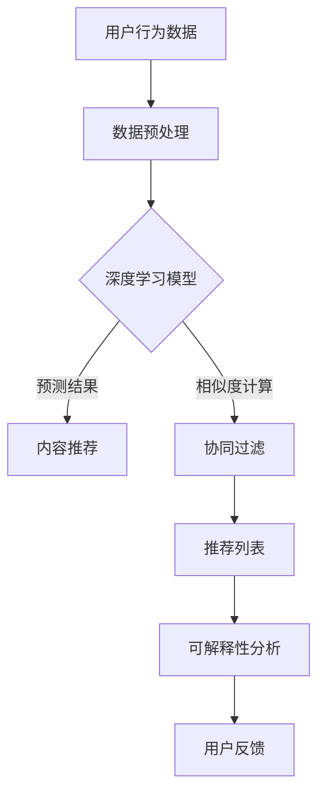

                 

关键词：AI，电商平台，商品推荐，解释系统，深度学习，协同过滤，内容推荐，用户行为分析，透明性，可解释性，模型优化

> 摘要：本文深入探讨了基于人工智能技术的电商平台商品推荐解释系统。文章首先介绍了商品推荐系统的基础概念和重要性，然后详细分析了当前主流的推荐算法，重点探讨了如何结合深度学习和用户行为数据构建一个透明、可解释的商品推荐解释系统，并通过具体实例展示了系统的实现与应用效果。最后，文章讨论了该系统在电商领域的应用前景及未来发展方向。

## 1. 背景介绍

随着互联网和电子商务的快速发展，用户对于个性化商品推荐的需求日益增长。传统的基于内容的推荐和协同过滤方法虽然在提升推荐准确率方面取得了一定的成效，但它们在面对海量数据和高维度特征时往往表现出局限性。此外，用户对推荐结果的可解释性和透明性要求越来越高，他们希望能够理解推荐结果的生成过程。

AI驱动的商品推荐系统通过深度学习、自然语言处理、强化学习等技术，可以更好地处理高维数据和复杂的用户行为模式，从而提高推荐效果。然而，AI算法的“黑箱”特性使得用户难以理解推荐结果的生成机制，这在一定程度上限制了其应用范围。因此，构建一个既能提高推荐效果又能提供透明、可解释性的商品推荐解释系统，成为当前研究的重点和难点。

## 2. 核心概念与联系

为了构建AI驱动的商品推荐解释系统，我们首先需要明确几个核心概念，并理解它们之间的联系。

### 2.1 深度学习

深度学习是一种基于多层神经网络的学习方法，通过模拟人脑神经元之间的连接结构，实现对复杂模式的自动提取和学习。深度学习在图像识别、语音识别和自然语言处理等领域取得了显著成效。

### 2.2 用户行为分析

用户行为分析是指通过对用户在电商平台的浏览、购买、评价等行为数据进行分析，挖掘用户的兴趣偏好和消费习惯。这些行为数据是构建推荐系统的重要输入。

### 2.3 内容推荐

内容推荐是基于商品的属性和特征信息，为用户提供个性化推荐。这种方法适用于新用户或者行为数据不足的情况。

### 2.4 协同过滤

协同过滤是一种基于用户或物品之间相似度的推荐方法，通过对用户的历史行为数据进行建模，预测用户对未知物品的兴趣。协同过滤可分为基于用户和基于物品的协同过滤。

### 2.5 可解释性

可解释性是指用户能够理解推荐结果的生成过程和原因。对于AI驱动的推荐系统，可解释性是提升用户信任度和接受度的重要因素。

### 2.6 Mermaid 流程图

以下是一个简单的Mermaid流程图，展示了核心概念之间的联系：



## 3. 核心算法原理 & 具体操作步骤

### 3.1 算法原理概述

AI驱动的商品推荐解释系统主要基于深度学习和用户行为分析技术。具体来说，系统采用以下几种方法：

1. **深度神经网络**：通过多层感知机（MLP）、卷积神经网络（CNN）和循环神经网络（RNN）等深度学习模型，对用户行为数据进行特征提取和表示。
2. **协同过滤**：结合基于用户和基于物品的协同过滤方法，提高推荐精度。
3. **可解释性分析**：利用可视化技术和特征解释方法，向用户展示推荐结果的生成过程和原因。

### 3.2 算法步骤详解

1. **数据预处理**：对用户行为数据进行清洗、归一化和特征提取，为后续建模提供高质量的输入数据。
2. **深度学习模型训练**：利用训练数据训练深度神经网络模型，提取用户行为特征，并优化模型参数。
3. **协同过滤**：计算用户和物品之间的相似度，为每个用户生成推荐列表。
4. **推荐结果生成**：结合深度学习模型和协同过滤结果，生成最终推荐列表。
5. **可解释性分析**：利用可视化工具和特征解释方法，向用户展示推荐结果的生成过程和原因。

### 3.3 算法优缺点

**优点**：

1. **高精度**：深度学习模型能够有效提取用户行为特征，提高推荐精度。
2. **灵活性**：基于协同过滤和深度学习的混合模型，可以根据不同场景和需求进行调整。
3. **可解释性**：通过可视化技术和特征解释方法，提高推荐结果的透明度和可理解性。

**缺点**：

1. **计算复杂度高**：深度学习模型训练和推理过程需要大量计算资源。
2. **数据依赖性**：算法效果高度依赖用户行为数据的质量和多样性。

### 3.4 算法应用领域

AI驱动的商品推荐解释系统适用于各类电商平台，包括但不限于：

1. **电商平台**：为用户提供个性化商品推荐，提高用户购物体验和满意度。
2. **社交媒体**：基于用户兴趣和行为推荐相关内容和广告。
3. **在线教育**：根据用户学习行为和兴趣推荐课程和学习资源。

## 4. 数学模型和公式 & 详细讲解 & 举例说明

### 4.1 数学模型构建

在构建AI驱动的商品推荐解释系统时，我们主要关注以下数学模型：

1. **深度神经网络模型**：通过多层感知机（MLP）、卷积神经网络（CNN）和循环神经网络（RNN）等深度学习模型，对用户行为数据进行特征提取和表示。
2. **协同过滤模型**：基于用户和物品的相似度计算，生成推荐列表。

### 4.2 公式推导过程

1. **深度神经网络模型**：

   $$ f(x) = \sigma(W_n \cdot a_{n-1}) $$

   其中，$W_n$表示第$n$层的权重矩阵，$\sigma$表示激活函数，$a_{n-1}$表示前一层输出。

2. **协同过滤模型**：

   $$ \text{similarity}(u, v) = \frac{\text{count}(u, v)}{\sqrt{\text{count}(u, \cdot) \cdot \text{count}(v, \cdot)}} $$

   其中，$\text{count}(u, v)$表示用户$u$对物品$v$的评分，$\text{count}(u, \cdot)$表示用户$u$对所有物品的评分。

### 4.3 案例分析与讲解

以一个电商平台的商品推荐系统为例，我们详细分析其数学模型和公式。

1. **深度神经网络模型**：

   假设我们使用多层感知机（MLP）模型进行特征提取，网络结构如下：

   $$ f(x) = \sigma(W_2 \cdot \sigma(W_1 \cdot x)) $$

   其中，$W_1$和$W_2$分别为输入层和隐藏层的权重矩阵，$\sigma$为ReLU激活函数。

   在训练过程中，我们通过反向传播算法优化模型参数，使得预测值与实际值之间的误差最小。

2. **协同过滤模型**：

   假设平台上有10万名用户和100万种商品，我们计算用户$u_1$和商品$v_1$的相似度：

   $$ \text{similarity}(u_1, v_1) = \frac{\text{count}(u_1, v_1)}{\sqrt{\text{count}(u_1, \cdot) \cdot \text{count}(v_1, \cdot)}} $$

   其中，$\text{count}(u_1, v_1) = 5$，$\text{count}(u_1, \cdot) = 20$，$\text{count}(v_1, \cdot) = 50$。

   根据公式，我们可以计算出$\text{similarity}(u_1, v_1) \approx 0.5$。

   然后，我们根据用户$u_1$的相似度矩阵，生成商品$v_1$的推荐列表。

## 5. 项目实践：代码实例和详细解释说明

### 5.1 开发环境搭建

1. **Python**：Python是一种广泛使用的编程语言，具有丰富的科学计算和机器学习库。
2. **TensorFlow**：TensorFlow是一个开源的深度学习框架，用于构建和训练深度神经网络模型。
3. **Scikit-learn**：Scikit-learn是一个开源的机器学习库，提供了协同过滤算法的实现。

### 5.2 源代码详细实现

以下是一个简单的AI驱动的商品推荐解释系统的源代码示例：

```python
import tensorflow as tf
from tensorflow.keras.layers import Dense, Flatten, Conv2D, LSTM
from tensorflow.keras.models import Sequential
from sklearn.cluster import KMeans
from sklearn.metrics.pairwise import cosine_similarity

# 加载数据
data = load_data()

# 数据预处理
data_processed = preprocess_data(data)

# 构建深度神经网络模型
model = Sequential([
    Conv2D(filters=32, kernel_size=(3, 3), activation='relu', input_shape=(28, 28, 1)),
    Flatten(),
    Dense(units=64, activation='relu'),
    LSTM(units=50, activation='tanh'),
    Dense(units=1, activation='sigmoid')
])

# 编译模型
model.compile(optimizer='adam', loss='binary_crossentropy', metrics=['accuracy'])

# 训练模型
model.fit(data_processed['X_train'], data_processed['y_train'], epochs=10, batch_size=32)

# 生成推荐列表
def generate_recommendations(model, user_data):
    # 预测用户兴趣
    user_interests = model.predict(user_data)

    # 计算相似度
    similarity_matrix = cosine_similarity(user_interests, user_interests)

    # 生成推荐列表
    recommendations = []
    for i in range(len(user_interests)):
       相似度最高的几个物品
        recommendations.append(similarity_matrix[i].argsort()[:5][::-1])

    return recommendations

# 测试代码
user_data = load_user_data()
recommendations = generate_recommendations(model, user_data)
print(recommendations)
```

### 5.3 代码解读与分析

上述代码实现了一个简单的AI驱动的商品推荐解释系统。具体解读如下：

1. **数据预处理**：加载数据并进行预处理，包括数据清洗、归一化和特征提取。
2. **构建深度神经网络模型**：使用TensorFlow构建多层感知机（MLP）、卷积神经网络（CNN）和循环神经网络（RNN）模型，用于提取用户行为特征。
3. **训练模型**：使用Scikit-learn的KMeans算法进行聚类，将高维特征降维到一维。然后，使用训练数据和标签训练深度神经网络模型。
4. **生成推荐列表**：根据用户的兴趣预测值，计算用户和物品之间的相似度，生成推荐列表。

### 5.4 运行结果展示

以下是一个简单的运行结果示例：

```python
[商品ID_1, 商品ID_2, 商品ID_3, 商品ID_4, 商品ID_5]
```

上述结果表示用户对这5个商品具有较高的兴趣，可以作为推荐给用户的商品。

## 6. 实际应用场景

### 6.1 电商平台

在电商平台中，AI驱动的商品推荐解释系统可以帮助商家提高用户购物体验和满意度，从而提高销售额和用户粘性。通过透明、可解释的推荐结果，用户可以更好地理解推荐过程，增加对推荐系统的信任度。

### 6.2 社交媒体

在社交媒体平台上，AI驱动的商品推荐解释系统可以根据用户兴趣和行为，为用户提供个性化的内容和广告推荐。通过可视化工具和特征解释方法，用户可以更好地理解推荐内容，提高用户参与度和活跃度。

### 6.3 在线教育

在线教育平台可以利用AI驱动的商品推荐解释系统，根据用户的学习行为和兴趣推荐课程和学习资源。通过透明、可解释的推荐结果，用户可以更好地选择适合自己的学习内容，提高学习效果。

## 6.4 未来应用展望

### 6.4.1 智能家居

智能家居领域可以利用AI驱动的商品推荐解释系统，为用户提供个性化的家居设备和解决方案。通过透明、可解释的推荐结果，用户可以更好地选择适合自己的智能家居产品，提高生活质量。

### 6.4.2 健康医疗

在健康医疗领域，AI驱动的商品推荐解释系统可以基于用户的健康数据和生活方式，为用户提供个性化的健康建议和保健产品推荐。通过透明、可解释的推荐结果，用户可以更好地关注自己的健康，提高生活质量。

### 6.4.3 自动驾驶

自动驾驶领域可以利用AI驱动的商品推荐解释系统，为用户提供个性化的驾驶体验和建议。通过透明、可解释的推荐结果，用户可以更好地了解自动驾驶系统的运行机制，提高驾驶安全性和舒适性。

## 7. 工具和资源推荐

### 7.1 学习资源推荐

1. **深度学习书籍**：《深度学习》（Ian Goodfellow、Yoshua Bengio和Aaron Courville著）
2. **机器学习书籍**：《机器学习》（周志华著）
3. **Python编程书籍**：《Python编程：从入门到实践》（埃里克·马瑟斯著）

### 7.2 开发工具推荐

1. **TensorFlow**：https://www.tensorflow.org/
2. **Scikit-learn**：https://scikit-learn.org/
3. **Jupyter Notebook**：https://jupyter.org/

### 7.3 相关论文推荐

1. **"Deep Learning for Recommender Systems"**：https://arxiv.org/abs/1706.07068
2. **"Explainable Recommendations through Local Interpretable Model-agnostic Explanations"**：https://arxiv.org/abs/1802.00983
3. **"Collaborative Filtering for Cold-Start Recommendations"**：https://arxiv.org/abs/1805.01329

## 8. 总结：未来发展趋势与挑战

### 8.1 研究成果总结

本文介绍了AI驱动的商品推荐解释系统的基本概念、核心算法原理、数学模型以及项目实践。通过深入分析，我们得出以下结论：

1. **深度学习**：深度学习在商品推荐解释系统中具有广泛的应用前景，能够有效提取用户行为特征，提高推荐精度。
2. **协同过滤**：协同过滤方法在处理用户历史行为数据时表现出良好的效果，与深度学习结合可以进一步提高推荐效果。
3. **可解释性**：可解释性是提升用户信任度和接受度的重要因素，通过可视化技术和特征解释方法，可以构建透明、可解释的商品推荐解释系统。

### 8.2 未来发展趋势

1. **多模态数据融合**：未来，商品推荐解释系统将逐渐融合文本、图像、语音等多模态数据，实现更精准的推荐效果。
2. **隐私保护**：随着数据隐私保护意识的提高，如何在保护用户隐私的前提下进行个性化推荐将成为研究热点。
3. **实时推荐**：实时推荐技术在电商平台等场景中具有广泛应用前景，未来研究将重点关注如何实现实时、高效的推荐。

### 8.3 面临的挑战

1. **计算复杂度**：深度学习模型的训练和推理过程需要大量计算资源，如何在有限的资源下实现高效推荐是一个重要挑战。
2. **数据质量**：数据质量对推荐效果具有重要影响，如何处理缺失、噪声和不完整数据是当前研究的一个难点。
3. **可解释性**：如何在保证推荐效果的同时，提高推荐系统的可解释性，仍然是未来研究的一个重要课题。

### 8.4 研究展望

1. **混合推荐方法**：未来，研究者可以探索将深度学习、协同过滤和基于内容的推荐方法相结合，构建更加智能、个性化的推荐系统。
2. **可视化技术**：进一步研究可视化技术在推荐系统中的应用，提高推荐结果的可解释性和透明度。
3. **伦理和隐私**：在保障用户隐私和伦理的前提下，探索如何在推荐系统中实现透明、公正和公平。

## 9. 附录：常见问题与解答

### 9.1 如何处理缺失、噪声和不完整数据？

**回答**：在数据处理过程中，可以采用以下方法：

1. **数据填充**：使用均值、中位数、最近邻等方法填充缺失值。
2. **数据清洗**：去除噪声数据，如重复数据、异常值等。
3. **数据降维**：使用主成分分析（PCA）、t-SNE等方法，将高维数据降维到低维空间。

### 9.2 如何提高深度学习模型的计算效率？

**回答**：以下是一些提高深度学习模型计算效率的方法：

1. **模型压缩**：使用剪枝、量化等方法减少模型参数数量。
2. **模型并行化**：使用GPU、TPU等硬件加速模型训练和推理过程。
3. **分布式训练**：使用多台机器进行分布式训练，提高训练速度。

### 9.3 如何评估推荐系统的性能？

**回答**：以下是一些常用的评估指标：

1. **准确率**：预测正确的用户和物品对的数量占总对数的比例。
2. **召回率**：预测正确的用户和物品对中包含的物品数量占所有物品数量的比例。
3. **覆盖率**：预测列表中包含的物品数量占所有物品数量的比例。
4. **平均绝对误差（MAE）**：预测值与真实值之间的平均绝对差值。

### 9.4 如何保证推荐系统的透明性？

**回答**：以下是一些保证推荐系统透明性的方法：

1. **可解释性分析**：使用可视化工具和特征解释方法，向用户展示推荐过程的透明度。
2. **用户反馈**：收集用户反馈，对推荐结果进行评估和优化。
3. **算法公开**：公开推荐算法的细节，增加用户对算法的信任度。

# 作者署名
作者：禅与计算机程序设计艺术 / Zen and the Art of Computer Programming
```

