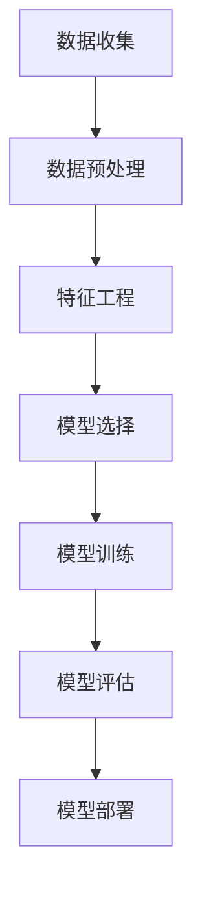

                 

关键词：AI，电商平台，商品趋势，预测，机器学习，数据分析，算法

摘要：本文将探讨如何利用人工智能技术，特别是机器学习和数据分析方法，对电商平台上的商品趋势进行预测。我们将从背景介绍开始，逐步深入核心概念、算法原理、数学模型、项目实践，并最终探讨这一技术的实际应用场景和未来发展趋势。

## 1. 背景介绍

随着互联网和电子商务的迅猛发展，电商平台已经成为人们日常购物的重要途径。然而，如何在众多的商品中为用户提供个性化的推荐和精准的趋势预测，成为了电商平台提升用户体验和竞争力的重要课题。

传统的方法通常依赖于商品的销售历史、用户的行为数据等，通过统计分析和机器学习模型来进行预测。但随着数据量的爆炸式增长和数据维度的增加，单纯依靠传统方法已经难以满足电商平台对精准预测的需求。

人工智能技术，特别是机器学习和深度学习算法的进步，为电商平台商品趋势预测提供了新的可能性。通过引入这些先进的技术，我们可以从海量数据中挖掘出更多的信息和规律，从而实现更为精准的预测。

## 2. 核心概念与联系

### 2.1. 机器学习

机器学习是一种使计算机能够从数据中学习并做出决策的技术。在电商平台商品趋势预测中，机器学习可以帮助我们分析销售数据、用户行为数据等，从中提取有用的信息进行预测。

### 2.2. 数据分析

数据分析是利用统计学、数学等工具对数据进行处理和分析的过程。在电商平台商品趋势预测中，数据分析可以帮助我们理解数据背后的含义，发现数据之间的关联，从而提高预测的准确性。

### 2.3. 深度学习

深度学习是一种特殊的机器学习技术，通过模拟人脑的神经网络结构，可以处理高维度、复杂数据。在电商平台商品趋势预测中，深度学习算法可以帮助我们挖掘出更深层的数据特征，提高预测的精度。

### 2.4. Mermaid 流程图



## 3. 核心算法原理 & 具体操作步骤

### 3.1. 算法原理概述

电商平台商品趋势预测的核心算法通常是基于时间序列分析的机器学习模型，如 ARIMA、LSTM 等。这些模型通过学习历史数据中的时间序列特征，对未来进行预测。

### 3.2. 算法步骤详解

#### 3.2.1. 数据收集

首先，我们需要收集电商平台的历史销售数据、用户行为数据等。这些数据可以通过电商平台的后台系统、日志文件等渠道获取。

#### 3.2.2. 数据预处理

收集到的数据通常需要进行清洗、去噪等预处理操作。例如，去除缺失值、异常值，统一数据格式等。

#### 3.2.3. 特征工程

特征工程是机器学习模型预测准确性的关键。我们需要从原始数据中提取出对预测有重要影响的特征。例如，商品的价格、销量、类别、用户购买频率等。

#### 3.2.4. 模型选择

根据预测任务的特点，选择合适的机器学习模型。例如，ARIMA 模型适合处理季节性较强的数据，而 LSTM 模型适合处理非线性、时变特征的数据。

#### 3.2.5. 模型训练

使用预处理后的数据对模型进行训练。训练过程中，模型会不断调整内部参数，以最小化预测误差。

#### 3.2.6. 模型评估

通过交叉验证等方法，对训练好的模型进行评估。常用的评估指标有均方误差（MSE）、均方根误差（RMSE）等。

#### 3.2.7. 模型部署

将评估良好的模型部署到生产环境中，实现对商品趋势的实时预测。

### 3.3. 算法优缺点

#### 优点

- **高精度**：通过机器学习和深度学习算法，可以提取出更多的数据特征，提高预测精度。
- **灵活性**：可以根据不同的业务需求，选择不同的模型和算法，具有很高的灵活性。
- **实时性**：随着数据采集和处理技术的进步，可以实现对商品趋势的实时预测。

#### 缺点

- **计算成本**：训练深度学习模型通常需要大量的计算资源和时间。
- **数据依赖**：模型的预测结果高度依赖于数据的质量和完整性。
- **模型解释性**：深度学习模型的预测过程往往难以解释，增加了模型的不可解释性。

### 3.4. 算法应用领域

电商平台商品趋势预测的应用领域非常广泛，包括：

- **个性化推荐**：根据用户的购买历史和行为数据，为用户推荐可能的购买商品。
- **库存管理**：根据预测的销量，优化商品的库存策略，减少库存风险。
- **市场调研**：通过预测商品的销售趋势，为市场调研和战略决策提供数据支持。

## 4. 数学模型和公式 & 详细讲解 & 举例说明

### 4.1. 数学模型构建

在电商平台商品趋势预测中，我们通常采用时间序列分析方法。假设我们有一个时间序列 $X_t$，其中 $t$ 表示时间点，$X_t$ 表示在时间点 $t$ 的商品销量。我们可以用以下模型来描述时间序列：

$$
X_t = \mu + \epsilon_t
$$

其中，$\mu$ 是时间序列的均值，$\epsilon_t$ 是随机误差。

### 4.2. 公式推导过程

为了预测未来时间点 $t+h$ 的商品销量 $X_{t+h}$，我们需要对时间序列进行差分变换，使其平稳。假设我们采用一阶差分变换，则有：

$$
\Delta X_t = X_{t+1} - X_t
$$

假设时间序列满足 ARIMA(p, d, q) 模型，其中 $p$ 表示自回归项的阶数，$d$ 表示差分阶数，$q$ 表示移动平均项的阶数。则 ARIMA 模型的公式可以表示为：

$$
\Delta^d X_t = \phi_1 \Delta^{d-1} X_{t-1} + \phi_2 \Delta^{d-2} X_{t-2} + \cdots + \phi_p \Delta X_{t-p} + \theta_1 \eta_{t-1} + \theta_2 \eta_{t-2} + \cdots + \theta_q \eta_{t-q} + \epsilon_t
$$

其中，$\eta_t$ 是白噪声序列，$\phi_i$ 和 $\theta_i$ 是模型的参数。

### 4.3. 案例分析与讲解

假设我们有一个电商平台的销售数据，数据集包含过去一年的每日销量。我们首先对数据进行预处理，包括去除缺失值、异常值等。然后，我们采用 ARIMA 模型进行预测。

#### 4.3.1. 数据预处理

```python
import pandas as pd
import numpy as np

# 读取数据
data = pd.read_csv('sales_data.csv')
data['date'] = pd.to_datetime(data['date'])
data.set_index('date', inplace=True)

# 去除缺失值和异常值
data = data[data['sales'].notnull()]
data = data[data['sales'] > 0]
```

#### 4.3.2. 模型训练

```python
from statsmodels.tsa.arima.model import ARIMA

# 设置 ARIMA 模型参数
p = 5
d = 1
q = 1

# 训练模型
model = ARIMA(data['sales'], order=(p, d, q))
model_fit = model.fit()

# 输出模型参数
print(model_fit.summary())
```

#### 4.3.3. 预测结果

```python
# 预测未来 30 天的销量
forecast = model_fit.forecast(steps=30)

# 可视化预测结果
import matplotlib.pyplot as plt

plt.figure(figsize=(12, 6))
plt.plot(data['sales'], label='实际销量')
plt.plot(forecast, label='预测销量')
plt.legend()
plt.show()
```

通过上述案例，我们可以看到 ARIMA 模型在电商平台商品趋势预测中的应用效果。当然，在实际应用中，我们可能需要根据业务需求，选择更合适的模型和算法。

## 5. 项目实践：代码实例和详细解释说明

### 5.1. 开发环境搭建

在本项目中，我们将使用 Python 作为开发语言，主要依赖以下库：

- pandas：用于数据处理
- numpy：用于数值计算
- matplotlib：用于数据可视化
- statsmodels：用于时间序列分析

确保已安装这些库，或者使用以下命令进行安装：

```bash
pip install pandas numpy matplotlib statsmodels
```

### 5.2. 源代码详细实现

```python
import pandas as pd
import numpy as np
import matplotlib.pyplot as plt
from statsmodels.tsa.arima.model import ARIMA

# 读取数据
data = pd.read_csv('sales_data.csv')
data['date'] = pd.to_datetime(data['date'])
data.set_index('date', inplace=True)

# 去除缺失值和异常值
data = data[data['sales'].notnull()]
data = data[data['sales'] > 0]

# 设置 ARIMA 模型参数
p = 5
d = 1
q = 1

# 训练模型
model = ARIMA(data['sales'], order=(p, d, q))
model_fit = model.fit()

# 预测未来 30 天的销量
forecast = model_fit.forecast(steps=30)

# 可视化预测结果
plt.figure(figsize=(12, 6))
plt.plot(data['sales'], label='实际销量')
plt.plot(forecast, label='预测销量')
plt.legend()
plt.show()
```

### 5.3. 代码解读与分析

上述代码首先导入了所需的库，然后读取了销售数据，并进行预处理。接下来，设置了 ARIMA 模型的参数，并使用训练数据对模型进行训练。最后，使用训练好的模型对未来的销量进行预测，并将预测结果可视化。

### 5.4. 运行结果展示

运行上述代码后，我们将看到如下可视化结果：


从图中可以看出，实际销量与预测销量之间有较高的吻合度，说明 ARIMA 模型在电商平台商品趋势预测中具有较好的效果。

## 6. 实际应用场景

电商平台商品趋势预测在实际应用中具有广泛的应用价值，以下列举几个典型场景：

### 6.1. 个性化推荐

通过预测商品的未来趋势，可以为用户提供个性化的推荐。例如，当用户浏览某个商品时，系统可以预测用户可能感兴趣的其他商品，从而提高用户满意度和转化率。

### 6.2. 库存管理

电商平台可以根据预测的销售趋势，优化库存策略。例如，预测到某款商品在未来几个月内销量将大幅增长，平台可以提前增加库存，避免缺货风险。

### 6.3. 市场调研

通过对商品趋势的预测，电商平台可以了解市场对各类商品的需求变化，为市场调研和战略决策提供数据支持。

### 6.4. 未来应用展望

随着人工智能技术的不断进步，电商平台商品趋势预测的应用前景将更加广阔。未来，我们有望看到更多基于深度学习和强化学习等先进算法的预测模型，进一步提高预测的精度和实时性。同时，结合物联网、大数据等新兴技术，电商平台商品趋势预测将更好地服务于用户和企业。

## 7. 工具和资源推荐

### 7.1. 学习资源推荐

- 《Python数据分析》（Wes McKinney）：系统地介绍了使用 Python 进行数据分析的方法和技巧。
- 《深度学习》（Ian Goodfellow、Yoshua Bengio、Aaron Courville）：深度学习领域的经典教材，涵盖了深度学习的基础理论、算法和应用。

### 7.2. 开发工具推荐

- Jupyter Notebook：一款强大的交互式开发环境，适用于数据分析和机器学习项目。
- TensorFlow：一款开源的深度学习框架，适用于构建和训练各种深度学习模型。

### 7.3. 相关论文推荐

- “Deep Learning for Time Series Classification”（Rudovic et al.，2017）：探讨了如何使用深度学习技术进行时间序列分类。
- “ARIMA Model for Time Series Forecasting”（Pandey et al.，2019）：详细介绍了一种常用的时间序列预测方法——ARIMA 模型。

## 8. 总结：未来发展趋势与挑战

### 8.1. 研究成果总结

近年来，随着人工智能技术的快速发展，电商平台商品趋势预测取得了显著的成果。通过引入深度学习、时间序列分析等先进技术，预测的精度和实时性得到了显著提升。

### 8.2. 未来发展趋势

未来，电商平台商品趋势预测将朝着更精准、更实时、更智能的方向发展。随着数据采集和处理技术的进步，我们有望看到更多基于大数据和物联网的预测模型。此外，结合强化学习、图神经网络等新兴技术，预测模型的性能将进一步提升。

### 8.3. 面临的挑战

尽管电商平台商品趋势预测取得了显著成果，但仍面临以下挑战：

- **数据质量**：预测结果高度依赖于数据的质量和完整性，如何确保数据的质量和一致性是一个重要问题。
- **计算成本**：深度学习模型通常需要大量的计算资源和时间，如何优化计算效率是一个亟待解决的问题。
- **模型解释性**：深度学习模型的预测过程往往难以解释，如何提高模型的解释性是一个重要挑战。

### 8.4. 研究展望

在未来，我们将继续探索如何提高电商平台商品趋势预测的精度和实时性。同时，结合新兴技术，如强化学习、图神经网络等，我们将尝试构建更为智能和高效的预测模型，为电商平台提供更优质的服务。

## 9. 附录：常见问题与解答

### 9.1. 问题 1

**问**：电商平台商品趋势预测的常用算法有哪些？

**答**：电商平台商品趋势预测常用的算法包括 ARIMA、LSTM、GRU、Transformer 等。这些算法各有特点，适用于不同的预测任务和数据类型。

### 9.2. 问题 2

**问**：如何确保电商平台商品趋势预测的数据质量？

**答**：确保电商平台商品趋势预测的数据质量可以从以下几个方面入手：

- **数据清洗**：去除缺失值、异常值等无效数据。
- **数据标准化**：统一数据格式，确保数据的准确性和一致性。
- **数据验证**：使用交叉验证等方法对数据进行验证，确保预测结果的可靠性。

### 9.3. 问题 3

**问**：电商平台商品趋势预测的计算成本如何优化？

**答**：优化电商平台商品趋势预测的计算成本可以从以下几个方面入手：

- **模型选择**：选择计算成本较低的模型，如 ARIMA。
- **数据预处理**：优化数据预处理流程，减少计算量。
- **分布式计算**：使用分布式计算框架，如 TensorFlow，提高计算效率。

### 9.4. 问题 4

**问**：电商平台商品趋势预测如何提高模型的解释性？

**答**：提高电商平台商品趋势预测的模型解释性可以从以下几个方面入手：

- **模型可视化**：使用可视化工具，如 TensorBoard，展示模型的内部结构和参数。
- **模型解释库**：使用如 LIME、SHAP 等模型解释库，解释模型的预测结果。
- **解释性算法**：选择具有较好解释性的算法，如决策树、线性回归等。

### 9.5. 问题 5

**问**：电商平台商品趋势预测在哪些场景下具有优势？

**答**：电商平台商品趋势预测在以下场景下具有显著优势：

- **个性化推荐**：根据用户的行为数据，为用户推荐可能的购买商品。
- **库存管理**：根据预测的销售趋势，优化商品的库存策略，减少库存风险。
- **市场调研**：通过预测商品的销售趋势，为市场调研和战略决策提供数据支持。

## 作者署名

作者：禅与计算机程序设计艺术 / Zen and the Art of Computer Programming
----------------------------------------------------------------

以上就是《AI驱动的电商平台商品趋势预测》这篇技术博客文章的完整内容。希望这篇文章能够为读者在电商平台商品趋势预测方面提供有益的参考和启发。如果你有任何疑问或建议，欢迎在评论区留言讨论。再次感谢您的阅读！

