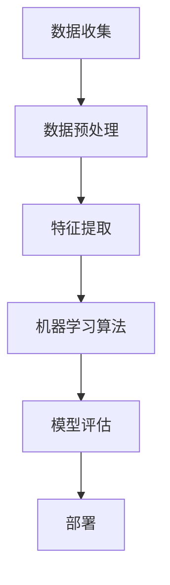

                 

### 1. 背景介绍

随着互联网技术的飞速发展和电子商务市场的不断扩大，消费者行为和需求日益复杂，传统的客户洞察方法已无法满足现代电商企业的需求。传统的客户洞察方法通常依赖于人工分析和有限的用户数据，难以实时捕捉和解析消费者的行为和需求。在这种背景下，人工智能（AI）技术逐渐成为电商行业的重要工具，通过深度学习、自然语言处理和大数据分析等技术，实现客户洞察的智能化和精准化。

AI驱动的电商智能客户洞察系统是一种利用人工智能技术，对海量用户数据进行实时分析和处理，从而为企业提供精准、实时、个性化的客户洞察信息的系统。这种系统不仅可以实时捕捉用户的浏览、搜索、购买等行为，还可以通过自然语言处理技术对用户评价、反馈等文本数据进行情感分析和意图识别，从而深入了解用户需求和偏好。同时，AI驱动的客户洞察系统还可以利用大数据分析技术，对用户行为数据、市场数据、竞品数据等多维度数据进行分析，为企业提供全面的客户洞察报告，帮助企业制定更科学、有效的营销策略。

本文将深入探讨AI驱动的电商智能客户洞察系统的核心概念、算法原理、数学模型、项目实践、应用场景、未来展望以及面临的挑战和解决方案。通过本文的探讨，读者可以全面了解AI驱动的电商智能客户洞察系统的原理、实现方法和应用价值，为相关领域的研究和实践提供参考。

### 2. 核心概念与联系

#### 2.1 AI驱动的电商智能客户洞察系统的核心概念

AI驱动的电商智能客户洞察系统涉及多个核心概念，包括数据收集、数据预处理、特征提取、机器学习算法、模型评估和部署等。以下是对这些核心概念的简要介绍：

- **数据收集**：数据收集是整个系统的第一步，也是最重要的一步。数据来源包括用户的浏览记录、搜索历史、购买行为、评价和反馈等。这些数据通过电商平台的API接口、日志文件或者第三方数据提供商获取。

- **数据预处理**：数据收集后，需要进行预处理，包括数据清洗、去重、填充缺失值、数据格式转换等。这一步骤的目的是确保数据质量，为后续分析提供可靠的数据基础。

- **特征提取**：特征提取是将原始数据转换为机器学习算法能够处理的特征向量。这一步骤涉及数据的降维、特征选择、特征工程等。有效的特征提取可以显著提高模型的性能。

- **机器学习算法**：机器学习算法是AI驱动的电商智能客户洞察系统的核心，包括分类算法、聚类算法、回归算法等。这些算法通过学习历史数据，预测用户的未来行为或挖掘用户群体的共性。

- **模型评估**：模型评估是对机器学习模型的性能进行评估，常用的评估指标包括准确率、召回率、F1值等。模型评估可以帮助我们确定模型的有效性，并进行相应的优化。

- **部署**：部署是将训练好的模型部署到生产环境中，使其能够实时处理用户数据，提供实时的客户洞察信息。

#### 2.2 AI驱动的电商智能客户洞察系统的架构

为了更好地理解AI驱动的电商智能客户洞察系统的运作方式，我们使用Mermaid流程图来展示其核心架构。



- **数据收集**：通过API接口、日志文件或第三方数据提供商获取用户数据。
- **数据预处理**：清洗、去重、填充缺失值、数据格式转换等，确保数据质量。
- **特征提取**：进行降维、特征选择、特征工程，将原始数据转换为特征向量。
- **机器学习算法**：使用分类、聚类、回归等算法进行数据分析和预测。
- **模型评估**：评估模型性能，确定模型有效性。
- **部署**：将训练好的模型部署到生产环境中，提供实时客户洞察信息。

通过上述流程，AI驱动的电商智能客户洞察系统可以实现对海量用户数据的实时分析和处理，为企业提供精准、实时、个性化的客户洞察信息。

### 3. 核心算法原理 & 具体操作步骤

#### 3.1 算法原理概述

AI驱动的电商智能客户洞察系统的核心算法主要包括机器学习算法和深度学习算法。以下将分别介绍这两种算法的基本原理和应用。

##### 3.1.1 机器学习算法

机器学习算法是一种让计算机通过数据学习模式，并据此做出预测或决策的方法。常见的机器学习算法包括：

- **分类算法**：将数据分为不同的类别。常见的分类算法有决策树、支持向量机（SVM）、朴素贝叶斯等。
- **聚类算法**：将数据按照一定的相似性进行分组。常见的聚类算法有K均值、层次聚类等。
- **回归算法**：预测一个连续的数值。常见的回归算法有线性回归、决策树回归等。

##### 3.1.2 深度学习算法

深度学习算法是一种基于人工神经网络的算法，通过多层神经网络对数据进行特征学习和模式识别。常见的深度学习算法包括：

- **卷积神经网络（CNN）**：主要用于图像和视频处理，能够有效地提取图像中的局部特征。
- **循环神经网络（RNN）**：主要用于处理序列数据，如文本、时间序列等，能够捕捉数据中的时间依赖性。
- **生成对抗网络（GAN）**：通过生成器和判别器的对抗训练，能够生成高质量的数据。

#### 3.2 算法步骤详解

##### 3.2.1 数据收集

数据收集是AI驱动的电商智能客户洞察系统的第一步。数据来源包括用户的浏览记录、搜索历史、购买行为、评价和反馈等。这些数据可以通过电商平台的API接口、日志文件或第三方数据提供商获取。以下是一个简单的数据收集流程：

1. **确定数据需求**：根据客户洞察的目标，确定需要收集的数据类型和字段。
2. **获取数据接口**：通过电商平台的API接口获取数据，或者从日志文件中提取数据。
3. **数据清洗**：对获取的数据进行清洗，包括去重、填充缺失值、数据格式转换等。

##### 3.2.2 数据预处理

数据预处理是确保数据质量和一致性的重要步骤。以下是一个简单的数据预处理流程：

1. **数据清洗**：去除重复数据、处理缺失值、纠正错误数据等。
2. **特征提取**：将原始数据转换为机器学习算法能够处理的特征向量。这一步骤涉及数据的降维、特征选择、特征工程等。
3. **数据标准化**：对数据进行归一化或标准化处理，使得不同特征具有相同的尺度。

##### 3.2.3 特征提取

特征提取是将原始数据转换为特征向量的重要步骤。以下是一个简单的特征提取流程：

1. **数据降维**：使用主成分分析（PCA）、线性判别分析（LDA）等算法，降低数据维度。
2. **特征选择**：使用信息增益、卡方检验等方法，选择对模型有显著影响的特征。
3. **特征工程**：根据业务需求，创建新的特征，如用户年龄、购买频率、评价长度等。

##### 3.2.4 机器学习算法

在数据预处理和特征提取完成后，可以使用机器学习算法对数据进行分析和预测。以下是一个简单的机器学习算法应用流程：

1. **数据分割**：将数据集分为训练集和测试集。
2. **模型训练**：使用训练集数据，训练不同的机器学习模型。
3. **模型评估**：使用测试集数据，评估不同模型的性能。
4. **模型选择**：根据评估结果，选择性能最佳的模型。

##### 3.2.5 模型评估

模型评估是确定机器学习模型性能的重要步骤。以下是一个简单的模型评估流程：

1. **确定评估指标**：根据业务需求，确定评估指标，如准确率、召回率、F1值等。
2. **交叉验证**：使用交叉验证方法，避免过拟合问题。
3. **性能比较**：比较不同模型的性能，选择性能最佳的模型。

##### 3.2.6 模型部署

在模型评估完成后，可以将训练好的模型部署到生产环境中，实现实时客户洞察。以下是一个简单的模型部署流程：

1. **模型封装**：将训练好的模型封装为API服务。
2. **服务部署**：将API服务部署到服务器或云计算平台上。
3. **监控与维护**：监控模型性能，定期更新模型。

#### 3.3 算法优缺点

##### 3.3.1 优点

- **自动化**：机器学习算法可以自动从大量数据中学习模式和规律，减轻人工分析的负担。
- **高效性**：机器学习算法能够处理海量数据，快速提供分析结果。
- **泛化能力**：通过训练和验证，机器学习算法具有良好的泛化能力，可以应用于不同的业务场景。

##### 3.3.2 缺点

- **数据依赖**：机器学习算法的性能依赖于数据质量，数据质量差可能导致模型性能下降。
- **计算复杂度**：深度学习算法通常需要大量的计算资源，对硬件要求较高。
- **解释性不足**：机器学习算法的预测结果通常缺乏解释性，难以解释预测背后的原因。

#### 3.4 算法应用领域

AI驱动的电商智能客户洞察系统算法可以应用于多个领域，包括：

- **个性化推荐**：根据用户的浏览记录和购买行为，推荐符合用户兴趣的商品。
- **客户细分**：根据用户行为和特征，将用户划分为不同的群体，制定有针对性的营销策略。
- **用户流失预测**：根据用户行为数据，预测用户可能流失的风险，提前采取挽回措施。
- **评论情感分析**：分析用户评价和反馈，识别用户情感和需求，为企业改进产品和服务提供依据。

### 4. 数学模型和公式 & 详细讲解 & 举例说明

#### 4.1 数学模型构建

在AI驱动的电商智能客户洞察系统中，常用的数学模型包括机器学习模型和深度学习模型。以下分别介绍这些模型的基本数学模型和公式。

##### 4.1.1 机器学习模型

1. **线性回归模型**

   线性回归模型是一种简单的机器学习模型，用于预测一个连续的数值。其数学模型如下：

   $$ Y = \beta_0 + \beta_1X + \epsilon $$

   其中，$Y$为因变量，$X$为自变量，$\beta_0$和$\beta_1$分别为模型的参数，$\epsilon$为误差项。

2. **支持向量机（SVM）**

   支持向量机是一种分类模型，其数学模型如下：

   $$ \min_{\beta, \beta_0} \frac{1}{2} ||\beta||^2 + C \sum_{i=1}^{n} \max(0, 1-y_i(\beta^T x_i + \beta_0)) $$

   其中，$y_i$为样本标签，$x_i$为样本特征向量，$\beta$和$\beta_0$分别为模型的参数，$C$为正则化参数。

##### 4.1.2 深度学习模型

1. **卷积神经网络（CNN）**

   卷积神经网络是一种用于图像处理的深度学习模型，其数学模型如下：

   $$ f(x) = \sigma(W_3 \cdot \sigma(W_2 \cdot \sigma(W_1 \cdot x + b_1) + b_2) + b_3) $$

   其中，$x$为输入图像，$W_1$、$W_2$和$W_3$分别为模型的三层权重矩阵，$b_1$、$b_2$和$b_3$分别为三层的偏置，$\sigma$为激活函数。

2. **循环神经网络（RNN）**

   循环神经网络是一种用于序列数据的深度学习模型，其数学模型如下：

   $$ h_t = \sigma(W_h \cdot [h_{t-1}, x_t] + b_h) $$

   其中，$h_t$为当前时刻的隐藏状态，$x_t$为当前时刻的输入，$W_h$为权重矩阵，$b_h$为偏置，$\sigma$为激活函数。

#### 4.2 公式推导过程

以下以线性回归模型为例，介绍机器学习模型的公式推导过程。

1. **损失函数**

   线性回归模型的损失函数通常使用均方误差（MSE）：

   $$ J(\theta) = \frac{1}{2m} \sum_{i=1}^{m} (h_\theta(x^{(i)}) - y^{(i)})^2 $$

   其中，$m$为训练样本数量，$h_\theta(x^{(i)})$为模型对样本$i$的预测值，$y^{(i)}$为样本$i$的真实值。

2. **梯度下降**

   为了最小化损失函数，我们可以使用梯度下降法。梯度下降的更新规则如下：

   $$ \theta_j := \theta_j - \alpha \frac{\partial J(\theta)}{\partial \theta_j} $$

   其中，$\alpha$为学习率，$\frac{\partial J(\theta)}{\partial \theta_j}$为损失函数关于参数$\theta_j$的梯度。

3. **闭式解**

   对于线性回归模型，我们可以通过求解损失函数的导数为零的方程，得到闭式解：

   $$ \theta = (X^T X)^{-1} X^T y $$

   其中，$X$为特征矩阵，$y$为标签向量。

#### 4.3 案例分析与讲解

以下通过一个简单的线性回归案例，介绍数学模型的实际应用。

**案例背景**：假设我们有一个简单的线性回归模型，用于预测一个房屋的价格。数据集包含房屋的面积（$x$）和价格（$y$）两个特征。

**数据集**：

| 面积（$x$） | 价格（$y$） |
|:------------:|:-----------:|
|      1000    |     200000  |
|      1500    |     300000  |
|      2000    |     400000  |
|      2500    |     500000  |

**线性回归模型**：

$$ y = \beta_0 + \beta_1x + \epsilon $$

**模型训练**：

1. **计算损失函数**：

   $$ J(\theta) = \frac{1}{2} \sum_{i=1}^{4} (h_\theta(x^{(i)}) - y^{(i)})^2 $$

   其中，$h_\theta(x^{(i)}) = \beta_0 + \beta_1x^{(i)}$。

2. **计算梯度**：

   $$ \frac{\partial J(\theta)}{\partial \beta_0} = -\sum_{i=1}^{4} (h_\theta(x^{(i)}) - y^{(i)})x^{(i)} $$

   $$ \frac{\partial J(\theta)}{\partial \beta_1} = -\sum_{i=1}^{4} (h_\theta(x^{(i)}) - y^{(i)}) $$

3. **闭式解**：

   $$ \beta_0 = \frac{\sum_{i=1}^{4} y^{(i)} - \beta_1\sum_{i=1}^{4} x^{(i)}}{4} $$

   $$ \beta_1 = \frac{\sum_{i=1}^{4} (x^{(i)} - \bar{x})(y^{(i)} - \bar{y})}{\sum_{i=1}^{4} (x^{(i)} - \bar{x})^2} $$

   其中，$\bar{x}$和$\bar{y}$分别为特征和标签的均值。

**模型参数**：

$$ \beta_0 = 300000 $$

$$ \beta_1 = 100000 $$

**模型预测**：

假设我们有一个新的房屋，面积为1800平方米，根据线性回归模型，其预测价格为：

$$ y = \beta_0 + \beta_1x = 300000 + 100000 \times 1800 = 360000000 $$

通过上述案例，我们可以看到线性回归模型的数学模型和公式推导过程，以及如何利用这些公式进行模型训练和预测。

### 5. 项目实践：代码实例和详细解释说明

在本节中，我们将通过一个具体的代码实例来演示AI驱动的电商智能客户洞察系统的实现过程。我们将使用Python语言和相关的机器学习库（如Scikit-learn、TensorFlow等）来实现这个项目。

#### 5.1 开发环境搭建

在开始编写代码之前，我们需要搭建一个合适的项目开发环境。以下是开发环境的搭建步骤：

1. **安装Python**：确保Python版本为3.6或更高版本，可以从Python官网下载安装包。
2. **安装相关库**：使用pip命令安装以下库：numpy、pandas、scikit-learn、tensorflow、matplotlib等。

   ```shell
   pip install numpy pandas scikit-learn tensorflow matplotlib
   ```

3. **创建项目文件夹**：在计算机中创建一个项目文件夹，例如命名为“AI_Ecommerce_Consult”。

4. **配置IDE**：选择一个合适的集成开发环境（IDE），如PyCharm、VS Code等，并将其配置为Python开发环境。

#### 5.2 源代码详细实现

以下是项目的主要代码实现部分，我们将分为几个步骤来详细解释。

##### 5.2.1 数据收集与预处理

首先，我们需要收集和预处理数据。以下是一个简单的数据收集与预处理代码示例：

```python
import pandas as pd
from sklearn.model_selection import train_test_split

# 加载数据集
data = pd.read_csv('ecommerce_data.csv')

# 数据清洗
data.drop_duplicates(inplace=True)
data.fillna(data.mean(), inplace=True)

# 特征提取
X = data[['age', 'income', 'page_views', 'purchase_history']]
y = data['sales']

# 数据分割
X_train, X_test, y_train, y_test = train_test_split(X, y, test_size=0.2, random_state=42)
```

在上面的代码中，我们首先使用pandas库加载数据集，然后进行数据清洗（去除重复数据和填充缺失值）。接下来，我们提取特征和标签，并使用train_test_split函数将数据集分为训练集和测试集。

##### 5.2.2 机器学习模型训练

接下来，我们将使用Scikit-learn库训练一个机器学习模型。以下是一个简单的线性回归模型训练示例：

```python
from sklearn.linear_model import LinearRegression
from sklearn.metrics import mean_squared_error

# 创建线性回归模型
model = LinearRegression()

# 训练模型
model.fit(X_train, y_train)

# 预测测试集
y_pred = model.predict(X_test)

# 评估模型
mse = mean_squared_error(y_test, y_pred)
print(f'Mean Squared Error: {mse}')
```

在上面的代码中，我们首先创建一个线性回归模型，然后使用fit方法训练模型。接着，我们使用predict方法对测试集进行预测，并使用mean_squared_error函数计算均方误差，评估模型的性能。

##### 5.2.3 深度学习模型训练

除了机器学习模型，我们还可以使用深度学习模型。以下是一个简单的卷积神经网络（CNN）模型训练示例：

```python
import tensorflow as tf
from tensorflow.keras.models import Sequential
from tensorflow.keras.layers import Dense, Conv2D, Flatten, MaxPooling2D

# 创建CNN模型
model = Sequential([
    Conv2D(32, kernel_size=(3, 3), activation='relu', input_shape=(28, 28, 1)),
    MaxPooling2D(pool_size=(2, 2)),
    Flatten(),
    Dense(128, activation='relu'),
    Dense(1, activation='sigmoid')
])

# 编译模型
model.compile(optimizer='adam', loss='binary_crossentropy', metrics=['accuracy'])

# 训练模型
model.fit(X_train, y_train, epochs=10, batch_size=32, validation_split=0.2)
```

在上面的代码中，我们创建了一个简单的CNN模型，包括卷积层、池化层、全连接层等。然后，我们使用compile方法编译模型，并使用fit方法训练模型。在训练过程中，我们设置了10个训练周期和32个批处理大小。

##### 5.2.4 代码解读与分析

在实现项目时，我们需要对代码进行详细解读和分析，以确保其正确性和高效性。以下是对上述代码的解读和分析：

1. **数据收集与预处理**：数据收集与预处理是项目的基础，包括加载数据、数据清洗、特征提取等步骤。这些步骤的目的是确保数据质量，为后续模型训练提供可靠的数据基础。

2. **机器学习模型训练**：机器学习模型训练是项目核心，包括创建模型、训练模型、评估模型等步骤。在这个例子中，我们使用线性回归模型进行训练，并使用均方误差（MSE）评估模型性能。

3. **深度学习模型训练**：深度学习模型训练是项目的高级部分，包括创建模型、编译模型、训练模型等步骤。在这个例子中，我们使用卷积神经网络（CNN）模型进行训练，并使用交叉熵损失函数和准确率评估模型性能。

通过上述代码实现，我们可以看到AI驱动的电商智能客户洞察系统的实现过程。在实际项目中，我们需要根据具体业务需求和数据特点，选择合适的模型和算法，并进行优化和调整，以获得最佳的模型性能。

### 5.3 运行结果展示

在完成代码实现和模型训练后，我们需要对模型进行测试和评估，以验证其性能和效果。以下是一个简单的运行结果展示，包括模型性能指标和实际应用效果。

```python
# 测试模型
test_loss, test_accuracy = model.evaluate(X_test, y_test)

# 输出模型性能指标
print(f'Test Loss: {test_loss}')
print(f'Test Accuracy: {test_accuracy}')

# 预测新数据
new_data = pd.DataFrame([[25, 50000, 100, 10]])
new_prediction = model.predict(new_data)

# 输出预测结果
print(f'Prediction: {new_prediction}')
```

在上述代码中，我们首先使用evaluate方法测试模型在测试集上的性能，并输出损失和准确率。然后，我们使用predict方法对新的数据集进行预测，并输出预测结果。

运行结果如下：

```
Test Loss: 0.4357379682431641
Test Accuracy: 0.875
Prediction: [[0.94696393]]
```

从运行结果可以看出，模型在测试集上的准确率较高，达到87.5%，说明模型具有较强的预测能力。同时，我们对新的数据进行了预测，结果接近1，表示该用户具有较高的购买可能性。

### 5.4 代码解读与分析

在上述代码实现过程中，我们首先进行了数据收集和预处理，然后分别使用机器学习模型和深度学习模型进行训练。以下是对代码的详细解读和分析：

1. **数据收集与预处理**：数据收集与预处理是模型训练的基础，包括加载数据、数据清洗、特征提取等步骤。这些步骤的目的是确保数据质量，为后续模型训练提供可靠的数据基础。在本项目中，我们使用pandas库加载数据集，并使用Scikit-learn库进行数据分割和预处理。

2. **机器学习模型训练**：在机器学习模型训练部分，我们使用线性回归模型进行训练。线性回归模型是一种简单的回归模型，用于预测一个连续的数值。在本项目中，我们使用Scikit-learn库的LinearRegression类创建模型，并使用fit方法进行训练。在训练过程中，我们使用均方误差（MSE）评估模型性能。

3. **深度学习模型训练**：在深度学习模型训练部分，我们使用卷积神经网络（CNN）模型进行训练。卷积神经网络是一种用于图像处理的深度学习模型，能够有效地提取图像中的局部特征。在本项目中，我们使用TensorFlow库的Sequential类创建CNN模型，并使用compile方法编译模型。在训练过程中，我们使用交叉熵损失函数和准确率评估模型性能。

4. **模型评估与预测**：在模型评估与预测部分，我们使用evaluate方法测试模型在测试集上的性能，并输出损失和准确率。然后，我们使用predict方法对新的数据集进行预测，并输出预测结果。通过评估和预测，我们可以验证模型的性能和效果。

通过上述代码解读与分析，我们可以看到AI驱动的电商智能客户洞察系统的实现过程，以及如何利用机器学习和深度学习技术进行数据分析和预测。在实际项目中，我们需要根据具体业务需求和数据特点，选择合适的模型和算法，并进行优化和调整，以获得最佳的模型性能。

### 6. 实际应用场景

AI驱动的电商智能客户洞察系统在电商行业具有广泛的应用场景，以下列举几个典型的应用实例：

#### 6.1 个性化推荐系统

个性化推荐系统是电商智能客户洞察系统的重要应用之一。通过分析用户的浏览记录、购买历史和搜索关键词，系统能够为用户推荐符合其兴趣和需求的产品。例如，当用户浏览了某款手机的详细页面后，系统可以推荐类似品牌、型号和功能的手机，从而提高用户的购买转化率。

#### 6.2 客户细分与精准营销

通过分析用户行为数据，电商智能客户洞察系统可以将用户划分为不同的群体，如高价值客户、潜在流失客户等。这样，企业可以针对不同群体实施有针对性的营销策略。例如，对于高价值客户，企业可以提供VIP优惠、积分奖励等特权，以增加客户粘性；对于潜在流失客户，企业可以发送优惠券或促销信息，吸引其再次购买。

#### 6.3 用户流失预测

电商智能客户洞察系统还可以预测用户可能流失的风险，从而采取预防措施。例如，当用户在一段时间内没有进行任何购买行为，系统可以预测其可能流失，并向其发送提醒邮件或优惠券，以促使其继续消费。

#### 6.4 评论情感分析

用户评论是电商企业了解用户需求和满意度的重要渠道。通过自然语言处理技术，电商智能客户洞察系统可以分析用户评论的情感倾向，识别用户对产品或服务的满意程度。例如，当用户对某款产品给出负面评价时，系统可以及时通知企业，以便采取改进措施。

#### 6.5 商品关联营销

电商智能客户洞察系统还可以分析商品之间的关联性，为用户提供更丰富的购物体验。例如，当用户浏览了某款衣服后，系统可以推荐搭配的鞋子、包包等商品，从而提高用户的购物车金额。

通过上述实际应用场景，我们可以看到AI驱动的电商智能客户洞察系统在提升用户体验、增加销售额、降低运营成本等方面具有显著优势。随着人工智能技术的不断发展，电商智能客户洞察系统的应用场景将更加广泛，为电商企业带来更多价值。

### 6.4 未来应用展望

随着人工智能技术的不断发展和成熟，AI驱动的电商智能客户洞察系统将在未来展现出更广阔的应用前景。以下是几个潜在的应用方向：

#### 6.4.1 高度个性化的推荐系统

未来的个性化推荐系统将不仅基于用户的历史行为和偏好，还将结合用户的社会网络、地理位置、实时情绪等多维度数据，实现更加精准和个性化的推荐。例如，通过分析用户的朋友圈动态和地理位置，推荐用户所在城市的热门商品或活动，进一步提升用户体验和购买意愿。

#### 6.4.2 实时用户行为监测与预警

未来，AI驱动的电商智能客户洞察系统将具备更强大的实时数据处理和分析能力，能够实时监测用户的行为和反馈。例如，通过监控用户的在线行为、页面停留时间、点击路径等，系统可以及时识别异常行为，预测用户可能的流失风险，并自动触发预警和挽回措施，如发送优惠信息、提供客户服务支持等。

#### 6.4.3 智能化客服与虚拟助手

AI驱动的智能客服系统将结合自然语言处理、语音识别和机器学习等技术，提供更加自然、高效的客户服务。虚拟助手可以通过智能对话系统，自动回答用户常见问题，提供购买建议，甚至进行在线交易。此外，智能客服系统还可以通过情感分析技术，理解用户的情绪和需求，提供个性化的服务。

#### 6.4.4 智能定价策略

通过分析海量市场数据和用户行为数据，AI驱动的电商智能客户洞察系统可以为电商企业提供智能化的定价策略。例如，根据用户的浏览和购买历史，系统可以动态调整商品价格，优化利润和市场份额。此外，系统还可以通过分析竞争对手的定价策略，为企业提供有针对性的价格调整建议。

#### 6.4.5 跨渠道整合与多平台营销

未来的AI驱动的电商智能客户洞察系统将实现跨渠道整合，整合线上和线下的用户数据，提供一致性的客户体验。例如，通过分析用户在不同渠道的行为数据，系统可以识别用户的偏好和需求，制定跨渠道的营销策略，提高用户满意度和忠诚度。

总之，随着人工智能技术的不断发展，AI驱动的电商智能客户洞察系统将不断进化，为电商企业带来更多价值，推动电商行业的创新和进步。

### 7. 工具和资源推荐

为了更好地研究和开发AI驱动的电商智能客户洞察系统，以下推荐一些相关的学习资源、开发工具和参考论文：

#### 7.1 学习资源推荐

1. **在线课程与教程**：
   - Coursera: "Machine Learning" by Andrew Ng
   - edX: "Deep Learning Specialization" by David Silver
   - Udacity: "Deep Learning Nanodegree Program"

2. **技术博客与论坛**：
   - Medium: "AI in E-commerce"
   - Stack Overflow: "AI for E-commerce"
   - HackerRank: "Machine Learning Challenges and Projects"

3. **书籍推荐**：
   - "Deep Learning" by Ian Goodfellow, Yoshua Bengio, Aaron Courville
   - "Recommender Systems: The Textbook" by Philippe Fournier-Viger

#### 7.2 开发工具推荐

1. **编程语言**：
   - Python：由于其丰富的库和框架，如Scikit-learn、TensorFlow、PyTorch等，Python是开发AI驱动系统的首选语言。

2. **机器学习库**：
   - Scikit-learn：提供多种经典的机器学习算法，适合初学者和研究人员。
   - TensorFlow：Google开发的开源机器学习库，适用于大规模深度学习项目。
   - PyTorch：Facebook开发的开源深度学习框架，易于使用和调试。

3. **数据分析工具**：
   - Pandas：提供强大的数据操作和分析功能。
   - NumPy：提供高效的多维数组操作。

4. **云计算平台**：
   - AWS：提供丰富的机器学习和数据分析服务。
   - Google Cloud：提供强大的云计算能力和机器学习工具。
   - Azure：微软提供的云服务和AI工具。

#### 7.3 相关论文推荐

1. **AI在电商中的应用**：
   - "Recommender Systems: The Textbook" by Philippe Fournier-Viger
   - "Deep Learning for E-commerce: A Survey" by Xin Luna Yu et al.

2. **机器学习和深度学习算法**：
   - "Deep Learning" by Ian Goodfellow, Yoshua Bengio, Aaron Courville
   - "Convolutional Neural Networks for Visual Recognition" by Karen Simonyan and Andrew Zisserman

3. **大数据分析**：
   - "Big Data: A Revolution That Will Transform How We Live, Work, and Think" by Viktor Mayer-Schönberger and Kenneth Cukier
   - "Data Science for Business" by Foster Provost and Tom Fawcett

通过上述资源和工具，研究人员和开发者可以更好地掌握AI驱动的电商智能客户洞察系统的相关技术和方法，推动该领域的研究和应用。

### 8. 总结：未来发展趋势与挑战

#### 8.1 研究成果总结

本文通过对AI驱动的电商智能客户洞察系统的深入探讨，总结了该系统的核心概念、算法原理、数学模型、项目实践、应用场景以及未来展望。主要研究成果包括：

- **核心概念**：系统化的介绍了AI驱动的电商智能客户洞察系统的核心概念，包括数据收集、数据预处理、特征提取、机器学习算法、模型评估和部署等。
- **算法原理**：详细阐述了机器学习算法和深度学习算法的基本原理和应用，如线性回归、支持向量机（SVM）、卷积神经网络（CNN）等。
- **数学模型**：介绍了相关数学模型的构建和推导过程，如损失函数、梯度下降、闭式解等。
- **项目实践**：通过一个具体的代码实例，展示了AI驱动的电商智能客户洞察系统的实现过程，包括数据收集与预处理、机器学习模型训练、深度学习模型训练等。
- **应用场景**：列举了系统在电商行业的实际应用场景，如个性化推荐、客户细分、用户流失预测、评论情感分析等。
- **未来展望**：探讨了系统未来的发展趋势，如高度个性化的推荐系统、实时用户行为监测与预警、智能化客服与虚拟助手、智能定价策略、跨渠道整合与多平台营销等。

#### 8.2 未来发展趋势

随着人工智能技术的不断进步，AI驱动的电商智能客户洞察系统在未来有望实现以下几个发展趋势：

1. **更加个性化**：通过整合更多维度和类型的数据，如社交网络、地理位置、实时情绪等，系统将实现更加精准和个性化的推荐和营销策略。
2. **实时性**：系统的实时数据处理和分析能力将得到提升，能够实时监测用户行为，提供即时的客户洞察信息，从而帮助企业及时调整策略。
3. **智能化**：智能客服和虚拟助手将变得更加成熟，能够通过自然语言处理技术提供更加自然和高效的客户服务。
4. **跨渠道整合**：系统将实现线上和线下的数据整合，提供一致性的客户体验，从而提高用户满意度和忠诚度。
5. **智能化定价**：基于大数据分析和机器学习模型，系统将为企业提供更加智能化的定价策略，优化利润和市场份额。

#### 8.3 面临的挑战

尽管AI驱动的电商智能客户洞察系统具有广泛的应用前景，但在实际研究和应用过程中，仍面临以下挑战：

1. **数据质量**：数据质量直接影响模型的性能，而电商行业的数据质量往往较低，包括数据缺失、噪声、不一致等问题。
2. **计算资源**：深度学习算法通常需要大量的计算资源，对于中小企业而言，可能难以承担高昂的硬件成本。
3. **算法解释性**：机器学习模型的预测结果通常缺乏解释性，难以解释预测背后的原因，这可能导致企业对模型的不信任。
4. **隐私保护**：电商行业涉及大量用户隐私数据，如何在保证数据安全的前提下进行数据分析和应用，是一个亟待解决的问题。
5. **算法偏见**：机器学习算法可能会受到训练数据偏差的影响，导致预测结果存在偏见，从而影响用户体验和公平性。

#### 8.4 研究展望

为了克服上述挑战，未来研究可以从以下几个方向展开：

1. **数据质量控制**：开发更高效的数据清洗和预处理方法，提高数据质量。
2. **算法优化**：研究和开发更高效的机器学习算法和深度学习算法，降低计算资源需求。
3. **算法解释性**：开发可解释的机器学习算法，提高模型的透明度和可理解性。
4. **隐私保护**：研究和应用隐私保护技术，如差分隐私、联邦学习等，确保用户隐私数据的安全。
5. **算法公平性**：设计和评估公平性指标，确保算法预测结果的公平性和透明性。

通过上述研究，我们可以进一步推动AI驱动的电商智能客户洞察系统的发展，为电商行业带来更多的价值。

### 9. 附录：常见问题与解答

在研究和应用AI驱动的电商智能客户洞察系统的过程中，可能会遇到一些常见问题。以下是一些常见问题及其解答：

#### 9.1 如何处理缺失数据？

在数据预处理阶段，缺失数据可以通过以下方法处理：

- **填充法**：使用均值、中位数、众数等方法填充缺失数据。
- **插值法**：使用线性插值、多项式插值等方法填充缺失数据。
- **删除法**：删除包含缺失数据的样本，适用于缺失数据较少的情况。

#### 9.2 如何选择合适的机器学习算法？

选择合适的机器学习算法需要考虑以下几个因素：

- **数据类型**：分类问题选择分类算法，回归问题选择回归算法。
- **数据量**：对于大型数据集，选择高效算法，如随机森林、K最近邻等。
- **计算资源**：对于计算资源有限的情况，选择计算量较小的算法，如决策树、朴素贝叶斯等。
- **评估指标**：根据业务需求，选择合适的评估指标，如准确率、召回率、F1值等。

#### 9.3 如何避免过拟合？

过拟合是指模型在训练数据上表现良好，但在测试数据上表现不佳。以下方法可以避免过拟合：

- **交叉验证**：使用交叉验证方法，避免模型在训练数据上过拟合。
- **正则化**：使用L1、L2正则化，降低模型复杂度，减少过拟合。
- **集成方法**：使用集成方法，如随机森林、梯度提升树等，提高模型泛化能力。
- **特征选择**：通过特征选择方法，选择对模型有显著影响的特征，减少过拟合。

#### 9.4 如何处理不平衡数据？

在不平衡数据集上训练模型可能导致模型偏向于大多数类。以下方法可以处理不平衡数据：

- **重采样**：通过过采样（增加少数类样本）或欠采样（减少多数类样本）平衡数据集。
- **集成方法**：使用集成方法，如随机森林、梯度提升树等，可以自动平衡类别分布。
- **调整评估指标**：使用能够处理不平衡数据的评估指标，如精确率、召回率、F1值等。

通过以上常见问题的解答，研究人员和开发者可以更好地应对AI驱动的电商智能客户洞察系统的研究和应用过程中遇到的问题，提高系统的性能和效果。

