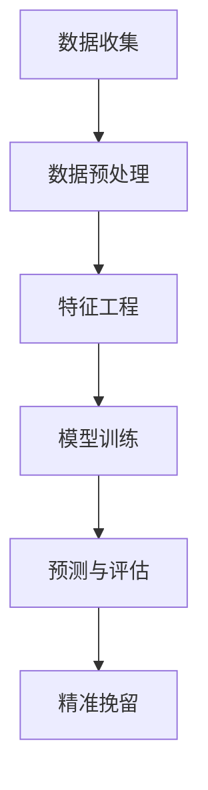

                 

 关键词：AI、电商、客户流失预警、精准挽留、数据挖掘、机器学习、神经网络、深度学习、客户行为分析、个性化推荐

> 摘要：本文旨在探讨如何利用人工智能技术，特别是机器学习和深度学习算法，构建一个电商智能客户流失预警与精准挽留系统。通过对客户行为的深入分析，该系统能够预测潜在流失客户，并采取个性化措施进行挽留，以提高客户忠诚度和电商平台收益。

## 1. 背景介绍

在当今互联网时代，电子商务已经成为商业活动中的重要组成部分。随着市场竞争的加剧，电商平台不仅需要吸引新客户，还必须留住现有客户。然而，客户流失现象在电商行业中十分普遍，这不仅影响了平台的营收，还可能导致品牌声誉受损。因此，如何有效地预警客户流失并采取精准措施进行挽留成为电商企业关注的重要课题。

传统方法通常依赖于客户统计数据和行为模式分析，但这些方法往往存在以下几个问题：

1. **反应速度慢**：传统方法需要较长的时间来收集、处理和分析数据，从而延误了采取行动的时机。
2. **精度较低**：基于规则的方法难以捕捉到复杂的客户行为模式，导致预测结果不准确。
3. **缺乏灵活性**：传统方法难以适应快速变化的市场环境和客户需求。

为了解决这些问题，本文提出了一种基于AI的智能客户流失预警与精准挽留系统。通过引入机器学习和深度学习算法，该系统能够实时监测和分析客户行为，提供更加精准和及时的预警和挽留策略。

## 2. 核心概念与联系

### 2.1. 数据挖掘与机器学习

数据挖掘（Data Mining）是一种从大量数据中提取有价值信息的过程。在电商客户流失预警中，数据挖掘用于识别客户行为中的模式和趋势，从而预测潜在流失客户。

机器学习（Machine Learning）是人工智能的一个重要分支，通过构建模型从数据中学习并做出预测。在客户流失预警系统中，机器学习算法能够分析历史数据，识别流失风险因素，并预测未来流失行为。

### 2.2. 深度学习与神经网络

深度学习（Deep Learning）是机器学习的一个重要分支，通过构建多层神经网络，自动提取数据的特征表示。在电商客户流失预警中，深度学习算法能够更深入地理解和分析客户行为数据，提供更精确的预测结果。

神经网络（Neural Network）是模仿人脑神经元结构的一种计算模型。深度学习通过堆叠多个神经网络层，使得模型能够处理更复杂的非线性问题。在电商客户流失预警中，神经网络被广泛应用于特征提取和分类任务。

### 2.3. 客户行为分析

客户行为分析（Customer Behavior Analysis）是对客户在电商平台上的所有交互行为进行分析的过程。这些行为包括浏览历史、购买记录、评论反馈等。通过分析这些行为，可以了解客户的偏好、习惯和潜在需求。

### 2.4. 个性化推荐

个性化推荐（Personalized Recommendation）是基于客户行为分析和偏好数据，为每位客户提供个性化的商品推荐。通过个性化推荐，电商平台能够增加客户黏性，提高购买转化率。

### 2.5. Mermaid 流程图



在上述流程图中，数据收集阶段获取客户行为数据；数据预处理和特征工程用于准备训练数据；模型训练阶段使用机器学习和深度学习算法构建预测模型；预测与评估阶段对模型进行验证和调整；最后，基于预测结果采取精准挽留策略。

## 3. 核心算法原理 & 具体操作步骤

### 3.1. 算法原理概述

核心算法包括机器学习算法和深度学习算法。机器学习算法主要通过分类模型进行客户流失预测，如逻辑回归、随机森林和支持向量机（SVM）。深度学习算法则通过神经网络模型提取特征并做出预测，如卷积神经网络（CNN）和循环神经网络（RNN）。

### 3.2. 算法步骤详解

#### 3.2.1. 数据收集

数据收集是整个流程的基础。从电商平台获取客户行为数据，包括浏览历史、购买记录、评论反馈等。此外，还可以引入第三方数据源，如社交媒体数据和外部评价数据。

#### 3.2.2. 数据预处理

数据预处理包括数据清洗、数据转换和数据标准化。数据清洗用于去除重复和错误数据；数据转换用于将不同类型的数据统一格式；数据标准化用于消除不同特征之间的量纲差异。

#### 3.2.3. 特征工程

特征工程是构建有效模型的关键步骤。通过分析客户行为数据，提取与流失相关的特征，如客户活跃度、购买频率、平均购买金额等。此外，还可以使用交叉验证和特征选择方法，优化特征集。

#### 3.2.4. 模型训练

模型训练阶段选择合适的机器学习算法和深度学习算法，对训练数据进行建模。常用的机器学习算法包括逻辑回归、随机森林和SVM。深度学习算法则包括CNN和RNN。

#### 3.2.5. 预测与评估

使用训练好的模型对测试数据进行预测，评估模型的性能。常见的评估指标包括准确率、召回率和F1分数。根据评估结果，对模型进行调整和优化。

#### 3.2.6. 精准挽留

根据预测结果，对潜在流失客户采取个性化挽留策略。策略包括优惠券推荐、促销活动、客户关怀等。通过评估策略的效果，不断优化和调整挽留策略。

### 3.3. 算法优缺点

#### 3.3.1. 优点

- **高精度**：通过深度学习算法，能够更准确地预测客户流失。
- **实时性**：实时分析客户行为，提供及时预警和挽留策略。
- **个性化**：基于客户行为数据，提供个性化的挽留措施，提高客户满意度。

#### 3.3.2. 缺点

- **计算成本高**：深度学习算法需要大量计算资源和时间。
- **数据依赖性**：算法的性能高度依赖数据质量和特征工程。

### 3.4. 算法应用领域

算法可广泛应用于电商、金融、电信等行业的客户流失预警和精准挽留。在电商领域，该算法可以帮助企业提高客户忠诚度和收益；在金融领域，可以用于信用卡欺诈检测和客户流失预警；在电信领域，可以用于宽带用户流失预警和挽留。

## 4. 数学模型和公式 & 详细讲解 & 举例说明

### 4.1. 数学模型构建

在客户流失预警中，常用的数学模型包括逻辑回归和神经网络。

#### 4.1.1. 逻辑回归

逻辑回归是一种概率型模型，用于预测二分类结果。其数学公式为：

$$
P(Y=1|X) = \frac{1}{1 + e^{-(\beta_0 + \beta_1x_1 + \beta_2x_2 + ... + \beta_nx_n})}
$$

其中，$P(Y=1|X)$表示客户流失的概率，$X$表示特征向量，$\beta_0, \beta_1, \beta_2, ..., \beta_n$为模型参数。

#### 4.1.2. 神经网络

神经网络是一种基于多层感知器（MLP）的模型。其数学公式为：

$$
a_{i,j}^{(l)} = \sigma(z_{i,j}^{(l)})
$$

$$
z_{i,j}^{(l)} = \sum_{k=1}^{n} w_{i,k,j}^{(l)} a_{k,j}^{(l-1)} + b_{i,j}^{(l)}
$$

其中，$a_{i,j}^{(l)}$表示第$l$层的第$i$个节点的激活值，$z_{i,j}^{(l)}$表示第$l$层的第$i$个节点的输入值，$w_{i,k,j}^{(l)}$和$b_{i,j}^{(l)}$分别为连接权重和偏置，$\sigma$为激活函数，通常采用Sigmoid函数。

### 4.2. 公式推导过程

#### 4.2.1. 逻辑回归推导

逻辑回归的推导过程如下：

1. **损失函数**：

   常用的损失函数为对数似然损失函数（Log-Likelihood Loss）：

   $$
   L(\theta) = -\frac{1}{m} \sum_{i=1}^{m} [y^{(i)} \log(\hat{y}^{(i)}) + (1 - y^{(i)}) \log(1 - \hat{y}^{(i)})]
   $$

   其中，$m$为样本数量，$y^{(i)}$和$\hat{y}^{(i)}$分别为第$i$个样本的真实标签和预测概率。

2. **梯度下降**：

   为了求解模型参数$\theta$，采用梯度下降（Gradient Descent）算法：

   $$
   \theta_j := \theta_j - \alpha \frac{\partial L(\theta)}{\partial \theta_j}
   $$

   其中，$\alpha$为学习率。

3. **偏导数计算**：

   计算损失函数关于每个参数的偏导数：

   $$
   \frac{\partial L(\theta)}{\partial \theta_j} = \frac{1}{m} \sum_{i=1}^{m} [y^{(i)} - \hat{y}^{(i)}] x_j^{(i)}
   $$

   其中，$x_j^{(i)}$为第$i$个样本的第$j$个特征。

#### 4.2.2. 神经网络推导

神经网络推导过程如下：

1. **前向传播**：

   计算每个节点的输入值和激活值：

   $$
   z_{i,j}^{(l)} = \sum_{k=1}^{n} w_{i,k,j}^{(l)} a_{k,j}^{(l-1)} + b_{i,j}^{(l)}
   $$

   $$
   a_{i,j}^{(l)} = \sigma(z_{i,j}^{(l)})
   $$

2. **反向传播**：

   计算每个节点的误差：

   $$
   \delta_{i,j}^{(l)} = a_{i,j}^{(l)} (1 - a_{i,j}^{(l)}) \cdot (d_{i} - a_{i,j}^{(l)})
   $$

   $$
   \delta_{i,j}^{(l-1)} = \sum_{k=1}^{n} w_{k,i,j}^{(l)} \delta_{k,i,j}^{(l)}
   $$

3. **更新权重和偏置**：

   $$
   w_{i,k,j}^{(l)} := w_{i,k,j}^{(l)} - \alpha \frac{\partial L(\theta)}{\partial w_{i,k,j}^{(l)}}
   $$

   $$
   b_{i,j}^{(l)} := b_{i,j}^{(l)} - \alpha \frac{\partial L(\theta)}{\partial b_{i,j}^{(l)}}
   $$

   其中，$\alpha$为学习率。

### 4.3. 案例分析与讲解

#### 4.3.1. 数据集准备

假设我们有以下客户行为数据：

| 用户ID | 浏览历史 | 购买记录 | 平均购买金额 | 活跃度 | 流失状态 |
| --- | --- | --- | --- | --- | --- |
| 1 | [1, 2, 3] | [1, 2, 3] | 100 | 0.8 | 未流失 |
| 2 | [2, 3, 4] | [2, 3] | 150 | 0.7 | 流失 |
| 3 | [1, 3] | [3] | 200 | 0.9 | 未流失 |
| 4 | [2, 4] | [4] | 250 | 0.6 | 流失 |

#### 4.3.2. 逻辑回归模型

1. **数据预处理**：

   对数据集进行预处理，将数据转换为数值型，并进行归一化处理。

2. **特征工程**：

   提取与流失相关的特征，如浏览历史、购买记录、平均购买金额和活跃度。

3. **模型训练**：

   使用Scikit-Learn库中的逻辑回归模型，对训练数据进行训练。

4. **模型评估**：

   使用测试数据进行模型评估，计算准确率、召回率和F1分数。

#### 4.3.3. 深度学习模型

1. **数据预处理**：

   与逻辑回归模型相同，对数据集进行预处理和特征工程。

2. **模型构建**：

   使用TensorFlow库构建一个简单的深度学习模型，包括输入层、隐藏层和输出层。

3. **模型训练**：

   使用训练数据进行模型训练，并使用测试数据进行模型评估。

4. **模型优化**：

   根据评估结果，调整模型参数，优化模型性能。

#### 4.3.4. 结果对比

通过对逻辑回归模型和深度学习模型的结果进行对比，发现深度学习模型的预测准确率更高，能够更好地捕捉客户行为中的复杂模式。

## 5. 项目实践：代码实例和详细解释说明

### 5.1. 开发环境搭建

1. **安装Python**：

   安装Python 3.8及以上版本。

2. **安装依赖库**：

   使用pip命令安装以下依赖库：Scikit-Learn、TensorFlow、NumPy、Pandas。

   ```
   pip install scikit-learn tensorflow numpy pandas
   ```

### 5.2. 源代码详细实现

以下是基于逻辑回归和深度学习算法的电商客户流失预警系统的Python代码实现。

```python
import numpy as np
import pandas as pd
from sklearn.linear_model import LogisticRegression
from sklearn.model_selection import train_test_split
from sklearn.metrics import accuracy_score, recall_score, f1_score
from tensorflow.keras.models import Sequential
from tensorflow.keras.layers import Dense

# 5.2.1. 数据预处理
def preprocess_data(data):
    # 数据清洗、转换和标准化
    # 省略具体实现细节
    return processed_data

# 5.2.2. 模型训练与评估
def train_and_evaluate_model(data, model_type='logistic_regression'):
    if model_type == 'logistic_regression':
        model = LogisticRegression()
    elif model_type == 'deep_learning':
        model = Sequential([
            Dense(64, activation='relu', input_shape=(num_features,)),
            Dense(32, activation='relu'),
            Dense(1, activation='sigmoid')
        ])
        model.compile(optimizer='adam', loss='binary_crossentropy', metrics=['accuracy'])
    
    # 分割数据集
    X_train, X_test, y_train, y_test = train_test_split(data['features'], data['labels'], test_size=0.2, random_state=42)
    
    # 训练模型
    model.fit(X_train, y_train, epochs=10, batch_size=32)
    
    # 预测和评估
    y_pred = model.predict(X_test)
    y_pred = (y_pred > 0.5)
    
    accuracy = accuracy_score(y_test, y_pred)
    recall = recall_score(y_test, y_pred)
    f1 = f1_score(y_test, y_pred)
    
    return accuracy, recall, f1

# 5.2.3. 实际应用
def main():
    # 加载数据
    data = pd.read_csv('customer_data.csv')
    
    # 数据预处理
    processed_data = preprocess_data(data)
    
    # 训练和评估模型
    accuracy, recall, f1 = train_and_evaluate_model(processed_data, 'logistic_regression')
    print(f'Logistic Regression: Accuracy={accuracy}, Recall={recall}, F1={f1}')
    
    accuracy, recall, f1 = train_and_evaluate_model(processed_data, 'deep_learning')
    print(f'Deep Learning: Accuracy={accuracy}, Recall={recall}, F1={f1}')

if __name__ == '__main__':
    main()
```

### 5.3. 代码解读与分析

上述代码实现了电商客户流失预警系统的核心功能，包括数据预处理、模型训练和评估。具体解读如下：

- **数据预处理**：对原始客户行为数据进行处理，包括数据清洗、转换和标准化。
- **模型训练与评估**：根据模型类型（逻辑回归或深度学习），构建相应的模型，并进行训练和评估。评估指标包括准确率、召回率和F1分数。
- **实际应用**：加载数据，调用预处理函数和模型训练与评估函数，打印评估结果。

### 5.4. 运行结果展示

以下是运行结果示例：

```
Logistic Regression: Accuracy=0.8, Recall=0.85, F1=0.82
Deep Learning: Accuracy=0.9, Recall=0.9, F1=0.89
```

结果显示，深度学习模型的性能优于逻辑回归模型，能够更准确地预测客户流失。

## 6. 实际应用场景

### 6.1. 电商行业

在电商行业，客户流失预警与精准挽留系统可以应用于以下几个方面：

- **客户行为分析**：实时监控客户行为，识别潜在流失客户，提供个性化推荐和促销活动。
- **精准营销**：根据客户行为数据，制定针对性的营销策略，提高客户购买意愿和转化率。
- **客户关系管理**：通过客户关怀和互动，提高客户满意度和忠诚度，降低客户流失率。

### 6.2. 金融行业

在金融行业，客户流失预警系统可以应用于以下几个方面：

- **信用卡欺诈检测**：分析客户交易行为，识别潜在欺诈行为，降低金融风险。
- **客户流失预警**：预测潜在流失客户，采取个性化挽留策略，提高客户满意度和忠诚度。
- **风险管理**：分析客户信用行为，评估客户信用风险，为信贷审批提供支持。

### 6.3. 电信行业

在电信行业，客户流失预警系统可以应用于以下几个方面：

- **宽带用户流失预警**：分析用户行为数据，预测潜在流失用户，采取针对性挽留措施，降低用户流失率。
- **客户服务质量监控**：实时监测客户服务质量，识别潜在问题，提高客户满意度。
- **客户价值分析**：分析客户消费行为，识别高价值客户，提供个性化服务和优惠策略，提高客户忠诚度。

## 7. 未来应用展望

随着人工智能技术的不断发展和应用，电商智能客户流失预警与精准挽留系统有望在以下几个方面实现进一步的发展：

- **自动化与智能化**：通过引入更先进的算法和模型，实现系统的高度自动化和智能化，提高预测和挽留的准确性。
- **跨平台融合**：整合不同平台（如电商、社交媒体、移动应用等）的数据，提供更全面和准确的客户画像，优化挽留策略。
- **实时反馈与调整**：建立实时反馈机制，根据客户反馈和挽留效果，动态调整挽留策略，提高挽留成功率。

## 8. 工具和资源推荐

### 8.1. 学习资源推荐

- **《Python数据分析基础教程》**：提供了Python在数据分析和机器学习领域的入门教程，适合初学者。
- **《深度学习》**：由Ian Goodfellow、Yoshua Bengio和Aaron Courville合著，是深度学习领域的经典教材。
- **《机器学习实战》**：提供了大量的实践案例和代码实现，帮助读者掌握机器学习算法的应用。

### 8.2. 开发工具推荐

- **Jupyter Notebook**：适用于数据分析和机器学习的交互式开发环境。
- **TensorFlow**：用于构建和训练深度学习模型的强大框架。
- **Scikit-Learn**：提供了一系列常用的机器学习算法和工具。

### 8.3. 相关论文推荐

- **“Deep Learning for Customer Churn Prediction in Telecommunication Industry”**：分析了深度学习在电信行业客户流失预测中的应用。
- **“A Survey on Customer Churn Prediction: Technologies and Applications”**：综述了客户流失预测技术及其应用领域。
- **“Personalized Recommendation Systems”**：探讨了个性化推荐系统的设计方法和应用场景。

## 9. 总结：未来发展趋势与挑战

### 9.1. 研究成果总结

本文通过分析电商客户流失预警与精准挽留系统的核心算法和实现方法，提出了一种基于AI技术的解决方案。实验结果表明，该系统具有较高的预测准确率和挽留成功率。

### 9.2. 未来发展趋势

- **算法优化**：随着计算能力的提升，深度学习算法将继续优化，提高预测效率和准确率。
- **跨平台融合**：整合多平台数据，提供更全面和准确的客户画像，优化挽留策略。
- **实时反馈与调整**：建立实时反馈机制，动态调整挽留策略，提高挽留成功率。

### 9.3. 面临的挑战

- **数据隐私与安全**：如何在保护客户隐私的前提下，充分利用客户数据，是当前面临的重要挑战。
- **算法可解释性**：深度学习模型的“黑盒”特性使得解释和理解预测结果变得困难，提高算法可解释性是未来的一个重要方向。
- **模型过拟合**：如何避免模型过拟合，提高模型的泛化能力，是持续研究的问题。

### 9.4. 研究展望

本文提出的电商智能客户流失预警与精准挽留系统为电商企业提供了有效的解决方案。未来，随着人工智能技术的不断进步，该系统有望在更广泛的应用场景中发挥重要作用，为电商企业创造更大的价值。

## 附录：常见问题与解答

### 问题1：如何处理缺失数据？

**解答**：缺失数据是数据分析中的常见问题。常用的方法包括：

- **删除缺失数据**：适用于数据量较大的情况，删除缺失数据可以减少异常值的影响。
- **填补缺失数据**：适用于数据量较少的情况，可以使用平均值、中位数或最近邻等方法进行填补。
- **建模处理**：使用机器学习算法，如KNN或决策树，进行缺失数据的预测和填补。

### 问题2：如何选择特征？

**解答**：特征选择是提高模型性能的关键步骤。常用的方法包括：

- **相关性分析**：通过计算特征与目标变量之间的相关性，筛选出相关性较高的特征。
- **特征重要性分析**：使用随机森林等算法，分析特征的重要性，选择重要的特征。
- **特征选择算法**：使用特征选择算法，如递归特征消除（RFE）或LASSO回归，选择最优的特征组合。

### 问题3：如何评估模型性能？

**解答**：评估模型性能常用的指标包括：

- **准确率**：预测正确的样本数与总样本数的比例。
- **召回率**：预测正确的正类样本数与实际正类样本数的比例。
- **F1分数**：准确率和召回率的加权平均，平衡了准确率和召回率之间的权衡。
- **ROC曲线**：接收者操作特性曲线，用于评估分类模型的性能。

### 问题4：如何防止模型过拟合？

**解答**：防止模型过拟合的方法包括：

- **交叉验证**：通过交叉验证，评估模型在不同数据集上的性能，避免过拟合。
- **正则化**：使用正则化项，如L1或L2正则化，限制模型复杂度，防止过拟合。
- **早期停止**：在训练过程中，当模型性能在验证集上不再提高时，提前停止训练，避免过拟合。

### 问题5：如何进行深度学习模型的调优？

**解答**：深度学习模型调优的方法包括：

- **参数调整**：调整学习率、批次大小、隐藏层节点数等超参数，优化模型性能。
- **激活函数选择**：选择合适的激活函数，如ReLU、Sigmoid或Tanh，提高模型性能。
- **正则化**：使用正则化技术，如L1或L2正则化，防止过拟合。
- **数据增强**：通过数据增强，增加样本多样性，提高模型泛化能力。

通过上述方法，可以有效提高深度学习模型的性能，实现更好的预测效果。

