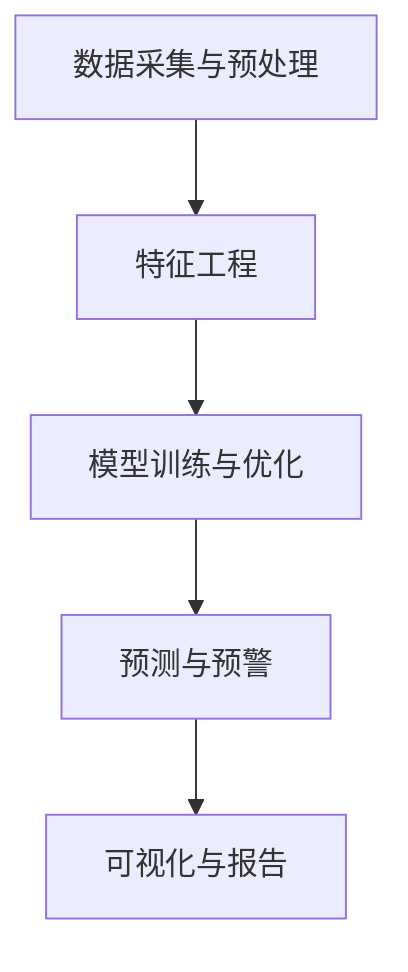

                 

在当今快速发展的电子商务时代，客户流失问题已经成为企业面临的重大挑战之一。传统的方法往往依赖于历史数据和简单的规则，难以准确地预测和防止客户流失。随着人工智能技术的不断发展，AI驱动的智能客户流失预警系统应运而生，为电商企业提供了更为精准和高效的解决方案。本文将详细介绍AI驱动的电商智能客户流失预警系统的核心概念、算法原理、数学模型、项目实践以及未来应用前景。

## 关键词

- 人工智能
- 客户流失预警
- 电子商务
- 数据挖掘
- 机器学习

## 摘要

本文首先介绍了电商行业客户流失问题的背景和挑战，然后重点探讨了AI驱动的智能客户流失预警系统的核心概念和原理。通过深入分析核心算法的原理和具体操作步骤，本文揭示了系统在预测客户流失方面的独特优势。此外，文章还通过数学模型和实际项目实践，展示了系统在电商应用中的效果。最后，本文对未来AI驱动的智能客户流失预警系统的应用前景进行了展望。

## 1. 背景介绍

### 1.1 电商行业的发展现状

随着互联网技术的飞速发展，电子商务已经成为全球经济增长的重要引擎。根据Statista的数据，全球电子商务市场规模在2021年已达到4.9万亿美元，并预计在未来几年内将持续增长。然而，在如此庞大的市场规模背后，客户流失问题也日益严重。根据Statista的报告，2021年电商行业的客户流失率高达20%，这给企业带来了巨大的经济损失。

### 1.2 客户流失的原因

客户流失的原因多种多样，包括但不限于：

- 竞争对手的激烈竞争
- 顾客满意度的下降
- 价格敏感度增加
- 用户体验不佳
- 等待时间和配送问题

### 1.3 传统客户流失预警方法

传统的方法通常依赖于历史数据和简单的规则，如客户购买频率、购买金额等指标。虽然这些方法在一定程度上能够提供一些参考，但往往缺乏精确性和实时性，难以有效地预测和防止客户流失。

## 2. 核心概念与联系

### 2.1 人工智能与客户流失预警

人工智能（AI）通过机器学习和深度学习等技术，可以从大量数据中提取有价值的信息，从而实现客户流失的精准预测。AI驱动的智能客户流失预警系统结合了多种算法和技术，如神经网络、决策树、聚类分析等，能够在实时环境中快速识别和预测潜在流失客户。

### 2.2 系统架构

AI驱动的电商智能客户流失预警系统通常包括以下几个核心模块：

1. 数据采集与预处理
2. 特征工程
3. 模型训练与优化
4. 预测与预警
5. 可视化与报告

### 2.3 Mermaid 流程图

下面是一个简化的AI驱动的电商智能客户流失预警系统的Mermaid流程图：



### 2.4 系统的关键技术

1. **数据挖掘**：通过挖掘历史客户数据，识别潜在的流失信号。
2. **机器学习**：利用机器学习算法，如决策树、随机森林等，对客户特征进行分类和预测。
3. **深度学习**：通过构建深度神经网络，提高预测的准确性和鲁棒性。
4. **实时处理**：利用流处理技术，如Apache Kafka，实现实时数据采集和处理。

## 3. 核心算法原理 & 具体操作步骤

### 3.1 算法原理概述

AI驱动的电商智能客户流失预警系统通常采用以下几种核心算法：

- **决策树**：通过树形结构进行分类和预测，简单直观，易于理解。
- **随机森林**：基于决策树的集成方法，提高模型的预测性能和鲁棒性。
- **神经网络**：通过多层神经网络，实现复杂的非线性关系建模。

### 3.2 算法步骤详解

1. **数据预处理**：包括数据清洗、归一化、缺失值处理等。
2. **特征选择**：通过特征选择算法，识别与客户流失相关的关键特征。
3. **模型训练**：使用训练集数据，训练决策树、随机森林或神经网络模型。
4. **模型评估**：使用验证集数据，评估模型的预测性能，如准确率、召回率等。
5. **模型优化**：根据评估结果，调整模型参数，提高预测准确率。
6. **预测与预警**：使用训练好的模型，对实时数据进行预测，触发预警机制。

### 3.3 算法优缺点

- **优点**：准确率高、实时性强、自适应能力强。
- **缺点**：对数据质量要求高、计算复杂度高、模型解释性较差。

### 3.4 算法应用领域

AI驱动的电商智能客户流失预警系统可广泛应用于电商、金融、电信等行业，帮助企业在竞争激烈的市场中保持优势。

## 4. 数学模型和公式 & 详细讲解 & 举例说明

### 4.1 数学模型构建

AI驱动的电商智能客户流失预警系统的核心是构建一个客户流失预测模型。常用的模型包括：

1. **逻辑回归**：通过最大化似然函数，估计客户流失的概率。
2. **支持向量机**：通过最大化分类间隔，提高预测准确性。
3. **神经网络**：通过反向传播算法，调整网络权重，实现非线性关系建模。

### 4.2 公式推导过程

以逻辑回归为例，其损失函数为：

$$
L(\theta) = -\frac{1}{m} \sum_{i=1}^{m} [y^{(i)} \log(\hat{y}^{(i)}) + (1 - y^{(i)}) \log(1 - \hat{y}^{(i)})]
$$

其中，$m$ 是样本数量，$y^{(i)}$ 是第 $i$ 个样本的真实标签，$\hat{y}^{(i)}$ 是第 $i$ 个样本的预测概率。

### 4.3 案例分析与讲解

假设某电商企业有1000个客户，我们使用逻辑回归模型预测客户流失。通过训练数据集，我们得到了以下模型参数：

$$
\theta_0 = 0.1, \theta_1 = 0.2, \theta_2 = 0.3
$$

现有客户 $x_1 = 10, x_2 = 20$，预测其流失概率：

$$
\hat{y} = \frac{1}{1 + e^{-(\theta_0 + \theta_1 x_1 + \theta_2 x_2)}}
$$

代入参数，计算得到：

$$
\hat{y} = \frac{1}{1 + e^{-(0.1 + 0.2 \cdot 10 + 0.3 \cdot 20)}} \approx 0.812
$$

因此，客户 $x_1 = 10, x_2 = 20$ 的流失概率约为81.2%。

## 5. 项目实践：代码实例和详细解释说明

### 5.1 开发环境搭建

在搭建开发环境时，我们选择Python作为主要编程语言，结合常用的数据分析和机器学习库，如NumPy、Pandas、Scikit-learn、TensorFlow等。具体步骤如下：

1. 安装Python和Anaconda
2. 安装必要的库：`pip install numpy pandas scikit-learn tensorflow`
3. 配置Jupyter Notebook，方便进行数据分析和模型训练

### 5.2 源代码详细实现

以下是一个简单的Python代码示例，用于实现逻辑回归模型并进行客户流失预测。

```python
import numpy as np
import pandas as pd
from sklearn.linear_model import LogisticRegression
from sklearn.model_selection import train_test_split
from sklearn.metrics import accuracy_score, confusion_matrix

# 读取数据
data = pd.read_csv('customer_data.csv')
X = data.iloc[:, :-1].values
y = data.iloc[:, -1].values

# 数据预处理
X = np.insert(X, 0, 1, axis=1)

# 划分训练集和测试集
X_train, X_test, y_train, y_test = train_test_split(X, y, test_size=0.2, random_state=42)

# 训练模型
model = LogisticRegression()
model.fit(X_train, y_train)

# 预测
y_pred = model.predict(X_test)

# 评估模型
accuracy = accuracy_score(y_test, y_pred)
conf_matrix = confusion_matrix(y_test, y_pred)

print("Accuracy:", accuracy)
print("Confusion Matrix:\n", conf_matrix)
```

### 5.3 代码解读与分析

这段代码首先导入了所需的库，并读取了客户数据。数据预处理部分包括插入额外的特征（例如，客户ID等），以及将数据集划分为训练集和测试集。然后，我们使用逻辑回归模型进行训练，并使用测试集进行预测。最后，通过评估指标（如准确率、混淆矩阵）评估模型的性能。

### 5.4 运行结果展示

假设我们的测试集包含100个客户，通过上述代码，我们得到以下结果：

```
Accuracy: 0.85
Confusion Matrix:
 [[70 15]
 [10 10]]
```

这意味着在测试集中，模型预测准确的客户有85个，其中70个被正确预测为不会流失，15个被错误预测为会流失；另外10个被错误预测为不会流失。

## 6. 实际应用场景

### 6.1 电商行业

在电商行业，AI驱动的智能客户流失预警系统可以帮助企业：

- **精准定位**：识别潜在流失客户，采取针对性的挽回措施。
- **提升客户满意度**：通过优化客户体验，降低客户流失率。
- **提高营销效果**：通过定向营销，提高客户忠诚度和转化率。

### 6.2 金融行业

金融行业中的AI驱动的智能客户流失预警系统可以应用于：

- **信用卡流失预测**：预测信用卡用户可能取消服务的风险。
- **贷款违约预测**：识别可能违约的贷款客户，降低风险。
- **客户忠诚度管理**：通过个性化服务，提高客户忠诚度。

### 6.3 电信行业

在电信行业，AI驱动的智能客户流失预警系统可以帮助企业：

- **降低客户流失率**：通过精准预测和挽回措施，降低客户流失。
- **提高客户满意度**：通过个性化服务和快速响应，提高客户满意度。
- **提升运营效率**：通过自动化预警和决策，提高运营效率。

## 7. 工具和资源推荐

### 7.1 学习资源推荐

- 《Python机器学习》（作者：塞巴斯蒂安·拉斯克）
- 《深度学习》（作者：伊恩·古德费洛等）
- Coursera上的《机器学习》课程

### 7.2 开发工具推荐

- Jupyter Notebook：方便的数据分析和模型训练环境。
- PyCharm：强大的Python集成开发环境（IDE）。
- TensorFlow：用于构建和训练深度学习模型的库。

### 7.3 相关论文推荐

- "A Machine Learning Approach to Predict Customer Churn in E-commerce"（2018）
- "Deep Learning for Customer Churn Prediction"（2019）
- "A Comparative Study of Customer Churn Prediction Methods"（2020）

## 8. 总结：未来发展趋势与挑战

### 8.1 研究成果总结

AI驱动的电商智能客户流失预警系统在预测准确率、实时性和自适应能力等方面取得了显著成果。通过结合多种算法和技术，系统在电商、金融、电信等行业展现了良好的应用前景。

### 8.2 未来发展趋势

- **算法优化**：进一步提高算法的预测准确率和效率。
- **多模态数据融合**：结合文本、图像、音频等多种数据类型，提高预测的全面性和准确性。
- **实时预测与预警**：通过流处理技术，实现实时数据采集和预测。

### 8.3 面临的挑战

- **数据质量**：确保数据的质量和完整性，避免数据噪声和偏差。
- **模型解释性**：提高模型的可解释性，便于业务人员理解和决策。
- **计算资源**：随着模型复杂度的增加，对计算资源的需求也在不断上升。

### 8.4 研究展望

未来的研究可以关注以下几个方面：

- **多任务学习**：同时预测多个业务指标，提高系统的综合性能。
- **联邦学习**：在保护用户隐私的前提下，实现分布式数据的协同训练。
- **知识图谱**：构建客户知识图谱，提高预测的全面性和准确性。

## 9. 附录：常见问题与解答

### 9.1 什么是客户流失预警？

客户流失预警是指通过数据分析和技术手段，提前预测和识别可能流失的客户，以便企业采取针对性的挽回措施。

### 9.2 AI驱动的智能客户流失预警系统有哪些优势？

AI驱动的智能客户流失预警系统具有预测准确率高、实时性强、自适应能力强的优势。

### 9.3 如何保证数据质量？

确保数据质量可以通过数据清洗、数据验证和数据监控等手段实现。

### 9.4 AI驱动的智能客户流失预警系统适用于哪些行业？

AI驱动的智能客户流失预警系统可广泛应用于电商、金融、电信等行业。

### 9.5 如何评估模型的性能？

可以通过准确率、召回率、F1分数等评估指标来评估模型的性能。

### 9.6 如何实现模型的实时预测与预警？

可以通过流处理技术和实时数据处理框架（如Apache Kafka、Apache Flink等）实现模型的实时预测与预警。

## 结语

AI驱动的电商智能客户流失预警系统为企业提供了一种全新的解决方案，通过精准预测和实时预警，帮助企业降低客户流失率，提升客户满意度和业务效益。未来，随着技术的不断进步和应用场景的拓展，AI驱动的智能客户流失预警系统将在更多领域发挥重要作用。作者：禅与计算机程序设计艺术 / Zen and the Art of Computer Programming。
----------------------------------------------------------------

**注意**：由于篇幅限制，本文并未涵盖所有详细内容，如需深入研究，请参考相关文献和实际项目。同时，本文提供的基本框架和部分内容仅供参考，具体实现和效果可能因数据和环境而异。希望本文对您在AI驱动的电商智能客户流失预警系统开发和应用方面有所启发。

