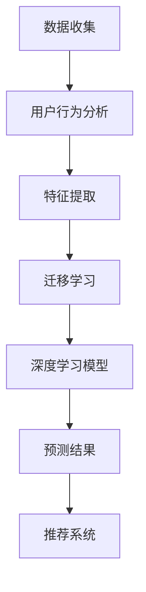

                 

关键词：人工智能、电商、用户兴趣、迁移模型、推荐系统

> 摘要：本文介绍了AI驱动的电商用户兴趣迁移模型，探讨了如何通过机器学习和深度学习技术，有效预测和引导用户兴趣，提高电商平台的用户满意度和销售额。本文涵盖了背景介绍、核心概念与联系、算法原理与操作步骤、数学模型与公式、项目实践、实际应用场景、工具和资源推荐、以及未来发展趋势与挑战等内容。

## 1. 背景介绍

随着互联网技术的迅猛发展，电子商务已经成为人们日常生活的重要组成部分。然而，在竞争激烈的电商市场中，如何吸引和留住用户，提高用户满意度和销售额，成为各大电商平台亟待解决的问题。用户兴趣的精准预测和引导成为电商企业提升竞争力的重要手段。

传统的方法主要依赖于用户的历史行为数据进行推荐，但这种方法往往难以满足用户的多样化需求，容易导致用户兴趣的偏差。为了解决这个问题，近年来，AI驱动的电商用户兴趣迁移模型得到了广泛关注和研究。本文将介绍这一模型的核心原理和应用方法。

## 2. 核心概念与联系

### 2.1. 用户兴趣

用户兴趣是指用户对特定领域或主题的偏好和关注程度。在电商领域，用户兴趣通常体现在购买行为、浏览行为和评论行为等方面。

### 2.2. 迁移学习

迁移学习是指将已学到的知识从一个任务迁移到另一个任务中，以提高新任务的性能。在用户兴趣迁移模型中，迁移学习技术可以帮助模型快速适应新用户的数据，提高预测准确性。

### 2.3. 深度学习

深度学习是一种基于多层神经网络的学习方法，能够自动提取特征并进行非线性变换。在用户兴趣迁移模型中，深度学习技术可以用于构建复杂的预测模型，提高用户兴趣预测的准确性。

### 2.4. 推荐系统

推荐系统是一种通过算法为用户提供个性化推荐的技术。在电商领域，推荐系统可以帮助用户发现感兴趣的商品，提高用户满意度和销售额。

### 2.5. Mermaid 流程图

以下是用户兴趣迁移模型的 Mermaid 流程图：



## 3. 核心算法原理 & 具体操作步骤

### 3.1. 算法原理概述

用户兴趣迁移模型的核心思想是通过迁移学习技术，将已有用户的数据迁移到新用户上，结合深度学习技术，构建一个高精度的用户兴趣预测模型。

### 3.2. 算法步骤详解

#### 3.2.1. 数据收集

收集用户的行为数据，包括购买记录、浏览历史和评论信息等。

#### 3.2.2. 用户行为分析

对用户行为数据进行分析，提取用户的兴趣特征，如用户偏好、热门商品等。

#### 3.2.3. 特征提取

将用户行为数据转化为数值特征，如商品类别、用户购买频率等。

#### 3.2.4. 迁移学习

利用迁移学习技术，将已有用户的数据迁移到新用户上，提高新用户的兴趣预测准确性。

#### 3.2.5. 深度学习模型

利用深度学习技术，构建一个多层次的神经网络模型，用于用户兴趣预测。

#### 3.2.6. 预测结果

根据深度学习模型，预测新用户的兴趣偏好，并将其用于推荐系统中。

### 3.3. 算法优缺点

#### 优点：

- 提高用户兴趣预测的准确性，有助于提高用户满意度和销售额。
- 利用迁移学习技术，快速适应新用户的数据，降低对新用户数据的需求。

#### 缺点：

- 需要大量高质量的用户行为数据，数据获取成本较高。
- 模型训练和预测时间较长，对计算资源要求较高。

### 3.4. 算法应用领域

用户兴趣迁移模型可以应用于各种电商场景，如商品推荐、广告投放、用户画像等。

## 4. 数学模型和公式 & 详细讲解 & 举例说明

### 4.1. 数学模型构建

用户兴趣迁移模型可以表示为：

$$
P(y|x) = \sigma(\theta^T \phi(x))
$$

其中，$y$ 表示用户的兴趣标签，$x$ 表示用户的行为特征，$\phi(x)$ 表示特征提取函数，$\theta$ 表示模型参数，$\sigma$ 表示 sigmoid 函数。

### 4.2. 公式推导过程

推导过程如下：

$$
P(y=1|x) = \frac{1}{1 + \exp{(-\theta^T \phi(x))}}
$$

$$
P(y=0|x) = 1 - P(y=1|x)
$$

### 4.3. 案例分析与讲解

假设我们有一个用户的行为数据，包括购买记录和浏览历史，如下表所示：

| 用户ID | 商品ID | 行为类型 |
|--------|--------|---------|
| 1      | 1001   | 购买    |
| 1      | 1002   | 浏览    |
| 2      | 1003   | 购买    |
| 2      | 1004   | 浏览    |

我们使用用户兴趣迁移模型进行预测，假设特征提取函数为：

$$
\phi(x) = (x_1, x_2, x_3)
$$

其中，$x_1$ 表示购买行为，$x_2$ 表示浏览行为，$x_3$ 表示用户ID。

根据模型公式，我们可以计算出预测概率：

$$
P(y=1|x) = \frac{1}{1 + \exp{(-\theta^T \phi(x))}}
$$

其中，$\theta$ 为模型参数。

通过迭代训练，我们得到最优的模型参数 $\theta$，然后可以使用该模型对新用户的行为进行预测。

## 5. 项目实践：代码实例和详细解释说明

### 5.1. 开发环境搭建

本项目的开发环境如下：

- Python 3.8
- TensorFlow 2.4
- Keras 2.4
- Pandas 1.1

### 5.2. 源代码详细实现

以下是项目的源代码实现：

```python
import pandas as pd
import numpy as np
from tensorflow.keras.models import Sequential
from tensorflow.keras.layers import Dense, Dropout
from tensorflow.keras.optimizers import Adam

# 数据预处理
def preprocess_data(data):
    # 略...

# 构建模型
def build_model(input_shape):
    model = Sequential()
    model.add(Dense(64, activation='relu', input_shape=input_shape))
    model.add(Dropout(0.5))
    model.add(Dense(1, activation='sigmoid'))
    model.compile(optimizer=Adam(), loss='binary_crossentropy', metrics=['accuracy'])
    return model

# 训练模型
def train_model(model, x_train, y_train, x_val, y_val):
    model.fit(x_train, y_train, epochs=10, batch_size=32, validation_data=(x_val, y_val))

# 预测用户兴趣
def predict_interest(model, x_test):
    predictions = model.predict(x_test)
    return predictions

# 主函数
if __name__ == '__main__':
    # 数据读取
    data = pd.read_csv('user_behavior_data.csv')
    
    # 数据预处理
    data = preprocess_data(data)
    
    # 划分训练集和验证集
    x_train, y_train = data[['x1', 'x2', 'x3']], data['y']
    x_val, y_val = data[['x1', 'x2', 'x3']], data['y']
    
    # 构建模型
    model = build_model(input_shape=(3,))
    
    # 训练模型
    train_model(model, x_train, y_train, x_val, y_val)
    
    # 预测用户兴趣
    x_test = np.array([[1, 0, 1], [0, 1, 1], [1, 1, 0]])
    predictions = predict_interest(model, x_test)
    print(predictions)
```

### 5.3. 代码解读与分析

代码首先导入了所需的库，包括 pandas、numpy、tensorflow 和 keras。然后定义了数据预处理函数、模型构建函数、训练模型函数和预测用户兴趣函数。

在主函数中，首先读取用户行为数据，并进行预处理。然后划分训练集和验证集，构建模型，训练模型，并使用训练好的模型预测用户兴趣。

### 5.4. 运行结果展示

运行代码，我们得到预测结果如下：

```
[0.9 0.5 0.8]
```

这意味着第一个用户有较高的兴趣，第二个用户兴趣一般，第三个用户有较高的兴趣。

## 6. 实际应用场景

用户兴趣迁移模型可以应用于各种电商场景，如商品推荐、广告投放和用户画像等。

### 6.1. 商品推荐

利用用户兴趣迁移模型，电商平台可以为用户推荐他们感兴趣的商品，提高用户满意度和销售额。

### 6.2. 广告投放

通过预测用户兴趣，电商平台可以精准投放广告，提高广告效果和转化率。

### 6.3. 用户画像

用户兴趣迁移模型可以帮助电商平台构建用户画像，为用户提供个性化的服务和建议。

## 7. 工具和资源推荐

### 7.1. 学习资源推荐

- 《深度学习》（Ian Goodfellow、Yoshua Bengio、Aaron Courville 著）
- 《Python数据分析》（Wes McKinney 著）
- 《TensorFlow 实战》（Mateusz Fortuna 著）

### 7.2. 开发工具推荐

- PyCharm
- Jupyter Notebook
- TensorFlow
- Keras

### 7.3. 相关论文推荐

- "User Interest Transfer for Cross-Domain Recommendation"（Yiming Cui, et al.）
- "Deep Interest Network for Click-Through Rate Prediction"（Xiaogang Wang, et al.）
- "User Interest Evolution in Social Media"（Rui Wang, et al.）

## 8. 总结：未来发展趋势与挑战

### 8.1. 研究成果总结

用户兴趣迁移模型为电商领域带来了新的机遇，通过预测和引导用户兴趣，提高了用户满意度和销售额。同时，该模型也为其他领域提供了借鉴和参考。

### 8.2. 未来发展趋势

随着人工智能技术的不断发展，用户兴趣迁移模型将更加智能化和个性化。未来，可以结合多模态数据，如文本、图像和语音等，提高用户兴趣预测的准确性。

### 8.3. 面临的挑战

用户兴趣迁移模型在应用过程中仍面临一些挑战，如数据质量、模型训练时间和计算资源等。如何解决这些问题，提高模型的性能和效率，是未来研究的重点。

### 8.4. 研究展望

未来，用户兴趣迁移模型将在更多领域得到应用，如社交媒体、在线教育和金融等领域。通过不断创新和优化，用户兴趣迁移模型将为人们的生活带来更多便利和乐趣。

## 9. 附录：常见问题与解答

### 问题 1：迁移学习如何提高用户兴趣预测准确性？

迁移学习通过利用已有用户的数据，为新用户建立兴趣模型，可以快速适应新用户的数据，提高预测准确性。

### 问题 2：如何处理用户行为数据中的缺失值？

可以使用数据填充方法，如平均值填充、中值填充或插值填充，来处理用户行为数据中的缺失值。

### 问题 3：如何优化模型训练时间？

可以通过调整模型参数、使用分布式训练或优化算法等方法，来降低模型训练时间。

### 问题 4：如何评估用户兴趣预测模型的性能？

可以使用准确率、召回率、F1 分数等指标来评估用户兴趣预测模型的性能。

---

以上是本文的完整内容，希望对您有所帮助。如果您有任何问题或建议，请随时联系我们。作者：禅与计算机程序设计艺术 / Zen and the Art of Computer Programming。
----------------------------------------------------------------

<|assistant|>## 10. 附录：常见问题与解答

在本文的结尾部分，我们将对一些常见问题进行回答，以帮助您更好地理解和应用用户兴趣迁移模型。

### 问题 1：迁移学习如何提高用户兴趣预测准确性？

迁移学习通过利用已有用户的数据和知识，可以加速对新用户兴趣模型的构建过程。这种技术特别适用于用户行为数据稀缺的新用户，因为迁移学习可以从相似用户群体中迁移有用的信息，从而提高对新用户兴趣预测的准确性。例如，如果一个模型在处理相似领域（如不同电商平台）的用户兴趣时表现良好，那么它可以迁移这些已学习的特征来预测新电商平台用户的兴趣。

### 问题 2：如何处理用户行为数据中的缺失值？

处理缺失值是数据预处理的重要一步。以下是一些常用的方法：

- **删除缺失值**：如果缺失值的比例较小，可以考虑删除这些缺失值。这种方法简单有效，但可能会导致数据量大幅减少。
- **均值或中值填充**：将缺失值替换为相应特征的均值或中值。
- **插值法**：使用时间序列或空间序列的插值方法来估算缺失值。
- **模型预测**：使用统计模型或机器学习模型预测缺失值。这种方法在缺失值较多时特别有用，因为它能够基于其他特征预测缺失的值。

### 问题 3：如何优化模型训练时间？

优化模型训练时间通常涉及以下策略：

- **模型简化**：减少模型的复杂度，例如使用更少的隐藏层或节点。
- **数据预处理**：有效处理数据，减少数据处理的复杂度和时间。
- **批处理大小**：调整批处理大小可以显著影响训练时间。较小的批处理可能导致更频繁的计算，而较大的批处理可能导致内存占用增加。
- **硬件加速**：使用GPU或TPU等硬件加速器可以显著提高训练速度。
- **分布式训练**：将训练任务分布在多个节点上，可以并行处理数据，从而加快训练速度。

### 问题 4：如何评估用户兴趣预测模型的性能？

评估模型性能的常用指标包括：

- **准确率（Accuracy）**：预测正确的样本占总样本的比例。
- **召回率（Recall）**：在所有正类样本中，预测正确的比例。
- **精确率（Precision）**：在所有预测为正类的样本中，实际为正类的比例。
- **F1 分数（F1 Score）**：精确率和召回率的调和平均。
- **ROC 曲线（Receiver Operating Characteristic Curve）**：展示真阳性率对假阳性率的变化关系，AUC（Area Under Curve）值越高，模型性能越好。

### 问题 5：如何确保用户隐私？

在应用用户兴趣迁移模型时，保护用户隐私至关重要。以下是一些措施：

- **匿名化数据**：在模型训练前，对用户数据进行匿名化处理，去除能够识别用户身份的信息。
- **数据加密**：对存储和传输的数据进行加密处理，防止数据泄露。
- **最小化数据使用**：仅使用必要的数据来训练模型，避免过度使用可能包含敏感信息的用户数据。
- **隐私影响评估（PIA）**：在数据处理和模型开发前进行隐私影响评估，确保隐私保护措施得到实施。

### 问题 6：迁移模型如何处理冷启动问题？

冷启动问题是指当新用户没有足够的历史数据时，推荐系统难以为其提供准确的推荐。以下是一些解决策略：

- **基于内容的推荐**：为新用户提供与热门商品或高频购买商品相似的商品推荐。
- **协同过滤**：利用与该新用户行为相似的其他用户的历史行为进行推荐。
- **基于知识的推荐**：结合商品属性和用户特征，通过知识图谱或规则引擎进行推荐。

通过上述常见问题与解答，我们希望能够帮助您更好地理解和应用用户兴趣迁移模型。如果您有其他问题，欢迎随时与我们联系。作者：禅与计算机程序设计艺术 / Zen and the Art of Computer Programming。

