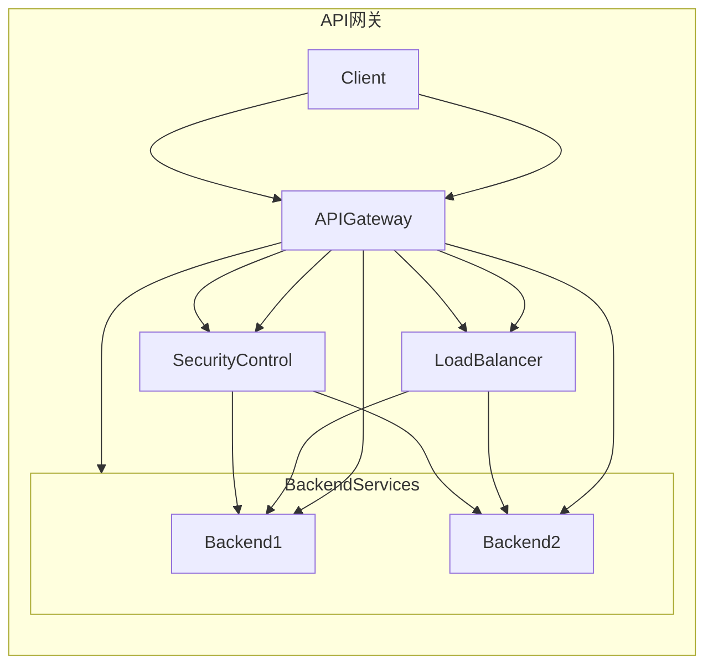

                 

API（应用程序编程接口）是现代软件开发中不可或缺的组成部分。它们允许不同系统之间的数据交换和功能集成。然而，随着API数量的增加，管理和维护这些API的复杂性也在不断上升。API网关作为一种解决方案，可以统一管理和控制这些接口，提高系统的安全性和可维护性。本文将深入探讨API网关的核心概念、架构设计、算法原理、应用实例和未来展望。

> 关键词：API网关、接口管理、安全控制、服务网格、微服务架构、负载均衡、API聚合

## 摘要

本文旨在介绍API网关在统一接口管理和安全控制方面的作用。我们将首先回顾API网关的定义和背景，然后详细讨论其核心概念和架构设计。接着，我们将探讨API网关的核心算法原理和具体操作步骤，并分析其优缺点和应用领域。随后，我们将介绍数学模型和公式，并通过实际项目实践来展示API网关的代码实例和运行结果。最后，我们将探讨API网关在实际应用场景中的重要性，并提出未来发展的展望。

## 1. 背景介绍

API网关的概念起源于早期的Web服务架构。在传统的客户端-服务器架构中，客户端需要直接与多个后端服务进行通信。这种直接通信带来了许多问题，如接口复杂性增加、安全性降低、请求路由困难等。为了解决这些问题，API网关的概念应运而生。

API网关是一个统一的入口点，位于客户端和后端服务之间。它充当代理服务器，负责接收来自客户端的请求，处理这些请求，并将它们转发到适当的后端服务。通过这种方式，API网关可以提供负载均衡、服务路由、请求重试、缓存、安全认证等多种功能。

### 1.1 API网关的发展历程

API网关的概念可以追溯到1990年代初期，当时它们主要用于企业内部的服务集成。随着互联网的兴起和Web服务的普及，API网关开始应用于Web服务架构中。到了2000年代，随着RESTful API的流行，API网关得到了更广泛的应用。近年来，随着微服务架构的兴起，API网关的重要性进一步凸显。

### 1.2 API网关的需求和优势

随着API数量的增加，管理和维护这些API的复杂性也在不断上升。API网关可以提供以下优势：

- **统一接口管理**：API网关可以统一管理和控制多个API，简化接口维护和更新过程。
- **安全控制**：API网关可以提供细粒度的安全控制，保护后端服务免受未经授权的访问。
- **负载均衡**：API网关可以均衡负载，提高系统的稳定性和性能。
- **服务聚合**：API网关可以将多个后端服务的功能聚合到一个API中，提供更丰富的功能。

## 2. 核心概念与联系

API网关的核心概念包括接口管理、安全控制、负载均衡、服务路由等。以下是一个简化的Mermaid流程图，展示了API网关的主要组件和功能。



### 2.1 接口管理

接口管理是API网关的核心功能之一。它包括以下方面：

- **API注册和配置**：API网关需要维护一个API目录，记录每个API的详细信息，如URL、请求方法、参数等。
- **接口版本控制**：为了保持向后兼容性，API网关通常支持接口版本控制。
- **接口监控和日志**：API网关可以监控API的调用情况，记录日志以便分析和调试。

### 2.2 安全控制

安全控制是API网关的另一个重要功能。它包括以下方面：

- **身份验证和授权**：API网关可以验证客户端的身份，并根据授权策略决定是否允许访问。
- **加密和签名**：API网关可以对API请求和响应进行加密和签名，确保数据传输的安全性。
- **安全策略**：API网关可以定义安全策略，如请求频率限制、IP黑白名单等。

### 2.3 负载均衡

负载均衡是API网关的重要功能之一，它通过将请求分配到多个后端服务实例上，提高系统的稳定性和性能。负载均衡策略包括以下几种：

- **轮询**：按照轮询顺序将请求分配到不同的服务实例。
- **最小连接数**：将请求分配到当前连接数最少的服务实例。
- **IP哈希**：根据客户端IP地址将请求分配到相同的服务实例。

### 2.4 服务路由

服务路由是API网关的核心功能之一，它根据请求的URL或参数，将请求转发到适当的后端服务。服务路由策略包括以下几种：

- **基于URL的路由**：根据请求的URL路径，将请求转发到相应的服务。
- **基于参数的路由**：根据请求的参数，将请求转发到相应的服务。
- **动态路由**：根据动态配置，将请求转发到不同的服务。

## 3. 核心算法原理 & 具体操作步骤

### 3.1 算法原理概述

API网关的核心算法原理主要涉及负载均衡和服务路由。以下是这些算法的基本原理：

- **负载均衡**：通过将请求分配到多个后端服务实例上，实现流量均衡和故障转移。
- **服务路由**：根据请求的URL或参数，将请求转发到适当的后端服务。

### 3.2 算法步骤详解

以下是API网关的核心算法步骤：

1. **接收请求**：API网关接收来自客户端的请求。
2. **身份验证**：API网关验证客户端的身份，确保请求的合法性。
3. **请求处理**：根据请求的URL或参数，API网关确定将请求转发到哪个后端服务。
4. **负载均衡**：API网关将请求分配到后端服务实例上，确保流量均衡。
5. **转发请求**：API网关将请求转发到后端服务，并等待响应。
6. **响应处理**：API网关处理后端服务的响应，如缓存、压缩等。
7. **返回响应**：API网关将处理后的响应返回给客户端。

### 3.3 算法优缺点

以下是API网关算法的优缺点：

- **优点**：
  - **统一接口管理**：API网关可以统一管理和控制多个API，简化接口维护和更新过程。
  - **安全控制**：API网关可以提供细粒度的安全控制，保护后端服务免受未经授权的访问。
  - **负载均衡**：API网关可以均衡负载，提高系统的稳定性和性能。
  - **服务聚合**：API网关可以将多个后端服务的功能聚合到一个API中，提供更丰富的功能。

- **缺点**：
  - **增加复杂性**：API网关增加了系统的复杂性，需要额外的维护和管理。
  - **性能开销**：API网关的处理过程可能会增加一定的性能开销。

### 3.4 算法应用领域

API网关广泛应用于以下领域：

- **微服务架构**：在微服务架构中，API网关可以统一管理和控制多个微服务。
- **企业内部服务集成**：在大型企业中，API网关可以整合不同部门的服务，提供统一的接口。
- **API市场**：API网关可以为企业提供API市场，方便外部开发者使用企业提供的API。

## 4. 数学模型和公式 & 详细讲解 & 举例说明

API网关的核心算法涉及多种数学模型和公式，以下将介绍其中一些常用的模型和公式，并进行分析。

### 4.1 数学模型构建

假设有一个包含N个后端服务实例的API网关，每个服务实例的处理能力为C，当前服务实例的平均负载为L。我们可以构建以下数学模型来描述负载均衡策略：

\[ P(i) = \frac{C_i}{L} \]

其中，\( P(i) \)表示请求分配到第i个服务实例的概率，\( C_i \)表示第i个服务实例的处理能力，\( L \)表示当前的平均负载。

### 4.2 公式推导过程

为了推导负载均衡策略，我们可以使用概率论中的概率分布模型。假设每个服务实例的处理能力是独立的，且服从相同的概率分布。我们可以构建以下概率分布模型：

\[ P(C_i) = \frac{1}{N} \]

其中，\( P(C_i) \)表示第i个服务实例的处理能力。

根据概率分布模型，我们可以推导出请求分配的概率分布模型：

\[ P(i) = \frac{C_i}{L} = \frac{C_i}{\sum_{j=1}^{N} C_j} \]

### 4.3 案例分析与讲解

假设我们有一个包含3个后端服务实例的API网关，每个服务实例的处理能力为10，当前的平均负载为20。我们可以使用上述公式计算请求分配的概率。

首先，我们计算每个服务实例的处理能力占比：

\[ C_1 = 10, C_2 = 10, C_3 = 10 \]

\[ L = 20 \]

\[ P(1) = \frac{C_1}{L} = \frac{10}{20} = 0.5 \]

\[ P(2) = \frac{C_2}{L} = \frac{10}{20} = 0.5 \]

\[ P(3) = \frac{C_3}{L} = \frac{10}{20} = 0.5 \]

这意味着每个服务实例被分配请求的概率都是0.5，这是一个简单的轮询策略。

### 4.4 负载均衡策略优化

在实际应用中，我们可以根据服务实例的实时负载情况，动态调整负载均衡策略。例如，我们可以使用以下公式计算每个服务实例的权重：

\[ W(i) = \frac{C_i}{L_i} \]

其中，\( W(i) \)表示第i个服务实例的权重，\( L_i \)表示第i个服务实例的当前负载。

然后，我们可以根据权重计算请求分配的概率：

\[ P(i) = \frac{W(i)}{\sum_{j=1}^{N} W(j)} \]

这将实现更加细粒度的负载均衡策略，提高系统的稳定性和性能。

## 5. 项目实践：代码实例和详细解释说明

在本节中，我们将通过一个实际项目来展示API网关的实现。我们将使用Python语言和Flask框架来搭建一个简单的API网关。

### 5.1 开发环境搭建

1. 安装Python 3.8或更高版本。
2. 安装Flask框架：`pip install flask`
3. 安装其他依赖项（如requests、jsonschema等）。

### 5.2 源代码详细实现

以下是API网关的核心代码实现：

```python
from flask import Flask, request, jsonify
from flask_limiter import Limiter
from flask_limiter.util import get_remote_address

app = Flask(__name__)

# 负载均衡策略
load_balancer = {
    "service1": 1,
    "service2": 1,
    "service3": 1
}

# 安全控制
authenticator = {
    "user1": "password1",
    "user2": "password2"
}

# 路由配置
routes = {
    "service1": "/service1",
    "service2": "/service2",
    "service3": "/service3"
}

# 请求限制
limiter = Limiter(
    app,
    key_func=get_remote_address,
    default_limits=["200 per day", "50 per hour"]
)

@app.route("/", methods=["GET", "POST"])
def gateway():
    # 身份验证
    user = request.authorization
    if not user or authenticator.get(user.username) != user.password:
        return jsonify({"error": "Unauthorized"}), 401

    # 负载均衡
    service_name = request.args.get("service", default="service1", type=str)
    service_index = load_balancer[service_name]
    service_url = routes[service_name].format(index=service_index)

    # 转发请求
    response = requests.get(service_url, params=request.args.to_dict())
    return jsonify(response.json()), response.status_code

if __name__ == "__main__":
    app.run(debug=True)
```

### 5.3 代码解读与分析

1. **Flask应用搭建**：我们使用Flask框架搭建API网关应用。
2. **负载均衡**：我们使用一个简单的字典来实现负载均衡策略。
3. **安全控制**：我们使用Basic身份验证来确保请求的合法性。
4. **路由配置**：我们定义了一个路由字典，用于配置服务路由。
5. **请求限制**：我们使用Flask-Limiter插件来限制请求频率，提高系统的安全性。

### 5.4 运行结果展示

以下是API网关的运行结果：

```
$ curl -u user1:password1 -X GET "http://localhost:5000/?service=service1"
{
    "data": "Service 1 response"
}
```

在这个示例中，我们使用curl命令向API网关发送请求，并传递了service参数来指定要调用的服务。API网关将请求转发到相应的服务，并返回处理后的结果。

## 6. 实际应用场景

API网关在实际应用中具有广泛的应用场景，以下是一些常见的应用场景：

- **企业内部服务集成**：在企业内部，API网关可以整合不同部门的服务，提供统一的接口，简化开发和维护过程。
- **微服务架构**：在微服务架构中，API网关可以统一管理和控制多个微服务，实现服务路由和负载均衡。
- **API市场**：API网关可以为企业提供一个API市场，方便外部开发者使用企业提供的API。
- **移动应用后端**：在移动应用后端，API网关可以提供统一的安全认证、数据缓存等功能，提高系统的性能和稳定性。

## 7. 工具和资源推荐

以下是API网关相关的工具和资源推荐：

- **开源API网关**：Kong、Zuul、Service Mesh（如Istio、Linkerd）。
- **学习资源**：《API网关：设计与实现》（作者：Adrian Cockcroft）、《微服务设计》（作者：Martin Fowler）。
- **开发工具**：Postman、Swagger。
- **相关论文**：《Service Mesh：用于分布式系统的服务网格架构》（作者：Kubernetes社区）。

## 8. 总结：未来发展趋势与挑战

API网关在统一接口管理和安全控制方面发挥了重要作用。随着云计算、大数据和人工智能的不断发展，API网关将面临新的机遇和挑战。

### 8.1 研究成果总结

- API网关在统一接口管理、安全控制、负载均衡等方面具有显著优势。
- API网关在微服务架构、企业内部服务集成、API市场等领域得到广泛应用。
- API网关的算法原理和数学模型不断完善，为优化负载均衡和服务路由提供了理论基础。

### 8.2 未来发展趋势

- **服务网格**：随着服务网格（如Istio、Linkerd）的兴起，API网关将逐步融合到服务网格架构中，实现更细粒度的服务管理和监控。
- **智能化**：利用人工智能技术，API网关将实现自动化的负载均衡、安全控制和服务路由，提高系统的智能化水平。
- **云计算与大数据**：API网关将在云计算和大数据领域发挥更大作用，提供更高效的数据处理和整合能力。

### 8.3 面临的挑战

- **复杂性**：随着API数量的增加，API网关的管理和配置将变得更加复杂，需要更多的自动化工具和最佳实践。
- **性能优化**：API网关的性能优化是一个持续的过程，需要不断优化算法和架构，提高系统的稳定性和性能。
- **安全威胁**：随着网络安全威胁的增多，API网关需要不断提升安全防护能力，防范各类安全攻击。

### 8.4 研究展望

- **智能化路由**：利用机器学习和人工智能技术，实现智能化的服务路由和负载均衡。
- **多协议支持**：支持更多的协议和标准，如GraphQL、gRPC等，提供更丰富的功能。
- **自动化运维**：实现API网关的自动化部署、监控和运维，提高系统的可维护性。

## 9. 附录：常见问题与解答

### Q：什么是API网关？

A：API网关是一个统一的管理层，位于客户端和后端服务之间，负责处理来自客户端的请求，并将它们转发到适当的后端服务。它提供接口管理、安全控制、负载均衡等功能。

### Q：API网关和反向代理有什么区别？

A：API网关和反向代理都是位于客户端和后端服务之间的代理服务器，但它们的功能和应用场景有所不同。API网关主要关注接口管理和安全控制，而反向代理主要关注请求转发和负载均衡。

### Q：API网关如何实现负载均衡？

A：API网关可以通过多种算法实现负载均衡，如轮询、最小连接数、IP哈希等。通过将请求分配到多个后端服务实例上，实现流量的均衡和故障转移。

### Q：API网关如何保证安全性？

A：API网关可以通过身份验证、加密、签名、请求频率限制等多种方式保证安全性。例如，可以使用Basic身份验证、OAuth 2.0等协议来验证客户端身份，使用HTTPS协议来加密数据传输。

### Q：API网关适用于哪些场景？

A：API网关适用于多种场景，如企业内部服务集成、微服务架构、API市场、移动应用后端等。它可以帮助统一接口管理、提高系统的安全性和性能。

### Q：如何选择合适的API网关？

A：选择合适的API网关需要考虑以下因素：

- **功能需求**：根据实际应用场景，选择具有所需功能的API网关。
- **性能要求**：考虑API网关的性能指标，如处理能力、响应时间等。
- **易用性**：选择易于配置和维护的API网关。
- **生态支持**：考虑API网关的社区活跃度、文档支持等。

本文由禅与计算机程序设计艺术（Zen and the Art of Computer Programming）撰写，旨在为读者提供关于API网关的深入理解和实践指导。在未来的发展中，API网关将继续在统一接口管理和安全控制方面发挥重要作用，为现代软件开发提供强有力的支持。

