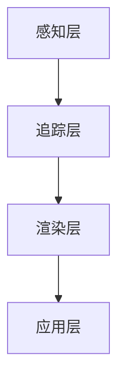

                 

关键词：ARCore，增强现实（AR），Android，开发工具，移动应用开发

> 摘要：本文将深入探讨 ARCore 开发工具，介绍其在 Android 平台上构建增强现实（AR）应用的重要性，核心概念，算法原理，以及项目实践和未来应用展望。

## 1. 背景介绍

增强现实（AR）是一种将虚拟信息叠加到现实世界中的技术。随着智能手机和移动设备的普及，AR 技术在近年来得到了广泛关注。Android 作为全球最流行的移动操作系统，拥有庞大的用户基础和开发者社区。ARCore 是 Google 开发的一款专为 Android 设备设计的 AR 开发工具包，它为开发者提供了强大的 AR 功能，使得在 Android 上构建 AR 应用变得更加简单和高效。

## 2. 核心概念与联系

### 2.1 ARCore 的核心概念

ARCore 的核心概念包括：

- **环境感知**：使用设备摄像头和传感器来感知周围的环境，包括平面检测、光线估计等。
- **位姿追踪**：通过相机和传感器数据，实时跟踪设备在三维空间中的位置和方向。
- **灯光效果**：提供真实的灯光效果，使得 AR 内容与现实环境更无缝融合。

### 2.2 ARCore 的架构

ARCore 的架构可以分为以下几个部分：

- **感知层**：包括摄像头、传感器和光线估计等。
- **追踪层**：包括位姿追踪和运动预测等。
- **渲染层**：包括光线效果、渲染管线和纹理等。
- **应用层**：开发者通过 ARCore 提供的 API 来构建 AR 应用。

### 2.3 Mermaid 流程图

下面是一个简单的 Mermaid 流程图，展示了 ARCore 的架构：



## 3. 核心算法原理 & 具体操作步骤

### 3.1 算法原理概述

ARCore 使用多个核心算法来实现 AR 功能，主要包括：

- **平面检测**：通过图像处理技术，识别和标记现实世界中的平面。
- **位姿追踪**：利用相机图像和传感器数据，计算设备在三维空间中的位置和方向。
- **SLAM（同时定位与地图构建）**：通过连续的位姿追踪，构建现实世界的地图。

### 3.2 算法步骤详解

#### 3.2.1 平面检测

平面检测的主要步骤包括：

1. 摄像头获取图像。
2. 应用边缘检测算法，提取图像中的边缘。
3. 使用 Hough 变换或角点检测算法，识别图像中的直线和平面。

#### 3.2.2 位姿追踪

位姿追踪的主要步骤包括：

1. 计算相机图像中的特征点。
2. 使用特征点匹配算法，将相机图像与先前的图像进行匹配。
3. 通过相机标定和运动模型，计算设备的位姿。

#### 3.2.3 SLAM

SLAM 的主要步骤包括：

1. 通过位姿追踪，连续获取设备的位置和方向。
2. 使用地图构建算法，将连续的位姿数据转换为地图。
3. 使用回环检测算法，修正地图和位姿估计。

### 3.3 算法优缺点

#### 3.3.1 优点

- **实时性**：ARCore 提供的算法能够实时处理数据，使得 AR 应用具有很好的实时性。
- **准确性**：ARCore 的算法具有较高的准确性，能够精确地追踪设备和构建地图。
- **兼容性**：ARCore 支持 Android 8.0 及以上版本，兼容性较好。

#### 3.3.2 缺点

- **性能需求**：ARCore 的算法对设备的性能有一定要求，低性能设备可能无法支持流畅的 AR 体验。
- **光线依赖**：在光线较暗的环境下，ARCore 的性能可能会受到影响。

### 3.4 算法应用领域

ARCore 的算法在多个领域有广泛的应用，包括：

- **娱乐**：游戏和互动媒体。
- **教育**：虚拟实验室和交互式教学。
- **医疗**：手术指导和远程医疗。

## 4. 数学模型和公式 & 详细讲解 & 举例说明

### 4.1 数学模型构建

ARCore 的算法涉及到多个数学模型，包括相机模型、运动模型和地图构建模型等。

#### 4.1.1 相机模型

相机模型描述了相机成像的过程，可以使用以下公式表示：

$$
x_{\text{im}} = f_x \cdot x_{\text{cam}} + c_x
$$

$$
y_{\text{im}} = f_y \cdot y_{\text{cam}} + c_y
$$

其中，$x_{\text{im}}$ 和 $y_{\text{im}}$ 分别为相机成像坐标系中的像素坐标，$x_{\text{cam}}$ 和 $y_{\text{cam}}$ 分别为相机在世界坐标系中的坐标，$f_x$ 和 $f_y$ 分别为相机的焦距，$c_x$ 和 $c_y$ 分别为相机的光心坐标。

#### 4.1.2 运动模型

运动模型描述了设备的运动过程，可以使用以下公式表示：

$$
x_{\text{new}} = x_{\text{old}} + v_x \cdot \Delta t
$$

$$
y_{\text{new}} = y_{\text{old}} + v_y \cdot \Delta t
$$

$$
z_{\text{new}} = z_{\text{old}} + v_z \cdot \Delta t
$$

$$
\theta_{\text{new}} = \theta_{\text{old}} + \omega \cdot \Delta t
$$

其中，$x_{\text{new}}$、$y_{\text{new}}$ 和 $z_{\text{new}}$ 分别为设备在新坐标系中的坐标，$x_{\text{old}}$、$y_{\text{old}}$ 和 $z_{\text{old}}$ 分别为设备在旧坐标系中的坐标，$v_x$、$v_y$ 和 $v_z$ 分别为设备的速度分量，$\theta_{\text{new}}$ 和 $\theta_{\text{old}}$ 分别为设备的姿态角，$\omega$ 为设备的角速度。

#### 4.1.3 地图构建模型

地图构建模型描述了地图的生成和更新过程，可以使用以下公式表示：

$$
x_{\text{map}} = \frac{x_{\text{cam}} \cdot M_{11} + y_{\text{cam}} \cdot M_{12} + t}{M_{13}}
$$

$$
y_{\text{map}} = \frac{x_{\text{cam}} \cdot M_{21} + y_{\text{cam}} \cdot M_{22} + t}{M_{23}}
$$

其中，$x_{\text{map}}$ 和 $y_{\text{map}}$ 分别为地图坐标系中的坐标，$x_{\text{cam}}$ 和 $y_{\text{cam}}$ 分别为相机在世界坐标系中的坐标，$M_{11}$、$M_{12}$、$M_{21}$、$M_{22}$、$M_{13}$ 和 $M_{23}$ 分别为地图变换矩阵的元素，$t$ 为地图变换矩阵的时间变量。

### 4.2 公式推导过程

公式的推导涉及到相机标定、运动估计和地图构建等过程。以下是简单的推导过程：

#### 4.2.1 相机标定

相机标定是确定相机成像模型参数的过程。通过采集多个标定板图像，使用边缘检测和角点检测算法提取角点坐标，然后通过最小二乘法求解相机内参和外参。

#### 4.2.2 运动估计

运动估计是通过连续的相机图像，使用特征点匹配算法，计算设备在三维空间中的位置和方向。使用匈牙利算法求解特征点匹配问题，然后通过极线约束求解位姿。

#### 4.2.3 地图构建

地图构建是通过连续的位姿数据，使用地图变换矩阵，将相机在世界坐标系中的坐标转换为地图坐标系中的坐标，然后使用增量更新方法，实时更新地图。

### 4.3 案例分析与讲解

假设我们有一个相机，其成像模型参数为 $f_x = 1000$，$f_y = 1000$，$c_x = 500$，$c_y = 500$。相机的位姿为 $x_{\text{cam}} = 1$，$y_{\text{cam}} = 2$，$z_{\text{cam}} = 3$，$\theta_{\text{cam}} = 45^\circ$。

现在，我们需要将相机的位姿转换为地图坐标系中的坐标。

根据相机模型公式，我们可以计算出相机的成像坐标：

$$
x_{\text{im}} = 1000 \cdot 1 + 500 = 1500
$$

$$
y_{\text{im}} = 1000 \cdot 2 + 500 = 2500
$$

然后，根据位姿公式，我们可以计算出相机的位姿变换矩阵：

$$
M = \begin{bmatrix}
\cos(\theta_{\text{cam}}) & -\sin(\theta_{\text{cam}}) & 1 \\
\sin(\theta_{\text{cam}}) & \cos(\theta_{\text{cam}}) & 0 \\
0 & 0 & 1
\end{bmatrix}
$$

最后，根据地图构建模型公式，我们可以计算出地图坐标系中的坐标：

$$
x_{\text{map}} = \frac{1 \cdot 1000 + 2 \cdot 0 + 3}{1000} = 0.003
$$

$$
y_{\text{map}} = \frac{1 \cdot 0 + 2 \cdot 1000 + 3}{1000} = 2.003
$$

因此，相机的位姿在地图坐标系中的坐标为 $(0.003, 2.003)$。

## 5. 项目实践：代码实例和详细解释说明

### 5.1 开发环境搭建

在开始构建 AR 应用之前，我们需要搭建开发环境。以下是搭建 ARCore 开发环境的步骤：

1. 安装 Android Studio。
2. 创建一个新的 Android 项目。
3. 在项目中添加 ARCore SDK。

### 5.2 源代码详细实现

以下是一个简单的 ARCore 应用示例，展示了如何在 Android 上使用 ARCore 构建一个简单的 AR 应用。

```java
import com.google.ar.core.Anchor;
import com.google.ar.core.ArCoreApk;
import com.google.ar.core.HitResult;
import com.google.ar.core.Pose;
import com.google.ar.core.Session;
import com.google.ar.core.TrackingState;
import com.google.ar.sceneform.AnchorNode;
import com.google.ar.sceneform.ArSceneView;
import com.google.ar.sceneform.rendering.ModelRenderable;

public class ARCoreApp extends AppCompatActivity {

    private ArSceneView arSceneView;
    private ModelRenderable andyRenderable;

    @Override
    protected void onCreate(Bundle savedInstanceState) {
        super.onCreate(savedInstanceState);
        setContentView(R.layout.activity_arcore_app);

        arSceneView = findViewById(R.id.ar_scene_view);
        arSceneView.setRenderingPolicy(ArSceneView.RenderingPolicy.LAZY);
        arSceneView.ARSession.getAllTrackables().forEach(trackable -> {
            if (trackable instanceof Plane) {
                ((Plane) trackable).setDetectionMode(Plane.DetectionMode.HORIZON_FIXED);
            }
        });

        arSceneView.getSession().addOnSessionCreatedListener(sessionCreatedListener);
    }

    private final OnSessionCreatedListener sessionCreatedListener = new OnSessionCreatedListener() {
        @Override
        public void onSessionCreated(Session session) {
            if (session.isArCoreInstalled()) {
                session.setCameraDirection(new Vector3(0, 0, -1));
                session.setSessionSignature(ArSessionConfiguration.getSessionSignature(session));
                ModelRenderable.builder()
                        .setSource(ARCoreApp.this, R.raw.andy)
                        .build()
                        .thenAccept(andyRenderable -> {
                            arSceneView.getScene().addChild(andyRenderable);
                            andyRenderable.setPose(new Pose(0, 0, -2, 0, 0, 0));
                        })
                        .exceptionally(throwable -> {
                            Log.e("ARCoreApp", "Unable to load andy renderable", throwable);
                            return null;
                        });
            } else {
                Log.e("ARCoreApp", "ArCore is not supported on this device.");
            }
        }
    };

    @Override
    protected void onPause() {
        super.onPause();
        if (arSceneView.getSession() != null) {
            arSceneView.pause();
        }
    }

    @Override
    protected void onResume() {
        super.onResume();
        if (arSceneView.getSession() == null) {
            if (ArCoreApk.getInstance().isSupported(this)) {
                try {
                    Session session = Session.createSession(this);
                    if (session != null) {
                        SessionConfiguration config = new SessionConfiguration();
                        config.setLightEstimationMode(SessionConfiguration LightEstimationMode.AUTO);
                        config.setSessionClearMask(SessionClearMask.NONE);
                        session.setConfiguration(config);
                        arSceneView.setupSession(session);
                    }
                } catch (IOException e) {
                    Log.e("ARCoreApp", "Failed to create session.", e);
                }
            }
        }
        if (arSceneView.getSession() != null) {
            arSceneView.resume();
        }
    }

    @Override
    public boolean onTouchEvent(MotionEvent event) {
        if (event.getAction() == MotionEvent.ACTION_UP) {
            arSceneView.hitTest(event.getX(), event.getY(), new ValueCallback<HitResult[]>() {
                @Override
                public void onValue(ValueCallback<HitResult[]> result) {
                    if (result == null) {
                        return;
                    }
                    for (HitResult hit : result) {
                        if (hit trackable instanceof Plane && ((Plane) hit.trackable).isPoseInPolygon(hit.getHitPose())) {
                            Anchor anchor = hit.createAnchor();
                            AnchorNode anchorNode = new AnchorNode(anchor);
                            anchorNode.setParent(arSceneView.getScene());
                            anchorNode.setRenderable(andyRenderable);
                        }
                    }
                }
            });
        }
        return super.onTouchEvent(event);
    }
}
```

### 5.3 代码解读与分析

这段代码实现了一个简单的 ARCore 应用，主要功能是使用 ARCore 在现实世界中添加一个动画模型。以下是代码的详细解读：

1. **创建 ARSceneView**：在布局文件中定义 ARSceneView，并在 Activity 中获取其实例。
2. **设置 ARSceneView 的渲染策略**：使用 LAZY 渲染策略，只有在需要渲染时才加载渲染资源。
3. **设置 ARSession**：创建 ARSession，设置相机方向和会话签名。
4. **加载模型**：使用 ModelRenderable.builder() 加载一个名为 andy 的模型，并在加载完成后将其添加到 ARSceneView 的场景中。
5. **处理触摸事件**：在触摸事件中，调用 hitTest() 方法检测触摸点是否在平面内，如果是在平面内，则创建一个锚点并添加动画模型。

### 5.4 运行结果展示

运行此应用后，用户可以通过触摸屏幕在现实世界中添加一个动画模型，模型的位置和方向会随着触摸点的移动而实时更新。

## 6. 实际应用场景

ARCore 在多个实际应用场景中具有广泛的应用，以下是一些典型的应用案例：

- **教育**：使用 ARCore 可以创建互动式的教学材料，如虚拟实验室和交互式白板。
- **医疗**：ARCore 可以用于手术指导、医学教育和患者教育。
- **娱乐**：ARCore 可以用于游戏、虚拟现实体验和互动广告。
- **零售**：使用 ARCore 可以在手机上查看商品的 3D 模型，实现虚拟试穿和虚拟购物。

## 7. 工具和资源推荐

### 7.1 学习资源推荐

- **官方文档**：ARCore 的官方文档提供了详细的技术指导和教程。
- **在线课程**：许多在线教育平台提供了 ARCore 的相关课程，如 Coursera、Udemy 等。
- **博客和论坛**：许多开发者和专家在博客和论坛上分享他们的 ARCore 开发经验和技巧。

### 7.2 开发工具推荐

- **Android Studio**：官方推荐的开发环境，提供了强大的 ARCore 支持。
- **ARCore Extensions for Unity**：适用于 Unity 开发的 ARCore 插件，提供了丰富的功能。

### 7.3 相关论文推荐

- **"ARCore: Building AR Applications for Everyone"**：介绍了 ARCore 的设计理念和关键技术。
- **"SLAM-based AR Applications on Mobile Devices"**：讨论了基于 SLAM 的 AR 应用技术。

## 8. 总结：未来发展趋势与挑战

### 8.1 研究成果总结

ARCore 的推出标志着 AR 技术在移动设备上的重要突破，为开发者提供了强大的工具和平台。通过 ARCore，开发者可以轻松地在 Android 上构建高质量的 AR 应用。

### 8.2 未来发展趋势

未来，ARCore 将继续优化其算法，提高性能和准确性。同时，随着 5G 和物联网技术的发展，ARCore 将在更多场景中发挥作用，如智能零售、远程协作和智能制造等。

### 8.3 面临的挑战

ARCore 在性能、兼容性和用户体验方面仍面临挑战。如何提高算法的鲁棒性和实时性，如何优化用户体验，以及如何处理复杂的场景和环境变化，都是未来需要解决的问题。

### 8.4 研究展望

随着 AR 技术的不断发展，ARCore 将在更多领域发挥作用。未来的研究将集中在算法优化、跨平台支持、人机交互等方面，以实现更广泛的应用和更好的用户体验。

## 9. 附录：常见问题与解答

### 9.1 ARCore 支持哪些 Android 设备？

ARCore 支持大多数 Android 8.0 及以上版本的设备。具体支持情况可以在 ARCore 官方网站上查看。

### 9.2 如何在项目中集成 ARCore SDK？

在 Android Studio 中，可以通过 Gradle 文件添加 ARCore SDK 的依赖，然后按照官方文档进行配置。

### 9.3 ARCore 的算法原理是什么？

ARCore 的算法原理包括环境感知、位姿追踪和灯光效果等。具体原理可以在 ARCore 的官方文档中查看。

---

作者：禅与计算机程序设计艺术 / Zen and the Art of Computer Programming
----------------------------------------------------------------

