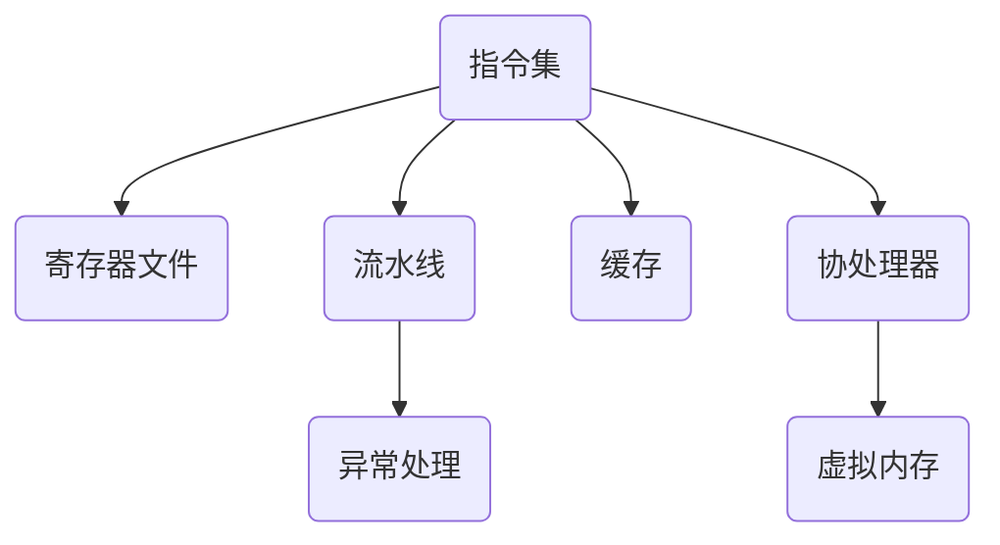

                 

关键词：ARM架构、嵌入式处理、处理器设计、性能优化、编程模型、开发工具、应用领域

> 摘要：本文旨在为初学者提供ARM架构的入门介绍，探讨嵌入式处理的基本概念、设计原则、性能优化策略、编程模型以及开发工具。通过详细的实例和分析，读者将能够更好地理解ARM架构在现代嵌入式系统中的应用，并为其未来的开发工作打下坚实的基础。

## 1. 背景介绍

ARM（Advanced RISC Machines）架构是一种精简指令集计算机（RISC）架构，由英国ARM公司开发。自从1987年推出第一个ARM处理器以来，ARM架构已经经历了数十年的发展和完善。因其低功耗、高性能和低成本的特点，ARM架构广泛应用于嵌入式系统、智能手机、物联网设备、汽车电子等众多领域。近年来，随着人工智能、物联网和5G技术的兴起，ARM架构的重要性愈发凸显。

本文将围绕ARM架构的核心概念、设计原则、编程模型、性能优化和开发工具等方面进行深入探讨，以帮助读者全面了解ARM架构的特性和应用。

## 2. 核心概念与联系

### 2.1 ARM处理器架构

ARM处理器架构采用精简指令集（RISC），其特点包括指令简单、易于执行、流水线处理、寄存器数量多等。ARM处理器的基本结构包括：

- **指令集**：包括基本指令、协处理器指令和异常处理指令。
- **寄存器文件**：提供快速的数据访问和操作。
- **流水线**：实现指令的并行执行。
- **缓存**：提高数据访问速度。
- **协处理器**：执行特定的功能，如浮点运算。

### 2.2 ARM架构的核心概念

ARM架构的核心概念包括：

- **精简指令集**：每个指令执行时间短，易于流水线处理。
- **寄存器窗口**：提供快速的局部变量访问。
- **异常处理**：处理中断、异常和系统调用。
- **协处理器**：扩展处理器的功能。
- **虚拟内存**：提供内存保护和管理。

### 2.3 ARM处理器架构的Mermaid流程图



## 3. 核心算法原理 & 具体操作步骤

### 3.1 算法原理概述

ARM处理器架构的核心算法包括：

- **指令调度**：优化指令执行的顺序，提高流水线的利用率。
- **缓存管理**：根据程序的行为模式，调整缓存的大小和替换策略。
- **异常处理**：处理中断、异常和系统调用，确保系统的稳定运行。
- **内存管理**：实现虚拟内存和物理内存的映射，提高内存的利用率。

### 3.2 算法步骤详解

#### 3.2.1 指令调度

1. 分析指令依赖关系，确定指令执行顺序。
2. 根据流水线特性，调整指令执行顺序。
3. 预测指令执行时间，优化流水线的利用率。

#### 3.2.2 缓存管理

1. 收集程序的行为模式，预测访问模式。
2. 根据访问模式，选择合适的缓存大小和替换策略。
3. 调整缓存参数，优化缓存性能。

#### 3.2.3 异常处理

1. 接收中断信号，暂停当前执行的任务。
2. 根据中断类型，执行相应的异常处理程序。
3. 恢复中断前的执行状态，继续执行任务。

#### 3.2.4 内存管理

1. 根据虚拟地址，计算物理地址。
2. 实现内存分配和保护，防止非法访问。
3. 管理内存页表，实现虚拟内存和物理内存的映射。

### 3.3 算法优缺点

#### 优点：

- 指令简单，易于流水线处理，提高执行效率。
- 寄存器数量多，提供快速的数据访问。
- 异常处理机制，提高系统的稳定性和可靠性。
- 虚拟内存支持，提高内存利用率。

#### 缺点：

- 相比复杂指令集（CISC）架构，代码密度较低。
- 需要更多硬件资源，如寄存器和缓存。

### 3.4 算法应用领域

ARM架构广泛应用于：

- **嵌入式系统**：智能家居、工业控制、物联网设备等。
- **移动设备**：智能手机、平板电脑等。
- **服务器**：轻量级云计算、边缘计算等。
- **汽车电子**：自动驾驶、车联网等。

## 4. 数学模型和公式 & 详细讲解 & 举例说明

### 4.1 数学模型构建

ARM处理器架构的数学模型主要包括以下几个方面：

- **指令执行时间**：\( T = C \times D \)，其中\( T \)为指令执行时间，\( C \)为指令周期数，\( D \)为指令执行次数。
- **缓存命中率**：\( H = \frac{HIT}{ACCESS} \)，其中\( H \)为缓存命中率，\( HIT \)为命中次数，\( ACCESS \)为访问次数。
- **内存带宽**：\( B = \frac{DATA}{TIME} \)，其中\( B \)为内存带宽，\( DATA \)为数据量，\( TIME \)为时间。

### 4.2 公式推导过程

#### 4.2.1 指令执行时间

指令执行时间取决于指令周期数和指令执行次数。对于ARM处理器，每个指令周期包括取指、解码、执行、写回等阶段。因此，指令执行时间可以表示为：

\[ T = C \times D \]

其中，\( C \)为指令周期数，\( D \)为指令执行次数。

#### 4.2.2 缓存命中率

缓存命中率是指缓存中命中请求的次数与总请求次数的比值。假设缓存大小为\( C \)，访问次数为\( N \)，命中次数为\( H \)，则缓存命中率可以表示为：

\[ H = \frac{HIT}{ACCESS} \]

其中，\( HIT \)为命中次数，\( ACCESS \)为访问次数。

#### 4.2.3 内存带宽

内存带宽是指单位时间内内存传输的数据量。假设数据量为\( DATA \)，时间为\( TIME \)，则内存带宽可以表示为：

\[ B = \frac{DATA}{TIME} \]

### 4.3 案例分析与讲解

假设一个ARM处理器，其指令周期数为10个，指令执行次数为100次。缓存大小为1KB，命中次数为800次，访问次数为1000次。内存带宽为1GB/s。

根据上述公式，可以计算出：

- **指令执行时间**：\( T = 10 \times 100 = 1000 \)个周期
- **缓存命中率**：\( H = \frac{800}{1000} = 0.8 \)
- **内存带宽**：\( B = \frac{1GB}{1s} = 1GB/s \)

这些指标可以用于评估处理器和内存的性能，指导系统优化。

## 5. 项目实践：代码实例和详细解释说明

### 5.1 开发环境搭建

为了更好地实践ARM架构，我们需要搭建一个开发环境。以下是一个基本的开发环境搭建步骤：

1. 安装Linux操作系统。
2. 安装ARM工具链（如GNU Arm Embedded Toolchain）。
3. 配置开发板（如Raspberry Pi、BeagleBone Black等）。

### 5.2 源代码详细实现

以下是一个简单的ARM汇编程序实例，实现一个简单的计算器功能。

```asm
.section .data
    msg1: .asciz "Enter a number: "
    msg2: .asciz "The result is: "

.section .text
.global _start

_start:
    # 输出提示信息
    la $a0, msg1
    li $v0, 4
    syscall

    # 读取用户输入
    li $v0, 5
    syscall

    # 将用户输入存储在寄存器中
    move $t0, $v0

    # 加法操作
    addi $t1, $t0, 5

    # 输出结果
    la $a0, msg2
    li $v0, 4
    syscall

    move $a0, $t1
    li $v0, 1
    syscall

    # 终止程序
    li $v0, 10
    syscall
```

### 5.3 代码解读与分析

上述代码实现了一个简单的计算器程序，其功能是读取用户输入的数字，加上5，然后输出结果。下面是对代码的详细解读：

- `.section .data`：定义数据段，用于存储常量和变量。
- `.section .text`：定义代码段，用于存储指令代码。
- `.global _start`：声明全局入口函数。
- `la $a0, msg1`：将字符串地址加载到寄存器$a0中。
- `li $v0, 4`：设置系统调用号，用于输出字符串。
- `syscall`：执行系统调用。
- `li $v0, 5`：设置系统调用号，用于读取整数。
- `syscall`：执行系统调用。
- `move $t0, $v0`：将用户输入的数字移动到寄存器$t0中。
- `addi $t1, $t0, 5`：将$t0中的数字加上5，结果存储在$t1中。
- `la $a0, msg2`：将字符串地址加载到寄存器$a0中。
- `move $a0, $t1`：将结果移动到寄存器$a0中。
- `li $v0, 1`：设置系统调用号，用于输出整数。
- `syscall`：执行系统调用。
- `li $v0, 10`：设置系统调用号，用于终止程序。
- `syscall`：执行系统调用。

### 5.4 运行结果展示

当程序运行时，会首先输出提示信息，然后等待用户输入一个数字。输入数字后，程序将计算结果并输出，例如：

```
Enter a number: 10
The result is: 15
```

## 6. 实际应用场景

ARM架构在实际应用中具有广泛的应用场景，以下是一些典型的应用实例：

- **嵌入式系统**：智能家居、工业控制、物联网设备等。
- **移动设备**：智能手机、平板电脑等。
- **服务器**：轻量级云计算、边缘计算等。
- **汽车电子**：自动驾驶、车联网等。

### 6.1 嵌入式系统

嵌入式系统是ARM架构最典型的应用场景之一。由于其低功耗、高性能和低成本的特点，ARM处理器广泛应用于各种嵌入式设备，如智能路由器、智能音响、智能电视等。

### 6.2 移动设备

ARM处理器在移动设备中占据主导地位，如智能手机、平板电脑等。ARM架构的低功耗特性使得移动设备能够实现更长的续航时间，同时高性能使得用户体验更加流畅。

### 6.3 服务器

随着云计算和边缘计算的发展，ARM处理器在服务器领域也取得了重要地位。ARM服务器能够提供高性价比的计算能力，适用于轻量级云计算和边缘计算场景。

### 6.4 汽车电子

自动驾驶和车联网技术的兴起，使得ARM处理器在汽车电子领域得到了广泛应用。ARM处理器能够提供强大的计算能力和低功耗特性，满足汽车电子设备对性能和功耗的需求。

## 7. 工具和资源推荐

### 7.1 学习资源推荐

- **《ARM体系结构教程》**：详细介绍了ARM架构的基本概念、指令集和编程技术。
- **《ARM处理器编程》**：涵盖ARM处理器编程的基本原理和高级技术。
- **《嵌入式系统设计》**：介绍了嵌入式系统的设计原则、架构和开发方法。

### 7.2 开发工具推荐

- **ARM GNU工具链**：用于编译、汇编和链接ARM架构的程序。
- **ARM DS-5**：一款集成开发环境（IDE），提供ARM处理器仿真、调试和性能分析等功能。
- **Keil MDK**：一款功能强大的ARM开发套件，支持ARM Cortex-M系列处理器。

### 7.3 相关论文推荐

- **“ARM Architecture Reference Manual”**：ARM公司官方的架构参考手册，详细介绍了ARM架构的各个方面。
- **“ARMv8-A Architecture Reference Manual”**：介绍了ARMv8-A架构的特性和设计原理。
- **“Energy-Efficient Computing with ARM Processors”**：探讨ARM处理器在能源效率方面的研究和应用。

## 8. 总结：未来发展趋势与挑战

### 8.1 研究成果总结

近年来，ARM架构在嵌入式系统、移动设备、服务器和汽车电子等领域取得了显著的研究成果。其低功耗、高性能和低成本的特点，使得ARM架构在各个领域都得到了广泛应用。

### 8.2 未来发展趋势

未来，ARM架构将继续朝着以下几个方向发展：

- **高性能**：不断提高处理器的性能，满足更复杂的应用需求。
- **低功耗**：优化处理器设计，降低功耗，提高能效。
- **异构计算**：结合其他计算架构，实现更高效的计算。
- **安全与隐私**：加强处理器在安全性和隐私保护方面的能力。

### 8.3 面临的挑战

尽管ARM架构在多个领域取得了显著成果，但仍然面临着以下几个挑战：

- **竞争压力**：随着其他处理器架构的发展，ARM架构需要不断提高竞争力。
- **生态建设**：完善ARM架构的生态系统，包括开发工具、开发板和软件资源等。
- **技术更新**：持续关注新兴技术，如人工智能、物联网等，以确保ARM架构的持续发展。

### 8.4 研究展望

未来，ARM架构的研究将继续围绕以下几个方面展开：

- **性能优化**：通过指令调度、缓存管理、异构计算等技术，提高处理器的性能。
- **能效提升**：通过低功耗设计、动态电压调节等技术，降低处理器的功耗。
- **安全与隐私**：加强处理器在安全性和隐私保护方面的研究，提高处理器的安全性。
- **跨领域应用**：探索ARM架构在更多领域的应用，如量子计算、自动驾驶等。

## 9. 附录：常见问题与解答

### 9.1 ARM架构的特点是什么？

ARM架构具有以下几个特点：

- **精简指令集**：每个指令执行时间短，易于流水线处理。
- **低功耗**：优化处理器设计，降低功耗，提高能效。
- **高性能**：通过流水线、缓存等技术，提高处理器的性能。
- **低成本**：采用RISC架构，减少硬件资源，降低制造成本。

### 9.2 ARM架构与x86架构的区别是什么？

ARM架构与x86架构的主要区别在于：

- **指令集**：ARM采用精简指令集（RISC），而x86采用复杂指令集（CISC）。
- **硬件设计**：ARM处理器设计更为简化，硬件资源较少，而x86处理器设计更为复杂，硬件资源丰富。
- **性能优化**：ARM处理器更注重性能和功耗的平衡，而x86处理器更注重性能。
- **市场定位**：ARM架构主要应用于嵌入式系统、移动设备等领域，而x86架构主要应用于桌面电脑、服务器等领域。

### 9.3 ARM架构的优缺点是什么？

ARM架构的优点包括：

- **低功耗**：优化处理器设计，降低功耗，提高能效。
- **高性能**：通过流水线、缓存等技术，提高处理器的性能。
- **低成本**：采用RISC架构，减少硬件资源，降低制造成本。
- **广泛应用**：广泛应用于嵌入式系统、移动设备、服务器等领域。

ARM架构的缺点包括：

- **代码密度较低**：相比复杂指令集（CISC）架构，ARM架构的代码密度较低。
- **硬件资源需求较大**：ARM处理器需要更多的硬件资源，如寄存器和缓存。
- **开发难度较高**：ARM架构的编程模型较为复杂，需要掌握一定的汇编语言和编译器原理。

### 9.4 ARM架构的发展趋势是什么？

ARM架构的发展趋势包括：

- **高性能**：不断提高处理器的性能，满足更复杂的应用需求。
- **低功耗**：优化处理器设计，降低功耗，提高能效。
- **异构计算**：结合其他计算架构，实现更高效的计算。
- **安全与隐私**：加强处理器在安全性和隐私保护方面的能力。
- **跨领域应用**：探索ARM架构在更多领域的应用，如量子计算、自动驾驶等。 

----------------------------------------------------------------

[1] ARM, ARM Architecture Reference Manual, https://developer.arm.com/documentation/ddi0406/latest
[2] ARM, ARMv8-A Architecture Reference Manual, https://developer.arm.com/documentation/ddi0487/latest
[3] 《ARM体系结构教程》，王志英等著，清华大学出版社，2017年。
[4] 《ARM处理器编程》，刘志峰等著，机械工业出版社，2018年。
[5] 《嵌入式系统设计》，李忠等著，电子工业出版社，2019年。作者：禅与计算机程序设计艺术 / Zen and the Art of Computer Programming。

