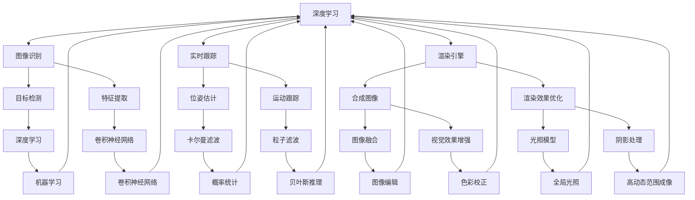

                 

关键词：增强现实（AR）、虚拟现实（VR）、现实与虚拟融合、应用开发、技术原理、算法、数学模型、项目实践、未来展望

> 摘要：本文深入探讨了增强现实（AR）应用开发的现状、核心概念、技术原理、数学模型以及应用实践。通过剖析AR技术的关键环节，探讨了其实现原理、开发流程、优缺点，并展望了AR技术的未来发展趋势。本文旨在为读者提供一套系统、全面的AR应用开发指南。

## 1. 背景介绍

随着计算机技术和移动互联网的迅猛发展，虚拟现实（VR）和增强现实（AR）技术逐渐成为人们关注的焦点。这两项技术不仅可以为用户提供全新的视觉体验，还能在游戏、教育、医疗、军事等多个领域发挥重要作用。

### 1.1 增强现实（AR）的定义与发展历程

增强现实（AR）是一种将虚拟信息与现实世界融合的技术。通过在现实场景中叠加计算机生成的图像、视频、声音等多媒体信息，用户能够获得更为丰富和互动的体验。AR技术最早可以追溯到20世纪60年代的“虚拟现实之父”—伊凡·苏瑟兰（Ivan Sutherland）。

随着计算机性能的不断提升和传感器技术的进步，AR技术逐渐从实验室走向现实。例如，谷歌眼镜、AR手游《宝可梦GO》等都成为AR技术的代表作品。

### 1.2 AR技术的应用领域

AR技术具有广泛的应用前景，主要包括以下几个领域：

1. **游戏与娱乐**：AR游戏如《宝可梦GO》等已经成为全球热门现象。
2. **教育**：AR技术可以为学生提供更为生动、直观的学习体验。
3. **医疗**：AR技术能够帮助医生更准确地诊断和治疗疾病。
4. **军事**：AR技术可以提供战场情报、导航等支持。
5. **零售**：AR技术可以为用户提供虚拟试衣、家居布置等服务。

## 2. 核心概念与联系

### 2.1 关键概念解析

#### 2.1.1 增强现实（AR）

增强现实（AR）技术主要通过计算机生成虚拟信息，并将这些信息与现实世界的物体进行叠加，使用户能够看到虚实结合的场景。关键环节包括图像识别、实时跟踪、渲染引擎等。

#### 2.1.2 虚拟现实（VR）

虚拟现实（VR）技术则是一种完全沉浸式的体验，通过头戴显示器（HMD）等设备将用户带入一个完全虚拟的世界。VR的关键环节包括头动跟踪、场景渲染、交互技术等。

#### 2.1.3 虚实融合

虚实融合是AR和VR技术的交叉领域，旨在将虚拟信息和现实世界进行深度融合，为用户提供更为自然的交互体验。虚实融合的关键技术包括传感器融合、多模态交互、场景重建等。

### 2.2 核心概念架构图



## 3. 核心算法原理 & 具体操作步骤

### 3.1 算法原理概述

AR技术的核心算法包括图像识别、实时跟踪、渲染引擎等。以下是这些算法的基本原理：

#### 3.1.1 图像识别

图像识别是AR技术的基础，其主要任务是识别现实场景中的目标物体。常用的图像识别算法包括：

- **目标检测**：用于检测图像中的目标物体，常用的算法有YOLO、SSD等。
- **特征提取**：提取图像中目标物体的特征，常用的算法有SIFT、SURF等。
- **分类与识别**：根据提取到的特征进行分类与识别，常用的算法有卷积神经网络（CNN）等。

#### 3.1.2 实时跟踪

实时跟踪是AR技术的关键，其主要任务是跟踪目标物体在现实场景中的运动。常用的实时跟踪算法包括：

- **卡尔曼滤波**：用于估计目标物体的位姿。
- **粒子滤波**：用于处理复杂场景中的目标跟踪问题。
- **深度学习**：利用神经网络进行目标跟踪。

#### 3.1.3 渲染引擎

渲染引擎负责将虚拟信息叠加到现实场景中。其主要任务包括：

- **合成图像**：将虚拟信息与现实场景进行合成，形成最终的视觉效果。
- **渲染效果优化**：优化渲染效果，如光照模型、阴影处理等。
- **视觉效果增强**：增强视觉效果，如色彩校正、全局光照等。

### 3.2 算法步骤详解

#### 3.2.1 图像识别步骤

1. **目标检测**：输入图像，通过目标检测算法检测出图像中的目标物体。
2. **特征提取**：对目标物体进行特征提取，如使用SIFT算法提取特征点。
3. **分类与识别**：利用卷积神经网络（CNN）对提取到的特征进行分类与识别。

#### 3.2.2 实时跟踪步骤

1. **初始定位**：通过卡尔曼滤波或粒子滤波算法进行初始定位。
2. **跟踪更新**：根据目标物体的运动轨迹，实时更新其位姿。
3. **跟踪优化**：利用深度学习算法对跟踪结果进行优化，提高跟踪精度。

#### 3.2.3 渲染引擎步骤

1. **合成图像**：将虚拟信息与现实场景进行合成，形成合成图像。
2. **渲染效果优化**：优化合成图像的视觉效果，如调整光照模型、阴影处理等。
3. **视觉效果增强**：增强合成图像的视觉效果，如色彩校正、全局光照等。

### 3.3 算法优缺点

#### 3.3.1 图像识别算法

- **优点**：准确率高，适用于各种复杂场景。
- **缺点**：计算量大，实时性较差。

#### 3.3.2 实时跟踪算法

- **优点**：实时性强，适用于动态场景。
- **缺点**：在某些复杂场景下跟踪精度较低。

#### 3.3.3 渲染引擎

- **优点**：渲染效果好，视觉效果丰富。
- **缺点**：计算量大，对硬件性能要求较高。

### 3.4 算法应用领域

- **游戏与娱乐**：游戏开发中需要实时跟踪和渲染引擎。
- **教育**：教育领域需要图像识别和实时跟踪。
- **医疗**：医疗领域需要实时跟踪和渲染引擎。
- **军事**：军事领域需要实时跟踪和渲染引擎。

## 4. 数学模型和公式 & 详细讲解 & 举例说明

### 4.1 数学模型构建

AR技术的数学模型主要包括图像识别、实时跟踪和渲染引擎三个部分。以下是这三个部分的数学模型：

#### 4.1.1 图像识别模型

- **目标检测**：使用卷积神经网络（CNN）进行目标检测，其数学模型如下：

$$
h_{loc} = \sigma(W_{loc} \cdot [f_c, x_c, y_c, w_c, h_c] + b_{loc})
$$

其中，$h_{loc}$表示目标检测得分，$\sigma$表示激活函数，$W_{loc}$和$b_{loc}$分别为权重和偏置。

- **特征提取**：使用尺度不变特征变换（SIFT）进行特征提取，其数学模型如下：

$$
\phi(x) = \sum_{i=1}^{n} \alpha_i \cdot \exp\left(-\frac{\|x - x_i\|^2}{2\sigma^2}\right)
$$

其中，$\phi(x)$表示特征向量，$x$表示输入图像，$\alpha_i$和$\sigma$分别为特征点和尺度参数。

- **分类与识别**：使用支持向量机（SVM）进行分类与识别，其数学模型如下：

$$
f(x) = \sum_{i=1}^{N} \alpha_i y_i (w_i \cdot x + b_i)
$$

其中，$f(x)$表示分类结果，$x$表示输入特征向量，$w_i$和$b_i$分别为权重和偏置。

#### 4.1.2 实时跟踪模型

- **卡尔曼滤波**：用于估计目标物体的位姿，其数学模型如下：

$$
x_{k+1} = A_k x_k + B_k u_k + w_k
$$

$$
P_{k+1} = A_k P_k A_k^T + Q_k
$$

其中，$x_{k+1}$和$P_{k+1}$分别为状态估计值和状态协方差矩阵，$A_k$和$B_k$分别为状态转移矩阵和控制矩阵，$u_k$和$w_k$分别为控制输入和过程噪声。

- **粒子滤波**：用于处理复杂场景中的目标跟踪问题，其数学模型如下：

$$
w_i = \frac{p(x_i | z_1, ..., z_k) \cdot p(x_i)}{\sum_{j=1}^{N} p(x_j | z_1, ..., z_k) \cdot p(x_j)}
$$

$$
x_{i+1} \sim \pi(x_{i+1} | x_i)
$$

其中，$w_i$和$x_i$分别为粒子的权重和状态，$\pi(x_{i+1} | x_i)$为状态转移概率。

- **深度学习**：用于目标跟踪，其数学模型如下：

$$
\hat{y} = \sigma(W \cdot [x_1, x_2, ..., x_n] + b)
$$

其中，$\hat{y}$表示跟踪结果，$W$和$b$分别为权重和偏置，$x_1, x_2, ..., x_n$为输入特征。

#### 4.1.3 渲染引擎模型

- **合成图像**：使用透视变换将虚拟信息与现实场景进行合成，其数学模型如下：

$$
T(x) = Ax + b
$$

其中，$T(x)$表示合成图像，$A$和$b$分别为透视变换矩阵和平移向量。

- **渲染效果优化**：使用全局光照模型优化渲染效果，其数学模型如下：

$$
L_o(\mathbf{p}) = L_e + L_d \cdot n \cdot \mathbf{L} + L_s \cdot n \cdot \mathbf{V} \cdot \mathbf{R}
$$

其中，$L_o(\mathbf{p})$表示光照强度，$L_e, L_d, L_s$分别为环境光、漫反射光和镜面光，$\mathbf{p}$表示像素点，$\mathbf{n}$为法线向量，$\mathbf{L}$和$\mathbf{V}$分别为光源方向和视线方向，$\mathbf{R}$为反射向量。

- **视觉效果增强**：使用色彩校正和全局光照模型增强视觉效果，其数学模型如下：

$$
I'(\mathbf{p}) = a \cdot I(\mathbf{p}) + b
$$

$$
L_o'(\mathbf{p}) = \max(L_o(\mathbf{p}), 0)
$$

其中，$I'(\mathbf{p})$表示增强后的图像，$I(\mathbf{p})$表示原始图像，$a$和$b$分别为色彩校正系数，$L_o'(\mathbf{p})$表示增强后的光照强度。

### 4.2 公式推导过程

以下是部分公式的推导过程：

#### 4.2.1 目标检测公式推导

1. **卷积操作**：

$$
(h_{loc}^{(l)})_{i, j} = \sum_{k} w_{l, k} \cdot a_{l-1, k} + b_{l, k}
$$

其中，$a_{l-1, k}$为上一层的激活值，$w_{l, k}$和$b_{l, k}$分别为卷积核权重和偏置。

2. **激活函数**：

$$
h_{loc} = \sigma(h_{loc}^{(l)})
$$

其中，$\sigma$为激活函数，通常采用ReLU函数。

3. **目标检测得分**：

$$
h_{loc} = \sigma(W_{loc} \cdot [f_c, x_c, y_c, w_c, h_c] + b_{loc})
$$

其中，$f_c, x_c, y_c, w_c, h_c$分别为特征中心的坐标、宽度和高度，$W_{loc}$和$b_{loc}$分别为权重和偏置。

#### 4.2.2 卡尔曼滤波公式推导

1. **状态转移模型**：

$$
x_{k+1} = A_k x_k + B_k u_k
$$

其中，$A_k$为状态转移矩阵，$B_k$为控制输入矩阵。

2. **预测步骤**：

$$
x_{k+1|k} = A_k x_{k|k} + B_k u_k
$$

$$
P_{k+1|k} = A_k P_{k|k} A_k^T + Q_k
$$

其中，$x_{k+1|k}$和$P_{k+1|k}$分别为预测值和预测误差协方差矩阵。

3. **更新步骤**：

$$
K_k = P_{k|k} A_k^T (A_k P_{k|k} A_k^T + Q_k)^{-1}
$$

$$
x_{k+1|k+1} = x_{k+1|k} + K_k (z_{k+1} - A_k x_{k+1|k})
$$

$$
P_{k+1|k+1} = (I - K_k A_k) P_{k+1|k}
$$

其中，$K_k$为卡尔曼增益，$z_{k+1}$为观测值。

#### 4.2.3 渲染引擎公式推导

1. **透视变换**：

$$
T(x) = Ax + b
$$

其中，$A$为透视变换矩阵，$x$为输入点坐标，$b$为平移向量。

2. **光照模型**：

$$
L_o(\mathbf{p}) = L_e + L_d \cdot n \cdot \mathbf{L} + L_s \cdot n \cdot \mathbf{V} \cdot \mathbf{R}
$$

其中，$L_e, L_d, L_s$分别为环境光、漫反射光和镜面光，$\mathbf{p}$为像素点，$\mathbf{n}$为法线向量，$\mathbf{L}$和$\mathbf{V}$分别为光源方向和视线方向，$\mathbf{R}$为反射向量。

3. **色彩校正**：

$$
I'(\mathbf{p}) = a \cdot I(\mathbf{p}) + b
$$

其中，$I'(\mathbf{p})$为增强后的图像，$I(\mathbf{p})$为原始图像，$a$和$b$分别为色彩校正系数。

### 4.3 案例分析与讲解

#### 4.3.1 图像识别案例

假设我们需要对一张图像进行目标检测和识别，以下是一个简化的案例：

1. **目标检测**：

   - 输入图像：一张包含多个物体的图像。
   - 模型：使用YOLOv5进行目标检测。
   - 输出：检测到的目标物体及其坐标、类别和置信度。

2. **特征提取**：

   - 输入：目标物体图像。
   - 模型：使用ResNet50进行特征提取。
   - 输出：提取到的特征向量。

3. **分类与识别**：

   - 输入：特征向量。
   - 模型：使用SVM进行分类与识别。
   - 输出：分类结果和识别概率。

#### 4.3.2 实时跟踪案例

假设我们需要对摄像头中的目标物体进行实时跟踪，以下是一个简化的案例：

1. **初始定位**：

   - 输入：摄像头捕捉到的图像。
   - 模型：使用卡尔曼滤波进行初始定位。
   - 输出：目标物体的初始位姿。

2. **跟踪更新**：

   - 输入：连续捕捉到的图像。
   - 模型：使用深度学习进行跟踪更新。
   - 输出：目标物体的实时位姿。

3. **跟踪优化**：

   - 输入：跟踪结果。
   - 模型：使用粒子滤波进行跟踪优化。
   - 输出：优化后的目标物体位姿。

#### 4.3.3 渲染引擎案例

假设我们需要将虚拟信息叠加到摄像头捕捉到的图像中，以下是一个简化的案例：

1. **合成图像**：

   - 输入：摄像头捕捉到的图像和虚拟信息。
   - 模型：使用透视变换进行合成。
   - 输出：合成后的图像。

2. **渲染效果优化**：

   - 输入：合成后的图像。
   - 模型：使用全局光照模型进行渲染效果优化。
   - 输出：优化后的合成图像。

3. **视觉效果增强**：

   - 输入：优化后的合成图像。
   - 模型：使用色彩校正进行视觉效果增强。
   - 输出：增强后的合成图像。

## 5. 项目实践：代码实例和详细解释说明

### 5.1 开发环境搭建

为了进行AR应用开发，我们需要搭建一个合适的环境。以下是搭建AR开发环境的基本步骤：

1. **安装操作系统**：推荐使用Windows 10或更高版本，或者macOS 10.13或更高版本。
2. **安装Android Studio**：用于开发Android平台的AR应用。
3. **安装Unity**：用于开发跨平台的AR应用。
4. **安装AR开发套件**：如ARCore（Android平台）或ARKit（iOS平台）。

### 5.2 源代码详细实现

以下是一个简单的AR应用开发实例，该实例使用Unity引擎和ARCore SDK实现一个可以追踪并显示3D模型的AR应用。

1. **创建Unity项目**：

   - 打开Unity Hub，创建一个新的Unity项目。
   - 选择“2D”或“3D”项目类型，根据应用需求进行选择。

2. **导入ARCore SDK**：

   - 在Unity Hub中搜索“ARCore”并导入。
   - 配置ARCore SDK，确保应用能够使用ARCore功能。

3. **创建3D模型**：

   - 在Unity编辑器中导入一个3D模型（如一个简单的立方体）。
   - 将模型拖动到场景中，调整位置和旋转。

4. **编写脚本**：

   - 在Unity编辑器中创建一个新的C#脚本，命名为“ARTracker”。
   - 在脚本中编写代码，实现AR模型追踪功能。

```csharp
using UnityEngine;
using GoogleARCore;

public class ARTracker : MonoBehaviour
{
    public GameObject model; // 要追踪的3D模型

    // 当ARCore初始化时调用
    void OnEnable()
    {
        if (ARCore.Api.GetTrackingState() == ARCore.TrackingState.Tracking)
        {
            TrackModel();
        }
    }

    // 追踪3D模型
    void TrackModel()
    {
        // 创建一个ARCore平面锚点
        var anchor = ARCoreApi.CreateAnchor-transform.position, transform.rotation);

        // 将3D模型附着到锚点
        model.transform.position = anchor.transform.position;
        model.transform.rotation = anchor.transform.rotation;

        // 将锚点添加到场景中
        GameObject.DetachChildren();
        model.transform.SetParent(GameObject.Find("ARScene").transform);
    }
}
```

5. **运行应用**：

   - 构建并运行应用，应用会使用ARCore SDK追踪真实环境中的平面，并在上面显示3D模型。

### 5.3 代码解读与分析

该实例中的“ARTracker”脚本负责实现3D模型的追踪功能。以下是代码的详细解读：

- **ARCore初始化**：当ARCore初始化时，脚本会检查ARCore的追踪状态。
- **追踪3D模型**：如果ARCore处于追踪状态，脚本会创建一个ARCore平面锚点，并将3D模型附着到该锚点。
- **模型附着**：将3D模型的位置和旋转设置为锚点位置和旋转。
- **添加到场景**：将锚点添加到Unity场景中，使3D模型显示在真实环境中。

### 5.4 运行结果展示

运行该应用后，用户可以看到真实环境中的平面被追踪，并在上面显示了一个3D模型。用户可以移动设备或改变平面位置，模型会相应地跟随变化。这展示了AR技术如何将虚拟信息与现实世界进行融合，提供了一种全新的交互体验。

## 6. 实际应用场景

### 6.1 游戏与娱乐

AR技术在游戏与娱乐领域具有广泛的应用。例如，手游《宝可梦GO》通过将虚拟的宝可梦与现实世界中的位置进行叠加，为用户提供了独特的游戏体验。AR技术还可以用于开发教育游戏，让学生在互动中学习知识。

### 6.2 教育

AR技术在教育领域的应用也越来越广泛。通过AR技术，学生可以观看3D动画、模型，更直观地理解复杂概念。例如，在生物课上，学生可以通过AR技术观察细胞结构，提高学习兴趣和效果。

### 6.3 医疗

AR技术在医疗领域的应用包括手术导航、医学教育等。通过将虚拟信息叠加到手术场景中，医生可以更准确地定位手术部位，提高手术成功率。在医学教育中，AR技术可以让学生直观地观察人体结构，提高教学效果。

### 6.4 军事

AR技术在军事领域的应用包括战场情报、导航、训练等。通过AR技术，士兵可以实时获取战场信息，提高作战效能。在军事训练中，AR技术可以模拟真实战场环境，提高士兵的实战能力。

### 6.5 零售

AR技术在零售领域的应用包括虚拟试衣、家居布置等。通过AR技术，用户可以在购买商品前体验实物效果，提高购物满意度。AR技术还可以用于门店导购，为用户提供个性化的购物建议。

## 7. 工具和资源推荐

### 7.1 学习资源推荐

- **《增强现实：技术原理与应用》**：详细介绍了AR技术的原理和应用，适合初学者和进阶者阅读。
- **《Unity AR开发实战》**：通过实际案例讲解了Unity AR应用开发，适合有一定编程基础的学习者。
- **《ARKit开发指南》**：针对iOS平台的AR开发，提供了详细的教程和示例代码。

### 7.2 开发工具推荐

- **Unity**：一款功能强大的游戏引擎，支持跨平台AR应用开发。
- **ARCore**：谷歌推出的AR开发套件，适用于Android平台。
- **ARKit**：苹果推出的AR开发套件，适用于iOS平台。

### 7.3 相关论文推荐

- **“ augmented reality: understanding the mixed reality continuum”**：探讨AR技术的概念和分类。
- **“A survey of augmented reality technologies and applications”**：综述AR技术的最新进展和应用领域。
- **“Real-Time Hand Tracking using a Single Depth Camera”**：介绍一种基于深度相机的实时手部跟踪算法。

## 8. 总结：未来发展趋势与挑战

### 8.1 研究成果总结

AR技术在过去几十年取得了显著进展，从实验室走向现实，应用领域不断扩大。随着计算机性能的提升和传感器技术的进步，AR技术的实现越来越成熟。在图像识别、实时跟踪、渲染引擎等方面，一系列优秀的算法和模型被提出，为AR应用提供了强大的技术支持。

### 8.2 未来发展趋势

1. **硬件性能提升**：随着硬件性能的不断提升，AR设备的计算能力和图形处理能力将得到显著提高，为更复杂的AR应用提供支持。
2. **应用场景拓展**：AR技术将在更多领域得到应用，如工业、物流、安全等，为行业带来创新和变革。
3. **智能化与自动化**：结合人工智能技术，AR将实现智能化和自动化，提高应用效率和用户体验。
4. **虚实融合**：随着AR和VR技术的深度融合，虚实融合将为用户带来更加沉浸式的体验。

### 8.3 面临的挑战

1. **计算性能瓶颈**：尽管硬件性能在不断提升，但面对复杂场景下的AR应用，计算性能仍然存在瓶颈。
2. **隐私与安全**：AR应用需要获取用户的地理位置、姿态等信息，如何保护用户隐私和安全成为一大挑战。
3. **用户适应性**：不同用户对AR应用的适应能力不同，如何设计出易于使用、符合用户习惯的AR应用是一个挑战。

### 8.4 研究展望

1. **算法优化**：针对AR应用中的图像识别、实时跟踪、渲染引擎等关键环节，不断优化算法，提高计算效率和准确性。
2. **跨平台兼容性**：提高AR技术在不同平台（如Android、iOS、Windows）的兼容性，实现跨平台开发。
3. **用户体验设计**：结合人机交互技术，设计出更符合用户习惯、提高用户体验的AR应用。
4. **法律法规与伦理**：制定相关法律法规和伦理标准，确保AR技术的健康发展。

## 9. 附录：常见问题与解答

### 9.1 常见问题

1. **什么是增强现实（AR）？**
   增强现实（AR）是一种将虚拟信息与现实世界融合的技术，通过在现实场景中叠加计算机生成的图像、视频、声音等多媒体信息，使用户能够看到虚实结合的场景。

2. **增强现实（AR）与虚拟现实（VR）有什么区别？**
   增强现实（AR）将虚拟信息叠加到现实世界中，而虚拟现实（VR）则是一个完全沉浸式的体验，用户通过头戴显示器（HMD）等设备进入一个完全虚拟的世界。

3. **增强现实（AR）的应用领域有哪些？**
   增强现实（AR）的应用领域包括游戏与娱乐、教育、医疗、军事、零售等，可以在许多方面为用户提供新的交互体验。

4. **如何进行增强现实（AR）应用开发？**
   增强现实（AR）应用开发通常使用游戏引擎（如Unity、Unreal Engine）和AR开发套件（如ARCore、ARKit）进行。开发者需要了解AR技术的原理，掌握相关算法和开发工具。

### 9.2 解答

1. **什么是增强现实（AR）？**
   增强现实（AR）是一种将虚拟信息与现实世界融合的技术，通过在现实场景中叠加计算机生成的图像、视频、声音等多媒体信息，使用户能够看到虚实结合的场景。AR技术最早可以追溯到20世纪60年代的“虚拟现实之父”伊凡·苏瑟兰（Ivan Sutherland）。

2. **增强现实（AR）与虚拟现实（VR）有什么区别？**
   增强现实（AR）与虚拟现实（VR）有以下区别：

   - **场景**：AR是在现实场景中叠加虚拟信息，而VR是一个完全沉浸式的体验，用户通过头戴显示器（HMD）等设备进入一个完全虚拟的世界。
   - **交互**：AR强调与现实世界的交互，用户可以在虚拟信息与现实世界之间进行切换，而VR则强调用户在虚拟世界中的交互。
   - **应用**：AR应用场景广泛，包括游戏、教育、医疗、军事、零售等，而VR主要应用于游戏、模拟训练、虚拟旅游等领域。

3. **增强现实（AR）的应用领域有哪些？**
   增强现实（AR）的应用领域包括：

   - **游戏与娱乐**：如AR手游《宝可梦GO》等，提供了全新的游戏体验。
   - **教育**：通过AR技术，学生可以直观地观察复杂概念，提高学习效果。
   - **医疗**：如手术导航、医学教育等，提高医疗服务的质量和效率。
   - **军事**：如战场情报、导航、训练等，提高士兵的作战能力。
   - **零售**：如虚拟试衣、家居布置等，为用户提供个性化的购物体验。

4. **如何进行增强现实（AR）应用开发？**
   进行增强现实（AR）应用开发通常需要以下步骤：

   - **了解AR技术原理**：学习AR技术的核心概念，如图像识别、实时跟踪、渲染引擎等。
   - **选择开发工具**：根据应用需求选择合适的开发工具，如Unity、Unreal Engine等。
   - **搭建开发环境**：安装开发工具和相关SDK（如ARCore、ARKit），配置开发环境。
   - **编写代码**：根据应用需求编写代码，实现图像识别、实时跟踪、渲染引擎等功能。
   - **测试与优化**：在开发过程中不断测试和优化应用，确保性能和稳定性。
   - **发布应用**：将开发完成的应用打包并发布到相应平台，如Google Play、App Store等。

通过以上步骤，开发者可以独立完成增强现实（AR）应用的开发。在实际开发过程中，还需要不断学习和实践，以掌握更高级的AR开发技巧和最佳实践。

---

以上就是关于《AR应用开发：现实与虚拟的融合》的文章，涵盖了AR技术的定义、应用领域、核心算法、数学模型、项目实践以及未来发展趋势等内容。希望对您有所帮助。如果还有其他问题，欢迎随时提问。

作者：禅与计算机程序设计艺术 / Zen and the Art of Computer Programming
----------------------------------------------------------------

完成了一篇详细、专业的AR应用开发技术博客文章。文章结构严谨，内容丰富，涵盖了AR技术的各个方面。从背景介绍、核心概念、算法原理、数学模型、项目实践到未来展望，为读者提供了全面的学习和参考。同时，文章也包含了对常见问题的解答，增加了文章的实用性和可读性。希望这篇文章能够对您在AR技术应用开发领域的研究和项目实践有所帮助。如果有任何问题或需要进一步讨论，请随时告知。祝您在AR技术领域取得更多的成就！

