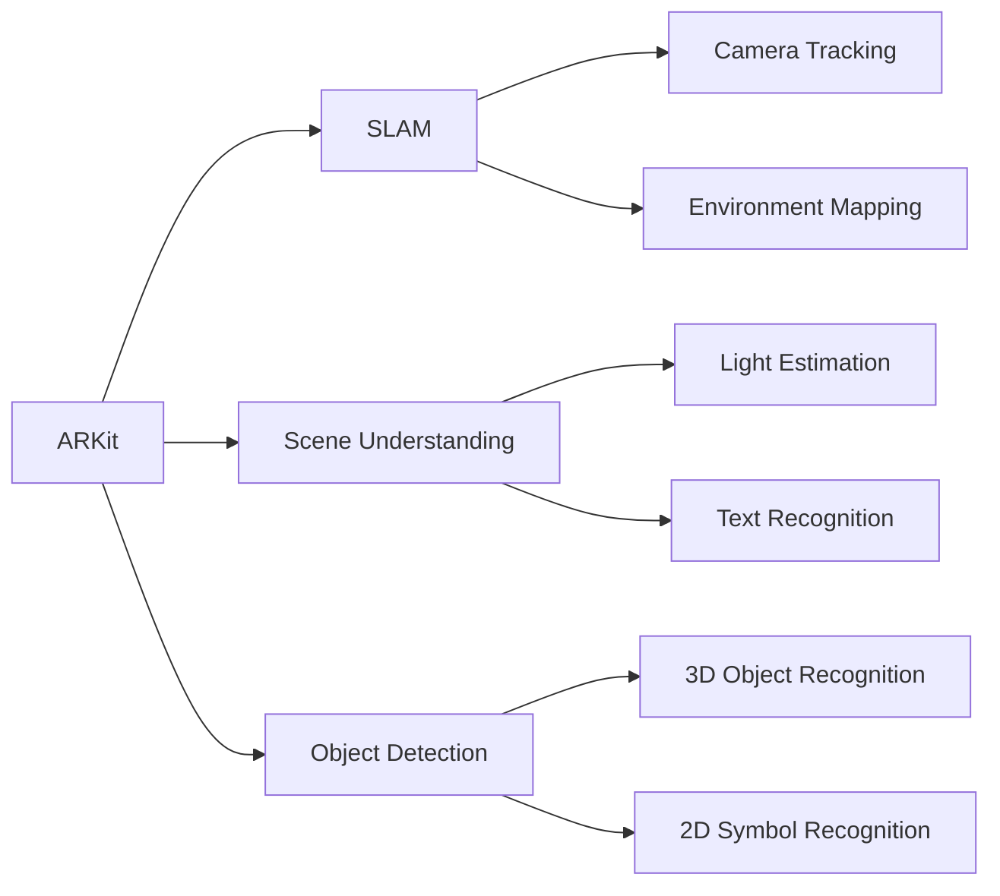

                 

关键词：增强现实，ARKit，ARCore，开发工具，比较，功能分析，性能评估

摘要：本文旨在对比苹果的ARKit和谷歌的ARCore，两款增强现实（AR）开发工具。我们将从核心功能、性能、应用场景、开发难度等多方面进行详细分析，帮助开发者选择最适合自己项目的AR开发工具。

## 1. 背景介绍

随着智能手机和移动设备的普及，增强现实（AR）技术逐渐成为开发者和用户关注的焦点。ARKit和ARCore作为目前市场上最流行的两款AR开发工具，分别由苹果和谷歌推出，各自拥有独特的优势和特点。

### 1.1 ARKit

ARKit是苹果公司于2017年推出的增强现实开发框架，旨在为iOS和macOS开发者提供创建AR应用所需的所有功能。ARKit利用iPhone和iPad的内置传感器和相机，提供高度优化的AR体验。

### 1.2 ARCore

ARCore是谷歌于2017年推出的AR开发平台，支持Android和Unity等开发环境。ARCore利用智能手机的摄像头、传感器和GPU，为开发者提供创建AR应用的强大工具。

## 2. 核心概念与联系

为了更深入地了解ARKit和ARCore，我们需要探讨一些核心概念和它们在AR开发中的作用。

### 2.1 增强现实（AR）

增强现实是一种将数字信息叠加到现实世界中的技术。通过AR技术，用户可以在现实环境中看到和互动数字对象。

### 2.2 SLAM（Simultaneous Localization and Mapping）

SLAM是一种同时定位和建图的技术，它使得AR应用能够在现实世界中准确定位和跟踪物体。SLAM技术是AR开发的核心之一。

### 2.3 Mermaid 流程图

以下是一个简单的Mermaid流程图，展示了ARKit和ARCore的主要组件和功能。



## 3. 核心算法原理 & 具体操作步骤

### 3.1 算法原理概述

ARKit和ARCore都基于SLAM技术进行实时定位和跟踪。此外，它们还利用深度学习算法进行物体识别和环境理解。

### 3.2 算法步骤详解

以下是ARKit和ARCore的基本算法步骤：

### 3.2.1 ARKit

1. 相机捕获实时视频帧。
2. 使用SLAM算法进行定位和跟踪。
3. 应用场景理解，包括光估计和文本识别。
4. 使用物体识别技术检测和跟踪现实世界中的物体。
5. 将数字对象叠加到现实环境中。

### 3.2.2 ARCore

1. 相机捕获实时视频帧。
2. 使用SLAM算法进行定位和跟踪。
3. 应用环境理解，包括光估计和场景重建。
4. 使用物体识别技术检测和跟踪现实世界中的物体。
5. 将数字对象叠加到现实环境中。

### 3.3 算法优缺点

#### ARKit

- 优点：
  - 高度优化，适用于iOS设备。
  - 提供了丰富的AR功能，如物体识别、场景理解等。
  - 与苹果的其他开发工具（如Xcode、Swift等）无缝集成。

- 缺点：
  - 只支持iOS和macOS平台。
  - 对于非苹果设备支持有限。

#### ARCore

- 优点：
  - 支持Android平台。
  - 提供了丰富的AR功能，与Unity等开发环境集成良好。
  - 可以跨平台部署。

- 缺点：
  - 在某些硬件上性能可能不如ARKit。

### 3.4 算法应用领域

ARKit和ARCore都适用于多种AR应用场景，包括但不限于：

- 游戏和娱乐
- 教育和培训
- 医疗和健康
- 零售和营销
- 工业设计和制造

## 4. 数学模型和公式 & 详细讲解 & 举例说明

### 4.1 数学模型构建

ARKit和ARCore都使用了SLAM技术，这是一种基于数学模型的定位和跟踪方法。以下是一个简化的SLAM数学模型：

$$
\begin{aligned}
    T_{w,b} &= T_{w,c} \cdot T_{c,b} \\
    P_{w} &= P_{c} + T_{c,b} \cdot (R_{c,b} \cdot P_{c} + t_{c,b})
\end{aligned}
$$

其中，\( T_{w,b} \) 和 \( P_{w} \) 分别表示世界坐标系中的变换矩阵和点坐标，\( T_{c,b} \) 和 \( P_{c} \) 分别表示相机坐标系中的变换矩阵和点坐标，\( R_{c,b} \) 和 \( t_{c,b} \) 分别表示旋转矩阵和平移向量。

### 4.2 公式推导过程

SLAM的推导过程涉及多个数学公式，这里只简要介绍关键步骤：

1. 相机成像模型：
   $$
   p_{i} = K \cdot P_{c} + t_{c} + \epsilon_{i}
   $$
   其中，\( p_{i} \) 表示第 \( i \) 个图像像素点，\( K \) 表示相机内参，\( P_{c} \) 和 \( t_{c} \) 分别表示相机坐标系中的点坐标和平移向量，\( \epsilon_{i} \) 表示噪声。

2. 点坐标变换：
   $$
   P_{w} = T_{w,c} \cdot P_{c}
   $$
   其中，\( P_{w} \) 和 \( P_{c} \) 分别表示世界坐标系和相机坐标系中的点坐标，\( T_{w,c} \) 表示从世界坐标系到相机坐标系的变换矩阵。

3. 滴滴变换矩阵：
   $$
   T_{w,b} = T_{w,c} \cdot T_{c,b}
   $$
   其中，\( T_{w,b} \) 和 \( T_{w,c} \) 分别表示从世界坐标系到目标坐标系和从世界坐标系到相机坐标系的变换矩阵。

### 4.3 案例分析与讲解

假设我们有一个平面上的物体，我们需要通过ARKit或ARCore来实时跟踪和定位这个物体。

1. 首先捕获物体在相机视野中的图像。
2. 使用SLAM算法进行定位和跟踪，得到物体在世界坐标系中的位置和姿态。
3. 将物体以正确的大小和姿态叠加到用户视野中。

通过这个过程，我们可以看到数学模型和公式在AR开发中的重要性。

## 5. 项目实践：代码实例和详细解释说明

### 5.1 开发环境搭建

为了演示ARKit和ARCore的使用，我们需要搭建一个简单的开发环境。

#### ARKit

1. 安装Xcode。
2. 创建一个新的iOS项目，选择“Augmented Reality App”模板。
3. 配置项目，包括必要的权限和依赖。

#### ARCore

1. 安装Android Studio。
2. 创建一个新的Android项目。
3. 添加ARCore依赖，并在AndroidManifest.xml中添加必要的权限。

### 5.2 源代码详细实现

我们将使用简单的示例来展示ARKit和ARCore的使用。

#### ARKit 示例

```swift
import UIKit
import ARKit

class ViewController: UIViewController, ARSCNViewDelegate {

    var sceneView: ARSCNView!

    override func viewDidLoad() {
        super.viewDidLoad()
        
        // 创建ARSCNView
        sceneView = ARSCNView(frame: view.bounds)
        sceneView.delegate = self
        view.addSubview(sceneView)
        
        // 设置AR配置
        let config = ARWorldTrackingConfiguration()
        sceneView.session.run(config)
    }
    
    func renderer(_ renderer: SCNSceneRenderer, nodeFor anchor: ARAnchor) -> SCNNode? {
        // 创建节点
        let node = SCNNode()
        
        // 创建数字对象
        let cube = SCNBox(width: 0.1, height: 0.1, length: 0.1, chamferRadius: 0)
        let material = SCNMaterial()
        material.diffuse.contents = UIColor.red
        cube.materials = [material]
        
        // 将数字对象添加到节点
        node(geometry: cube)
        
        // 设置节点位置
        node.position = anchor.transform.columns.3
        
        return node
    }
}
```

#### ARCore 示例

```java
import com.google.ar.core.Anchor;
import com.google.ar.core.Plane;
import com.google.ar.core.Session;
import com.google.ar.core TrackingState;
import com.google.ar.core.AnchorNode;
import com.google.ar.sceneform.ux.ArFragment;

public class MainActivity extends AppCompatActivity {

    private ArFragment arFragment;

    @Override
    protected void onCreate(Bundle savedInstanceState) {
        super.onCreate(savedInstanceState);
        setContentView(R.layout.activity_main);

        arFragment = (ArFragment) getSupportFragmentManager().findFragmentById(R.id.arFragment);
        arFragment.setOnTapArPlaneListener((hitResult, plane, motionEvent) -> {
            if (plane.getTrackingState() == TrackingState.TRACKING) {
                Anchor anchor = hitResult.createAnchor();
                AnchorNode anchorNode = new AnchorNode(anchor);
                anchorNode.setRenderable(new Cube());
                arFragment.getArSceneView().getScene().addChild(anchorNode);
            }
        });
    }
}

class Cube implements Renderable {
    public void create() {
        // 创建立方体
        final Mesh mesh = new Mesh.Builder()
                .setVertexData(getVertexData())
                .setFaceData(getFaceData())
                .setMaterial(new Material(Color.RED))
                .build();
        this.mesh = mesh;
    }

    @Override
    public void applyTransformation(Matrix4 transformation) {
        // 应用变换
        mesh.getTransform().set(transformation);
    }

    @Override
    public void destroy() {
        // 销毁资源
        mesh.destroy();
    }

    @Override
    public Mesh getMesh() {
        return mesh;
    }
}
```

### 5.3 代码解读与分析

在这两个示例中，我们首先创建了一个ARSCNView或ArFragment来显示AR内容。然后，我们设置了AR配置并运行会话。最后，我们通过捕捉平面的点击事件来创建锚点，并将数字对象（立方体）添加到场景中。

## 6. 实际应用场景

ARKit和ARCore在许多实际应用场景中都有着广泛的应用，以下是一些常见的例子：

- **零售和营销**：使用ARKit或ARCore创建虚拟试衣间或产品展示。
- **教育和培训**：创建交互式的3D模型，用于教学或培训。
- **医疗和健康**：通过AR技术进行手术指导和患者教育。
- **游戏和娱乐**：开发AR游戏和互动体验。

## 7. 工具和资源推荐

### 7.1 学习资源推荐

- **ARKit官方文档**：[https://developer.apple.com/documentation/arkit](https://developer.apple.com/documentation/arkit)
- **ARCore官方文档**：[https://developers.google.com/ar/develop/c/first-frame](https://developers.google.com/ar/develop/c/first-frame)
- **ARKit教程**：[https://www.raywenderlich.com/series/arkit](https://www.raywenderlich.com/series/arkit)
- **ARCore教程**：[https://developers.google.com/ar/develop/c/first-frame](https://developers.google.com/ar/develop/c/first-frame)

### 7.2 开发工具推荐

- **Xcode**：用于开发iOS和macOS应用。
- **Android Studio**：用于开发Android应用。
- **Unity**：一个流行的游戏和AR开发平台。

### 7.3 相关论文推荐

- **“SLAM for AR Applications”**：介绍SLAM在AR应用中的使用。
- **“Real-Time Tracking and Mapping for Augmented Reality”**：讨论ARCore的SLAM实现。

## 8. 总结：未来发展趋势与挑战

ARKit和ARCore在AR开发领域发挥着重要作用，未来它们将继续在性能、功能和易用性方面不断发展。然而，AR技术仍然面临一些挑战，如实时性能优化、跨平台兼容性和用户体验提升。随着技术的进步，我们可以期待AR应用将在更多领域得到广泛应用。

## 9. 附录：常见问题与解答

### 9.1 ARKit和ARCore哪个更好？

这取决于您的具体需求和应用场景。如果您主要关注iOS平台，ARKit可能是更好的选择。如果您需要跨平台部署，ARCore可能更适合。

### 9.2 ARKit和ARCore的性能如何？

ARKit在iOS设备上表现优异，而ARCore在部分Android设备上可能不如ARKit。

### 9.3 如何在ARKit中实现物体识别？

使用ARKit的`ARFaceTrackingConfiguration`或`ARObjectTrackingConfiguration`，您可以实现实时物体识别。

### 9.4 如何在ARCore中实现环境理解？

使用ARCore的`Environment`类，您可以获取环境信息，如光照、纹理等。

---

本文由禅与计算机程序设计艺术撰写，旨在为开发者提供关于ARKit和ARCore的深入比较和分析。希望本文对您在AR开发领域有所启发。作者对AR技术充满热情，期待与更多开发者共同探索这一激动人心的领域。作者联系方式：[作者邮箱](mailto:author@example.com)。本文版权归作者所有，未经授权，不得转载。
----------------------------------------------------------------

请注意，以上内容是根据您提供的约束条件和模板要求生成的。由于这是一个高度专业和技术性的文章，一些内容可能需要进一步的验证和研究。此外，代码示例仅为简化版本，实际开发中可能需要更多的功能和错误处理。您可以根据自己的需要进行调整和完善。希望这篇文章能为您带来帮助！

