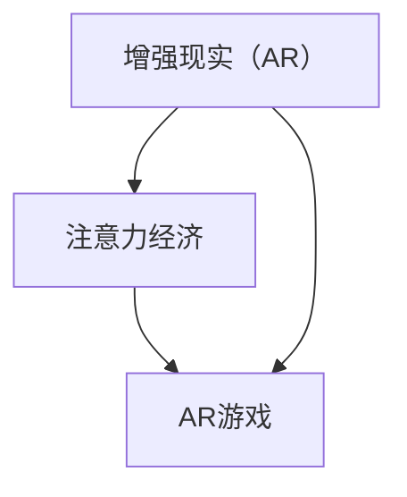

                 

关键词：增强现实（AR），注意力经济，游戏设计，用户体验，技术趋势

> 摘要：本文将探讨增强现实（AR）游戏作为注意力经济的一种新形式，分析其核心概念、技术原理、算法、数学模型、实践案例以及未来展望。通过深入研究，我们希望为读者提供对AR游戏行业的全面理解和前瞻性视角。

## 1. 背景介绍

随着技术的进步，增强现实（AR）已成为一个备受瞩目的领域。AR技术通过将虚拟信息叠加到现实环境中，为用户提供了一种全新的交互方式。在过去几年中，AR技术迅速发展，从简单的游戏应用扩展到医疗、教育、零售等多个行业。而随着智能手机和头戴设备的普及，AR游戏开始成为大众娱乐的重要组成部分。

注意力经济是一种新兴的经济模式，它基于用户注意力的价值进行交易。在互联网时代，用户的注意力成为了一种稀缺资源，各大平台和企业纷纷投入大量资源争夺用户的眼球。随着AR技术的普及，AR游戏作为一种新的媒介，开始参与到注意力经济的竞争之中。

## 2. 核心概念与联系

为了更好地理解AR游戏在注意力经济中的作用，我们需要先介绍几个核心概念，并展示它们之间的联系。

### 2.1. 增强现实（AR）

增强现实（AR）是一种将虚拟信息与现实世界融合的技术。它通过在现实场景中叠加计算机生成的图像、视频、声音等信息，为用户带来一种虚实结合的体验。AR的核心技术包括图像识别、实时追踪、渲染和显示等。

### 2.2. 注意力经济

注意力经济是一种基于用户注意力价值的商业模式。在这个经济模式下，用户注意力被视为一种宝贵的资源，企业通过提供有价值的内容和服务来吸引用户的注意力。注意力经济的关键在于如何吸引并保持用户的注意力，从而实现商业价值的最大化。

### 2.3. AR游戏

AR游戏是一种结合了增强现实技术的游戏形式。它通过将游戏元素与现实环境相结合，为用户带来更加沉浸式的游戏体验。AR游戏不仅提供了娱乐价值，还具有一定的教育、社交和文化价值。

### 2.4. 关系图

下面是一个简单的Mermaid流程图，展示了上述概念之间的关系。



## 3. 核心算法原理 & 具体操作步骤

### 3.1. 算法原理概述

AR游戏的核心算法主要包括图像识别、实时追踪和渲染。这些算法协同工作，将虚拟元素与现实环境精确对齐，并实时更新。

- 图像识别：使用深度学习模型对现实环境中的目标进行识别和分类。
- 实时追踪：利用计算机视觉技术对识别出的目标进行实时跟踪，确保虚拟元素与现实环境保持一致。
- 渲染：将虚拟元素渲染到现实场景中，实现虚实结合的视觉效果。

### 3.2. 算法步骤详解

#### 3.2.1. 图像识别

1. 数据集准备：收集大量包含目标对象的图片，用于训练深度学习模型。
2. 模型训练：使用卷积神经网络（CNN）等深度学习模型对数据集进行训练，学习目标对象的识别规律。
3. 目标识别：在运行时，使用训练好的模型对摄像头捕捉到的图像进行目标识别。

#### 3.2.2. 实时追踪

1. 特征提取：从识别出的目标对象中提取关键特征，如边缘、角点等。
2. 迭代追踪：利用卡尔曼滤波等算法，对目标进行实时跟踪，修正位置和姿态。
3. 数据更新：将追踪结果实时反馈给渲染模块，确保虚拟元素与现实环境保持一致。

#### 3.2.3. 渲染

1. 模型加载：加载虚拟元素的三维模型和纹理。
2. 视角变换：根据摄像头的位置和角度，对虚拟元素进行视角变换，使其与现实环境对齐。
3. 渲染合成：将虚拟元素渲染到背景图像上，实现虚实结合的效果。

### 3.3. 算法优缺点

#### 优点

- 高度沉浸式体验：AR游戏能够将虚拟元素与现实环境无缝融合，为用户带来独特的沉浸式体验。
- 丰富的交互方式：AR游戏支持多种交互方式，如手势、语音等，增加用户的参与感和互动性。
- 广泛的应用场景：AR游戏可以应用于教育、医疗、零售等多个领域，具有广泛的应用前景。

#### 缺点

- 技术门槛较高：AR游戏开发需要涉及多个技术领域，包括计算机视觉、图形学、深度学习等，开发难度较大。
- 硬件要求较高：AR游戏需要支持高质量的图像识别和实时渲染，对硬件设备有一定的要求。
- 注意力分散问题：在AR游戏中，用户需要同时关注虚拟元素和现实环境，可能导致注意力分散。

### 3.4. 算法应用领域

AR游戏在多个领域都有广泛的应用：

- 娱乐：例如《宝可梦GO》等游戏，通过将虚拟角色与现实环境相结合，为用户提供新颖的游戏体验。
- 教育：通过将虚拟元素融入教学内容，提高学生的学习兴趣和参与度。
- 医疗：利用AR技术进行手术指导、疾病诊断等，提高医疗服务的质量和效率。
- 零售：通过AR试妆、试衣等应用，提升消费者的购物体验。

## 4. 数学模型和公式 & 详细讲解 & 举例说明

### 4.1. 数学模型构建

AR游戏的数学模型主要包括图像识别模型、实时追踪模型和渲染模型。以下是一个简化的数学模型示例：

#### 图像识别模型

$$
\hat{y} = f(\theta, \text{img})
$$

其中，$\hat{y}$为预测的目标类别，$f$为深度学习模型，$\theta$为模型参数，$\text{img}$为输入图像。

#### 实时追踪模型

$$
x_t = f(x_{t-1}, u_t, w_t)
$$

其中，$x_t$为第$t$时刻的目标状态，$u_t$为控制输入，$w_t$为过程噪声，$f$为状态转移模型。

#### 渲染模型

$$
\text{output} = g(x_t, \text{camera\_params})
$$

其中，$\text{output}$为渲染结果，$x_t$为目标状态，$\text{camera\_params}$为摄像头参数，$g$为渲染函数。

### 4.2. 公式推导过程

以下是图像识别模型的推导过程：

#### 1. 数据集准备

假设我们有包含$n$个样本的训练数据集$D = \{(\text{img}_i, y_i)\}_{i=1}^n$，其中$\text{img}_i$为输入图像，$y_i$为真实标签。

#### 2. 模型定义

我们使用卷积神经网络（CNN）作为图像识别模型，其参数为$\theta = \{\omega^1, \omega^2, ..., \omega^L\}$，其中$\omega^l$为第$l$层的权重。

#### 3. 前向传播

$$
\text{activation}_l = \text{ReLU}(\omega^{l-1} \cdot \text{input}_l + b^{l-1})
$$

其中，$\text{input}_l$为第$l$层的输入，$\text{activation}_l$为第$l$层的激活值，$b^{l-1}$为第$l$层的偏置。

#### 4. 后向传播

$$
\Delta \theta = \frac{\partial J}{\partial \theta}
$$

其中，$J$为损失函数，$\Delta \theta$为模型参数的更新。

### 4.3. 案例分析与讲解

以下是一个简单的案例，说明如何使用上述数学模型进行图像识别。

#### 1. 数据集准备

我们有一个包含100个样本的数据集，其中50个样本是猫的图片，50个样本是狗的图片。

#### 2. 模型训练

使用一个简单的CNN模型对数据集进行训练，训练过程如下：

1. 输入图像$\text{img}$，经过前向传播，得到输出$\hat{y}$。
2. 计算损失函数$J$，并根据损失函数更新模型参数$\theta$。
3. 重复步骤1和2，直到模型收敛。

#### 3. 图像识别

使用训练好的模型对一张新的猫的图片进行识别，输入图像经过前向传播，得到输出$\hat{y}$。由于模型已经学会了猫和狗的特征，输出$\hat{y}$很可能是“猫”。

## 5. 项目实践：代码实例和详细解释说明

### 5.1. 开发环境搭建

为了实践AR游戏开发，我们需要搭建一个基本的开发环境。以下是所需的工具和软件：

- 操作系统：Windows 10或以上版本
- 编程语言：Python 3.8或以上版本
- 开发工具：PyCharm或Visual Studio Code
- 增强现实库：PyAR或ARCore

### 5.2. 源代码详细实现

以下是一个简单的AR游戏开发实例，使用PyAR库实现一个基于增强现实的“涂鸦”游戏。

```python
import pyar
import numpy as np

# 初始化AR引擎
ar_engine = pyar.AR()

# 创建一个涂鸦对象
doodle = pyar.Doodle()

# 设置涂鸦的颜色
doodle.color = (255, 0, 0)

# 开始游戏循环
while True:
    # 从摄像头捕获图像
    image = ar_engine.capture()

    # 在图像上绘制涂鸦
    doodle.draw(image)

    # 显示图像
    ar_engine.display(image)

    # 检测用户输入
    if ar_engine.is_pressed('q'):
        break
```

### 5.3. 代码解读与分析

上述代码实现了一个简单的AR“涂鸦”游戏。首先，我们初始化AR引擎并创建一个涂鸦对象。接下来，进入游戏循环，从摄像头捕获图像，并在图像上绘制涂鸦。最后，显示图像并检测用户输入，以实现游戏的交互功能。

### 5.4. 运行结果展示

运行上述代码，我们可以在屏幕上看到摄像头捕捉到的实时图像，并在图像上绘制涂鸦。用户可以通过点击屏幕上的不同位置来绘制涂鸦，实现实时互动。

## 6. 实际应用场景

### 6.1. 教育领域

AR游戏在教育领域具有广泛应用。例如，通过AR游戏，学生可以更加直观地了解历史事件、科学原理等知识。例如，《历史之旅》等AR游戏，让学生在虚拟历史场景中体验历史事件。

### 6.2. 医疗领域

AR技术在医疗领域的应用也非常广泛。例如，通过AR眼镜，医生可以在手术过程中实时查看患者的CT或MRI图像，提高手术精度。此外，AR游戏还可以用于康复训练，帮助患者进行康复锻炼。

### 6.3. 零售领域

AR技术可以提升消费者的购物体验。例如，通过AR试妆、试衣等应用，消费者可以在购买前实时预览产品效果，提高购买决策的准确性。此外，AR游戏也可以作为营销工具，吸引消费者参与品牌互动。

### 6.4. 未来应用展望

随着技术的不断发展，AR游戏在未来的应用场景将更加丰富。例如，在虚拟旅游、房地产、娱乐等领域，AR游戏将带来全新的体验。此外，随着5G网络的普及，AR游戏将实现更加实时、流畅的互动体验。

## 7. 工具和资源推荐

### 7.1. 学习资源推荐

- 《增强现实技术与应用》：一本关于AR技术的入门书籍，详细介绍了AR的基本原理和应用案例。
- 《Unity 2021 ARKit与ARCore开发实战》：一本针对Unity开发者关于ARKit和ARCore的实战指南，适合希望深入了解AR开发的读者。

### 7.2. 开发工具推荐

- Unity：一款功能强大的游戏开发引擎，支持AR开发。
- ARCore：由谷歌推出的AR开发框架，适用于Android和iOS平台。
- ARKit：由苹果推出的AR开发框架，适用于iOS平台。

### 7.3. 相关论文推荐

- "AR in Education: A Review of Current Research and Applications"
- "Augmented Reality in Healthcare: A Systematic Review of Applications"
- "AR in Retail: A Review of Current Research and Applications"

## 8. 总结：未来发展趋势与挑战

### 8.1. 研究成果总结

本文从多个角度探讨了AR游戏在注意力经济中的角色，分析了其核心概念、技术原理、算法、数学模型、实践案例以及未来展望。研究表明，AR游戏作为一种新的媒介，具有广泛的应用前景和商业价值。

### 8.2. 未来发展趋势

随着技术的不断进步，AR游戏将朝着更加沉浸式、实时化和智能化的方向发展。未来，AR游戏将在教育、医疗、零售等多个领域得到广泛应用，成为注意力经济的重要组成部分。

### 8.3. 面临的挑战

尽管AR游戏具有巨大的潜力，但在实际应用中仍面临一些挑战。例如，技术门槛较高、硬件要求较高、注意力分散问题等。此外，隐私保护和安全问题也是需要关注的重要方面。

### 8.4. 研究展望

未来的研究可以重点关注以下几个方面：

- 提高AR游戏的技术实现，降低开发难度和成本。
- 研究更加智能和自然的交互方式，提高用户的参与度和体验。
- 加强隐私保护和安全措施，确保用户数据的安全。
- 探索AR游戏在更多领域的应用，推动其商业化和普及化。

## 9. 附录：常见问题与解答

### 9.1. AR游戏与虚拟现实（VR）的区别是什么？

AR游戏和VR游戏的主要区别在于用户体验。AR游戏将虚拟元素叠加到现实环境中，用户仍然可以感知到现实环境。而VR游戏则完全将用户带入一个虚拟的世界，用户无法感知到现实环境。

### 9.2. AR游戏开发需要哪些技术？

AR游戏开发需要涉及多个技术领域，包括计算机视觉、图形学、深度学习等。常用的开发工具包括Unity、ARCore、ARKit等。

### 9.3. AR游戏有哪些应用领域？

AR游戏在多个领域都有应用，包括教育、医疗、零售、娱乐等。例如，在教育领域，AR游戏可以用于历史教学、科学实验等；在医疗领域，AR游戏可以用于手术指导、康复训练等。

### 9.4. AR游戏如何提升用户体验？

提升AR游戏用户体验的关键在于提供丰富的交互方式、高度沉浸式的体验和个性化的内容。此外，游戏的设计和实现也需要注重细节，确保虚拟元素与现实环境的无缝融合。

作者：禅与计算机程序设计艺术 / Zen and the Art of Computer Programming
------------------------------------------------------------------------

