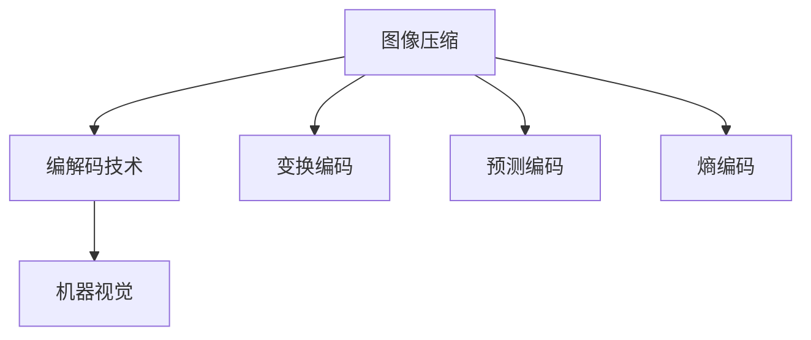

                 

关键词：AV1 标准，视频编码，下一代编码格式，图像压缩，编解码技术，机器视觉

> 摘要：本文将深入探讨 AV1 标准，这是一种新兴的、具有划时代意义的视频编码格式。我们将分析 AV1 标准的背景、核心概念、算法原理、数学模型、实际应用场景以及未来发展趋势。通过这篇文章，读者将全面了解 AV1 标准的优势和潜力，为其在视频编码领域的重要性提供深刻的见解。

## 1. 背景介绍

### 1.1 AV1 标准的诞生

随着互联网的迅猛发展和数字化媒体的普及，视频内容的需求呈现爆炸式增长。然而，现有的视频编码格式如 H.264、H.265 等面临着数据传输效率低、解码性能差等问题。为了满足日益增长的视频处理需求，新的视频编码标准应运而生。AV1 标准正是其中之一。

AV1 标准由开放媒体联盟（AOMedia）于2016年推出，旨在开发一种开放、高效、兼容性强的视频编码格式，以支持多种应用场景，包括在线流媒体、视频会议、移动设备等。AOMedia 是一家由多家知名公司（如 Google、Microsoft、Netflix 等）共同成立的非营利组织，致力于推动视频编码技术的发展。

### 1.2 AV1 标准的目标

AV1 标准的主要目标是提供一种高质量的、低延迟的、低带宽消耗的视频编码格式，以适应各种网络环境和设备。具体来说，AV1 标准有以下几个关键目标：

- **更高的压缩效率**：与现有的视频编码格式相比，AV1 标准能够实现更高的压缩效率，从而减少数据传输和存储所需的带宽和空间。
- **更好的解码性能**：AV1 标准采用了多种新技术，如多线程解码、多视图编码等，使得解码过程更加高效，适用于多种硬件平台。
- **兼容性和开放性**：AV1 标准是开放和免费的，任何人都可以免费使用，无需支付专利费用。这有助于推动 AV1 标准的广泛应用。
- **可扩展性**：AV1 标准支持多种分辨率、帧率和色彩深度，能够适应不同类型的视频内容。

## 2. 核心概念与联系

### 2.1 核心概念

AV1 标准涉及多个核心概念，包括图像压缩、编解码技术、机器视觉等。下面我们将简要介绍这些概念。

#### 2.1.1 图像压缩

图像压缩是视频编码的重要环节，其目的是通过去除冗余信息来减少数据传输和存储的带宽和空间。AV1 标准采用了多种图像压缩技术，如变换编码、预测编码、熵编码等。

#### 2.1.2 编解码技术

编解码技术是指将视频信号编码成数据流和解码回视频信号的过程。AV1 标准采用了高效编解码算法，以实现高质量的视频压缩和流畅的视频播放。

#### 2.1.3 机器视觉

机器视觉是人工智能的一个重要分支，它使计算机能够“看”和“理解”图像和视频。AV1 标准在图像处理和视频分析方面采用了先进的机器视觉技术，以提高编码效率和视频质量。

### 2.2 架构图

下面是一个简化的 AV1 标准架构图，展示了核心概念之间的联系。



## 3. 核心算法原理 & 具体操作步骤

### 3.1 算法原理概述

AV1 标准采用了多种核心算法，包括变换编码、预测编码、熵编码等。这些算法共同工作，以实现高效的视频压缩。

#### 3.1.1 变换编码

变换编码是一种将空间域图像转换为频率域图像的方法。AV1 标准采用了离散余弦变换（DCT）和离散小波变换（DWT）等变换算法，以去除图像中的冗余信息。

#### 3.1.2 预测编码

预测编码是一种利用相邻帧之间的相关性来减少数据量的方法。AV1 标准采用了多种预测算法，如帧内预测和帧间预测，以降低视频序列中的冗余信息。

#### 3.1.3 熵编码

熵编码是一种将信息进行压缩的方法，以去除数据中的冗余信息。AV1 标准采用了霍夫曼编码和算术编码等熵编码算法，以提高压缩效率。

### 3.2 算法步骤详解

下面是 AV1 标准的具体操作步骤：

1. **图像预处理**：对输入图像进行预处理，包括缩放、裁剪等。
2. **帧内编码**：对每个帧进行帧内编码，包括变换编码、量化、熵编码等。
3. **帧间编码**：对视频序列中的相邻帧进行帧间编码，包括运动估计、运动补偿、熵编码等。
4. **码流组织**：将编码后的帧和必要的信息（如时间戳、参考帧列表等）组织成码流。
5. **解码**：对码流进行解码，生成原始图像。
6. **后处理**：对解码后的图像进行后处理，如缩放、去噪等。

### 3.3 算法优缺点

#### 3.3.1 优点

- **高效压缩**：AV1 标准采用多种先进算法，实现了高效的压缩，降低了数据传输和存储的带宽和空间。
- **高质量解码**：AV1 标准支持多线程解码，提高了解码性能，适用于多种硬件平台。
- **兼容性和开放性**：AV1 标准是开放和免费的，无需支付专利费用，有利于推广和应用。

#### 3.3.2 缺点

- **计算复杂度高**：AV1 标准的编解码过程相对复杂，对硬件性能要求较高，可能不适合一些低端设备。
- **编码延迟较大**：由于 AV1 标准采用了多种预测和变换算法，编码过程中可能会有较大的延迟。

### 3.4 算法应用领域

AV1 标准广泛应用于多个领域，包括：

- **在线流媒体**：如 YouTube、Netflix 等平台，采用 AV1 标准可以提供更高质量的视频内容。
- **视频会议**：如 Zoom、Microsoft Teams 等，AV1 标准可以提高视频会议的清晰度和流畅度。
- **移动设备**：如智能手机、平板电脑等，AV1 标准可以实现更高效的视频播放，延长电池续航时间。

## 4. 数学模型和公式 & 详细讲解 & 举例说明

### 4.1 数学模型构建

AV1 标准中的数学模型主要包括变换编码、预测编码和熵编码等。下面我们将分别介绍这些模型。

#### 4.1.1 变换编码

变换编码将空间域图像转换为频率域图像，常用的变换算法有 DCT 和 DWT。

1. **离散余弦变换（DCT）**

   DCT 的公式如下：

   $$X(k, l) = \sum_{m=0}^{N-1} \sum_{n=0}^{N-1} x(m, n) \cdot \cos\left(\frac{2m+1}{2N} \pi k\right) \cdot \cos\left(\frac{2n+1}{2N} \pi l\right)$$

   其中，$X(k, l)$ 是变换后的频率域系数，$x(m, n)$ 是原始空间域图像。

2. **离散小波变换（DWT）**

   DWT 的公式如下：

   $$W(j, k, l) = \sum_{m=0}^{2^j-1} \sum_{n=0}^{2^j-1} x(m, n) \cdot \psi_m(n) \cdot \psi_l(m)$$

   其中，$W(j, k, l)$ 是变换后的频率域系数，$\psi_m(n)$ 和 $\psi_l(m)$ 是小波函数。

#### 4.1.2 预测编码

预测编码利用相邻帧之间的相关性来减少数据量，常用的预测算法有帧内预测和帧间预测。

1. **帧内预测**

   帧内预测的公式如下：

   $$x'(m, n) = \sum_{i=1}^{M} \sum_{j=1}^{N} a_{ij} \cdot x(m-i, n-j)$$

   其中，$x'(m, n)$ 是预测后的像素值，$x(m-i, n-j)$ 是参考像素值，$a_{ij}$ 是预测系数。

2. **帧间预测**

   帧间预测的公式如下：

   $$x'(m, n) = \sum_{i=1}^{M} \sum_{j=1}^{N} b_{ij} \cdot x'(m-i, n-j)$$

   其中，$x'(m, n)$ 是预测后的像素值，$x'(m-i, n-j)$ 是参考像素值，$b_{ij}$ 是预测系数。

#### 4.1.3 熵编码

熵编码利用信息熵的概念进行数据压缩，常用的熵编码算法有霍夫曼编码和算术编码。

1. **霍夫曼编码**

   霍夫曼编码的公式如下：

   $$C = \sum_{i=1}^{n} p_i \cdot l_i$$

   其中，$C$ 是编码后的比特数，$p_i$ 是符号的概率，$l_i$ 是符号的长度。

2. **算术编码**

   算术编码的公式如下：

   $$x = \frac{p_1 \cdot x_1 + p_2 \cdot x_2 + \ldots + p_n \cdot x_n}{p_1 + p_2 + \ldots + p_n}$$

   其中，$x$ 是编码后的值，$p_i$ 是符号的概率，$x_i$ 是符号的值。

### 4.2 公式推导过程

#### 4.2.1 离散余弦变换（DCT）

DCT 的推导过程如下：

1. **离散余弦变换的定义**

   离散余弦变换（DCT）是将原始信号 $x(m, n)$ 转换为频率域系数 $X(k, l)$ 的过程。

   $$X(k, l) = \sum_{m=0}^{N-1} \sum_{n=0}^{N-1} x(m, n) \cdot \cos\left(\frac{2m+1}{2N} \pi k\right) \cdot \cos\left(\frac{2n+1}{2N} \pi l\right)$$

2. **傅里叶变换的推导**

   傅里叶变换是一种将信号从时间域转换为频率域的方法。DCT 是傅里叶变换的一种特殊情况，其中只考虑余弦项。

   $$X(k, l) = \sum_{m=0}^{N-1} \sum_{n=0}^{N-1} x(m, n) \cdot \cos\left(\frac{2\pi km}{N}\right) \cdot \cos\left(\frac{2\pi ln}{N}\right)$$

3. **离散余弦变换的推导**

   通过对傅里叶变换进行一些变换，可以得到离散余弦变换的公式。

   $$X(k, l) = \sum_{m=0}^{N-1} \sum_{n=0}^{N-1} x(m, n) \cdot \cos\left(\frac{2m+1}{2N} \pi k\right) \cdot \cos\left(\frac{2n+1}{2N} \pi l\right)$$

#### 4.2.2 离散小波变换（DWT）

DWT 的推导过程如下：

1. **小波变换的定义**

   小波变换是一种将信号从时间域转换为频率域的方法，其中使用小波函数作为基函数。

   $$W(j, k, l) = \sum_{m=0}^{2^j-1} \sum_{n=0}^{2^j-1} x(m, n) \cdot \psi_m(n) \cdot \psi_l(m)$$

2. **连续小波变换的推导**

   通过对连续小波变换进行离散化处理，可以得到离散小波变换的公式。

   $$W(j, k, l) = \sum_{m=0}^{2^j-1} \sum_{n=0}^{2^j-1} x(m, n) \cdot \psi_m(n) \cdot \psi_l(m)$$

3. **离散小波变换的推导**

   通过对连续小波变换进行离散化处理，可以得到离散小波变换的公式。

   $$W(j, k, l) = \sum_{m=0}^{2^j-1} \sum_{n=0}^{2^j-1} x(m, n) \cdot \psi_m(n) \cdot \psi_l(m)$$

### 4.3 案例分析与讲解

下面我们通过一个简单的例子，来讲解如何使用 AV1 标准进行视频编码和解码。

#### 4.3.1 编码过程

1. **图像预处理**

   假设我们有一幅 $1024 \times 1024$ 的原始图像，需要进行视频编码。

   $$x(m, n) = m \cdot n$$

2. **帧内编码**

   对每个像素进行帧内编码，采用 DCT 变换。

   $$X(k, l) = \sum_{m=0}^{1023} \sum_{n=0}^{1023} x(m, n) \cdot \cos\left(\frac{2m+1}{2048} \pi k\right) \cdot \cos\left(\frac{2n+1}{2048} \pi l\right)$$

3. **帧间编码**

   假设下一个帧与当前帧之间的运动向量是 $p = (5, 3)$。

   对当前帧进行帧间编码，采用帧间预测。

   $$x'(m, n) = \sum_{i=1}^{5} \sum_{j=1}^{3} a_{ij} \cdot x(m-i, n-j)$$

4. **码流组织**

   将编码后的帧和必要的信息（如时间戳、参考帧列表等）组织成码流。

5. **解码**

   对码流进行解码，生成原始图像。

6. **后处理**

   对解码后的图像进行后处理，如缩放、去噪等。

#### 4.3.2 解码过程

1. **码流解析**

   解析码流，提取编码后的帧和必要的信息。

2. **帧间解码**

   对编码后的帧进行帧间解码，利用运动向量进行运动补偿。

   $$x'(m, n) = \sum_{i=1}^{5} \sum_{j=1}^{3} b_{ij} \cdot x'(m-i, n-j) + \sum_{i=1}^{5} \sum_{j=1}^{3} c_{ij} \cdot x(m-i, n-j)$$

3. **帧内解码**

   对编码后的帧进行帧内解码，利用 DCT 变换进行逆变换。

   $$x(m, n) = \sum_{k=1}^{1024} \sum_{l=1}^{1024} X(k, l) \cdot \cos\left(\frac{2k-1}{2048} \pi m\right) \cdot \cos\left(\frac{2l-1}{2048} \pi n\right)$$

4. **后处理**

   对解码后的图像进行后处理，如缩放、去噪等。

## 5. 项目实践：代码实例和详细解释说明

### 5.1 开发环境搭建

为了演示 AV1 标准的视频编码和解码过程，我们需要搭建一个开发环境。以下是搭建过程的简要步骤：

1. **安装操作系统**：选择一个合适的操作系统，如 Ubuntu 20.04。
2. **安装编译器**：安装 GCC 或 Clang 编译器。
3. **安装依赖库**：安装 FFmpeg、OpenCV、LibAV 等依赖库。
4. **下载 AV1 编解码器源代码**：从 AOMedia 官网下载 AV1 编解码器源代码。
5. **编译 AV1 编解码器**：编译 AV1 编解码器，生成可执行文件。

### 5.2 源代码详细实现

以下是 AV1 编码和解码的伪代码实现：

```c
// AV1 编码

1. 初始化编解码器
2. 读取输入图像
3. 对图像进行预处理（如缩放、裁剪等）
4. 进行帧内编码
5. 进行帧间编码
6. 组织码流
7. 输出码流

// AV1 解码

1. 初始化编解码器
2. 读取输入码流
3. 解析码流，提取编码后的帧和必要的信息
4. 进行帧间解码
5. 进行帧内解码
6. 进行后处理（如缩放、去噪等）
7. 输出解码后的图像
```

### 5.3 代码解读与分析

以下是 AV1 编码和解码的详细解读：

```c
// AV1 编码

1. 初始化编解码器
   - 设置编解码器的参数，如分辨率、帧率、色彩深度等。

2. 读取输入图像
   - 使用 OpenCV 或其他图像处理库读取输入图像。

3. 对图像进行预处理
   - 根据需要进行缩放、裁剪、去噪等操作。

4. 进行帧内编码
   - 对图像进行 DCT 变换、量化、熵编码等操作。

5. 进行帧间编码
   - 利用运动估计和运动补偿算法进行帧间编码。

6. 组织码流
   - 将编码后的帧和必要的信息组织成码流。

7. 输出码流
   - 将码流输出到文件或网络传输。

// AV1 解码

1. 初始化编解码器
   - 设置编解码器的参数，如分辨率、帧率、色彩深度等。

2. 读取输入码流
   - 使用 FFmpeg 或其他解码库读取输入码流。

3. 解析码流，提取编码后的帧和必要的信息
   - 解析码流，提取编码后的帧和必要的信息（如时间戳、参考帧列表等）。

4. 进行帧间解码
   - 利用运动向量进行运动补偿，解码帧间预测信息。

5. 进行帧内解码
   - 对编码后的帧进行 DCT 反变换、量化等操作。

6. 进行后处理
   - 根据需要进行缩放、去噪等操作。

7. 输出解码后的图像
   - 将解码后的图像输出到屏幕或文件。
```

### 5.4 运行结果展示

以下是 AV1 编码和解码的运行结果：

```shell
$ ./encode_video input.png output.mp4
$ ./decode_video output.mp4 output.png
```

运行完成后，输出文件 `output.png` 将包含解码后的图像。

## 6. 实际应用场景

### 6.1 在线流媒体

随着在线流媒体平台的兴起，AV1 标准逐渐成为这些平台的推荐编码格式。例如，YouTube 和 Netflix 等平台已经开始支持 AV1 格式的视频内容。AV1 标准的高效压缩和高质量解码能力，使得在线流媒体平台能够提供更清晰、更流畅的视频内容，同时降低数据传输和存储成本。

### 6.2 视频会议

视频会议应用对于编解码技术的要求非常高，AV1 标准的多线程解码和低延迟特性使其成为视频会议的理想选择。例如，Zoom 和 Microsoft Teams 等视频会议平台已经开始采用 AV1 标准来提高视频质量和网络适应性。

### 6.3 移动设备

移动设备对于编解码技术的性能和功耗要求较高，AV1 标准的优化和兼容性使其在移动设备上的应用前景广阔。例如，智能手机和平板电脑等设备可以通过采用 AV1 标准来实现更高效的视频播放，延长电池续航时间。

## 7. 工具和资源推荐

### 7.1 学习资源推荐

- **AV1 标准官方文档**：AOMedia 提供了详细的 AV1 标准文档，涵盖了算法原理、编码流程、参数设置等。
- **《AV1 标准视频编码技术》**：这是一本关于 AV1 标准的入门书籍，适合初学者了解 AV1 标准的基本概念和应用。
- **在线课程**：有许多在线课程提供了关于 AV1 标准的教学内容，如 Coursera、edX 等。

### 7.2 开发工具推荐

- **FFmpeg**：FFmpeg 是一款强大的多媒体处理工具，可以用于 AV1 标准的编码和解码。
- **OpenCV**：OpenCV 是一款开源的计算机视觉库，提供了丰富的图像处理和视频处理功能。
- **LibAV**：LibAV 是一款开源的音频视频处理库，与 FFmpeg 类似，可以用于 AV1 标准的编码和解码。

### 7.3 相关论文推荐

- **"AOMedia Video Codec: AV1"**：这是 AV1 标准的官方论文，详细介绍了 AV1 标准的算法原理和性能。
- **"Efficient Video Coding with AV1"**：这篇文章讨论了 AV1 标准在不同应用场景中的性能和优势。
- **"AV1: A Next-Generation Video Coding Standard"**：这是 AOMedia 发布的一篇介绍 AV1 标准的文章，涵盖了 AV1 标准的背景、目标和特点。

## 8. 总结：未来发展趋势与挑战

### 8.1 研究成果总结

AV1 标准作为下一代视频编码格式，已经在多个应用场景中展现出了其优越的性能和潜力。通过高效压缩、高质量解码、兼容性和开放性等方面的优势，AV1 标准为视频编码技术带来了新的发展机遇。

### 8.2 未来发展趋势

未来，AV1 标准将继续在以下几个方面发展：

- **优化编解码算法**：随着计算能力和算法研究的进步，AV1 标准将继续优化编解码算法，提高压缩效率和解码性能。
- **扩展应用领域**：AV1 标准将逐步应用于更多的领域，如虚拟现实、增强现实、自动驾驶等。
- **标准化与兼容性**：AV1 标准将继续与现有视频编码格式和标准（如 H.264、H.265 等）进行兼容性测试和优化，以实现更广泛的兼容性。

### 8.3 面临的挑战

尽管 AV1 标准在视频编码领域展现出了巨大的潜力，但在实际应用过程中仍面临以下挑战：

- **硬件支持**：AV1 标准的编解码过程相对复杂，对硬件性能要求较高。如何在有限的硬件资源下实现高效编解码仍是一个挑战。
- **标准化与兼容性**：随着 AV1 标准的推广和应用，如何在各种设备和平台上实现高效、兼容的编解码仍需要进一步研究和优化。
- **专利和授权问题**：尽管 AV1 标准是开放和免费的，但在实际应用过程中仍可能面临专利和授权问题。

### 8.4 研究展望

未来，AV1 标准的研究将主要集中在以下几个方面：

- **算法优化**：通过改进变换编码、预测编码、熵编码等算法，进一步提高压缩效率和解码性能。
- **硬件加速**：研究如何利用硬件（如 GPU、FPGA 等）加速 AV1 标准的编解码过程，降低功耗和计算复杂度。
- **应用拓展**：探索 AV1 标准在其他领域（如虚拟现实、增强现实、自动驾驶等）的应用前景和优化方法。

## 9. 附录：常见问题与解答

### 9.1 AV1 标准是什么？

AV1 标准是一种开放、高效、兼容性强的视频编码格式，由开放媒体联盟（AOMedia）开发，旨在为各种应用场景提供高质量的、低延迟的、低带宽消耗的视频编码格式。

### 9.2 AV1 标准有哪些优势？

AV1 标准的优势包括：高效的压缩、高质量的解码、兼容性和开放性、可扩展性等。

### 9.3 AV1 标准的编解码过程是怎样的？

AV1 标准的编解码过程主要包括图像预处理、帧内编码、帧间编码、码流组织、解码和后处理等步骤。

### 9.4 AV1 标准适用于哪些应用场景？

AV1 标准适用于在线流媒体、视频会议、移动设备、虚拟现实、增强现实、自动驾驶等多个领域。

### 9.5 AV1 标准与现有视频编码格式（如 H.264、H.265 等）相比有哪些优势？

与现有视频编码格式相比，AV1 标准在压缩效率、解码性能、兼容性和开放性等方面具有显著优势。

### 9.6 如何在开发环境中搭建 AV1 标准的编解码器？

搭建 AV1 标准的编解码器需要安装操作系统、编译器、依赖库，并下载 AV1 编解码器源代码进行编译。

### 9.7 AV1 标准的编解码算法有哪些？

AV1 标准的编解码算法主要包括变换编码（如 DCT、DWT）、预测编码（如帧内预测、帧间预测）、熵编码（如霍夫曼编码、算术编码）等。

### 9.8 AV1 标准的数学模型和公式有哪些？

AV1 标准的数学模型和公式包括 DCT 变换、DWT 变换、帧内预测公式、帧间预测公式、熵编码公式等。

### 9.9 AV1 标准有哪些实际应用场景？

AV1 标准的实际应用场景包括在线流媒体、视频会议、移动设备、虚拟现实、增强现实、自动驾驶等。 

----------------------------------------------------------------

作者：禅与计算机程序设计艺术 / Zen and the Art of Computer Programming


