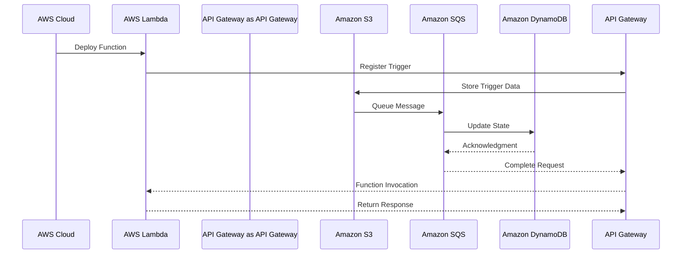

                 

关键词：AWS, Serverless, 微服务, 架构设计, 自动化部署, 云原生, 无服务器架构, Lambda, API Gateway, S3, SQS, DynamoDB, 亚马逊云服务

摘要：本文将深入探讨AWS的无服务器架构，特别是Serverless应用开发的实践。我们将介绍AWS Serverless应用的核心组件、架构设计原则、关键算法原理、数学模型、项目实践，并展望其未来发展趋势。本文旨在为开发者提供一个全面的AWS Serverless应用开发指南。

## 1. 背景介绍

随着云计算技术的不断演进，传统的服务器托管模式已经无法满足现代应用的弹性需求。Serverless架构应运而生，它是一种无需管理服务器的基础设施服务，让开发者能够专注于代码编写，而无需担心底层基础设施的管理。

AWS（Amazon Web Services）作为云计算市场的领导者，提供了丰富的Serverless服务，如AWS Lambda、API Gateway、S3、SQS、DynamoDB等。Serverless架构不仅提高了开发效率，还降低了运维成本，是构建现代云原生应用的关键。

## 2. 核心概念与联系

### 2.1. 核心概念

- **Serverless架构**：一种云服务模型，允许开发者运行和扩展代码而无需管理底层基础设施。
- **无服务器函数**：在Serverless架构中，函数是运行代码的基本单元，可以是无状态的，按需执行，并自动扩展。
- **事件驱动**：Serverless应用通常是事件驱动的，函数的执行由外部事件触发。

### 2.2. 架构联系

下面是一个使用Mermaid绘制的AWS Serverless架构的流程图：



## 3. 核心算法原理 & 具体操作步骤

### 3.1. 算法原理概述

Serverless架构的核心在于函数的计算能力。AWS Lambda提供了一个无服务器环境，让开发者可以运行代码而无需管理服务器。以下是AWS Lambda的算法原理概述：

- **函数执行模型**：Lambda函数是按需执行的，可以响应事件并返回结果。
- **自动扩展**：Lambda可以根据请求流量自动扩展，从零到数百万并发请求。
- **无状态**：Lambda函数每次执行都是独立的，没有状态保持。

### 3.2. 算法步骤详解

- **部署函数**：使用AWS Management Console、AWS CLI或AWS SDK部署Lambda函数。
- **配置触发器**：将API Gateway配置为触发Lambda函数，从而实现HTTP调用的响应。
- **处理请求**：Lambda函数接收请求，处理业务逻辑，并返回响应。
- **日志记录**：使用AWS CloudWatch记录函数的执行日志。

### 3.3. 算法优缺点

#### 优点：

- **弹性**：自动扩展，按需付费。
- **简化运维**：无需管理服务器，降低运维成本。
- **高可用**：AWS提供高可用基础设施。

#### 缺点：

- **性能开销**：函数启动时间可能较长。
- **复杂性**：对于复杂的业务逻辑，Serverless架构可能不够灵活。

### 3.4. 算法应用领域

Serverless架构适用于以下场景：

- **Web API**：构建RESTful API，实现微服务架构。
- **后台任务处理**：如批量数据处理、数据转换等。
- **实时数据处理**：使用事件驱动模型处理实时数据流。

## 4. 数学模型和公式 & 详细讲解 & 举例说明

### 4.1. 数学模型构建

在Serverless架构中，成本计算是一个关键因素。以下是一个简单的成本计算模型：

- **计算费用**：取决于函数的执行时间和内存使用。
- **数据传输费用**：取决于入传出数据量。

### 4.2. 公式推导过程

#### 计算费用：

$$
C_{compute} = r \times (t + \alpha \times m)
$$

其中，$r$ 是每秒计算费用，$t$ 是函数执行时间（秒），$m$ 是内存大小（MB），$\alpha$ 是内存费用系数。

#### 数据传输费用：

$$
C_{data} = b \times (i + o)
$$

其中，$b$ 是每GB数据传输费用，$i$ 是入数据量（GB），$o$ 是出数据量（GB）。

### 4.3. 案例分析与讲解

假设一个Lambda函数每秒执行10次，每次执行5秒，使用128MB内存，入数据量为1GB，出数据量为0.5GB。计算总费用：

$$
C_{total} = C_{compute} + C_{data}
$$

$$
C_{total} = (r \times (5 + \alpha \times 128)) + (b \times (1 + 0.5))
$$

根据AWS的定价策略，我们可以计算出具体的费用。

## 5. 项目实践：代码实例和详细解释说明

### 5.1. 开发环境搭建

为了实践AWS Serverless应用开发，我们需要搭建以下环境：

- AWS账户
- AWS CLI
- Python SDK

### 5.2. 源代码详细实现

以下是一个简单的Lambda函数，用于计算两个数字的和：

```python
import json

def lambda_handler(event, context):
    # 解析事件数据
    body = json.loads(event['body'])
    a = body['a']
    b = body['b']
    
    # 计算和
    result = a + b
    
    # 返回结果
    return {
        'statusCode': 200,
        'body': json.dumps({'sum': result})
    }
```

### 5.3. 代码解读与分析

上述代码中，Lambda函数接收一个JSON格式的请求，计算两个数字的和，并返回结果。这是一个简单但完整的Lambda函数实现。

### 5.4. 运行结果展示

使用AWS CLI上传函数并测试：

```bash
aws lambda create-function \
    --function-name AddTwoNumbers \
    --zip-file fileb://add_two_numbers.zip \
    --handler lambda_function.lambda_handler \
    --runtime python3.8 \
    --role arn:aws:iam::123456789012:role/lambda_basic_execution

aws lambda invoke --function-name AddTwoNumbers --payload '{"a": 2, "b": 3}' output.txt
```

输出结果：

```json
{
  "sum": 5
}
```

## 6. 实际应用场景

Serverless架构适用于各种应用场景，包括：

- **后台任务处理**：如数据导入、批量处理等。
- **API服务**：构建RESTful API，提供微服务接口。
- **实时数据处理**：如IoT设备数据流处理。

### 6.4. 未来应用展望

未来，Serverless架构将继续发展，包括：

- **更细粒度的函数执行**：如基于容器的函数执行。
- **更丰富的服务集成**：与AI、大数据等服务的深度集成。
- **全球化部署**：提供跨区域的自动扩展和容错能力。

## 7. 工具和资源推荐

### 7.1. 学习资源推荐

- 《AWS Lambda Developer Guide》
- 《Serverless Architectures on AWS》
- 《Building Serverless Applications》

### 7.2. 开发工具推荐

- AWS Management Console
- AWS CLI
- AWS SDK

### 7.3. 相关论文推荐

- "Serverless Computing: Everything You Need to Know"
- "Serverless Architectures: A Brief History and Overview"

## 8. 总结：未来发展趋势与挑战

Serverless架构将继续推动云原生应用的发展，带来以下趋势：

- **函数即服务（FnS）**：将函数作为基本的服务单元。
- **多云与混合云**：支持跨云服务的能力。
- **更高级的自动化与智能**：引入人工智能和机器学习技术。

然而，Serverless架构也面临以下挑战：

- **安全性**：如何确保函数和数据的安全性。
- **监控与调试**：如何有效地监控和调试无服务器函数。
- **性能优化**：如何优化函数的执行性能。

### 8.1. 研究成果总结

Serverless架构已经在云计算领域取得了显著成果，提高了开发效率和运维灵活性。

### 8.2. 未来发展趋势

Serverless架构将继续演进，支持更细粒度的函数执行和更高级的自动化与智能。

### 8.3. 面临的挑战

安全性、监控与调试、性能优化是当前Serverless架构面临的主要挑战。

### 8.4. 研究展望

未来的研究将集中在提升Serverless架构的安全性和性能，以及实现跨云服务的无缝集成。

## 9. 附录：常见问题与解答

### 9.1. Q：Serverless架构的缺点是什么？

A：Serverless架构的缺点包括性能开销、复杂性，以及对于复杂业务逻辑可能不够灵活。

### 9.2. Q：如何确保Serverless应用的安全性？

A：通过使用AWS IAM角色、VPC、加密服务等方式，确保函数和数据的安全性。

### 9.3. Q：Serverless架构是否适用于所有应用场景？

A：Serverless架构适用于后台任务处理、API服务、实时数据处理等场景，但不适用于所有应用。对于需要高计算密集型任务的应用，可能需要考虑传统云计算模型。

作者：禅与计算机程序设计艺术 / Zen and the Art of Computer Programming
----------------------------------------------------------------

这篇文章详细介绍了AWS Serverless架构的核心概念、算法原理、数学模型、项目实践，并对其未来发展趋势进行了展望。希望这篇文章能够为开发者提供有价值的参考。

