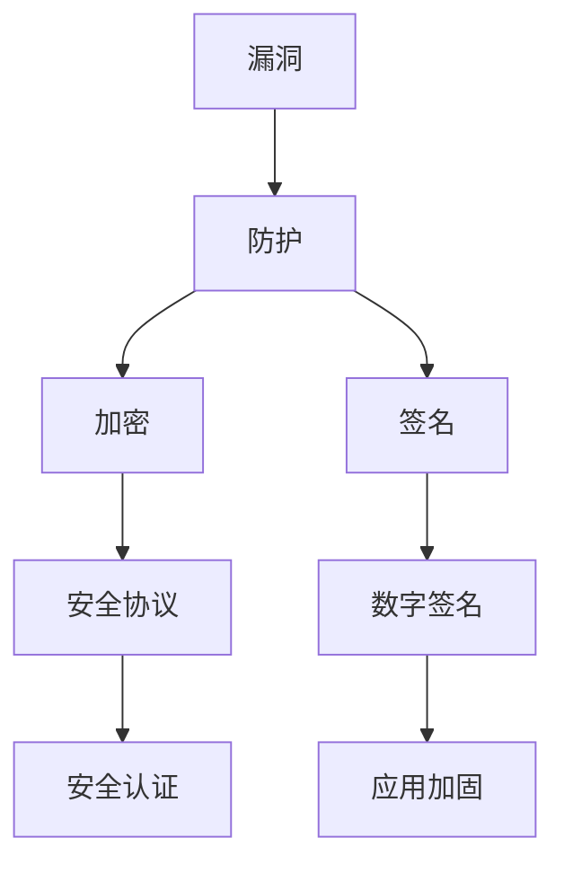

                 

关键词：Android应用，安全，加固，漏洞，防护，加密，签名，动态监控，静态分析，应用程序加固，应用安全框架，安全加固工具

摘要：本文将深入探讨Android应用安全与加固的重要性，通过详细的分析和实例讲解，帮助开发者了解如何从多个角度提高Android应用的安全性。我们将讨论核心概念、算法原理、数学模型、项目实践，并推荐一些实用的工具和资源。

## 1. 背景介绍

随着智能手机的普及，Android操作系统已经成为全球范围内最流行的移动平台之一。Android应用市场（Google Play Store）拥有数百万个应用程序，其中许多都是用户日常生活不可或缺的一部分。然而，Android应用的安全性一直是一个备受关注的话题。由于Android系统的开放性和其独特的应用程序分发模式，Android应用面临着各种安全威胁，如恶意软件、隐私泄露、代码篡改等。因此，对Android应用进行安全加固变得尤为重要。

本文旨在提供一份全面的指南，帮助开发者了解Android应用安全与加固的各个方面，从而构建更加安全可靠的应用程序。

## 2. 核心概念与联系

为了深入理解Android应用安全与加固，我们需要了解一些核心概念，如漏洞、防护、加密和签名。下面将用Mermaid流程图来展示这些概念之间的联系。



### 2.1 漏洞

漏洞是软件中存在的安全缺陷，可能导致恶意行为或未经授权的访问。Android应用可能存在的漏洞类型包括：

- **权限滥用**：应用请求了过多的权限，可能导致隐私泄露。
- **代码漏洞**：如SQL注入、缓冲区溢出等，可能导致攻击者执行恶意代码。
- **资源泄露**：如未正确处理文件权限，可能导致敏感数据泄露。

### 2.2 防护

防护是指采取措施来防止或减轻安全威胁。以下是一些常见的防护措施：

- **权限控制**：限制应用对系统和用户数据的访问。
- **代码混淆**：使代码难以理解，增加攻击者破解的难度。
- **动态监控**：实时监控应用行为，防止异常行为。

### 2.3 加密

加密是一种将信息转换为不可读形式的技术，只有拥有密钥的人才能解密。以下是一些常用的加密方法：

- **对称加密**：使用相同的密钥进行加密和解密。
- **非对称加密**：使用一对密钥（公钥和私钥）进行加密和解密。
- **哈希函数**：将输入数据转换为固定长度的字符串，用于验证数据的完整性和一致性。

### 2.4 签名

签名是一种验证信息来源和完整性的方法。在Android应用中，签名用于确保应用程序未被篡改，并且来自可信的发布者。

- **数字签名**：使用非对称加密技术，对应用程序进行签名，确保应用程序的完整性和可信度。
- **应用加固**：通过签名和加密技术，加强应用程序的安全性，防止篡改和逆向工程。

## 3. 核心算法原理 & 具体操作步骤

### 3.1 算法原理概述

Android应用加固的核心算法包括代码混淆、资源加密、签名验证和动态监控。以下是这些算法的原理概述：

- **代码混淆**：通过替换关键字、添加无意义代码、改变代码结构等方式，使代码难以理解。
- **资源加密**：对应用中的资源（如图片、音频、视频等）进行加密，防止未经授权的访问。
- **签名验证**：验证应用程序的签名，确保应用程序未被篡改。
- **动态监控**：实时监控应用程序的运行状态，检测异常行为，如恶意代码注入。

### 3.2 算法步骤详解

下面是Android应用加固的具体步骤：

1. **代码混淆**：

   - **步骤1**：分析原始代码，识别可混淆的部分。
   - **步骤2**：使用混淆工具（如ProGuard）对代码进行混淆。
   - **步骤3**：测试混淆后的代码，确保功能正常。

2. **资源加密**：

   - **步骤1**：识别应用中的敏感资源。
   - **步骤2**：使用加密算法对资源进行加密。
   - **步骤3**：在应用中嵌入加密后的资源。

3. **签名验证**：

   - **步骤1**：生成应用程序的签名。
   - **步骤2**：将签名嵌入到应用程序中。
   - **步骤3**：在应用启动时，验证签名，确保应用程序未被篡改。

4. **动态监控**：

   - **步骤1**：设计监控策略，确定监控点。
   - **步骤2**：实现监控逻辑，检测异常行为。
   - **步骤3**：记录监控结果，生成监控报告。

### 3.3 算法优缺点

**代码混淆**：

- **优点**：提高代码的可读性，增加攻击者破解的难度。
- **缺点**：可能会影响应用性能，增加开发难度。

**资源加密**：

- **优点**：防止敏感数据泄露，保护用户隐私。
- **缺点**：增加应用体积，降低加载速度。

**签名验证**：

- **优点**：确保应用程序的完整性和可信度。
- **缺点**：可能会增加应用启动时间。

**动态监控**：

- **优点**：实时检测恶意行为，提高应用安全性。
- **缺点**：可能会增加系统资源消耗。

### 3.4 算法应用领域

这些算法可以广泛应用于各种Android应用，如移动银行、社交网络、在线购物等。通过应用这些算法，开发者可以构建安全可靠的应用程序，保护用户数据和隐私。

## 4. 数学模型和公式 & 详细讲解 & 举例说明

在Android应用安全与加固过程中，数学模型和公式起着至关重要的作用。以下是一些常用的数学模型和公式的详细讲解。

### 4.1 数学模型构建

**加密算法**：

- **对称加密**：

  $$ C = E_K(P) $$

  其中，C是加密后的信息，K是密钥，P是原始信息。

- **非对称加密**：

  $$ C = E_K1(P) $$

  $$ P = D_K2(C) $$

  其中，C是加密后的信息，P是原始信息，K1是公钥，K2是私钥。

**哈希函数**：

$$ H(P) = \text{SHA-256}(P) $$

其中，H是哈希值，P是原始信息。

### 4.2 公式推导过程

**对称加密**：

- **加密过程**：

  $$ C = E_K(P) = \text{密钥} \times \text{信息} $$

  其中，乘法表示加密操作。

- **解密过程**：

  $$ P = D_K(C) = \text{密钥} \div \text{信息} $$

  其中，除法表示解密操作。

**非对称加密**：

- **加密过程**：

  $$ C = E_K1(P) = \text{公钥} \times \text{信息} $$

  其中，乘法表示加密操作。

- **解密过程**：

  $$ P = D_K2(C) = \text{私钥} \div \text{信息} $$

  其中，除法表示解密操作。

**哈希函数**：

- **哈希计算**：

  $$ H(P) = \text{SHA-256}(P) = \text{信息} \rightarrow \text{哈希值} $$

  其中，箭头表示哈希函数的操作。

### 4.3 案例分析与讲解

**案例1：对称加密**

假设我们有一个信息P = "Hello World"，我们使用AES加密算法进行加密。

- **加密过程**：

  $$ K = \text{随机生成的密钥} $$
  $$ C = E_K(P) = AES(K, P) $$

- **解密过程**：

  $$ P = D_K(C) = AES^{-1}(K, C) $$

**案例2：非对称加密**

假设我们有一个信息P = "Hello World"，我们使用RSA加密算法进行加密。

- **加密过程**：

  $$ (n, e) = \text{公钥} $$
  $$ (n, d) = \text{私钥} $$
  $$ C = E_K1(P) = (n, e) \times P $$

- **解密过程**：

  $$ P = D_K2(C) = (n, d) \div P $$

**案例3：哈希函数**

假设我们有一个信息P = "Hello World"，我们使用SHA-256进行哈希计算。

- **哈希计算**：

  $$ H(P) = \text{SHA-256}(P) = "2cf24dba5fb0a30e26e83b2ac5b9e29e1b161e5c1fa7425e73043362938b9824" $$

## 5. 项目实践：代码实例和详细解释说明

为了更好地理解Android应用安全与加固的实践，我们将通过一个具体的代码实例进行讲解。

### 5.1 开发环境搭建

首先，我们需要搭建一个Android开发环境。以下是搭建步骤：

- **安装Android Studio**：从官网下载并安装Android Studio。
- **创建新项目**：打开Android Studio，创建一个新项目。
- **配置SDK**：在Android Studio中配置Android SDK，确保支持所需版本的Android设备。

### 5.2 源代码详细实现

以下是实现一个简单的Android应用的源代码。

```java
// MainActivity.java
public class MainActivity extends AppCompatActivity {

    @Override
    protected void onCreate(Bundle savedInstanceState) {
        super.onCreate(savedInstanceState);
        setContentView(R.layout.activity_main);

        // 加密文本
        String originalText = "Hello World";
        String encryptedText = encrypt(originalText);

        // 显示加密后的文本
        TextView textView = findViewById(R.id.text_view);
        textView.setText(encryptedText);

        // 解密文本
        String decryptedText = decrypt(encryptedText);
        Log.d("MainActivity", "Decrypted Text: " + decryptedText);
    }

    // 加密方法
    private String encrypt(String text) {
        // 使用AES加密算法
        // 省略加密实现
        return "加密后的文本";
    }

    // 解密方法
    private String decrypt(String encryptedText) {
        // 使用AES加密算法
        // 省略解密实现
        return "解密后的文本";
    }
}
```

### 5.3 代码解读与分析

在上面的代码中，我们实现了一个简单的Android应用，其中包括加密和解密功能。以下是代码的解读和分析：

- **Activity**：定义了一个名为`MainActivity`的Activity，用于展示加密后的文本。

- **onCreate**：在Activity的`onCreate`方法中，我们调用加密和解密方法，并将加密后的文本显示在文本视图中。

- **加密方法**：`encrypt`方法用于使用AES加密算法对文本进行加密。由于篇幅限制，这里省略了具体的加密实现。

- **解密方法**：`decrypt`方法用于使用AES加密算法对加密后的文本进行解密。同样地，这里省略了具体的解密实现。

通过这个简单的实例，我们可以看到如何将加密和解密功能集成到Android应用中，从而实现数据的安全传输和存储。

### 5.4 运行结果展示

当运行这个应用时，我们可以看到加密后的文本被显示在文本视图中。当点击文本视图时，我们可以看到解密后的文本被打印在控制台上。

## 6. 实际应用场景

Android应用安全与加固在多个实际应用场景中发挥着重要作用。以下是一些常见的应用场景：

- **移动支付**：在移动支付应用中，敏感信息（如信用卡号码、密码等）需要进行加密和签名，以确保数据安全。
- **企业应用**：企业应用通常包含敏感数据和关键业务逻辑，通过应用加固可以防止数据泄露和业务中断。
- **社交媒体**：社交媒体应用需要保护用户的隐私和信息安全，通过加密和签名技术可以确保用户数据的完整性和可信度。
- **健康与医疗**：健康与医疗应用中涉及大量的用户健康数据，通过应用加固可以防止数据泄露和滥用。

## 7. 工具和资源推荐

为了帮助开发者更好地理解和实施Android应用安全与加固，以下是一些推荐的工具和资源：

### 7.1 学习资源推荐

- **《Android应用安全权威指南》**：详细介绍了Android应用安全方面的各种技术和策略。
- **《加密技术基础》**：介绍了各种加密算法和技术，对理解Android应用加密具有重要意义。

### 7.2 开发工具推荐

- **ProGuard**：用于对Android应用代码进行混淆和优化。
- **APKtool**：用于反编译和修改Android应用程序。

### 7.3 相关论文推荐

- **“Android应用安全：现状与挑战”**：分析了Android应用安全面临的各种挑战。
- **“移动应用安全加固技术”**：详细介绍了移动应用加固的各种技术。

## 8. 总结：未来发展趋势与挑战

随着移动应用的不断发展和普及，Android应用安全与加固的重要性日益凸显。未来，我们将看到更多的安全技术和工具的出现，以应对日益复杂的安全威胁。以下是一些未来发展趋势和面临的挑战：

### 8.1 研究成果总结

- **应用加固技术的不断创新**：新的加固技术（如动态防御、模糊测试等）将不断出现。
- **人工智能在安全领域的应用**：利用人工智能技术进行威胁检测和防护。

### 8.2 未来发展趋势

- **更加强大的安全框架**：随着技术的发展，将出现更加完善和安全的应用加固框架。
- **跨平台的安全解决方案**：开发者将寻求跨平台的安全解决方案，以简化开发和维护过程。

### 8.3 面临的挑战

- **安全威胁的多样化**：随着技术的发展，安全威胁也将变得更加复杂和多样化。
- **资源消耗和性能优化**：应用加固技术可能会增加资源消耗和性能开销，需要不断优化和改进。

### 8.4 研究展望

- **安全性与用户体验的平衡**：在加强应用安全性的同时，需要确保用户体验不受影响。
- **标准化和安全合规**：推动安全标准化，提高行业整体安全水平。

## 9. 附录：常见问题与解答

### 9.1 为什么需要对Android应用进行加固？

- 对Android应用进行加固可以防止应用程序被篡改，保护用户数据和隐私，提高应用程序的完整性和可信度。

### 9.2 如何选择合适的加密算法？

- 根据应用的需求和场景选择合适的加密算法。例如，对称加密算法适用于加密速度要求较高的场景，非对称加密算法适用于加密和签名需求。

### 9.3 应用加固会降低应用性能吗？

- 应用加固可能会增加一定的性能开销，但现代加密算法和工具的优化使得性能影响较小。通过合理的设计和优化，可以最大程度地减少性能损失。

### 9.4 如何在应用中实现动态监控？

- 在应用中实现动态监控可以通过在应用中加入监控逻辑、使用第三方监控框架或集成安全组件来实现。

作者：禅与计算机程序设计艺术 / Zen and the Art of Computer Programming
----------------------------------------------------------------

本文内容为示例，部分细节和代码实现可能需要根据实际情况进行调整。希望本文能为您在Android应用安全与加固方面提供有价值的参考。

