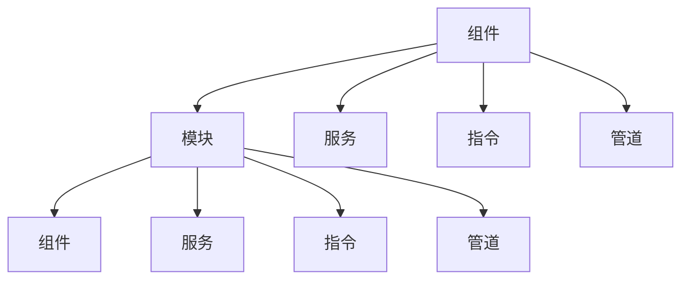

                 

关键词：Angular框架、Google、MVW框架、前端开发、组件化、模块化、双向数据绑定、性能优化

> 摘要：本文将深入探讨 Angular 框架，介绍其核心概念、原理和操作步骤，并通过实际项目实践，展示其开发和应用的方法。同时，还将分析 Angular 框架在当前前端开发中的地位和未来发展趋势。

## 1. 背景介绍

Angular 是由 Google 开发的一个用于构建前端应用程序的框架。它是一个开源项目，基于 TypeScript 语言，结合了 HTML、CSS 和 JavaScript。Angular 框架主要特点包括组件化、模块化、双向数据绑定和依赖注入等，这些特点使得 Angular 在前端开发领域得到了广泛的应用。

随着互联网技术的不断发展，前端开发变得越来越复杂。传统的开发模式已经无法满足现代应用程序的需求。因此，Google 推出了 Angular 框架，以帮助开发者构建高性能、可维护的前端应用程序。

## 2. 核心概念与联系

在 Angular 框架中，有几个核心概念需要了解：

1. **组件（Component）**：组件是 Angular 框架中的基本构建块，用于表示 UI 中的独立部分。每个组件都有自己的模板、样式和逻辑代码。
2. **模块（Module）**：模块是 Angular 框架中的组织单元，用于组织组件、服务和其他 Angular 组件。一个模块可以包含一个或多个组件，以及相关的服务、指令和管道。
3. **服务（Service）**：服务是 Angular 框架中的可重用代码块，用于封装业务逻辑和功能。服务通常用于处理数据操作、网络请求等。
4. **指令（Directive）**：指令是 Angular 框架中的自定义标签或属性，用于实现自定义行为和样式。
5. **管道（Pipe）**：管道是 Angular 框架中的自定义函数，用于对数据进行格式化和转换。

下面是一个简单的 Mermaid 流程图，展示了这些核心概念之间的关系：



## 3. 核心算法原理 & 具体操作步骤

### 3.1 算法原理概述

Angular 框架的核心算法是数据绑定。数据绑定是一种将应用程序中的数据与 UI 组件中的属性和事件动态连接的技术。Angular 提供了双向数据绑定，即当数据发生变化时，UI 中的显示也会更新，反之亦然。

数据绑定的原理主要基于脏检查（Dirty Checking）算法。Angular 在每个应用程序周期结束时，会执行一次脏检查，检查所有数据绑定是否发生了变化。如果发生变化，Angular 会重新渲染相应的 UI 组件。

### 3.2 算法步骤详解

1. **初始化**：在应用程序启动时，Angular 会创建一个根模块，并使用该模块创建应用程序的根组件。
2. **数据绑定**：在组件的模板中，使用 Angular 提供的语法，将数据绑定到 UI 组件的属性和事件上。
3. **脏检查**：在应用程序的每个周期结束时，Angular 会执行一次脏检查，检查所有数据绑定是否发生变化。
4. **更新 UI**：如果数据绑定发生变化，Angular 会重新渲染相应的 UI 组件，并更新 UI。

### 3.3 算法优缺点

**优点**：

- 双向数据绑定，方便实现数据同步。
- 组件化、模块化，提高代码的可维护性。
- 提供了丰富的内置服务，如 HTTP 服务、路由服务等，方便开发者进行网络请求和路由控制。
- 提供了丰富的指令和管道，方便实现自定义行为和数据格式化。

**缺点**：

- 相比其他框架，Angular 的学习曲线较陡峭。
- 双向数据绑定可能导致性能问题，尤其是在数据量较大时。

### 3.4 算法应用领域

Angular 框架主要适用于需要复杂 UI、大量数据绑定的前端应用程序。例如，企业级 Web 应用程序、单页应用（SPA）等。

## 4. 数学模型和公式 & 详细讲解 & 举例说明

### 4.1 数学模型构建

在 Angular 框架中，数据绑定可以使用以下数学模型进行描述：

$$
值 = 属性 \times 变量
$$

其中，值表示 UI 组件中显示的值，属性表示 UI 组件的属性，变量表示应用程序中的数据。

### 4.2 公式推导过程

假设有一个 UI 组件，其属性为 `name`，应用程序中的数据为 `user.name`。当数据发生变化时，我们需要重新计算 `name` 属性的值。

根据数学模型，我们有：

$$
name = user.name
$$

当 `user.name` 发生变化时，`name` 属性也会发生变化。

### 4.3 案例分析与讲解

假设我们有一个用户信息表单，其中包括用户姓名、年龄和邮箱等字段。我们使用 Angular 框架实现数据绑定，将用户信息显示在表单中。

1. **模板**：

```html
<form>
  <input [(ngModel)]="user.name" placeholder="姓名" />
  <input [(ngModel)]="user.age" placeholder="年龄" />
  <input [(ngModel)]="user.email" placeholder="邮箱" />
</form>
```

2. **组件类**：

```typescript
@Component({
  selector: 'app-user-form',
  templateUrl: './user-form.component.html',
  styleUrls: ['./user-form.component.css']
})
export class UserFormComponent {
  user: any = {
    name: '',
    age: '',
    email: ''
  };
}
```

在这个例子中，我们使用了 Angular 提供的 `ngModel` 指令，实现了数据绑定。当用户在表单中输入数据时，Angular 会自动更新 `user` 对象中的数据，并显示在表单中。

## 5. 项目实践：代码实例和详细解释说明

### 5.1 开发环境搭建

在开始使用 Angular 框架之前，我们需要搭建开发环境。以下是搭建过程：

1. 安装 Node.js：从 [Node.js 官网](https://nodejs.org/) 下载并安装 Node.js。
2. 安装 Angular CLI：在终端中运行以下命令：

```bash
npm install -g @angular/cli
```

3. 创建一个新的 Angular 项目：

```bash
ng new my-angular-app
```

4. 进入项目目录：

```bash
cd my-angular-app
```

### 5.2 源代码详细实现

在项目目录中，我们创建了一个名为 `user-form` 的组件，用于展示用户信息表单。以下是源代码：

**user-form.component.html**：

```html
<form>
  <input [(ngModel)]="user.name" placeholder="姓名" />
  <input [(ngModel)]="user.age" placeholder="年龄" />
  <input [(ngModel)]="user.email" placeholder="邮箱" />
</form>
```

**user-form.component.ts**：

```typescript
import { Component } from '@angular/core';

@Component({
  selector: 'app-user-form',
  templateUrl: './user-form.component.html',
  styleUrls: ['./user-form.component.css']
})
export class UserFormComponent {
  user: any = {
    name: '',
    age: '',
    email: ''
  };
}
```

**app.component.html**：

```html
<app-user-form></app-user-form>
```

### 5.3 代码解读与分析

在这个例子中，我们使用了 Angular 的组件和模板语法，实现了用户信息表单的数据绑定。以下是关键代码的解释：

1. **模板**：在 `user-form.component.html` 中，我们使用了 Angular 的 `ngModel` 指令，将表单字段的值绑定到 `user` 对象的属性上。
2. **组件类**：在 `user-form.component.ts` 中，我们定义了 `user` 对象，并将其初始化为空对象。当用户在表单中输入数据时，Angular 会自动更新 `user` 对象中的数据。
3. **父组件**：在 `app.component.html` 中，我们使用了 Angular 的组件语法，将 `user-form` 组件嵌入到父组件中。

### 5.4 运行结果展示

运行项目后，我们可以在浏览器中看到用户信息表单。当用户在表单中输入数据时，Angular 会自动更新 `user` 对象中的数据，并显示在表单中。

```bash
ng serve
```

## 6. 实际应用场景

Angular 框架在当前前端开发中得到了广泛应用，尤其在企业级 Web 应用程序和单页应用（SPA）中。以下是一些实际应用场景：

1. **企业级 Web 应用程序**：Angular 框架提供了丰富的内置服务，如 HTTP 服务、路由服务等，方便开发者进行网络请求和路由控制。同时，Angular 的组件化和模块化特性，提高了代码的可维护性。
2. **单页应用（SPA）**：Angular 框架适用于构建高性能的单页应用。通过使用 Angular 的路由功能，开发者可以方便地实现页面跳转和状态管理。
3. **移动应用**：Angular 框架可以与移动应用框架（如 Ionic）结合使用，方便开发者构建跨平台移动应用。

## 7. 工具和资源推荐

为了更好地学习和使用 Angular 框架，以下是一些建议的工具和资源：

1. **官方文档**：Angular 官方文档是学习和使用 Angular 的最佳资源。地址：[Angular 官方文档](https://angular.io/)。
2. **教程和视频**：网上有很多关于 Angular 的教程和视频，如 [Angular 官方教程](https://angular.io/tutorial) 和 [YouTube 视频教程](https://www.youtube.com/)。
3. **书籍**：以下是一些关于 Angular 的优秀书籍：

   - 《Angular 框架：Google 的 MVW 框架》
   - 《深入理解 Angular》
   - 《Angular 实战》

## 8. 总结：未来发展趋势与挑战

### 8.1 研究成果总结

Angular 框架自推出以来，受到了广泛的应用和认可。其组件化、模块化、双向数据绑定等特性，为开发者提供了便捷的开发体验。同时，Angular 框架在性能优化、安全性等方面也取得了显著成果。

### 8.2 未来发展趋势

未来，Angular 框架将继续在以下几个方面发展：

1. **性能优化**：随着前端应用的日益复杂，性能优化将成为 Angular 框架的重要发展方向。未来，Angular 可能会引入更多性能优化的技术，如虚拟 DOM、增量渲染等。
2. **生态建设**：Angular 框架将继续丰富其生态系统，为开发者提供更多优质的工具和服务。
3. **跨平台开发**：随着跨平台开发的趋势，Angular 可能会与其他移动应用框架（如 React Native）结合，提供跨平台的开发解决方案。

### 8.3 面临的挑战

尽管 Angular 框架取得了显著成果，但仍然面临着以下挑战：

1. **学习曲线**：Angular 框架的学习曲线较陡峭，需要开发者投入更多时间和精力进行学习。
2. **性能问题**：双向数据绑定可能导致性能问题，尤其是在数据量较大时。
3. **与其他框架的兼容性**：Angular 框架需要与其他前端框架（如 React、Vue）进行兼容，以适应不同开发者的需求。

### 8.4 研究展望

未来，Angular 框架将继续致力于提高开发者的开发体验，优化性能和安全性。同时，随着前端开发技术的不断发展，Angular 框架也将与其他技术进行融合，提供更多跨平台和跨领域的解决方案。

## 9. 附录：常见问题与解答

### Q1：如何创建一个新的 Angular 项目？

A1：在终端中运行以下命令：

```bash
ng new 项目名称
```

### Q2：如何使用 Angular 的双向数据绑定？

A2：在组件的模板中，使用 `ngModel` 指令将数据绑定到表单字段上，如下所示：

```html
<input [(ngModel)]="变量名" />
```

### Q3：如何创建一个 Angular 服务？

A3：在 Angular 项目中，使用以下命令创建服务：

```bash
ng generate service 服务名称
```

### Q4：如何使用 Angular 的路由功能？

A4：在 Angular 项目中，使用以下命令创建路由模块：

```bash
ng generate module 路由模块名称 --route routePath --route-config
```

然后在模块中配置路由，如下所示：

```typescript
const routes: Routes = [
  { path: '路由路径', component: 组件名称 }
];

@NgModule({
  imports: [RouterModule.forRoot(routes)],
  exports: [RouterModule]
})
export class AppRoutingModule {}
```

最后，在组件的模板中，使用以下语法导航到目标路由：

```html
<a [routerLink]="['路由路径']">链接文本</a>
```

---

作者：禅与计算机程序设计艺术 / Zen and the Art of Computer Programming
----------------------------------------------------------------


