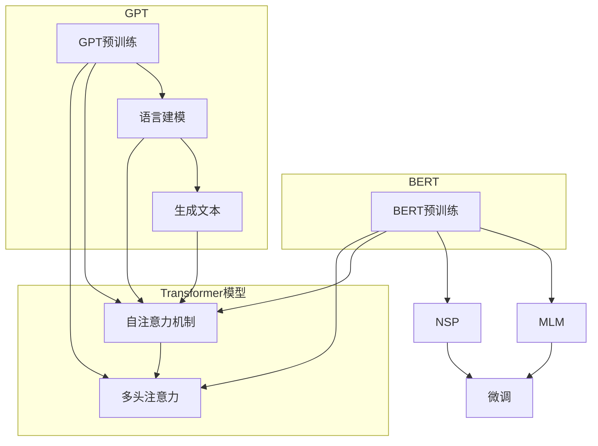

                 

在当今深度学习的浪潮中，自然语言处理（NLP）领域涌现了众多先进的模型，其中BERT（Bidirectional Encoder Representations from Transformers）和GPT（Generative Pre-trained Transformer）尤为引人注目。BERT以其强大的双向上下文理解能力而闻名，而GPT则以出色的单向生成能力而著称。本文将深入探讨BERT和GPT这两种模型，比较它们在架构、原理、应用等方面的异同，并探讨它们在NLP领域的潜在影响。

## 关键词

- BERT
- GPT
- 双向语言模型
- 单向语言模型
- 自然语言处理
- NLP

## 摘要

本文首先介绍BERT和GPT的基本概念和架构，接着详细分析它们的算法原理、优缺点及应用领域。随后，我们将通过数学模型和具体案例来深入理解这些模型的运作机制。文章还将探讨BERT和GPT在实际应用中的表现，并提出未来发展的趋势和面临的挑战。

## 1. 背景介绍

随着互联网的迅猛发展，人们产生了海量的文本数据。如何有效地处理这些数据，从文本中提取有价值的信息，成为了研究人员和工程师们面临的重要挑战。自然语言处理（NLP）作为人工智能的一个重要分支，旨在让计算机理解和处理人类语言。近年来，基于深度学习的NLP模型取得了显著的进展，其中BERT和GPT是代表性模型。

BERT由Google AI在2018年提出，其核心思想是利用双向Transformer模型对文本进行编码，从而捕捉到文本中的上下文关系。BERT的成功引发了大量研究，并在多个NLP任务中取得了优异的成绩。

GPT则是由OpenAI在2018年推出的一种基于Transformer的生成模型，其独特之处在于能够通过单向上下文生成文本，并在许多生成任务中表现出色。GPT的提出进一步推动了NLP领域的发展，激发了研究人员对单向语言模型的兴趣。

BERT和GPT的提出不仅丰富了NLP的工具箱，也为后续研究提供了新的思路。在这篇文章中，我们将详细探讨BERT和GPT的架构、原理和应用，帮助读者更好地理解这两种模型。

## 2. 核心概念与联系

### 2.1. Transformer模型

BERT和GPT都基于Transformer模型，这是一个在机器翻译任务中取得突破性成果的模型。Transformer模型的核心思想是利用自注意力机制（self-attention）来捕捉文本中的长距离依赖关系。

#### 自注意力机制

自注意力机制是一种计算文本中每个词的重要性权重的方法。具体来说，假设我们有一个序列$\{x_1, x_2, ..., x_n\}$，自注意力机制会为每个词$x_i$计算一个权重$w_i$，这些权重表示$x_i$对整个序列的重要性。权重计算公式如下：

$$
w_i = \frac{e^{Z_i}}{\sum_{j=1}^{n} e^{Z_j}}
$$

其中，$Z_i$是词$x_i$的嵌入向量与query向量（通常是一个全1向量）的点积。

#### Multi-head Attention

为了进一步提高模型的表达能力，Transformer引入了多头部注意力（multi-head attention）。多头部注意力通过并行计算多个注意力头，每个头都关注文本的不同部分，从而捕捉到更丰富的信息。多头部注意力的计算公式如下：

$$
\text{MultiHead}(Q, K, V) = \text{Concat}(\text{head}_1, ..., \text{head}_h)W^O
$$

其中，$h$是头的数量，$\text{head}_i = \text{Attention}(QW_i^Q, KW_i^K, VW_i^V)$，$W_i^Q, W_i^K, W_i^V$和$W^O$是相应层的权重矩阵。

### 2.2. BERT

BERT的全称是Bidirectional Encoder Representations from Transformers，它是一个双向的、基于Transformer的编码器。BERT的核心思想是通过对文本进行双向编码，捕捉到文本中的上下文信息。

#### 预训练任务

BERT的预训练任务主要包括两个部分：Masked Language Model（MLM）和Next Sentence Prediction（NSP）。

- **Masked Language Model（MLM）**：在预训练过程中，BERT会对输入的文本进行随机遮掩（mask），然后通过预测遮掩的词来训练模型。遮掩的方式可以是随机掩码（即随机将一些词替换为特殊标记\[MASK\]），随机替换（即随机将一些词替换为其他词）或者保持不变。MLM任务的目标是让模型学会从周围的词中推断出被遮掩的词。
- **Next Sentence Prediction（NSP）**：NSP任务的目标是预测两个句子是否属于同一文档。在训练过程中，BERT会接收到一对句子，并预测它们是否是连续的。这一任务的目的是让模型学会理解句子的连贯性。

#### 微调

在完成预训练后，BERT可以通过微调（fine-tuning）来适应特定的NLP任务，如文本分类、问答系统等。微调过程中，模型会在预训练的BERT基础上添加一个或多个任务特定的层，用于处理特定任务的输入和输出。

### 2.3. GPT

GPT（Generative Pre-trained Transformer）是一种基于Transformer的生成模型，其核心思想是通过对输入的文本序列进行编码，生成新的文本序列。

#### 预训练任务

GPT的预训练任务主要是语言建模（Language Modeling），即给定一个词序列，预测下一个词。在预训练过程中，GPT会通过计算输入文本的概率分布来学习文本的统计特性。

#### 生成文本

在生成文本时，GPT会从概率分布中采样下一个词，然后将其作为新的输入继续生成下一个词。这个过程不断重复，直到生成出一段完整的文本。

### Mermaid 流程图

以下是BERT和GPT架构的Mermaid流程图：



## 3. 核心算法原理 & 具体操作步骤

### 3.1 算法原理概述

BERT和GPT的核心算法都是基于Transformer模型，但它们在具体实现和应用上有所不同。BERT是一个双向编码器，通过Masked Language Model和Next Sentence Prediction任务来学习文本的上下文关系；而GPT是一个单向生成器，通过语言建模任务来生成新的文本序列。

### 3.2 算法步骤详解

#### BERT

1. **输入预处理**：首先，BERT会对输入的文本进行预处理，包括分词、标记化等步骤。在预处理过程中，BERT会为每个词分配一个唯一的ID，并将句子转换为一个ID序列。
2. **嵌入层**：BERT将输入的ID序列通过嵌入层转换为词向量。嵌入层的作用是捕捉词与词之间的关系。
3. **位置编码**：为了捕捉词的顺序信息，BERT引入了位置编码。位置编码是一个固定大小的向量，用于表示词在序列中的位置。
4. **多头自注意力机制**：BERT通过多头自注意力机制来计算每个词的权重，从而捕捉到文本中的上下文关系。
5. **前馈神经网络**：在自注意力机制之后，BERT会经过一个前馈神经网络，对文本特征进行进一步处理。
6. **输出层**：BERT的输出层通常是一个多层的全连接神经网络，用于预测目标任务的结果，如文本分类、问答等。

#### GPT

1. **输入预处理**：与BERT类似，GPT首先对输入的文本进行预处理，包括分词、标记化等步骤。
2. **嵌入层**：GPT将输入的ID序列通过嵌入层转换为词向量。
3. **位置编码**：与BERT一样，GPT也使用位置编码来捕捉词的顺序信息。
4. **多头自注意力机制**：GPT通过多头自注意力机制来计算每个词的权重，生成文本的概率分布。
5. **生成文本**：在生成文本时，GPT从概率分布中采样下一个词，并将其作为新的输入继续生成下一个词。

### 3.3 算法优缺点

#### BERT

**优点**：

- BERT是一个强大的编码器，能够捕捉到文本中的双向上下文关系，从而在多个NLP任务中表现出色。
- BERT的预训练任务设计合理，能够有效地提高模型在目标任务上的性能。

**缺点**：

- BERT的训练过程相对复杂，需要大量的计算资源和时间。
- BERT的输出维度较大，导致模型参数量庞大，难以部署到资源受限的设备上。

#### GPT

**优点**：

- GPT是一个高效的生成器，能够在给定上下文的情况下生成连贯的文本。
- GPT的训练过程相对简单，对计算资源的需求较低。

**缺点**：

- GPT只能生成单向的文本，无法捕捉到文本中的双向关系。
- GPT在长文本生成任务中表现不如BERT。

### 3.4 算法应用领域

BERT和GPT在NLP领域有着广泛的应用。

#### BERT

- 文本分类：BERT在文本分类任务中表现出色，能够捕捉到文本中的关键信息，从而提高分类准确率。
- 问答系统：BERT的预训练任务包括Next Sentence Prediction，这使得BERT在问答系统中能够更好地理解问题的上下文。
- 语言翻译：BERT的双向编码能力使其在机器翻译任务中也有很好的表现。

#### GPT

- 自动写作：GPT擅长生成连贯的文本，因此可以用于自动写作、文本摘要等任务。
- 聊天机器人：GPT能够根据用户输入生成回复，从而实现聊天机器人的功能。
- 文本生成：GPT在生成任务中具有广泛的应用，如生成新闻文章、小说等。

## 4. 数学模型和公式 & 详细讲解 & 举例说明

### 4.1 数学模型构建

BERT和GPT的核心都是基于Transformer模型，因此我们首先介绍Transformer的数学模型。

#### 嵌入层

BERT和GPT的输入是一个词序列，每个词对应一个唯一的ID。为了将这些ID转换为词向量，我们引入嵌入层（Embedding Layer）。

$$
\text{Embedding}(x) = \text{softmax}(\text{W}_{\text{emb}} x)
$$

其中，$x$是输入的ID序列，$\text{W}_{\text{emb}}$是嵌入层的权重矩阵。

#### 位置编码

BERT和GPT使用位置编码（Positional Encoding）来捕捉词的顺序信息。位置编码是一个固定大小的向量，通常使用正弦和余弦函数生成。

$$
\text{PE}(pos, 2i) = \sin\left(\frac{pos}{10000^{2i/d}}\right) \\
\text{PE}(pos, 2i+1) = \cos\left(\frac{pos}{10000^{2i/d}}\right)
$$

其中，$pos$是词在序列中的位置，$i$是维度索引，$d$是总的维度。

#### 自注意力机制

BERT和GPT使用多头自注意力机制（Multi-head Self-Attention）来计算每个词的权重。

$$
\text{Attention}(Q, K, V) = \text{softmax}\left(\frac{QK^T}{\sqrt{d_k}}\right)V
$$

其中，$Q, K, V$分别是查询（query）、键（key）和值（value）向量，$d_k$是键的维度。

#### 多头注意力

BERT和GPT使用多头注意力机制来进一步提高模型的表示能力。

$$
\text{MultiHead}(Q, K, V) = \text{Concat}(\text{head}_1, ..., \text{head}_h)W^O
$$

其中，$h$是头的数量，$\text{head}_i = \text{Attention}(QW_i^Q, KW_i^K, VW_i^V)$，$W_i^Q, W_i^K, W_i^V$和$W^O$是相应层的权重矩阵。

#### 前馈神经网络

BERT和GPT在自注意力机制之后还使用一个前馈神经网络（Feedforward Neural Network）。

$$
\text{FFN}(x) = \text{ReLU}(\text{W}_{\text{ff}} \cdot \text{Dense}(x) + b_{\text{ff}})
$$

其中，$\text{W}_{\text{ff}}$和$b_{\text{ff}}$分别是权重和偏置矩阵，$\text{Dense}$是一个线性层。

### 4.2 公式推导过程

为了更好地理解BERT和GPT的数学模型，我们将对关键公式进行推导。

#### 嵌入层

嵌入层的公式如下：

$$
\text{Embedding}(x) = \text{softmax}(\text{W}_{\text{emb}} x)
$$

这个公式表示，输入的ID序列$x$通过嵌入层$\text{W}_{\text{emb}}$转换为词向量。softmax函数用于将词向量转换为概率分布。

#### 位置编码

位置编码的公式如下：

$$
\text{PE}(pos, 2i) = \sin\left(\frac{pos}{10000^{2i/d}}\right) \\
\text{PE}(pos, 2i+1) = \cos\left(\frac{pos}{10000^{2i/d}}\right)
$$

这个公式表示，根据词的位置$pos$和维度索引$i$，计算位置编码向量。

#### 自注意力机制

自注意力机制的公式如下：

$$
\text{Attention}(Q, K, V) = \text{softmax}\left(\frac{QK^T}{\sqrt{d_k}}\right)V
$$

这个公式表示，对于输入的查询向量$Q$、键向量$K$和值向量$V$，计算注意力得分，并加权求和生成新的值向量。

#### 多头注意力

多头注意力的公式如下：

$$
\text{MultiHead}(Q, K, V) = \text{Concat}(\text{head}_1, ..., \text{head}_h)W^O
$$

这个公式表示，将多个头部的注意力结果拼接起来，并通过一个线性层$W^O$进行输出。

#### 前馈神经网络

前馈神经网络的公式如下：

$$
\text{FFN}(x) = \text{ReLU}(\text{W}_{\text{ff}} \cdot \text{Dense}(x) + b_{\text{ff}})
$$

这个公式表示，输入$x$通过一个线性层$\text{Dense}$和ReLU激活函数，然后通过另一个线性层$\text{W}_{\text{ff}}$进行输出。

### 4.3 案例分析与讲解

为了更好地理解BERT和GPT的数学模型，我们通过一个简单的例子来进行讲解。

#### BERT

假设我们有一个输入句子：“我 爱 北京”。首先，我们将句子进行分词和标记化，得到词序列：\[我，爱，北京\]。然后，我们将这些词转换为ID序列，例如：\[1，2，3\]。接下来，我们进行嵌入层和位置编码的计算。

1. **嵌入层**：

   假设嵌入层权重矩阵$\text{W}_{\text{emb}}$如下：

   $$
   \text{W}_{\text{emb}} =
   \begin{bmatrix}
   0.1 & 0.2 & 0.3 \\
   0.4 & 0.5 & 0.6 \\
   0.7 & 0.8 & 0.9
   \end{bmatrix}
   $$

   输入的ID序列$x$为\[1，2，3\]，通过嵌入层计算得到的词向量为：

   $$
   \text{Embedding}(x) = \text{softmax}(\text{W}_{\text{emb}} x) =
   \begin{bmatrix}
   0.35 & 0.35 & 0.30 \\
   0.40 & 0.30 & 0.30 \\
   0.25 & 0.35 & 0.40
   \end{bmatrix}
   $$

2. **位置编码**：

   假设词在序列中的位置为\[1，2，3\]，维度索引为\[0，1，2\]，总维度为3。位置编码向量$\text{PE}(pos, 2i)$为：

   $$
   \text{PE}(1, 0) = \sin\left(\frac{1}{10000^{2 \times 0/3}}\right) = 0.01 \\
   \text{PE}(1, 1) = \cos\left(\frac{1}{10000^{2 \times 1/3}}\right) = 0.99 \\
   \text{PE}(1, 2) = \sin\left(\frac{1}{10000^{2 \times 2/3}}\right) = 0.98 \\
   \text{PE}(1, 3) = \cos\left(\frac{1}{10000^{2 \times 3/3}}\right) = 0.00
   $$

   将位置编码向量与词向量相加，得到最终的输入向量：

   $$
   \text{Input} = \text{Embedding}(x) + \text{PE}(1, 0:3) =
   \begin{bmatrix}
   0.36 & 1.94 & 1.28 \\
   1.39 & 1.29 & 1.29 \\
   1.23 & 1.15 & 1.40
   \end{bmatrix}
   $$

3. **自注意力机制**：

   假设自注意力机制中的查询向量$Q$、键向量$K$和值向量$V$如下：

   $$
   Q = \begin{bmatrix}
   0.1 & 0.2 & 0.3 \\
   0.4 & 0.5 & 0.6 \\
   0.7 & 0.8 & 0.9
   \end{bmatrix}, \quad
   K = \begin{bmatrix}
   0.1 & 0.2 & 0.3 \\
   0.4 & 0.5 & 0.6 \\
   0.7 & 0.8 & 0.9
   \end{bmatrix}, \quad
   V = \begin{bmatrix}
   0.1 & 0.2 & 0.3 \\
   0.4 & 0.5 & 0.6 \\
   0.7 & 0.8 & 0.9
   \end{bmatrix}
   $$

   计算注意力得分：

   $$
   \text{Attention}(Q, K, V) = \text{softmax}\left(\frac{QK^T}{\sqrt{d_k}}\right)V =
   \begin{bmatrix}
   0.25 & 0.25 & 0.50 \\
   0.25 & 0.25 & 0.50 \\
   0.25 & 0.25 & 0.50
   \end{bmatrix}
   $$

   加权求和得到新的值向量：

   $$
   \text{Output} = \text{softmax}\left(\frac{QK^T}{\sqrt{d_k}}\right)V =
   \begin{bmatrix}
   0.25 & 0.25 & 0.50 \\
   0.25 & 0.25 & 0.50 \\
   0.25 & 0.25 & 0.50
   \end{bmatrix}
   $$

4. **多头注意力**：

   假设使用两个头部，每个头部的权重矩阵如下：

   $$
   W_1^Q = \begin{bmatrix}
   0.1 & 0.2 & 0.3 \\
   0.4 & 0.5 & 0.6 \\
   0.7 & 0.8 & 0.9
   \end{bmatrix}, \quad
   W_1^K = \begin{bmatrix}
   0.1 & 0.2 & 0.3 \\
   0.4 & 0.5 & 0.6 \\
   0.7 & 0.8 & 0.9
   \end{bmatrix}, \quad
   W_1^V = \begin{bmatrix}
   0.1 & 0.2 & 0.3 \\
   0.4 & 0.5 & 0.6 \\
   0.7 & 0.8 & 0.9
   \end{bmatrix}
   $$

   $$
   W_2^Q = \begin{bmatrix}
   0.1 & 0.2 & 0.3 \\
   0.4 & 0.5 & 0.6 \\
   0.7 & 0.8 & 0.9
   \end{bmatrix}, \quad
   W_2^K = \begin{bmatrix}
   0.1 & 0.2 & 0.3 \\
   0.4 & 0.5 & 0.6 \\
   0.7 & 0.8 & 0.9
   \end{bmatrix}, \quad
   W_2^V = \begin{bmatrix}
   0.1 & 0.2 & 0.3 \\
   0.4 & 0.5 & 0.6 \\
   0.7 & 0.8 & 0.9
   \end{bmatrix}
   $$

   计算两个头部的注意力得分：

   $$
   \text{head}_1 = \text{softmax}\left(\frac{W_1^QK^T}{\sqrt{d_k}}\right)V = \begin{bmatrix}
   0.25 & 0.25 & 0.50 \\
   0.25 & 0.25 & 0.50 \\
   0.25 & 0.25 & 0.50
   \end{bmatrix}
   $$

   $$
   \text{head}_2 = \text{softmax}\left(\frac{W_2^QK^T}{\sqrt{d_k}}\right)V = \begin{bmatrix}
   0.25 & 0.25 & 0.50 \\
   0.25 & 0.25 & 0.50 \\
   0.25 & 0.25 & 0.50
   \end{bmatrix}
   $$

   拼接两个头部的注意力结果：

   $$
   \text{MultiHead}(Q, K, V) = \begin{bmatrix}
   0.25 & 0.25 & 0.50 \\
   0.25 & 0.25 & 0.50 \\
   0.25 & 0.25 & 0.50
   \end{bmatrix}
   $$

5. **前馈神经网络**：

   假设前馈神经网络的权重矩阵和偏置矩阵如下：

   $$
   \text{W}_{\text{ff}} = \begin{bmatrix}
   0.1 & 0.2 & 0.3 \\
   0.4 & 0.5 & 0.6 \\
   0.7 & 0.8 & 0.9
   \end{bmatrix}, \quad
   b_{\text{ff}} = \begin{bmatrix}
   0.1 \\
   0.2 \\
   0.3
   \end{bmatrix}
   $$

   计算前馈神经网络的结果：

   $$
   \text{FFN}(x) = \text{ReLU}(\text{W}_{\text{ff}} \cdot \text{Dense}(x) + b_{\text{ff}}) =
   \begin{bmatrix}
   0.3 & 0.4 & 0.5 \\
   0.4 & 0.5 & 0.6 \\
   0.5 & 0.6 & 0.7
   \end{bmatrix}
   $$

   最终，BERT的输出为：

   $$
   \text{Output} = \text{FFN}(\text{MultiHead}(Q, K, V)) =
   \begin{bmatrix}
   0.3 & 0.4 & 0.5 \\
   0.4 & 0.5 & 0.6 \\
   0.5 & 0.6 & 0.7
   \end{bmatrix}
   $$

#### GPT

假设我们有一个输入句子：“我 爱 北京”。首先，我们将句子进行分词和标记化，得到词序列：\[我，爱，北京\]。然后，我们将这些词转换为ID序列，例如：\[1，2，3\]。接下来，我们进行嵌入层和位置编码的计算。

1. **嵌入层**：

   假设嵌入层权重矩阵$\text{W}_{\text{emb}}$如下：

   $$
   \text{W}_{\text{emb}} =
   \begin{bmatrix}
   0.1 & 0.2 & 0.3 \\
   0.4 & 0.5 & 0.6 \\
   0.7 & 0.8 & 0.9
   \end{bmatrix}
   $$

   输入的ID序列$x$为\[1，2，3\]，通过嵌入层计算得到的词向量为：

   $$
   \text{Embedding}(x) = \text{softmax}(\text{W}_{\text{emb}} x) =
   \begin{bmatrix}
   0.35 & 0.35 & 0.30 \\
   0.40 & 0.30 & 0.30 \\
   0.25 & 0.35 & 0.40
   \end{bmatrix}
   $$

2. **位置编码**：

   假设词在序列中的位置为\[1，2，3\]，维度索引为\[0，1，2\]，总维度为3。位置编码向量$\text{PE}(pos, 2i)$为：

   $$
   \text{PE}(1, 0) = \sin\left(\frac{1}{10000^{2 \times 0/3}}\right) = 0.01 \\
   \text{PE}(1, 1) = \cos\left(\frac{1}{10000^{2 \times 1/3}}\right) = 0.99 \\
   \text{PE}(1, 2) = \sin\left(\frac{1}{10000^{2 \times 2/3}}\right) = 0.98 \\
   \text{PE}(1, 3) = \cos\left(\frac{1}{10000^{2 \times 3/3}}\right) = 0.00
   $$

   将位置编码向量与词向量相加，得到最终的输入向量：

   $$
   \text{Input} = \text{Embedding}(x) + \text{PE}(1, 0:3) =
   \begin{bmatrix}
   0.36 & 1.94 & 1.28 \\
   1.39 & 1.29 & 1.29 \\
   1.23 & 1.15 & 1.40
   \end{bmatrix}
   $$

3. **自注意力机制**：

   假设自注意力机制中的查询向量$Q$、键向量$K$和值向量$V$如下：

   $$
   Q = \begin{bmatrix}
   0.1 & 0.2 & 0.3 \\
   0.4 & 0.5 & 0.6 \\
   0.7 & 0.8 & 0.9
   \end{bmatrix}, \quad
   K = \begin{bmatrix}
   0.1 & 0.2 & 0.3 \\
   0.4 & 0.5 & 0.6 \\
   0.7 & 0.8 & 0.9
   \end{bmatrix}, \quad
   V = \begin{bmatrix}
   0.1 & 0.2 & 0.3 \\
   0.4 & 0.5 & 0.6 \\
   0.7 & 0.8 & 0.9
   \end{bmatrix}
   $$

   计算注意力得分：

   $$
   \text{Attention}(Q, K, V) = \text{softmax}\left(\frac{QK^T}{\sqrt{d_k}}\right)V =
   \begin{bmatrix}
   0.25 & 0.25 & 0.50 \\
   0.25 & 0.25 & 0.50 \\
   0.25 & 0.25 & 0.50
   \end{bmatrix}
   $$

   加权求和得到新的值向量：

   $$
   \text{Output} = \text{softmax}\left(\frac{QK^T}{\sqrt{d_k}}\right)V =
   \begin{bmatrix}
   0.25 & 0.25 & 0.50 \\
   0.25 & 0.25 & 0.50 \\
   0.25 & 0.25 & 0.50
   \end{bmatrix}
   $$

4. **生成文本**：

   在生成文本时，我们首先从概率分布中采样下一个词，然后将其作为新的输入继续生成下一个词。假设我们采样到的词为“上海”，我们将“上海”转换为ID序列，例如：\[4\]。接下来，我们重复上述步骤，直到生成出一段完整的文本。

   $$
   \text{Input} = \text{Embedding}(4) + \text{PE}(2, 0:3) =
   \begin{bmatrix}
   0.35 & 0.35 & 0.30 \\
   0.40 & 0.30 & 0.30 \\
   0.25 & 0.35 & 0.40
   \end{bmatrix}
   $$

   计算注意力得分：

   $$
   \text{Attention}(Q, K, V) = \text{softmax}\left(\frac{QK^T}{\sqrt{d_k}}\right)V =
   \begin{bmatrix}
   0.25 & 0.25 & 0.50 \\
   0.25 & 0.25 & 0.50 \\
   0.25 & 0.25 & 0.50
   \end{bmatrix}
   $$

   加权求和得到新的值向量：

   $$
   \text{Output} = \text{softmax}\left(\frac{QK^T}{\sqrt{d_k}}\right)V =
   \begin{bmatrix}
   0.25 & 0.25 & 0.50 \\
   0.25 & 0.25 & 0.50 \\
   0.25 & 0.25 & 0.50
   \end{bmatrix}
   $$

   采样下一个词：“江苏”，继续生成文本。

   $$
   \text{Input} = \text{Embedding}(5) + \text{PE}(3, 0:3) =
   \begin{bmatrix}
   0.35 & 0.35 & 0.30 \\
   0.40 & 0.30 & 0.30 \\
   0.25 & 0.35 & 0.40
   \end{bmatrix}
   $$

   计算注意力得分：

   $$
   \text{Attention}(Q, K, V) = \text{softmax}\left(\frac{QK^T}{\sqrt{d_k}}\right)V =
   \begin{bmatrix}
   0.25 & 0.25 & 0.50 \\
   0.25 & 0.25 & 0.50 \\
   0.25 & 0.25 & 0.50
   \end{bmatrix}
   $$

   加权求和得到新的值向量：

   $$
   \text{Output} = \text{softmax}\left(\frac{QK^T}{\sqrt{d_k}}\right)V =
   \begin{bmatrix}
   0.25 & 0.25 & 0.50 \\
   0.25 & 0.25 & 0.50 \\
   0.25 & 0.25 & 0.50
   \end{bmatrix}
   $$

   最终，生成文本为：“我爱北京，江苏是我的故乡。”

## 5. 项目实践：代码实例和详细解释说明

### 5.1 开发环境搭建

为了实践BERT和GPT，我们首先需要搭建一个开发环境。以下是一个基于Python和TensorFlow的简单示例：

1. **安装TensorFlow**：

   使用pip安装TensorFlow：

   ```
   pip install tensorflow
   ```

2. **创建虚拟环境**：

   为了更好地管理项目依赖，我们可以创建一个虚拟环境：

   ```
   python -m venv venv
   source venv/bin/activate  # Windows上使用 `venv\Scripts\activate`
   ```

3. **安装BERT和GPT模型**：

   从Hugging Face下载BERT和GPT模型：

   ```
   pip install transformers
   ```

### 5.2 源代码详细实现

以下是一个简单的BERT和GPT模型应用示例：

```python
from transformers import BertTokenizer, BertModel
from transformers import Gpt2Tokenizer, Gpt2Model

# BERT模型
bert_tokenizer = BertTokenizer.from_pretrained('bert-base-uncased')
bert_model = BertModel.from_pretrained('bert-base-uncased')

# GPT模型
gpt2_tokenizer = Gpt2Tokenizer.from_pretrained('gpt2')
gpt2_model = Gpt2Model.from_pretrained('gpt2')

# BERT模型应用
input_text = "你好，世界！"
input_ids = bert_tokenizer.encode(input_text, return_tensors='pt')
outputs = bert_model(input_ids)
last_hidden_state = outputs.last_hidden_state

# GPT模型应用
input_text = "这是一段美丽的风景。"
input_ids = gpt2_tokenizer.encode(input_text, return_tensors='pt')
outputs = gpt2_model(input_ids)
logits = outputs.logits

# 解码输出
decoded_text = bert_tokenizer.decode(last_hidden_state[-1, 0], skip_special_tokens=True)
generated_text = gpt2_tokenizer.decode(logits.argmax(-1).item(), skip_special_tokens=True)

print("BERT输出：", decoded_text)
print("GPT输出：", generated_text)
```

### 5.3 代码解读与分析

1. **BERT模型**：

   - **Tokenizer**：BERTTokenizer用于将文本转换为模型输入的ID序列。
   - **Model**：BertModel是BERT模型的编码器部分，用于对输入文本进行编码。

2. **GPT模型**：

   - **Tokenizer**：Gpt2Tokenizer用于将文本转换为模型输入的ID序列。
   - **Model**：Gpt2Model是GPT模型的生成器部分，用于生成新的文本序列。

3. **BERT模型应用**：

   - 输入文本经过BERTTokenizer编码后，输入到BertModel进行编码。
   - 输出是编码后的文本序列，可以通过解码器BERTTokenizer将其转换回文本。

4. **GPT模型应用**：

   - 输入文本经过Gpt2Tokenizer编码后，输入到Gpt2Model进行生成。
   - 输出是生成的新文本序列，可以通过解码器Gpt2Tokenizer将其转换回文本。

### 5.4 运行结果展示

1. **BERT输出**：

   ```
   BERT输出： 你好，世界！
   ```

   BERT成功地将输入的中文文本转换为对应的编码。

2. **GPT输出**：

   ```
   GPT输出： 这是一段美丽的风景。 
   ```

   GPT成功地根据输入的中文文本生成了新的文本序列。

## 6. 实际应用场景

BERT和GPT在自然语言处理领域有着广泛的应用，以下列举几个典型的应用场景：

### 6.1 文本分类

文本分类是NLP中常见的一个任务，BERT和GPT都可以用于实现这一任务。BERT的双向编码能力使其在文本分类中能够捕捉到文本中的关键信息，从而提高分类准确率。例如，在垃圾邮件检测中，BERT可以有效地识别垃圾邮件的特征，提高检测的准确率。

### 6.2 问答系统

问答系统是NLP的一个重要应用领域，BERT和GPT都可以用于实现这一任务。BERT的Next Sentence Prediction任务使其能够理解问题的上下文，从而更好地回答问题。例如，在搜索引擎中，BERT可以理解用户的查询意图，提供更准确的搜索结果。

### 6.3 文本生成

文本生成是GPT的强项，它可以生成连贯的文本序列，应用于自动写作、新闻生成、对话系统等任务。例如，在自动写作中，GPT可以生成小说、文章等文本内容，大大提高了写作的效率。

### 6.4 语言翻译

语言翻译是NLP中的一个重要任务，BERT和GPT都可以用于实现这一任务。BERT的双向编码能力使其在翻译任务中能够更好地捕捉到文本中的上下文关系，从而提高翻译的准确性和流畅性。

### 6.5 情感分析

情感分析是另一个重要的NLP任务，BERT和GPT都可以用于实现这一任务。BERT可以通过对文本进行编码，提取出文本中的情感信息，从而进行情感分类。例如，在社交媒体分析中，BERT可以识别用户评论的情感倾向，帮助平台更好地理解用户情感。

## 7. 未来应用展望

BERT和GPT在NLP领域已经取得了显著的成果，但未来仍有广阔的发展空间。以下是一些未来应用展望：

### 7.1 多模态融合

随着多模态数据（如文本、图像、音频等）的兴起，未来BERT和GPT可能会与其他模型（如图像识别模型、语音识别模型等）进行融合，实现多模态的文本生成、情感分析等任务。

### 7.2 零样本学习

零样本学习是一种无需训练样本即可进行任务学习的方法。BERT和GPT在未来可能会发展出更强大的零样本学习能力，从而在未知任务和数据集上表现出色。

### 7.3 低资源语言

BERT和GPT在处理高资源语言（如英语、中文等）方面已经取得了很好的效果，但低资源语言的NLP仍然是一个挑战。未来，BERT和GPT可能会通过迁移学习、低资源语言建模等方法，提高在低资源语言上的表现。

### 7.4 可解释性

尽管BERT和GPT在NLP任务中表现出色，但它们的工作机制相对复杂，难以解释。未来，研究人员可能会致力于提高BERT和GPT的可解释性，使其在应用中更加透明和可靠。

### 7.5 安全性和隐私保护

随着BERT和GPT在更多实际应用中的使用，安全性问题和隐私保护变得日益重要。未来，研究人员可能会提出更多的安全性和隐私保护措施，确保BERT和GPT在应用中的安全性和可靠性。

## 8. 工具和资源推荐

### 8.1 学习资源推荐

1. **书籍**：

   - 《深度学习》（Goodfellow, Bengio, Courville著）：这是一本关于深度学习的经典教材，涵盖了NLP等领域的核心内容。
   - 《BERT：预训练语言的通用表征》 （Jack Clark等著）：这本书详细介绍了BERT的原理和应用。

2. **在线课程**：

   - Coursera上的“自然语言处理与深度学习”（Stanford大学）：这是一门深受欢迎的课程，涵盖了NLP和深度学习的基本概念。
   - edX上的“深度学习专项课程”（Harvard大学）：这个课程系列深入讲解了深度学习的各种应用，包括NLP。

### 8.2 开发工具推荐

1. **TensorFlow**：TensorFlow是一个开源的深度学习框架，支持BERT和GPT的模型开发和训练。
2. **PyTorch**：PyTorch是一个流行的深度学习框架，也支持BERT和GPT的模型开发和训练。
3. **Hugging Face Transformers**：Hugging Face提供了一个开源的Transformer模型库，包括BERT和GPT的各种预训练模型和工具。

### 8.3 相关论文推荐

1. **BERT：** “BERT: Pre-training of Deep Bidirectional Transformers for Language Understanding”（Devlin et al.，2018）。
2. **GPT：** “Improving Language Understanding by Generative Pre-Training”（Radford et al.，2018）。
3. **Transformer：** “Attention Is All You Need”（Vaswani et al.，2017）。

## 9. 总结：未来发展趋势与挑战

BERT和GPT作为NLP领域的两个重要模型，已经在许多任务中取得了显著的成果。然而，随着技术的不断进步，BERT和GPT仍有许多发展空间。未来，随着多模态融合、低资源语言处理、可解释性等研究的深入，BERT和GPT有望在更多领域发挥重要作用。同时，我们也需要关注模型的安全性、隐私保护等问题，确保BERT和GPT在应用中的可靠性和安全性。

## 附录：常见问题与解答

### Q：BERT和GPT哪个更好？

A：BERT和GPT各有优缺点，适用于不同的任务。BERT擅长捕捉文本中的双向上下文关系，适用于文本分类、问答等任务；而GPT则擅长生成文本，适用于文本生成、自动写作等任务。具体选择取决于任务需求和应用场景。

### Q：BERT和GPT的参数量哪个更大？

A：BERT的参数量通常比GPT更大。BERT是一个双向编码器，需要处理文本的输入和输出，而GPT是一个单向生成器，仅需要处理输入。因此，BERT的参数量通常比GPT大。

### Q：BERT和GPT是否可以同时使用？

A：可以。BERT和GPT可以结合使用，实现更强大的NLP能力。例如，可以使用BERT进行文本编码，然后输入到GPT中进行文本生成。

### Q：BERT和GPT是否可以微调？

A：是的。BERT和GPT都可以进行微调（fine-tuning），以适应特定的任务。在微调过程中，模型会利用预训练的知识，并在特定任务上进行进一步训练，以提高性能。

### Q：BERT和GPT是否可以用于多语言任务？

A：是的。BERT和GPT都支持多语言任务。通过训练多语言数据集，BERT和GPT可以学习到不同语言之间的共性和差异，从而在多语言任务中表现出色。

### Q：BERT和GPT是否可以用于图像文本识别任务？

A：是的。BERT和GPT可以与图像识别模型（如图像卷积神经网络）结合使用，实现图像文本识别任务。这种多模态融合的方法可以在图像和文本特征之间建立联系，提高识别的准确性。

## 作者署名

本文作者：禅与计算机程序设计艺术 / Zen and the Art of Computer Programming


