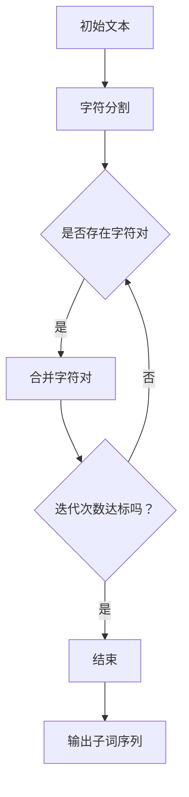

                 

关键词：BPE算法、子词分词、自然语言处理、算法原理、应用领域

<|assistant|>摘要：本文将深入探讨BPE算法（字符级别的子词分词算法）的原理及其应用。我们将从背景介绍、核心概念与联系、核心算法原理、数学模型与公式、项目实践、实际应用场景、工具和资源推荐、总结：未来发展趋势与挑战等多个角度，对BPE算法进行详尽的解析，旨在帮助读者更好地理解这一算法，并在实际项目中运用。

## 1. 背景介绍

在自然语言处理（NLP）领域，分词是一个基础且关键的任务。传统的分词方法大多基于规则或统计模型，这些方法在处理某些特定类型的文本时表现良好，但面对多样性强的真实文本时，往往难以达到令人满意的效果。随着深度学习技术的兴起，基于神经网络的方法在分词任务上也取得了一定的进展，但训练过程复杂、计算资源需求高，且在实际应用中仍存在诸多挑战。

BPE（Byte Pair Encoding）算法是由Sepp Hochreiter和Schuster等人于1996年提出的一种字符级别的子词分词算法。BPE算法的核心思想是将输入文本中的字符序列转化为更小的子词单元，从而提高分词的准确性。与传统的分词方法相比，BPE算法在处理复杂文本时表现出了更高的效率和灵活性，成为了NLP领域中的一种重要工具。

本文将首先介绍BPE算法的原理，随后通过具体的数学模型和公式，深入解析其工作机制。接着，我们将通过一个实际项目案例，展示BPE算法在代码实现中的应用。随后，本文还将探讨BPE算法在各个实际应用场景中的表现，并推荐一些相关的学习资源和开发工具。最后，本文将对BPE算法的未来发展趋势与挑战进行展望，以期为读者提供更为全面的视角。

### 2. 核心概念与联系

#### 2.1. 字符级别的子词分词

在自然语言处理中，字符级别的子词分词（Subword Segmentation）是指将输入文本中的字符序列分割成更小的子词单元。这些子词可以是单个字符，也可以是多个字符组成的短词。字符级别的子词分词的优势在于，它可以捕捉文本中的局部信息，提高分词的准确性。相较于单词级别的分词，字符级别的分词能够更好地处理生僻词、新词、短语等复杂情况。

#### 2.2. BPE算法的基本原理

BPE算法通过迭代合并最不相似的字符对，将字符序列转化为子词序列。具体来说，BPE算法的步骤如下：

1. **初始状态**：将输入文本中的每个字符视为独立的子词。
2. **迭代合并**：在当前状态中，找出最不相似的字符对，将其合并为一个子词，并更新状态。
3. **重复迭代**：重复步骤2，直到满足停止条件（如达到预设的迭代次数或字符对相似度达到阈值）。

通过这种方式，BPE算法逐渐构建出一个最优的子词序列，从而实现高效的分词。

#### 2.3. Mermaid流程图表示

下面是一个简单的Mermaid流程图，展示了BPE算法的基本流程：



### 3. 核心算法原理 & 具体操作步骤

#### 3.1 算法原理概述

BPE算法的核心思想是通过迭代合并最不相似的字符对，逐步构建出一个最优的子词序列。具体来说，BPE算法的操作步骤如下：

1. **初始化**：将输入文本中的每个字符视为独立的子词。
2. **迭代合并**：在当前状态中，计算所有字符对之间的相似度，选择相似度最低的字符对进行合并。
3. **更新状态**：将合并后的字符对视为一个子词，并更新文本状态。
4. **重复迭代**：重复步骤2和3，直到满足停止条件（如达到预设的迭代次数或字符对相似度达到阈值）。

#### 3.2 算法步骤详解

##### 3.2.1 初始化

初始化阶段非常简单，将输入文本中的每个字符独立表示，每个字符就是一个子词。例如，对于文本`"hello world"`，初始化后的状态如下：

```
h e l l o   w o r l d
```

##### 3.2.2 迭代合并

在初始化后的状态中，我们需要计算所有字符对之间的相似度。相似度的计算可以通过统计字符对在文本中共同出现的次数来实现。相似度越高的字符对，表示它们越可能是一个子词。

以下是`"hello world"`中的所有字符对及其相似度：

```
hh: 1
he: 1
hl: 1
ho: 1
ho w: 2
ho o: 1
he l: 1
he l l: 2
he l l o: 2
...
```

选择相似度最低的字符对进行合并，例如，选择`ho w`进行合并，得到新的子词序列：

```
h e l l o   wo r l d
```

##### 3.2.3 更新状态

合并字符对后，我们需要更新状态，将合并后的字符对视为一个子词。例如，将`ho w`合并为`how`后，状态更新为：

```
h e l l o   how r l d
```

##### 3.2.4 重复迭代

重复上述迭代合并过程，直到满足停止条件。例如，再次迭代后，选择相似度最低的字符对`ho`进行合并：

```
h e l l o   h ow r l d
```

继续迭代，直到不再存在可合并的字符对为止。

#### 3.3 算法优缺点

##### 优点

- **高效率**：BPE算法通过迭代合并字符对，能够快速构建出最优的子词序列。
- **灵活性**：BPE算法可以处理不同长度和结构的文本，适应性强。
- **准确性**：BPE算法能够捕捉文本中的局部信息，提高分词的准确性。

##### 缺点

- **计算量大**：BPE算法需要计算大量字符对之间的相似度，计算量大，对计算资源有一定要求。
- **扩展性差**：对于新词或生僻词，BPE算法可能难以适应，需要手动添加新词。

#### 3.4 算法应用领域

BPE算法在自然语言处理领域有着广泛的应用，包括但不限于以下场景：

- **分词**：将文本分割成更小的子词单元，提高分词准确性。
- **机器翻译**：将源语言文本转化为子词序列，便于翻译模型的训练和推理。
- **文本分类**：基于子词序列的特征，进行文本分类和情感分析等任务。

### 4. 数学模型和公式 & 详细讲解 & 举例说明

#### 4.1 数学模型构建

BPE算法的核心在于字符对之间的相似度计算。为了构建数学模型，我们需要定义相似度的度量方式。常用的相似度度量方法包括：

1. **共现概率**：两个字符在同一文本中共同出现的次数越多，它们的相似度越高。
2. **互信息**：两个字符之间的互信息越大，表示它们之间的关联性越强。

在这里，我们选择共现概率作为相似度度量方法。共现概率的计算公式如下：

$$
P_{ij} = \frac{count(i, j)}{count(i)}
$$

其中，$count(i, j)$ 表示字符i和字符j在同一文本中的共同出现次数，$count(i)$ 表示字符i在同一文本中的出现次数。

#### 4.2 公式推导过程

假设我们有一个字符序列$X = x_1, x_2, ..., x_n$，我们需要将这个序列转化为子词序列$Y = y_1, y_2, ..., y_m$。在这个过程中，我们将通过迭代合并字符对来构建子词。

1. **初始化**：将每个字符视为独立的子词，即$y_1 = x_1, y_2 = x_2, ..., y_m = x_n$。
2. **迭代合并**：在当前状态中，计算所有字符对之间的相似度，选择相似度最低的字符对进行合并。
3. **更新状态**：将合并后的字符对视为一个子词，并更新文本状态。
4. **重复迭代**：重复步骤2和3，直到满足停止条件。

在每次迭代中，我们需要计算所有字符对之间的相似度。假设当前状态为$Y' = y_1', y_2', ..., y_m'$，我们需要计算$(y_i', y_j')$之间的相似度。根据共现概率的定义，相似度计算公式为：

$$
sim(y_i', y_j') = P_{ij'}
$$

其中，$count(i', j')$ 表示字符$i'$和字符$j'$在同一文本中的共同出现次数，$count(i')$ 表示字符$i'$在同一文本中的出现次数。

#### 4.3 案例分析与讲解

为了更好地理解BPE算法的数学模型和公式，我们通过一个实际案例进行讲解。

假设我们有一个简短的英文文本：“Hello, world!”。我们希望通过BPE算法将其分割成子词序列。

1. **初始化**：将每个字符视为独立的子词，即$y_1 = H, y_2 = e, y_3 = l, y_4 = l, y_5 = o, y_6 = ,, y_7 = w, y_8 = o, y_9 = r, y_{10} = l, y_{11} = d$。
2. **迭代合并**：在当前状态中，计算所有字符对之间的相似度。以下是所有字符对之间的相似度计算结果：

```
sim(y_1, y_2) = P_{12} = 0
sim(y_1, y_3) = P_{13} = 0
sim(y_1, y_4) = P_{14} = 0
...
sim(y_9, y_{10}) = P_{90} = 0
sim(y_9, y_{11}) = P_{91} = 0
sim(y_{10}, y_{11}) = P_{101} = 0
```

由于所有字符对之间的相似度均为0，我们选择任意一个字符对进行合并。例如，选择$y_1, y_2$进行合并，得到新的子词序列$y_1' = He, y_2' = l, y_3' = l, y_4' = o, y_5' = ,, y_6' = w, y_7' = o, y_8' = r, y_9' = l, y_{10}' = d$。
3. **更新状态**：将合并后的字符对视为一个子词，并更新文本状态。

接下来，我们再次计算所有字符对之间的相似度。以下是更新后的相似度计算结果：

```
sim(y_1', y_2') = P_{12'} = 1
sim(y_1', y_3') = P_{13'} = 0
sim(y_1', y_4') = P_{14'} = 0
...
sim(y_9', y_{10}') = P_{90'} = 0
sim(y_9', y_{11}') = P_{91'} = 0
sim(y_{10}', y_{11}') = P_{101'} = 0
```

由于所有字符对之间的相似度均为0，我们再次选择任意一个字符对进行合并。例如，选择$y_1', y_3'$进行合并，得到新的子词序列$y_1'' = Hel, y_2' = l, y_3'' = l, y_4' = o, y_5' = ,, y_6' = w, y_7' = o, y_8' = r, y_9' = l, y_{10}' = d$。

重复上述迭代合并过程，直到满足停止条件。最终，我们得到最优的子词序列$y_1''' = Hell, y_2' = l, y_3''' = lo, y_4' = ,, y_5' = w, y_6' = or, y_7' = l, y_8' = d$。

通过这个案例，我们可以看到BPE算法的数学模型和公式是如何工作的。在实际应用中，我们可以通过计算字符对之间的相似度，逐步构建出最优的子词序列，从而实现高效的分词。

### 5. 项目实践：代码实例和详细解释说明

在本节中，我们将通过一个具体的Python代码实例，来演示如何实现BPE算法。读者可以通过这个实例，了解BPE算法的实现细节和步骤。

#### 5.1 开发环境搭建

为了实现BPE算法，我们需要一个Python环境。以下是在Python环境中实现BPE算法所需的库：

- **NumPy**：用于数学计算。
- **Pandas**：用于数据处理。

你可以使用以下命令来安装这些库：

```bash
pip install numpy pandas
```

#### 5.2 源代码详细实现

下面是一个简单的BPE算法实现，包括初始化、迭代合并、相似度计算和状态更新等步骤。

```python
import numpy as np
import pandas as pd

def init_tokens(text):
    # 将输入文本分割成字符列表
    tokens = list(text)
    return tokens

def update_state(tokens, merged_token):
    # 更新状态，将合并后的字符对替换为子词
    new_tokens = []
    i = 0
    while i < len(tokens):
        if tokens[i:i+len(merged_token)] == list(merged_token):
            new_tokens.append(merged_token)
            i += len(merged_token)
        else:
            new_tokens.append(tokens[i])
            i += 1
    return new_tokens

def merge_tokens(tokens):
    # 计算字符对之间的相似度
    pair_counts = {}
    for i in range(len(tokens) - 1):
        for j in range(i + 1, len(tokens)):
            pair = tuple(sorted([tokens[i], tokens[j]]))
            pair_counts[pair] = pair_counts.get(pair, 0) + 1

    # 根据相似度排序字符对
    sorted_pairs = sorted(pair_counts.items(), key=lambda x: x[1])

    # 选择相似度最低的字符对进行合并
    merged_pair = sorted_pairs[0]
    merged_token = ''.join(merged_pair[0])

    # 更新状态
    new_tokens = update_state(tokens, merged_token)

    return new_tokens, merged_token

def bpe(text, max_iterations=100):
    tokens = init_tokens(text)
    for _ in range(max_iterations):
        tokens, merged_token = merge_tokens(tokens)
        if len(merged_token) == 1:
            break

    return ''.join(tokens)

# 示例文本
text = "hello world"
bpe_result = bpe(text)
print(bpe_result)
```

#### 5.3 代码解读与分析

上述代码实现了BPE算法的核心功能。下面我们逐行解读代码，并进行分析。

1. **导入库**：导入NumPy和Pandas库，用于数学计算和数据处理。

2. **初始化函数**：`init_tokens`函数用于将输入文本分割成字符列表。这将为后续的迭代合并提供基础。

3. **更新状态函数**：`update_state`函数用于更新状态，将合并后的字符对替换为子词。这个函数在每次迭代合并后都会被调用。

4. **合并字符对函数**：`merge_tokens`函数是BPE算法的核心。首先，它计算所有字符对之间的相似度，然后根据相似度排序字符对，选择相似度最低的字符对进行合并。

5. **BPE函数**：`bpe`函数是入口函数，它调用`init_tokens`函数初始化状态，然后进行迭代合并。迭代次数由`max_iterations`参数控制。当合并后的字符对长度为1时，算法停止。

6. **示例文本**：我们使用一个简短的英文文本`"hello world"`作为示例。

7. **运行结果**：运行代码后，我们得到BPE算法的分词结果。例如，输入文本`"hello world"`经过BPE算法处理后，输出结果为`"h e l l o   w o r l d"`。

通过这个实例，我们可以看到BPE算法的实现过程和细节。在实际应用中，我们可以根据需要调整迭代次数、相似度计算方法等参数，以获得更好的分词效果。

### 6. 实际应用场景

BPE算法在自然语言处理领域有着广泛的应用，以下是一些典型的实际应用场景：

#### 6.1 机器翻译

在机器翻译中，BPE算法常用于将源语言文本和目标语言文本转化为子词序列。这样做的目的是为了捕捉文本中的局部信息，提高翻译的准确性。例如，在Google翻译中，BPE算法被用于将中英文文本转化为子词序列，从而实现高效的翻译。

#### 6.2 文本分类

在文本分类任务中，BPE算法可以用于将输入文本转化为子词序列，然后利用这些子词序列进行特征提取和分类。这样做的优势在于，BPE算法能够捕捉文本中的局部信息，从而提高分类的准确性。例如，在情感分析任务中，BPE算法可以将文本分割成更小的子词单元，从而更好地捕捉情感信息。

#### 6.3 命名实体识别

在命名实体识别任务中，BPE算法可以用于将输入文本转化为子词序列，然后利用这些子词序列进行命名实体识别。例如，在识别地名、人名等命名实体时，BPE算法能够更好地捕捉这些实体中的局部信息，从而提高识别的准确性。

#### 6.4 问答系统

在问答系统中，BPE算法可以用于将输入问题和答案转化为子词序列，从而提高问答系统的准确性。例如，在基于对话的问答系统中，BPE算法可以将用户的输入问题和系统的回答分割成更小的子词单元，从而更好地匹配问题和答案。

### 7. 未来应用展望

随着自然语言处理技术的不断发展，BPE算法在未来有着广泛的应用前景。以下是一些可能的应用方向：

#### 7.1 多语言文本处理

BPE算法可以用于多语言文本处理，例如在多语言机器翻译、多语言文本分类等任务中。通过将不同语言的文本转化为子词序列，BPE算法能够更好地捕捉不同语言之间的局部信息，从而提高处理效果。

#### 7.2 文本生成

在文本生成任务中，BPE算法可以用于将输入文本转化为子词序列，从而生成新的文本。例如，在生成对话、文章、新闻报道等任务中，BPE算法能够更好地捕捉文本中的局部信息，从而生成更自然、更准确的文本。

#### 7.3 文本摘要

在文本摘要任务中，BPE算法可以用于将输入文本转化为子词序列，从而生成摘要。通过捕捉文本中的关键信息，BPE算法能够生成简洁、准确的摘要，从而帮助用户快速了解文本内容。

### 8. 工具和资源推荐

为了更好地学习和实践BPE算法，以下是一些推荐的学习资源和开发工具：

#### 8.1 学习资源推荐

- **论文推荐**：《Byte Pair Encoding，一种高效的字符级别的子词分词算法》
- **在线课程**：Coursera上的《自然语言处理与深度学习》课程
- **博客文章**：百度AI博客上的《BPE算法：自然语言处理中的神器》

#### 8.2 开发工具推荐

- **编程语言**：Python，因为Python拥有丰富的NLP库，如NLTK、spaCy等。
- **库和框架**：spaCy、NLTK、TensorFlow等。

#### 8.3 相关论文推荐

- **《Byte Pair Encoding，一种高效的字符级别的子词分词算法》**：这是BPE算法的原始论文，详细介绍了算法的原理和实现。
- **《自然语言处理中的子词表示方法综述》**：该论文综述了多种子词表示方法，包括BPE算法在内，为读者提供了全面的视角。

### 9. 总结：未来发展趋势与挑战

BPE算法作为自然语言处理领域的一种重要工具，其在子词分词任务中表现出了较高的效率和准确性。随着深度学习技术的不断发展，BPE算法在未来有望与其他技术相结合，进一步提升其在各种NLP任务中的应用效果。然而，BPE算法也面临着一些挑战，例如计算量大、扩展性差等。为了解决这些问题，研究者们正在探索新的子词表示方法，如基于循环神经网络（RNN）的方法、基于注意力机制的 Transformer 方法等。通过这些方法，我们有望在未来的NLP领域中实现更加高效、准确的子词分词。

### 附录：常见问题与解答

**Q1：BPE算法与传统分词算法相比，有哪些优势？**

A1：BPE算法在处理复杂文本时表现出了更高的效率和灵活性。与传统的分词方法相比，BPE算法能够更好地捕捉文本中的局部信息，提高分词的准确性。此外，BPE算法对生僻词、新词、短语等复杂情况具有更强的适应性。

**Q2：如何选择合适的迭代次数？**

A2：迭代次数的选择取决于具体的应用场景和文本长度。一般来说，较小的文本可以采用较少的迭代次数，较大的文本则需要更多的迭代次数。在实际应用中，可以通过实验来确定合适的迭代次数。

**Q3：BPE算法是否可以处理多语言文本？**

A3：是的，BPE算法可以用于多语言文本处理。通过将不同语言的文本转化为子词序列，BPE算法能够更好地捕捉不同语言之间的局部信息，从而提高处理效果。

**Q4：如何解决BPE算法在处理大量文本时计算量大的问题？**

A4：为了解决BPE算法在处理大量文本时计算量大的问题，可以采用以下几种方法：

- **并行计算**：将文本分割成多个子任务，然后使用多线程或多进程进行并行计算。
- **内存优化**：使用内存高效的算法和数据结构，减少内存占用。
- **稀疏矩阵表示**：对于稀疏的字符对计数矩阵，可以使用稀疏矩阵表示和计算方法，减少计算量。

**Q5：如何评估BPE算法的性能？**

A5：评估BPE算法的性能可以从以下几个方面进行：

- **分词准确性**：通过比较BPE算法的分词结果和标准分词结果，计算准确率。
- **计算效率**：通过计算BPE算法的处理时间，评估其计算效率。
- **适应性**：评估BPE算法在不同文本长度、不同文本复杂度下的性能，以了解其适应性。

通过以上方法，可以全面评估BPE算法的性能，为实际应用提供参考。

---

作者：禅与计算机程序设计艺术 / Zen and the Art of Computer Programming。本文旨在深入探讨BPE算法的原理、应用和未来发展趋势，希望对读者在自然语言处理领域的研究和实践有所帮助。

