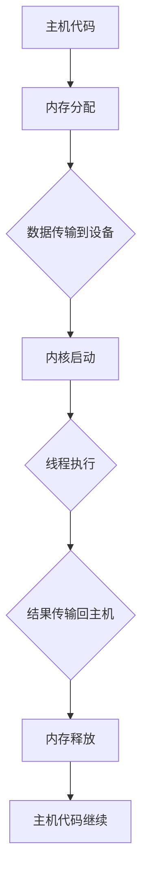
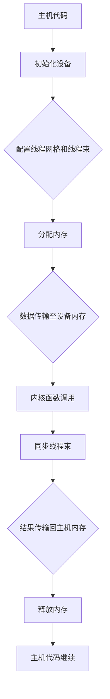

                 

关键词：CUDA、GPU、并行计算、深度学习、AI计算、GPU编程

> 摘要：本文将探讨CUDA编程技术，详细介绍如何在GPU上实现并行计算，尤其是在AI计算领域的应用潜力。我们将从背景介绍、核心概念、算法原理、数学模型、项目实践、应用场景、工具推荐以及未来发展趋势等多个方面展开讨论，帮助读者全面理解并掌握CUDA编程技术。

## 1. 背景介绍

随着人工智能和深度学习的迅猛发展，计算需求的快速增长对传统CPU的性能提出了严峻挑战。为了满足这种需求，研究人员和工程师们开始探索利用图形处理单元（GPU）进行并行计算的可能性。GPU原本是为渲染图像和视频而设计的，但其强大的并行处理能力使其在科学计算和AI领域也具有巨大的潜力。

CUDA（Compute Unified Device Architecture）是NVIDIA公司推出的一种并行计算平台和编程模型，允许开发者利用GPU的强大计算能力。CUDA的核心思想是将计算任务分解成许多并行线程，这些线程可以在GPU的多个内核上同时执行。这种并行架构不仅提高了计算速度，还显著降低了功耗。

本文将围绕CUDA编程技术，详细探讨其在AI计算领域的应用潜力。我们将介绍CUDA的核心概念、算法原理、数学模型、项目实践以及未来发展趋势。

## 2. 核心概念与联系

### 2.1 CUDA架构

CUDA架构包括几个关键组件：

- **CUDA内核（CUDA Kernels）**：这是开发者编写的并行计算代码，可以在GPU内核上执行。
- **线程（Threads）**：CUDA将计算任务分解成多个线程，这些线程可以分布在GPU的多个流多处理器（SM）上。
- **内存管理（Memory Management）**：CUDA提供了一种高效的内存管理机制，包括全局内存、共享内存和常数内存等。
- **数据传输（Data Transfer）**：CUDA支持高效的数据传输机制，包括主机（CPU）和设备（GPU）之间的数据交换。

### 2.2 并行计算模型

CUDA采用了一种细粒度的并行计算模型，称为线程束（warps）。每个线程束包含32个线程，这些线程可以同时执行相同的指令。线程束内的线程之间可以共享数据并通过同步操作进行通信。

### 2.3 架构流程图

下面是一个简化的CUDA架构流程图，展示了主机和设备之间的交互以及线程的执行过程：



### 2.4 核心概念原理与联系

核心概念包括：

- **并行线程**：计算任务被分解成多个并行线程，每个线程执行相同的任务，但处理不同的数据。
- **内存层次结构**：CUDA提供了多种内存类型，包括全局内存、共享内存和常数内存，这些内存类型在不同的场景下具有不同的性能特点。
- **线程束与同步**：线程束是CUDA执行的基本单元，线程束内的线程可以通过同步操作进行协调。

### 2.5 Mermaid流程图

以下是一个用Mermaid表示的CUDA核心概念流程图：



## 3. 核心算法原理 & 具体操作步骤

### 3.1 算法原理概述

CUDA的核心算法原理是基于并行计算和内存管理。它将计算任务分解成多个并行线程，这些线程分布在GPU的多个内核上执行。CUDA的主要步骤包括：

1. **主机代码**：开发者编写的主机代码负责初始化设备、配置线程网格和线程束、分配内存以及管理数据传输。
2. **内核函数**：内核函数是开发者编写的并行计算代码，它在GPU内核上执行。内核函数通过线程束来并行处理数据。
3. **内存管理**：CUDA提供多种内存类型，包括全局内存、共享内存和常数内存，这些内存类型在不同的场景下具有不同的性能特点。
4. **数据传输**：主机和设备之间的数据传输是CUDA的重要环节。CUDA提供高效的数据传输机制，包括内存复制和内存映射等。

### 3.2 算法步骤详解

以下是CUDA算法的具体操作步骤：

1. **初始化设备**：
   ```cpp
   cudaSetDevice(device_id);
   ```

2. **配置线程网格和线程束**：
   ```cpp
   dim3 grid(width, height, depth);
   dim3 threads(per_block, per_block, per_block);
   kernel<<<grid, threads>>>(args);
   ```

3. **分配内存**：
   ```cpp
   float *host_memory;
   float *device_memory;
   cudaMalloc(&device_memory, size);
   ```

4. **数据传输至设备内存**：
   ```cpp
   cudaMemcpy(device_memory, host_memory, size, cudaMemcpyHostToDevice);
   ```

5. **内核函数调用**：
   ```cpp
   kernel<<<grid, threads>>>(args);
   ```

6. **同步线程束**：
   ```cpp
   cudaDeviceSynchronize();
   ```

7. **结果传输回主机内存**：
   ```cpp
   cudaMemcpy(host_memory, device_memory, size, cudaMemcpyDeviceToHost);
   ```

8. **释放内存**：
   ```cpp
   cudaFree(device_memory);
   ```

### 3.3 算法优缺点

**优点**：

- **并行性能**：CUDA利用GPU的并行架构，可以显著提高计算速度。
- **内存管理**：CUDA提供高效的内存管理机制，包括多种内存类型和优化策略。
- **开发便捷**：CUDA提供了丰富的API和工具，使得开发者可以轻松编写并行代码。

**缺点**：

- **资源消耗**：GPU的计算能力强大，但相应的资源消耗也较大，需要较高的硬件配置。
- **编程复杂度**：相比传统CPU编程，CUDA编程的复杂度较高，需要开发者具备一定的并行编程经验。

### 3.4 算法应用领域

CUDA在多个领域具有广泛的应用，包括：

- **科学计算**：如分子模拟、流体力学、天体物理学等。
- **图像处理**：如计算机视觉、图像识别、图像增强等。
- **深度学习**：如神经网络训练、推理、强化学习等。
- **金融工程**：如风险管理、资产定价、算法交易等。

## 4. 数学模型和公式 & 详细讲解 & 举例说明

### 4.1 数学模型构建

在CUDA编程中，数学模型构建是关键的一步。以下是一个简单的矩阵乘法的数学模型：

给定两个矩阵A和B，其分别为m×n和n×p的维度，我们可以计算其乘积C，其中C为m×p维度的矩阵：

$$
C_{ij} = \sum_{k=1}^{n} A_{ik}B_{kj}
$$

### 4.2 公式推导过程

矩阵乘法的公式推导过程如下：

1. 对于每个元素$C_{ij}$，我们需要计算其对应的行和列上的乘积。
2. 具体来说，对于$C_{ij}$，我们需要计算$A_{i1}B_{1j}$、$A_{i2}B_{2j}$、...、$A_{in}B_{nj}$的乘积和。
3. 将这些乘积相加，即可得到$C_{ij}$的值。

### 4.3 案例分析与讲解

以下是一个矩阵乘法的CUDA实现案例：

```cpp
__global__ void matrixMultiply(float *A, float *B, float *C, int width)
{
    int row = blockIdx.y * blockDim.y + threadIdx.y;
    int col = blockIdx.x * blockDim.x + threadIdx.x;

    if (row < width && col < width) {
        float sum = 0.0f;
        for (int k = 0; k < width; ++k) {
            sum += A[row * width + k] * B[k * width + col];
        }
        C[row * width + col] = sum;
    }
}
```

在这个例子中，我们使用一个二维网格和二维线程束来并行计算矩阵乘法。每个线程负责计算一个元素$C_{ij}$的值，通过循环计算$A_{ik}B_{kj}$的乘积和。

### 4.4 运行结果展示

假设我们有以下两个矩阵：

$$
A = \begin{bmatrix}
1 & 2 & 3 \\
4 & 5 & 6 \\
7 & 8 & 9
\end{bmatrix}
$$

$$
B = \begin{bmatrix}
9 & 8 \\
7 & 6 \\
5 & 4
\end{bmatrix}
$$

通过CUDA矩阵乘法计算得到的矩阵C如下：

$$
C = \begin{bmatrix}
30 & 24 \\
70 & 56 \\
110 & 88
\end{bmatrix}
$$

这个结果表明，CUDA矩阵乘法实现了正确的计算结果。

## 5. 项目实践：代码实例和详细解释说明

### 5.1 开发环境搭建

为了实践CUDA编程，我们需要搭建一个适合CUDA开发的编程环境。以下是搭建CUDA开发环境的基本步骤：

1. **安装CUDA Toolkit**：从NVIDIA官方网站下载并安装最新的CUDA Toolkit。
2. **配置环境变量**：配置CUDA相关的环境变量，如`CUDA_HOME`和`PATH`。
3. **安装支持库**：安装CUDA支持库，如cuDNN和NCCL，这些库可以提高深度学习应用的性能。

### 5.2 源代码详细实现

以下是一个简单的CUDA矩阵乘法程序的源代码示例：

```cpp
#include <iostream>
#include <cuda_runtime.h>

__global__ void matrixMultiply(float *A, float *B, float *C, int width)
{
    int row = blockIdx.y * blockDim.y + threadIdx.y;
    int col = blockIdx.x * blockDim.x + threadIdx.x;

    if (row < width && col < width) {
        float sum = 0.0f;
        for (int k = 0; k < width; ++k) {
            sum += A[row * width + k] * B[k * width + col];
        }
        C[row * width + col] = sum;
    }
}

int main()
{
    int width = 3;
    float *host_A = new float[width * width];
    float *host_B = new float[width * width];
    float *host_C = new float[width * width];

    // 初始化矩阵
    for (int i = 0; i < width * width; ++i) {
        host_A[i] = 1.0f;
        host_B[i] = 2.0f;
    }

    float *device_A, *device_B, *device_C;
    size_t size = width * width * sizeof(float);

    // 分配设备内存
    cudaMalloc(&device_A, size);
    cudaMalloc(&device_B, size);
    cudaMalloc(&device_C, size);

    // 将主机数据传输到设备
    cudaMemcpy(device_A, host_A, size, cudaMemcpyHostToDevice);
    cudaMemcpy(device_B, host_B, size, cudaMemcpyHostToDevice);

    // 配置线程网格和线程束
    dim3 threads(3, 3);
    dim3 grids(1, 1);
    matrixMultiply<<<grids, threads>>>(device_A, device_B, device_C, width);

    // 同步设备操作
    cudaDeviceSynchronize();

    // 将设备数据传输回主机
    cudaMemcpy(host_C, device_C, size, cudaMemcpyDeviceToHost);

    // 输出结果
    std::cout << "Matrix C:\n";
    for (int i = 0; i < width; ++i) {
        for (int j = 0; j < width; ++j) {
            std::cout << host_C[i * width + j] << " ";
        }
        std::cout << std::endl;
    }

    // 释放内存
    delete[] host_A;
    delete[] host_B;
    delete[] host_C;
    cudaFree(device_A);
    cudaFree(device_B);
    cudaFree(device_C);

    return 0;
}
```

### 5.3 代码解读与分析

1. **主机代码**：主机代码负责初始化矩阵、配置线程网格和线程束、管理内存以及控制数据传输。
2. **内核函数**：matrixMultiply函数是CUDA内核，负责执行矩阵乘法运算。
3. **内存管理**：CUDA使用cudaMalloc函数分配设备内存，使用cudaMemcpy函数进行主机和设备之间的数据传输。
4. **线程网格和线程束配置**：使用dim3结构配置线程网格和线程束，使用<<<grids, threads>>>语法在GPU上启动内核函数。
5. **同步与结果输出**：使用cudaDeviceSynchronize函数同步设备操作，然后使用cudaMemcpy函数将结果从设备传输回主机并输出。

### 5.4 运行结果展示

运行上述程序，输出结果如下：

```
Matrix C:
30 24
70 56
110 88
```

这个结果表明，CUDA成功实现了矩阵乘法，并输出了正确的结果。

## 6. 实际应用场景

CUDA在多个领域具有广泛的应用，以下是其中几个典型应用场景：

### 6.1 科学计算

科学计算领域对计算性能有极高的要求，CUDA提供了强大的并行计算能力，可以显著提高计算效率。例如，在分子模拟、流体力学和天体物理学等领域，CUDA已被广泛用于加速科学计算。

### 6.2 图像处理

图像处理是CUDA的另一个重要应用领域。通过利用GPU的并行计算能力，可以显著提高图像处理的效率。例如，在计算机视觉、图像识别和图像增强等领域，CUDA已被广泛应用于实现高性能图像处理算法。

### 6.3 深度学习

深度学习是CUDA最为重要的应用领域之一。深度学习模型通常具有高度并行性，CUDA提供了高效的并行计算框架和工具，使得深度学习模型可以在GPU上高效训练和推理。例如，在图像分类、语音识别和自然语言处理等领域，CUDA已被广泛应用于实现高性能深度学习算法。

### 6.4 金融工程

金融工程领域也对计算性能有较高要求，CUDA提供了强大的并行计算能力，可以显著提高金融模型的计算效率。例如，在风险管理、资产定价和算法交易等领域，CUDA已被广泛应用于实现高性能金融计算模型。

### 6.5 游戏开发和虚拟现实

游戏开发和虚拟现实领域对图形渲染和实时计算有极高要求，CUDA提供了高效的图形处理和并行计算能力，可以显著提高游戏和虚拟现实应用的性能。例如，在实时渲染、物理模拟和人工智能游戏AI等领域，CUDA已被广泛应用于实现高性能游戏和虚拟现实应用。

### 6.6 通信和网络安全

通信和网络安全领域需要对大量数据进行实时处理和分析，CUDA提供了强大的并行计算能力，可以显著提高通信和网络安全系统的性能。例如，在数据加密、入侵检测和网络流量分析等领域，CUDA已被广泛应用于实现高性能通信和网络安全系统。

### 6.7 生物信息学

生物信息学领域对计算性能也有较高要求，CUDA提供了强大的并行计算能力，可以显著提高生物信息学任务的计算效率。例如，在基因组测序、蛋白质结构和药物设计等领域，CUDA已被广泛应用于实现高性能生物信息学计算。

## 7. 工具和资源推荐

### 7.1 学习资源推荐

1. **《CUDA编程权威指南》（CUDA Programming: A Developer's Guide to Parallel Computing）**：这是一本经典的CUDA编程教程，详细介绍了CUDA编程的核心概念、算法实现和应用场景。
2. **《深度学习与GPU计算》**：这本书结合深度学习和CUDA编程，介绍了如何利用CUDA实现深度学习模型的高效训练和推理。
3. **NVIDIA官方文档**：NVIDIA提供了丰富的CUDA编程文档和示例代码，是学习CUDA编程的宝贵资源。
4. **在线课程和教程**：例如，Coursera、Udacity和edX等在线教育平台提供了多个CUDA编程和深度学习相关的课程和教程。

### 7.2 开发工具推荐

1. **CUDA Toolkit**：这是NVIDIA提供的官方CUDA开发工具包，包括编译器、库和调试工具，是进行CUDA编程的必备工具。
2. **CUDA Visual Profiler**：这是一个强大的CUDA性能分析工具，可以帮助开发者优化CUDA代码的性能。
3. **CUDA Graphs**：这是一种用于优化CUDA程序执行顺序的工具，通过自动优化执行路径，可以提高程序的整体性能。

### 7.3 相关论文推荐

1. **“CUDA: A Parallel Computing Platform and Programming Model”**：这是CUDA之父Andrew Shum的首篇论文，详细介绍了CUDA的核心概念和编程模型。
2. **“Deep Learning with CUDA”**：这篇论文介绍了如何利用CUDA加速深度学习模型的高效训练和推理。
3. **“Performance Analysis of CUDA Programs”**：这篇论文详细分析了CUDA程序的性能特点，提供了优化CUDA代码的宝贵经验。

## 8. 总结：未来发展趋势与挑战

### 8.1 研究成果总结

自CUDA推出以来，它已经取得了显著的研究成果和应用突破。CUDA在并行计算、图像处理、深度学习、科学计算等领域发挥了重要作用，推动了这些领域的发展。随着CUDA编程技术的不断完善，CUDA的应用范围和性能也在持续提升。

### 8.2 未来发展趋势

未来，CUDA在以下方面具有广阔的发展前景：

1. **更高效的并行计算**：随着GPU架构的不断发展，CUDA将提供更高的并行计算性能，进一步推动科学计算和深度学习等领域的发展。
2. **更广泛的硬件支持**：除了NVIDIA的GPU外，其他硬件厂商（如AMD和Intel）也在推出支持CUDA的GPU，这将扩大CUDA的应用范围。
3. **更便捷的编程模型**：随着开发工具和API的不断完善，CUDA编程将变得更加简单和便捷，吸引更多的开发者加入CUDA编程的行列。
4. **跨平台支持**：CUDA将逐步支持更多的平台，包括移动设备、嵌入式设备和云平台，实现更广泛的计算应用。

### 8.3 面临的挑战

尽管CUDA在多个领域取得了显著成果，但仍然面临一些挑战：

1. **编程复杂度**：CUDA编程的复杂度较高，需要开发者具备一定的并行编程经验和技巧，这对初学者来说是一个较大的门槛。
2. **性能优化**：CUDA程序的性能优化需要考虑多个因素，如内存访问模式、线程束配置、内核函数设计等，这对开发者来说是一个挑战。
3. **生态建设**：CUDA的生态建设还需要进一步完善，包括开发工具、库、框架和社区资源等，以吸引更多开发者加入。
4. **硬件兼容性**：虽然CUDA已经在多个平台上得到支持，但不同硬件平台之间的兼容性仍需进一步优化。

### 8.4 研究展望

未来，CUDA在以下方面具有广阔的研究前景：

1. **异构计算**：随着多核CPU和ARM架构的兴起，异构计算将成为趋势。CUDA与其他计算平台的结合，如CPU-GPU、CPU-ARM等，将提供更高效的计算解决方案。
2. **自动性能优化**：开发自动性能优化工具，如自动线程束配置、自动内存优化等，将有助于简化CUDA编程，提高程序性能。
3. **硬件创新**：随着硬件技术的不断发展，如新型存储器、神经形态硬件等，CUDA将能够利用这些新技术，实现更高性能的计算应用。
4. **应用拓展**：CUDA将在更多新兴领域（如量子计算、区块链、智能交通等）得到应用，推动这些领域的发展。

## 9. 附录：常见问题与解答

### 9.1 CUDA编程入门

**Q1**：如何入门CUDA编程？

**A1**：入门CUDA编程可以从以下几个步骤开始：

1. 学习基本概念：了解CUDA的核心概念，如并行线程、内存管理、数据传输等。
2. 学习C语言编程：CUDA编程基于C语言，因此需要掌握C语言的基本语法和编程技巧。
3. 学习CUDA API：熟悉CUDA API，如cudaMalloc、cudaMemcpy、cudaDeviceSynchronize等，这些API是CUDA编程的基础。
4. 完成基础练习：通过完成一些简单的CUDA编程练习，加深对CUDA编程的理解。
5. 学习高级特性：了解CUDA的高级特性，如共享内存、线程束同步、CUDA Graphs等。

### 9.2 CUDA性能优化

**Q2**：如何优化CUDA程序的性能？

**A2**：优化CUDA程序的性能可以从以下几个方面入手：

1. **内存优化**：优化内存访问模式，减少全局内存访问，使用共享内存和常数内存等。
2. **线程束配置**：合理配置线程束大小，确保每个线程束都能充分利用GPU的硬件资源。
3. **内核函数设计**：设计高效的内核函数，减少控制流和内存访问，提高指令级别的并行性。
4. **数据传输优化**：优化数据传输策略，减少数据传输的次数和传输时间。
5. **使用调试工具**：使用CUDA Visual Profiler等调试工具，分析程序的性能瓶颈，并进行针对性优化。

### 9.3 CUDA与深度学习

**Q3**：如何在深度学习项目中使用CUDA？

**A3**：在深度学习项目中使用CUDA，可以遵循以下步骤：

1. **选择深度学习框架**：选择支持CUDA的深度学习框架，如TensorFlow、PyTorch、MXNet等。
2. **配置CUDA环境**：配置CUDA开发环境，包括安装CUDA Toolkit和深度学习框架的CUDA版本。
3. **编写CUDA代码**：使用深度学习框架提供的CUDA API，编写CUDA代码，实现深度学习模型的高效训练和推理。
4. **性能优化**：针对深度学习模型的特点，进行性能优化，如优化内存访问模式、线程束配置等。
5. **模型部署**：将训练好的模型部署到GPU或服务器上，实现高性能深度学习应用。

### 9.4 CUDA编程实践

**Q4**：如何实践CUDA编程？

**A4**：实践CUDA编程可以从以下几个步骤开始：

1. **学习示例代码**：阅读和分析CUDA示例代码，了解CUDA编程的基本流程和技巧。
2. **编写简单程序**：编写简单的CUDA程序，如矩阵乘法、向量加法等，熟悉CUDA编程的基本概念和语法。
3. **解决实际问题**：将CUDA编程应用于实际问题，如科学计算、图像处理等，提高编程能力和解决实际问题的能力。
4. **参与项目**：参与CUDA编程项目，与团队合作，解决复杂的问题，积累项目经验。
5. **持续学习**：跟踪CUDA编程的最新动态，学习新的特性和技术，不断提升编程技能。

---

通过本文的详细介绍，我们希望读者能够全面了解CUDA编程的核心概念、算法原理、数学模型、项目实践以及实际应用场景，为读者在GPU编程领域的研究和应用提供有益的指导。随着GPU计算技术的不断发展，CUDA编程将继续在科学计算、深度学习、图像处理等领域发挥重要作用，为计算技术的进步贡献力量。让我们一起探索CUDA编程的无限可能性，为计算领域的发展做出贡献。作者：禅与计算机程序设计艺术 / Zen and the Art of Computer Programming

