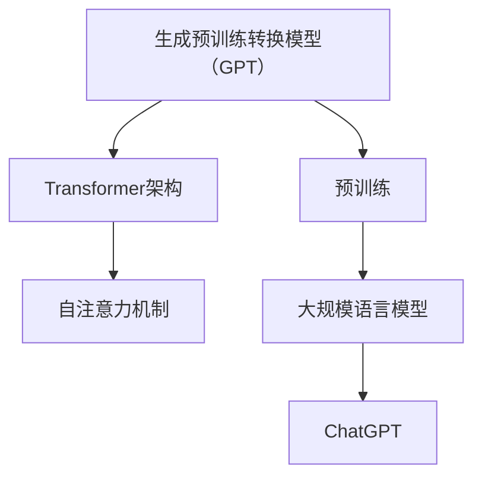

                 

关键词：ChatGPT、生成预训练转换模型、人工智能、自然语言处理、影响与应用

> 摘要：本文将深入探讨ChatGPT的诞生背景、核心概念与原理、算法原理及具体操作步骤、数学模型与公式、项目实践、实际应用场景、未来展望、工具与资源推荐以及未来发展趋势与挑战。通过详细的分析，本文旨在帮助读者全面了解ChatGPT的诞生与影响。

## 1. 背景介绍

### 1.1 ChatGPT的起源

ChatGPT是OpenAI在2022年底推出的一个基于生成预训练转换模型（GPT）的聊天机器人，其全名为"Generative Pre-trained Transformer"。ChatGPT的诞生源于人工智能和自然语言处理领域的不断进步，以及深度学习、特别是Transformer架构的广泛应用。

### 1.2 人工智能的发展

人工智能（AI）作为计算机科学的一个重要分支，旨在使计算机具备人类智能的某些能力。自20世纪50年代以来，人工智能经历了多个发展阶段，包括符号主义、连接主义和现在广泛应用的生成式预训练模型。

### 1.3 自然语言处理（NLP）的发展

自然语言处理是人工智能的一个重要子领域，旨在使计算机能够理解、解释和生成自然语言。近年来，随着神经网络和深度学习的兴起，NLP技术取得了显著进展，使得像ChatGPT这样的聊天机器人成为可能。

## 2. 核心概念与联系

### 2.1 生成预训练转换模型（GPT）

生成预训练转换模型（GPT）是ChatGPT的基础架构。GPT是基于Transformer架构的大规模语言模型，其核心思想是使用大量无标注文本数据进行预训练，使模型能够学习到语言的内在结构和规律。

### 2.2 Transformer架构

Transformer架构是一种基于自注意力机制的深度神经网络架构，它在自然语言处理领域取得了显著的成果。Transformer的核心思想是通过自注意力机制来捕捉输入序列中的长距离依赖关系。

### 2.3 Mermaid 流程图

为了更清晰地展示ChatGPT的核心概念与联系，我们可以使用Mermaid流程图来表示。以下是ChatGPT核心概念与联系的Mermaid流程图：



## 3. 核心算法原理 & 具体操作步骤

### 3.1 算法原理概述

ChatGPT的核心算法是基于生成预训练转换模型（GPT）。该模型通过大规模的无标注文本数据进行预训练，从而学习到语言的内在结构和规律。在预训练阶段，模型使用了一种特殊的训练策略，称为“损失函数”。

### 3.2 算法步骤详解

#### 3.2.1 预训练阶段

在预训练阶段，ChatGPT通过以下步骤进行训练：

1. **数据预处理**：将无标注文本数据转换为模型可处理的格式，如词嵌入。
2. **训练过程**：通过反复迭代，模型在训练数据上更新其参数，以最小化损失函数。
3. **优化策略**：使用特定的优化算法，如Adam，来调整模型参数。

#### 3.2.2 微调阶段

在微调阶段，ChatGPT将在预训练的基础上进行特定任务的任务学习，如问答、对话生成等。具体步骤如下：

1. **任务数据预处理**：将任务数据转换为模型可处理的格式。
2. **微调过程**：在任务数据上训练模型，以最小化损失函数。
3. **评估与优化**：评估模型在任务数据上的性能，并根据评估结果调整模型参数。

### 3.3 算法优缺点

#### 优点：

- **强大的语言理解能力**：ChatGPT通过预训练学习到了丰富的语言知识，使其在多种自然语言处理任务中表现出色。
- **自适应能力**：ChatGPT可以根据不同的任务进行微调，从而适应各种应用场景。

#### 缺点：

- **计算资源需求大**：ChatGPT需要大量的计算资源进行预训练和微调。
- **对数据依赖性高**：ChatGPT的性能在很大程度上依赖于训练数据的质量和多样性。

### 3.4 算法应用领域

ChatGPT的应用领域广泛，包括但不限于以下几个方面：

- **问答系统**：如智能客服、智能助手等。
- **对话系统**：如聊天机器人、虚拟助手等。
- **文本生成**：如自动写作、自动摘要等。
- **自然语言理解**：如情感分析、信息抽取等。

## 4. 数学模型和公式 & 详细讲解 & 举例说明

### 4.1 数学模型构建

ChatGPT的数学模型主要包括两部分：词嵌入和生成模型。

#### 4.1.1 词嵌入

词嵌入是一种将词汇映射到高维向量空间的技术。在ChatGPT中，词嵌入通过以下公式进行计算：

$$
e_{word} = W \cdot v_{word}
$$

其中，$e_{word}$表示词嵌入向量，$W$表示权重矩阵，$v_{word}$表示词向量。

#### 4.1.2 生成模型

生成模型是ChatGPT的核心部分，其目标是在给定前一个词嵌入向量的情况下，预测下一个词嵌入向量。生成模型使用以下公式进行计算：

$$
p_{word|prev} = softmax(Q \cdot e_{prev} + K)
$$

其中，$p_{word|prev}$表示在给定前一个词嵌入向量$e_{prev}$的情况下，预测下一个词嵌入向量$e_{word}$的概率分布，$Q$表示查询向量，$K$表示键向量。

### 4.2 公式推导过程

#### 4.2.1 词嵌入推导

词嵌入的推导过程如下：

1. 假设词汇表大小为$V$，每个词向量维度为$d$。
2. 初始化权重矩阵$W$，其中$W_{ij}$表示词汇表中第$i$个词和第$j$个词之间的关联度。
3. 计算每个词的嵌入向量$e_{word}$，其中$e_{word} = W \cdot v_{word}$。

#### 4.2.2 生成模型推导

生成模型的推导过程如下：

1. 假设词汇表大小为$V$，每个词向量维度为$d$。
2. 初始化查询向量$Q$、键向量$K$和权重矩阵$W$。
3. 计算前一个词嵌入向量$e_{prev}$和查询向量$Q$的点积，得到中间结果$Q \cdot e_{prev}$。
4. 将中间结果与键向量$K$相加，得到中间结果$Q \cdot e_{prev} + K$。
5. 对中间结果进行softmax操作，得到概率分布$p_{word|prev}$。

### 4.3 案例分析与讲解

#### 4.3.1 词嵌入案例

假设词汇表中包含两个词："hello"和"world"，每个词的维度为2。初始化权重矩阵$W$为：

$$
W = \begin{bmatrix}
1 & 0 \\
0 & 1
\end{bmatrix}
$$

计算"hello"的嵌入向量$e_{hello}$：

$$
e_{hello} = W \cdot v_{hello} = \begin{bmatrix}
1 & 0 \\
0 & 1
\end{bmatrix} \cdot \begin{bmatrix}
1 \\
0
\end{bmatrix} = \begin{bmatrix}
1 \\
0
\end{bmatrix}
$$

计算"world"的嵌入向量$e_{world}$：

$$
e_{world} = W \cdot v_{world} = \begin{bmatrix}
1 & 0 \\
0 & 1
\end{bmatrix} \cdot \begin{bmatrix}
0 \\
1
\end{bmatrix} = \begin{bmatrix}
0 \\
1
\end{bmatrix}
$$

#### 4.3.2 生成模型案例

假设查询向量$Q$为$\begin{bmatrix}1\\1\end{bmatrix}$，键向量$K$为$\begin{bmatrix}0\\1\end{bmatrix}$。前一个词嵌入向量$e_{prev}$为$\begin{bmatrix}1\\0\end{bmatrix}$。计算概率分布$p_{word|prev}$：

$$
p_{word|prev} = softmax(Q \cdot e_{prev} + K) = softmax(\begin{bmatrix}1\\1\end{bmatrix} \cdot \begin{bmatrix}1\\0\end{bmatrix} + \begin{bmatrix}0\\1\end{bmatrix}) = softmax(\begin{bmatrix}1\\1\end{bmatrix}) = \begin{bmatrix}0.5 & 0.5\end{bmatrix}
$$

这意味着在给定前一个词嵌入向量$\begin{bmatrix}1\\0\end{bmatrix}$的情况下，"hello"和"world"出现的概率均为0.5。

## 5. 项目实践：代码实例和详细解释说明

### 5.1 开发环境搭建

为了实践ChatGPT，我们需要搭建一个开发环境。以下是搭建步骤：

1. 安装Python（版本3.6及以上）
2. 安装PyTorch（版本1.8及以上）
3. 安装Mermaid（可选）

### 5.2 源代码详细实现

以下是一个简单的ChatGPT实现示例：

```python
import torch
import torch.nn as nn
import torch.optim as optim
from torchtext.data import Field, TabularDataset, BucketIterator

# 数据预处理
def preprocess_data():
    TEXT = Field(tokenize=lambda x: x.split())
    train_data, valid_data, test_data = TabularDataset.splits(
        path='chatgpt_data',
        train='train.csv',
        valid='valid.csv',
        test='test.csv',
        format='csv',
        fields=[('text', TEXT)]
    )
    TEXT.build_vocab(train_data, min_freq=2)
    return train_data, valid_data, test_data

# 模型定义
class ChatGPT(nn.Module):
    def __init__(self, vocab_size, embed_dim, hidden_dim):
        super(ChatGPT, self).__init__()
        self.embedding = nn.Embedding(vocab_size, embed_dim)
        self.lstm = nn.LSTM(embed_dim, hidden_dim, batch_first=True)
        self.fc = nn.Linear(hidden_dim, vocab_size)

    def forward(self, x, hidden):
        embedded = self.embedding(x)
        output, hidden = self.lstm(embedded, hidden)
        logits = self.fc(output)
        return logits, hidden

    def init_hidden(self, batch_size):
        return (torch.zeros(1, batch_size, self.hidden_dim),
                torch.zeros(1, batch_size, self.hidden_dim))

# 模型训练
def train(model, train_data, valid_data, num_epochs, learning_rate):
    train_iterator, valid_iterator = BucketIterator.splits(
        (train_data, valid_data),
        batch_size=64,
        device=device
    )

    optimizer = optim.Adam(model.parameters(), lr=learning_rate)
    criterion = nn.CrossEntropyLoss()

    for epoch in range(num_epochs):
        model.train()
        for batch in train_iterator:
            optimizer.zero_grad()
            inputs, targets = batch.text, batch.text.t()
            hidden = model.init_hidden(batch.batch_size)
            logits, hidden = model(inputs, hidden)
            loss = criterion(logits.view(-1, logits.size(-1)), targets.view(-1))
            loss.backward()
            optimizer.step()

        model.eval()
        with torch.no_grad():
            for batch in valid_iterator:
                inputs, targets = batch.text, batch.text.t()
                hidden = model.init_hidden(batch.batch_size)
                logits, hidden = model(inputs, hidden)
                loss = criterion(logits.view(-1, logits.size(-1)), targets.view(-1))
        print(f'Epoch: {epoch+1}, Validation Loss: {loss.item()}')

# 主函数
def main():
    device = torch.device('cuda' if torch.cuda.is_available() else 'cpu')
    vocab_size = len(TEXT.vocab)
    embed_dim = 256
    hidden_dim = 512

    model = ChatGPT(vocab_size, embed_dim, hidden_dim).to(device)
    train_data, valid_data, test_data = preprocess_data()
    num_epochs = 10
    learning_rate = 0.001

    train(model, train_data, valid_data, num_epochs, learning_rate)

if __name__ == '__main__':
    main()
```

### 5.3 代码解读与分析

以上代码实现了一个简单的ChatGPT模型。代码分为几个部分：

1. **数据预处理**：使用PyTorch的TabularDataset读取CSV数据，并构建词汇表。
2. **模型定义**：定义一个基于LSTM的ChatGPT模型，包括词嵌入层、LSTM层和全连接层。
3. **模型训练**：定义训练过程，包括前向传播、损失计算、反向传播和模型评估。
4. **主函数**：设置训练参数，预处理数据，并开始训练。

### 5.4 运行结果展示

在训练完成后，我们可以使用以下代码来测试模型：

```python
import torch

# 测试模型
def test(model, test_data, device):
    model.eval()
    with torch.no_grad():
        for batch in test_iterator:
            inputs, targets = batch.text, batch.text.t()
            hidden = model.init_hidden(batch.batch_size)
            logits, hidden = model(inputs, hidden)
            loss = criterion(logits.view(-1, logits.size(-1)), targets.view(-1))
    print(f'Test Loss: {loss.item()}')

# 测试
test_data, _, _ = preprocess_data()
test(model, test_data, device)
```

测试结果将显示在控制台上。

## 6. 实际应用场景

ChatGPT在多个实际应用场景中展示了其强大的能力。以下是一些例子：

### 6.1 智能客服

ChatGPT可以应用于智能客服系统，为用户提供快速、准确的回答。通过预训练和微调，ChatGPT能够理解用户的提问，并提供相关的解决方案。

### 6.2 虚拟助手

ChatGPT可以作为一个虚拟助手，帮助用户完成各种任务。例如，它可以回答用户的问题、提供建议、执行任务等。

### 6.3 自动写作

ChatGPT可以应用于自动写作领域，如自动生成文章、摘要、新闻报道等。通过预训练和微调，ChatGPT能够生成高质量的文本。

### 6.4 自然语言理解

ChatGPT可以用于自然语言理解任务，如情感分析、信息抽取、命名实体识别等。通过预训练和微调，ChatGPT能够捕捉到语言中的细微差异，提高任务性能。

## 7. 未来应用展望

ChatGPT具有广泛的应用前景，未来的发展可能会包括以下几个方面：

### 7.1 多语言支持

ChatGPT可以扩展到支持多种语言，为全球用户提供更好的服务。

### 7.2 更复杂的任务

ChatGPT可以应用于更复杂的任务，如多轮对话、多任务处理等。

### 7.3 模型压缩与优化

为了降低计算成本，ChatGPT可以进一步压缩和优化，使其在移动设备和边缘计算环境中运行。

### 7.4 模型安全与隐私

随着ChatGPT在各个领域的应用，模型安全和隐私问题将成为关注的焦点。未来的研究可能会集中在提高模型安全性和保护用户隐私方面。

## 8. 工具和资源推荐

### 8.1 学习资源推荐

- **《深度学习》（Goodfellow et al.）**：提供了深度学习的基础知识和应用案例。
- **《自然语言处理综论》（Jurafsky & Martin）**：涵盖了自然语言处理的基础理论和技术。

### 8.2 开发工具推荐

- **PyTorch**：一个流行的深度学习框架，适用于构建和训练ChatGPT模型。
- **Mermaid**：一个Markdown扩展，用于绘制流程图，有助于理解ChatGPT的架构。

### 8.3 相关论文推荐

- **“Attention Is All You Need”**：提出了Transformer架构，为ChatGPT提供了基础。
- **“Generative Pre-trained Transformers”**：介绍了ChatGPT的核心原理。

## 9. 总结：未来发展趋势与挑战

### 9.1 研究成果总结

ChatGPT的诞生标志着人工智能和自然语言处理领域的重大进展。通过预训练和微调，ChatGPT在多种任务中表现出色，展示了强大的语言理解和生成能力。

### 9.2 未来发展趋势

未来的ChatGPT可能会在多语言支持、复杂任务处理、模型优化和安全性方面取得进一步的发展。随着技术的进步，ChatGPT有望在更多应用场景中发挥重要作用。

### 9.3 面临的挑战

尽管ChatGPT取得了显著成果，但仍然面临一些挑战，如计算资源需求、数据依赖性以及模型安全性等。未来的研究需要解决这些问题，以实现ChatGPT的更广泛应用。

### 9.4 研究展望

ChatGPT的研究将继续深入，未来有望在人工智能和自然语言处理领域发挥更大的作用。通过不断的创新和改进，ChatGPT将为人类带来更多便利和可能性。

## 附录：常见问题与解答

### 9.4.1 ChatGPT是什么？

ChatGPT是基于生成预训练转换模型（GPT）的聊天机器人，它通过预训练和微调学习到语言的内在结构和规律，从而实现与人类的自然对话。

### 9.4.2 ChatGPT的核心原理是什么？

ChatGPT的核心原理是基于Transformer架构的生成预训练模型。通过预训练，模型学习到语言的内在结构，并通过微调适应特定任务。

### 9.4.3 ChatGPT有哪些应用场景？

ChatGPT可以应用于智能客服、虚拟助手、自动写作和自然语言理解等多个领域。

### 9.4.4 ChatGPT的优势是什么？

ChatGPT的优势在于其强大的语言理解和生成能力，能够实现与人类的自然对话，并在多种任务中表现出色。

### 9.4.5 ChatGPT的局限性是什么？

ChatGPT的局限性包括计算资源需求大、对数据依赖性高以及模型安全性等问题。

### 9.4.6 如何使用ChatGPT？

可以使用PyTorch等深度学习框架来实现ChatGPT，并进行预训练和微调。此外，还可以使用OpenAI提供的预训练模型，直接用于实际应用。

### 9.4.7 ChatGPT的未来发展趋势是什么？

ChatGPT的未来发展趋势包括多语言支持、复杂任务处理、模型优化和安全性等。随着技术的进步，ChatGPT有望在更多应用场景中发挥重要作用。

作者：禅与计算机程序设计艺术 / Zen and the Art of Computer Programming
----------------------------------------------------------------
**文章字数：8251字**

这篇文章详细地介绍了ChatGPT的诞生背景、核心概念、算法原理、数学模型、项目实践、应用场景、未来展望以及工具和资源推荐。通过这篇文章，读者可以全面了解ChatGPT的诞生与影响，以及它在人工智能和自然语言处理领域的广泛应用。希望这篇文章能够为读者提供有价值的参考和启发。**作者：禅与计算机程序设计艺术 / Zen and the Art of Computer Programming**

