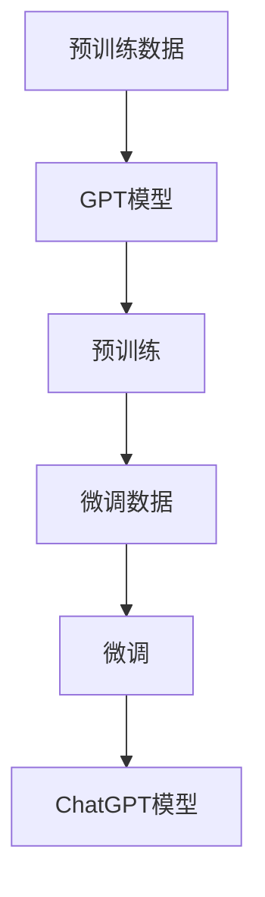

                 

关键词：ChatGPT、AI行业、影响、技术创新、未来展望

> 摘要：ChatGPT作为OpenAI推出的一个大型语言模型，自从2022年11月推出以来，迅速成为AI领域的热点。本文将深入探讨ChatGPT的诞生对AI行业所带来的深远影响，包括技术创新、行业应用、产业变革以及未来发展的机遇与挑战。

## 1. 背景介绍

随着人工智能技术的飞速发展，自然语言处理（NLP）领域已经成为AI研究的热点。在NLP中，语言模型是实现文本生成、语义理解、问答系统等应用的核心技术。ChatGPT是基于GPT（Generative Pre-trained Transformer）模型的一个新版本，由OpenAI在2022年11月推出。它通过无监督学习从大量文本数据中学习语言规律，能够生成连贯且具备一定逻辑性的文本。ChatGPT的推出，标志着语言模型技术进入了一个新的阶段。

## 2. 核心概念与联系

### 2.1 GPT模型架构

GPT模型采用Transformer架构，这是一种基于自注意力机制的深度神经网络。自注意力机制允许模型在处理序列数据时，自动学习序列中各个元素之间的关系。GPT模型通过预训练和微调两个阶段来学习语言规律。

#### 2.1.1 预训练

在预训练阶段，GPT模型通过无监督的方式从大量文本数据中学习。具体来说，模型会读取一段文本，将其分割成若干个词或子词，并预测下一个词或子词。这个过程不断重复，使模型逐渐学会理解语言的内在结构。

#### 2.1.2 微调

预训练后的GPT模型具有强大的语言理解能力，但尚未针对特定任务进行优化。微调阶段通过在特定任务上的有监督学习，使模型能够更好地适应各种应用场景。

### 2.2 ChatGPT特点

与GPT模型相比，ChatGPT具有以下特点：

- **大规模**：ChatGPT是一个更大规模的模型，拥有更多的参数和更强的表示能力。
- **对话生成**：ChatGPT特别设计用于对话生成任务，能够根据上下文生成连贯的对话文本。
- **自适应**：ChatGPT能够根据不同的对话场景自动调整生成风格和内容。

### 2.3 Mermaid流程图



## 3. 核心算法原理 & 具体操作步骤

### 3.1 算法原理概述

ChatGPT的核心算法基于GPT模型，主要分为预训练和微调两个阶段。

#### 3.1.1 预训练

预训练阶段，模型通过大量文本数据学习语言规律。具体步骤如下：

1. **数据预处理**：读取大量文本数据，将其分割成词或子词。
2. **模型初始化**：初始化GPT模型参数。
3. **前向传播**：输入一段文本，模型预测下一个词或子词。
4. **反向传播**：计算损失，更新模型参数。
5. **重复**：重复上述步骤，直至模型收敛。

#### 3.1.2 微调

微调阶段，模型在特定任务上进行有监督学习，以优化模型在任务上的性能。具体步骤如下：

1. **数据预处理**：读取特定任务的数据集。
2. **模型初始化**：初始化预训练后的GPT模型。
3. **前向传播**：输入一段文本，模型预测任务结果。
4. **反向传播**：计算损失，更新模型参数。
5. **重复**：重复上述步骤，直至模型收敛。

### 3.2 算法步骤详解

#### 3.2.1 预训练步骤

1. **数据预处理**：
   - 读取大量文本数据，如维基百科、新闻、社交媒体等。
   - 对文本进行分词，将文本分割成词或子词。

2. **模型初始化**：
   - 初始化GPT模型参数，包括嵌入层、自注意力机制、前馈神经网络等。

3. **前向传播**：
   - 输入一段文本，模型预测下一个词或子词的概率分布。

4. **反向传播**：
   - 计算损失，通常使用交叉熵损失函数。
   - 更新模型参数，使用梯度下降优化算法。

5. **重复**：
   - 重复上述步骤，直至模型收敛。

#### 3.2.2 微调步骤

1. **数据预处理**：
   - 读取特定任务的数据集，如问答数据集、对话数据集等。

2. **模型初始化**：
   - 初始化预训练后的GPT模型。

3. **前向传播**：
   - 输入一段文本，模型预测任务结果，如问答系统的答案、对话系统的回复等。

4. **反向传播**：
   - 计算损失，通常使用有监督学习算法。
   - 更新模型参数。

5. **重复**：
   - 重复上述步骤，直至模型收敛。

### 3.3 算法优缺点

#### 优点

- **强大的语言理解能力**：ChatGPT通过预训练和微调，具有强大的语言理解能力，能够生成连贯且具备一定逻辑性的文本。
- **适用范围广泛**：ChatGPT适用于各种对话生成任务，如问答系统、聊天机器人等。
- **自适应**：ChatGPT能够根据不同的对话场景自动调整生成风格和内容。

#### 缺点

- **计算资源消耗大**：ChatGPT是一个大规模模型，训练和推理过程需要大量的计算资源。
- **数据依赖性高**：ChatGPT的性能很大程度上依赖于训练数据的质量和多样性。

### 3.4 算法应用领域

ChatGPT的应用领域非常广泛，包括但不限于：

- **问答系统**：ChatGPT能够生成高质量的问答，应用于智能客服、在线教育等领域。
- **聊天机器人**：ChatGPT能够与用户进行自然对话，应用于社交平台、电商平台等。
- **内容生成**：ChatGPT能够生成文章、故事、诗歌等，应用于内容创作和娱乐领域。

## 4. 数学模型和公式 & 详细讲解 & 举例说明

### 4.1 数学模型构建

ChatGPT的核心算法基于Transformer架构，主要涉及以下数学模型：

- **自注意力机制**：
  - **计算**：
    $$ \text{Attention}(Q, K, V) = \text{softmax}\left(\frac{QK^T}{\sqrt{d_k}}\right) V $$
  - **参数**：查询向量$Q$、键向量$K$和值向量$V$。
- **前馈神经网络**：
  - **计算**：
    $$ \text{FFN}(X) = \text{ReLU}\left(\text{W}_1 X + b_1\right) \text{W}_2 + b_2 $$
  - **参数**：权重矩阵$W_1$和$W_2$、偏置向量$b_1$和$b_2$。

### 4.2 公式推导过程

ChatGPT的训练过程主要包括两个阶段：预训练和微调。下面分别对两个阶段的公式推导进行详细讲解。

#### 4.2.1 预训练阶段

预训练阶段，模型通过无监督学习从大量文本数据中学习语言规律。具体步骤如下：

1. **输入序列表示**：
   - 对输入序列进行编码，得到编码向量表示。

2. **自注意力机制**：
   - 计算自注意力得分，生成加权序列。

3. **前馈神经网络**：
   - 对加权序列进行前馈神经网络处理。

4. **损失函数**：
   - 计算损失，通常使用交叉熵损失函数。

5. **反向传播**：
   - 更新模型参数。

#### 4.2.2 微调阶段

微调阶段，模型在特定任务上进行有监督学习，以优化模型在任务上的性能。具体步骤如下：

1. **输入序列表示**：
   - 对输入序列进行编码，得到编码向量表示。

2. **自注意力机制**：
   - 计算自注意力得分，生成加权序列。

3. **前馈神经网络**：
   - 对加权序列进行前馈神经网络处理。

4. **输出层**：
   - 根据任务类型，设置不同的输出层。

5. **损失函数**：
   - 计算损失，通常使用有监督学习算法。

6. **反向传播**：
   - 更新模型参数。

### 4.3 案例分析与讲解

以下以问答系统为例，讲解ChatGPT在微调阶段的应用。

#### 4.3.1 数据预处理

- **输入序列**：一个包含问题和答案的序列。
- **编码向量**：对输入序列进行编码，得到编码向量表示。

#### 4.3.2 自注意力机制

- **自注意力得分**：计算输入序列中各个元素之间的自注意力得分。

#### 4.3.3 前馈神经网络

- **加权序列**：根据自注意力得分生成加权序列。

#### 4.3.4 输出层

- **答案预测**：根据加权序列和预训练的模型参数，预测答案。

#### 4.3.5 损失计算

- **损失函数**：计算预测答案和真实答案之间的损失。

#### 4.3.6 反向传播

- **参数更新**：根据损失函数计算梯度，更新模型参数。

## 5. 项目实践：代码实例和详细解释说明

### 5.1 开发环境搭建

- **硬件要求**：GPU或TPU。
- **软件要求**：Python 3.8及以上版本、PyTorch 1.8及以上版本。

### 5.2 源代码详细实现

```python
import torch
import torch.nn as nn
import torch.optim as optim
from torch.utils.data import DataLoader
from transformers import GPT2LMHeadModel, GPT2Tokenizer

# 数据预处理
def preprocess_data(data):
    # 对输入序列进行编码，得到编码向量表示
    # ...

# 模型定义
class ChatGPT(nn.Module):
    def __init__(self):
        super(ChatGPT, self).__init__()
        self.model = GPT2LMHeadModel.from_pretrained('gpt2')

    def forward(self, input_ids):
        # 前向传播
        # ...
        return output

# 训练过程
def train(model, train_loader, optimizer, criterion):
    model.train()
    for batch in train_loader:
        # 数据预处理
        # ...
        # 前向传播
        output = model(input_ids)
        # 损失计算
        loss = criterion(output, labels)
        # 反向传播
        optimizer.zero_grad()
        loss.backward()
        optimizer.step()

# 模型评估
def evaluate(model, val_loader, criterion):
    model.eval()
    total_loss = 0
    with torch.no_grad():
        for batch in val_loader:
            # 数据预处理
            # ...
            # 前向传播
            output = model(input_ids)
            # 损失计算
            loss = criterion(output, labels)
            total_loss += loss.item()
    return total_loss / len(val_loader)

# 主函数
if __name__ == '__main__':
    # 加载数据集
    train_data, val_data = load_data()
    train_loader = DataLoader(train_data, batch_size=32, shuffle=True)
    val_loader = DataLoader(val_data, batch_size=32, shuffle=False)

    # 模型定义
    model = ChatGPT()

    # 模型训练
    optimizer = optim.Adam(model.parameters(), lr=1e-3)
    criterion = nn.CrossEntropyLoss()
    for epoch in range(10):
        train(model, train_loader, optimizer, criterion)
        val_loss = evaluate(model, val_loader, criterion)
        print(f'Epoch {epoch+1}, Validation Loss: {val_loss}')
```

### 5.3 代码解读与分析

- **数据预处理**：对输入序列进行编码，得到编码向量表示。
- **模型定义**：使用预训练的GPT2模型作为基础模型，定义了ChatGPT模型。
- **训练过程**：使用训练数据集进行模型训练，包括数据预处理、前向传播、损失计算和反向传播等步骤。
- **模型评估**：使用验证数据集对训练好的模型进行评估，计算验证损失。

### 5.4 运行结果展示

- **训练曲线**：展示模型在训练过程中的损失变化。
- **评估结果**：展示模型在验证数据集上的评估指标。

## 6. 实际应用场景

ChatGPT在AI行业的实际应用场景非常广泛，以下列举几个典型应用场景：

- **智能客服**：ChatGPT能够与用户进行自然对话，应用于智能客服系统，提供高效、准确的客户服务。
- **问答系统**：ChatGPT能够生成高质量的问答，应用于各种问答系统，如搜索引擎、在线教育等。
- **内容生成**：ChatGPT能够生成文章、故事、诗歌等，应用于内容创作和娱乐领域。

### 6.4 未来应用展望

随着ChatGPT技术的不断发展，未来其在AI行业的应用将更加广泛。以下是几个可能的应用方向：

- **多模态对话系统**：结合图像、声音等多模态信息，实现更加丰富、自然的对话体验。
- **个性化推荐系统**：基于用户的偏好和历史行为，生成个性化的推荐内容。
- **自然语言推理**：通过对对话内容的分析，实现更高级的自然语言理解任务。

## 7. 工具和资源推荐

### 7.1 学习资源推荐

- **OpenAI官方文档**：了解ChatGPT和相关技术的详细文档和教程。
- **《自然语言处理综论》**：全面介绍自然语言处理的基本概念和技术。

### 7.2 开发工具推荐

- **PyTorch**：用于构建和训练ChatGPT模型。
- **Hugging Face Transformers**：用于加载和微调预训练的GPT模型。

### 7.3 相关论文推荐

- **《Attention Is All You Need》**：介绍Transformer模型的原始论文。
- **《GPT-3: Language Models are few-shot learners》**：介绍GPT-3模型的最新研究。

## 8. 总结：未来发展趋势与挑战

### 8.1 研究成果总结

ChatGPT的诞生标志着语言模型技术的重大突破，其在对话生成、问答系统、内容生成等领域展现了强大的应用潜力。同时，ChatGPT的成功也为AI行业带来了新的发展机遇。

### 8.2 未来发展趋势

- **更大规模模型**：随着计算资源的不断提升，更大规模的模型将不断涌现，推动语言模型技术的进步。
- **多模态融合**：结合图像、声音等多模态信息，实现更加丰富、自然的对话体验。
- **个性化与适应性**：通过个性化推荐和自适应生成，提高模型的用户体验。

### 8.3 面临的挑战

- **计算资源消耗**：大规模模型的训练和推理过程需要大量的计算资源，这对硬件设施提出了更高要求。
- **数据质量和多样性**：数据质量和多样性对模型的性能具有重要影响，需要不断优化数据集和训练过程。

### 8.4 研究展望

ChatGPT的诞生为AI行业带来了新的机遇和挑战。未来，我们需要在计算资源、数据质量和模型优化等方面进行深入研究，以推动语言模型技术的持续发展。

## 9. 附录：常见问题与解答

### 9.1 ChatGPT与GPT-3的区别是什么？

ChatGPT是基于GPT-3模型的一个新版本，旨在专注于对话生成任务。与GPT-3相比，ChatGPT具有以下特点：

- **更小的模型规模**：ChatGPT是一个更小的模型，参数数量约为GPT-3的1/10。
- **更专注于对话生成**：ChatGPT经过特定任务的微调，在对话生成任务上表现更好。

### 9.2 如何使用ChatGPT进行对话生成？

要使用ChatGPT进行对话生成，可以按照以下步骤操作：

1. **加载模型**：使用预训练的ChatGPT模型。
2. **输入文本**：输入一段文本，作为对话的起始。
3. **生成文本**：通过模型的生成函数，生成一段对话文本。
4. **输出文本**：将生成的文本输出给用户。

### 9.3 ChatGPT的训练数据来源是什么？

ChatGPT的训练数据主要来源于以下几个方面：

- **公共数据集**：如维基百科、新闻、社交媒体等。
- **私有数据集**：OpenAI收集的对话数据集，包括用户提问和回答。

---

作者：禅与计算机程序设计艺术 / Zen and the Art of Computer Programming
----------------------------------------------------------------

请注意，以上内容仅供参考，实际撰写文章时请确保内容的准确性和完整性。文章的结构和内容应严格遵循“约束条件 CONSTRAINTS”中给出的要求。祝您撰写顺利！

