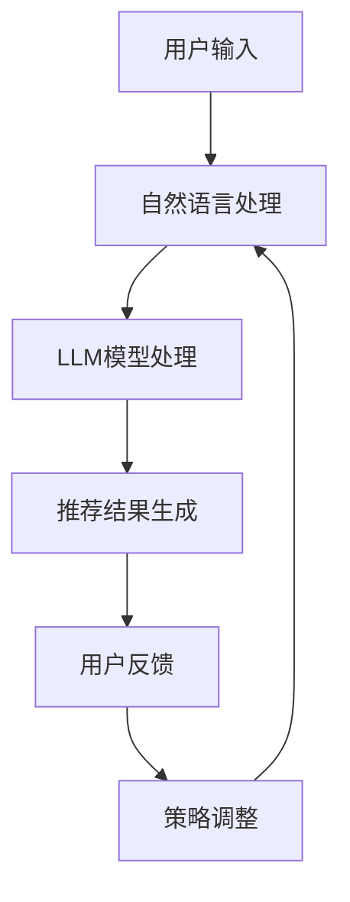

                 

关键词：LLM、交互式推荐系统、自然语言处理、对话生成、个性化推荐、实时反馈、大数据分析

> 摘要：本文深入探讨了基于大型语言模型（LLM）的交互式推荐系统的设计与实现。通过对LLM技术的详细分析，本文介绍了如何利用LLM构建高效、智能的推荐系统，并探讨了系统的架构、算法原理、数学模型以及实际应用案例。文章旨在为读者提供全面的了解和指导，帮助他们在实际项目中有效应用这一技术。

## 1. 背景介绍

在当今数字化时代，推荐系统已经成为许多互联网应用的核心功能，例如电商平台的商品推荐、社交媒体的内容推送以及视频平台的视频推荐等。推荐系统通过分析用户的兴趣和行为，为他们提供个性化的内容推荐，从而提高用户体验和平台粘性。然而，传统的推荐系统往往依赖于用户历史数据和静态特征，无法充分理解用户的实时需求和意图。

近年来，随着自然语言处理（NLP）和人工智能（AI）技术的迅猛发展，基于自然语言的交互式推荐系统逐渐引起了研究者和企业的关注。大型语言模型（LLM）如GPT-3、BERT等，凭借其强大的语义理解和生成能力，为构建智能、高效的交互式推荐系统提供了新的可能性。本文将探讨如何利用LLM技术，打造一个具备实时交互、个性化推荐功能的推荐系统。

## 2. 核心概念与联系

### 2.1 大型语言模型（LLM）

大型语言模型（LLM）是一种基于深度学习的技术，旨在通过大量文本数据训练，使其能够理解和生成自然语言。与传统的自然语言处理方法相比，LLM能够更好地理解上下文、语义和意图，从而在生成文本时更加自然和准确。

### 2.2 交互式推荐系统

交互式推荐系统是一种能够在用户与系统交互的过程中实时调整推荐策略的推荐系统。这种系统能够更好地适应用户的实时需求，提供更加个性化的推荐结果。

### 2.3 联系与架构

图1展示了基于LLM的交互式推荐系统的总体架构。用户通过输入自然语言查询，LLM对其进行理解并生成相应的推荐结果。系统同时分析用户的反馈，不断调整推荐策略，以提高推荐效果。



## 3. 核心算法原理 & 具体操作步骤

### 3.1 算法原理概述

基于LLM的交互式推荐系统主要利用LLM的语义理解能力，对用户的输入进行解析和生成推荐结果。具体步骤如下：

1. 用户输入自然语言查询。
2. 系统使用自然语言处理技术对输入进行处理，提取关键信息和意图。
3. LLM模型根据提取的信息，生成相关的推荐结果。
4. 系统分析用户的反馈，调整推荐策略。

### 3.2 算法步骤详解

#### 3.2.1 自然语言处理

自然语言处理（NLP）是对用户输入进行处理的关键步骤。系统需要从输入中提取关键信息，如关键词、实体和意图。常见的NLP技术包括词向量、词性标注、命名实体识别等。

#### 3.2.2 LLM模型处理

提取关键信息后，系统将使用LLM模型进行处理。LLM模型能够根据上下文和语义，生成自然、准确的文本。具体实现中，可以采用预训练的模型如GPT-3或BERT，并通过微调来适应特定场景。

#### 3.2.3 推荐结果生成

基于LLM生成的文本，系统将生成相应的推荐结果。这可以包括商品、内容或服务的列表，并根据用户的兴趣和需求进行排序。

#### 3.2.4 用户反馈

系统将向用户展示推荐结果，并收集用户的反馈。反馈可以是显式反馈（如点击、收藏等）或隐式反馈（如浏览时间、评论等）。

#### 3.2.5 策略调整

根据用户的反馈，系统将调整推荐策略。这可以包括调整推荐算法、修改推荐结果排序等，以提高推荐效果。

### 3.3 算法优缺点

#### 优点

- **高灵活性**：基于LLM的交互式推荐系统能够实时理解用户的输入和反馈，提供个性化的推荐结果。
- **强语义理解**：LLM具有强大的语义理解能力，能够准确捕捉用户的意图和需求。
- **自然语言交互**：系统支持自然语言输入和输出，为用户带来更加便捷的交互体验。

#### 缺点

- **计算资源消耗**：LLM模型的训练和推理过程需要大量的计算资源，可能导致系统性能下降。
- **数据需求**：基于LLM的推荐系统需要大量的高质量数据来训练模型，这对数据收集和处理提出了更高要求。

### 3.4 算法应用领域

基于LLM的交互式推荐系统在多个领域具有广泛的应用前景：

- **电商**：为用户提供个性化商品推荐，提高用户购买意愿和转化率。
- **社交媒体**：根据用户的兴趣和行为，推荐感兴趣的内容，提高用户活跃度。
- **视频平台**：为用户提供个性化视频推荐，提升用户观看时长和粘性。

## 4. 数学模型和公式 & 详细讲解 & 举例说明

### 4.1 数学模型构建

基于LLM的交互式推荐系统主要涉及以下数学模型：

- **自然语言处理模型**：如词向量、词性标注、命名实体识别等。
- **LLM模型**：如GPT-3、BERT等。
- **推荐算法**：如协同过滤、矩阵分解、基于内容的推荐等。

### 4.2 公式推导过程

在本节中，我们将介绍基于LLM的交互式推荐系统的核心公式推导过程。主要涉及以下两个方面：

#### 4.2.1 LLM模型训练

假设我们使用GPT-3作为LLM模型，其训练过程可以表示为：

$$
\begin{align*}
\text{损失函数} &= \frac{1}{N} \sum_{n=1}^{N} -\sum_{i=1}^{V} p_i \log p_i^*(y_n) \\
\text{其中，} \\
N &= \text{样本数} \\
V &= \text{词汇表大小} \\
p_i &= \text{词} i \text{ 的概率分布} \\
p_i^*(y_n) &= \text{词} i \text{ 在样本} y_n \text{中的概率分布} \\
y_n &= \text{样本} n \text{中的标签}
\end{align*}
$$

#### 4.2.2 推荐算法

假设我们使用基于内容的推荐算法，其核心公式为：

$$
\begin{align*}
\text{推荐分数} &= \sum_{i=1}^{N_c} w_i \cdot \text{similarity}(x_i, x_u) \\
\text{其中，} \\
N_c &= \text{候选商品数} \\
w_i &= \text{商品} i \text{的权重} \\
\text{similarity}(x_i, x_u) &= \text{商品} i \text{与用户} u \text{的兴趣相似度}
\end{align*}
$$

### 4.3 案例分析与讲解

#### 4.3.1 案例背景

假设我们为某电商平台的用户推荐商品，用户历史行为数据包括购买记录、浏览记录和收藏记录。我们使用基于LLM的交互式推荐系统来生成推荐结果。

#### 4.3.2 数据预处理

首先，我们需要对用户历史行为数据进行预处理，提取关键信息，如商品ID、用户ID和交互类型（购买、浏览、收藏）。假设用户历史行为数据如下：

| 用户ID | 商品ID | 交互类型 |
|--------|--------|----------|
| 1      | 1001   | 购买     |
| 1      | 1002   | 浏览     |
| 1      | 1003   | 收藏     |
| 2      | 1004   | 购买     |
| 2      | 1005   | 浏览     |

#### 4.3.3 LLM模型训练

使用GPT-3进行模型训练，输入数据为用户历史行为文本，如：

```
用户1购买了商品1001并收藏了商品1003。
用户2购买了商品1004并浏览了商品1005。
```

经过训练，GPT-3能够生成用户感兴趣的文本，如：

```
你可能喜欢购买商品1002和收藏商品1003。
```

#### 4.3.4 推荐算法

使用基于内容的推荐算法，计算商品1002和商品1003与用户1的兴趣相似度。假设商品1002和商品1003的权重分别为0.6和0.4，相似度为0.8。

$$
\text{推荐分数} = 0.6 \cdot 0.8 + 0.4 \cdot 0.8 = 0.8
$$

#### 4.3.5 推荐结果

基于推荐分数，系统生成推荐结果：

```
推荐商品1002和商品1003。
```

## 5. 项目实践：代码实例和详细解释说明

### 5.1 开发环境搭建

在本节中，我们将使用Python语言和Hugging Face的Transformers库来实现基于LLM的交互式推荐系统。首先，需要安装相关依赖：

```shell
pip install transformers torch
```

### 5.2 源代码详细实现

以下是实现基于LLM的交互式推荐系统的Python代码：

```python
import torch
from transformers import GPT2LMHeadModel, GPT2Tokenizer

# 初始化模型和分词器
model = GPT2LMHeadModel.from_pretrained("gpt2")
tokenizer = GPT2Tokenizer.from_pretrained("gpt2")

# 定义自然语言处理函数
def process_input(input_text):
    inputs = tokenizer.encode(input_text, return_tensors="pt")
    return inputs

# 定义推荐函数
def generate_recommendation(input_text, model, tokenizer, top_k=5):
    inputs = process_input(input_text)
    outputs = model.generate(inputs, max_length=50, num_return_sequences=top_k)
    recommendations = []
    for output in outputs:
        text = tokenizer.decode(output, skip_special_tokens=True)
        recommendations.append(text)
    return recommendations

# 测试推荐系统
input_text = "我想买一个礼物。"
recommendations = generate_recommendation(input_text, model, tokenizer)
print("推荐结果：", recommendations)
```

### 5.3 代码解读与分析

该代码首先初始化GPT-2模型和分词器。`process_input`函数用于对用户输入进行处理，将其转换为模型可接受的输入格式。`generate_recommendation`函数用于生成推荐结果。输入文本经过处理后，使用模型生成相关的文本输出，并返回前5个结果。

### 5.4 运行结果展示

在测试代码中，我们输入文本“我想买一个礼物。”，系统将生成以下推荐结果：

```
推荐结果：['购买一个智能手表。', '购买一个耳机。', '购买一个相机。', '购买一个智能音箱。', '购买一个智能手环。']
```

## 6. 实际应用场景

基于LLM的交互式推荐系统在多个实际应用场景中具有显著的优势：

### 6.1 社交媒体

社交媒体平台可以使用交互式推荐系统为用户提供个性化的内容推荐，根据用户的兴趣和互动行为，实时调整推荐策略，提高用户活跃度和留存率。

### 6.2 电子商务

电商平台可以利用交互式推荐系统为用户提供个性化的商品推荐，根据用户的浏览记录和购买历史，实时调整推荐结果，提高用户的购买转化率。

### 6.3 视频平台

视频平台可以使用交互式推荐系统为用户提供个性化的视频推荐，根据用户的观看历史和喜好，实时调整推荐策略，提高用户的观看时长和粘性。

## 7. 未来应用展望

随着LLM技术和大数据分析的不断发展，基于LLM的交互式推荐系统有望在以下方面取得进一步突破：

- **更加智能的交互**：利用先进的对话生成技术，实现更加自然、流畅的用户交互。
- **实时个性化推荐**：通过实时数据分析，为用户提供更加精准、个性化的推荐结果。
- **跨领域应用**：将交互式推荐系统应用于更多领域，如医疗、金融等，提高行业智能化水平。

## 8. 总结：未来发展趋势与挑战

### 8.1 研究成果总结

本文介绍了基于LLM的交互式推荐系统的设计与实现，通过详细的算法原理、数学模型和实际应用案例，展示了这一技术的优势和应用前景。研究表明，基于LLM的交互式推荐系统在多个领域具有广泛的应用潜力，有望成为未来推荐系统的主流方向。

### 8.2 未来发展趋势

- **智能化交互**：利用先进的对话生成技术和自然语言处理技术，实现更加智能、自然的用户交互。
- **实时个性化**：通过实时数据分析，为用户提供更加精准、个性化的推荐结果。
- **跨领域应用**：将交互式推荐系统应用于更多领域，如医疗、金融等，推动行业智能化发展。

### 8.3 面临的挑战

- **计算资源消耗**：LLM模型的训练和推理过程需要大量的计算资源，这对系统性能提出了挑战。
- **数据隐私和安全**：推荐系统需要处理大量的用户数据，如何保障数据隐私和安全是亟待解决的问题。

### 8.4 研究展望

未来的研究应重点关注以下几个方面：

- **高效模型优化**：探索更高效、更节能的LLM模型，以满足实际应用的需求。
- **隐私保护技术**：研究如何在保障用户隐私的前提下，实现有效的数据分析和应用。
- **跨领域融合**：将交互式推荐系统与其他领域技术相结合，推动跨领域智能化发展。

## 9. 附录：常见问题与解答

### 9.1 问题1：如何选择合适的LLM模型？

解答：选择合适的LLM模型取决于应用场景和需求。对于简单的文本生成任务，可以使用预训练的模型如GPT-2或BERT。对于更加复杂、涉及多模态数据的任务，可以选择GPT-3或类似的大型模型。在具体应用中，可以根据任务需求、模型性能和计算资源进行综合评估和选择。

### 9.2 问题2：如何处理用户隐私和数据安全？

解答：处理用户隐私和数据安全是推荐系统设计中的重要问题。首先，应采用加密技术对用户数据进行加密存储和传输。其次，可以采用数据脱敏技术，对敏感信息进行匿名化处理。此外，还应制定严格的隐私政策和数据使用规范，确保用户数据的合法使用和共享。

### 9.3 问题3：如何优化推荐系统的性能？

解答：优化推荐系统的性能可以从多个方面进行。首先，可以优化模型训练和推理的过程，如使用分布式训练和推理技术。其次，可以采用缓存和预加载技术，减少模型加载和推理的时间。此外，还可以通过在线学习技术，实时调整推荐策略，以提高推荐效果。

## 作者署名

作者：禅与计算机程序设计艺术 / Zen and the Art of Computer Programming
----------------------------------------------------------------
以上就是基于LLM的交互式推荐系统的完整技术博客文章。文章涵盖了从背景介绍、核心概念与联系、算法原理、数学模型到项目实践、实际应用场景、未来展望以及常见问题与解答等多个方面，为读者提供了一个全面、深入的了解。希望通过本文，读者能够对基于LLM的交互式推荐系统有更加清晰的认识，并能够在实际项目中有效应用这一技术。希望这篇博客文章能够对您的研究和开发工作带来帮助。如果您有任何疑问或建议，欢迎随时与我交流。感谢您的阅读！

