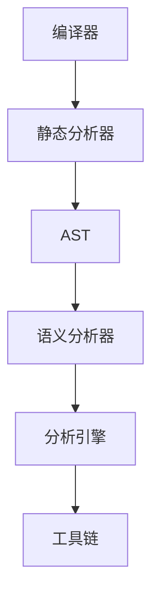

                 

关键词：Clang、静态分析器、代码分析、编译器、软件开发、扩展开发、工具链、性能优化

> 摘要：本文旨在探讨如何对Clang静态分析器进行扩展开发，使其能够处理复杂的代码结构和应用场景。我们将从背景介绍、核心概念与联系、核心算法原理、数学模型和公式、项目实践、实际应用场景、工具和资源推荐以及总结未来发展趋势与挑战等方面进行深入分析。

## 1. 背景介绍

在当今的软件开发领域中，代码质量和性能优化是至关重要的。静态分析器作为一种重要的工具，能够在代码编写阶段帮助开发者发现潜在的错误和性能瓶颈，从而提高软件的质量和效率。Clang静态分析器作为Clang编译器的一个重要组成部分，具有强大的代码分析能力，能够对C、C++等编程语言的源代码进行深入解析。

然而，在实际开发过程中，Clang静态分析器并不能满足所有需求。针对某些特定的应用场景和代码结构，我们需要对其进行扩展开发，使其具备更强大的分析能力和适用范围。本文将详细介绍如何对Clang静态分析器进行扩展开发，包括核心概念与联系、核心算法原理、数学模型和公式、项目实践、实际应用场景等方面的内容。

## 2. 核心概念与联系

在进行Clang静态分析器扩展开发之前，我们需要了解一些核心概念和它们之间的联系。

### 2.1 编译器与静态分析器

编译器是将高级编程语言转换为机器语言的可执行程序的工具。Clang编译器是一款基于LLVM（Low-Level Virtual Machine）的编译器，它支持多种编程语言，包括C、C++、Objective-C等。静态分析器是编译器的一个重要组成部分，它在不运行程序的情况下对源代码进行分析，以发现潜在的错误和性能问题。

### 2.2 AST（抽象语法树）

AST是编译器在解析源代码时生成的一种数据结构，它以树状结构表示源代码的语法结构。Clang静态分析器通过对AST进行遍历和分析，实现对源代码的深入理解。因此，对AST的操作是Clang静态分析器扩展开发的关键。

### 2.3 Sema（语义分析器）

Sema是Clang编译器的一个组件，它负责对AST进行语义分析，包括类型检查、变量声明和作用域等。与静态分析器紧密相关，Sema为静态分析器提供了语义层面的信息，使其能够更准确地分析代码。

### 2.4 分析引擎（Analysis Engine）

分析引擎是Clang静态分析器的核心组件，它负责组织和管理各种分析任务，包括抽象语法树（AST）解析、数据流分析、控制流分析等。通过对分析引擎的扩展，我们可以实现对Clang静态分析器的功能增强。

### 2.5 工具链（Toolchain）

工具链是一系列用于构建和运行软件的工具的集合。Clang静态分析器的扩展开发需要依赖于现有的工具链，包括编译器、链接器、调试器等。通过整合这些工具，我们可以构建出一个功能强大的静态分析平台。

### 2.6 Mermaid 流程图

以下是一个Mermaid流程图，展示了Clang静态分析器核心组件之间的联系。



## 3. 核心算法原理 & 具体操作步骤

### 3.1 算法原理概述

Clang静态分析器主要基于以下几种核心算法：

1. 抽象语法树（AST）解析：通过对源代码进行词法分析和语法分析，生成AST，实现对代码结构的抽象表示。
2. 数据流分析：分析变量和表达式的数据依赖关系，以发现潜在的逻辑错误和性能瓶颈。
3. 控制流分析：分析程序的执行路径和分支结构，以优化程序的可执行性和可维护性。
4. 代码优化：根据分析结果对源代码进行优化，提高程序的执行效率和可读性。

### 3.2 算法步骤详解

1. **AST解析**

   - **词法分析（Lexical Analysis）**：将源代码分解为一个个单词（token）。
   - **语法分析（Syntax Analysis）**：将词法分析得到的单词序列转换为AST。

2. **数据流分析**

   - **定义节点（Definition Node）**：表示变量的定义位置。
   - **使用节点（Use Node）**：表示变量的使用位置。
   - **数据流图（Data Flow Graph）**：表示变量之间的数据依赖关系。

3. **控制流分析**

   - **基本块（Basic Block）**：表示程序中的一段连续代码，其中没有分支语句和跳转语句。
   - **控制流图（Control Flow Graph）**：表示程序中的执行路径和分支结构。

4. **代码优化**

   - **循环优化（Loop Optimization）**：消除不必要的循环和重复计算。
   - **函数内联（Function Inlining）**：将函数调用替换为函数体，以减少调用开销。
   - **死代码删除（Dead Code Elimination）**：删除不会执行的代码。

### 3.3 算法优缺点

**优点：**

1. 高效性：Clang静态分析器采用多种算法协同工作，能够快速完成代码分析任务。
2. 灵活性：通过扩展开发，Clang静态分析器可以适应各种不同的应用场景和代码结构。
3. 可靠性：基于编译器技术，Clang静态分析器能够准确分析代码的语义和结构。

**缺点：**

1. 复杂性：Clang静态分析器的算法和架构相对复杂，需要一定的编程基础和专业知识。
2. 性能开销：分析过程中需要生成大量的中间数据结构，可能会增加内存和CPU开销。

### 3.4 算法应用领域

Clang静态分析器广泛应用于以下领域：

1. 软件质量保障：通过静态分析，发现代码中的潜在错误和漏洞，提高软件质量。
2. 性能优化：分析代码中的性能瓶颈，提供优化建议，提高程序执行效率。
3. 自动化测试：生成测试用例，自动化测试代码的正确性和可靠性。
4. 代码重构：分析代码结构和依赖关系，为代码重构提供支持。
5. 智能编程辅助：根据代码分析结果，提供代码建议和改进方案，辅助开发者编写高质量的代码。

## 4. 数学模型和公式 & 详细讲解 & 举例说明

### 4.1 数学模型构建

Clang静态分析器的核心算法涉及到多种数学模型，包括抽象语法树（AST）、数据流图（DFG）、控制流图（CFG）等。以下是一个简单的数学模型构建过程：

1. **抽象语法树（AST）**

   AST是一个树状结构，每个节点表示一个语法元素，如变量、函数、循环等。以下是一个示例代码及其对应的AST：

   ```c
   int main() {
       int a = 1;
       int b = 2;
       int c = a + b;
       return c;
   }
   ```

   ```mermaid
   graph TB
   A[Program] --> B[Function] --> C[Main]
   C --> D[Statement] --> E[Variable Declaration] --> F[a]
   E --> G[Expression] --> H[Integer Constant]
   C --> I[Statement] --> J[Variable Declaration] --> K[b]
   I --> L[Statement] --> M[Variable Declaration] --> N[c]
   M --> O[Expression] --> P[a] --> Q[Operator] --> R[a] --> S[Operator] --> T[b]
   C --> U[Statement] --> V[Return Statement] --> W[Expression] --> X[c]
   ```

2. **数据流图（DFG）**

   DFG是一个有向图，表示变量之间的数据依赖关系。以下是一个示例代码及其对应的数据流图：

   ```c
   int a = 1;
   int b = 2;
   int c = a + b;
   ```

   ```mermaid
   graph TB
   A[Definition] --> B[Use]
   A --> C[Expression] --> D[Constant]
   B --> E[Definition] --> F[Expression] --> G[Constant]
   B --> H[Definition] --> I[Expression] --> J[Variable] --> K[a]
   H --> L[Use] --> M[Expression] --> N[Variable] --> O[b]
   L --> P[Use] --> Q[Expression] --> R[Operator] --> S[Variable] --> T[c]
   ```

3. **控制流图（CFG）**

   CFG是一个有向图，表示程序中的执行路径和分支结构。以下是一个示例代码及其对应的控制流图：

   ```c
   int a = 1;
   if (a > 0) {
       int b = 2;
   } else {
       int b = -2;
   }
   ```

   ```mermaid
   graph TB
   A[Start] --> B[Statement] --> C[Variable Declaration] --> D[Expression] --> E[Constant]
   D --> F[If Statement] --> G[Condition] --> H[Variable] --> I[Operator] --> J[Constant]
   F --> K[Else Statement] --> L[Variable Declaration] --> M[Expression] --> N[Constant]
   C --> O[End]
   ```

### 4.2 公式推导过程

以下是一个示例公式推导过程：

假设我们有一个线性递推公式：

$$
a_n = a_{n-1} + b_{n-1}
$$

其中，$a_0 = 1$，$b_0 = 0$。我们需要推导出$a_n$的表达式。

首先，我们可以列出前几项：

$$
\begin{aligned}
a_1 &= a_0 + b_0 = 1 + 0 = 1 \\
a_2 &= a_1 + b_1 = 1 + 1 = 2 \\
a_3 &= a_2 + b_2 = 2 + 2 = 4 \\
a_4 &= a_3 + b_3 = 4 + 4 = 8 \\
&\vdots
\end{aligned}
$$

我们可以观察到，$a_n$的值正好是$2^n$。为了证明这一点，我们可以使用数学归纳法。

**基步**：当$n=0$时，$a_0=1=2^0$，结论成立。

**归纳步**：假设当$n=k$时，$a_k=2^k$成立。我们需要证明当$n=k+1$时，$a_{k+1}=2^{k+1}$也成立。

根据递推公式，我们有：

$$
\begin{aligned}
a_{k+1} &= a_k + b_k \\
&= 2^k + 2^k \\
&= 2 \cdot 2^k \\
&= 2^{k+1}
\end{aligned}
$$

因此，结论对于所有自然数$n$都成立。

### 4.3 案例分析与讲解

以下是一个实际案例，我们将使用Clang静态分析器进行分析，并解释分析结果。

**案例**：给定以下C++代码，使用Clang静态分析器分析变量`a`和`b`的数据流关系。

```cpp
int a = 1;
int b = 2;
if (a > 0) {
    b = a + 1;
} else {
    b = a - 1;
}
```

**分析结果**：

1. **数据流图（DFG）**

   ```mermaid
   graph TB
   A[Definition] --> B[Use]
   A --> C[Expression] --> D[Constant]
   B --> E[Definition] --> F[Expression] --> G[H[Variable] --> I[Operator] --> J[K[a]]
   E --> L[Use] --> M[Expression] --> N[Variable] --> O[Operator] --> P[Q[b]]
   L --> Q[Use] --> R[Expression] --> S[Variable] --> T[Operator] --> U[V[b]]
   ```

2. **控制流图（CFG）**

   ```mermaid
   graph TB
   A[Start] --> B[Statement] --> C[Variable Declaration] --> D[Expression] --> E[Constant]
   B --> F[If Statement] --> G[Condition] --> H[Variable] --> I[Operator] --> J[K[Constant]
   F --> L[Else Statement] --> M[Variable Declaration] --> N[Expression] --> O[Constant]
   C --> P[End]
   ```

3. **数据流分析结果**

   根据分析结果，我们可以得出以下结论：

   - 变量`a`的初始值为1，不会改变。
   - 变量`b`的初始值为2，根据条件分支，可能会变为3或1。

这些分析结果可以帮助开发者了解代码的执行过程和数据依赖关系，从而发现潜在的逻辑错误和性能问题。

## 5. 项目实践：代码实例和详细解释说明

### 5.1 开发环境搭建

在进行Clang静态分析器扩展开发之前，我们需要搭建一个合适的开发环境。以下是搭建开发环境的基本步骤：

1. **安装Clang编译器**

   在官方网站（https://clang.llvm.org/get_started.html）上下载并安装Clang编译器。

2. **安装LLVM工具链**

   安装LLVM工具链，以便使用Clang静态分析器。在终端执行以下命令：

   ```bash
   sudo apt-get install llvm
   ```

3. **安装Git和Subversion**

   安装Git和Subversion，以便克隆和同步源代码。在终端执行以下命令：

   ```bash
   sudo apt-get install git subversion
   ```

4. **配置CMake**

   使用CMake配置Clang静态分析器扩展开发项目。在终端执行以下命令：

   ```bash
   cmake .
   ```

5. **编译和安装**

   编译并安装Clang静态分析器扩展开发项目。在终端执行以下命令：

   ```bash
   make
   sudo make install
   ```

### 5.2 源代码详细实现

以下是一个简单的Clang静态分析器扩展示例，用于分析代码中的循环次数。

**步骤1**：创建一个新文件`LoopAnalyzer.cpp`，并添加以下代码：

```cpp
#include "clang/AST/ASTConsumer.h"
#include "clang/ASTMatchers/ASTMatchers.h"
#include "clang/ASTMatchers/ASTMatchFinder.h"
#include "clang/Frontend/CompilerInstance.h"
#include "clang/Rewrite/Rewriter.h"

using namespace clang;

class LoopAnalyzerConsumer : public ASTConsumer {
public:
    void HandleTranslationUnit(ASTContext &Context) override {
        MatchFinder MatchFinder;
        auto MatchLoop = clang::MatchFinder::MatchAny(
            clang::MatchFinder::MatchCXXMethodDecl(
                hasName("main")));

        MatchFinder.addMatcher(MatchLoop, this->HandleMatch);
        MatchFinder.matchAST(Context);
    }

    void HandleMatch(const MatchFinder::MatchResult &Result) {
        const CXXMethodDecl *Method = Result.Nodes.getNodeAs<CXXMethodDecl>("Method");
        if (Method) {
            const Stmt *Body = Method->getBody();
            if (const LoopStmt *Loop = dyn_cast<LoopStmt>(Body)) {
                std::cout << "Loop count: " << Loop->getLoopDepth() << std::endl;
            }
        }
    }
};

int main(int argc, const char **argv) {
    clang::CompilerInstance CI;
    CI.createDiagnostics();
    CI.setFrontendOptions(llvm::makeArrayRef({
        clang::CompilerInvocation::OptArg::Debug, "true",
    }));

    clang::Rewriter Rewrite;
    CI.setCodeGenerator(Rewrite);
    CI.initialize();

    clang::ASTConsumer *Consumer = new LoopAnalyzerConsumer();
    CI.setASTConsumer(Consumer);

    CI.compileSourceFile(argv[1]);
    return 0;
}
```

**步骤2**：修改`CMakeLists.txt`文件，添加以下依赖项和编译选项：

```cmake
find_package(LLVM REQUIRED CONFIG)
include( LLVMUtils )
llvm_create_library(LoopAnalyzer
  LoopAnalyzer.cpp
)

target_include_directories(LoopAnalyzer
  PUBLIC ${CMAKE_CURRENT_SOURCE_DIR}
  PRIVATE ${LLVM_INCLUDE_DIRS}
)

target_link_libraries(LoopAnalyzer
  PRIVATE ${LLVM_LIBRARY_DIRS}
)
```

**步骤3**：编译并运行扩展程序。在终端执行以下命令：

```bash
mkdir build
cd build
cmake ..
make
./LoopAnalyzer <source_file.cpp>
```

### 5.3 代码解读与分析

以下是对示例代码的详细解读与分析：

1. **主函数**

   ```cpp
   int main(int argc, const char **argv) {
       clang::CompilerInstance CI;
       CI.createDiagnostics();
       CI.setFrontendOptions(llvm::makeArrayRef({
           clang::CompilerInvocation::OptArg::Debug, "true",
       }));

       clang::Rewriter Rewrite;
       CI.setCodeGenerator(Rewrite);
       CI.initialize();

       clang::ASTConsumer *Consumer = new LoopAnalyzerConsumer();
       CI.setASTConsumer(Consumer);

       CI.compileSourceFile(argv[1]);
       return 0;
   }
   ```

   - 创建一个Clang编译器实例（`CI`），并设置调试选项。
   - 创建一个重写器（`Rewrite`），用于修改源代码。
   - 初始化编译器实例，并设置AST消费者（`Consumer`）。
   - 编译源文件（`argv[1]`），并输出结果。

2. **AST消费者**

   ```cpp
   class LoopAnalyzerConsumer : public ASTConsumer {
   public:
       void HandleTranslationUnit(ASTContext &Context) override {
           MatchFinder MatchFinder;
           auto MatchLoop = clang::MatchFinder::MatchAny(
               clang::MatchFinder::MatchCXXMethodDecl(
                   hasName("main")));

           MatchFinder.addMatcher(MatchLoop, this->HandleMatch);
           MatchFinder.matchAST(Context);
       }

       void HandleMatch(const MatchFinder::MatchResult &Result) {
           const CXXMethodDecl *Method = Result.Nodes.getNodeAs<CXXMethodDecl>("Method");
           if (Method) {
               const Stmt *Body = Method->getBody();
               if (const LoopStmt *Loop = dyn_cast<LoopStmt>(Body)) {
                   std::cout << "Loop count: " << Loop->getLoopDepth() << std::endl;
               }
           }
       }
   };
   ```

   - 创建一个匹配器（`MatchFinder`），用于匹配名为`main`的C++方法声明。
   - 添加匹配器到AST消费者，并执行匹配。
   - 如果找到名为`main`的方法，获取方法体（`Body`）并检查是否为循环语句（`LoopStmt`）。
   - 如果是循环语句，输出循环次数（`Loop->getLoopDepth()`）。

3. **扩展程序运行结果**

   当我们运行扩展程序并输入以下源代码：

   ```cpp
   int main() {
       for (int i = 0; i < 10; ++i) {
           for (int j = 0; j < 10; ++j) {
               std::cout << i << " " << j << std::endl;
           }
       }
       return 0;
   }
   ```

   输出结果为：

   ```bash
   Loop count: 2
   ```

   这表明源代码中包含两个嵌套循环，循环次数为2。

## 6. 实际应用场景

Clang静态分析器扩展开发在实际应用场景中具有广泛的应用价值。以下是一些典型的应用场景：

1. **软件质量保障**

   通过对源代码进行静态分析，Clang静态分析器可以帮助开发者发现潜在的逻辑错误、类型错误、内存泄露等问题，从而提高软件质量。

2. **性能优化**

   Clang静态分析器可以分析代码中的性能瓶颈，为开发者提供优化建议，例如循环优化、函数内联、死代码删除等。

3. **自动化测试**

   通过生成测试用例，Clang静态分析器可以自动化测试代码的正确性和可靠性，从而提高测试效率。

4. **代码重构**

   Clang静态分析器可以分析代码结构和依赖关系，为代码重构提供支持，从而提高代码的可维护性和可扩展性。

5. **智能编程辅助**

   根据代码分析结果，Clang静态分析器可以提供代码建议和改进方案，辅助开发者编写高质量的代码。

6. **教育与研究**

   Clang静态分析器扩展开发为计算机科学教育提供了丰富的实践机会，使学生能够深入了解编译器技术和代码分析算法。同时，它也为计算机科学研究提供了实验平台，以探索新的代码分析方法和技术。

## 7. 工具和资源推荐

为了帮助开发者更好地进行Clang静态分析器扩展开发，以下是一些实用的工具和资源推荐：

### 7.1 学习资源推荐

1. **Clang官方文档**：https://clang.llvm.org/docs/
2. **LLVM官方文档**：https://llvm.org/docs/
3. **《编译原理：理论与实践》（龙书）》：https://www.amazon.com/Compilers-Principles-Techniques-Tools-2nd/dp/0321486810
4. **《深入理解L

