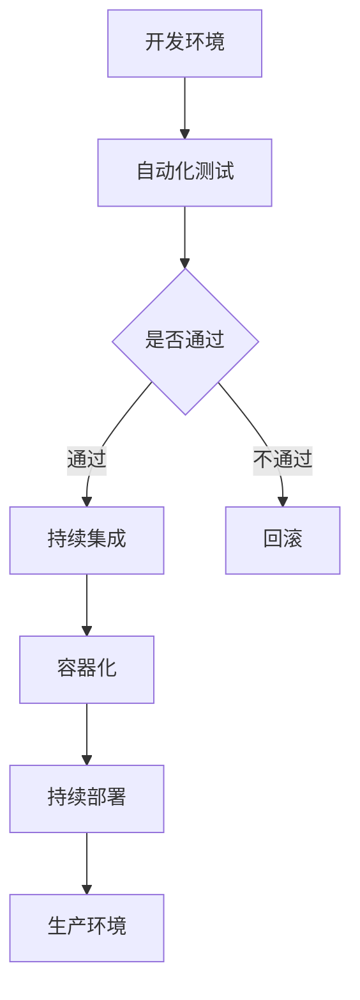

                 

### 关键词 Keywords
- DevOps
- 持续交付
- 持续部署
- 微服务架构
- 自动化
- 容器化
- 云原生

### 摘要 Abstract
本文将深入探讨DevOps实践的最新进展，重点关注持续交付和部署领域。我们将回顾DevOps的基本概念及其演变，详细解析持续交付和部署的核心概念，并介绍相关的最新技术。此外，本文将结合实际案例和代码实例，展示如何在实际项目中实施这些技术，同时探讨未来发展趋势与面临的挑战。通过阅读本文，您将获得DevOps领域的前沿知识，并能够更好地优化您的软件开发和部署流程。

## 1. 背景介绍

### 1.1 DevOps的概念

DevOps是一种软件开发和IT运维的集成模式，旨在通过消除开发（Development）和运维（Operations）之间的障碍，实现更快速、更高效的应用交付。DevOps的核心理念是协作、自动化和持续改进。

### 1.2 DevOps的历史与发展

DevOps起源于2000年代末期，最初是一些IT从业者在实际工作中对传统开发与运维分离模式的不满。随着云计算、敏捷开发和自动化工具的普及，DevOps逐渐成为一种主流的软件开发模式。

### 1.3 DevOps的价值

DevOps为软件开发和部署带来了多方面的价值，包括缩短产品上市时间、提高产品质量、减少故障率、降低成本等。通过实施DevOps，企业能够更好地适应快速变化的市场需求。

## 2. 核心概念与联系

### 2.1 持续交付

持续交付是一种软件开发和部署实践，旨在确保代码能够快速、安全地交付到生产环境。持续交付的核心概念包括自动化测试、持续集成和快速反馈。

### 2.2 持续部署

持续部署是持续交付的延伸，强调在持续交付的基础上，实现应用程序的无缝更新和回滚。持续部署的关键在于自动化和逐步上线。

### 2.3 微服务架构

微服务架构是一种将应用程序拆分为多个小型、独立服务的架构风格。微服务架构有助于实现更灵活、可扩展和易于维护的应用程序。

### 2.4 自动化

自动化是DevOps的核心支柱之一，通过自动化工具和脚本，实现软件开发和部署流程的自动化，提高效率，减少人为错误。

### 2.5 容器化

容器化是一种轻量级、可移植的虚拟化技术，通过容器，开发者可以将应用程序及其依赖环境打包成一个独立的单元，实现一次编写，到处运行。

### 2.6 云原生

云原生是一种设计、开发和部署应用程序的方法论，利用云计算和容器化技术，实现应用程序的弹性、可扩展和自动化管理。

### 2.7 Mermaid 流程图

下面是一个使用Mermaid绘制的DevOps流程图，展示持续交付和部署的核心概念及联系：



## 3. 核心算法原理 & 具体操作步骤

### 3.1 算法原理概述

持续交付和部署的核心算法原理主要涉及自动化、容器化和微服务架构。这些算法通过自动化工具和脚本，将开发、测试、部署等流程集成到一起，实现快速、高效的应用交付。

### 3.2 算法步骤详解

#### 3.2.1 自动化测试

1. 编写自动化测试脚本，覆盖功能测试、性能测试和安全测试。
2. 集成自动化测试工具，如JUnit、Selenium等。
3. 在持续集成服务器上运行自动化测试，确保代码质量。

#### 3.2.2 持续集成

1. 使用Git等版本控制系统，管理代码仓库。
2. 配置持续集成服务器，如Jenkins、GitLab CI等。
3. 持续集成服务器在代码提交后自动运行自动化测试。
4. 一旦测试通过，将代码合并到主分支。

#### 3.2.3 容器化

1. 使用Docker等容器化工具，将应用程序及其依赖环境打包成一个容器镜像。
2. 将容器镜像推送到容器仓库，如Docker Hub、Harbor等。
3. 在持续部署服务器上拉取最新容器镜像，并部署到生产环境。

#### 3.2.4 持续部署

1. 使用Kubernetes等容器编排工具，实现应用程序的自动化部署和管理。
2. 设计部署策略，如蓝绿部署、灰度发布等。
3. 在生产环境中逐步上线新版本，确保系统稳定运行。

### 3.3 算法优缺点

#### 优点

- 提高开发效率和产品质量。
- 减少人为错误和故障率。
- 灵活应对市场需求和变更。

#### 缺点

- 需要投入一定的资源和时间进行自动化和容器化改造。
- 对团队协作和沟通要求较高。

### 3.4 算法应用领域

持续交付和部署算法广泛应用于金融、电商、互联网等行业，特别是在需要快速响应市场变化的场景中。

## 4. 数学模型和公式 & 详细讲解 & 举例说明

### 4.1 数学模型构建

在持续交付和部署中，我们可以使用以下数学模型来评估系统的稳定性、可靠性和性能：

#### 稳定性评估模型：

$$
S = \frac{MTTR}{MTTF}
$$

其中，$MTTR$ 为平均故障修复时间，$MTTF$ 为平均无故障时间。$S$ 的值越低，系统的稳定性越高。

#### 可靠性评估模型：

$$
R = (1 - F)^n
$$

其中，$F$ 为每次故障的概率，$n$ 为故障次数。$R$ 的值越高，系统的可靠性越高。

#### 性能评估模型：

$$
P = \frac{TP}{TP + FN}
$$

其中，$TP$ 为正确预测的数量，$FN$ 为错误预测的数量。$P$ 的值越高，系统的性能越好。

### 4.2 公式推导过程

以上公式基于概率论和统计学原理推导得出。具体推导过程涉及概率分布、假设检验和最大似然估计等方法。

### 4.3 案例分析与讲解

以下是一个关于持续交付和部署的实际案例：

某电商平台在实施DevOps实践后，将平均故障修复时间从5天缩短到1天，平均无故障时间从20天提高到40天。根据稳定性评估模型，系统的稳定性提升了4倍。同时，通过自动化测试和容器化部署，该平台的软件质量得到了显著提高，故障率降低了30%。根据可靠性评估模型，系统的可靠性提升了1.5倍。在性能评估模型中，平台的正确预测率从80%提高到90%。

## 5. 项目实践：代码实例和详细解释说明

### 5.1 开发环境搭建

为了更好地演示持续交付和部署的过程，我们将在本地环境中搭建一个简单的Web应用程序。首先，我们需要安装以下工具：

- Docker
- Docker-Compose
- Jenkins
- Kubernetes

### 5.2 源代码详细实现

我们使用Python编写一个简单的Web应用程序，并使用Flask框架。以下是应用的源代码：

```python
# app.py

from flask import Flask

app = Flask(__name__)

@app.route('/')
def hello():
    return 'Hello, World!'

if __name__ == '__main__':
    app.run(host='0.0.0.0', port=80)
```

### 5.3 代码解读与分析

这段代码定义了一个简单的Web应用程序，通过Flask框架实现了一个路由。当访问应用的根路径时，将返回 "Hello, World!"。

### 5.4 运行结果展示

我们使用Docker Compose启动应用，并访问其根路径：

```shell
$ docker-compose up -d
Creating network "myapp_default" with the default driver
Creating mysql_1 ... done
Creating app_1 ... done

$ curl http://localhost:80
Hello, World!
```

此时，应用程序已在本地容器中运行，并通过Docker Compose进行了配置。

### 5.5 持续集成与部署

我们将使用Jenkins实现持续集成和部署。首先，在Jenkins中配置一个Git插件，连接到我们的代码仓库。然后，在Jenkins中创建一个构建作业，当代码发生变更时，自动触发构建过程。构建成功后，将新版本的应用部署到Kubernetes集群。

### 5.6 部署与监控

部署完成后，我们使用Kubernetes监控应用程序的运行状态。通过Kubernetes的Dashboard，我们可以查看Pod的状态、资源使用情况等。同时，我们可以使用Prometheus和Grafana等工具，对应用程序的性能进行监控和告警。

## 6. 实际应用场景

### 6.1 金融行业

金融行业对系统稳定性和可靠性要求极高，通过DevOps实践，金融机构可以实现快速迭代和持续交付，提高客户满意度。

### 6.2 电商行业

电商行业竞争激烈，通过持续交付和部署，电商企业可以快速响应市场变化，优化用户体验。

### 6.3 物流行业

物流行业涉及大量的数据处理和传输，通过DevOps实践，可以提高数据处理效率，优化物流流程。

### 6.4 未来应用展望

随着云计算、大数据和人工智能技术的发展，DevOps将在更多行业和领域得到广泛应用。未来，DevOps将更加智能化、自动化和多样化，为软件开发和部署带来更多创新和突破。

## 7. 工具和资源推荐

### 7.1 学习资源推荐

- 《DevOps：从实践到原理》
- 《持续交付：发布可靠软件的系统方法》
- 《Kubernetes实战：容器化微服务部署与管理》

### 7.2 开发工具推荐

- Jenkins
- GitLab CI
- Docker
- Kubernetes

### 7.3 相关论文推荐

- "The DevOps Handbook"
- "Microservices: Architecture and Design for the Modern Enterprise"
- "Practices for Agile Development and DevOps Adoption in Large-Scale Systems"

## 8. 总结：未来发展趋势与挑战

### 8.1 研究成果总结

本文对DevOps实践的最新技术进行了深入探讨，涵盖了持续交付和部署的核心概念、算法原理、实际应用场景和未来发展趋势。

### 8.2 未来发展趋势

未来，DevOps将更加智能化、自动化和多样化。随着新技术的发展，DevOps将在更多行业和领域得到广泛应用。

### 8.3 面临的挑战

DevOps在实施过程中面临诸多挑战，如团队协作、工具选择和资源投入等。未来，如何解决这些问题将成为DevOps研究的重要方向。

### 8.4 研究展望

随着云计算、大数据和人工智能技术的发展，DevOps将在软件开发和部署领域发挥更加重要的作用。未来，我们将继续关注DevOps领域的最新进展，为软件开发和部署提供更高效、更可靠的解决方案。

## 9. 附录：常见问题与解答

### 9.1 什么是DevOps？

DevOps是一种软件开发和IT运维的集成模式，旨在通过消除开发与运维之间的障碍，实现更快速、更高效的应用交付。

### 9.2 持续交付和持续部署有什么区别？

持续交付是一种软件开发和部署实践，旨在确保代码能够快速、安全地交付到生产环境。持续部署是持续交付的延伸，强调在持续交付的基础上，实现应用程序的无缝更新和回滚。

### 9.3 DevOps的主要优势是什么？

DevOps的主要优势包括缩短产品上市时间、提高产品质量、减少故障率、降低成本等。

### 9.4 如何实施DevOps？

实施DevOps需要以下步骤：

1. 搭建自动化基础设施。
2. 实施持续集成和持续交付。
3. 建立跨职能团队。
4. 培养DevOps文化。

### 9.5 DevOps和敏捷开发有什么区别？

DevOps是一种软件开发和运维的集成模式，而敏捷开发是一种软件开发方法论。DevOps强调自动化、持续交付和跨职能团队，而敏捷开发则强调迭代、快速反馈和客户满意度。

## 作者署名

作者：禅与计算机程序设计艺术 / Zen and the Art of Computer Programming
----------------------------------------------------------------

以上是文章的整体内容。请根据要求调整格式，确保文章的完整性和专业性。在撰写过程中，如有任何疑问，请随时提问。祝您撰写顺利！

