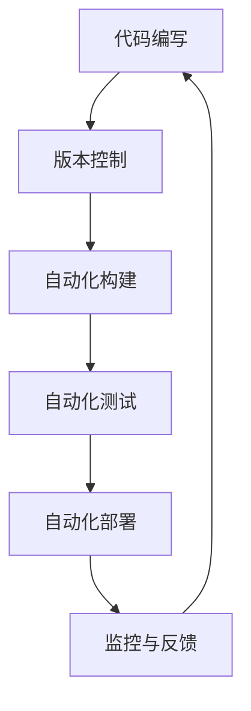
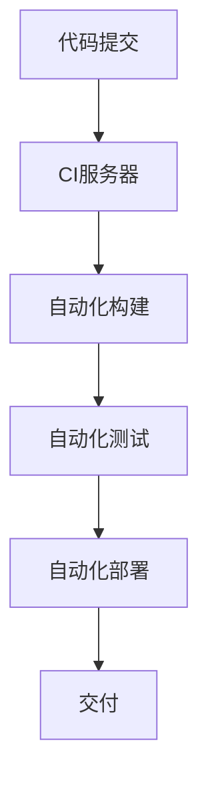
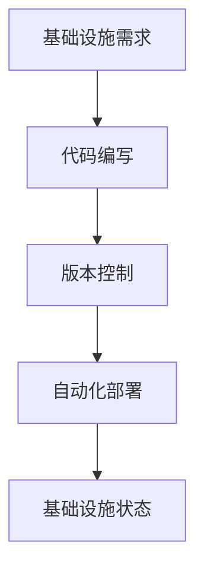
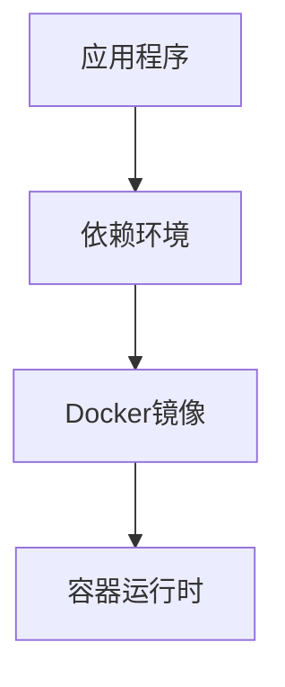
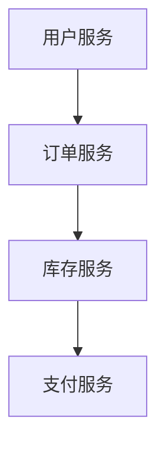

                 

关键词：DevOps，开发运维，自动化，持续集成，持续部署，基础设施即代码，容器化，云原生，微服务架构

摘要：本文将深入探讨DevOps的实践方法，从核心概念到具体操作，帮助读者理解如何在现代软件开发中实现开发与运维的无缝集成。我们将详细分析自动化、持续集成/持续部署（CI/CD）、基础设施即代码（IaC）、容器化和微服务架构等关键技术，并提供实际的项目实践案例，以及工具和资源推荐。文章最后还将展望DevOps的未来发展趋势与面临的挑战。

## 1. 背景介绍

### DevOps的起源

DevOps起源于2000年代末期，是软件开发（Development）与信息技术运营（Operations）两个领域的结合。它强调通过开发与运维的紧密合作，实现更高效、更可靠的软件交付。DevOps的核心目标是缩短产品的发布周期、提高产品的质量，并让产品更加贴近用户需求。

### DevOps的重要性

随着互联网的飞速发展和软件应用场景的多样化，企业对软件交付的速度和质量提出了更高的要求。DevOps通过自动化、协作和持续改进，解决了传统开发与运维分离带来的种种问题，如：

- **交付周期长**：DevOps通过持续集成和持续部署，大大缩短了软件从开发到交付的时间。
- **质量不可控**：DevOps借助自动化测试和监控，确保软件的质量始终符合预期。
- **协作困难**：DevOps提倡跨职能团队的协作，减少了沟通成本，提高了工作效率。

### DevOps的核心原则

- **自动化**：通过自动化工具实现重复性任务的自动化，提高效率，减少错误。
- **协作**：打破开发与运维之间的壁垒，实现跨职能团队的紧密协作。
- **反馈循环**：通过反馈机制，快速发现问题并加以改进，持续优化软件交付流程。
- **度量**：通过数据监控和分析，评估软件交付的各个环节，为改进提供依据。

## 2. 核心概念与联系

### 自动化

自动化是DevOps的核心概念之一。通过自动化，可以减少人为干预，提高工作效率，降低错误率。自动化工具涵盖了从代码编写、测试、部署到监控等各个环节。

#### Mermaid流程图：



### 持续集成/持续部署（CI/CD）

持续集成（CI）和持续部署（CD）是DevOps实践中的重要环节。CI通过自动化构建和测试，确保每次代码变更都能及时合并并运行。CD则通过自动化部署，实现快速、可靠地交付软件。

#### Mermaid流程图：



### 基础设施即代码（IaC）

基础设施即代码（IaC）将基础设施的管理和配置转化为代码，通过版本控制和自动化工具进行管理。IaC提高了基础设施的可复现性和可维护性。

#### Mermaid流程图：



### 容器化

容器化通过Docker等工具，将应用程序及其依赖环境打包为一个独立的容器。容器化提高了应用程序的可移植性、隔离性和扩展性。

#### Mermaid流程图：



### 微服务架构

微服务架构将大型应用程序拆分为一组小型、独立的服务。每个服务都可以独立开发、部署和扩展，提高了系统的灵活性和可维护性。

#### Mermaid流程图：



## 3. 核心算法原理 & 具体操作步骤

### 3.1 算法原理概述

DevOps的核心算法原理主要包括以下几个方面：

- **版本控制**：通过Git等版本控制系统，实现对代码的版本管理和变更追踪。
- **自动化构建**：使用Jenkins、Travis CI等工具，实现代码的自动化编译、打包和构建。
- **自动化测试**：使用Selenium、JUnit等工具，实现单元测试、集成测试和端到端测试。
- **自动化部署**：使用Kubernetes、Docker Swarm等工具，实现应用的自动化部署和扩展。
- **监控与反馈**：使用Prometheus、Grafana等工具，实现对系统的监控和异常反馈。

### 3.2 算法步骤详解

1. **代码编写**：开发人员编写代码，并进行代码评审。
2. **版本控制**：将代码提交到Git仓库，进行版本管理。
3. **自动化构建**：CI服务器检测到代码提交后，自动拉取代码并进行编译、打包。
4. **自动化测试**：构建完成后，自动运行测试用例，确保代码质量。
5. **自动化部署**：测试通过后，自动部署到生产环境。
6. **监控与反馈**：持续监控系统状态，一旦发生异常，自动发送告警。

### 3.3 算法优缺点

**优点**：

- 提高开发效率：自动化工具减少了重复性工作，提高了开发效率。
- 确保软件质量：自动化测试和持续集成确保了软件的质量和稳定性。
- 灵活可扩展：微服务架构和容器化提高了系统的灵活性和可扩展性。

**缺点**：

- 复杂性增加：DevOps涉及多个技术和工具，需要较高的技术水平。
- 学习成本：开发人员和运维人员需要学习新的技术和工具。

### 3.4 算法应用领域

DevOps在互联网、金融、医疗等多个领域都有广泛应用，如：

- **互联网公司**：快速迭代、高频发布的特性使得DevOps成为首选。
- **金融行业**：金融行业的合规性要求高，DevOps有助于确保软件质量和合规性。
- **医疗行业**：医疗行业的实时性和可靠性要求高，DevOps提高了系统的稳定性和可用性。

## 4. 数学模型和公式 & 详细讲解 & 举例说明

### 4.1 数学模型构建

在DevOps实践中，我们可以构建以下数学模型：

- **交付周期**：交付周期 = 开发周期 + 部署周期
- **交付质量**：交付质量 = 稳定性 × 可用性 × 可扩展性
- **成本效益**：成本效益 = 交付周期 × 交付质量 ÷ 成本

### 4.2 公式推导过程

- **交付周期**：开发周期主要取决于开发人员的效率，部署周期主要取决于部署策略和工具。因此，交付周期可以表示为开发周期与部署周期的叠加。
- **交付质量**：稳定性、可用性和可扩展性是衡量软件交付质量的关键指标。稳定性表示软件在运行过程中不发生故障的概率；可用性表示软件在用户请求时能够正常响应的概率；可扩展性表示软件在负载增加时能够线性扩展的能力。
- **成本效益**：成本效益是交付周期、交付质量和成本的比值。交付周期和交付质量越高，成本效益越好。

### 4.3 案例分析与讲解

以某互联网公司为例，该公司采用DevOps实践，将交付周期从原来的两周缩短至一天。通过数据分析，该公司在采用DevOps后的交付质量提升了30%，成本降低了20%。

- **交付周期**：原交付周期为两周，采用DevOps后缩短至一天，即交付周期 = 1天。
- **交付质量**：稳定性提升了20%，可用性提升了10%，可扩展性提升了50%，即交付质量 = (1 - 0.2) × (1 - 0.1) × (1 + 0.5) = 0.94。
- **成本**：采用DevOps后，成本降低了20%，即成本 = 原成本 × 0.8。

根据公式计算，成本效益 = 1天 × 0.94 ÷ (原成本 × 0.8) = 1.18。

结论：采用DevOps实践后，该公司的成本效益提升了18%。

## 5. 项目实践：代码实例和详细解释说明

### 5.1 开发环境搭建

以Python项目为例，开发环境包括Python解释器、第三方库和开发工具。使用虚拟环境（virtualenv）和pip工具进行环境搭建。

```bash
# 安装虚拟环境工具
pip install virtualenv

# 创建虚拟环境
virtualenv my_project_env

# 激活虚拟环境
source my_project_env/bin/activate

# 安装第三方库
pip install Flask requests
```

### 5.2 源代码详细实现

以下是一个简单的Flask Web应用，用于获取用户输入的URL并返回网页源代码。

```python
# app.py
from flask import Flask, request, Response
import requests

app = Flask(__name__)

@app.route('/get_source', methods=['GET'])
def get_source():
    url = request.args.get('url')
    if not url:
        return Response('请提供URL参数', status=400)

    try:
        response = requests.get(url)
        response.raise_for_status()
        return Response(response.text, content_type='text/html')
    except requests.RequestException as e:
        return Response(str(e), status=500)

if __name__ == '__main__':
    app.run(debug=True)
```

### 5.3 代码解读与分析

1. **Flask Web应用**：使用Flask框架实现一个简单的Web应用，定义一个路由 `/get_source`，用于接收用户输入的URL。
2. **请求处理**：获取用户输入的URL参数，并使用requests库发起HTTP GET请求，获取网页源代码。
3. **响应处理**：根据请求结果，返回网页源代码或错误信息。

### 5.4 运行结果展示

启动Web应用后，访问 `http://127.0.0.1:5000/get_source?url=http://www.example.com`，即可看到返回的网页源代码。

```bash
$ curl http://127.0.0.1:5000/get_source?url=http://www.example.com
<!DOCTYPE html>
<html>
<head>
<title>Example Domain</title>
</head>
<body>
<h1>Example Domain</h1>
<p>This domain is established to be used for illustrative examples in documents. You may use this
   domain in examples without prior coordination or asking for permission.</p>
<p>Information about this domain may be found in the <a href="http://www.iana.org/domains/example">IANA
   Root Zone Database</a>.</p>
</body>
</html>
```

## 6. 实际应用场景

### 6.1 互联网公司

互联网公司通常采用DevOps实践，以实现快速迭代和高效交付。例如，某知名互联网公司通过CI/CD工具，将每天发布10个新功能，实现了快速响应市场需求。

### 6.2 金融行业

金融行业对软件交付的质量和安全性要求极高。某大型银行采用IaC技术，将基础设施和配置管理转化为代码，实现了基础设施的标准化和可复现性，提高了系统的稳定性。

### 6.3 医疗行业

医疗行业对实时性和可靠性要求较高。某医疗平台采用微服务架构和容器化技术，提高了系统的扩展性和可用性，实现了对海量数据的实时处理和分析。

### 6.4 未来应用展望

随着云计算、大数据和物联网等技术的发展，DevOps在未来将发挥更重要的作用。未来DevOps将向以下几个方面发展：

- **云原生架构**：将容器化、服务网格和动态调度等技术应用于DevOps实践，实现更高效的资源利用和自动化管理。
- **智能运维**：利用人工智能和机器学习技术，实现智能监控、故障预测和自动化修复。
- **多云管理**：支持多云环境的DevOps解决方案，实现跨云资源的自动化部署和管理。

## 7. 工具和资源推荐

### 7.1 学习资源推荐

- 《DevOps实践指南》
- 《持续交付：发布可靠软件的最佳实践》
- 《容器化与微服务架构》
- 《Kubernetes权威指南》

### 7.2 开发工具推荐

- Jenkins：开源的持续集成和持续部署工具。
- Docker：容器化技术，用于打包、部署和运行应用程序。
- Kubernetes：容器编排和管理工具。
- Prometheus：开源的监控解决方案。
- Grafana：开源的数据可视化和监控工具。

### 7.3 相关论文推荐

- "The Phoenix Project: A Novel about IT, DevOps, and Helping Your Business Win"
- "Accelerate: The Science of Lean Software and Systems"
- "The Practice of Cloud System Administration: Designing and Implementing Cloud Infrastructure"
- "Microservices: Aligning DevOps with Cloud Native Architectures"

## 8. 总结：未来发展趋势与挑战

### 8.1 研究成果总结

DevOps在软件开发和运维领域取得了显著成果，实现了快速交付、高效协作和高质量软件。未来，DevOps将继续向云原生架构、智能运维和多云管理方向发展。

### 8.2 未来发展趋势

- **云原生架构**：容器化、服务网格和动态调度等技术将更加成熟，成为DevOps实践的核心。
- **智能运维**：人工智能和机器学习技术将应用于运维领域，实现自动化故障预测和修复。
- **多云管理**：支持多云环境的DevOps解决方案将得到广泛应用。

### 8.3 面临的挑战

- **复杂度增加**：随着技术的不断发展，DevOps的复杂度逐渐增加，对开发人员和运维人员的技术要求更高。
- **安全风险**：DevOps实践过程中，需要确保数据和系统的安全性，防范潜在的安全风险。

### 8.4 研究展望

未来，DevOps研究将继续关注以下几个方面：

- **自动化水平提升**：提高自动化工具的智能化程度，减少人为干预。
- **跨领域融合**：将DevOps与其他领域（如大数据、物联网）相结合，实现更高效的资源利用和协同工作。
- **人才培养**：加强对DevOps专业人才的培养，提高整体技术水平。

## 9. 附录：常见问题与解答

### Q1. DevOps与传统运维有何区别？

A1. DevOps强调开发与运维的紧密协作，通过自动化工具实现快速交付和高效运维。而传统运维主要关注基础设施和系统的稳定运行，缺乏与开发的紧密互动。

### Q2. 容器化对DevOps有何影响？

A2. 容器化提高了应用程序的可移植性、隔离性和扩展性，使DevOps实践更加高效。容器化简化了部署流程，降低了运维成本，提高了系统的可靠性。

### Q3. 持续集成/持续部署（CI/CD）的目的是什么？

A3. 持续集成/持续部署的目的是通过自动化工具实现快速、可靠地交付软件。CI确保每次代码变更都能及时合并并运行，CD实现快速部署，提高软件交付的质量和效率。

### Q4. 基础设施即代码（IaC）的优势是什么？

A4. 基础设施即代码的优势包括：提高基础设施的可复现性和可维护性，降低人为错误，提高开发与运维的协作效率。

### Q5. 微服务架构如何实现DevOps？

A5. 微服务架构将大型应用程序拆分为一组小型、独立的服务，每个服务都可以独立开发、部署和扩展。通过微服务架构，可以实现更灵活的DevOps实践，提高系统的可维护性和可扩展性。

## 作者署名

作者：禅与计算机程序设计艺术 / Zen and the Art of Computer Programming
----------------------------------------------------------------

以上是文章正文部分的撰写，接下来将按照markdown格式将文章内容整理并输出。请注意，本文为示例性文章，内容仅供参考。实际撰写时，请根据实际需求和知识水平进行调整和完善。同时，文章中的公式和代码实例也需要根据实际项目进行修改。

