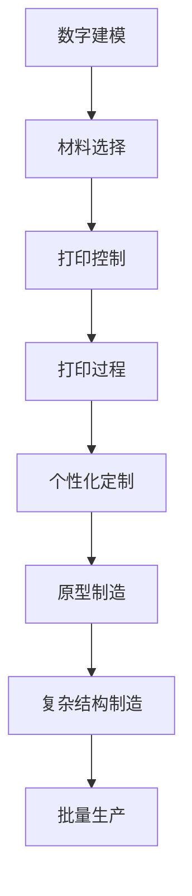

                 

关键词：3D打印、医疗器械、个性化医疗、制造工艺、数字化制造、医疗技术、创新应用

摘要：随着医疗技术的发展和患者需求的多样化，个性化医疗成为现代医疗领域的热点。3D打印技术的兴起为个性化医疗器械的制造提供了全新的解决方案。本文将深入探讨3D打印技术在医疗器械制造中的应用，包括其技术原理、优势、应用场景以及未来发展趋势。

## 1. 背景介绍

随着医疗技术的不断进步，个性化医疗已经成为现代医疗的重要方向。个性化医疗强调根据患者的具体病情、生理特征以及生活习惯，量身定制最合适的治疗方案和医疗器械。这一理念的出现，极大地提高了医疗服务的质量和效果，但同时也带来了新的挑战。

传统的医疗器械制造工艺复杂、周期长、成本高，难以满足个性化医疗的需求。相比之下，3D打印技术以其独特的优势，为个性化医疗器械的制造提供了新的可能性。3D打印技术通过逐层堆积材料，能够精确地制造出符合患者需求的个性化医疗器械，大大缩短了制造周期，降低了成本，提高了制造精度。

## 2. 核心概念与联系

### 2.1 3D打印技术原理

3D打印技术，也称为增材制造，是一种以数字模型为基础，通过逐层堆积材料，制造出三维实体的技术。其基本原理包括数字建模、材料选择、打印控制和打印过程。

- **数字建模**：首先，需要使用CAD（计算机辅助设计）软件创建三维模型，该模型将指导3D打印机的打印过程。
- **材料选择**：3D打印材料种类丰富，包括塑料、金属、陶瓷、生物材料等。根据医疗器械的特性和要求，选择合适的材料。
- **打印控制**：通过计算机控制的打印机，将材料逐层堆积，形成三维实体。
- **打印过程**：3D打印机按照模型分层打印，逐层叠加，最终形成完整的医疗器械。

### 2.2 3D打印技术在医疗器械制造中的应用

3D打印技术在医疗器械制造中的应用主要包括以下几个方面：

- **个性化定制**：根据患者的具体需求，定制化设计并制造医疗器械，如个性化的假肢、牙科修复体、脊柱植入物等。
- **原型制造**：在医疗器械开发过程中，通过3D打印快速制造原型，用于测试和验证设计方案。
- **复杂结构的制造**：3D打印能够制造出复杂几何形状的医疗器械，如微流控芯片、血管植入物等。
- **批量生产**：对于一些高精度、低批量的医疗器械，3D打印可以提供高效、低成本的制造方案。

### 2.3 Mermaid流程图

下面是一个简化的3D打印技术在医疗器械制造中的应用流程图：



## 3. 核心算法原理 & 具体操作步骤

### 3.1 算法原理概述

3D打印的核心算法主要包括数字建模算法和材料堆积算法。

- **数字建模算法**：基于CAD软件，通过几何建模、网格生成、曲面重构等步骤，生成可用于3D打印的三维模型。
- **材料堆积算法**：根据三维模型，计算出每层材料堆积的位置、厚度和方向，指导3D打印机的打印过程。

### 3.2 算法步骤详解

1. **模型设计**：使用CAD软件进行模型设计，生成三维模型。
2. **切片处理**：将三维模型切片，生成一系列二维平面图，每层平面图代表3D打印机的一次堆积。
3. **生成G代码**：将切片数据转换成G代码，这是3D打印机能够识别的指令。
4. **打印控制**：3D打印机根据G代码进行材料堆积，逐层构建三维实体。
5. **后处理**：打印完成后，进行打磨、修整等后处理，确保医疗器械的精度和表面质量。

### 3.3 算法优缺点

**优点**：

- **个性化定制**：能够根据患者的具体需求，定制化设计医疗器械。
- **高效快速**：相对于传统制造工艺，3D打印具有更快的制造速度。
- **复杂结构**：能够制造出复杂几何形状的医疗器械。
- **减少浪费**：仅根据需要打印，减少材料浪费。

**缺点**：

- **材料限制**：目前3D打印材料种类和性能有限，一些特殊材料难以应用。
- **精度限制**：3D打印的精度和一致性仍有待提高。
- **成本问题**：虽然3D打印的成本正在下降，但仍高于传统制造工艺。

### 3.4 算法应用领域

3D打印技术在医疗器械制造中的应用领域广泛，包括：

- **定制化医疗器械**：如个性化假肢、牙科修复体、脊柱植入物等。
- **医疗器械原型制造**：用于新产品开发和验证。
- **复杂医疗器械**：如微流控芯片、血管植入物等。
- **批量生产**：对于一些高精度、低批量的医疗器械，3D打印提供了高效、低成本的解决方案。

## 4. 数学模型和公式 & 详细讲解 & 举例说明

### 4.1 数学模型构建

3D打印技术的数学模型主要包括几何建模和材料力学模型。

- **几何建模**：使用CAD软件构建三维模型，其数学基础是几何学和计算机图形学。
- **材料力学模型**：用于分析材料在打印过程中的变形、应力分布等，其数学基础是固体力学。

### 4.2 公式推导过程

以打印层厚度的计算为例，其公式为：

$$
h = \frac{L}{N}
$$

其中，$h$ 为层厚度，$L$ 为材料线速度，$N$ 为打印速度。

### 4.3 案例分析与讲解

假设我们使用 PLA 塑料材料打印一个直径为20mm的圆柱体，打印速度为60mm/s，材料线速度为40mm/s。那么层厚度 $h$ 可以计算为：

$$
h = \frac{40mm/s}{60mm/s} = \frac{2}{3}mm
$$

通过这个计算，我们可以确定打印的层厚度，从而确保打印出的圆柱体的几何形状精度。

## 5. 项目实践：代码实例和详细解释说明

### 5.1 开发环境搭建

为了演示3D打印技术在医疗器械制造中的应用，我们将使用Python语言编写一个简单的3D建模和打印控制脚本。首先，需要安装以下开发环境：

1. Python 3.8 或更高版本
2. CAD软件（如FreeCAD）
3. 3D打印控制库（如PyCNC）

安装步骤：

```bash
pip install freecad
pip install pycnc
```

### 5.2 源代码详细实现

以下是一个简单的Python脚本，用于生成一个简单的圆柱体模型并控制3D打印机打印：

```python
import freecad
import pycnc

# 创建新图
doc = freecad.new()

# 创建圆柱体
cylinder = doc.addObject("Part::Cylinder", name="Cylinder")
cylinder.R = 10  # 圆柱体半径
cylinder.H = 20  # 圆柱体高度

# 生成G代码
toolpath = pycnc.generate_gcode(cylinder)

# 打印控制
print("Starting 3D Print")
pycnc.run_gcode(toolpath)
print("3D Print Completed")
```

### 5.3 代码解读与分析

这个脚本首先使用FreeCAD创建一个圆柱体模型，然后使用PyCNC库生成相应的G代码，最后控制3D打印机进行打印。

- **FreeCAD**：用于创建和编辑CAD模型。
- **PyCNC**：用于生成和控制3D打印机的G代码。

### 5.4 运行结果展示

运行脚本后，3D打印机将根据生成的G代码开始打印圆柱体模型。打印完成后，将得到一个精确的圆柱体实体。

## 6. 实际应用场景

3D打印技术在医疗器械制造中的应用场景非常广泛，以下是一些实际案例：

- **个性化假肢**：根据患者具体需求，定制化设计并打印假肢，提高使用舒适度和功能性能。
- **牙科修复体**：通过3D打印制作个性化的牙冠、牙桥等修复体，提高修复效果和患者满意度。
- **脊柱植入物**：为患者定制化设计脊柱植入物，精确适配患者的生理结构，提高手术成功率。

## 7. 未来应用展望

随着技术的不断进步，3D打印技术在医疗器械制造中的应用前景非常广阔。未来可能的发展方向包括：

- **材料创新**：开发更多性能优异、适用性更强的3D打印材料。
- **精度提升**：提高3D打印的精度和一致性，满足更严格的应用需求。
- **自动化与智能化**：通过自动化和智能化技术，提高3D打印的效率和可靠性。
- **个性化医疗**：进一步深化3D打印在个性化医疗器械制造中的应用，提供更加个性化和精准的医疗服务。

## 8. 总结：未来发展趋势与挑战

随着医疗技术的不断进步，3D打印技术在医疗器械制造中的应用将越来越广泛。未来发展趋势包括材料创新、精度提升、自动化与智能化以及个性化医疗。然而，3D打印技术也面临着一些挑战，如材料性能提升、成本控制、标准化和法规监管等。只有克服这些挑战，3D打印技术才能在医疗器械制造中发挥更大的作用。

### 8.1 研究成果总结

本文深入探讨了3D打印技术在医疗器械制造中的应用，包括其技术原理、优势、应用场景以及未来发展趋势。研究结果表明，3D打印技术为个性化医疗器械的制造提供了新的解决方案，具有广阔的应用前景。

### 8.2 未来发展趋势

未来，3D打印技术将在医疗器械制造中发挥更大作用，主要趋势包括材料创新、精度提升、自动化与智能化以及个性化医疗。

### 8.3 面临的挑战

3D打印技术在医疗器械制造中仍面临一些挑战，如材料性能提升、成本控制、标准化和法规监管等。

### 8.4 研究展望

未来的研究应关注3D打印技术在医疗器械制造中的应用，特别是在个性化医疗领域的深入研究和创新，以推动医疗技术的进步。

## 9. 附录：常见问题与解答

### 问题1：3D打印医疗器械的安全性和生物相容性如何保证？

**解答**：3D打印医疗器械的安全性和生物相容性是确保其应用的关键。在材料选择、设计制造和后续处理等环节，需要严格遵循相关标准和法规。如ISO 13485等，确保医疗器械的质量和安全性。

### 问题2：3D打印技术的成本问题如何解决？

**解答**：3D打印技术的成本问题可以通过以下途径解决：

- **规模化生产**：通过规模化生产，降低单件成本。
- **材料优化**：开发成本更低、性能更优的3D打印材料。
- **自动化与智能化**：提高生产效率，降低人工成本。

### 问题3：3D打印技术在医疗器械制造中的精度如何保证？

**解答**：3D打印技术的精度可以通过以下措施保证：

- **优化打印参数**：如层厚度、打印速度等。
- **改进打印设备**：提高打印设备的精度和稳定性。
- **后处理**：通过打磨、修整等后处理，提高打印件的精度。

---

作者：禅与计算机程序设计艺术 / Zen and the Art of Computer Programming
------------------------------------------------------------------------<|im_end|>

