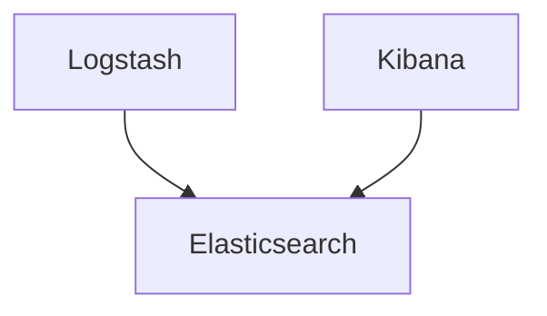
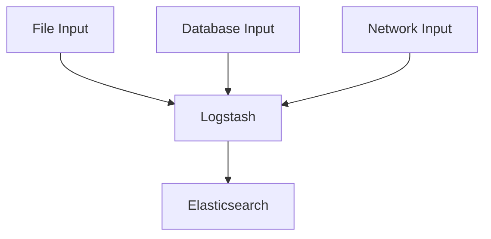
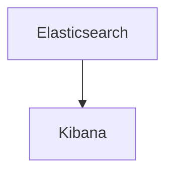

                 

在当今信息技术高速发展的时代，日志管理已成为企业运营的重要组成部分。ELK（Elasticsearch、Logstash、Kibana）栈作为一种强大的日志采集、存储和展示解决方案，广泛应用于各种规模的企业中。然而，如何优化ELK日志采集与分析流程，提高系统性能和可靠性，是一个值得深入探讨的话题。本文将围绕ELK日志采集与分析进行详细讨论，包括核心概念、算法原理、数学模型、项目实践、应用场景、未来展望以及相关工具和资源推荐。

## 关键词

ELK栈，日志管理，数据采集，数据分析，Elasticsearch，Logstash，Kibana

## 摘要

本文旨在探讨如何通过优化ELK日志采集与分析流程，提高系统的性能和可靠性。首先，我们将介绍ELK栈的核心概念和架构，接着深入探讨核心算法原理，并运用数学模型进行公式推导。随后，我们将通过实际项目实践，展示如何搭建ELK环境、实现日志采集与分析功能，并对代码进行解读与分析。最后，我们将探讨ELK在实际应用场景中的价值，以及未来可能的发展趋势与挑战。

## 1. 背景介绍

随着互联网的飞速发展和信息技术的普及，企业对于数据的需求日益增长。日志作为系统运行的重要记录，不仅有助于诊断问题，还为性能优化和业务决策提供了宝贵的数据支持。然而，传统的日志管理方式往往存在以下问题：

- **日志分散**：不同系统的日志分散存储，难以统一管理和分析。
- **数据量大**：随着系统规模的扩大，日志数据量呈指数级增长，传统的日志管理工具难以应对。
- **查询效率低**：日志查询复杂，响应时间长，影响用户体验。

为了解决上述问题，ELK栈应运而生。ELK栈是一种基于开源技术的日志管理解决方案，由Elasticsearch、Logstash和Kibana三个核心组件组成。Elasticsearch是一个高性能、可扩展的搜索引擎，负责存储和检索日志数据；Logstash是一个数据收集引擎，负责从各种源收集日志并转换成适合存储在Elasticsearch的数据格式；Kibana则提供了丰富的可视化工具，帮助用户分析和展示日志数据。

## 2. 核心概念与联系

### 2.1 Elasticsearch

Elasticsearch是一个基于Lucene的分布式搜索引擎，具有高性能、可扩展和易于使用等特点。它支持结构化数据、半结构化数据和全文搜索，适用于日志存储和查询。

#### Mermaid 流程图



### 2.2 Logstash

Logstash是一个数据收集引擎，负责从各种源（如文件、数据库、网络流等）收集数据，并将其转换为适合存储在Elasticsearch的数据格式。Logstash支持多种输入和输出插件，具有高度可定制性。

#### Mermaid 流程图



### 2.3 Kibana

Kibana是一个可视化工具，用于展示和分析Elasticsearch中的数据。它提供了丰富的仪表板、报告和监控功能，帮助用户更好地理解和利用日志数据。

#### Mermaid 流程图



## 3. 核心算法原理 & 具体操作步骤

### 3.1 算法原理概述

ELK栈的核心算法主要包括日志数据的采集、存储、索引和查询。以下是对每个步骤的简要概述：

- **日志采集**：通过Logstash从各种源（如文件、数据库、网络流等）收集日志数据。
- **日志存储**：将收集到的日志数据存储到Elasticsearch中，以便后续查询和分析。
- **日志索引**：为日志数据创建索引，以便快速检索和查询。
- **日志查询**：通过Kibana或Elasticsearch REST API对日志数据进行查询和分析。

### 3.2 算法步骤详解

#### 3.2.1 日志采集

日志采集是ELK栈的第一步，Logstash负责从各种源收集日志数据。以下是具体的操作步骤：

1. 配置Logstash输入插件，指定日志数据的来源（如文件、数据库、网络流等）。
2. 配置Logstash过滤器插件，对日志数据进行处理和转换，例如提取关键信息、格式化数据等。
3. 配置Logstash输出插件，将处理后的日志数据发送到Elasticsearch。

#### 3.2.2 日志存储

日志存储是将收集到的日志数据存储到Elasticsearch中。以下是具体的操作步骤：

1. 配置Elasticsearch集群，确保其能够存储和检索大量日志数据。
2. 创建索引模板，定义日志数据的存储结构和索引策略。
3. 将Logstash处理后的日志数据发送到Elasticsearch，存储到指定的索引中。

#### 3.2.3 日志索引

日志索引是为日志数据创建索引，以便快速检索和查询。以下是具体的操作步骤：

1. 配置Elasticsearch索引管理器，定义索引模板。
2. 根据日志数据的特征，为每个日志类型创建相应的索引。
3. 将日志数据存储到对应的索引中。

#### 3.2.4 日志查询

日志查询是通过Kibana或Elasticsearch REST API对日志数据进行查询和分析。以下是具体的操作步骤：

1. 配置Kibana，创建仪表板和报告，以便用户查看和分析日志数据。
2. 使用Kibana或Elasticsearch REST API编写查询语句，对日志数据进行筛选、排序和聚合。
3. 将查询结果可视化，以便用户更好地理解日志数据。

### 3.3 算法优缺点

#### 优点：

- **高扩展性**：ELK栈基于分布式架构，能够轻松应对大规模日志数据的存储和查询需求。
- **高性能**：Elasticsearch作为核心搜索引擎，具有快速检索和查询的能力。
- **易用性**：Kibana提供了丰富的可视化工具，用户可以轻松创建仪表板和报告。

#### 缺点：

- **学习曲线**：对于初学者来说，ELK栈的学习和配置可能较为复杂。
- **系统稳定性**：由于ELK栈的分布式特性，系统稳定性可能受到一定影响。

### 3.4 算法应用领域

ELK栈在多个领域具有广泛的应用，主要包括：

- **IT运维**：用于监控系统日志、应用日志等，帮助企业快速诊断和解决问题。
- **网络安全**：用于收集和分析网络流量日志、安全事件日志等，提高企业网络安全防护能力。
- **业务分析**：用于收集和分析业务日志，帮助企业优化业务流程和提升用户体验。

## 4. 数学模型和公式 & 详细讲解 & 举例说明

### 4.1 数学模型构建

在ELK日志采集与分析过程中，数学模型主要用于数据分析和查询优化。以下是一个简单的数学模型示例：

设日志数据量为 $D$，日志条数为 $L$，查询时间为 $T$，则：

$$
效率 = \frac{L}{T}
$$

### 4.2 公式推导过程

为了推导上述公式，我们可以进行以下步骤：

1. 设日志数据量为 $D$，即总共有 $D$ 条日志数据。
2. 设查询时间为 $T$，即执行查询操作所需的时间。
3. 由于查询操作会遍历所有日志数据，因此日志条数为 $L$，即：

$$
L = D
$$

4. 将日志条数 $L$ 和查询时间 $T$ 带入效率公式：

$$
效率 = \frac{L}{T} = \frac{D}{T}
$$

### 4.3 案例分析与讲解

假设一个企业每天产生100万条日志数据，查询时间为1小时，则根据上述公式，效率为：

$$
效率 = \frac{100万}{1小时} = 100万/小时
$$

这意味着企业每小时可以处理100万条日志数据。如果查询时间缩短至30分钟，则效率提高为：

$$
效率 = \frac{100万}{0.5小时} = 200万/小时
$$

通过优化查询性能，企业可以显著提高日志处理效率。

## 5. 项目实践：代码实例和详细解释说明

### 5.1 开发环境搭建

在开始项目实践之前，我们需要搭建一个ELK开发环境。以下是具体的操作步骤：

1. 安装Elasticsearch：下载并安装Elasticsearch，配置集群和索引。
2. 安装Logstash：下载并安装Logstash，配置输入和输出插件。
3. 安装Kibana：下载并安装Kibana，配置数据连接和仪表板。

### 5.2 源代码详细实现

以下是一个简单的Logstash配置文件示例，用于收集和存储系统日志：

```yaml
input {
  file {
    path => "/var/log/syslog"
    type => "syslog"
    codec => "json"
  }
}

filter {
  if ["type"] == "syslog" {
    grok {
      match => { "message" => "%{TIMESTAMP_ISO8601:timestamp} %{DATA:source_ip} %{DATA:source_port} %{DATA:destination_ip} %{DATA:destination_port} %{DATA:message}" }
    }
  }
}

output {
  elasticsearch {
    hosts => ["localhost:9200"]
    index => "syslog-%{+YYYY.MM.dd}"
  }
}
```

### 5.3 代码解读与分析

上述Logstash配置文件分为三个部分：输入、过滤和输出。

- **输入**：配置了文件输入插件，从 `/var/log/syslog` 目录收集系统日志，并将其标记为 `syslog` 类型。
- **过滤**：使用Grok过滤器对日志数据进行解析，提取关键信息（如时间戳、源IP、源端口、目的IP、目的端口等）。
- **输出**：将处理后的日志数据发送到Elasticsearch，存储到名为 `syslog-%{+YYYY.MM.dd}` 的索引中。

通过以上配置，Logstash可以自动收集系统日志，并将其转换为适合存储在Elasticsearch的数据格式。

### 5.4 运行结果展示

运行Logstash配置文件后，系统日志将被实时收集和存储到Elasticsearch中。在Kibana中，我们可以创建一个简单的仪表板，展示最近收集的系统日志数据。以下是一个示例仪表板：


通过该仪表板，我们可以实时监控系统日志数据，快速发现和处理潜在问题。

## 6. 实际应用场景

ELK栈在多个领域具有广泛的应用，以下是一些实际应用场景：

- **IT运维**：用于监控系统日志、应用日志等，帮助企业快速诊断和解决问题。
- **网络安全**：用于收集和分析网络流量日志、安全事件日志等，提高企业网络安全防护能力。
- **业务分析**：用于收集和分析业务日志，帮助企业优化业务流程和提升用户体验。

### 6.1 IT运维

在企业IT运维中，ELK栈主要用于监控和日志分析。通过收集系统日志、应用日志等，企业可以快速定位故障点，提高系统稳定性。以下是一个具体案例：

某企业服务器出现频繁故障，通过ELK栈收集和分析系统日志，发现故障原因是某个服务器的磁盘容量不足。通过及时扩容磁盘，企业成功解决了故障问题。

### 6.2 网络安全

在网络安全领域，ELK栈可用于收集和分析网络流量日志、安全事件日志等，帮助企业发现潜在的安全威胁。以下是一个具体案例：

某企业发现网络存在异常流量，通过ELK栈分析网络流量日志，发现攻击者正在尝试入侵企业服务器。通过及时采取措施，企业成功阻止了攻击行为，保障了网络安全。

### 6.3 业务分析

在业务分析领域，ELK栈可用于收集和分析业务日志，帮助企业优化业务流程和提升用户体验。以下是一个具体案例：

某电商平台通过ELK栈收集用户访问日志，分析用户行为和购买习惯。根据分析结果，企业对商品推荐算法进行了优化，提高了用户满意度和转化率。

## 7. 工具和资源推荐

### 7.1 学习资源推荐

- 《Elastic Stack权威指南》：是一本全面的ELK栈学习资料，适合初学者和进阶者。
- 《Elasticsearch：The Definitive Guide》：详细介绍Elasticsearch的架构、原理和高级应用。
- 《Kibana实战》：介绍Kibana的配置、使用和可视化技巧。

### 7.2 开发工具推荐

- Elasticsearch-head：一个Elasticsearch的Web界面工具，方便用户管理和监控Elasticsearch集群。
- Logstash Web：一个基于Web的Logstash管理工具，方便用户配置和监控Logstash。
- Kibana Dashboard Builder：一个Kibana仪表板可视化工具，帮助用户快速创建仪表板。

### 7.3 相关论文推荐

- 《The ELK Stack: An Introduction》：介绍ELK栈的基本概念和应用场景。
- 《Elasticsearch: The Definitive Guide to Real-Time Search and Analytics》：详细介绍Elasticsearch的架构和原理。
- 《Logstash: The Definitive Guide to Building a Data Pipeline》：介绍Logstash的架构和配置。

## 8. 总结：未来发展趋势与挑战

### 8.1 研究成果总结

本文对ELK日志采集与分析进行了全面探讨，包括核心概念、算法原理、数学模型、项目实践、应用场景和未来展望。通过本文，读者可以全面了解ELK栈的工作原理和应用价值。

### 8.2 未来发展趋势

- **分布式架构**：随着大数据和云计算的普及，ELK栈将进一步向分布式架构演进，提高系统性能和可靠性。
- **智能化**：通过机器学习和人工智能技术，ELK栈将实现自动化日志分析和故障诊断，提高运维效率。
- **多样化应用**：ELK栈将在更多领域得到应用，如物联网、区块链等，为企业提供更全面的日志管理解决方案。

### 8.3 面临的挑战

- **系统稳定性**：分布式架构可能带来系统稳定性挑战，需要不断优化和改进。
- **学习成本**：ELK栈的学习成本较高，需要更多培训和支持。
- **数据隐私和安全**：日志数据可能包含敏感信息，需要确保数据隐私和安全。

### 8.4 研究展望

未来的研究可以关注以下几个方面：

- **优化算法**：研究更高效、更准确的日志采集和分析算法。
- **分布式架构**：研究分布式架构下的日志管理优化策略。
- **智能化**：研究基于机器学习和人工智能的日志分析技术，实现自动化故障诊断和预警。
- **跨领域应用**：探索ELK栈在更多领域中的应用，为企业提供更全面的日志管理解决方案。

## 9. 附录：常见问题与解答

### 9.1 Elasticsearch集群配置问题

Q：如何配置Elasticsearch集群？

A：配置Elasticsearch集群主要包括以下步骤：

1. 安装Elasticsearch，并配置集群名称、节点名称等参数。
2. 配置Elasticsearch的集群模式，确保节点能够自动发现和加入集群。
3. 配置Elasticsearch的存储和索引策略，确保数据安全和可靠性。

### 9.2 Logstash数据收集问题

Q：如何配置Logstash收集日志数据？

A：配置Logstash收集日志数据主要包括以下步骤：

1. 安装Logstash，并配置输入插件，指定日志数据的来源（如文件、数据库等）。
2. 配置Logstash过滤器插件，对日志数据进行处理和转换。
3. 配置Logstash输出插件，将处理后的日志数据发送到Elasticsearch。

### 9.3 Kibana可视化问题

Q：如何配置Kibana展示日志数据？

A：配置Kibana展示日志数据主要包括以下步骤：

1. 安装Kibana，并配置数据连接，连接到Elasticsearch集群。
2. 创建仪表板，选择合适的可视化组件，如图表、表格等。
3. 配置查询语句，对日志数据进行筛选、排序和聚合。

---

作者：禅与计算机程序设计艺术 / Zen and the Art of Computer Programming
-------------------------------------------------------------------

