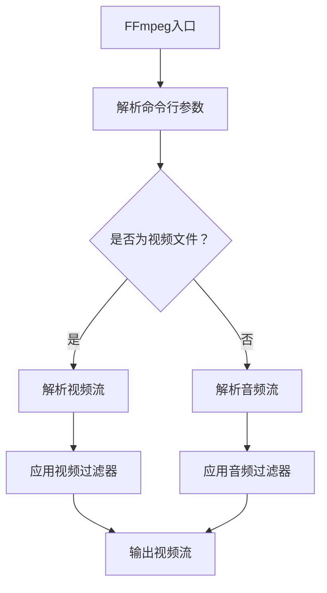

                 

关键词：FFmpeg，视频处理，图像增强，视频编辑，过滤器

> 摘要：本文将深入探讨FFmpeg这一强大的视频处理工具，通过对其核心概念、算法原理、实际应用以及未来发展的介绍，帮助读者理解如何使用FFmpeg进行视频增强和编辑，从而提升视频质量和视觉效果。

## 1. 背景介绍

### FFmpeg的起源与发展

FFmpeg是一个开源的音频和视频处理工具集，其初衷是为了实现音频和视频文件的快速编码、解码、转换以及播放。它起源于2000年，由Fabrice Bellard创建，随着开源社区的贡献不断壮大，FFmpeg已经成为最全面的音频和视频处理工具之一。

### FFmpeg的主要功能

FFmpeg的功能非常广泛，包括但不限于：
- 视频编码和解码：支持几乎所有常见的视频编码格式，如H.264, H.265, MPEG-2等。
- 音频编码和解码：支持多种音频编码格式，如AAC, MP3, Vorbis等。
- 视频合成：可以通过过滤器对视频进行复杂的合成操作，如添加水印、调整色彩等。
- 视频转码：可以将一种视频格式转换为另一种视频格式，适应不同设备或平台的播放需求。
- 音视频同步处理：确保视频和音频在播放过程中保持同步。

### FFmpeg在视频增强和编辑中的重要性

在数字媒体领域，视频增强和编辑是提高视频质量和用户体验的关键步骤。FFmpeg提供了丰富的视频处理工具和过滤器，使得用户能够对视频进行各种增强和编辑操作，从而满足不同场景下的需求。

## 2. 核心概念与联系

### FFmpeg的核心概念

FFmpeg的核心概念包括流（Stream）、过滤器（Filter）和命令行工具（Command-Line Tools）。

- **流（Stream）**：视频和音频数据在FFmpeg中被组织成流，流可以包含视频、音频和字幕等不同的数据类型。
- **过滤器（Filter）**：过滤器是用于处理流数据的小型程序，它们可以对视频或音频进行各种操作，如颜色调整、特效添加、音量调节等。
- **命令行工具（Command-Line Tools）**：命令行工具是FFmpeg提供的用于执行特定任务的命令行程序，如`ffmpeg`用于视频转码，`ffprobe`用于分析媒体文件等。

### FFmpeg的架构与Mermaid流程图




### FFmpeg的工作流程

1. **解析命令行参数**：FFmpeg首先解析输入的命令行参数，确定要处理的视频文件、输出文件和过滤器等。
2. **解析流**：根据命令行参数，FFmpeg解析输入视频文件，提取视频流、音频流和字幕流。
3. **应用过滤器**：针对每个流，FFmpeg应用相应的视频或音频过滤器，进行增强或编辑操作。
4. **输出流**：将处理后的视频、音频和字幕流输出到指定的文件或设备。

## 3. 核心算法原理 & 具体操作步骤

### 3.1 算法原理概述

FFmpeg使用了一系列视频和音频编码解码算法，其中最核心的是H.264和H.265视频编码标准，以及AAC和MP3音频编码标准。这些编码标准通过压缩技术减少数据量，同时保持高质量的视频和音频。

### 3.2 算法步骤详解

#### 视频编码和解码步骤

1. **采样**：视频是通过连续的图像帧（frame）来表示的，每个帧由像素点组成。
2. **压缩**：使用编码算法（如H.264或H.265）对视频帧进行压缩，减少数据量。
3. **解压缩**：在播放视频时，解码算法将压缩的视频数据还原为原始视频帧。
4. **显示**：将解压缩后的视频帧显示在屏幕上。

#### 音频编码和解码步骤

1. **采样**：音频是通过采样率（samples per second）和位深度（bits per sample）来表示的。
2. **压缩**：使用编码算法（如AAC或MP3）对音频数据进行压缩。
3. **解压缩**：在播放音频时，解码算法将压缩的音频数据还原为原始音频信号。
4. **播放**：将解压缩后的音频信号播放出来。

### 3.3 算法优缺点

#### 优点

- **高效压缩**：FFmpeg使用的编码算法具有高效的压缩效果，能够显著减少数据量。
- **支持多种格式**：FFmpeg支持几乎所有的常见视频和音频格式，具有很高的兼容性。
- **丰富的过滤器**：FFmpeg提供了丰富的视频和音频过滤器，可以满足各种增强和编辑需求。

#### 缺点

- **命令行复杂**：FFmpeg的命令行使用较为复杂，初学者可能需要一定时间来熟悉。
- **性能优化要求高**：在处理大量视频或音频数据时，FFmpeg的性能优化是一个挑战。

### 3.4 算法应用领域

FFmpeg在多个领域有广泛应用：

- **流媒体平台**：如YouTube、Netflix等，使用FFmpeg进行视频的上传、转码和流播放。
- **视频监控**：在视频监控系统中，使用FFmpeg对监控视频进行实时处理和存储。
- **视频编辑**：视频编辑软件（如Adobe Premiere Pro、Final Cut Pro）使用FFmpeg作为底层处理引擎。

## 4. 数学模型和公式 & 详细讲解 & 举例说明

### 4.1 数学模型构建

在视频处理中，常用的数学模型包括采样定理、傅里叶变换、小波变换等。

#### 采样定理

$$
f_s \geq 2 \times f_{max}
$$

其中，$f_s$ 是采样率，$f_{max}$ 是信号的最高频率。

#### 傅里叶变换

$$
F(\omega) = \int_{-\infty}^{\infty} f(t) \cos(\omega t) dt
$$

#### 小波变换

$$
W(f, b) = \int_{-\infty}^{\infty} f(t) \psi^*(t - b) dt
$$

### 4.2 公式推导过程

以采样定理为例，推导过程如下：

假设一个信号 $f(t)$ 的最高频率为 $f_{max}$，如果我们以采样率 $f_s$ 进行采样，那么每个采样点的时间间隔为 $T_s = \frac{1}{f_s}$。为了确保采样后的信号能够重建原始信号，采样间隔必须小于信号周期的一半。

$$
T_s = \frac{1}{f_s} \leq \frac{1}{2f_{max}}
$$

从而得到：

$$
f_s \geq 2f_{max}
$$

### 4.3 案例分析与讲解

假设我们有一个音频信号，其最高频率为 $4 kHz$，我们希望对其进行采样和重建。根据采样定理，我们至少需要 $8 kHz$ 的采样率。

**步骤 1**：确定采样率 $f_s = 8 kHz$。

**步骤 2**：计算采样点间隔 $T_s = \frac{1}{8 kHz} = 0.125 ms$。

**步骤 3**：对音频信号进行采样，每个采样点间隔为 $0.125 ms$。

**步骤 4**：使用逆采样定理重建原始信号。

## 5. 项目实践：代码实例和详细解释说明

### 5.1 开发环境搭建

在开始之前，请确保已经安装了FFmpeg。可以通过以下命令检查FFmpeg的版本：

```bash
ffmpeg -version
```

### 5.2 源代码详细实现

以下是一个简单的FFmpeg命令行脚本，用于将视频文件从480p转换为720p：

```bash
ffmpeg -i input.mp4 -vf "scale=1280:720" output.mp4
```

这里，`-i` 参数指定输入文件，`-vf` 参数指定视频过滤器，`scale` 是过滤器名称，后面跟的是输出分辨率。

### 5.3 代码解读与分析

该脚本首先指定输入文件 `input.mp4`，然后使用 `scale` 过滤器将视频分辨率调整为 `1280x720`，最后输出到 `output.mp4`。

- `ffmpeg`：执行FFmpeg命令。
- `-i input.mp4`：指定输入文件。
- `-vf "scale=1280:720"`：应用视频过滤器，将分辨率调整为 `1280x720`。
- `output.mp4`：指定输出文件。

### 5.4 运行结果展示

运行上述脚本后，原始的480p视频文件将被转换为720p视频文件，输出文件 `output.mp4` 的分辨率将提高，画质更加清晰。

## 6. 实际应用场景

### 6.1 视频直播

视频直播平台使用FFmpeg进行实时视频流处理，包括视频压缩、滤镜添加、音视频同步等，以满足带宽和用户体验的需求。

### 6.2 视频监控

在视频监控系统中，FFmpeg用于实时视频流的解码、过滤和转码，以便在监控中心进行实时监控和录像存储。

### 6.3 视频编辑

视频编辑软件如Adobe Premiere Pro和Final Cut Pro使用FFmpeg作为底层处理引擎，进行视频和音频的编辑、特效添加和输出。

### 6.4 未来应用展望

随着AI技术的发展，FFmpeg在未来可能会集成更多的智能视频处理功能，如自动剪辑、智能特效添加、实时人脸识别等。

## 7. 工具和资源推荐

### 7.1 学习资源推荐

- 《FFmpeg 完全手册》：这是一本全面介绍FFmpeg的书籍，适合初学者和高级用户。
- FFmpeg官方文档：FFmpeg的官方网站提供了详细的命令行工具和过滤器文档，是学习FFmpeg的最佳资源。

### 7.2 开发工具推荐

- FFmpeg Build Tools：这是一个方便的FFmpeg构建工具，可以帮助用户快速搭建FFmpeg开发环境。
- FFmpeg GUI工具：如Avidemux和FFmpegX，这些工具提供了图形界面，使得FFmpeg的使用更加直观。

### 7.3 相关论文推荐

- "FFmpeg: A Cross-Platform Solution for Audio and Video Stream Processing"：这篇论文详细介绍了FFmpeg的设计和实现。
- "H.264 High Profile Coding: Tools, Techniques and Performance Analysis"：这篇论文讨论了H.264视频编码的标准和性能。

## 8. 总结：未来发展趋势与挑战

### 8.1 研究成果总结

FFmpeg作为开源视频处理工具，已经成为视频处理领域的标准之一。通过不断的技术创新和社区贡献，FFmpeg在视频编码、解码、转码和滤镜处理等方面取得了显著的成果。

### 8.2 未来发展趋势

- **AI集成**：未来FFmpeg可能会集成更多的AI视频处理功能，如自动剪辑、智能特效等。
- **云原生**：随着云计算技术的发展，FFmpeg可能会在云平台上提供更加高效和灵活的视频处理服务。
- **容器化**：FFmpeg的容器化部署将会使得视频处理更加灵活和可扩展。

### 8.3 面临的挑战

- **性能优化**：处理大量视频数据时，性能优化是一个持续的挑战。
- **生态建设**：随着FFmpeg功能的不断增加，如何维护和扩展其生态系统也是一个挑战。

### 8.4 研究展望

FFmpeg在未来将继续在视频处理领域发挥重要作用，通过技术创新和应用拓展，为数字媒体行业提供更高效、更智能的视频处理解决方案。

## 9. 附录：常见问题与解答

### 问题 1：如何安装FFmpeg？

**解答**：在Linux系统中，可以使用包管理器安装FFmpeg。例如，在Ubuntu系统中，可以使用以下命令：

```bash
sudo apt-get install ffmpeg
```

在Windows系统中，可以访问FFmpeg官方网站下载并安装。

### 问题 2：FFmpeg如何处理多线程？

**解答**：FFmpeg支持多线程处理，可以在命令行中使用 `-threads N` 参数设置线程数，其中N为线程数。例如：

```bash
ffmpeg -i input.mp4 -threads 8 output.mp4
```

这将使用8个线程进行视频处理。

### 问题 3：FFmpeg支持哪些视频格式？

**解答**：FFmpeg支持几乎所有常见的视频格式，如MP4、AVI、MKV、MOV等。具体支持格式可以在FFmpeg官方网站上查看。

### 问题 4：FFmpeg如何进行音频处理？

**解答**：FFmpeg提供了丰富的音频处理过滤器，如`afade`（淡入淡出）、`asetrate`（设置采样率）、`avolume`（调整音量）等。例如：

```bash
ffmpeg -i input.mp4 -af "avolume=volume=+10dB" output.mp4
```

这将增加输入视频文件的音量10dB。

## 作者署名

作者：禅与计算机程序设计艺术 / Zen and the Art of Computer Programming

