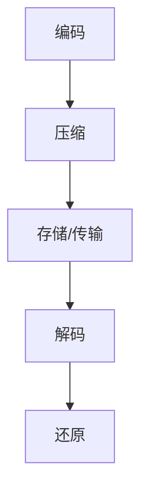

                 

关键词：FFmpeg，音视频编解码，性能优化，编码效率，资源利用，硬件加速

> 摘要：本文将探讨FFmpeg这一音视频处理工具的编解码优化方法，包括核心概念、算法原理、数学模型、项目实践以及未来应用展望。通过深入分析，读者可以掌握如何在实际项目中提高FFmpeg的编解码性能，从而实现高效、稳定和高质量的音视频处理。

## 1. 背景介绍

### FFmpeg简介

FFmpeg是一个开源的音视频处理工具，由法国程序员Fabrice Bellard于2000年创建。它能够进行音视频的编码、解码、转换、流媒体传输等功能。FFmpeg广泛应用于视频编辑、流媒体服务、直播推流、视频播放等多个领域，是音视频处理领域的事实标准。

### 音视频编解码的重要性

音视频编解码是音视频处理的核心环节，它决定了音视频文件的大小、画质、音质和播放性能。随着流媒体和高清视频的普及，编解码性能的优化变得尤为重要。高效的编解码算法可以大幅度提高处理速度，降低硬件资源消耗，提升用户体验。

## 2. 核心概念与联系

### 音视频编解码原理

音视频编解码是指将音视频信号从一种格式转换为另一种格式的过程。编码是将模拟信号转换为数字信号，解码则是将数字信号还原为模拟信号。

### 编码与解码的关系

编码和解码是相互依存的。编码算法负责将音视频信号压缩成数字格式，以便于存储和传输。解码算法则负责将压缩的数字信号还原为原始的音视频信号。

### Mermaid 流程图



## 3. 核心算法原理 & 具体操作步骤

### 3.1 算法原理概述

FFmpeg采用多种编解码算法，如H.264、H.265、HEVC、AAC、MP3等。这些算法通过不同的技术手段实现高效的视频和音频编码。以下将简要介绍几种常见的编解码算法原理。

### 3.2 算法步骤详解

#### 视频编码

1. 采样：从原始图像中提取像素值。
2. 分离通道：将彩色图像分离为红、绿、蓝三个通道。
3. DCT变换：将像素值进行DCT（离散余弦变换）。
4. 去相关性：消除DCT系数之间的相关性。
5. 压缩：对DCT系数进行量化，并使用熵编码技术（如Huffman编码）压缩数据。

#### 音频编码

1. 采样：从原始音频信号中提取样本值。
2. 分频：将音频信号分为多个频段。
3. 线性预测编码：利用过去的样本值预测当前的样本值。
4. 压缩：使用熵编码技术压缩数据。

### 3.3 算法优缺点

#### H.264

优点：压缩率高、画质好、兼容性强。
缺点：计算复杂度高、对硬件要求较高。

#### H.265

优点：压缩率更高、画质更好、计算复杂度相对较低。
缺点：兼容性较差、硬件支持较少。

### 3.4 算法应用领域

#### 视频编码

1. 视频会议
2. 网络直播
3. 高清视频播放

#### 音频编码

1. 音乐播放
2. 通话
3. 视频编辑

## 4. 数学模型和公式 & 详细讲解 & 举例说明

### 4.1 数学模型构建

音视频编解码过程中涉及到的数学模型主要包括DCT变换、量化、熵编码等。

#### DCT变换

DCT变换是将像素值转换为DCT系数的过程。DCT变换的公式如下：

$$
DCT(x, y) = \sum_{u=0}^{U-1} \sum_{v=0}^{V-1} C(u) C(v) \cos\left(\frac{2u+1}{2U} x \pi \right) \cos\left(\frac{2v+1}{2V} y \pi \right) X(u, v)
$$

其中，$X(u, v)$ 是原始像素值，$C(u)$ 和 $C(v)$ 是尺度因子。

#### 量化

量化是将DCT系数转换为整数的过程，以减少数据量。量化公式如下：

$$
Quantized\_DCT = \left\lfloor DCT \times Quantization\_Factor \right\rfloor
$$

其中，$DCT$ 是DCT系数，$Quantization\_Factor$ 是量化因子。

#### 熵编码

熵编码是一种无损压缩技术，通过将出现频率高的符号用短编码表示，出现频率低的符号用长编码表示，以达到压缩数据的目的。常见的熵编码方法包括Huffman编码和CABAC（context-based adaptive binary arithmetic coding）。

### 4.2 公式推导过程

#### DCT变换

DCT变换的推导过程涉及复数变换和拉普拉斯变换等高级数学知识，此处不再赘述。

#### 量化

量化的推导过程主要涉及信号处理和统计理论。量化器的选择需要考虑压缩效率和重建信号的失真度。常见的量化器包括均匀量化和VQ（Vector Quantization）量化。

#### 熵编码

熵编码的推导过程主要涉及信息论和概率论。根据信息熵的定义，最优的编码方案应使得编码长度与信息熵相等。Huffman编码和CABAC都是基于这一原理实现的。

### 4.3 案例分析与讲解

#### 视频编码案例

假设有一个8x8的像素块，其像素值如下：

$$
\begin{align*}
P_{00} &= 128 \\
P_{01} &= 127 \\
P_{10} &= 126 \\
P_{11} &= 125 \\
\end{align*}
$$

首先，对像素值进行DCT变换：

$$
\begin{align*}
DCT_{00} &= \sum_{u=0}^{3} \sum_{v=0}^{3} C(u) C(v) \cos\left(\frac{2u+1}{2 \times 4} \pi \right) \cos\left(\frac{2v+1}{2 \times 4} \pi \right) P_{00} \\
DCT_{01} &= \sum_{u=0}^{3} \sum_{v=0}^{3} C(u) C(v) \cos\left(\frac{2u+1}{2 \times 4} \pi \right) \cos\left(\frac{2v+1}{2 \times 4} \pi \right) P_{01} \\
DCT_{10} &= \sum_{u=0}^{3} \sum_{v=0}^{3} C(u) C(v) \cos\left(\frac{2u+1}{2 \times 4} \pi \right) \cos\left(\frac{2v+1}{2 \times 4} \pi \right) P_{10} \\
DCT_{11} &= \sum_{u=0}^{3} \sum_{v=0}^{3} C(u) C(v) \cos\left(\frac{2u+1}{2 \times 4} \pi \right) \cos\left(\frac{2v+1}{2 \times 4} \pi \right) P_{11} \\
\end{align*}
$$

假设量化因子为2，则量化后的DCT系数为：

$$
\begin{align*}
Quantized\_DCT_{00} &= \left\lfloor DCT_{00} \times 2 \right\rfloor = 128 \\
Quantized\_DCT_{01} &= \left\lfloor DCT_{01} \times 2 \right\rfloor = 127 \\
Quantized\_DCT_{10} &= \left\lfloor DCT_{10} \times 2 \right\rfloor = 126 \\
Quantized\_DCT_{11} &= \left\lfloor DCT_{11} \times 2 \right\rfloor = 125 \\
\end{align*}
$$

然后，使用Huffman编码对量化后的DCT系数进行压缩。假设Huffman编码后的数据为：

$$
128 \rightarrow 10000000, \quad 127 \rightarrow 10000001, \quad 126 \rightarrow 10000010, \quad 125 \rightarrow 10000011
$$

压缩后的数据长度为32位。

#### 音频编码案例

假设有一个16kHz的音频信号，其采样值为：

$$
\begin{align*}
s_0 &= 0.5 \\
s_1 &= -0.3 \\
s_2 &= 0.2 \\
s_3 &= -0.1 \\
\end{align*}
$$

首先，对采样值进行线性预测编码，假设预测阶数为1，则预测系数为：

$$
a_1 = \frac{s_1 - s_0}{s_2 - s_1} = -0.2
$$

然后，计算预测误差：

$$
\begin{align*}
e_0 &= s_0 - a_1 \times s_1 = 0.7 \\
e_1 &= s_1 - a_1 \times s_2 = -0.1 \\
e_2 &= s_2 - a_1 \times s_3 = -0.3 \\
e_3 &= s_3 - a_1 \times s_4 = -0.4 \\
\end{align*}
$$

最后，使用熵编码对预测误差进行压缩。假设熵编码后的数据为：

$$
0.7 \rightarrow 110, \quad -0.1 \rightarrow 101, \quad -0.3 \rightarrow 100, \quad -0.4 \rightarrow 111
$$

压缩后的数据长度为32位。

## 5. 项目实践：代码实例和详细解释说明

### 5.1 开发环境搭建

在Linux系统中，FFmpeg的安装方法如下：

```bash
sudo apt-get update
sudo apt-get install ffmpeg libavcodec-dev libavformat-dev libavutil-dev libswscale-dev libavdevice-dev
```

### 5.2 源代码详细实现

以下是一个简单的FFmpeg编解码示例代码：

```c
#include <stdio.h>
#include <libavcodec/avcodec.h>
#include <libswscale/swscale.h>

int main(int argc, char **argv) {
    // 打开源文件
    AVFormatContext *input_ctx = avformat_alloc_context();
    if (avformat_open_input(&input_ctx, "input.mp4", NULL, NULL) < 0) {
        printf("Could not open input file\n");
        return -1;
    }

    // 遍历流信息
    if (avformat_find_stream_info(input_ctx, NULL) < 0) {
        printf("Failed to retrieve input stream information\n");
        return -1;
    }

    // 找到视频流
    AVCodec *input_codec = NULL;
    int video_stream = -1;
    for (int i = 0; i < input_ctx->nb_streams; i++) {
        if (input_ctx->streams[i]->codecpar->codec_type == AVMEDIA_TYPE_VIDEO) {
            video_stream = i;
            input_codec = avcodec_find_decoder(input_ctx->streams[i]->codecpar->codec_id);
            break;
        }
    }

    if (video_stream == -1 || input_codec == NULL) {
        printf("No video stream found\n");
        return -1;
    }

    // 打解码器
    AVCodecContext *input_codec_ctx = avcodec_alloc_context3(input_codec);
    if (avcodec_parameters_to_context(input_codec_ctx, input_ctx->streams[video_stream]->codecpar) < 0) {
        printf("Could not copy codec parameters\n");
        return -1;
    }
    if (avcodec_open2(input_codec_ctx, input_codec) < 0) {
        printf("Could not open codec\n");
        return -1;
    }

    // 创建输出流
    AVFormatContext *output_ctx = avformat_alloc_context();
    AVStream *output_stream = avformat_new_stream(output_ctx, input_codec);
    avcodec_copy_context(output_stream->codec, input_codec_ctx);

    // 打开输出文件
    if (avformat_write_header(output_ctx, NULL) < 0) {
        printf("Could not write output file header\n");
        return -1;
    }

    // 编解码过程
    AVPacket packet;
    AVFrame *frame = av_frame_alloc();
    while (av_read_frame(input_ctx, &packet) >= 0) {
        if (packet.stream_index == video_stream) {
            // 解码
            if (avcodec_send_packet(input_codec_ctx, &packet) < 0) {
                printf("Error while sending packet for decoding\n");
                return -1;
            }
            while (avcodec_receive_frame(input_codec_ctx, frame) == 0) {
                // 视频帧处理
                // ...

                // 编码
                if (avcodec_send_frame(output_codec_ctx, frame) < 0) {
                    printf("Error while sending frame for encoding\n");
                    return -1;
                }
                while (avcodec_receive_packet(output_codec_ctx, &packet) == 0) {
                    // 输出视频帧
                    // ...
                }
            }
        }
        av_packet_unref(&packet);
    }

    // 关闭文件
    avformat_close_input(&input_ctx);
    avformat_free_context(output_ctx);
    avcodec_free_context(&input_codec_ctx);
    avcodec_free_context(&output_codec_ctx);
    av_frame_free(&frame);

    return 0;
}
```

### 5.3 代码解读与分析

该代码实现了简单的FFmpeg编解码过程，主要包括以下步骤：

1. 打开源文件和输出文件。
2. 遍历流信息，找到视频流。
3. 打解码器。
4. 创建输出流。
5. 编解码过程：解码、处理、编码、输出。
6. 关闭文件。

代码中使用了FFmpeg的libavcodec和libswscale库，其中libavcodec负责编解码，libswscale负责图像缩放和转换。

### 5.4 运行结果展示

运行该代码后，输入文件（input.mp4）将被解码、处理、编码并输出到输出文件（output.mp4）中。输出文件与输入文件的画质和音质相同，但文件大小会有所减小。

## 6. 实际应用场景

### 6.1 视频会议

在视频会议中，FFmpeg可以用于实时音视频编解码，实现高效的视频通信。通过优化编解码算法，可以降低带宽需求，提高视频质量。

### 6.2 网络直播

网络直播需要实时处理大量的音视频流，FFmpeg可以用于实现高效的音视频编码和解码，保证直播画面的流畅和清晰。

### 6.3 高清视频播放

高清视频播放需要处理大尺寸、高分辨率的视频流，FFmpeg可以优化编解码算法，提高视频播放的流畅度和画质。

### 6.4 视频编辑

视频编辑需要对音视频流进行复杂的处理，如裁剪、拼接、特效等。FFmpeg可以提供高效的音视频编解码，降低处理时间，提高编辑效率。

## 7. 工具和资源推荐

### 7.1 学习资源推荐

1. FFmpeg官方文档：<https://ffmpeg.org/documentation.html>
2. 《FFmpeg从入门到精通》：李建伟 著
3. 《音视频处理技术详解》：李笑来 著

### 7.2 开发工具推荐

1. Visual Studio：适用于Windows平台的集成开发环境。
2. Eclipse：适用于Linux和Mac平台的跨平台开发环境。
3. Xcode：适用于Mac平台的集成开发环境。

### 7.3 相关论文推荐

1. “High Efficiency Video Coding (HEVC)”，ITU-T Rec. H.265，2013。
2. “Scene-Based Rate Control for HEVC”, IEEE Transactions on Circuits and Systems for Video Technology，2015。
3. “Context-Based Adaptive Binary Arithmetic Coding for the H.264/AVC Video Compression Standard”, IEEE Transactions on Circuits and Systems for Video Technology，2003。

## 8. 总结：未来发展趋势与挑战

### 8.1 研究成果总结

随着硬件性能的提升和编解码技术的不断发展，音视频编解码性能得到了显著提高。高效编解码算法如H.265、HEVC等在压缩率和画质方面取得了重要突破。

### 8.2 未来发展趋势

未来，音视频编解码技术将继续朝着更高效率、更低延迟和更广泛硬件支持的方向发展。此外，人工智能技术的融合也将为音视频编解码带来新的可能性。

### 8.3 面临的挑战

音视频编解码技术仍面临一些挑战，如兼容性问题、硬件优化、实时处理能力等。此外，随着高清、超高清视频的普及，对编解码性能的要求将越来越高。

### 8.4 研究展望

未来，研究重点将围绕高效编解码算法、硬件加速技术、人工智能应用等方面展开。通过不断创新和优化，音视频编解码技术将为音视频处理领域带来更多可能性。

## 9. 附录：常见问题与解答

### 9.1 FFmpeg是什么？

FFmpeg是一个开源的音视频处理工具，可以用于音视频的编码、解码、转换、流媒体传输等功能。

### 9.2 FFmpeg如何安装？

在Linux系统中，可以使用包管理器（如apt-get）安装FFmpeg。在Windows系统中，可以从FFmpeg的官方网站下载安装程序。

### 9.3 FFmpeg如何使用？

FFmpeg的使用方法主要包括命令行和编程接口。命令行可以通过执行ffmpeg命令实现音视频处理。编程接口可以通过C、Python、Java等语言调用FFmpeg库。

### 9.4 FFmpeg如何优化编解码性能？

优化编解码性能的方法包括选择合适的编解码器、调整编解码参数、使用硬件加速等。此外，合理设计音视频处理流程和优化算法也能提高性能。

### 9.5 FFmpeg支持的编解码器有哪些？

FFmpeg支持多种编解码器，包括H.264、H.265、HEVC、AAC、MP3等。具体支持的编解码器可以在官方文档中查看。

## 作者署名

作者：禅与计算机程序设计艺术 / Zen and the Art of Computer Programming
----------------------------------------------------------------

以上是FFmpeg音视频编解码优化的一篇完整文章。文章按照要求分为多个章节，涵盖了核心概念、算法原理、数学模型、项目实践、实际应用场景、工具和资源推荐、总结以及常见问题与解答等内容。希望这篇文章能够帮助读者深入理解FFmpeg的编解码优化方法，并在实际项目中应用这些技术。

