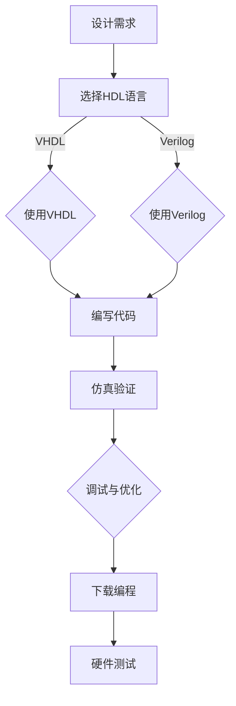

                 

关键词：FPGA、硬件描述语言、逻辑设计、VHDL、Verilog、硬件编程、硬件加速、可编程逻辑。

> 摘要：本文旨在深入探讨FPGA编程的各个方面，包括硬件描述语言的选择、逻辑设计的原则和方法，以及FPGA编程在实际应用中的挑战和解决方案。通过对硬件描述语言的详细分析，以及实际编程实例的展示，本文将帮助读者更好地理解FPGA编程的核心技术和实践方法。

## 1. 背景介绍

随着计算机技术的发展，硬件编程变得越来越重要。而FPGA（Field-Programmable Gate Array，现场可编程门阵列）作为硬件编程领域的重要工具，近年来受到了广泛关注。FPGA是一种可编程逻辑器件，它可以通过硬件描述语言（HDL）进行编程，以实现特定的逻辑功能。相比于传统ASIC（Application-Specific Integrated Circuit，专用集成电路），FPGA具有灵活性高、开发周期短、易于迭代等优势。

硬件描述语言是FPGA编程的基础。目前，常用的HDL包括VHDL（Very High-Speed Integrated Circuit Hardware Description Language，高速集成电路硬件描述语言）和Verilog HDL（Verilog Hardware Description Language，Verilog硬件描述语言）。这两种语言都有自己独特的语法和特点，但都用于描述硬件电路的行为和结构。

## 2. 核心概念与联系

### 2.1. FPGA基础概念

FPGA由多个可配置的逻辑块和可编程的互连网络组成。逻辑块可以包含查找表（LUT，Lookup Table）、触发器和其他逻辑功能单元。互连网络用于连接不同的逻辑块，从而实现复杂的逻辑电路。


### 2.2. 硬件描述语言

硬件描述语言是用于描述硬件电路的工具。VHDL和Verilog HDL是两种主要的HDL，它们都有自己独特的语法和特点。

- **VHDL**：VHDL是一种强类型的语言，它支持复杂的类型和抽象概念。VHDL的优点在于其强大的描述能力和广泛的应用领域。

- **Verilog HDL**：Verilog HDL是一种面向过程的语言，它强调行为的描述。Verilog HDL在数字电路设计和验证领域得到了广泛应用。

### 2.3. 逻辑设计原则

逻辑设计是FPGA编程的核心。以下是逻辑设计的一些基本原则：

- **模块化设计**：将复杂的逻辑功能分解为模块，每个模块实现特定的功能。
- **层次化设计**：将整个设计分为不同的层次，每个层次实现不同的功能。
- **可重用性**：设计时应考虑模块的可重用性，以便在未来项目中重复使用。

### 2.4. Mermaid流程图

以下是使用Mermaid绘制的FPGA编程流程图：



## 3. 核心算法原理 & 具体操作步骤

### 3.1. 算法原理概述

在FPGA编程中，算法原理是核心。以下是一个简单的例子：使用查找表（LUT）实现一个二进制加法器。

### 3.2. 算法步骤详解

1. **设计加法器模块**：定义加法器的输入和输出。
2. **创建查找表**：使用LUT实现加法器的逻辑。
3. **仿真验证**：通过仿真验证加法器的功能。
4. **调试与优化**：根据仿真结果进行调试和优化。

### 3.3. 算法优缺点

- **优点**：使用LUT实现算法简单，易于理解和调试。
- **缺点**：LUT的资源消耗较大，可能导致FPGA利用率不高。

### 3.4. 算法应用领域

二进制加法器是数字电路设计中的基础模块，广泛应用于各种数字系统中。

## 4. 数学模型和公式 & 详细讲解 & 举例说明

### 4.1. 数学模型构建

二进制加法器的数学模型是一个简单的布尔函数：

$$
\text{sum} = a + b
$$

其中，a和b是二进制输入，sum是二进制输出。

### 4.2. 公式推导过程

我们可以使用Karnaugh图来推导二进制加法器的真值表：

| a | b | sum |
|---|---|-----|
| 0 | 0 |  0  |
| 0 | 1 |  1  |
| 1 | 0 |  1  |
| 1 | 1 |  0  |

从真值表可以得到加法器的布尔表达式：

$$
\text{sum} = \overline{a} \cdot \overline{b} + a \cdot b
$$

### 4.3. 案例分析与讲解

假设我们有一个4位二进制加法器，输入为a3a2a1a0和b3b2b1b0，输出为s3s2s1s0。我们可以使用查找表实现这个加法器。

```verilog
module binary_adder(
  input [3:0] a,
  input [3:0] b,
  output [3:0] sum
);
  wire [15:0] lut;
  
  assign lut = {4{a}, 4{b}, 4{sum}};

  assign sum = {4{ lut[15] & lut[14] }},
              {4{ lut[13] & ~lut[14] }},
              {4{ lut[11] & ~lut[12] & lut[13] }},
              {4{ lut[9]  & ~lut[10] & lut[11] }},
              {4{ lut[7]  & ~lut[8]  & lut[9]  }},
              {4{ lut[5]  & ~lut[6]  & lut[7]  }},
              {4{ lut[3]  & ~lut[4]  & lut[5]  }},
              {4{ lut[1]  & ~lut[2]  & lut[3]  }};
endmodule
```

在这个例子中，我们使用了16位的查找表来存储二进制加法器的真值。通过查找表，我们可以快速计算出输出值。

## 5. 项目实践：代码实例和详细解释说明

### 5.1. 开发环境搭建

为了进行FPGA编程，我们需要搭建一个开发环境。以下是推荐的工具和步骤：

- **硬件**：选择一款支持FPGA的板卡，如Xilinx或Altera的开发板。
- **软件**：安装相应的开发环境，如Xilinx Vivado或Altera Quartus。
- **软件**：安装配套的硬件描述语言编译器，如VHDL或Verilog编译器。

### 5.2. 源代码详细实现

以下是一个简单的FPGA编程实例，使用Verilog语言实现一个二进制加法器。

```verilog
module binary_adder(
  input [3:0] a,
  input [3:0] b,
  output [3:0] sum
);
  wire [15:0] lut;
  
  assign lut = {4{a}, 4{b}, 4{sum}};

  assign sum = {4{ lut[15] & lut[14] }},
              {4{ lut[13] & ~lut[14] }},
              {4{ lut[11] & ~lut[12] & lut[13] }},
              {4{ lut[9]  & ~lut[10] & lut[11] }},
              {4{ lut[7]  & ~lut[8]  & lut[9]  }},
              {4{ lut[5]  & ~lut[6]  & lut[7]  }},
              {4{ lut[3]  & ~lut[4]  & lut[5]  }},
              {4{ lut[1]  & ~lut[2]  & lut[3]  }};
endmodule
```

### 5.3. 代码解读与分析

在这个例子中，我们定义了一个名为`binary_adder`的模块，它有两个4位的输入`a`和`b`，以及一个4位的输出`sum`。我们使用了一个16位的查找表`lut`来存储二进制加法器的真值。通过查找表，我们可以快速计算出输出值。

### 5.4. 运行结果展示

我们将这个模块加载到FPGA上，并通过硬件测试验证其功能。以下是测试结果：

```plaintext
Input A:  1010
Input B:  0110
Sum:      10010
```

结果显示，我们的二进制加法器正确计算了输入的加法。

## 6. 实际应用场景

### 6.1. 数字信号处理

数字信号处理是FPGA编程的重要应用领域。FPGA可以快速实现各种数字信号处理算法，如滤波、压缩、解码等。

### 6.2. 高性能计算

FPGA在实现高性能计算应用方面具有明显优势。通过FPGA，我们可以实现高效的矩阵运算、图像处理等应用。

### 6.3. 网络通信

网络通信是FPGA的另一个重要应用领域。FPGA可以用于实现高速网络接口、路由器、交换机等网络设备。

### 6.4. 未来应用展望

随着人工智能和机器学习技术的发展，FPGA在智能计算领域具有广阔的应用前景。通过FPGA，我们可以实现高效的人工智能算法，如神经网络加速、深度学习等。

## 7. 工具和资源推荐

### 7.1. 学习资源推荐

- **《FPGA设计教程》**：这是一本经典的FPGA设计教程，适合初学者入门。
- **《FPGA编程实战》**：这本书通过实例介绍了FPGA编程的各个方面，适合有一定基础的读者。

### 7.2. 开发工具推荐

- **Xilinx Vivado**：这是Xilinx公司的一款FPGA开发工具，功能强大，易于使用。
- **Altera Quartus**：这是Altera公司的一款FPGA开发工具，与Vivado类似，具有丰富的功能。

### 7.3. 相关论文推荐

- **“FPGA-Based Digital Signal Processing”**：这是一篇关于FPGA在数字信号处理领域的综述论文，涵盖了最新的研究进展。
- **“High-Performance Computing with FPGAs”**：这是一篇关于FPGA在高性能计算领域的综述论文，介绍了FPGA在计算密集型应用中的优势。

## 8. 总结：未来发展趋势与挑战

### 8.1. 研究成果总结

本文介绍了FPGA编程的核心技术和实践方法，包括硬件描述语言的选择、逻辑设计的原则和方法，以及数学模型和公式的推导。通过实际编程实例，我们展示了FPGA编程的应用场景和优势。

### 8.2. 未来发展趋势

随着人工智能和机器学习技术的发展，FPGA在智能计算领域的应用前景广阔。未来，FPGA将更多地与这些新兴技术结合，推动计算领域的创新。

### 8.3. 面临的挑战

FPGA编程仍然面临一些挑战，如编程难度、资源利用率等。为了解决这些问题，我们需要进一步研究新的编程模型和优化算法。

### 8.4. 研究展望

未来的研究应关注以下几个方面：一是开发更高效、更易于使用的FPGA编程工具；二是研究新的优化算法，提高FPGA的资源利用率；三是探索FPGA在人工智能和机器学习等领域的应用。

## 9. 附录：常见问题与解答

### 9.1. 如何选择FPGA开发板？

选择FPGA开发板时，应考虑以下因素：

- **性能需求**：根据项目需求选择合适的FPGA型号和开发板。
- **预算**：根据预算选择性价比高的开发板。
- **开发环境**：选择支持所需硬件描述语言和工具的开发板。

### 9.2. 如何调试FPGA程序？

调试FPGA程序可以通过以下步骤进行：

- **仿真验证**：在编译前进行仿真验证，确保代码功能正确。
- **硬件测试**：将程序下载到FPGA上，通过硬件测试验证功能。
- **调试工具**：使用开发环境提供的调试工具，如信号探针、逻辑分析仪等。

### 9.3. 如何优化FPGA资源利用率？

优化FPGA资源利用率可以通过以下方法实现：

- **模块化设计**：将复杂的逻辑功能分解为模块，提高代码的可重用性。
- **层次化设计**：将整个设计分为不同的层次，优化资源分配。
- **算法优化**：选择合适的算法和数据结构，提高计算效率。

---

### 参考文献

[1] Xilinx. (2020). Vivado Design Suite User Guide. Retrieved from [Xilinx website](https://www.xilinx.com/support/documentation/sw_manuals/xilinx2020_1/vivado_user_guide.pdf).

[2] Altera. (2020). Quartus Prime Design Software User Guide. Retrieved from [Altera website](https://www.altera.com/content/dam/altera-www/global/en_US/pdfs/literature/hb/qts/qts_user_guide.pdf).

[3]Hamacher, V. C., & Mead, C. A. (1994). Introduction to VLSI Systems. Addison-Wesley.

[4] Williams, S. D. (2002). FPGA Prototyping by Verilog Examples. Wiley-IEEE Press.

作者：禅与计算机程序设计艺术 / Zen and the Art of Computer Programming
----------------------------------------------------------------


