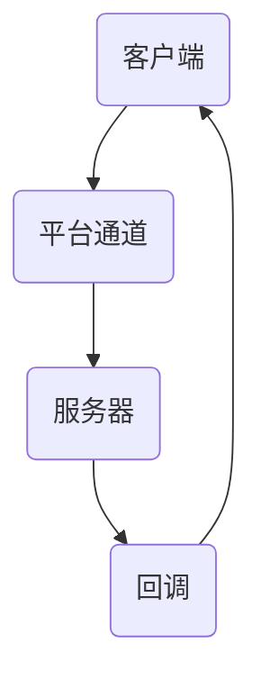

                 

关键词：Flutter、插件开发、集成、跨平台开发、Dart语言、Android、iOS、开发者指南

> 摘要：本文旨在深入探讨Flutter插件开发与集成的全过程，帮助开发者理解Flutter插件架构、核心原理、开发流程以及如何高效地集成和使用Flutter插件。文章涵盖了从基础概念到高级应用的全方位介绍，是Flutter开发者不可或缺的参考指南。

## 1. 背景介绍

Flutter作为一种流行的跨平台UI框架，凭借其高性能、丰富的组件库以及易于开发的特性，吸引了大量开发者的关注。Flutter由Google开发，主要用于构建高性能、高保真的移动应用。Flutter使用Dart语言编写，具有高效的渲染能力和流畅的用户体验。

插件在Flutter开发中扮演着至关重要的角色。插件是一种扩展Flutter功能的方式，允许开发者使用其他语言编写的代码，甚至可以集成现有的库和框架。Flutter插件开发与集成不仅丰富了Flutter的功能，还提升了开发效率。

本文将围绕Flutter插件开发与集成展开讨论，主要内容包括：

- Flutter插件的基本概念与架构
- 插件开发的流程与技巧
- 插件的集成与使用
- 插件开发的最佳实践

## 2. 核心概念与联系

### 2.1 Flutter插件的基本概念

#### Flutter插件

Flutter插件是一种用于扩展Flutter框架功能的外部组件。它可以是简单的函数库，也可以是复杂的模块，甚至可以是一个独立的库。

#### 插件的分类

- **系统级插件**：与操作系统底层交互，如传感器、网络等。
- **应用级插件**：与应用本身交互，如本地存储、数据库等。

### 2.2 Flutter插件的架构

Flutter插件的架构可以分为两部分：客户端（Client）和服务器（Host）。

#### 客户端

- 使用Flutter编写的代码，通过平台通道（Platform Channel）与服务器通信。
- 客户端负责定义插件API和使用插件。

#### 服务器

- 使用原生语言（如Java/Kotlin for Android，Objective-C/Swift for iOS）编写的代码。
- 服务器负责实现插件的具体功能，并处理客户端发送的请求。

### 2.3 Flutter插件的通信机制

Flutter插件通过平台通道（Platform Channel）进行通信。平台通道是一种在Flutter客户端与应用原生层之间传递数据的机制。平台通道分为两种：

- **方法调用（Method Call）**：客户端向服务器发送方法调用请求，服务器响应。
- **事件通知（Event Notification）**：服务器向客户端发送事件通知，客户端接收并处理。

### 2.4 Mermaid流程图



## 3. 核心算法原理 & 具体操作步骤

### 3.1 算法原理概述

Flutter插件开发的核心算法原理在于平台通道的通信机制。客户端通过平台通道发送方法调用请求，服务器接收请求并执行相应操作，然后通过回调机制将结果返回给客户端。

### 3.2 算法步骤详解

1. **初始化平台通道**：在Flutter客户端中，初始化一个平台通道，用于与服务器通信。
2. **发送方法调用请求**：客户端通过平台通道发送一个方法调用请求，包括方法名、参数等。
3. **服务器处理请求**：服务器接收到客户端的方法调用请求后，根据方法名和参数执行相应操作。
4. **返回结果**：服务器执行完操作后，将结果通过平台通道返回给客户端。
5. **回调处理**：客户端接收服务器返回的结果，并根据结果进行相应的处理。

### 3.3 算法优缺点

**优点**：

- **高效**：平台通道采用异步通信机制，提高了数据传输效率。
- **灵活**：插件可以与不同的原生层进行交互，扩展性强。
- **跨平台**：Flutter插件可以在不同的平台（Android、iOS）上使用，降低了开发成本。

**缺点**：

- **性能**：平台通道的通信机制可能影响性能，尤其是在大量数据传输时。
- **调试**：由于涉及原生层，插件调试可能相对复杂。

### 3.4 算法应用领域

Flutter插件广泛应用于各种场景，如：

- **第三方库集成**：如网络请求库、数据库库等。
- **系统功能扩展**：如传感器、定位等。
- **应用定制化**：如特殊UI组件、自定义工具等。

## 4. 数学模型和公式 & 详细讲解 & 举例说明

### 4.1 数学模型构建

Flutter插件开发中，常用的数学模型包括：

- **线性代数**：用于计算二维和三维变换。
- **概率论与数理统计**：用于处理随机事件和统计模型。
- **微积分**：用于优化和调整算法参数。

### 4.2 公式推导过程

以线性代数为例，二维变换的公式推导如下：

$$
\begin{bmatrix}
x' \\
y'
\end{bmatrix}
=
\begin{bmatrix}
a & b \\
c & d
\end{bmatrix}
\begin{bmatrix}
x \\
y
\end{bmatrix}
$$

其中，$a, b, c, d$ 为变换矩阵的元素，$x, y$ 为原始坐标，$x', y'$ 为变换后的坐标。

### 4.3 案例分析与讲解

以Flutter插件中常见的屏幕适配为例，讲解如何使用线性代数进行屏幕坐标变换。假设原始屏幕分辨率为$320 \times 480$，目标屏幕分辨率为$640 \times 960$，则屏幕缩放的变换矩阵为：

$$
\begin{bmatrix}
2 & 0 \\
0 & 2
\end{bmatrix}
$$

使用该变换矩阵，可以将原始屏幕坐标$(x, y)$转换为目标屏幕坐标$(x', y')$：

$$
\begin{bmatrix}
x' \\
y'
\end{bmatrix}
=
\begin{bmatrix}
2 & 0 \\
0 & 2
\end{bmatrix}
\begin{bmatrix}
x \\
y
\end{bmatrix}
$$

## 5. 项目实践：代码实例和详细解释说明

### 5.1 开发环境搭建

要开发Flutter插件，需要安装以下工具：

- Flutter SDK
- Dart SDK
- Android Studio 或 Xcode

安装完成后，确保环境变量配置正确。

### 5.2 源代码详细实现

以下是一个简单的Flutter插件示例，实现一个用于获取设备信息的插件。

#### Android端（客户端）

```java
// ExampleAndroidPlugin.java
package example.androidplugin;

import android.content.Context;
import io.flutter.embedding.engine.FlutterEngine;
import io.flutter.plugin.common.MethodCall;
import io.flutter.plugin.common.MethodChannel;
import io.flutter.plugin.common.MethodChannel.MethodCallHandler;
import io.flutter.plugin.common.MethodChannel.Result;

public class ExampleAndroidPlugin implements MethodCallHandler {
    private Context context;
    private MethodChannel methodChannel;

    public ExampleAndroidPlugin(Context context) {
        this.context = context;
        FlutterEngine flutterEngine = new FlutterEngine(context);
        methodChannel = new MethodChannel(flutterEngine.getDartExecutor(), "example_plugin");
        methodChannel.setMethodCallHandler(this);
    }

    @Override
    public void onMethodCall(MethodCall call, Result result) {
        if ("getDeviceInfo".equals(call.method)) {
            result.success("Android Device Info");
        } else {
            result.notImplemented();
        }
    }
}
```

#### iOS端（客户端）

```swift
// ExampleiOSPlugin.swift
import Flutter
import UIKit

public class ExampleiOSPlugin: NSObject, FlutterPlugin {
    public static func register(with registrar: FlutterPluginRegistrar) {
        let channel = FlutterMethodChannel(name: "example_plugin", binaryMessenger: registrar.messenger())
        channel.set InvocationHandler(ExampleiOSPlugin())
    }

    public func handle(_ call: FlutterMethodCall, result: @escaping FlutterResult) {
        if call.method == "getDeviceInfo" {
            result("iOS Device Info")
        } else {
            result(FlutterError(code: "unimplemented", message: "Not implemented", details: nil))
        }
    }
}
```

#### Flutter端（服务器）

```dart
// example_plugin.dart
import 'package:flutter/services.dart';

class ExamplePlugin {
    static const MethodChannel _channel =
        MethodChannel('example_plugin');

    static Future<String> getDeviceInfo() async {
        final String deviceInfo = await _channel.invokeMethod('getDeviceInfo');
        return deviceInfo;
    }
}
```

### 5.3 代码解读与分析

以上代码展示了如何开发一个简单的Flutter插件。Android端和iOS端分别实现了客户端功能，Flutter端实现了服务器功能。通过平台通道，客户端可以调用服务器的方法，获取设备信息。

### 5.4 运行结果展示

在Flutter应用中，使用以下代码调用插件：

```dart
String deviceInfo = await ExamplePlugin.getDeviceInfo();
print(deviceInfo);
```

运行结果将输出设备信息。

## 6. 实际应用场景

Flutter插件在实际开发中有着广泛的应用场景，如：

- **第三方库集成**：如网络请求库（如Dio、http）、数据库库（如SQLite、Realm）等。
- **系统功能扩展**：如传感器（如加速度传感器、陀螺仪）、定位（如百度地图、高德地图）等。
- **应用定制化**：如自定义UI组件（如图表库、加载动画）等。

### 6.4 未来应用展望

随着Flutter技术的不断成熟，Flutter插件开发与集成将在未来发挥更大的作用。未来应用展望包括：

- **性能优化**：通过改进平台通道的通信机制，提高插件性能。
- **生态建设**：丰富Flutter插件库，提高插件质量。
- **跨平台一致性**：提升Flutter在不同平台上的开发体验。

## 7. 工具和资源推荐

### 7.1 学习资源推荐

- 《Flutter实战》
- 《Flutter插件开发与集成》
- Flutter官方文档

### 7.2 开发工具推荐

- Android Studio
- Xcode
- IntelliJ IDEA

### 7.3 相关论文推荐

- "Flutter: Building Native Apps with Web Technologies"
- "Performance Analysis of Flutter Applications"
- "Building Cross-Platform Mobile Apps with Flutter: A Case Study"

## 8. 总结：未来发展趋势与挑战

### 8.1 研究成果总结

本文对Flutter插件开发与集成进行了全面探讨，涵盖了插件的基本概念、架构、通信机制、算法原理、开发流程以及实际应用场景。通过本文，开发者可以深入了解Flutter插件的开发与集成，为实际项目开发提供有力支持。

### 8.2 未来发展趋势

- **性能优化**：持续改进平台通道的通信机制，提高插件性能。
- **生态建设**：丰富Flutter插件库，提高插件质量。
- **跨平台一致性**：提升Flutter在不同平台上的开发体验。

### 8.3 面临的挑战

- **性能瓶颈**：平台通道通信可能影响性能，尤其在大量数据传输时。
- **调试难度**：涉及原生层，插件调试可能相对复杂。

### 8.4 研究展望

未来，Flutter插件开发与集成将在性能、生态和跨平台一致性方面持续改进，为开发者带来更多便利。开发者应关注Flutter的最新动态，不断提升自己的技能，为Flutter生态的发展贡献力量。

## 9. 附录：常见问题与解答

### 9.1 如何解决插件调试问题？

- 使用Android Studio或Xcode进行插件调试。
- 仔细阅读Flutter官方文档，了解调试技巧。
- 加入Flutter社区，寻求帮助和解决方案。

### 9.2 如何提高插件性能？

- 优化平台通道通信机制，减少数据传输量。
- 使用异步编程，提高数据处理效率。
- 使用Flutter的性能分析工具，找出性能瓶颈。

### 9.3 如何集成第三方库？

- 使用Flutter插件封装第三方库，简化集成过程。
- 遵循第三方库的官方文档，确保正确集成。
- 加入Flutter社区，寻求帮助和解决方案。

---

作者：禅与计算机程序设计艺术 / Zen and the Art of Computer Programming
----------------------------------------------------------------


