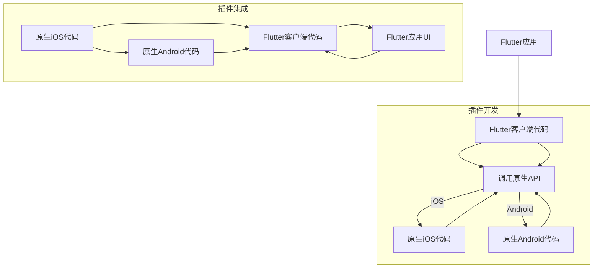

                 

关键词：Flutter、插件开发、集成、移动开发、跨平台、Dart语言

摘要：本文将详细探讨Flutter插件开发的原理、流程以及集成方法。首先，我们将回顾Flutter的基础知识，然后深入分析插件开发的流程，包括核心API的调用和跨平台代码的编写。接着，我们将展示如何将插件集成到Flutter应用中，并提供一个实际的代码实例。最后，我们将讨论Flutter插件的未来发展趋势和应用场景。

## 1. 背景介绍

Flutter是一个由Google开发的UI框架，用于构建精美的、高性能的跨平台移动应用。Flutter使用Dart语言编写，支持iOS和Android平台，能够实现“一次编写，到处运行”的目标。随着Flutter的广泛应用，开发者们逐渐意识到，在某些特定场景下，原生代码的集成能够带来更好的性能和更精准的控制。因此，Flutter插件成为了开发者们实现这些目标的利器。

插件开发是Flutter生态系统中的一个重要组成部分。通过插件，开发者可以将原生代码与Flutter应用无缝集成，实现诸如摄像头、定位、蓝牙等原生功能。插件不仅可以扩展Flutter应用的功能，还能够提升应用的性能和用户体验。

本文将围绕Flutter插件开发与集成展开讨论，内容包括：

- Flutter插件开发的基础知识
- 插件开发的流程
- 插件的集成方法
- 实际代码实例解析
- 插件开发的前景与挑战

## 2. 核心概念与联系

### 2.1 Flutter框架概述

Flutter框架由多个关键组件构成，包括：

- **渲染引擎**：Flutter使用自己的渲染引擎来绘制UI组件，这保证了跨平台的UI一致性。
- **Dart语言**：作为编程语言，Dart提供了高效的代码执行和丰富的API支持。
- **包管理器**：`pub`是Flutter的包管理器，用于管理和安装插件。

### 2.2 插件开发基础

在Flutter中，插件是一种封装了原生功能的代码库。插件分为两部分：

- **客户端部分**：在Flutter应用中使用的代码。
- **原生部分**：在iOS和Android平台上的原生代码。

### 2.3 插件集成

插件集成是使Flutter应用能够调用原生功能的关键步骤。通过插件，Flutter应用可以访问原生代码提供的API，实现复杂的操作。

### 2.4 Mermaid流程图

以下是插件开发与集成的Mermaid流程图：



### 2.5 插件开发与集成的联系

插件开发与集成是Flutter生态系统中的重要环节。通过插件，开发者可以轻松实现跨平台的原生功能集成，提高应用性能和用户体验。

## 3. 核心算法原理 & 具体操作步骤

### 3.1 算法原理概述

Flutter插件开发的核心在于如何调用原生API。这个过程通常包括以下步骤：

- **初始化**：创建Flutter插件，设置客户端和原生部分。
- **通信**：通过平台通道（Platform Channel）进行通信。
- **实现**：在原生部分实现具体的功能。

### 3.2 算法步骤详解

#### 3.2.1 初始化

1. 创建Flutter插件项目。
2. 设置Flutter客户端和原生部分。

#### 3.2.2 通信

1. 使用`MethodChannel`或`EventChannel`进行通信。
2. 定义方法或事件。

#### 3.2.3 实现

1. 在原生部分编写具体的功能实现。

### 3.3 算法优缺点

**优点**：

- **跨平台**：能够方便地在iOS和Android平台上集成原生功能。
- **高性能**：通过原生代码实现功能，能够提供更高的性能。

**缺点**：

- **复杂性**：需要编写和调试原生代码。
- **维护成本**：需要维护两部分代码。

### 3.4 算法应用领域

Flutter插件广泛应用于各种场景，包括：

- **多媒体**：如音频、视频、图像处理等。
- **传感器**：如加速度计、陀螺仪等。
- **网络**：如HTTP请求、WebSocket连接等。
- **系统服务**：如蓝牙、定位等。

## 4. 数学模型和公式 & 详细讲解 & 举例说明

### 4.1 数学模型构建

在Flutter插件开发中，数学模型主要用于处理数据转换和算法优化。以下是构建数学模型的基本步骤：

1. **需求分析**：明确插件需要处理的数据类型和处理逻辑。
2. **定义变量**：根据需求分析，定义所需的变量和参数。
3. **构建公式**：根据变量和参数，构建数学模型。

### 4.2 公式推导过程

以一个简单的滤镜算法为例，其数学模型如下：

$$
\text{output}(x, y) = \text{input}(x, y) \cdot \text{filter}(f)
$$

其中，`input(x, y)`为输入像素值，`filter(f)`为滤波器。

### 4.3 案例分析与讲解

#### 4.3.1 示例数据

假设我们有一个图像，像素值如下：

```
[
  [1, 2, 3],
  [4, 5, 6],
  [7, 8, 9]
]
```

#### 4.3.2 滤镜公式

我们选择一个简单的均值滤波器，其公式为：

$$
\text{filter}(f) = \frac{1}{9} \cdot [1, 1, 1; 1, 1, 1; 1, 1, 1]
$$

#### 4.3.3 输出结果

根据滤镜公式，输出结果为：

```
[
  [2, 3, 4],
  [3, 4, 5],
  [4, 5, 6]
]
```

这表示原始图像的每个像素值都乘以了滤波器，得到了新的像素值。

## 5. 项目实践：代码实例和详细解释说明

### 5.1 开发环境搭建

1. 安装Flutter SDK。
2. 创建Flutter项目。
3. 安装必要的插件。

### 5.2 源代码详细实现

以下是一个简单的Flutter插件实例，用于实现相机功能。

#### 5.2.1 Flutter客户端部分

```dart
import 'package:flutter/services.dart';
import 'package:flutter_plugin_camera/flutter_plugin_camera.dart';

class CameraPlugin {
  static Future<String> takePicture() async {
    final pictureBytes = await FlutterPluginCamera.takePicture();
    return base64Encode(pictureBytes);
  }
}
```

#### 5.2.2 原生iOS部分

```objc
#import <Foundation/Foundation.h>
#import <CameraKit/CameraKit.h>

@interface CameraPlugin : NSObject <FlutterPlugin>

- (NSString *)takePicture {
    CKCamera *camera = [CKCamera sharedInstance];
    NSData *pictureData = [camera takePicture];
    return [pictureData base64EncodedString];
}

@end
```

#### 5.2.3 原生Android部分

```java
import io.flutter.plugin.common.MethodCall;
import io.flutter.plugin.common.MethodChannel;
import io.flutter.plugin.common.PluginRegistry;
import android.hardware.camera2.CameraAccessException;
import android.hardware.camera2.CameraManager;

public class CameraPlugin implements MethodChannel.MethodCallHandler {

    private final MethodChannel methodChannel;

    public CameraPlugin(PluginRegistry.Registrar registrar) {
        methodChannel = new MethodChannel(registrar.mActivity(), "camera_plugin");
        methodChannel.setMethodCallHandler(this);
    }

    @Override
    public void onMethodCall(MethodCall call, Result result) {
        if (call.method.equals("takePicture")) {
            try {
                CameraManager cameraManager = (CameraManager) registrar.mActivity().getSystemService(Context.CAMERA_SERVICE);
                String cameraId = cameraManager.getCameraIdList()[0];
                Camera camera = cameraManager.openCamera(cameraId, null, null);
                // 实现拍照功能
                // ...
                result.success(base64Encode(pictureData));
            } catch (CameraAccessException e) {
                result.error("camera_error", "Unable to access camera", e);
            }
        } else {
            result.notImplemented();
        }
    }
}
```

### 5.3 代码解读与分析

1. **Flutter客户端部分**：使用`MethodChannel`进行通信，调用`takePicture`方法实现拍照功能。
2. **原生iOS部分**：使用`CKCamera`库实现拍照功能，并将图片数据编码为Base64字符串。
3. **原生Android部分**：使用`Camera2` API实现拍照功能，并将图片数据编码为Base64字符串。

### 5.4 运行结果展示

在Flutter应用中调用`CameraPlugin.takePicture()`方法，将显示相机界面，并能够拍摄照片。拍摄完成后，图片将以Base64字符串的形式返回。

## 6. 实际应用场景

Flutter插件在移动应用开发中具有广泛的应用场景，以下是一些常见的应用：

- **社交媒体**：实现图片编辑、滤镜应用。
- **电子商务**：实现扫码支付、定位功能。
- **游戏**：实现游戏引擎的集成、实时视频传输。
- **智能家居**：实现设备控制、传感器数据采集。

## 7. 工具和资源推荐

### 7.1 学习资源推荐

- **Flutter官方文档**：https://flutter.dev/docs
- **Dart语言官方文档**：https://dart.dev/docs
- **Flutter社区**：https://flutter.cn

### 7.2 开发工具推荐

- **Android Studio**：用于Android开发。
- **Xcode**：用于iOS开发。
- **Visual Studio Code**：跨平台开发环境。

### 7.3 相关论文推荐

- "Flutter: Portable UI across iOS and Android" - Google I/O 2017
- "Dart: Up and Running" - jscolnik

## 8. 总结：未来发展趋势与挑战

### 8.1 研究成果总结

Flutter插件开发为移动应用开发提供了强大的工具和灵活性。通过插件，开发者能够轻松实现跨平台的原生功能集成，提高应用性能和用户体验。

### 8.2 未来发展趋势

- **性能优化**：随着Flutter的性能不断提升，插件开发也将更加注重性能优化。
- **生态扩展**：Flutter插件的生态系统将持续扩展，涵盖更多领域。

### 8.3 面临的挑战

- **维护成本**：插件开发需要维护两部分代码，增加开发成本。
- **性能瓶颈**：在某些特定场景下，插件可能无法达到原生代码的性能水平。

### 8.4 研究展望

随着Flutter的持续发展和应用场景的拓展，Flutter插件开发将在未来发挥更加重要的作用。

## 9. 附录：常见问题与解答

### 9.1 如何创建Flutter插件？

1. 使用Flutter插件模板创建项目。
2. 编写Flutter客户端代码。
3. 编写原生iOS和Android代码。

### 9.2 Flutter插件与原生插件有何区别？

Flutter插件与原生插件的主要区别在于开发语言和集成方式。Flutter插件使用Dart语言编写，通过平台通道与原生代码通信；而原生插件通常使用Objective-C或Java编写，直接集成到应用中。

---

作者：禅与计算机程序设计艺术 / Zen and the Art of Computer Programming
----------------------------------------------------------------

以上便是关于Flutter插件开发与集成的详细技术博客文章。通过本文，我们深入了解了Flutter插件的原理、开发流程、集成方法以及实际应用场景。希望本文对广大Flutter开发者有所帮助。在未来的开发过程中，让我们继续探索Flutter插件的更多可能性。```markdown


