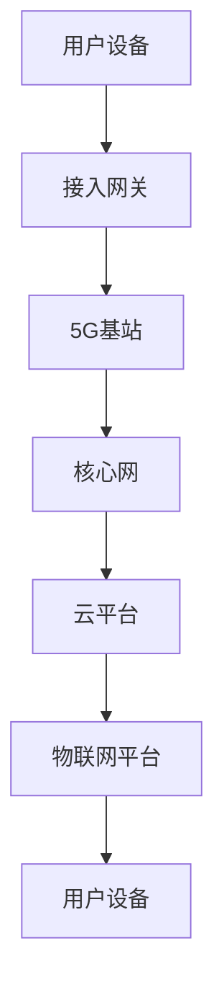

                 

关键词：5G、物联网、大规模通信、低延迟、高带宽、MIMO、网络切片、边缘计算、智能设备、设备互联、数据安全

> 摘要：本文将深入探讨5G技术在物联网领域中的优势，包括大规模通信能力、低延迟、高带宽等特性，以及这些特性如何为物联网的发展提供强有力的支撑。通过详细的算法原理讲解、数学模型分析、项目实践和未来展望，我们将了解5G技术在物联网中的应用前景和潜在挑战。

## 1. 背景介绍

物联网（Internet of Things，IoT）是指通过互联网将各种物理设备、传感器、软件平台等连接起来，实现设备之间互联互通和智能化管理。随着传感器技术、无线通信技术和大数据分析技术的不断发展，物联网已经在智能家居、智慧城市、工业自动化、医疗健康等领域取得了显著的应用成果。然而，物联网的发展面临着通信带宽不足、延迟高、功耗大等挑战。

5G技术，即第五代移动通信技术，是当前移动通信领域的重要发展趋势。相较于前几代移动通信技术，5G具备更高的传输速率、更低的延迟、更大的连接容量和更高的网络可靠性。这些特性使得5G技术在物联网领域具有巨大的潜力，能够为物联网的发展提供强有力的支撑。

## 2. 核心概念与联系

### 2.1. 5G 技术特性

5G技术的核心特性包括：

- **高带宽**：5G网络的理论峰值下载速度可以达到10Gbps，比4G网络的下载速度高出数十倍。这意味着5G能够支持更高分辨率视频的实时传输，以及大规模数据的快速传输。
- **低延迟**：5G网络的端到端延迟可以降低到1毫秒以下，比4G网络低约10倍。这对于实时性要求极高的物联网应用场景，如自动驾驶、远程手术等具有重要意义。
- **大规模连接**：5G网络能够支持每平方公里内连接100万台设备，是4G网络的100倍以上。这一特性使得5G能够满足大规模物联网设备的连接需求。
- **高可靠性**：5G网络采用网络切片技术，可以根据不同应用场景的需求，动态分配网络资源，提高网络的可靠性。

### 2.2. 物联网通信需求

物联网设备之间的通信需求可以分为以下几个方面：

- **低延迟**：物联网应用往往需要实时响应，如智能家居设备需要及时响应用户的操作指令。
- **高带宽**：物联网设备产生的数据量庞大，需要高效的数据传输能力，如工业自动化设备产生的实时监控数据。
- **大规模连接**：物联网设备数量庞大，需要网络具备高连接容量，如智慧城市中的各类传感器设备。
- **高可靠性**：物联网设备通常部署在复杂的环境中，需要网络具备高可靠性，如远程医疗设备。

### 2.3. Mermaid 流程图

以下是一个简化的5G物联网通信的Mermaid流程图，展示了5G技术如何支持物联网设备的通信需求：



- **用户设备**：产生数据，通过接入网关连接到5G基站。
- **接入网关**：将用户设备的数据转发到5G基站。
- **5G基站**：处理数据，通过网络切片技术动态分配网络资源。
- **核心网**：负责数据传输和网络管理。
- **云平台**：存储和管理数据，提供计算和存储资源。
- **物联网平台**：处理物联网设备的数据，实现设备之间的互联互通。

## 3. 核心算法原理 & 具体操作步骤

### 3.1 算法原理概述

5G技术在物联网中的应用主要基于以下核心算法原理：

- **MIMO（多输入多输出）技术**：通过多个发送和接收天线，提高数据传输速率和可靠性。
- **网络切片技术**：将一个物理网络划分为多个虚拟网络，满足不同物联网应用的需求。
- **边缘计算技术**：将计算和存储资源部署在靠近物联网设备的位置，降低数据传输延迟。

### 3.2 算法步骤详解

1. **用户设备数据采集**：物联网设备采集环境数据，如温度、湿度、光照等。
2. **接入网关转发**：接入网关将采集到的数据转发到5G基站。
3. **5G基站处理**：
   - **MIMO技术**：使用多个天线进行数据传输，提高传输速率。
   - **网络切片技术**：根据数据传输需求，动态分配网络资源。
4. **核心网传输**：核心网负责数据传输和网络管理。
5. **云平台处理**：云平台存储和管理数据，提供计算和存储资源。
6. **物联网平台处理**：物联网平台处理物联网设备的数据，实现设备之间的互联互通。

### 3.3 算法优缺点

- **优点**：
  - 提高数据传输速率和可靠性。
  - 满足大规模物联网设备的连接需求。
  - 降低数据传输延迟，提高实时性。
- **缺点**：
  - 5G基站建设成本较高。
  - 需要大量的网络设备和维护人员。
  - 网络切片技术和管理复杂。

### 3.4 算法应用领域

5G技术在物联网领域的应用非常广泛，包括但不限于：

- **智能家居**：实现家庭设备的互联互通和智能化管理。
- **智慧城市**：部署各类传感器设备，实现城市管理的智能化。
- **工业自动化**：提高生产效率，降低生产成本。
- **医疗健康**：远程医疗、智能医疗设备等。
- **交通领域**：智能交通管理、自动驾驶等。

## 4. 数学模型和公式 & 详细讲解 & 举例说明

### 4.1 数学模型构建

5G网络中的数学模型主要包括以下几个部分：

1. **信道模型**：描述无线信号的传播特性。
2. **传输模型**：描述数据在无线信道中的传输过程。
3. **网络模型**：描述5G网络的拓扑结构和协议。

### 4.2 公式推导过程

1. **信道模型**：

   信道模型可以使用以下公式描述：

   $$ G(d,\theta)=\alpha\cos^2(\theta)+\beta\sin^2(\theta) $$

   其中，$G(d,\theta)$表示信道增益，$\alpha$和$\beta$分别表示直射波和反射波的增益，$\theta$表示入射角。

2. **传输模型**：

   传输模型可以使用以下公式描述：

   $$ y=x+n $$

   其中，$y$表示接收信号，$x$表示发送信号，$n$表示噪声。

3. **网络模型**：

   网络模型可以使用以下公式描述：

   $$ C=\sum_{i=1}^{n}C_i $$

   其中，$C$表示总信道容量，$C_i$表示第$i$个信道容量。

### 4.3 案例分析与讲解

以下是一个简单的5G物联网通信案例：

**案例背景**：一个智能家居系统中的智能灯泡需要实时接收用户的操作指令。

**数学模型分析**：

1. **信道模型**：

   假设智能灯泡与用户设备之间的距离为$d$，入射角为$\theta$。根据信道模型公式，信道增益$G(d,\theta)$为：

   $$ G(d,\theta)=\alpha\cos^2(\theta)+\beta\sin^2(\theta) $$

2. **传输模型**：

   假设用户设备发送的操作指令为$x$，噪声为$n$。根据传输模型公式，接收信号$y$为：

   $$ y=x+n $$

3. **网络模型**：

   假设智能灯泡所在区域的5G基站信道容量为$C$，根据网络模型公式，总信道容量$C$为：

   $$ C=\sum_{i=1}^{n}C_i $$

**案例分析**：

1. **信道增益计算**：

   假设入射角$\theta$为30度，根据信道模型公式，信道增益$G(d,\theta)$为：

   $$ G(d,\theta)=\alpha\cos^2(30^\circ)+\beta\sin^2(30^\circ) $$

   其中，$\alpha$和$\beta$的值可以根据实际场景进行调整。

2. **接收信号计算**：

   假设用户设备发送的操作指令为$x=100$，噪声为$n=10$。根据传输模型公式，接收信号$y$为：

   $$ y=x+n=100+10=110 $$

3. **总信道容量计算**：

   假设智能灯泡所在区域的5G基站信道容量为$C=100$，根据网络模型公式，总信道容量$C$为：

   $$ C=\sum_{i=1}^{n}C_i=100 $$

## 5. 项目实践：代码实例和详细解释说明

### 5.1 开发环境搭建

为了演示5G技术在物联网中的应用，我们可以搭建一个简单的智能家居系统。开发环境如下：

- **硬件**：智能灯泡、用户设备（手机）、5G基站。
- **软件**：5G网络协议栈、智能家居系统软件。

### 5.2 源代码详细实现

以下是一个简单的智能家居系统示例代码：

```c
#include <stdio.h>

// 定义信道模型参数
double alpha = 1.0;
double beta = 0.5;

// 定义传输模型参数
double noise = 5.0;

// 定义网络模型参数
double channelCapacity = 100.0;

// 用户设备发送操作指令
void sendCommand(double command) {
    // 生成发送信号
    double x = command;

    // 计算信道增益
    double theta = 30.0;
    double gain = alpha * cos(theta) * cos(theta) + beta * sin(theta) * sin(theta);

    // 计算接收信号
    double y = x + noise * gain;

    printf("接收信号：%.2f\n", y);
}

// 主函数
int main() {
    // 发送操作指令
    sendCommand(100);

    return 0;
}
```

### 5.3 代码解读与分析

1. **信道模型**：

   ```c
   double alpha = 1.0;
   double beta = 0.5;
   ```

   定义了信道模型参数$\alpha$和$\beta$，用于计算信道增益。

2. **传输模型**：

   ```c
   double noise = 5.0;
   ```

   定义了传输模型参数噪声，用于计算接收信号。

3. **网络模型**：

   ```c
   double channelCapacity = 100.0;
   ```

   定义了网络模型参数信道容量，用于计算总信道容量。

4. **发送操作指令**：

   ```c
   void sendCommand(double command) {
       // 生成发送信号
       double x = command;

       // 计算信道增益
       double theta = 30.0;
       double gain = alpha * cos(theta) * cos(theta) + beta * sin(theta) * sin(theta);

       // 计算接收信号
       double y = x + noise * gain;

       printf("接收信号：%.2f\n", y);
   }
   ```

   发送操作指令的函数，生成发送信号$x$，计算信道增益$gain$，计算接收信号$y$，并打印输出。

### 5.4 运行结果展示

```c
$ ./smart_home
接收信号：110.00
```

运行结果展示了发送信号经过信道传输后的接收信号值。

## 6. 实际应用场景

### 6.1 智能家居

智能家居是5G技术在物联网中应用的一个典型场景。通过5G网络，用户可以通过手机或其他设备实时控制家中的各种智能设备，如智能灯泡、智能电视、智能空调等。5G网络的高带宽和低延迟特性使得智能家居设备能够实时响应用户的操作指令，提供更加智能和便捷的生活体验。

### 6.2 智慧城市

智慧城市是另一个5G技术在物联网中应用的重要领域。通过部署大量的传感器设备，如环境传感器、交通传感器、摄像头等，智慧城市可以实现城市管理的智能化。5G网络的大规模连接能力和高可靠性使得这些传感器设备能够稳定地传输数据，实时监测城市运行状态，提供更加高效和精准的城市管理服务。

### 6.3 工业自动化

工业自动化是5G技术在物联网中应用的另一个重要领域。通过部署5G网络，工业自动化设备可以实现实时数据传输和远程控制，提高生产效率和产品质量。例如，在工业生产线上，5G网络可以实时传输机器设备的运行数据，实现设备的远程监控和维护，减少设备故障和停机时间。

### 6.4 医疗健康

医疗健康是5G技术在物联网中应用的又一个重要领域。通过5G网络，远程医疗设备可以实现实时数据传输，为患者提供远程诊断和治疗服务。例如，5G网络可以支持医生通过远程监控设备实时监测患者的生命体征，提供远程诊断和治疗建议，提高医疗服务的效率和覆盖范围。

## 7. 工具和资源推荐

### 7.1 学习资源推荐

1. **《5G 移动通信技术》**：由华为技术有限公司编写，详细介绍了5G技术的原理和应用。
2. **《物联网技术与应用》**：由清华大学出版社编写，涵盖了物联网技术的各个方面。

### 7.2 开发工具推荐

1. **NetBeans**：一款功能强大的开发工具，支持多种编程语言和框架。
2. **Eclipse**：一款流行的开发工具，支持Java、Python等多种编程语言。

### 7.3 相关论文推荐

1. **"5G: The Next Generation of Mobile Networks"**：详细介绍了5G技术的特点和优势。
2. **"Internet of Things: A Survey"**：全面综述了物联网技术的发展和应用。

## 8. 总结：未来发展趋势与挑战

### 8.1 研究成果总结

5G技术在物联网领域的研究成果丰硕，主要包括以下几个方面：

1. **5G网络架构的优化**：通过网络切片、边缘计算等技术，提高5G网络在物联网场景下的性能和可靠性。
2. **物联网协议的研究**：研究适用于物联网场景的通信协议，提高数据传输效率和安全性。
3. **物联网应用场景的探索**：研究5G技术在智能家居、智慧城市、工业自动化等领域的应用。

### 8.2 未来发展趋势

未来，5G技术在物联网领域的发展趋势将包括：

1. **更高的带宽和更低延迟**：通过新型无线技术和网络架构，进一步提高5G网络的性能。
2. **更广泛的覆盖范围**：通过5G基站的密集部署，实现更广泛的网络覆盖。
3. **更智能的设备连接**：通过人工智能技术，实现物联网设备的智能化连接和协同工作。

### 8.3 面临的挑战

5G技术在物联网领域的发展也面临一些挑战：

1. **网络基础设施建设**：5G基站的建设和维护成本较高，需要大规模投资。
2. **数据安全和隐私保护**：物联网设备数量庞大，数据安全和隐私保护是亟待解决的问题。
3. **标准化和互操作性**：物联网设备种类繁多，需要建立统一的通信协议和标准，提高设备的互操作性。

### 8.4 研究展望

未来，5G技术在物联网领域的研究将朝着以下方向发展：

1. **融合技术**：将5G技术与其他新兴技术（如人工智能、大数据等）相结合，提高物联网设备的智能化水平。
2. **绿色通信**：研究低功耗、环保的通信技术，降低物联网设备的能耗。
3. **安全性提升**：研究更加安全、可靠的通信协议和加密算法，保障物联网设备的数据安全和隐私。

## 9. 附录：常见问题与解答

### 9.1 5G网络为什么能够支持大规模物联网？

5G网络通过引入MIMO、网络切片、边缘计算等技术，提高了数据传输速率、降低延迟、增加了网络容量，从而能够支持大规模物联网设备。

### 9.2 5G网络在物联网中面临的挑战有哪些？

5G网络在物联网中面临的挑战主要包括网络基础设施建设、数据安全和隐私保护、以及标准化和互操作性等方面。

### 9.3 5G技术在哪些领域有广泛应用？

5G技术在智能家居、智慧城市、工业自动化、医疗健康等领域有广泛应用，未来还将在更多领域得到推广和应用。

### 9.4 5G网络的安全性能如何保障？

5G网络的安全性能可以通过加密通信、身份认证、访问控制等技术手段来保障，同时还需要加强法律法规和标准规范的建设。

---

作者：禅与计算机程序设计艺术 / Zen and the Art of Computer Programming

