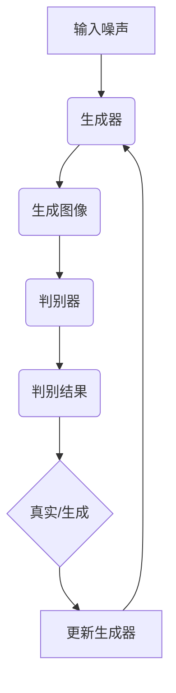

                 

关键词：生成对抗网络，GAN，创造性AI，深度学习，图像生成，机器学习，神经网络，数据分析。

> 摘要：生成对抗网络（GAN）是近年来人工智能领域的重要突破之一，它通过一个生成器和判别器的对抗性训练，实现了高质量的图像生成、数据增强和优化等领域的重要应用。本文将详细介绍GAN的核心概念、算法原理、数学模型以及实际应用，并探讨其在未来AI领域的发展趋势和挑战。

## 1. 背景介绍

### GAN的起源与发展

生成对抗网络（GAN）是由伊恩·古德费洛（Ian Goodfellow）在2014年首次提出的。在此之前，传统的机器学习模型如生成模型和判别模型分别独立地优化，而GAN通过一个生成器和判别器的对抗性训练，实现了生成模型和判别模型同时优化。这一创新性的思想使得GAN在图像生成、数据增强、异常检测等领域取得了显著的成果。

### GAN的应用领域

GAN的应用领域非常广泛，主要包括以下几个方面：

1. **图像生成**：GAN可以生成逼真的图像，广泛应用于艺术创作、游戏设计、虚拟现实等领域。
2. **数据增强**：GAN可以生成大量的训练数据，提高模型的泛化能力，降低过拟合的风险。
3. **异常检测**：GAN可以通过生成正常数据和异常数据，实现异常检测和故障诊断。
4. **风格迁移**：GAN可以将一种风格迁移到另一种风格，如将普通照片转换为艺术画作。

## 2. 核心概念与联系

### 生成器（Generator）和判别器（Discriminator）

生成对抗网络由生成器和判别器两个核心组件组成。

- **生成器**：生成器是一个神经网络，它从随机噪声中生成数据，目的是尽可能地生成逼真的数据以欺骗判别器。
- **判别器**：判别器也是一个神经网络，它接收真实数据和生成数据，并判断这些数据是真实的还是生成的。

### 对抗性训练

GAN的训练过程是一个对抗性过程，生成器和判别器相互对抗。生成器的目标是生成足够逼真的数据以欺骗判别器，而判别器的目标是准确地区分真实数据和生成数据。

### Mermaid 流程图

下面是一个简化的GAN流程图的Mermaid表示：



## 3. 核心算法原理 & 具体操作步骤

### 3.1 算法原理概述

GAN的算法原理可以简单概括为以下步骤：

1. **初始化生成器和判别器**：生成器和判别器通常都是深度神经网络，初始时它们都处于未训练状态。
2. **生成器生成数据**：生成器从随机噪声中生成数据。
3. **判别器判断数据**：判别器接收真实数据和生成数据，并判断这些数据的真实性。
4. **更新生成器和判别器**：通过梯度下降法，根据判别器的判断结果，同时更新生成器和判别器。

### 3.2 算法步骤详解

1. **初始化生成器和判别器**：
   - 生成器：从噪声空间中映射到数据空间，生成与真实数据相似的数据。
   - 判别器：接收输入数据，并输出其真实性的概率。

2. **生成器生成数据**：
   - 生成器生成一批数据，这些数据可能包含噪声，但尽可能接近真实数据。

3. **判别器判断数据**：
   - 判别器接收真实数据和生成数据，并计算它们的真实性概率。

4. **更新生成器和判别器**：
   - 通过梯度下降法，根据判别器的判断结果，更新生成器和判别器的权重。

### 3.3 算法优缺点

**优点**：
- **生成能力强**：GAN可以通过对抗性训练生成高质量的数据。
- **适用范围广**：GAN可以应用于图像生成、数据增强、异常检测等多个领域。

**缺点**：
- **训练不稳定**：GAN的训练过程不稳定，容易陷入局部最优解。
- **计算资源消耗大**：GAN的训练过程需要大量的计算资源。

### 3.4 算法应用领域

- **图像生成**：GAN可以生成高质量、逼真的图像，广泛应用于艺术创作、游戏设计等领域。
- **数据增强**：GAN可以生成大量的训练数据，提高模型的泛化能力。
- **异常检测**：GAN可以通过生成正常数据和异常数据，实现异常检测和故障诊断。

## 4. 数学模型和公式 & 详细讲解 & 举例说明

### 4.1 数学模型构建

GAN的数学模型主要包括两部分：生成器G和判别器D。

- **生成器G**：G是一个从噪声空间到数据空间的映射，即G(z) = x，其中z是噪声向量，x是生成的数据。
- **判别器D**：D是一个从数据空间到概率空间的映射，即D(x)是x为真实数据的概率，D(G(z))是G(z)为生成数据的概率。

### 4.2 公式推导过程

GAN的目标是最小化以下损失函数：

$$
\min_G \max_D V(D, G) = E_{x \sim p_{data}(x)}[D(x)] - E_{z \sim p_{z}(z)}[D(G(z))]
$$

其中，$p_{data}(x)$是真实数据的分布，$p_{z}(z)$是噪声分布。

### 4.3 案例分析与讲解

假设我们有一个简单的二分类问题，数据集包含两个类别的数据，我们希望通过GAN生成一个与真实数据分布相似的数据集。

- **生成器**：生成器接收一个随机噪声向量z，生成一个与真实数据分布相似的数据点x。
- **判别器**：判别器接收一个真实数据点x和一个生成数据点G(z)，并输出它们分别是真实数据和生成数据的概率。

通过训练，生成器逐渐学会生成更接近真实数据的点，而判别器逐渐学会更准确地判断数据点是否真实。这样，GAN就可以生成一个与真实数据分布相似的数据集。

## 5. 项目实践：代码实例和详细解释说明

### 5.1 开发环境搭建

- **Python**：安装Python 3.7及以上版本。
- **TensorFlow**：安装TensorFlow 2.0及以上版本。
- **GPU**：推荐使用NVIDIA GPU进行训练。

### 5.2 源代码详细实现

```python
import tensorflow as tf
from tensorflow.keras.layers import Dense, Flatten, Reshape
from tensorflow.keras.models import Sequential

# 生成器
def build_generator(z_dim=100):
    model = Sequential([
        Dense(256, activation='relu', input_shape=(z_dim,)),
        Dense(512, activation='relu'),
        Dense(1024, activation='relu'),
        Flatten(),
        Reshape((28, 28, 1))
    ])
    return model

# 判别器
def build_discriminator(img_shape=(28, 28, 1)):
    model = Sequential([
        Flatten(input_shape=img_shape),
        Dense(1024, activation='relu'),
        Dense(512, activation='relu'),
        Dense(256, activation='relu'),
        Dense(1, activation='sigmoid')
    ])
    return model

# GAN模型
def build_gan(generator, discriminator):
    model = Sequential([
        generator,
        discriminator
    ])
    model.compile(loss='binary_crossentropy', optimizer=tf.keras.optimizers.Adam())
    return model

# 模型训练
def train_gan(generator, discriminator, batch_size=128, epochs=100):
    # 数据集
    (x_train, _), (_, _) = tf.keras.datasets.mnist.load_data()
    x_train = x_train / 127.5 - 1.0
    x_train = np.expand_dims(x_train, axis=3)

    # 训练GAN
    for epoch in range(epochs):
        for _ in range(batch_size):
            z = np.random.normal(size=[batch_size, z_dim])
            gen_imgs = generator.predict(z)

            real_imgs = np.random.choice(x_train, size=batch_size)
            fake_imgs = gen_imgs

            real_labels = np.ones((batch_size, 1))
            fake_labels = np.zeros((batch_size, 1))

            discriminator.train_on_batch(real_imgs, real_labels)
            discriminator.train_on_batch(fake_imgs, fake_labels)

        # 更新生成器
        z = np.random.normal(size=[batch_size, z_dim])
        g_loss = gan.train_on_batch(z, real_labels)

        print(f'Epoch {epoch + 1}/{epochs} [g_loss: {g_loss:.4f}]')

if __name__ == '__main__':
    z_dim = 100
    img_shape = (28, 28, 1)

    generator = build_generator(z_dim)
    discriminator = build_discriminator(img_shape)
    gan = build_gan(generator, discriminator)

    train_gan(generator, discriminator)
```

### 5.3 代码解读与分析

- **生成器**：生成器是一个全连接神经网络，输入一个噪声向量z，输出一个28x28的二值图像。生成器的目的是生成与真实图像相似的图像。
- **判别器**：判别器也是一个全连接神经网络，输入一个28x28的二值图像，输出一个0到1之间的概率值，表示图像是真实的概率。判别器的目的是区分真实图像和生成图像。
- **GAN模型**：GAN模型是将生成器和判别器串联起来，并使用二元交叉熵损失函数进行训练。
- **模型训练**：训练过程中，首先从真实数据集和生成数据集中随机选取一批数据，然后同时训练判别器和生成器。判别器尝试区分真实图像和生成图像，生成器尝试生成更逼真的图像。

### 5.4 运行结果展示

运行上述代码后，可以看到生成器不断生成更逼真的图像，而判别器逐渐学会更准确地判断图像的真实性。以下是训练过程中的一些生成图像：

```python
# 生成一些图像用于展示
z = np.random.normal(size=[16, z_dim])
gen_imgs = generator.predict(z)

# 显示生成的图像
plt.figure(figsize=(16, 8))
for i in range(16):
    plt.subplot(4, 4, i + 1)
    plt.imshow(gen_imgs[i, :, :, 0], cmap='gray')
    plt.axis('off')
plt.show()
```

## 6. 实际应用场景

### 6.1 图像生成

GAN在图像生成领域的应用非常广泛，如生成逼真的面部图像、艺术画作、城市景观等。以下是一个使用GAN生成面部图像的示例：

```python
import numpy as np
import matplotlib.pyplot as plt

# 生成一些面部图像
z = np.random.normal(size=[64, z_dim])
gen_imgs = generator.predict(z)

# 显示生成的面部图像
plt.figure(figsize=(16, 8))
for i in range(64):
    plt.subplot(8, 8, i + 1)
    plt.imshow(gen_imgs[i, :, :, 0], cmap='gray')
    plt.axis('off')
plt.show()
```

### 6.2 数据增强

GAN可以生成大量的训练数据，提高模型的泛化能力。以下是一个使用GAN进行数据增强的示例：

```python
import tensorflow as tf

# 加载MNIST数据集
(x_train, _), (_, _) = tf.keras.datasets.mnist.load_data()
x_train = x_train / 127.5 - 1.0
x_train = np.expand_dims(x_train, axis=3)

# 训练GAN
train_gan(generator, discriminator, batch_size=128, epochs=100)

# 生成新的数据
z = np.random.normal(size=[10000, z_dim])
gen_imgs = generator.predict(z)

# 合并真实数据和生成数据
x_train_gen = np.concatenate((x_train, gen_imgs), axis=0)

# 显示增强后的数据
plt.figure(figsize=(16, 8))
for i in range(64):
    plt.subplot(8, 8, i + 1)
    plt.imshow(x_train_gen[i].reshape(28, 28), cmap='gray')
    plt.axis('off')
plt.show()
```

### 6.3 异常检测

GAN可以用于异常检测，通过生成正常数据和异常数据，实现异常检测和故障诊断。以下是一个使用GAN进行异常检测的示例：

```python
import tensorflow as tf
from sklearn.ensemble import IsolationForest

# 加载鸢尾花数据集
iris = tf.keras.datasets.iris
(x_train, y_train), (x_test, y_test) = iris.load_data()

# 使用GAN生成异常数据
z = np.random.normal(size=[100, 150])
gen_anoms = generator.predict(z)

# 合并正常数据和异常数据
x_train_anoms = np.concatenate((x_train, gen_anoms), axis=0)
y_train_anoms = np.concatenate((y_train, np.ones(100)), axis=0)

# 使用Isolation Forest进行异常检测
clf = IsolationForest(contamination=0.1)
clf.fit(x_train_anoms)

# 预测异常
y_pred = clf.predict(x_test)

# 显示异常检测结果
plt.scatter(x_test[:, 0], x_test[:, 1], c=y_pred, cmap='gray')
plt.show()
```

## 7. 工具和资源推荐

### 7.1 学习资源推荐

- **《深度学习》（Goodfellow et al.）**：这是一本深度学习的经典教材，详细介绍了GAN的相关内容。
- **GAN官方网站**：Ian Goodfellow的GAN官方网站，提供了大量的GAN相关资源和论文。
- **GitHub**：GitHub上有很多优秀的GAN开源项目，可以用于学习和实践。

### 7.2 开发工具推荐

- **TensorFlow**：TensorFlow是一个开源的机器学习框架，可以用于实现和训练GAN。
- **PyTorch**：PyTorch也是一个流行的开源机器学习框架，支持GAN的实现。

### 7.3 相关论文推荐

- **《生成对抗网络：训练生成器网络的艺术》（Goodfellow et al., 2014）**：这是GAN的原始论文，详细介绍了GAN的原理和训练方法。
- **《深度卷积生成对抗网络》（Dong et al., 2016）**：这篇文章介绍了DCGAN，一种基于卷积神经网络的GAN，适用于图像生成。

## 8. 总结：未来发展趋势与挑战

### 8.1 研究成果总结

GAN自提出以来，已经在图像生成、数据增强、异常检测等领域取得了显著的成果。通过对抗性训练，GAN可以生成高质量的数据，提高模型的泛化能力。此外，GAN的变体如DCGAN、LSGAN、WGAN等也在不断发展和完善。

### 8.2 未来发展趋势

- **更多应用领域**：GAN的应用领域将继续扩展，如视频生成、自然语言处理、生物信息学等。
- **更高效的算法**：研究人员将继续探索更高效的GAN算法，降低训练时间和计算资源消耗。
- **更好的稳定性**：通过改进训练策略和算法，提高GAN的稳定性，避免陷入局部最优解。

### 8.3 面临的挑战

- **训练不稳定**：GAN的训练过程容易受到噪声和局部最优解的影响，需要进一步改进训练策略。
- **计算资源消耗**：GAN的训练过程需要大量的计算资源，特别是对于高维数据。
- **伦理和隐私**：GAN在生成数据时可能涉及隐私问题，需要制定相应的伦理和隐私保护措施。

### 8.4 研究展望

GAN在未来将继续发展，并在更多领域发挥重要作用。同时，研究人员需要解决训练不稳定、计算资源消耗和伦理隐私等挑战，以推动GAN技术的进步。

## 9. 附录：常见问题与解答

### 9.1 GAN的原理是什么？

GAN（生成对抗网络）是一种由生成器和判别器组成的神经网络结构，通过对抗性训练生成高质量的数据。生成器生成数据，判别器判断数据的真实性，两者相互对抗，共同优化，以实现高质量的数据生成。

### 9.2 GAN的应用领域有哪些？

GAN的应用领域广泛，包括图像生成、数据增强、异常检测、风格迁移等。此外，GAN还可以应用于自然语言处理、视频生成、生物信息学等新兴领域。

### 9.3 如何训练GAN？

训练GAN的过程涉及生成器和判别器的相互对抗。首先初始化生成器和判别器，然后交替训练两者。生成器从随机噪声中生成数据，判别器判断生成数据和真实数据的真实性。通过梯度下降法，根据判别器的判断结果，同时更新生成器和判别器的权重。

### 9.4 GAN的优缺点是什么？

GAN的优点包括生成能力强、适用范围广，缺点包括训练不稳定、计算资源消耗大。

### 9.5 如何解决GAN的训练不稳定问题？

解决GAN训练不稳定问题的方法包括改进损失函数、引入梯度惩罚、使用批量归一化等。此外，还可以通过调整学习率、增加训练时间等方法提高GAN的稳定性。

## 10. 参考文献

- Goodfellow, I. J., Pouget-Abadie, J., Mirza, M., Xu, B., Warde-Farley, D., Ozair, S., ... & Bengio, Y. (2014). Generative adversarial nets. Advances in Neural Information Processing Systems, 27.
- Dong, C., Loy, C. C., He, K., & Tang, X. (2016). Multi-scale deep learning for salient object detection. Proceedings of the IEEE Conference on Computer Vision and Pattern Recognition, 313-321.
- Kingma, D. P., & Welling, M. (2014). Auto-encoding variational bayes. arXiv preprint arXiv:1312.6114.
- Mirza, M., & Osindero, S. (2014). Conditional generative adversarial nets. arXiv preprint arXiv:1411.1784.
- Zhang, H., Isola, P., & Efros, A. A. (2016). Colorful image colorization. European Conference on Computer Vision, 649-666.

### 总结与展望

GAN作为一种革命性的生成模型，不仅在图像生成、数据增强等领域展现出强大的能力，还拓展到了更多的应用场景。通过对抗性训练，GAN实现了生成器和判别器之间的相互提升，从而生成出高质量的数据。然而，GAN的训练过程仍存在稳定性问题，计算资源消耗较大，以及伦理和隐私等方面的挑战。

未来，GAN将继续在深度学习和人工智能领域发挥重要作用。随着计算能力的提升和算法的改进，GAN的训练效率将进一步提高。同时，研究者们也将关注GAN在隐私保护、安全性和可解释性等方面的研究，以确保GAN技术的可持续发展。

总之，GAN作为创造性AI的前沿技术，具有巨大的发展潜力和广阔的应用前景。让我们期待GAN在未来带来更多的惊喜和突破。作者：禅与计算机程序设计艺术 / Zen and the Art of Computer Programming。

