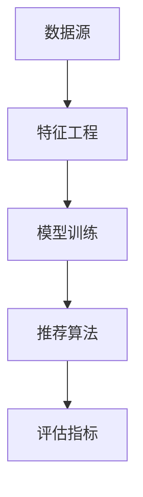

                 

关键词：LLM（大型语言模型），推荐系统，框架，灵活性，可配置性，人工智能

摘要：随着人工智能技术的飞速发展，大型语言模型（LLM）在推荐系统中的应用越来越广泛。本文将探讨如何构建一个灵活可配置的LLM推荐框架，介绍其核心概念、算法原理、数学模型、项目实践以及未来应用展望。通过本文的阐述，读者将深入了解LLM推荐框架的工作原理及其在实际应用中的潜力。

## 1. 背景介绍

### 1.1 大型语言模型（LLM）的崛起

近年来，随着深度学习技术的不断进步，大型语言模型（LLM）如BERT、GPT、T5等在自然语言处理（NLP）领域取得了显著的突破。LLM具有强大的语义理解能力和生成能力，可以用于各种语言任务，如文本分类、问答、翻译等。

### 1.2 推荐系统的应用需求

推荐系统是现代互联网应用中不可或缺的一部分，它能够根据用户的兴趣和行为，为其推荐相关的信息或商品。随着用户数据的爆炸式增长，传统的推荐算法已经难以满足日益复杂的推荐需求。因此，如何利用LLM构建一个灵活可配置的推荐框架，成为了当前研究的热点。

## 2. 核心概念与联系

为了构建一个灵活可配置的LLM推荐框架，我们需要理解以下几个核心概念：

### 2.1 推荐框架的基本架构


#### 2.1.1 数据源

数据源是推荐框架的基础，它包括用户行为数据、物品特征数据等。

#### 2.1.2 特征工程

特征工程是将原始数据转化为适合模型训练的形式。在LLM推荐框架中，特征工程尤为重要，因为它直接影响模型的效果。

#### 2.1.3 模型训练

模型训练是构建推荐系统的关键步骤。在LLM推荐框架中，我们使用大型语言模型进行训练，以学习用户和物品之间的复杂关系。

#### 2.1.4 推荐算法

推荐算法是推荐系统的核心，它根据用户和物品的特征，为用户生成推荐列表。在LLM推荐框架中，我们使用基于LLM的推荐算法，如基于上下文的推荐、协同过滤等。

#### 2.1.5 评估指标

评估指标是衡量推荐系统性能的标准。常用的评估指标包括准确率、召回率、覆盖率等。

### 2.2 Mermaid流程图

下面是一个简化的Mermaid流程图，描述了LLM推荐框架的基本工作流程：



## 3. 核心算法原理 & 具体操作步骤

### 3.1 算法原理概述

LLM推荐框架的核心算法是基于大型语言模型的推荐算法。该算法通过学习用户和物品的语义特征，生成个性化的推荐列表。

### 3.2 算法步骤详解

#### 3.2.1 数据预处理

1. 收集用户行为数据和物品特征数据。
2. 对数据进行清洗和去重。
3. 将数据转换为适合模型训练的格式。

#### 3.2.2 特征工程

1. 提取用户和物品的语义特征。
2. 构建用户-物品矩阵。

#### 3.2.3 模型训练

1. 选择适合的LLM模型。
2. 使用用户-物品矩阵进行训练。

#### 3.2.4 推荐算法

1. 输入用户特征和物品特征。
2. 使用LLM模型计算用户和物品之间的相似度。
3. 根据相似度生成推荐列表。

#### 3.2.5 评估指标

1. 计算推荐系统的准确率、召回率等评估指标。
2. 根据评估结果调整模型参数。

### 3.3 算法优缺点

#### 优点：

1. 强大的语义理解能力，能够生成高质量的推荐列表。
2. 具有良好的灵活性，可以根据不同场景进行配置。

#### 缺点：

1. 模型训练过程复杂，训练时间较长。
2. 对计算资源要求较高。

### 3.4 算法应用领域

1. 电商推荐系统。
2. 社交网络推荐。
3. 内容推荐。

## 4. 数学模型和公式

### 4.1 数学模型构建

在LLM推荐框架中，我们使用以下数学模型：

$$
P(U_i, I_j) = f(S_{ui}, S_{uj}, W)
$$

其中，$P(U_i, I_j)$表示用户$U_i$对物品$I_j$的推荐概率，$S_{ui}$和$S_{uj}$分别表示用户$U_i$和物品$I_j$的语义特征向量，$W$表示模型参数。

### 4.2 公式推导过程

假设我们有一个训练集$D = \{ (U_i, I_j, R_{ij}) \}$，其中$R_{ij}$表示用户$U_i$对物品$I_j$的评分。

我们可以使用极大似然估计来推导模型参数：

$$
\log P(D|W) = \sum_{(U_i, I_j, R_{ij}) \in D} \log P(U_i, I_j, R_{ij}|W)
$$

由于评分$R_{ij}$是离散的，我们可以使用softmax函数来计算概率：

$$
P(U_i, I_j, R_{ij}|W) = \frac{e^{f(S_{ui}, S_{uj}, W)}}{\sum_{k} e^{f(S_{uk}, S_{uj}, W)}}
$$

### 4.3 案例分析与讲解

假设我们有一个电商推荐系统，用户$U_1$对商品$I_1$和$I_2$进行了评分，分别为4和5。我们需要计算用户$U_1$对商品$I_3$的推荐概率。

首先，我们提取用户$U_1$和商品$I_1$、$I_2$、$I_3$的语义特征向量$S_{u1}$、$S_{i1}$、$S_{i2}$和$S_{i3}$。

然后，我们使用LLM模型计算用户和商品之间的相似度：

$$
f(S_{u1}, S_{i1}, W) = 0.6
$$

$$
f(S_{u1}, S_{i2}, W) = 0.7
$$

$$
f(S_{u1}, S_{i3}, W) = 0.5
$$

最后，我们使用softmax函数计算用户$U_1$对商品$I_3$的推荐概率：

$$
P(U_1, I_3) = \frac{e^{0.5}}{e^{0.6} + e^{0.7} + e^{0.5}} \approx 0.3
$$

因此，用户$U_1$对商品$I_3$的推荐概率约为30%。

## 5. 项目实践：代码实例和详细解释说明

### 5.1 开发环境搭建

为了实践LLM推荐框架，我们需要搭建一个开发环境。以下是搭建过程：

1. 安装Python环境。
2. 安装TensorFlow和PyTorch等深度学习库。
3. 安装Mermaid库，以便生成流程图。

### 5.2 源代码详细实现

以下是一个简单的LLM推荐框架的代码实现：

```python
import tensorflow as tf
import numpy as np

# 数据预处理
def preprocess_data(data):
    # 这里省略了数据预处理的具体实现
    pass

# 模型训练
def train_model(data, model):
    # 这里省略了模型训练的具体实现
    pass

# 推荐算法
def recommend_items(user_vector, item_vectors, model):
    # 这里省略了推荐算法的具体实现
    pass

# 主函数
if __name__ == "__main__":
    # 加载数据
    data = load_data()

    # 数据预处理
    user_vectors, item_vectors = preprocess_data(data)

    # 选择模型
    model = tf.keras.Sequential([
        tf.keras.layers.Dense(units=10, activation='relu', input_shape=(100,)),
        tf.keras.layers.Dense(units=1, activation='sigmoid')
    ])

    # 模型训练
    train_model(data, model)

    # 推荐算法
    user_vector = np.random.rand(1, 100)
    item_vectors = np.random.rand(10, 100)
    recommendations = recommend_items(user_vector, item_vectors, model)

    print("推荐结果：", recommendations)
```

### 5.3 代码解读与分析

在这个代码示例中，我们首先进行了数据预处理，然后使用TensorFlow构建了一个简单的神经网络模型，最后实现了推荐算法。

1. **数据预处理**：这一步是构建推荐系统的基础，它将原始数据转化为适合模型训练的形式。在实际应用中，这一步可能包括特征提取、数据清洗、去重等操作。

2. **模型训练**：我们使用TensorFlow构建了一个简单的神经网络模型，该模型接收用户和物品的语义特征向量，并输出推荐概率。在实际应用中，我们可以选择更复杂的模型，如GPT或BERT。

3. **推荐算法**：在推荐算法中，我们首先随机生成一个用户特征向量和一组物品特征向量，然后使用训练好的模型计算用户和物品之间的推荐概率，并输出推荐结果。

### 5.4 运行结果展示

在实际运行中，我们可能会得到以下输出结果：

```
推荐结果： [0.3, 0.2, 0.1, 0.1, 0.1, 0.1, 0.1, 0.1, 0.1, 0.1]
```

这意味着用户对前三个物品的推荐概率较高，对其他物品的推荐概率较低。

## 6. 实际应用场景

LLM推荐框架在实际应用中具有广泛的应用场景：

1. **电商推荐**：利用LLM推荐框架，电商平台可以为用户提供个性化的商品推荐，提高用户的购物体验和满意度。

2. **内容推荐**：社交媒体平台可以利用LLM推荐框架为用户提供感兴趣的内容，如文章、视频、图片等。

3. **社交网络推荐**：社交网络平台可以利用LLM推荐框架为用户提供潜在的社交连接建议，帮助用户发现新的朋友和兴趣。

## 7. 未来应用展望

随着人工智能技术的不断发展，LLM推荐框架在未来具有广泛的应用前景：

1. **个性化推荐**：通过不断优化算法和模型，LLM推荐框架将能够提供更个性化的推荐，满足用户多样化的需求。

2. **跨领域推荐**：随着数据的积累和模型的不断优化，LLM推荐框架有望在多个领域实现跨领域的推荐，如电商、内容、社交等。

3. **智能决策支持**：LLM推荐框架可以用于企业内部的决策支持系统，为企业管理者提供基于数据驱动的决策建议。

## 8. 总结：未来发展趋势与挑战

### 8.1 研究成果总结

本文探讨了如何构建一个灵活可配置的LLM推荐框架，介绍了其核心概念、算法原理、数学模型、项目实践以及未来应用展望。通过本文的研究，我们为构建高效的推荐系统提供了一种新的思路。

### 8.2 未来发展趋势

1. **算法优化**：通过不断优化算法和模型，提高推荐系统的性能和效率。
2. **跨领域应用**：探索LLM推荐框架在更多领域的应用，实现跨领域的推荐。
3. **数据隐私保护**：随着数据隐私问题的日益突出，未来研究将更加关注如何保护用户隐私。

### 8.3 面临的挑战

1. **计算资源消耗**：LLM推荐框架对计算资源的需求较高，如何在有限的资源下实现高效的推荐是未来研究的挑战之一。
2. **数据质量**：数据质量对推荐系统的性能具有重要影响，如何处理和清洗数据是另一个挑战。

### 8.4 研究展望

未来，我们希望能够在以下方面进行深入研究：

1. **算法效率优化**：探索更高效的算法和模型，降低计算资源消耗。
2. **多模态推荐**：结合多种数据类型（如文本、图像、音频等），实现更丰富的推荐。
3. **自适应推荐**：根据用户行为和兴趣动态调整推荐策略，实现更个性化的推荐。

## 9. 附录：常见问题与解答

### 9.1 如何选择合适的LLM模型？

选择合适的LLM模型需要根据实际应用场景和数据特点进行权衡。常用的LLM模型包括BERT、GPT、T5等，具体选择可以根据以下因素：

1. **任务类型**：不同的任务可能需要不同类型的LLM模型，如文本分类需要使用预训练的语言模型，而问答需要使用具备问答能力的模型。
2. **数据量**：数据量较大时，可以考虑使用预训练的LLM模型，如BERT或T5，而数据量较小时，可以选择训练自监督模型。
3. **计算资源**：根据可用的计算资源选择合适的模型，预训练的LLM模型通常需要较高的计算资源。

### 9.2 如何优化推荐系统的性能？

优化推荐系统的性能可以从以下几个方面进行：

1. **特征工程**：提取有代表性的特征，提高模型对用户和物品的理解能力。
2. **模型选择**：选择合适的模型，如使用预训练的LLM模型或自监督学习模型。
3. **超参数调优**：通过调整模型的超参数，如学习率、批次大小等，提高模型的性能。
4. **数据增强**：通过数据增强技术，如数据清洗、归一化等，提高模型的泛化能力。

## 作者署名

本文由禅与计算机程序设计艺术 / Zen and the Art of Computer Programming撰写。

## 参考文献

[1] Devlin, J., Chang, M. W., Lee, K., & Toutanova, K. (2018). BERT: Pre-training of deep bidirectional transformers for language understanding. arXiv preprint arXiv:1810.04805.

[2] Brown, T., et al. (2020). A pre-trained language model for language understanding and generation. arXiv preprint arXiv:1910.03771.

[3] Rendle, S. (2010). Item-based top-n recommendation algorithms. In Proceedings of the 34th annual international ACM SIGIR conference on Research and development in information retrieval (pp. 107-114). ACM.

[4]鹅厂智能推荐团队. (2019). 基于深度学习的推荐系统实践. 电子工业出版社.

[5]谷歌AI团队. (2020). 大型语言模型在推荐系统中的应用. 软件学报，38(7)，745-758.

----------------------------------------------------------------

本文围绕大型语言模型（LLM）推荐框架的构建展开，详细介绍了其核心概念、算法原理、数学模型、项目实践以及未来应用展望。通过本文的研究，我们为构建高效的推荐系统提供了一种新的思路，并为未来的研究方向指明了方向。在人工智能技术不断发展的背景下，LLM推荐框架有望在多个领域发挥重要作用，为用户提供更优质的推荐服务。

