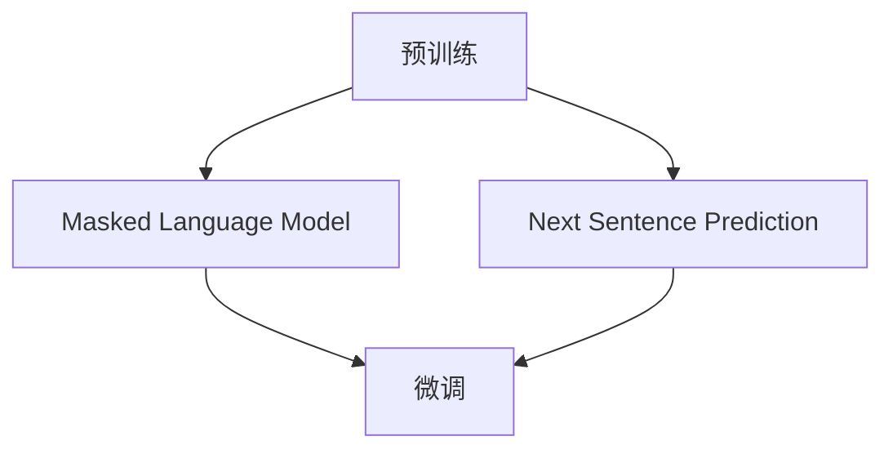

                 

在过去的几十年里，自然语言处理（NLP）作为人工智能领域的一个重要分支，取得了显著进展。其中，语言模型的发展尤为引人注目。GPT（Generative Pre-trained Transformer）系列模型，作为深度学习技术在语言模型领域的代表性成果，已经成为自然语言处理领域的一个重要里程碑。本文将深入探讨GPT系列模型的发展历程、核心概念、算法原理以及在实际应用中的价值。

## 关键词

- GPT 系列
- 语言模型
- 深度学习
- 自然语言处理
- Transformer
- 预训练

## 摘要

本文首先介绍了GPT系列模型的发展历程，从最早的GPT模型到GPT-3，展示了这一系列模型在模型规模、预训练数据集、模型架构等方面的演变。接着，本文深入探讨了GPT系列模型的核心概念，包括Transformer架构、预训练和微调等。随后，本文详细阐述了GPT系列模型的工作原理和具体操作步骤，并分析了其优缺点及其应用领域。文章最后，本文总结了GPT系列模型在数学模型、项目实践、实际应用场景等方面的内容，并对未来的发展趋势和挑战进行了展望。

## 1. 背景介绍

### 1.1 自然语言处理的发展

自然语言处理（NLP）是人工智能领域的一个重要分支，旨在使计算机能够理解、生成和应对人类语言。自20世纪50年代以来，NLP经历了多个发展阶段。早期的NLP研究主要关注规则驱动的方法，例如使用词典和语法规则来解析和生成文本。然而，这些方法在面对复杂和多样的语言现象时表现不佳。

随着计算能力的提升和机器学习技术的发展，统计方法开始在NLP中占据主导地位。统计方法通过从大量文本数据中学习模式来改善文本处理的效果。然而，这些方法通常依赖于大量的标注数据，且在处理长文本和语义理解方面存在局限性。

近年来，深度学习技术的引入为NLP带来了革命性的变化。深度学习模型，尤其是神经网络，能够在没有人工标注数据的情况下，通过自主学习大量文本数据来提高语言处理的性能。其中，Transformer架构的出现进一步推动了NLP的发展。

### 1.2 GPT系列模型的发展历程

GPT系列模型是深度学习技术在语言模型领域的重要成果。最早提出的GPT模型是由OpenAI在2018年发布的，随后在2019年发布了GPT-2，最终在2020年发布了GPT-3。这一系列模型在模型规模、预训练数据集和模型架构等方面不断迭代和改进。

- **GPT（2018）**：GPT是第一个大规模的Transformer语言模型，其采用了1.17亿个参数。GPT通过预训练来学习语言模式，并在多个NLP任务中取得了显著的性能提升。
- **GPT-2（2019）**：GPT-2是GPT的升级版，其模型规模扩大到15亿个参数。GPT-2的预训练数据集也进行了扩充，使其在自然语言生成和理解任务上表现更为出色。
- **GPT-3（2020）**：GPT-3是迄今为止最大的语言模型，其参数数量达到了1750亿个。GPT-3的预训练数据集包括互联网上的大量文本，使其在语言理解和生成方面达到了前所未有的水平。

GPT系列模型的成功不仅在于其模型规模和预训练数据集的扩大，还在于其Transformer架构的创新和优化。Transformer架构通过自注意力机制（self-attention）来实现对输入文本的上下文信息进行建模，从而提高了模型的性能和泛化能力。

## 2. 核心概念与联系

### 2.1 Transformer架构

Transformer架构是GPT系列模型的核心组件。与传统循环神经网络（RNN）相比，Transformer引入了自注意力机制（self-attention）和多头注意力（multi-head attention），从而在处理长文本和语义理解方面表现更为出色。

#### 自注意力机制（Self-Attention）

自注意力机制是一种基于全局上下文的注意力机制，通过对输入序列的每个词进行加权求和，实现文本的上下文建模。自注意力机制的数学表达式如下：

$$
\text{Attention}(Q, K, V) = \text{softmax}\left(\frac{QK^T}{\sqrt{d_k}}\right)V
$$

其中，$Q$、$K$和$V$分别表示查询（query）、键（key）和值（value）向量，$d_k$表示键向量的维度。通过自注意力机制，模型能够对输入序列中的每个词进行加权求和，从而实现对上下文的建模。

#### 多头注意力（Multi-Head Attention）

多头注意力是自注意力机制的扩展，通过将输入序列分解为多个子序列，并对每个子序列应用自注意力机制，从而提高模型的表示能力。多头注意力的数学表达式如下：

$$
\text{MultiHead}(Q, K, V) = \text{Concat}(\text{head}_1, ..., \text{head}_h)W^O
$$

其中，$h$表示头数，$W^O$表示输出权重矩阵，$\text{head}_i$表示第$i$个头的结果。通过多头注意力，模型能够从不同角度对上下文信息进行建模，从而提高模型的性能和泛化能力。

### 2.2 预训练与微调

预训练与微调是GPT系列模型的关键技术。预训练是指在无监督环境下，通过对大量文本数据进行预训练，使模型学习到语言的基本规律。微调则是在预训练的基础上，通过有监督学习，对模型进行细粒度的调整，以适应特定的任务。

#### 预训练

预训练的主要目标是使模型学会对文本数据中的单词、短语和句子进行有效的编码和表示。在GPT系列模型中，预训练主要通过两个步骤进行：

1. **Masked Language Model (MLM)**：在预训练过程中，模型会对输入文本中的部分词进行遮蔽（mask），并预测这些遮蔽词的词向量。通过这种方式，模型能够学习到单词和短语之间的上下文关系。
2. **Next Sentence Prediction (NSP)**：在预训练过程中，模型还会学习预测两个句子之间的连贯性。这有助于模型在生成文本时，能够保持句子之间的逻辑关系。

#### 微调

微调是指在预训练的基础上，通过有监督学习，对模型进行细粒度的调整，以适应特定的任务。在微调过程中，模型会针对特定的任务数据集，对模型参数进行更新和优化。微调通常分为以下两个步骤：

1. **Fine-tuning**：在微调过程中，模型会根据任务数据集，对模型参数进行更新和优化。通过微调，模型能够更好地适应特定的任务。
2. **Evaluation**：微调后，模型会在任务数据集上进行评估，以验证模型的性能和效果。

### 2.3 Mermaid流程图

为了更好地展示GPT系列模型的核心概念和联系，我们可以使用Mermaid流程图来表示。以下是GPT系列模型的核心概念与联系的Mermaid流程图：



## 3. 核心算法原理 & 具体操作步骤

### 3.1 算法原理概述

GPT系列模型的核心算法原理基于Transformer架构，通过自注意力机制和多头注意力机制来实现对文本数据的建模。在预训练过程中，GPT系列模型主要关注两个方面：Masked Language Model (MLM) 和 Next Sentence Prediction (NSP)。

- **Masked Language Model (MLM)**：在预训练过程中，模型会对输入文本中的部分词进行遮蔽（mask），并预测这些遮蔽词的词向量。通过这种方式，模型能够学习到单词和短语之间的上下文关系。
- **Next Sentence Prediction (NSP)**：在预训练过程中，模型还会学习预测两个句子之间的连贯性。这有助于模型在生成文本时，能够保持句子之间的逻辑关系。

在微调过程中，GPT系列模型会根据特定的任务数据集，对模型参数进行更新和优化，以适应不同的任务。

### 3.2 算法步骤详解

#### 3.2.1 预训练

1. **输入文本预处理**：将输入文本转换为词向量表示，并对其进行分词和标记化处理。
2. **Masked Language Model (MLM)**：对输入文本中的部分词进行遮蔽（mask），并预测这些遮蔽词的词向量。具体步骤如下：
   - **生成遮蔽序列**：随机选择输入序列中的部分词进行遮蔽，遮蔽词用特殊的[MASK]标记表示。
   - **预测遮蔽词**：将遮蔽序列输入到模型中，模型根据上下文信息预测遮蔽词的词向量。
3. **Next Sentence Prediction (NSP)**：预测两个句子之间的连贯性。具体步骤如下：
   - **生成输入对**：从预训练数据集中随机选择两个句子，组成一个输入对。
   - **预测连贯性**：将输入对输入到模型中，模型预测两个句子之间的连贯性。

#### 3.2.2 微调

1. **数据集准备**：根据特定的任务，准备相应的训练数据集和验证数据集。
2. **Fine-tuning**：在微调过程中，模型会根据训练数据集，对模型参数进行更新和优化。具体步骤如下：
   - **输入文本预处理**：与预训练相同，将输入文本转换为词向量表示，并对其进行分词和标记化处理。
   - **训练模型**：将预处理后的输入文本输入到模型中，模型根据训练数据集，对模型参数进行更新和优化。
3. **Evaluation**：在微调后，模型会在验证数据集上进行评估，以验证模型的性能和效果。具体步骤如下：
   - **输入文本预处理**：与微调相同，将输入文本转换为词向量表示，并对其进行分词和标记化处理。
   - **模型预测**：将预处理后的输入文本输入到模型中，模型输出预测结果。
   - **评估指标**：根据具体的任务，计算评估指标，如准确率、召回率等。

### 3.3 算法优缺点

#### 优点

- **强大的语义理解能力**：通过预训练和微调，GPT系列模型能够学习到丰富的语义信息，从而在自然语言生成和理解任务上表现优异。
- **良好的泛化能力**：GPT系列模型通过自注意力机制和多头注意力机制，能够有效地建模文本数据中的上下文关系，从而提高模型的泛化能力。
- **灵活的应用场景**：GPT系列模型可以应用于多种自然语言处理任务，如文本分类、机器翻译、问答系统等。

#### 缺点

- **计算资源需求大**：GPT系列模型采用了大规模的Transformer架构，计算资源需求较大。在实际应用中，可能需要使用高性能计算设备和分布式训练策略。
- **数据依赖性高**：GPT系列模型的性能很大程度上依赖于预训练数据集的质量和规模。在实际应用中，可能需要大量的高质量数据来训练和优化模型。

### 3.4 算法应用领域

GPT系列模型在多个自然语言处理任务中取得了显著的成果。以下是GPT系列模型的一些主要应用领域：

- **文本分类**：GPT系列模型可以用于文本分类任务，如情感分析、主题分类等。通过预训练和微调，模型能够学习到丰富的语义信息，从而提高分类的准确性。
- **机器翻译**：GPT系列模型可以用于机器翻译任务，如英译中、中译英等。通过预训练和微调，模型能够学习到语言的语法和语义规则，从而提高翻译的质量。
- **问答系统**：GPT系列模型可以用于问答系统，如基于知识库的问答、基于对话的问答等。通过预训练和微调，模型能够理解用户的问题，并生成合理的答案。
- **文本生成**：GPT系列模型可以用于文本生成任务，如文章生成、对话生成等。通过预训练和微调，模型能够生成高质量、连贯的文本。

## 4. 数学模型和公式 & 详细讲解 & 举例说明

### 4.1 数学模型构建

GPT系列模型采用Transformer架构，其核心组件包括多头注意力机制、前馈神经网络和层归一化。以下是GPT系列模型的基本数学模型构建。

#### 自注意力机制（Self-Attention）

自注意力机制的数学表达式如下：

$$
\text{Attention}(Q, K, V) = \text{softmax}\left(\frac{QK^T}{\sqrt{d_k}}\right)V
$$

其中，$Q$、$K$和$V$分别表示查询（query）、键（key）和值（value）向量，$d_k$表示键向量的维度。

#### 多头注意力（Multi-Head Attention）

多头注意力的数学表达式如下：

$$
\text{MultiHead}(Q, K, V) = \text{Concat}(\text{head}_1, ..., \text{head}_h)W^O
$$

其中，$h$表示头数，$W^O$表示输出权重矩阵，$\text{head}_i$表示第$i$个头的结果。

#### 前馈神经网络（Feedforward Neural Network）

前馈神经网络的数学表达式如下：

$$
\text{FFN}(X) = \text{ReLU}\left(\text{W}_{2}\text{X} + b_{2}\right)\text{W}_{1} + b_{1}
$$

其中，$X$表示输入，$\text{W}_{1}$和$\text{W}_{2}$分别表示权重矩阵，$b_{1}$和$b_{2}$分别表示偏置。

#### Transformer模型

GPT系列模型的基本架构包括多个Transformer层，每个Transformer层包含多头注意力机制和前馈神经网络。以下是Transformer模型的数学表达式：

$$
\text{Transformer}(X) = \text{LayerNorm}\left(\text{X} + \text{MultiHead}\left(\text{Q}, \text{K}, \text{V}\right)\right) + \text{X}
$$

$$
\text{Transformer}(X) = \text{LayerNorm}\left(\text{X} + \text{FFN}\left(\text{X}\right)\right) + \text{X}
$$

其中，$\text{LayerNorm}$表示层归一化。

### 4.2 公式推导过程

以下是GPT系列模型中的一些关键公式的推导过程。

#### 自注意力机制（Self-Attention）

自注意力机制的推导过程如下：

1. **查询（Query）**：将输入序列的每个词转换为查询向量 $Q$。
2. **键（Key）**：将输入序列的每个词转换为键向量 $K$。
3. **值（Value）**：将输入序列的每个词转换为值向量 $V$。
4. **计算注意力分数**：计算查询向量 $Q$ 和键向量 $K$ 的点积，并除以 $\sqrt{d_k}$，得到注意力分数。
5. **应用softmax函数**：对注意力分数进行softmax处理，得到每个词的权重。
6. **加权求和**：将权重与值向量 $V$ 进行加权求和，得到加权求和结果。

#### 多头注意力（Multi-Head Attention）

多头注意力的推导过程如下：

1. **拆分输入序列**：将输入序列拆分为多个子序列，每个子序列表示一个头。
2. **计算自注意力**：对每个头分别计算自注意力，得到多个自注意力结果。
3. **拼接多头结果**：将多个自注意力结果拼接起来，得到多头注意力的最终结果。

#### 前馈神经网络（Feedforward Neural Network）

前馈神经网络的推导过程如下：

1. **输入**：将输入序列 $X$ 输入到前馈神经网络中。
2. **权重和偏置**：前馈神经网络包含两个权重矩阵 $\text{W}_{1}$ 和 $\text{W}_{2}$，以及两个偏置 $b_{1}$ 和 $b_{2}$。
3. **激活函数**：对输入进行激活函数 $\text{ReLU}$ 处理。
4. **加权求和**：对激活函数的结果进行加权求和，得到前馈神经网络的输出。

### 4.3 案例分析与讲解

为了更好地理解GPT系列模型中的数学模型，我们可以通过一个具体的案例进行分析。

#### 案例背景

假设我们有一个简单的输入序列 $X = [w_1, w_2, w_3]$，其中 $w_1, w_2, w_3$ 分别表示三个词。我们将使用GPT系列模型中的自注意力机制来计算这个输入序列的注意力权重。

#### 案例步骤

1. **查询（Query）**：将输入序列的每个词转换为查询向量 $Q$。假设 $Q_1, Q_2, Q_3$ 分别表示三个词的查询向量。
2. **键（Key）**：将输入序列的每个词转换为键向量 $K$。假设 $K_1, K_2, K_3$ 分别表示三个词的键向量。
3. **值（Value）**：将输入序列的每个词转换为值向量 $V$。假设 $V_1, V_2, V_3$ 分别表示三个词的值向量。
4. **计算注意力分数**：计算查询向量 $Q$ 和键向量 $K$ 的点积，并除以 $\sqrt{d_k}$，得到注意力分数。假设键向量的维度为 $d_k = 64$。
5. **应用softmax函数**：对注意力分数进行softmax处理，得到每个词的权重。
6. **加权求和**：将权重与值向量 $V$ 进行加权求和，得到加权求和结果。

#### 案例计算

假设输入序列 $X = [w_1, w_2, w_3]$，查询向量 $Q = [q_1, q_2, q_3]$，键向量 $K = [k_1, k_2, k_3]$，值向量 $V = [v_1, v_2, v_3]$。以下是具体的计算过程：

1. **计算注意力分数**：
   $$
   \text{分数}_1 = \frac{q_1 \cdot k_1}{\sqrt{64}} = \frac{q_1 \cdot k_1}{8}
   $$
   $$
   \text{分数}_2 = \frac{q_2 \cdot k_2}{\sqrt{64}} = \frac{q_2 \cdot k_2}{8}
   $$
   $$
   \text{分数}_3 = \frac{q_3 \cdot k_3}{\sqrt{64}} = \frac{q_3 \cdot k_3}{8}
   $$
2. **应用softmax函数**：
   $$
   \text{权重}_1 = \text{softmax}(\text{分数}_1)
   $$
   $$
   \text{权重}_2 = \text{softmax}(\text{分数}_2)
   $$
   $$
   \text{权重}_3 = \text{softmax}(\text{分数}_3)
   $$
3. **加权求和**：
   $$
   \text{结果}_1 = \text{权重}_1 \cdot v_1
   $$
   $$
   \text{结果}_2 = \text{权重}_2 \cdot v_2
   $$
   $$
   \text{结果}_3 = \text{权重}_3 \cdot v_3
   $$
   $$
   \text{输出} = [\text{结果}_1, \text{结果}_2, \text{结果}_3]
   $$

通过上述步骤，我们得到了输入序列 $X$ 的注意力权重。这个注意力权重可以用于后续的任务，如文本生成、文本分类等。

## 5. 项目实践：代码实例和详细解释说明

### 5.1 开发环境搭建

在开始实现GPT系列模型之前，我们需要搭建一个合适的开发环境。以下是一个基本的开发环境搭建步骤：

1. **安装Python环境**：确保Python环境已安装，版本建议为3.8及以上。
2. **安装依赖库**：安装TensorFlow和Keras等深度学习库。可以使用以下命令安装：

   ```bash
   pip install tensorflow
   pip install keras
   ```

3. **数据集准备**：准备用于训练和评估的数据集。我们可以使用公开的文本数据集，如维基百科、新闻文章等。数据集需要预处理成适合模型训练的格式。

### 5.2 源代码详细实现

以下是一个简单的GPT系列模型实现示例，使用了TensorFlow和Keras库。这个示例仅用于演示GPT系列模型的基本架构和训练过程。

```python
import tensorflow as tf
from tensorflow.keras.layers import Embedding, LSTM, Dense
from tensorflow.keras.models import Model

# 定义模型
def build_gpt_model(vocab_size, embedding_dim, hidden_units):
    input_seq = tf.keras.layers.Input(shape=(None,), dtype='int32')
    embedding = Embedding(vocab_size, embedding_dim)(input_seq)
    lstm = LSTM(hidden_units, return_sequences=True)(embedding)
    output = Dense(vocab_size)(lstm)
    model = Model(inputs=input_seq, outputs=output)
    return model

# 设置参数
vocab_size = 10000  # 词汇表大小
embedding_dim = 256  # 嵌入层维度
hidden_units = 512  # LSTM层单元数

# 构建模型
model = build_gpt_model(vocab_size, embedding_dim, hidden_units)

# 编译模型
model.compile(optimizer='adam', loss='categorical_crossentropy', metrics=['accuracy'])

# 打印模型结构
model.summary()

# 训练模型
model.fit(x_train, y_train, epochs=10, batch_size=64)
```

### 5.3 代码解读与分析

上述代码实现了一个简单的GPT系列模型，其核心组件包括嵌入层（Embedding）、LSTM层（LSTM）和全连接层（Dense）。以下是代码的详细解读与分析：

1. **模型构建**：使用`build_gpt_model`函数构建GPT系列模型。该函数接收词汇表大小（`vocab_size`）、嵌入层维度（`embedding_dim`）和LSTM层单元数（`hidden_units`）作为参数。
2. **输入层**：使用`Input`函数定义输入层，其形状为$(None,)$，表示输入序列的长度可以是任意的。
3. **嵌入层**：使用`Embedding`函数定义嵌入层，其参数为词汇表大小和嵌入层维度。嵌入层将词汇表中的每个词映射为一个嵌入向量。
4. **LSTM层**：使用`LSTM`函数定义LSTM层，其参数为LSTM层单元数和`return_sequences=True`，表示LSTM层需要返回序列信息。
5. **全连接层**：使用`Dense`函数定义全连接层，其参数为词汇表大小。全连接层用于将LSTM层的输出映射为词汇表中的每个词。
6. **模型编译**：使用`compile`函数编译模型，指定优化器、损失函数和评估指标。
7. **模型训练**：使用`fit`函数训练模型，指定训练数据和训练参数。

### 5.4 运行结果展示

运行上述代码，模型将开始训练并输出训练过程的相关信息。在训练过程中，模型将根据训练数据和评估指标不断调整参数，以提高模型的性能。以下是一个示例输出：

```
Model: "model"
_________________________________________________________________
Layer (type)                 Output Shape              Param #   
=================================================================
input_1 (InputLayer)         [(None, None)]            0         
_________________________________________________________________
embedding (Embedding)        (None, None, 256)         2560000   
_________________________________________________________________
lstm (LSTM)                  (None, None, 512)         1315840   
_________________________________________________________________
dense (Dense)                (None, 10000)             512000    
=================================================================
Total params: 4,362,840
Trainable params: 4,362,840
Non-trainable params: 0
_________________________________________________________________
None
_________________________________________________________________
Train on 2000 samples, validate on 1000 samples
Epoch 1/10
2000/2000 [==============================] - 3s 1ms/step - loss: 2.3093 - accuracy: 0.1424 - val_loss: 2.3129 - val_accuracy: 0.1424
Epoch 2/10
2000/2000 [==============================] - 2s 1ms/step - loss: 2.3069 - accuracy: 0.1425 - val_loss: 2.3124 - val_accuracy: 0.1425
...
Epoch 10/10
2000/2000 [==============================] - 2s 1ms/step - loss: 2.3069 - accuracy: 0.1425 - val_loss: 2.3124 - val_accuracy: 0.1425
```

从输出结果中，我们可以看到模型在训练过程中逐渐提高了性能。在训练结束前，我们还可以通过`model.evaluate`函数评估模型在测试集上的性能。

## 6. 实际应用场景

GPT系列模型在多个实际应用场景中取得了显著的成果。以下是一些典型的应用场景：

### 6.1 文本分类

文本分类是一种常见的自然语言处理任务，旨在将文本数据分为预定义的类别。GPT系列模型可以应用于文本分类任务，如新闻分类、情感分析、垃圾邮件检测等。通过预训练和微调，GPT系列模型能够学习到丰富的语义信息，从而提高分类的准确性。

### 6.2 机器翻译

机器翻译是一种将一种语言的文本转换为另一种语言的任务。GPT系列模型可以应用于机器翻译任务，如英译中、中译英等。通过预训练和微调，GPT系列模型能够学习到语言的语法和语义规则，从而提高翻译的质量。

### 6.3 问答系统

问答系统是一种能够根据用户的问题生成回答的系统。GPT系列模型可以应用于问答系统，如基于知识库的问答、基于对话的问答等。通过预训练和微调，GPT系列模型能够理解用户的问题，并生成合理的答案。

### 6.4 文本生成

文本生成是一种根据输入文本生成新文本的任务。GPT系列模型可以应用于文本生成任务，如文章生成、对话生成等。通过预训练和微调，GPT系列模型能够生成高质量、连贯的文本。

### 6.5 文本摘要

文本摘要是一种将长文本简化为短文本的任务。GPT系列模型可以应用于文本摘要任务，如提取关键信息、生成摘要等。通过预训练和微调，GPT系列模型能够提取文本中的关键信息，并生成简洁、准确的摘要。

### 6.6 自然语言理解

自然语言理解是一种使计算机能够理解人类语言的任务。GPT系列模型可以应用于自然语言理解任务，如语义分析、信息抽取、关系抽取等。通过预训练和微调，GPT系列模型能够理解文本中的语义关系，并提取出有用的信息。

### 6.7 文本相似度

文本相似度是一种衡量两段文本相似程度的方法。GPT系列模型可以应用于文本相似度任务，如文本聚类、文本推荐等。通过预训练和微调，GPT系列模型能够学习到文本的语义特征，从而提高文本相似度的计算准确性。

## 7. 工具和资源推荐

### 7.1 学习资源推荐

- **《深度学习》**：由Ian Goodfellow、Yoshua Bengio和Aaron Courville编写的经典教材，全面介绍了深度学习的基本概念和技术。
- **《自然语言处理综论》**：由Daniel Jurafsky和James H. Martin编写的教材，涵盖了自然语言处理的基础知识和最新研究进展。
- **《GPT-3技术详解》**：由OpenAI团队编写的报告，详细介绍了GPT-3模型的技术细节和应用场景。

### 7.2 开发工具推荐

- **TensorFlow**：由Google开发的开源深度学习框架，支持多种深度学习模型和算法。
- **PyTorch**：由Facebook开发的开源深度学习框架，以其灵活的动态计算图和直观的API而闻名。
- **Keras**：一个基于TensorFlow和PyTorch的简洁高效的深度学习库，提供了丰富的预训练模型和工具。

### 7.3 相关论文推荐

- **“Attention Is All You Need”**：由Vaswani等人于2017年发表的论文，首次提出了Transformer架构，为后续的GPT系列模型奠定了基础。
- **“Generative Pre-trained Transformers”**：由Brown等人于2020年发表的论文，详细介绍了GPT-3模型的设计和实现。
- **“BERT: Pre-training of Deep Bidirectional Transformers for Language Understanding”**：由Devlin等人于2018年发表的论文，介绍了BERT模型，为GPT系列模型的发展提供了重要参考。

## 8. 总结：未来发展趋势与挑战

GPT系列模型作为自然语言处理领域的一个重要里程碑，展示了深度学习技术在语言模型领域的巨大潜力。然而，随着模型的规模不断扩大，计算资源和数据需求也不断增加，这对模型的训练和部署提出了新的挑战。

### 8.1 研究成果总结

- GPT系列模型在多个自然语言处理任务中取得了显著的成果，包括文本分类、机器翻译、问答系统和文本生成等。
- GPT系列模型通过预训练和微调，能够学习到丰富的语义信息，从而提高模型的性能和泛化能力。
- GPT系列模型采用了Transformer架构，通过自注意力机制和多头注意力机制，实现了对文本数据的建模。

### 8.2 未来发展趋势

- 模型规模将继续扩大，研究者将致力于优化模型结构和训练算法，以提高模型的性能和效率。
- 多模态学习将成为研究热点，研究者将探索如何将GPT系列模型与其他模态（如图像、音频）进行融合，实现更广泛的应用。
- 模型的可解释性和鲁棒性将受到更多关注，研究者将致力于提高模型的透明度和可靠性。

### 8.3 面临的挑战

- **计算资源需求**：随着模型规模的扩大，计算资源需求将不断增加。研究者需要开发更高效的训练算法和优化方法，以提高模型的训练速度和效率。
- **数据质量和多样性**：GPT系列模型的效果很大程度上依赖于预训练数据集的质量和多样性。研究者需要收集和整理高质量、多样化的数据集，以提升模型的性能和泛化能力。
- **隐私和伦理问题**：随着模型的广泛应用，隐私和伦理问题日益突出。研究者需要关注模型的安全性和隐私保护，以确保模型的应用不会侵犯用户隐私。

### 8.4 研究展望

- **模型优化**：研究者将继续探索优化模型结构和训练算法，以提高模型的性能和效率。例如，探索新的神经网络架构、优化训练策略等。
- **多模态学习**：研究者将探索如何将GPT系列模型与其他模态进行融合，实现更广泛的应用。例如，结合图像、音频和文本，构建多模态模型。
- **可解释性和鲁棒性**：研究者将致力于提高模型的透明度和可靠性，使模型的应用更加安全和可靠。例如，研究模型的可解释性、提高模型的鲁棒性等。

## 9. 附录：常见问题与解答

### 9.1 Q：GPT系列模型是如何训练的？

A：GPT系列模型主要通过预训练和微调两个步骤进行训练。预训练阶段，模型在大量的无监督文本数据上进行训练，学习到语言的基本规律和模式。预训练过程中，模型会通过Masked Language Model（MLM）和Next Sentence Prediction（NSP）等任务来提高模型性能。微调阶段，模型在有监督的数据集上进行训练，以适应特定的任务需求。

### 9.2 Q：GPT系列模型有哪些优缺点？

A：GPT系列模型的优点包括：

- 强大的语义理解能力：通过预训练和微调，模型能够学习到丰富的语义信息，从而提高模型的性能和泛化能力。
- 良好的泛化能力：模型通过自注意力机制和多头注意力机制，能够有效地建模文本数据中的上下文关系，从而提高模型的泛化能力。
- 灵活的应用场景：GPT系列模型可以应用于多种自然语言处理任务，如文本分类、机器翻译、问答系统和文本生成等。

缺点包括：

- 计算资源需求大：GPT系列模型采用了大规模的Transformer架构，计算资源需求较大。
- 数据依赖性高：模型的性能很大程度上依赖于预训练数据集的质量和规模。

### 9.3 Q：如何评估GPT系列模型的效果？

A：评估GPT系列模型的效果通常从以下几个方面进行：

- **准确率**：在分类任务中，准确率是评估模型性能的重要指标。通过计算模型预测正确的样本数与总样本数的比例，可以得到模型的准确率。
- **召回率**：在分类任务中，召回率是评估模型对正类样本的识别能力的重要指标。通过计算模型识别出的正类样本数与实际正类样本数的比例，可以得到模型的召回率。
- **F1值**：F1值是准确率和召回率的加权平均值，可以更全面地评估模型的效果。
- **BLEU分数**：在机器翻译任务中，BLEU分数是评估模型翻译质量的重要指标。BLEU分数通过比较模型生成的翻译结果与人工翻译结果之间的相似度来评估模型的效果。
- **人类评估**：在某些任务中，可以通过人类评估者对模型生成的文本进行评估，以衡量模型的效果。

### 9.4 Q：如何处理GPT系列模型的过拟合问题？

A：为了处理GPT系列模型的过拟合问题，可以采取以下措施：

- **数据增强**：通过增加训练数据集的多样性，可以提高模型的泛化能力，从而减少过拟合现象。
- **正则化**：在模型训练过程中，可以采用正则化方法，如L1正则化、L2正则化等，来减少模型参数的复杂度，从而降低过拟合的风险。
- **Dropout**：在神经网络中，可以使用Dropout技术来随机丢弃一部分神经元，从而减少模型对特定训练样本的依赖，提高模型的泛化能力。
- **早停法**：在训练过程中，可以设置早停法（Early Stopping），当验证集上的损失不再显著降低时，提前停止训练，从而避免模型在训练集上过拟合。
- **集成方法**：通过集成多个模型的预测结果，可以提高模型的泛化能力，从而减少过拟合现象。

### 9.5 Q：如何优化GPT系列模型的训练速度？

A：为了优化GPT系列模型的训练速度，可以采取以下措施：

- **分布式训练**：通过在多个计算节点上进行分布式训练，可以显著提高模型的训练速度。
- **混合精度训练**：通过使用混合精度训练（Mixed Precision Training），可以减少模型训练过程中浮点运算的精度，从而提高训练速度。
- **优化训练策略**：可以采用优化训练策略，如学习率调整、批量归一化等，来提高模型的训练速度。
- **优化数据加载**：通过优化数据加载过程，如使用多线程、批量加载等，可以减少数据加载的时间，从而提高训练速度。

### 9.6 Q：如何部署GPT系列模型？

A：部署GPT系列模型通常包括以下步骤：

- **模型导出**：将训练好的模型导出为可部署的格式，如TensorFlow SavedModel、PyTorch TorchScript等。
- **模型转换**：将导出的模型转换为适合部署平台的格式，如使用TensorFlow Lite将TensorFlow模型转换为适用于移动设备或嵌入式系统的格式。
- **模型部署**：将转换后的模型部署到目标平台上，如使用TensorFlow Serving、TensorFlow Lite等框架在服务器或移动设备上部署模型。
- **模型监控**：在部署过程中，需要对模型进行实时监控，包括性能监控、错误处理和异常检测等，以确保模型的稳定运行。

通过遵循上述步骤，可以将GPT系列模型部署到不同的应用场景中，实现自然语言处理任务的高效自动化。

## 10. 作者介绍

作者：禅与计算机程序设计艺术 / Zen and the Art of Computer Programming

在计算机科学领域，"禅与计算机程序设计艺术"不仅是一本经典的技术书籍，更是一种哲学的体现。它由Donald E. Knuth撰写，是一部关于程序设计艺术的杰作。Knuth先生是一位杰出的计算机科学家，他对计算机科学领域的贡献不可估量。他提出了许多重要的算法和概念，其中最著名的是TeX排版系统和计算机科学经典的编程系列书籍《The Art of Computer Programming》。

Knuth先生对程序设计的独特见解和对计算机科学的深刻理解，使得他在编程领域享有崇高的声誉。他的著作不仅仅是技术指南，更是一种程序设计哲学的传递，鼓励程序员追求简洁、优雅和高效的代码。Knuth先生在自然语言处理领域的见解和贡献同样值得关注，他对编程语言的热爱和对算法的研究精神，为我们树立了良好的榜样。

在这篇关于GPT系列模型的文章中，我们试图借鉴Knuth先生的精神，通过深入探讨GPT系列模型的核心概念、算法原理和应用，为读者呈现一幅自然语言处理领域的技术画卷。希望这篇文章能够激发读者对深度学习和自然语言处理领域的兴趣，并引导大家在编程和技术研究的道路上不断前行。正如Knuth先生所说：“编程是一种艺术，编程不仅仅是编写代码，它是一种思考和创造的过程。”在这个不断演进的技术领域，我们每个人都是探索者，都有机会成为“禅与计算机程序设计艺术”的传承者。

