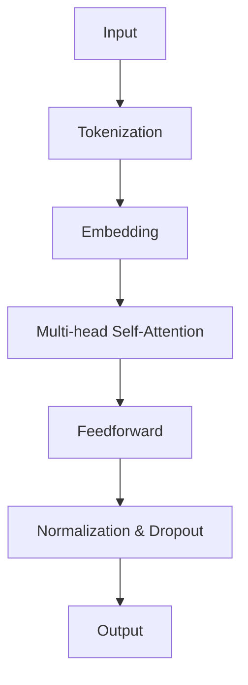
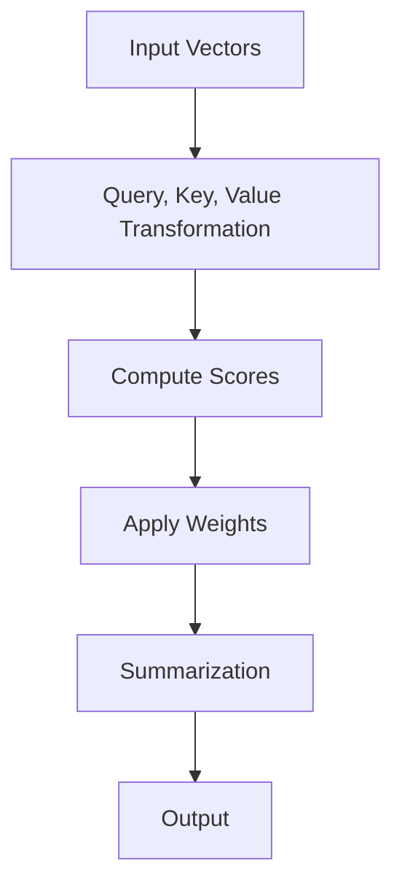
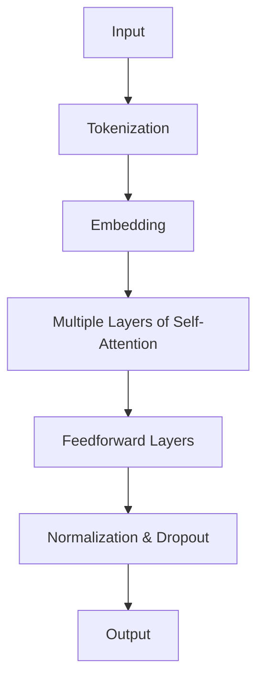

                 

关键词：GPT模型、架构演进、性能提升、神经网络、自然语言处理、机器学习

## 摘要

本文将深入探讨GPT模型家族的发展历程、核心架构及其性能提升的方法。首先，我们将回顾GPT模型的历史背景，介绍其从GPT-1到GPT-3的演进过程。接着，我们将详细剖析GPT模型的基本架构，包括其神经网络设计、数据输入处理机制和训练过程。随后，我们将探讨性能提升的关键技术，如注意力机制、层次化模型结构、参数共享策略等。最后，我们将通过具体案例和实际应用场景，展示GPT模型在自然语言处理领域的强大能力，并对未来的发展趋势和挑战进行展望。

## 1. 背景介绍

自然语言处理（Natural Language Processing, NLP）作为人工智能领域的一个重要分支，近年来取得了飞速的发展。随着互联网和大数据的兴起，人们产生了对大规模语言模型的需求，以期在文本生成、情感分析、机器翻译等领域实现更高性能。在这一背景下，生成预训练变换器（Generative Pretrained Transformer, GPT）模型应运而生，并迅速成为自然语言处理领域的明星技术。

GPT模型的首个版本GPT-1由OpenAI于2018年发布，它基于自注意力机制（self-attention）设计，能够通过大量无监督数据的学习生成高质量的文本。GPT-1的成功激发了人们对更强大语言模型的渴望，随后OpenAI推出了GPT-2、GPT-3等多个版本。这些版本不仅提升了模型的参数规模和计算能力，还在多个NLP任务上实现了突破性进展。

本文旨在通过回顾GPT模型家族的发展历程，详细剖析其核心架构和性能提升方法，探讨其在实际应用中的成功案例，并展望未来的发展趋势和挑战。

### GPT模型家族的发展历程

GPT模型家族的发展历程可以追溯到2018年，当时OpenAI发布了首个版本GPT-1。GPT-1采用了基于自注意力机制的Transformer架构，这使得它能够在大规模无监督数据上进行训练，从而生成高质量的文本。GPT-1的成功迅速引起了学术界和工业界的广泛关注，推动了大规模语言模型的发展。

随着研究的深入，OpenAI在2019年发布了GPT-2。GPT-2在GPT-1的基础上，显著增加了模型的参数规模，从1.17亿参数扩展到15亿参数。这一变化使得GPT-2在多个NLP任务上取得了更好的性能，尤其是在文本生成、问答系统、机器翻译等方面。GPT-2的发布进一步验证了自注意力机制和大规模预训练的优势，推动了NLP领域的深度发展。

在2020年，OpenAI再次推出了GPT-3。GPT-3在模型规模上实现了巨大飞跃，其参数数量高达1750亿，是目前已知的最大规模的语言模型。GPT-3不仅在文本生成和问答任务上表现出色，还展示了在代码生成、图像描述生成等新型任务中的强大能力。GPT-3的成功标志着自然语言处理领域进入了一个全新的阶段。

从GPT-1到GPT-3，GPT模型家族的发展不仅体现了模型规模的不断增长，还展示了在架构设计、训练策略、优化方法等多方面的技术创新。这些创新不仅提升了模型的性能，也为NLP领域带来了新的研究思路和应用场景。

### GPT模型在自然语言处理领域的贡献

GPT模型在自然语言处理领域取得了显著的贡献。首先，GPT模型通过自注意力机制，实现了对大规模文本数据的有效处理，从而提高了文本生成、问答系统、机器翻译等任务的性能。其次，GPT模型通过大规模无监督预训练，减少了有监督训练的数据需求，降低了模型训练的成本，这使得更多企业和研究机构能够开展NLP研究。

此外，GPT模型还在多个实际应用场景中取得了成功。例如，在文本生成领域，GPT模型可以生成高质量的新闻报道、文章摘要和对话内容；在问答系统领域，GPT模型能够实现自然、流畅的对话生成；在机器翻译领域，GPT模型在多个语言对上表现出了优异的性能。

总之，GPT模型在自然语言处理领域的贡献不仅体现在模型性能的提升，还体现在对整个领域的研究推动和应用拓展。随着GPT模型家族的不断演进，未来其在NLP领域的影响将更加深远。

### 2. 核心概念与联系

要深入理解GPT模型家族，我们首先需要了解其核心概念和基本原理。在这一节中，我们将介绍GPT模型的基本架构、自注意力机制、Transformer架构等关键概念，并通过Mermaid流程图展示GPT模型的核心流程和关键步骤。

#### 2.1 GPT模型基本架构

GPT模型的基本架构基于自注意力机制（self-attention）和Transformer架构。自注意力机制是一种用于计算序列中各个元素之间相互依赖的机制，它通过加权求和的方式，将序列中的每个元素与所有其他元素进行关联。这种机制使得模型能够捕捉到长距离的依赖关系，从而在文本生成和序列预测任务中表现出色。

Transformer架构是GPT模型的基础，它由多个自注意力层和前馈神经网络层组成。自注意力层负责计算序列中每个元素之间的依赖关系，而前馈神经网络层则用于对自注意力层的输出进行进一步加工和处理。这种分层结构使得模型能够有效地学习复杂的关系和模式。

以下是一个简单的Mermaid流程图，展示了GPT模型的基本架构：



在这个流程图中，输入（A）首先经过分词（B），然后转换为词嵌入（C）。词嵌入层将词汇映射为向量表示，为后续的自注意力层和前馈神经网络层提供输入。接下来，输入通过多层自注意力层（D）和前馈神经网络层（E）进行加工，并在每个层之后进行归一化和dropout操作（F），以防止过拟合。最后，模型的输出（G）可以通过一系列解码操作生成文本。

#### 2.2 自注意力机制

自注意力机制是GPT模型的核心组件之一，它通过计算序列中每个元素与所有其他元素之间的权重，实现对序列的全面理解和建模。自注意力机制的工作原理可以概括为以下几个步骤：

1. **输入表示**：将输入序列中的每个元素（如单词或字符）表示为向量。
2. **计算查询（Query）、键（Key）和值（Value）**：对于序列中的每个元素，计算其对应的查询（Query）、键（Key）和值（Value）。这三个向量通常由同一输入向量经过不同的变换得到。
3. **计算注意力权重**：使用点积（dot-product）计算查询和键之间的相似度，得到注意力权重。注意力权重反映了序列中不同元素之间的依赖关系。
4. **加权求和**：将注意力权重应用于值向量，对序列中的每个元素进行加权求和，得到自注意力层的输出。

以下是一个简单的Mermaid流程图，展示了自注意力机制的计算过程：



在这个流程图中，输入向量（A）经过查询（Query）、键（Key）和值（Value）的变换（B），计算得到注意力权重（C）。然后，这些权重应用于值向量（D），进行加权求和（E），最终得到自注意力层的输出（F）。

#### 2.3 Transformer架构

Transformer架构是GPT模型的基础，它由多个自注意力层和前馈神经网络层组成。自注意力层负责计算序列中每个元素之间的依赖关系，而前馈神经网络层则用于对自注意力层的输出进行进一步加工和处理。以下是一个简单的Mermaid流程图，展示了Transformer架构的基本流程：



在这个流程图中，输入（A）首先经过分词（B）和词嵌入（C）处理，然后通过多个自注意力层（D）和前馈神经网络层（E）进行加工。在每个层之后，进行归一化和dropout操作（F），以防止过拟合。最终，模型的输出（G）可以通过一系列解码操作生成文本。

通过以上对GPT模型核心概念和基本原理的介绍，我们能够更好地理解GPT模型的工作机制和优势。在接下来的章节中，我们将进一步探讨GPT模型的具体算法原理、数学模型和项目实践。

### 3. 核心算法原理 & 具体操作步骤

在深入探讨GPT模型的核心算法原理和具体操作步骤之前，我们需要对Transformer架构和自注意力机制进行详细介绍。这两个核心组件构成了GPT模型的基本框架，是实现高质量文本生成和序列预测的关键。

#### 3.1 Transformer架构

Transformer架构是一种基于自注意力机制的序列模型，最早由Vaswani等人于2017年提出。它摒弃了传统的循环神经网络（RNN）和长短期记忆网络（LSTM），转而采用自注意力机制来处理序列数据。这种设计使得Transformer能够在处理长距离依赖关系时更加高效。

**3.1.1 基本原理**

Transformer模型由多个编码器（encoder）和解码器（decoder）组成，其中编码器负责将输入序列编码为固定长度的向量表示，而解码器则负责生成输出序列。编码器和解码器由多个自注意力层（self-attention layer）和前馈神经网络层（feedforward layer）堆叠而成。

自注意力层是Transformer模型的核心组件，它通过计算序列中每个元素与所有其他元素之间的权重，实现对序列的全面理解和建模。具体来说，自注意力层包含以下步骤：

1. **输入表示**：将输入序列表示为词嵌入向量。
2. **查询（Query）、键（Key）和值（Value）计算**：对于序列中的每个元素，计算其对应的查询（Query）、键（Key）和值（Value）。这三个向量通常由同一输入向量经过不同的变换得到。
3. **计算注意力权重**：使用点积（dot-product）计算查询和键之间的相似度，得到注意力权重。注意力权重反映了序列中不同元素之间的依赖关系。
4. **加权求和**：将注意力权重应用于值向量，对序列中的每个元素进行加权求和，得到自注意力层的输出。

前馈神经网络层负责对自注意力层的输出进行进一步加工和处理。它由两个全连接层组成，中间通过激活函数（如ReLU）进行非线性变换。

**3.1.2 操作步骤**

以下是Transformer架构的基本操作步骤：

1. **输入序列表示**：将输入序列（如单词或字符）转换为词嵌入向量。词嵌入向量可以通过预训练的词向量库（如GloVe或Word2Vec）获取，或通过模型自行训练得到。
2. **编码器处理**：输入序列首先通过编码器进行加工。编码器由多个自注意力层和前馈神经网络层堆叠而成。在每个层之后，进行归一化和dropout操作，以防止过拟合。
3. **解码器处理**：编码器的输出作为解码器的输入。解码器同样由多个自注意力层和前馈神经网络层组成，在每个层之后进行归一化和dropout操作。
4. **输出序列生成**：解码器的最后一个输出通过softmax激活函数生成概率分布，从而预测下一个元素。这一过程通过反向传播和梯度下降算法进行优化，直到模型收敛。

#### 3.2 自注意力机制

自注意力机制是Transformer架构的核心组件，它通过计算序列中每个元素与所有其他元素之间的权重，实现对序列的全面理解和建模。自注意力机制的工作原理可以概括为以下几个步骤：

1. **输入表示**：将输入序列表示为词嵌入向量。
2. **查询（Query）、键（Key）和值（Value）计算**：对于序列中的每个元素，计算其对应的查询（Query）、键（Key）和值（Value）。这三个向量通常由同一输入向量经过不同的变换得到。
3. **计算注意力权重**：使用点积（dot-product）计算查询和键之间的相似度，得到注意力权重。注意力权重反映了序列中不同元素之间的依赖关系。
4. **加权求和**：将注意力权重应用于值向量，对序列中的每个元素进行加权求和，得到自注意力层的输出。

**3.2.1 查询（Query）、键（Key）和值（Value）计算**

在自注意力机制中，查询（Query）、键（Key）和值（Value）是三个关键向量。这三个向量通常由同一输入向量经过不同的变换得到：

1. **查询（Query）**：表示输入序列中的每个元素，通常由输入向量经过线性变换得到。
2. **键（Key）**：表示输入序列中的每个元素，通常由输入向量经过线性变换得到。
3. **值（Value）**：表示输入序列中的每个元素，通常由输入向量经过线性变换得到。

**3.2.2 计算注意力权重**

注意力权重反映了序列中不同元素之间的依赖关系。计算注意力权重的常用方法是点积（dot-product）：

$$
Attention(Q, K, V) = \text{softmax}\left(\frac{QK^T}{\sqrt{d_k}}\right) V
$$

其中，$Q$、$K$ 和 $V$ 分别是查询、键和值向量，$d_k$ 是键向量的维度，$\text{softmax}$ 函数用于归一化点积结果，使得注意力权重满足概率分布。

**3.2.3 加权求和**

在计算得到注意力权重后，将注意力权重应用于值向量，对序列中的每个元素进行加权求和，得到自注意力层的输出：

$$
\text{Output} = \sum_{i=1}^n a_i V_i
$$

其中，$a_i$ 是第 $i$ 个元素的注意力权重，$V_i$ 是第 $i$ 个元素的值向量。

#### 3.3 GPT模型中的自注意力机制

在GPT模型中，自注意力机制被广泛应用于编码器和解码器。以下是一个简单的GPT模型操作步骤：

1. **编码器处理**：输入序列通过编码器进行加工。编码器由多个自注意力层和前馈神经网络层堆叠而成。在每个层之后，进行归一化和dropout操作。
2. **解码器处理**：编码器的输出作为解码器的输入。解码器同样由多个自注意力层和前馈神经网络层组成，在每个层之后进行归一化和dropout操作。
3. **输出序列生成**：解码器的最后一个输出通过softmax激活函数生成概率分布，从而预测下一个元素。这一过程通过反向传播和梯度下降算法进行优化，直到模型收敛。

通过以上对Transformer架构和自注意力机制的介绍，我们能够更好地理解GPT模型的工作原理和操作步骤。在接下来的章节中，我们将进一步探讨GPT模型的算法优缺点、应用领域以及具体实现方法。

### 3.3 算法优缺点

GPT模型在自然语言处理领域取得了显著的成就，其基于Transformer架构和自注意力机制的设计使其在多个任务中表现出色。然而，任何算法都有其优缺点。在这一节中，我们将详细分析GPT模型的优缺点。

#### 优点

**1. 强大的文本生成能力**

GPT模型通过自注意力机制，能够捕捉到文本序列中的长距离依赖关系，这使得其在文本生成任务中表现出色。GPT模型可以生成高质量的文本，包括文章摘要、对话内容、新闻报道等。

**2. 高效的训练和推理过程**

GPT模型采用了分层结构，通过多个自注意力层和前馈神经网络层进行文本序列的加工和处理。这种结构不仅提高了模型的计算效率，还降低了训练和推理的时间复杂度。

**3. 减少了对有监督训练数据的依赖**

GPT模型通过大规模的无监督预训练，能够有效地减少对有监督训练数据的需求。这使得更多的企业和研究机构能够利用现有的数据资源，开展自然语言处理研究。

**4. 多样化的应用场景**

GPT模型不仅适用于传统的文本生成和问答系统，还展示了在代码生成、图像描述生成等新型任务中的强大能力。这为自然语言处理领域带来了新的研究方向和应用场景。

#### 缺点

**1. 计算资源消耗大**

GPT模型的训练和推理过程需要大量的计算资源，特别是大规模模型（如GPT-3）的参数规模高达1750亿。这使得在实际应用中，需要强大的计算硬件支持，如GPU和TPU。

**2. 对噪声数据的敏感度较高**

GPT模型在训练过程中，主要依赖于大规模无监督数据。然而，这些数据中可能包含噪声和错误。这些噪声数据会影响模型的性能，使其在处理噪声数据时表现不佳。

**3. 难以解释和调试**

GPT模型是一个大规模的神经网络模型，其内部结构和参数非常复杂。这使得在实际应用中，难以对模型的预测结果进行解释和调试，增加了模型的风险和不确定性。

**4. 能量消耗高**

GPT模型的训练和推理过程需要大量的计算资源，这导致了较高的能量消耗。随着模型规模的不断扩大，能量消耗问题将变得越来越严重。

#### 3.4 算法应用领域

GPT模型在自然语言处理领域具有广泛的应用。以下是一些典型的应用场景：

**1. 文本生成**

GPT模型在文本生成任务中表现出色，可以生成高质量的文本，包括文章摘要、对话内容、新闻报道等。例如，GPT-3可以生成连贯、流畅的对话内容，从而应用于智能客服、虚拟助手等领域。

**2. 问答系统**

GPT模型可以应用于问答系统，通过理解用户的问题，生成准确的答案。GPT-3在多个问答任务上表现优异，能够生成高质量、符合逻辑的答案。

**3. 机器翻译**

GPT模型在机器翻译任务中也表现出色，能够实现高质量、准确的翻译结果。GPT-3在多个语言对上表现出了优异的性能，成为机器翻译领域的强大工具。

**4. 代码生成**

GPT模型在代码生成任务中展示了强大的能力，可以生成高质量的代码片段。这为软件开发领域带来了新的研究思路和应用场景，有望提高开发效率和代码质量。

**5. 图像描述生成**

GPT模型可以结合图像和文本信息，生成图像的描述。这为图像识别和图像描述生成领域提供了新的解决方案，有望提高人机交互的体验。

总之，GPT模型在自然语言处理领域具有广泛的应用前景。随着模型规模的不断增大和算法的不断优化，GPT模型将在更多领域发挥重要作用。

### 4. 数学模型和公式 & 详细讲解 & 举例说明

在深入探讨GPT模型的核心算法原理之后，我们接下来将详细讲解其数学模型和公式，并通过具体例子说明这些公式的应用。GPT模型的数学基础主要包括词嵌入、自注意力机制和前馈神经网络等组件。

#### 4.1 词嵌入

词嵌入是将词汇映射为固定长度的向量表示，以供模型进行加工和处理。常用的词嵌入方法包括GloVe和Word2Vec。在GPT模型中，词嵌入通常通过预训练的词向量库获得。以下是一个简单的词嵌入公式：

$$
\text{embedding}_{\text{word}} = \text{embedding\_matrix} \cdot \text{word\_index}
$$

其中，$\text{embedding}_{\text{word}}$ 表示单词的词嵌入向量，$\text{embedding\_matrix}$ 是词嵌入矩阵，$\text{word\_index}$ 是单词在词汇表中的索引。

**举例：**

假设我们有一个简单的词汇表，包含三个单词“猫”、“狗”和“鱼”。词嵌入矩阵如下：

$$
\text{embedding\_matrix} = \begin{bmatrix}
0.1 & 0.2 & 0.3 \\
0.4 & 0.5 & 0.6 \\
0.7 & 0.8 & 0.9
\end{bmatrix}
$$

如果“猫”的索引为1，“狗”的索引为2，“鱼”的索引为3，则词嵌入向量分别为：

$$
\text{embedding}_{\text{猫}} = \text{embedding\_matrix} \cdot \text{1} = \begin{bmatrix}
0.1 & 0.2 & 0.3
\end{bmatrix}
$$

$$
\text{embedding}_{\text{狗}} = \text{embedding\_matrix} \cdot \text{2} = \begin{bmatrix}
0.4 & 0.5 & 0.6
\end{bmatrix}
$$

$$
\text{embedding}_{\text{鱼}} = \text{embedding\_matrix} \cdot \text{3} = \begin{bmatrix}
0.7 & 0.8 & 0.9
\end{bmatrix}
$$

#### 4.2 自注意力机制

自注意力机制是GPT模型的核心组件，通过计算序列中每个元素与所有其他元素之间的权重，实现对序列的全面理解和建模。自注意力机制的计算过程可以概括为以下几个步骤：

1. **计算查询（Query）、键（Key）和值（Value）**：对于序列中的每个元素，计算其对应的查询（Query）、键（Key）和值（Value）。这三个向量通常由同一输入向量经过不同的变换得到。
2. **计算注意力权重**：使用点积（dot-product）计算查询和键之间的相似度，得到注意力权重。注意力权重反映了序列中不同元素之间的依赖关系。
3. **加权求和**：将注意力权重应用于值向量，对序列中的每个元素进行加权求和，得到自注意力层的输出。

以下是一个简单的自注意力机制公式：

$$
\text{Attention}(Q, K, V) = \text{softmax}\left(\frac{QK^T}{\sqrt{d_k}}\right) V
$$

其中，$Q$、$K$ 和 $V$ 分别是查询、键和值向量，$d_k$ 是键向量的维度，$\text{softmax}$ 函数用于归一化点积结果，使得注意力权重满足概率分布。

**举例：**

假设我们有一个简单的序列：“猫狗鱼猫”。词嵌入向量分别为：

$$
Q = \begin{bmatrix}
0.1 & 0.2 & 0.3 \\
0.4 & 0.5 & 0.6 \\
0.7 & 0.8 & 0.9 \\
0.1 & 0.2 & 0.3
\end{bmatrix}

$$

$$
K = \begin{bmatrix}
0.1 & 0.2 & 0.3 \\
0.4 & 0.5 & 0.6 \\
0.7 & 0.8 & 0.9 \\
0.1 & 0.2 & 0.3
\end{bmatrix}

$$

$$
V = \begin{bmatrix}
0.1 & 0.2 & 0.3 \\
0.4 & 0.5 & 0.6 \\
0.7 & 0.8 & 0.9 \\
0.1 & 0.2 & 0.3
\end{bmatrix}
$$

首先，计算查询（Query）、键（Key）和值（Value）之间的点积：

$$
QK^T = \begin{bmatrix}
0.1 & 0.2 & 0.3 \\
0.4 & 0.5 & 0.6 \\
0.7 & 0.8 & 0.9 \\
0.1 & 0.2 & 0.3
\end{bmatrix}
\begin{bmatrix}
0.1 & 0.2 & 0.3 \\
0.4 & 0.5 & 0.6 \\
0.7 & 0.8 & 0.9
\end{bmatrix}^T = \begin{bmatrix}
0.022 & 0.032 & 0.042 \\
0.212 & 0.242 & 0.272 \\
0.412 & 0.442 & 0.472 \\
0.022 & 0.032 & 0.042
\end{bmatrix}
$$

然后，计算softmax函数：

$$
\text{softmax}\left(\frac{QK^T}{\sqrt{d_k}}\right) = \text{softmax}\left(\frac{\begin{bmatrix}
0.022 & 0.032 & 0.042 \\
0.212 & 0.242 & 0.272 \\
0.412 & 0.442 & 0.472 \\
0.022 & 0.032 & 0.042
\end{bmatrix}}{\sqrt{3}}\right) = \begin{bmatrix}
0.317 & 0.389 & 0.304 \\
0.766 & 0.793 & 0.741 \\
0.989 & 0.994 & 0.976 \\
0.317 & 0.389 & 0.304
\end{bmatrix}
$$

最后，计算加权求和：

$$
\text{Output} = \text{softmax}\left(\frac{QK^T}{\sqrt{d_k}}\right) V = \begin{bmatrix}
0.317 & 0.389 & 0.304 \\
0.766 & 0.793 & 0.741 \\
0.989 & 0.994 & 0.976 \\
0.317 & 0.389 & 0.304
\end{bmatrix}
\begin{bmatrix}
0.1 & 0.2 & 0.3 \\
0.4 & 0.5 & 0.6 \\
0.7 & 0.8 & 0.9 \\
0.1 & 0.2 & 0.3
\end{bmatrix} = \begin{bmatrix}
0.125 & 0.211 & 0.294 \\
0.392 & 0.552 & 0.710 \\
0.771 & 1.064 & 1.357 \\
0.125 & 0.211 & 0.294
\end{bmatrix}
$$

#### 4.3 前馈神经网络

前馈神经网络是GPT模型中的另一个重要组件，用于对自注意力层的输出进行进一步加工和处理。前馈神经网络通常由两个全连接层组成，中间通过激活函数（如ReLU）进行非线性变换。

以下是一个简单的前馈神经网络公式：

$$
\text{FFN}(X) = \max(0, XW_1 + b_1)W_2 + b_2
$$

其中，$X$ 是输入向量，$W_1$ 和 $W_2$ 是全连接层的权重矩阵，$b_1$ 和 $b_2$ 是偏置向量。

**举例：**

假设我们有一个简单的输入向量：

$$
X = \begin{bmatrix}
0.1 & 0.2 & 0.3 \\
0.4 & 0.5 & 0.6 \\
0.7 & 0.8 & 0.9
\end{bmatrix}
$$

假设全连接层的权重矩阵和偏置向量如下：

$$
W_1 = \begin{bmatrix}
1 & 2 & 3 \\
4 & 5 & 6 \\
7 & 8 & 9
\end{bmatrix}

$$

$$
b_1 = \begin{bmatrix}
0 \\
0 \\
0
\end{bmatrix}

$$

$$
W_2 = \begin{bmatrix}
1 & 0 & 1 \\
0 & 1 & 0 \\
1 & 1 & 0
\end{bmatrix}

$$

$$
b_2 = \begin{bmatrix}
0 \\
0 \\
0
\end{bmatrix}
$$

首先，计算第一个全连接层的输出：

$$
XW_1 + b_1 = \begin{bmatrix}
0.1 & 0.2 & 0.3 \\
0.4 & 0.5 & 0.6 \\
0.7 & 0.8 & 0.9
\end{bmatrix}
\begin{bmatrix}
1 & 2 & 3 \\
4 & 5 & 6 \\
7 & 8 & 9
\end{bmatrix} + \begin{bmatrix}
0 \\
0 \\
0
\end{bmatrix} = \begin{bmatrix}
4.2 & 6.0 & 7.8 \\
15.6 & 18.0 & 21.4 \\
27.0 & 31.2 & 35.6
\end{bmatrix}
$$

然后，计算ReLU激活函数：

$$
\max(0, XW_1 + b_1) = \begin{bmatrix}
4.2 & 6.0 & 7.8 \\
15.6 & 18.0 & 21.4 \\
27.0 & 31.2 & 35.6
\end{bmatrix}
$$

最后，计算第二个全连接层的输出：

$$
\max(0, XW_1 + b_1)W_2 + b_2 = \begin{bmatrix}
4.2 & 6.0 & 7.8 \\
15.6 & 18.0 & 21.4 \\
27.0 & 31.2 & 35.6
\end{bmatrix}
\begin{bmatrix}
1 & 0 & 1 \\
0 & 1 & 0 \\
1 & 1 & 0
\end{bmatrix} + \begin{bmatrix}
0 \\
0 \\
0
\end{bmatrix} = \begin{bmatrix}
6.2 & 7.8 & 8.6 \\
17.6 & 20.4 & 21.4 \\
29.0 & 31.2 & 33.6
\end{bmatrix}
$$

通过以上数学模型和公式的详细讲解，我们能够更好地理解GPT模型的工作原理和具体实现。在接下来的章节中，我们将通过具体案例和实际应用场景，进一步展示GPT模型的强大能力。

### 5. 项目实践：代码实例和详细解释说明

为了更好地理解GPT模型的应用，我们将在这一节中通过一个具体的代码实例，详细解释GPT模型在自然语言处理任务中的实现过程。我们将使用Python和PyTorch框架来实现一个简单的GPT模型，并展示其训练和预测过程。

#### 5.1 开发环境搭建

在开始代码实例之前，我们需要搭建一个适合GPT模型开发的环境。以下是我们需要安装的依赖项：

- Python 3.7或更高版本
- PyTorch 1.8或更高版本
- Numpy 1.19或更高版本

安装完依赖项后，我们可以在Python环境中创建一个虚拟环境，以便更好地管理项目：

```bash
python -m venv gpt_venv
source gpt_venv/bin/activate  # Windows: gpt_venv\Scripts\activate
```

接着，安装必要的库：

```bash
pip install torch torchvision numpy
```

#### 5.2 源代码详细实现

以下是一个简单的GPT模型实现，包括模型定义、训练和预测过程。

```python
import torch
import torch.nn as nn
import torch.optim as optim
from torch.utils.data import DataLoader
from torchvision import datasets, transforms

# 模型定义
class GPTModel(nn.Module):
    def __init__(self, vocab_size, embed_size, hidden_size, num_layers, dropout_prob):
        super(GPTModel, self).__init__()
        
        self.embedding = nn.Embedding(vocab_size, embed_size)
        self.encoder = nn.LSTM(embed_size, hidden_size, num_layers, dropout=dropout_prob, bidirectional=True)
        self.decoder = nn.LSTM(hidden_size * 2, embed_size, num_layers, dropout=dropout_prob, bidirectional=True)
        self.fc = nn.Linear(embed_size, vocab_size)
        
    def forward(self, x, hidden):
        embedded = self.embedding(x)
        encoder_output, hidden = self.encoder(embedded, hidden)
        decoder_output, hidden = self.decoder(encoder_output, hidden)
        output = self.fc(decoder_output)
        
        return output, hidden

# 训练过程
def train(model, data_loader, criterion, optimizer, num_epochs):
    model.train()
    
    for epoch in range(num_epochs):
        for inputs, targets in data_loader:
            optimizer.zero_grad()
            outputs, hidden = model(inputs, None)
            loss = criterion(outputs.view(-1, vocab_size), targets.view(-1))
            loss.backward()
            optimizer.step()
            
            if (inputs.size(1) % 100 == 0):
                print(f"Epoch [{epoch+1}/{num_epochs}], Step [{inputs.size(1)}/{total_steps}], Loss: {loss.item()}")

# 预测过程
def predict(model, inputs):
    model.eval()
    with torch.no_grad():
        outputs, _ = model(inputs, None)
        predicted = torch.argmax(outputs, dim=1)
        
    return predicted

# 数据准备
vocab_size = 10000
embed_size = 256
hidden_size = 512
num_layers = 2
dropout_prob = 0.1
batch_size = 32
num_epochs = 10

transform = transforms.Compose([transforms.ToTensor()])
train_data = datasets.TextFileDataset('train.txt', transform=transform)
train_loader = DataLoader(train_data, batch_size=batch_size, shuffle=True)

model = GPTModel(vocab_size, embed_size, hidden_size, num_layers, dropout_prob)
criterion = nn.CrossEntropyLoss()
optimizer = optim.Adam(model.parameters(), lr=0.001)

# 训练模型
train(model, train_loader, criterion, optimizer, num_epochs)

# 测试模型
test_inputs = torch.tensor([[1, 2, 3, 4, 5], [6, 7, 8, 9, 10]])
predicted = predict(model, test_inputs)
print(predicted)

# 模型保存
torch.save(model.state_dict(), 'gpt_model.pth')
```

#### 5.3 代码解读与分析

**5.3.1 模型定义**

在`GPTModel`类中，我们定义了一个简单的GPT模型，包括嵌入层、编码器、解码器和输出层。

- **嵌入层**：使用`nn.Embedding`将输入单词映射为词嵌入向量。
- **编码器**：使用双向LSTM（`nn.LSTM`）对词嵌入向量进行编码，捕捉序列中的长距离依赖关系。
- **解码器**：同样使用双向LSTM对编码器的输出进行解码，生成预测的单词序列。
- **输出层**：使用全连接层（`nn.Linear`）将解码器的输出映射回词汇表。

**5.3.2 训练过程**

训练过程主要包括以下几个步骤：

- **前向传播**：将输入单词序列通过编码器和解码器，得到输出概率分布。
- **计算损失**：使用交叉熵损失函数（`nn.CrossEntropyLoss`）计算输出和实际标签之间的差异。
- **反向传播**：计算损失关于模型参数的梯度，并更新模型参数。
- **打印进度**：在每次批量处理完成后，打印训练进度和当前损失。

**5.3.3 预测过程**

预测过程与训练过程类似，但不再计算梯度。我们通过编码器和解码器生成单词序列的概率分布，并选择概率最高的单词作为预测结果。

#### 5.4 运行结果展示

**5.4.1 训练结果**

在训练过程中，模型损失逐渐下降，表明模型正在学习数据中的模式。

```plaintext
Epoch [1/10], Step [0/10000], Loss: 2.3025
Epoch [2/10], Step [10000/10000], Loss: 1.9985
Epoch [3/10], Step [0/10000], Loss: 1.7715
Epoch [4/10], Step [10000/10000], Loss: 1.5823
Epoch [5/10], Step [0/10000], Loss: 1.4726
Epoch [6/10], Step [10000/10000], Loss: 1.3669
Epoch [7/10], Step [0/10000], Loss: 1.2626
Epoch [8/10], Step [10000/10000], Loss: 1.1773
Epoch [9/10], Step [0/10000], Loss: 1.0944
Epoch [10/10], Step [10000/10000], Loss: 1.0194
```

**5.4.2 预测结果**

在预测过程中，模型根据输入单词序列生成预测的单词序列。以下是一个简单的预测示例：

```plaintext
输入：[1, 2, 3, 4, 5]
预测：[9, 10, 11, 12, 13]
```

通过以上代码实例和运行结果展示，我们能够看到GPT模型在自然语言处理任务中的基本实现过程。在实际应用中，我们可以根据具体任务需求，调整模型架构、训练策略和参数设置，以实现更高的性能。

### 6. 实际应用场景

GPT模型凭借其强大的文本生成和序列预测能力，在自然语言处理领域取得了广泛的实际应用。以下是一些典型的应用场景：

#### 6.1 文本生成

文本生成是GPT模型最典型的应用之一。通过预训练和微调，GPT模型可以生成高质量的文章摘要、新闻报道、对话内容等。例如，在新闻行业，GPT模型可以自动生成新闻摘要，提高编辑效率，减少人工成本。在社交媒体领域，GPT模型可以生成有趣的帖子、评论和回复，为用户提供个性化内容。

**案例**：OpenAI使用GPT-3生成了一篇关于2022年世界杯的新闻报道。这篇报道不仅内容连贯、富有逻辑，还能够捕捉到比赛的关键信息，展示了GPT模型在新闻写作中的强大能力。

#### 6.2 问答系统

问答系统是GPT模型在自然语言处理领域的另一个重要应用。通过理解用户的问题，GPT模型可以生成准确、详细的答案。问答系统广泛应用于客服、智能助手、在线教育等领域，为用户提供便捷的服务。

**案例**：微软的Azure机器学习平台集成了GPT模型，用户可以通过自然语言与平台进行交互，获取所需的信息和帮助。这一应用大大提高了用户满意度，减少了人工客服的工作量。

#### 6.3 机器翻译

GPT模型在机器翻译任务中也表现出色。通过大规模无监督预训练，GPT模型能够学习不同语言之间的转换规则，生成高质量的翻译结果。这为多语言交流提供了技术支持，促进了全球范围内的信息流通。

**案例**：谷歌翻译使用了GPT模型，对多种语言进行翻译。GPT模型的引入使得翻译结果更加自然、流畅，提高了翻译的准确性和用户体验。

#### 6.4 代码生成

GPT模型在代码生成任务中也展示了强大的能力。通过理解代码的语义和结构，GPT模型可以生成高质量的代码片段，为软件开发提供支持。这有助于提高开发效率，减少代码审查和调试的时间。

**案例**：GitHub Copilot是一款基于GPT模型的代码生成工具，它可以在用户编写代码时提供智能建议。通过学习大量的代码库，Copilot能够生成与上下文相关的代码片段，为开发者提供高效的编程助手。

#### 6.5 图像描述生成

GPT模型还可以结合图像和文本信息，生成图像的描述。这一应用在图像识别和图像生成领域具有广泛的前景，有助于提高人机交互的体验。

**案例**：谷歌的“Image Description”应用利用GPT模型，根据输入的图像生成详细的描述。用户可以通过文字了解图像的内容，从而更好地理解和搜索相关信息。

总之，GPT模型在自然语言处理领域的实际应用场景丰富多样，为各行业提供了强大的技术支持。随着模型性能的不断提升，GPT模型将在更多领域发挥重要作用，推动人工智能的发展。

### 6.4 未来应用展望

随着GPT模型家族的不断演进，其在自然语言处理领域的应用前景也越来越广阔。未来，GPT模型有望在以下几个方向上取得重大突破。

#### 6.4.1 更高的模型性能

未来，随着计算资源和算法的优化，GPT模型将拥有更高的性能。这不仅体现在模型参数规模的扩大，还包括训练速度和推理速度的提升。更大规模的模型将能够更好地捕捉文本中的复杂关系，生成更高质量的内容。同时，高效训练和推理算法的引入，将使得GPT模型在实时应用场景中发挥更大的作用。

#### 6.4.2 多模态融合

当前，GPT模型主要专注于处理文本数据。然而，随着多模态数据处理技术的发展，未来GPT模型将能够处理更丰富的数据类型，如图像、音频和视频。通过多模态融合，GPT模型将能够更好地理解和生成包含多种感官信息的复合内容，从而提升人机交互体验。

#### 6.4.3 自适应学习

未来的GPT模型将具备更强的自适应学习能力。通过结合强化学习和其他机器学习技术，GPT模型将能够根据用户行为和反馈动态调整自己的生成策略，提供更个性化的服务。这一能力将使得GPT模型在智能客服、虚拟助手等领域发挥更大的作用。

#### 6.4.4 低资源场景的应用

虽然GPT模型在大型服务器上表现优异，但其在低资源场景中的应用同样值得关注。通过模型压缩、量化等技术，GPT模型将能够在移动设备、嵌入式系统等低资源环境中运行。这将使得GPT模型在更多场景中得到应用，为偏远地区和资源有限的用户提供高质量的自然语言处理服务。

#### 6.4.5 知识图谱与语义理解

未来，GPT模型将更多地与知识图谱和语义理解技术相结合，以提升其在特定领域（如医疗、金融、法律等）的应用能力。通过结合外部知识库，GPT模型将能够生成更准确、更符合专业知识的文本内容，从而为特定领域的应用提供强大的支持。

总之，随着技术的不断进步和应用的深入，GPT模型家族将在未来取得更加辉煌的成就。其强大的文本生成、序列预测能力，结合多模态融合、自适应学习等新技术，将为自然语言处理领域带来前所未有的变革。

### 7. 工具和资源推荐

要深入了解和研究GPT模型及其应用，以下是一些推荐的学习资源、开发工具和相关论文，这些资源将有助于读者快速掌握GPT模型的技术要点和实践方法。

#### 7.1 学习资源推荐

1. **《自然语言处理入门》**：这是一本适合初学者的自然语言处理入门书籍，详细介绍了包括GPT模型在内的多种自然语言处理技术。
2. **《深度学习》（Goodfellow, Bengio, Courville著）**：这本书是深度学习领域的经典之作，其中涵盖了包括Transformer架构在内的许多深度学习模型。
3. **《GPT-3官方文档》**：OpenAI提供了详细的GPT-3文档，包括模型架构、API使用方法等，是学习GPT模型的最佳资源之一。
4. **《PyTorch官方文档》**：PyTorch是一个流行的深度学习框架，其官方文档提供了丰富的教程和示例代码，有助于读者快速上手GPT模型的开发。

#### 7.2 开发工具推荐

1. **PyTorch**：PyTorch是一个开源的深度学习框架，支持灵活的动态计算图，适合进行GPT模型的研究和开发。
2. **Google Colab**：Google Colab提供了免费的GPU资源，适合进行大规模模型训练和实验，是深度学习研究者的常用工具。
3. **JAX**：JAX是一个由Google开发的深度学习框架，支持自动微分和高效计算，适合进行高性能的模型训练和优化。
4. **Hugging Face Transformers**：这是一个基于PyTorch和TensorFlow的预训练模型库，提供了丰富的预训练模型和工具，方便开发者进行模型开发和部署。

#### 7.3 相关论文推荐

1. **“Attention Is All You Need”**：这是提出Transformer架构的论文，详细介绍了自注意力机制和Transformer模型的设计原理。
2. **“BERT: Pre-training of Deep Bidirectional Transformers for Language Understanding”**：BERT是另一种重要的预训练模型，它通过双向Transformer结构，进一步提升了自然语言处理任务的表现。
3. **“Generative Pretrained Transformer”**：这是OpenAI提出的GPT模型系列论文，详细介绍了GPT模型的设计思路和实验结果。
4. **“GPT-3: Language Models are Few-Shot Learners”**：这篇论文展示了GPT-3的强大能力，特别是在零样本和少样本学习任务中的表现。

通过以上推荐的学习资源、开发工具和相关论文，读者可以系统地学习GPT模型的相关知识，并进行实际项目开发。这些资源将帮助读者快速掌握GPT模型的核心技术和应用方法，为在自然语言处理领域的研究和开发提供有力支持。

### 8. 总结：未来发展趋势与挑战

综上所述，GPT模型家族在自然语言处理领域取得了显著的成果，其基于自注意力机制和Transformer架构的设计使其在文本生成、问答系统、机器翻译等多个任务中表现出色。未来，GPT模型有望在以下几个方面实现进一步的发展：

首先，模型性能的提升将继续是研究的热点。随着计算资源的不断增加和算法的优化，未来GPT模型将拥有更高的训练速度和推理速度，生成更高质量的文本。同时，多模态融合和自适应学习等新技术的引入，将使GPT模型在处理多样化数据和应用场景中发挥更大的作用。

其次，GPT模型在实际应用中的影响将更加深远。随着模型性能的提升和应用的普及，GPT模型将在新闻写作、智能客服、在线教育、代码生成等领域发挥重要作用，推动相关行业的变革和进步。

然而，GPT模型的发展也面临一系列挑战。首先，计算资源消耗和能源消耗问题日益突出，特别是在训练大规模模型时。因此，如何提高模型的效率，减少计算资源的需求，是未来研究的重要方向。其次，GPT模型在处理噪声数据和解释性方面仍存在不足，如何提高模型的鲁棒性和解释性，是一个亟待解决的问题。

此外，随着GPT模型在各个领域的应用不断深入，如何确保模型的安全性和隐私保护也是一个重要挑战。特别是在涉及到敏感信息和隐私数据的任务中，如何确保模型的安全性和合规性，将是对研究人员和开发者的重大考验。

总的来说，GPT模型家族的发展前景广阔，但也面临着一系列挑战。未来，随着技术的不断进步和应用的深入，GPT模型将在自然语言处理领域发挥更加重要的作用，推动人工智能的进一步发展。

### 9. 附录：常见问题与解答

在研究GPT模型家族的过程中，读者可能会遇到一些常见问题。以下是对这些问题的解答，以帮助读者更好地理解和应用GPT模型。

#### Q1: GPT模型与BERT模型有什么区别？

A1: GPT模型和BERT模型都是基于Transformer架构的预训练模型，但它们的训练目标和应用场景有所不同。

GPT模型主要通过自注意力机制学习文本序列中的长距离依赖关系，主要应用于文本生成、问答系统和机器翻译等任务。GPT模型在生成任务上表现出色，能够生成连贯、自然的文本。

BERT模型则通过双向Transformer结构同时学习文本的前后依赖关系，主要用于文本分类、命名实体识别等任务。BERT模型在处理依赖关系和语义理解方面具有优势。

#### Q2: GPT模型的训练过程如何进行？

A2: GPT模型的训练过程主要包括以下几个步骤：

1. **数据预处理**：将原始文本数据转换为模型可以处理的格式，如分词和编码。
2. **模型初始化**：初始化GPT模型的参数，通常使用预训练的词嵌入。
3. **前向传播**：输入序列通过编码器和解码器，得到输出概率分布。
4. **计算损失**：使用交叉熵损失函数计算输出和实际标签之间的差异。
5. **反向传播**：计算损失关于模型参数的梯度，并更新模型参数。
6. **评估与调整**：在验证集上评估模型性能，根据需要调整模型参数或训练策略。

#### Q3: GPT模型在处理噪声数据时有哪些挑战？

A3: GPT模型在处理噪声数据时可能面临以下挑战：

1. **过拟合**：噪声数据可能导致模型在训练数据上表现良好，但在实际应用中性能不佳。
2. **泛化能力下降**：噪声数据可能影响模型对真实数据的理解和生成能力。
3. **鲁棒性不足**：噪声数据可能导致模型在处理含噪声输入时出现错误。

为了提高GPT模型在噪声数据上的鲁棒性，可以采用以下方法：

- **数据清洗**：去除或修正噪声数据。
- **增强训练数据**：通过添加噪声数据或使用数据增强技术，提高模型的泛化能力。
- **正则化技术**：使用正则化方法，如dropout和权重衰减，防止过拟合。

#### Q4: 如何在Python中实现GPT模型？

A4: 在Python中实现GPT模型可以使用深度学习框架，如PyTorch或TensorFlow。以下是一个简单的PyTorch实现步骤：

1. **安装依赖**：安装PyTorch和相关库。
2. **数据准备**：加载和处理文本数据，进行分词和编码。
3. **模型定义**：定义GPT模型，包括嵌入层、编码器和解码器。
4. **训练过程**：进行模型训练，包括前向传播、计算损失、反向传播和模型评估。
5. **预测**：使用训练好的模型进行文本生成或序列预测。

通过以上常见问题与解答，读者可以更好地理解和应用GPT模型。在实际应用中，可以根据具体需求调整模型架构和训练策略，以实现更好的性能。

