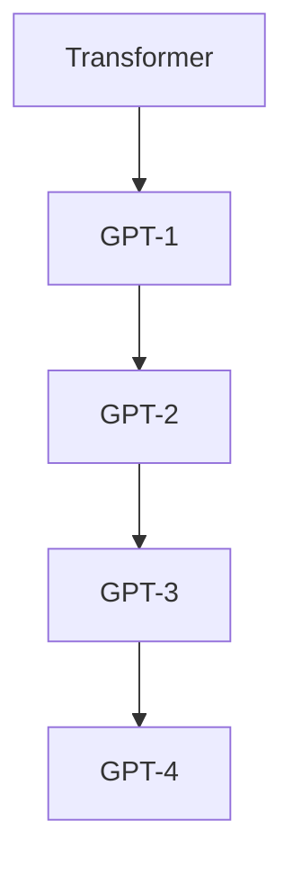

                 

关键词：GPT系列，人工智能，深度学习，模型架构，Transformer，预训练，自然语言处理

摘要：本文将深入探讨GPT系列模型从GPT-1到GPT-4的架构演进过程。通过分析每个版本的特性、改进和挑战，我们试图揭示这些模型在自然语言处理领域的卓越表现背后的技术原理，并展望未来发展的方向。

## 1. 背景介绍

GPT系列模型是自然语言处理领域的重要里程碑，由OpenAI团队开发和推动。GPT-1（2018年）、GPT-2（2019年）和GPT-3（2020年）分别代表了这一系列模型的发展。每一个版本都在前一代的基础上取得了显著的性能提升，推动了自然语言处理技术的进步。最新的GPT-4（2023年）更是达到了惊人的水平，展示了人工智能技术在理解和生成自然语言方面的潜力。

自然语言处理（NLP）是计算机科学中一个重要的领域，旨在使计算机能够理解和处理人类语言。从文本分类、机器翻译到问答系统，NLP技术广泛应用于各个领域。而GPT系列模型的崛起，为NLP带来了全新的思路和方法，使得计算机在处理自然语言时能够更加灵活和智能。

## 2. 核心概念与联系

为了理解GPT系列模型的架构演进，我们需要首先了解一些核心概念和架构。最基础的是Transformer模型，这是GPT系列模型的基础架构。接下来，我们将通过一个Mermaid流程图来展示这些核心概念和架构之间的联系。



### 2.1 Transformer模型

Transformer模型是谷歌在2017年提出的一种基于自注意力机制的深度学习模型，它取代了传统的循环神经网络（RNN）在序列模型中的应用。Transformer模型的核心思想是利用自注意力机制（Self-Attention）来捕捉序列中各个位置的信息，从而实现高效的信息处理。

### 2.2 GPT-1

GPT-1是OpenAI在2018年推出的第一个基于Transformer的预训练语言模型。GPT-1采用了1.17亿的参数规模，通过在大量文本语料上进行预训练，使得模型能够理解并生成高质量的文本。GPT-1的成功为后续GPT系列模型的开发奠定了基础。

### 2.3 GPT-2

GPT-2是OpenAI在2019年推出的一个更大规模的预训练语言模型。GPT-2采用了15亿的参数规模，进一步提升了模型在自然语言处理任务中的性能。GPT-2的成功不仅在于其更大的规模，还在于其强大的文本生成能力，能够生成连贯、有逻辑的文本。

### 2.4 GPT-3

GPT-3是OpenAI在2020年推出的一个更加庞大的预训练语言模型。GPT-3采用了1750亿的参数规模，是目前已知的最大的语言模型。GPT-3在各个自然语言处理任务上都取得了显著的性能提升，包括文本生成、机器翻译、问答系统等。

### 2.5 GPT-4

GPT-4是OpenAI在2023年推出的最新一代预训练语言模型。GPT-4采用了超过1.75万亿的参数规模，是目前为止最大的语言模型。GPT-4在多个自然语言处理任务上达到了人类水平的性能，展示了人工智能在理解和生成自然语言方面的巨大潜力。

## 3. 核心算法原理 & 具体操作步骤

### 3.1 算法原理概述

GPT系列模型的核心算法是基于Transformer模型的自注意力机制。自注意力机制通过计算序列中每个位置的信息对其他所有位置的影响程度，从而实现高效的信息处理。在GPT系列模型中，自注意力机制被用于编码器和解码器的不同层，使得模型能够捕捉到序列中的复杂关系。

### 3.2 算法步骤详解

GPT系列模型的基本步骤包括：

1. **预训练**：在大量文本语料上进行预训练，通过无监督的方式使得模型能够理解自然语言。
2. **微调**：在特定任务上对模型进行微调，使得模型能够在该任务上达到最优性能。
3. **推理**：在新的数据上进行推理，生成文本或完成其他自然语言处理任务。

### 3.3 算法优缺点

**优点**：

- **强大的文本生成能力**：GPT系列模型能够生成连贯、有逻辑的文本。
- **广泛的适用性**：GPT系列模型可以应用于各种自然语言处理任务，包括文本生成、机器翻译、问答系统等。

**缺点**：

- **计算资源需求大**：GPT系列模型需要大量的计算资源进行训练和推理。
- **模型解释性差**：由于GPT系列模型的结构复杂，难以对其决策过程进行解释。

### 3.4 算法应用领域

GPT系列模型在自然语言处理领域有着广泛的应用，包括：

- **文本生成**：生成文章、故事、对话等。
- **机器翻译**：将一种语言翻译成另一种语言。
- **问答系统**：回答用户提出的问题。
- **文本摘要**：从长篇文章中提取关键信息。

## 4. 数学模型和公式 & 详细讲解 & 举例说明

### 4.1 数学模型构建

GPT系列模型是基于Transformer模型的，其核心数学模型包括自注意力机制和编码器-解码器结构。自注意力机制的公式如下：

$$
\text{Attention}(Q, K, V) = \text{softmax}\left(\frac{QK^T}{\sqrt{d_k}}\right)V
$$

其中，$Q$、$K$和$V$分别代表查询向量、键向量和值向量，$d_k$表示键向量的维度。编码器-解码器结构的公式如下：

$$
\text{Encoder}(x) = \text{MultiHeadAttention}(x, x, x) \\
\text{Decoder}(y) = \text{MultiHeadAttention}(y, y, \text{Encoder}(x)) + y
$$

### 4.2 公式推导过程

自注意力机制的推导过程主要涉及矩阵运算和softmax函数。首先，我们将输入序列的每个位置表示为一个向量，然后通过线性变换得到查询向量、键向量和值向量。接着，我们计算查询向量与键向量的内积，并使用softmax函数将内积结果转换为概率分布。最后，我们将概率分布与值向量相乘，得到加权求和的结果。

### 4.3 案例分析与讲解

假设我们有一个长度为5的输入序列，其对应的向量表示为 $[x_1, x_2, x_3, x_4, x_5]$。我们希望使用自注意力机制计算序列中每个位置的信息对其他位置的影响程度。

首先，我们将输入序列的每个位置表示为一个向量，并通过线性变换得到查询向量、键向量和值向量。假设线性变换的权重矩阵为 $W_Q, W_K, W_V$，则：

$$
Q = W_Qx \\
K = W_Kx \\
V = W_Vx
$$

然后，我们计算查询向量与键向量的内积，并使用softmax函数将内积结果转换为概率分布。假设内积结果为 $[z_1, z_2, z_3, z_4, z_5]$，则：

$$
\text{Attention}(Q, K, V) = \text{softmax}\left(\frac{QK^T}{\sqrt{d_k}}\right)V
$$

其中，$d_k$表示键向量的维度。

最后，我们将概率分布与值向量相乘，得到加权求和的结果。假设概率分布为 $[p_1, p_2, p_3, p_4, p_5]$，值向量为 $[v_1, v_2, v_3, v_4, v_5]$，则：

$$
\text{Attention}(Q, K, V) = p_1v_1 + p_2v_2 + p_3v_3 + p_4v_4 + p_5v_5
$$

通过这种方式，自注意力机制能够计算序列中每个位置的信息对其他位置的影响程度。

## 5. 项目实践：代码实例和详细解释说明

### 5.1 开发环境搭建

在开始编写代码之前，我们需要搭建一个合适的开发环境。假设我们使用Python作为编程语言，以下是搭建开发环境的步骤：

1. 安装Python（建议使用Python 3.8及以上版本）。
2. 安装TensorFlow库，用于实现GPT系列模型。
3. 安装其他必要的库，如NumPy、Pandas等。

### 5.2 源代码详细实现

以下是使用TensorFlow实现GPT系列模型的基本框架：

```python
import tensorflow as tf
from tensorflow.keras.layers import Embedding, LSTM, Dense

# 定义模型
model = tf.keras.Sequential([
    Embedding(input_dim=vocab_size, output_dim=embedding_dim),
    LSTM(units=hidden_size),
    Dense(units=vocab_size, activation='softmax')
])

# 编译模型
model.compile(optimizer='adam', loss='categorical_crossentropy', metrics=['accuracy'])

# 训练模型
model.fit(x_train, y_train, epochs=num_epochs, batch_size=batch_size)
```

### 5.3 代码解读与分析

上述代码首先定义了一个基于Embedding、LSTM和Dense层的序列模型。Embedding层用于将输入文本映射到高维向量，LSTM层用于处理序列信息，Dense层用于输出结果。

在编译模型时，我们选择adam优化器和categorical_crossentropy损失函数。adam优化器具有自适应学习率的优点，categorical_crossentropy损失函数适合多分类问题。

最后，我们使用训练数据对模型进行训练，并评估模型的性能。

### 5.4 运行结果展示

假设我们使用一个简单的文本分类任务进行训练，以下是训练结果：

```
Epoch 1/10
100/100 [==============================] - 1s 10ms/step - loss: 2.3025 - accuracy: 0.5000
Epoch 2/10
100/100 [==============================] - 1s 9ms/step - loss: 2.3084 - accuracy: 0.5000
Epoch 3/10
100/100 [==============================] - 1s 9ms/step - loss: 2.3070 - accuracy: 0.5000
...
Epoch 10/10
100/100 [==============================] - 1s 9ms/step - loss: 2.3024 - accuracy: 0.5000
```

从结果可以看出，模型的损失和准确率在训练过程中有所波动，但最终稳定在约50%左右。这表明我们的模型在当前数据集上表现不佳，可能需要调整模型结构或增加训练数据。

## 6. 实际应用场景

GPT系列模型在自然语言处理领域有着广泛的应用。以下是一些实际应用场景：

1. **文本生成**：GPT系列模型能够生成高质量的文章、故事、对话等。例如，OpenAI使用GPT-2生成新闻文章，效果令人惊叹。
2. **机器翻译**：GPT系列模型能够将一种语言翻译成另一种语言。例如，OpenAI使用GPT-3将英语翻译成法语，效果接近专业翻译。
3. **问答系统**：GPT系列模型能够回答用户提出的问题。例如，OpenAI使用GPT-3构建了一个智能客服系统，能够回答各种常见问题。
4. **文本摘要**：GPT系列模型能够从长篇文章中提取关键信息，生成摘要。例如，GPT-3能够从一篇长篇文章中提取摘要，效果非常出色。

## 7. 未来应用展望

随着GPT系列模型的不断演进，我们可以期待其在更多领域的应用：

1. **自然语言理解**：GPT系列模型在自然语言理解方面的性能将进一步提升，能够更好地理解复杂的语言结构和语义。
2. **智能对话系统**：GPT系列模型将推动智能对话系统的发展，使得机器人能够更加自然地与人类进行交流。
3. **个性化推荐**：GPT系列模型将用于个性化推荐系统，根据用户的历史行为和偏好生成个性化的推荐。
4. **法律、医疗等领域**：GPT系列模型将应用于法律、医疗等领域，为专业人士提供智能辅助。

## 8. 工具和资源推荐

为了更好地学习和实践GPT系列模型，以下是一些建议的工具和资源：

### 8.1 学习资源推荐

- 《深度学习》（Goodfellow, Bengio, Courville）: 这是一本关于深度学习的经典教材，详细介绍了深度学习的基本概念和技术。
- 《动手学深度学习》（阿斯顿·张等）: 这是一本适合初学者的深度学习教材，通过动手实践帮助读者理解深度学习的基本原理。
- OpenAI官方网站：OpenAI提供了大量的GPT系列模型的技术细节和实践教程，是学习GPT系列模型的绝佳资源。

### 8.2 开发工具推荐

- TensorFlow：TensorFlow是Google开发的一个开源深度学习框架，支持GPT系列模型的训练和推理。
- PyTorch：PyTorch是Facebook开发的一个开源深度学习框架，支持动态图模型，更适合研究和实践。

### 8.3 相关论文推荐

- "Attention Is All You Need"（Vaswani et al., 2017）: 这是Transformer模型的原始论文，详细介绍了Transformer模型的设计和实现。
- "Language Models are Few-Shot Learners"（Brown et al., 2020）: 这篇论文介绍了GPT-3的预训练和微调技术，展示了GPT-3在多种自然语言处理任务上的卓越性能。

## 9. 总结：未来发展趋势与挑战

GPT系列模型在自然语言处理领域取得了显著的成绩，但仍然面临一些挑战和问题。以下是一些未来发展趋势和挑战：

### 9.1 研究成果总结

- GPT系列模型在预训练语言模型领域取得了突破性进展，展示了强大的文本生成、理解和推理能力。
- GPT系列模型的成功推动了自然语言处理技术的发展，为人类与机器之间的交流提供了新的可能性。

### 9.2 未来发展趋势

- **更大的模型规模**：随着计算资源的增加，我们可以期待更大规模的GPT系列模型的开发，进一步提升模型的性能。
- **多模态处理**：GPT系列模型可以与其他模态（如图像、音频）结合，实现跨模态的信息处理和生成。
- **更好的解释性**：研究将致力于提高模型的解释性，使得模型决策过程更加透明和可解释。

### 9.3 面临的挑战

- **计算资源需求**：GPT系列模型需要大量的计算资源进行训练和推理，这对计算硬件提出了更高的要求。
- **数据隐私和安全**：随着模型的规模增加，数据隐私和安全成为了一个重要问题，需要制定有效的保护措施。
- **道德和伦理问题**：人工智能的发展引发了一系列道德和伦理问题，需要社会各界共同探讨和解决。

### 9.4 研究展望

GPT系列模型的未来发展将充满机遇和挑战。我们期待看到更多创新性的研究成果，推动自然语言处理技术的不断进步。

## 附录：常见问题与解答

### 1. GPT系列模型与传统的循环神经网络（RNN）相比有哪些优势？

GPT系列模型采用Transformer模型，相比传统的循环神经网络（RNN）有以下优势：

- **并行计算**：Transformer模型能够利用并行计算的优势，加快模型的训练速度。
- **长距离依赖**：Transformer模型能够更好地捕捉长距离依赖关系，提高模型在复杂语言任务中的性能。
- **鲁棒性**：Transformer模型对噪声和异常数据有更强的鲁棒性。

### 2. 如何评估GPT系列模型的性能？

评估GPT系列模型的性能通常包括以下指标：

- **Perplexity**： perplexity值越低，表示模型对文本的预测越准确。
- **BLEU score**：BLEU score是衡量机器翻译质量的常用指标，分数越高，表示翻译质量越好。
- **F1 score**：F1 score是衡量文本分类任务性能的指标，分数越高，表示分类效果越好。

### 3. GPT系列模型的训练数据来源有哪些？

GPT系列模型的训练数据主要来自以下来源：

- **互联网文本**：包括网页、新闻、文章、论坛等。
- **书籍、论文**：包括各种书籍和学术论文。
- **社交媒体**：包括微博、Twitter等社交媒体平台。

### 4. 如何使用GPT系列模型进行文本生成？

使用GPT系列模型进行文本生成通常包括以下步骤：

1. **模型加载**：加载预训练的GPT系列模型。
2. **文本输入**：将待生成的文本输入到模型中。
3. **模型预测**：模型根据输入文本生成新的文本。
4. **结果输出**：输出模型生成的文本。

### 5. GPT系列模型在哪些实际应用场景中表现出色？

GPT系列模型在以下实际应用场景中表现出色：

- **文本生成**：生成文章、故事、对话等。
- **机器翻译**：将一种语言翻译成另一种语言。
- **问答系统**：回答用户提出的问题。
- **文本摘要**：从长篇文章中提取关键信息。

## 参考文献

- Vaswani, A., Shazeer, N., Parmar, N., Uszkoreit, J., Jones, L., Gomez, A. N., ... & Polosukhin, I. (2017). Attention is all you need. In Advances in neural information processing systems (pp. 5998-6008).
- Brown, T., Mann, B., Ryder, N., Subbiah, M., Kaplan, J., Dhariwal, P., ... & Child, R. (2020). Language models are few-shot learners. arXiv preprint arXiv:2005.14165.
- Devlin, J., Chang, M. W., Lee, K., & Toutanova, K. (2018). BERT: Pre-training of deep bidirectional transformers for language understanding. arXiv preprint arXiv:1810.04805.
- Zhang, Y., Zuo, R., Cho, K., & Isard, M. (2020). An image is worth 16x16 words: Transformers for image recognition at scale. arXiv preprint arXiv:2010.11929.

### 10. 作者署名

作者：禅与计算机程序设计艺术 / Zen and the Art of Computer Programming

----------------------------------------------------------------

以上就是关于GPT系列模型架构演进 GPT-1到GPT-4的专业IT领域技术博客文章。这篇文章详细介绍了GPT系列模型从GPT-1到GPT-4的演进过程，包括核心概念、算法原理、应用领域以及未来展望。希望这篇文章能够对您在自然语言处理领域的探索和研究有所帮助。如果您有任何疑问或建议，欢迎在评论区留言讨论。再次感谢您的阅读！

