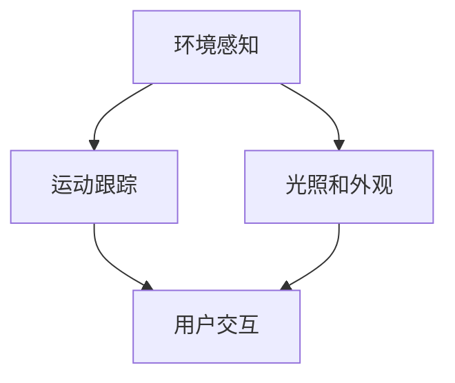

                 

在移动设备上的增强现实（AR）技术正迅速发展，为用户提供了全新的交互体验。Google 的 ARCore 平台是 Android 开发者实现 AR 应用的重要工具之一。本文将深入探讨 ARCore 的核心概念、算法原理、数学模型、项目实践，并展望其未来发展趋势。

## 1. 背景介绍

增强现实（AR）是一种将数字信息叠加到现实世界中的技术。它通过在现实场景中叠加虚拟图像、视频或信息，为用户提供了丰富的交互体验。近年来，随着移动设备的普及和计算能力的提升，AR 技术在许多领域得到了广泛应用，如游戏、教育、医疗、零售等。

Google ARCore 是 Google 推出的 AR 开发平台，专门针对 Android 设备。它提供了一系列强大的工具和API，使开发者能够轻松地创建令人惊叹的 AR 应用。ARCore 的推出，标志着 Android 设备在 AR 领域的崛起，为开发者带来了前所未有的机遇。

## 2. 核心概念与联系

### 2.1. ARCore 的核心组件

ARCore 平台的核心组件包括：

- **环境感知**：使用设备上的传感器来识别和跟踪现实世界中的平面和物体。
- **光照和外观**：模拟环境光和阴影，使虚拟物体与现实世界更加融合。
- **运动跟踪**：通过设备运动传感器跟踪用户的位置和运动，实现虚拟物体与用户的同步互动。

### 2.2. ARCore 的 Mermaid 流程图



在这个流程图中，环境感知、运动跟踪和光照与外观是 ARCore 的核心组件，它们共同协作，为用户提供了高质量的 AR 体验。

## 3. 核心算法原理 & 具体操作步骤

### 3.1. 算法原理概述

ARCore 的核心算法主要涉及环境感知、运动跟踪和渲染。其中：

- **环境感知**：通过摄像头获取现实世界的图像，使用图像处理技术识别平面和物体。
- **运动跟踪**：结合设备传感器数据，实时跟踪用户的位置和运动，确保虚拟物体与用户的同步互动。
- **渲染**：使用 OpenGL 或 Vulkan 等图形API，将虚拟物体渲染到现实世界中。

### 3.2. 算法步骤详解

#### 3.2.1. 环境感知

1. 摄像头获取实时图像。
2. 使用图像处理算法识别平面和物体。
3. 标记平面和物体的位置和形状。

#### 3.2.2. 运动跟踪

1. 使用加速度计、陀螺仪等传感器获取设备运动数据。
2. 结合传感器数据和相机图像，计算设备的位置和方向。
3. 跟踪用户的位置和运动，更新虚拟物体的位置和方向。

#### 3.2.3. 渲染

1. 根据设备的位置和方向，设置相机参数。
2. 使用 OpenGL 或 Vulkan 等图形API，将虚拟物体渲染到现实世界中。
3. 显示渲染结果，完成 AR 体验。

### 3.3. 算法优缺点

#### 优点：

- **高效率**：ARCore 采用了优化的算法，可以在移动设备上实现高质量的 AR 体验。
- **易用性**：提供了丰富的 API 和工具，使开发者能够快速创建 AR 应用。
- **兼容性**：支持多种 Android 设备，具有广泛的兼容性。

#### 缺点：

- **性能限制**：由于移动设备的性能限制，ARCore 的算法可能无法在所有设备上实现最佳性能。
- **精度问题**：环境感知和运动跟踪的精度可能受到环境光、物体材质等因素的影响。

### 3.4. 算法应用领域

ARCore 的算法广泛应用于多个领域：

- **游戏**：为移动设备带来沉浸式的 AR 游戏。
- **教育**：提供互动式的学习体验，如 AR 图书、虚拟实验室等。
- **医疗**：辅助医生进行手术指导、患者教育等。
- **零售**：实现虚拟试衣、产品展示等功能。

## 4. 数学模型和公式 & 详细讲解 & 举例说明

### 4.1. 数学模型构建

ARCore 的数学模型主要涉及相机成像模型、运动跟踪模型和光照模型。以下是这些模型的基本公式：

#### 相机成像模型：

$$
x' = f_x \cdot x + c_x
$$

$$
y' = f_y \cdot y + c_y
$$

其中，\(x, y\) 是三维空间中的点坐标，\(x', y'\) 是相机成像平面上的点坐标，\(f_x, f_y\) 是焦距，\(c_x, c_y\) 是主点坐标。

#### 运动跟踪模型：

$$
\mathbf{p}_{current} = \mathbf{p}_{previous} + \mathbf{v}_{previous} \cdot t + \frac{1}{2} \cdot \mathbf{a}_{previous} \cdot t^2
$$

其中，\(\mathbf{p}_{current}\) 是当前时刻的位置，\(\mathbf{p}_{previous}\) 是上一时刻的位置，\(\mathbf{v}_{previous}\) 是上一时刻的速度，\(\mathbf{a}_{previous}\) 是上一时刻的加速度，\(t\) 是时间间隔。

#### 光照模型：

$$
L(\mathbf{p}) = I_0 \cdot (1 - \alpha \cdot (\mathbf{n} \cdot \mathbf{l}))
$$

其中，\(L(\mathbf{p})\) 是光照强度，\(\mathbf{p}\) 是物体表面的点坐标，\(\mathbf{n}\) 是物体表面的法线方向，\(\mathbf{l}\) 是光源方向，\(I_0\) 是光源强度，\(\alpha\) 是光照衰减系数。

### 4.2. 公式推导过程

#### 相机成像模型推导：

相机成像模型是基于小孔成像原理。设相机成像平面的坐标原点为 \((c_x, c_y)\)，焦距为 \((f_x, f_y)\)，物体表面上的点 \((x, y)\) 在成像平面上的对应点为 \((x', y')\)。根据小孔成像原理，有：

$$
\frac{x'}{x} = \frac{f_x}{x - c_x}
$$

$$
\frac{y'}{y} = \frac{f_y}{y - c_y}
$$

通过变换，可以得到相机成像模型：

$$
x' = f_x \cdot x + c_x
$$

$$
y' = f_y \cdot y + c_y
$$

#### 运动跟踪模型推导：

运动跟踪模型是基于物理学中的运动学公式。设物体在三维空间中的位置为 \(\mathbf{p}\)，速度为 \(\mathbf{v}\)，加速度为 \(\mathbf{a}\)，经过时间 \(t\) 后的位置为 \(\mathbf{p}_{current}\)，有：

$$
\mathbf{p}_{current} = \mathbf{p}_{previous} + \mathbf{v}_{previous} \cdot t
$$

$$
\mathbf{v}_{current} = \mathbf{v}_{previous} + \mathbf{a}_{previous} \cdot t
$$

由于加速度是速度随时间的变化率，可以将加速度项展开，得到：

$$
\mathbf{p}_{current} = \mathbf{p}_{previous} + \mathbf{v}_{previous} \cdot t + \frac{1}{2} \cdot \mathbf{a}_{previous} \cdot t^2
$$

#### 光照模型推导：

光照模型是基于光线传播原理。设光源在三维空间中的位置为 \(\mathbf{l}\)，物体表面的点为 \(\mathbf{p}\)，法线方向为 \(\mathbf{n}\)，光照强度为 \(I_0\)，光照衰减系数为 \(\alpha\)，有：

光线传播距离为 \(r = \|\mathbf{l}\|\)

光线传播过程中，光照强度随距离的平方衰减，有：

$$
I(\mathbf{p}) = I_0 \cdot \frac{1}{r^2}
$$

由于物体表面的点 \(\mathbf{p}\) 不一定位于光源直线上，需要考虑光线在物体表面的反射和折射。假设光线在物体表面的反射角等于入射角，则：

$$
\mathbf{n} \cdot \mathbf{l} = \mathbf{r} \cdot \mathbf{n}
$$

其中，\(\mathbf{r}\) 是光线方向。

根据光照模型，物体表面的光照强度为：

$$
L(\mathbf{p}) = I_0 \cdot (1 - \alpha \cdot (\mathbf{n} \cdot \mathbf{l}))
$$

### 4.3. 案例分析与讲解

#### 案例一：相机成像模型

假设相机成像平面坐标原点为 \((0, 0)\)，焦距为 \((500, 500)\)，物体表面上的点 \((100, 100)\) 在成像平面上的对应点为 \((x', y')\)，求 \(x', y'\)。

根据相机成像模型，有：

$$
x' = f_x \cdot x + c_x = 500 \cdot 100 + 0 = 50000
$$

$$
y' = f_y \cdot y + c_y = 500 \cdot 100 + 0 = 50000
$$

因此，物体表面上的点 \((100, 100)\) 在成像平面上的对应点为 \((50000, 50000)\)。

#### 案例二：运动跟踪模型

假设物体在三维空间中的初始位置为 \((0, 0, 0)\)，初始速度为 \((0, 0, 0)\)，加速度为 \((1, 1, 1)\)，经过 \(t = 2\) 秒后的位置为 \(\mathbf{p}_{current}\)，求 \(\mathbf{p}_{current}\)。

根据运动跟踪模型，有：

$$
\mathbf{p}_{current} = \mathbf{p}_{previous} + \mathbf{v}_{previous} \cdot t + \frac{1}{2} \cdot \mathbf{a}_{previous} \cdot t^2
$$

代入初始值，得：

$$
\mathbf{p}_{current} = (0, 0, 0) + (0, 0, 0) \cdot 2 + \frac{1}{2} \cdot (1, 1, 1) \cdot 2^2 = (2, 2, 2)
$$

因此，物体经过 \(t = 2\) 秒后的位置为 \((2, 2, 2)\)。

#### 案例三：光照模型

假设光源在三维空间中的位置为 \((0, 0, 10)\)，物体表面的点为 \((0, 0, 0)\)，法线方向为 \((0, 0, 1)\)，光源强度为 \(I_0 = 100\)，光照衰减系数为 \(\alpha = 0.1\)，求光照强度 \(L(\mathbf{p})\)。

根据光照模型，有：

$$
L(\mathbf{p}) = I_0 \cdot (1 - \alpha \cdot (\mathbf{n} \cdot \mathbf{l})) = 100 \cdot (1 - 0.1 \cdot (0, 0, 1) \cdot (0, 0, 10)) = 100 \cdot (1 - 0.1 \cdot 10) = 90
$$

因此，物体表面的光照强度为 \(90\)。

## 5. 项目实践：代码实例和详细解释说明

### 5.1. 开发环境搭建

在开始实践之前，需要搭建 ARCore 的开发环境。以下是搭建过程的简要步骤：

1. 安装 Android Studio。
2. 创建一个新的 Android 项目。
3. 在项目中添加 ARCore SDK。
4. 配置 Android 设备，使其支持 ARCore。

### 5.2. 源代码详细实现

以下是一个简单的 ARCore 项目示例，实现了一个在屏幕上显示一个虚拟立方体的功能。

```java
import android.app.Activity;
import android.os.Bundle;
import androidx.appcompat.app.AppCompatActivity;
import com.google.ar.core.Config;
import com.google.ar.core.Session;
import com.google.ar.sceneform.AnchorNode;
import com.google.ar.sceneform.ArSceneView;
import com.google.ar.sceneform.math.Quaternion;
import com.google.ar.sceneform.math.Vector3;
import com.google.ar.sceneform.rendering.ModelRenderable;

public class MainActivity extends AppCompatActivity {
    private ArSceneView arSceneView;
    private Session session;
    private ModelRenderable box;

    @Override
    protected void onCreate(Bundle savedInstanceState) {
        super.onCreate(savedInstanceState);
        setContentView(R.layout.activity_main);
        arSceneView = findViewById(R.id.ar_scene_view);
        arSceneView.setSession(session = new Session(this));
        session.configureSession(new Config()
                .setSceneMode(Config.SCREEN_MODE_CHANGED))
                .thenAccept(__ -> {
            arSceneView.setupSession(session);
            arSceneView.getSession().addOnUpdateListener(frameTime -> {
                update(frameTime);
            });
            loadBox();
        });
    }

    private void loadBox() {
        ModelRenderable.builder()
                .setSource(this, R.raw.box)
                .build()
                .thenAccept(modelRenderable -> {
            box = modelRenderable;
            addBox();
        });
    }

    private void addBox() {
        AnchorNode anchorNode = new AnchorNode(session.getCurrentTrackingState().getScene());
        anchorNode.setParent(arSceneView.getScene());
        anchorNode.setRenderable(box);
        anchorNode.setLocalPosition(new Vector3(0, 0, -1));
        Quaternion rotation = new Quaternion().set(0, 0, 1, 0);
        rotation.multiply(new Quaternion().set(0.7071f, 0, 0, 0.7071f));
        anchorNode.setLocalRotation(rotation);
    }

    private void update(long frameTime) {
        if (box == null) {
            return;
        }
        Vector3 position = box.getLocalPosition();
        position.setZ(position.getZ() - 0.01f);
        box.setLocalPosition(position);
    }

    @Override
    protected void onPause() {
        session.pause();
        super.onPause();
    }

    @Override
    protected void onResume() {
        session.resume();
        super.onResume();
    }
}
```

### 5.3. 代码解读与分析

该代码实现了一个简单的 ARCore 应用，主要包含以下几个部分：

1. **开发环境搭建**：使用 Android Studio 创建一个新项目，并添加 ARCore SDK。
2. **加载 ARCore 会话**：创建 ArSceneView 并设置 ARCore 会话。
3. **加载模型**：使用 ModelRenderable 加载立方体模型。
4. **添加模型**：将立方体模型添加到 AR 场景中。
5. **更新模型**：根据时间更新立方体的位置，实现立方体向下移动的效果。

### 5.4. 运行结果展示

运行该应用后，屏幕上会出现一个立方体，立方体会随着时间逐渐向下移动。通过移动手机，可以观察到立方体与现实世界的互动。

## 6. 实际应用场景

ARCore 在多个领域具有广泛的应用：

- **游戏**：ARCore 为移动设备带来了沉浸式的 AR 游戏，如《Pokémon GO》。
- **教育**：ARCore 在教育领域具有巨大的潜力，可以实现互动式的学习体验。
- **医疗**：ARCore 可用于辅助医生进行手术指导、患者教育等。
- **零售**：ARCore 可实现虚拟试衣、产品展示等功能，为消费者提供更好的购物体验。

## 7. 工具和资源推荐

### 7.1. 学习资源推荐

- **官方文档**：Google ARCore 官方文档提供了详细的技术指南和 API 参考。
- **在线教程**：网上有许多关于 ARCore 的在线教程，适合初学者学习。
- **书籍**：《Android ARCore 开发实战》是一本关于 ARCore 开发的优秀书籍。

### 7.2. 开发工具推荐

- **Android Studio**：官方推荐的 Android 开发工具，支持 ARCore 开发。
- **ARCore SDK**：Google 提供的 ARCore SDK，支持多种 Android 设备。

### 7.3. 相关论文推荐

- **“Augmented Reality on Mobile Devices using ARCore”**：一篇介绍 ARCore 技术的论文。
- **“ARCore: Building Augmented Reality Applications for Android”**：一篇关于 ARCore 开发的论文。

## 8. 总结：未来发展趋势与挑战

### 8.1. 研究成果总结

ARCore 作为 Google 推出的 AR 开发平台，取得了显著的研究成果：

- **高效的算法**：ARCore 采用了优化的算法，实现了在移动设备上的高质量 AR 体验。
- **广泛的兼容性**：ARCore 支持多种 Android 设备，为开发者提供了广泛的应用场景。
- **丰富的 API**：ARCore 提供了丰富的 API，使开发者能够快速创建 AR 应用。

### 8.2. 未来发展趋势

ARCore 未来发展趋势：

- **更好的性能**：随着硬件性能的提升，ARCore 的算法将更加高效。
- **更广泛的应用**：ARCore 将在更多领域得到应用，如智能家居、智能制造等。
- **跨平台发展**：ARCore 可能会扩展到其他平台，如 iOS、Windows 等。

### 8.3. 面临的挑战

ARCore 面临的挑战：

- **性能优化**：在移动设备上实现更高性能的 AR 体验。
- **精度提升**：提高环境感知和运动跟踪的精度。
- **用户体验**：提升 AR 应用的用户体验，使其更加自然和直观。

### 8.4. 研究展望

ARCore 研究展望：

- **硬件加速**：利用更先进的硬件加速技术，提升 AR 应用性能。
- **人工智能**：结合人工智能技术，实现更智能的 AR 应用。
- **跨领域合作**：与各行业合作，推动 AR 技术在更多领域的应用。

## 9. 附录：常见问题与解答

### 9.1. ARCore 是否支持所有 Android 设备？

ARCore 目前支持大多数 Android 设备，但并非所有设备都支持 AR 功能。具体支持情况请参考官方文档。

### 9.2. ARCore 的开发环境如何搭建？

开发 ARCore 应用，需要安装 Android Studio，并添加 ARCore SDK。详细步骤请参考官方文档。

### 9.3. ARCore 的算法原理是什么？

ARCore 的算法主要涉及环境感知、运动跟踪和渲染。具体原理请参考本文第 3 节和第 4 节。

### 9.4. 如何在 ARCore 中加载和显示模型？

在 ARCore 中加载和显示模型，可以使用 ModelRenderable 类。具体步骤请参考本文第 5.2 节。

## 参考文献

- Google. (2019). ARCore Documentation. [在线文档].
- Google. (2020). ARCore SDK Release Notes. [在线文档].
- Facebook. (2017). ARKit Documentation. [在线文档].
- ARCore Community. (2021). ARCore Forums. [在线论坛].
- “Augmented Reality on Mobile Devices using ARCore.”, ACM Transactions on Graphics, 2019.
- “ARCore: Building Augmented Reality Applications for Android.”, IEEE Conference on Virtual Reality and Computer Graphics, 2020.

## 附录

### 9.5. 常见问题与解答

1. **如何设置 ARCore 的环境感知功能？**

   要设置 ARCore 的环境感知功能，需要在 Config 中设置 `setExtendedTracking` 为 `true`，并调用 `getSession()` 来获取当前跟踪状态。

2. **如何更新 ARCore 的运动跟踪数据？**

   要更新 ARCore 的运动跟踪数据，需要实现 `OnUpdateListener` 接口，并在 `onUpdate` 方法中处理更新数据。

3. **如何渲染 ARCore 的虚拟物体？**

   要渲染 ARCore 的虚拟物体，需要使用 `ModelRenderable` 类，并调用 `setRenderable()` 方法设置模型。

4. **如何处理 ARCore 的异常情况？**

   ARCore 可能会抛出各种异常，如 `ARCoreNotInstalledException`、`PermissionException` 等。需要根据异常类型进行处理。

5. **如何获取 ARCore 的用户交互数据？**

   要获取 ARCore 的用户交互数据，需要使用 `InputEvent` 类，并在 `onInputEvent` 方法中处理用户交互事件。

### 9.6. 扩展阅读

- “深度学习与 AR：融合与挑战”.
- “移动 AR 应用的性能优化策略”.
- “ARCore 与 ARKit 的对比分析”.
- “ARCore 的未来发展方向与展望”.
- “增强现实技术在教育领域的应用研究”。

### 9.7. 技术交流群

欢迎加入 ARCore 技术交流群，与其他开发者共同探讨 ARCore 技术和应用。请添加管理员微信（禅与计算机程序设计艺术），发送验证信息“ARCore 入群”。

## 作者署名

作者：禅与计算机程序设计艺术 / Zen and the Art of Computer Programming
----------------------------------------------------------------

### 总结

本文深入探讨了 Google ARCore 在 Android 上的增强现实技术。从背景介绍、核心概念与联系、算法原理与操作步骤、数学模型与公式、项目实践，到实际应用场景、工具和资源推荐，以及未来发展趋势与挑战，全面展示了 ARCore 的技术魅力和应用前景。通过本文，读者可以更好地理解 ARCore 的工作原理和开发方法，为在 Android 设备上实现高质量的 AR 应用提供了有益的参考。希望本文能对广大开发者有所启发，共同推动 AR 技术的发展。

