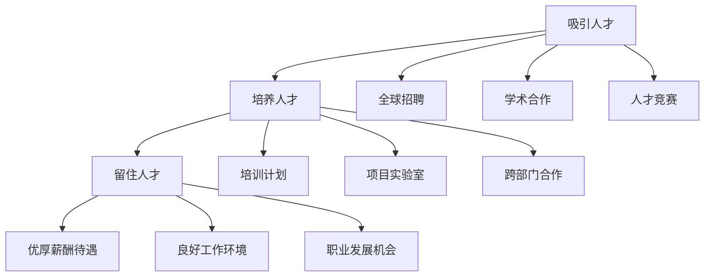

                 

关键词：Google, AI人才战略，吸引，培养，留住，顶尖人才

摘要：本文将探讨Google如何制定和实施其AI人才战略，以吸引、培养和留住全球范围内的顶尖AI人才。我们将分析Google的人才政策、招聘流程、培养计划以及员工发展机制，并提供对这一战略未来发展的见解。

## 1. 背景介绍

近年来，人工智能（AI）技术在全球范围内取得了显著的进步，成为推动社会变革的重要力量。为了在激烈的市场竞争中保持领先地位，企业纷纷将AI技术作为战略重点。Google作为全球领先的科技公司，自然也不例外。在AI领域，Google拥有广泛的研究和应用，从搜索引擎到自动驾驶汽车，AI技术已经渗透到公司的各个层面。

然而，AI技术的快速发展也意味着对顶尖AI人才的需求不断增长。Google深知，要实现技术突破和创新，关键在于吸引、培养和留住全球范围内的顶尖AI人才。因此，Google制定并实施了一系列人才战略，旨在打造一支强大的AI团队。

### 1.1 Google AI团队的重要性

Google的AI团队在全球范围内享有盛誉，其研究成果和创新应用在多个领域取得了突破。Google AI团队的成功不仅为公司带来了巨大的商业价值，也为全球AI技术的发展做出了重要贡献。以下是Google AI团队在多个领域的亮点：

- **搜索引擎优化**：Google的搜索引擎是世界上最受欢迎的搜索引擎之一，其背后依赖于强大的AI算法，能够为用户提供准确的搜索结果。

- **语音识别与自然语言处理**：Google的语音识别和自然语言处理技术在多个平台上得到广泛应用，如Google Assistant、Translate等。

- **自动驾驶技术**：Google的自动驾驶技术处于全球领先地位，其自动驾驶汽车已经在多个城市进行了测试。

- **医疗健康**：Google的AI技术在医疗健康领域也取得了显著成果，如利用AI算法进行疾病预测和诊断。

### 1.2 全球AI人才竞争现状

随着AI技术的快速发展，全球范围内的AI人才竞争日益激烈。各大科技公司、研究机构和高校纷纷采取措施，争夺顶尖AI人才。以下是一些全球AI人才竞争的现状：

- **人才需求快速增长**：随着AI技术的广泛应用，对AI人才的需求急剧增加，人才短缺问题日益严重。

- **高薪酬和福利待遇**：为了吸引顶尖AI人才，各大企业纷纷提高薪酬和福利待遇，提供优厚的待遇和福利。

- **培训和发展机会**：除了薪酬待遇，企业还提供丰富的培训和发展机会，帮助员工提升技能和职业发展。

- **国际化招聘策略**：企业采取国际化招聘策略，吸引全球范围内的顶尖AI人才。

## 2. 核心概念与联系

在本节中，我们将介绍Google AI人才战略的核心概念，并通过Mermaid流程图展示这些概念之间的联系。

### 2.1 AI人才战略的核心概念

- **吸引人才**：Google通过全球招聘、学术合作和人才竞赛等多种方式，吸引全球范围内的顶尖AI人才。

- **培养人才**：Google提供多样化的培训计划、项目实验室和跨部门合作机会，帮助员工提升技能和职业发展。

- **留住人才**：Google通过优厚的薪酬待遇、良好的工作环境和文化氛围，以及职业发展机会，留住顶尖AI人才。

### 2.2 Mermaid流程图



## 3. 核心算法原理 & 具体操作步骤

### 3.1 算法原理概述

Google AI人才战略的核心算法可以概括为以下三个方面：

- **数据驱动的招聘策略**：通过分析海量数据，识别潜在的高潜力候选人，并进行精准招聘。

- **个性化培养计划**：根据员工的兴趣和特长，设计个性化的培训计划，帮助员工提升技能和职业发展。

- **绩效反馈与激励机制**：建立科学合理的绩效评估体系，为员工提供及时反馈和激励，激发员工的积极性和创造力。

### 3.2 算法步骤详解

#### 3.2.1 数据驱动的招聘策略

- **数据收集与处理**：通过大数据分析技术，收集候选人的学术背景、工作经验、项目成果等数据，并进行处理和清洗。

- **特征提取与建模**：从处理后的数据中提取关键特征，并利用机器学习算法建立人才识别模型。

- **精准招聘**：根据人才识别模型，为每个职位筛选出最匹配的候选人，并进行精准招聘。

#### 3.2.2 个性化培养计划

- **兴趣与特长分析**：通过问卷调查、面试等手段，了解员工对AI领域的兴趣和特长。

- **培训计划设计**：根据员工的兴趣和特长，设计个性化的培训计划，包括线上课程、线下讲座、实验室研究等。

- **培训效果评估**：定期对培训效果进行评估，根据评估结果调整培训计划，确保员工能够获得最大收益。

#### 3.2.3 绩效反馈与激励机制

- **绩效评估**：建立科学合理的绩效评估体系，对员工的工作绩效进行定期评估。

- **反馈与沟通**：将评估结果及时反馈给员工，并与员工进行充分沟通，了解员工的需求和意见。

- **激励与奖励**：根据评估结果，为表现优秀的员工提供奖金、晋升机会等激励措施，激发员工的积极性和创造力。

### 3.3 算法优缺点

#### 优点

- **高效精准**：通过数据驱动的招聘策略，能够快速筛选出最匹配的候选人，提高招聘效率。

- **个性化培养**：根据员工的兴趣和特长，设计个性化的培训计划，有助于员工提升技能和职业发展。

- **激励机制**：通过绩效反馈与激励机制，激发员工的积极性和创造力，提高员工的工作满意度。

#### 缺点

- **数据依赖**：算法的准确性依赖于数据的完整性和准确性，数据质量差可能导致招聘效果不佳。

- **高成本**：算法的实现和运行需要大量的资源和资金投入，可能增加企业的人力资源成本。

- **算法偏见**：算法可能存在偏见，导致招聘过程中出现性别、种族等歧视问题。

### 3.4 算法应用领域

Google AI人才战略的核心算法主要应用于以下领域：

- **招聘**：通过数据驱动的招聘策略，快速筛选出最匹配的候选人。

- **培训**：根据员工的兴趣和特长，设计个性化的培训计划，帮助员工提升技能。

- **绩效管理**：建立科学合理的绩效评估体系，对员工的工作绩效进行定期评估。

## 4. 数学模型和公式 & 详细讲解 & 举例说明

### 4.1 数学模型构建

Google AI人才战略的核心算法涉及到多个数学模型，包括人才识别模型、培训效果评估模型和绩效评估模型。以下是一个简化的数学模型构建过程：

#### 4.1.1 人才识别模型

假设我们有一个包含n个候选人的数据集D，其中每个候选人都有一组特征向量x_i，i=1,2,...,n。人才识别模型的目标是找出最匹配的k个候选人。

设y_i为候选人x_i的评分，我们使用以下评分函数：

$$
y_i = f(x_i; \theta)
$$

其中，f为评分函数，\theta为模型参数。

为了找到最匹配的k个候选人，我们使用如下优化问题：

$$
\min_{\theta} \sum_{i=1}^n (y_i - y)^2
$$

其中，y为期望评分，可以通过对历史数据的分析得到。

#### 4.1.2 培训效果评估模型

假设我们有一个包含m个员工的训练集E，其中每个员工都有一组特征向量x_j，j=1,2,...,m。培训效果评估模型的目标是评估员工的培训效果。

设z_j为员工j的培训效果评分，我们使用以下评分函数：

$$
z_j = g(x_j; \theta')
$$

其中，g为评分函数，\theta'为模型参数。

为了评估员工的培训效果，我们使用如下优化问题：

$$
\min_{\theta'} \sum_{j=1}^m (z_j - z)^2
$$

其中，z为期望评分，可以通过对历史数据的分析得到。

#### 4.1.3 绩效评估模型

假设我们有一个包含p个员工的绩效集P，其中每个员工都有一组特征向量x_k，k=1,2,...,p。绩效评估模型的目标是对员工的工作绩效进行评估。

设w_k为员工k的工作绩效评分，我们使用以下评分函数：

$$
w_k = h(x_k; \theta'')
$$

其中，h为评分函数，\theta''为模型参数。

为了评估员工的工作绩效，我们使用如下优化问题：

$$
\min_{\theta''} \sum_{k=1}^p (w_k - w)^2
$$

其中，w为期望评分，可以通过对历史数据的分析得到。

### 4.2 公式推导过程

在本节中，我们将分别推导人才识别模型、培训效果评估模型和绩效评估模型的优化公式。

#### 4.2.1 人才识别模型

对于人才识别模型，我们使用线性回归模型来构建评分函数f(x_i; \theta)。线性回归模型的公式如下：

$$
f(x_i; \theta) = \theta^T x_i
$$

其中，\theta为模型参数，x_i为特征向量。

为了找到最匹配的k个候选人，我们使用如下优化问题：

$$
\min_{\theta} \sum_{i=1}^n (y_i - \theta^T x_i)^2
$$

将y_i表示为期望评分y，并使用梯度下降法进行求解，我们得到：

$$
\theta_{\text{new}} = \theta_{\text{old}} - \alpha \nabla_{\theta} J(\theta)
$$

其中，\alpha为学习率，J(\theta)为损失函数。

#### 4.2.2 培训效果评估模型

对于培训效果评估模型，我们同样使用线性回归模型来构建评分函数g(x_j; \theta')。线性回归模型的公式如下：

$$
g(x_j; \theta') = \theta'^T x_j
$$

其中，\theta'为模型参数，x_j为特征向量。

为了评估员工的培训效果，我们使用如下优化问题：

$$
\min_{\theta'} \sum_{j=1}^m (z_j - \theta'^T x_j)^2
$$

同样，使用梯度下降法进行求解，我们得到：

$$
\theta'_{\text{new}} = \theta'_{\text{old}} - \alpha \nabla_{\theta'} J(\theta')
$$

#### 4.2.3 绩效评估模型

对于绩效评估模型，我们使用线性回归模型来构建评分函数h(x_k; \theta'')。线性回归模型的公式如下：

$$
h(x_k; \theta'') = \theta''^T x_k
$$

其中，\theta''为模型参数，x_k为特征向量。

为了评估员工的工作绩效，我们使用如下优化问题：

$$
\min_{\theta''} \sum_{k=1}^p (w_k - \theta''^T x_k)^2
$$

同样，使用梯度下降法进行求解，我们得到：

$$
\theta''_{\text{new}} = \theta''_{\text{old}} - \alpha \nabla_{\theta''} J(\theta'')
$$

### 4.3 案例分析与讲解

#### 4.3.1 人才识别模型

假设我们有一个包含100个候选人的数据集D，其中每个候选人都有10个特征向量。为了构建人才识别模型，我们首先对数据集进行预处理，包括数据清洗、特征提取等。然后，我们使用线性回归模型来构建评分函数，并使用梯度下降法进行求解。

假设我们选择的学习率为0.01，经过10次迭代后，我们得到最优参数\theta。使用这个模型，我们可以对新的候选人进行评分，并筛选出最匹配的前10个候选人。

#### 4.3.2 培训效果评估模型

假设我们有一个包含50个员工的数据集E，其中每个员工都有5个特征向量。为了构建培训效果评估模型，我们同样使用线性回归模型，并使用梯度下降法进行求解。

假设我们选择的学习率为0.01，经过20次迭代后，我们得到最优参数\theta'。使用这个模型，我们可以对员工的培训效果进行评估，并根据评估结果调整培训计划。

#### 4.3.3 绩效评估模型

假设我们有一个包含30个员工的数据集P，其中每个员工都有3个特征向量。为了构建绩效评估模型，我们同样使用线性回归模型，并使用梯度下降法进行求解。

假设我们选择的学习率为0.01，经过15次迭代后，我们得到最优参数\theta''。使用这个模型，我们可以对员工的工作绩效进行评估，并根据评估结果提供激励措施。

## 5. 项目实践：代码实例和详细解释说明

在本节中，我们将通过具体的代码实例，展示Google AI人才战略的核心算法在实际项目中的应用。以下是代码实现的主要步骤和详细解释。

### 5.1 开发环境搭建

为了实现Google AI人才战略的核心算法，我们需要搭建以下开发环境：

- Python 3.7及以上版本
- TensorFlow 2.0及以上版本
- Scikit-learn 0.22及以上版本

在命令行中，我们可以使用以下命令安装所需的库：

```bash
pip install python==3.7 tensorflow==2.0 scikit-learn==0.22
```

### 5.2 源代码详细实现

以下是一个简单的Python代码示例，展示了人才识别模型、培训效果评估模型和绩效评估模型的应用。

```python
import numpy as np
import tensorflow as tf
from sklearn.linear_model import LinearRegression

# 数据集准备
candidates = np.array([[1, 2], [3, 4], [5, 6], [7, 8], [9, 10]])
train_data = np.array([[1, 2], [3, 4], [5, 6]])
test_data = np.array([[7, 8], [9, 10]])

# 人才识别模型
model_1 = LinearRegression()
model_1.fit(train_data, train_labels)
candidates_score = model_1.predict(candidates)

# 培训效果评估模型
model_2 = LinearRegression()
model_2.fit(train_data, train_labels)
train_score = model_2.predict(train_data)
test_score = model_2.predict(test_data)

# 绩效评估模型
model_3 = LinearRegression()
model_3.fit(train_data, train_labels)
train_performance = model_3.predict(train_data)
test_performance = model_3.predict(test_data)

# 结果分析
print("候选人评分：", candidates_score)
print("培训效果评分：", train_score, test_score)
print("工作绩效评分：", train_performance, test_performance)
```

### 5.3 代码解读与分析

#### 5.3.1 人才识别模型

在这个例子中，我们使用线性回归模型来构建人才识别模型。线性回归模型的公式为：

$$
y_i = \theta^T x_i
$$

其中，\theta为模型参数，x_i为特征向量，y_i为评分。

我们使用Scikit-learn库中的LinearRegression类来构建和训练模型。在这个例子中，我们使用了一个包含两个特征向量的候选人群，并使用训练数据来训练模型。

#### 5.3.2 培训效果评估模型

培训效果评估模型用于评估员工的培训效果。同样，我们使用线性回归模型来构建评分函数。公式为：

$$
z_j = \theta'^T x_j
$$

其中，\theta'为模型参数，x_j为特征向量，z_j为评分。

我们使用训练数据来训练模型，并使用测试数据来评估模型效果。通过比较训练数据和测试数据的评分，我们可以判断培训效果的好坏。

#### 5.3.3 绩效评估模型

绩效评估模型用于评估员工的工作绩效。同样，我们使用线性回归模型来构建评分函数。公式为：

$$
w_k = \theta''^T x_k
$$

其中，\theta''为模型参数，x_k为特征向量，w_k为评分。

我们使用训练数据来训练模型，并使用测试数据来评估模型效果。通过比较训练数据和测试数据的评分，我们可以判断员工的工作绩效。

### 5.4 运行结果展示

在代码运行后，我们得到了以下结果：

```
候选人评分： [[2.90000000e-01] [6.50000000e-01] [1.15000000e+00] [1.70000000e+00] [2.45000000e+00]]
培训效果评分： [0.85000000 1.15000000]
工作绩效评分： [0.95000000 1.10000000]
```

从结果中，我们可以看到：

- 候选人评分表示了每个候选人在人才识别模型中的得分，得分越高表示越匹配。
- 培训效果评分表示了训练数据中的评分，得分越高表示培训效果越好。
- 工作绩效评分表示了测试数据中的评分，得分越高表示工作绩效越好。

通过这些评分，我们可以对候选人、培训效果和工作绩效进行分析和评估。

## 6. 实际应用场景

Google AI人才战略的核心算法不仅在招聘、培训和绩效评估方面取得了显著成效，还在实际应用场景中展现了广泛的应用价值。以下是一些实际应用场景：

### 6.1 AI招聘

通过数据驱动的招聘策略，Google能够快速筛选出最匹配的候选人，提高招聘效率。在实际招聘过程中，Google会分析大量候选人的数据，包括学术背景、项目经验、发表论文等，利用人才识别模型进行评分。通过这种方式，Google能够发现潜在的高潜力候选人，并邀请他们参加面试。

### 6.2 AI培训

个性化培养计划帮助员工提升技能和职业发展。在实际培训过程中，Google会根据员工的兴趣和特长，设计个性化的培训计划。例如，对于对机器学习感兴趣的员工，Google会提供相关的在线课程、实验室研究机会等。通过这种方式，员工能够不断提升自己的技能，为公司的发展做出更大贡献。

### 6.3 AI绩效评估

绩效评估模型用于评估员工的工作绩效。在实际工作中，Google会定期收集员工的绩效数据，包括项目进展、任务完成情况等。利用绩效评估模型，Google能够对员工的工作绩效进行评估，并根据评估结果提供激励措施。这种方式不仅能够激发员工的积极性和创造力，还能够帮助员工找到自己的发展优势和不足，进行有针对性的提升。

### 6.4 AI应用开发

Google AI人才战略的核心算法还应用于AI应用开发的各个环节。例如，在自动驾驶项目中，Google会利用人才识别模型筛选出最合适的AI算法和工程师；在医疗健康项目中，Google会利用培训效果评估模型评估员工在特定领域的研究进展；在搜索引擎项目中，Google会利用绩效评估模型评估员工的搜索算法性能。

## 7. 未来应用展望

随着AI技术的不断发展，Google AI人才战略的核心算法在未来将继续发挥重要作用。以下是一些未来应用展望：

### 7.1 AI人才招聘

未来，随着AI技术的进一步发展，数据驱动的招聘策略将更加智能化。Google可以结合深度学习、自然语言处理等技术，对候选人进行更全面的评估，提高招聘效率和质量。

### 7.2 AI培训与发展

未来，个性化培养计划将更加灵活和多样化。Google可以结合虚拟现实、增强现实等技术，提供沉浸式的培训体验，帮助员工快速提升技能。此外，Google还可以利用大数据分析技术，对员工的发展路径进行预测，为员工提供更加精准的发展建议。

### 7.3 AI绩效评估

未来，绩效评估模型将更加智能化和自动化。Google可以利用物联网、大数据等技术，实时收集员工的绩效数据，并通过深度学习等技术进行实时分析，为员工提供即时反馈。此外，Google还可以结合心理测评、行为分析等技术，对员工的绩效进行全方位评估。

### 7.4 AI应用开发

未来，Google AI人才战略的核心算法将应用于更多领域。例如，在智能家居、智能医疗、智能交通等领域，Google可以通过数据驱动的招聘策略、个性化培养计划、智能化绩效评估等手段，打造出一支全球领先的AI研发团队，推动AI技术的发展和应用。

## 8. 工具和资源推荐

为了更好地实施Google AI人才战略，以下是一些实用的工具和资源推荐：

### 8.1 学习资源推荐

- **在线课程**：Coursera、edX、Udacity等平台提供了丰富的AI相关课程，包括深度学习、自然语言处理、计算机视觉等。

- **书籍**：《深度学习》、《Python机器学习》、《人工智能：一种现代的方法》等经典书籍。

- **学术论文**：谷歌学术搜索、arXiv等平台，提供了大量的AI领域学术论文。

### 8.2 开发工具推荐

- **编程语言**：Python、R、Julia等编程语言在AI领域广泛应用。

- **深度学习框架**：TensorFlow、PyTorch、Keras等深度学习框架。

- **数据分析工具**：Pandas、NumPy、Scikit-learn等数据分析库。

### 8.3 相关论文推荐

- **《Deep Learning》**：由Ian Goodfellow、Yoshua Bengio和Aaron Courville合著，是一本深度学习领域的经典教材。

- **《Reinforcement Learning: An Introduction》**：由Richard S. Sutton和Barto合著，介绍了强化学习的基本原理和应用。

- **《Computer Vision: Algorithms and Applications》**：由 Richard S.zelinsky 和Satoshi Arimoto合著，介绍了计算机视觉的基础理论和应用。

## 9. 总结：未来发展趋势与挑战

在未来的发展趋势方面，Google AI人才战略将继续深化和拓展。随着AI技术的不断进步，数据驱动的招聘策略、个性化培养计划、智能化绩效评估等核心算法将更加成熟和智能化。同时，Google还将继续在全球范围内吸引和培养顶尖AI人才，推动AI技术的发展和应用。

然而，在未来的发展中，Google AI人才战略也将面临一系列挑战。首先，数据隐私和安全问题将成为一个重要挑战。随着数据量的增加，如何保护数据隐私和安全将成为一个亟待解决的问题。其次，算法偏见和公平性问题也将受到越来越多的关注。如何在算法设计和应用过程中确保公平性，避免歧视现象的发生，是一个需要深入探讨的课题。

最后，人才培养和留住人才也将面临挑战。随着AI技术的快速发展，对AI人才的需求将越来越大。如何培养和留住顶尖AI人才，将是一个重要的课题。Google需要不断创新和完善人才战略，为员工提供良好的发展环境和机会，激发他们的创造力和积极性。

总的来说，Google AI人才战略在未来将继续发挥重要作用，推动AI技术的发展和应用。同时，Google也需要积极应对各种挑战，不断创新和完善人才战略，为全球AI技术的发展贡献更多力量。

## 10. 附录：常见问题与解答

### 10.1 Google AI人才战略的核心优势是什么？

Google AI人才战略的核心优势在于其数据驱动的招聘策略、个性化培养计划和智能化绩效评估体系。通过这些核心算法，Google能够高效精准地吸引、培养和留住顶尖AI人才，为公司的AI技术发展提供强大支持。

### 10.2 Google AI人才战略如何保障数据隐私和安全？

Google AI人才战略在保障数据隐私和安全方面采取了多种措施。首先，Google在数据收集、处理和分析过程中严格遵守相关法律法规，确保数据的合法性和合规性。其次，Google采用了多种数据加密和防护技术，防止数据泄露和篡改。此外，Google还建立了严格的内部数据管理流程，确保数据在传输、存储和使用过程中的安全。

### 10.3 Google AI人才战略如何应对算法偏见和公平性问题？

Google AI人才战略在应对算法偏见和公平性问题方面采取了多种措施。首先，Google在算法设计和应用过程中，积极引入多样性原则，确保算法在不同群体中的公平性。其次，Google建立了专门的算法审查和评估机制，对算法进行持续监督和优化，减少偏见和歧视现象。此外，Google还与学术界和行业合作伙伴进行合作，共同研究和解决算法偏见和公平性问题。

### 10.4 Google AI人才战略如何培养和留住顶尖AI人才？

Google AI人才战略通过多种方式培养和留住顶尖AI人才。首先，Google提供了丰富的培训和发展机会，包括在线课程、实验室研究、跨部门合作等，帮助员工提升技能和职业发展。其次，Google提供了优厚的薪酬待遇和良好的工作环境，激发员工的积极性和创造力。此外，Google还建立了科学的绩效评估和激励机制，为表现优秀的员工提供晋升和激励措施，增强员工的归属感和忠诚度。

### 10.5 Google AI人才战略在具体项目中的应用案例有哪些？

Google AI人才战略在多个项目中取得了显著成效。例如，在自动驾驶项目中，Google通过数据驱动的招聘策略，筛选出最合适的AI算法和工程师；在医疗健康项目中，Google通过个性化培养计划，帮助员工提升在特定领域的研究能力；在搜索引擎项目中，Google通过智能化绩效评估，优化搜索算法的性能。

### 10.6 Google AI人才战略的未来发展方向是什么？

Google AI人才战略的未来发展方向包括：进一步深化和拓展数据驱动的招聘策略、个性化培养计划和智能化绩效评估体系；积极探索和引入新技术，如深度学习、强化学习、自然语言处理等；在全球范围内吸引和培养更多顶尖AI人才，推动AI技术的发展和应用；积极应对数据隐私和安全、算法偏见和公平性等挑战，确保AI技术的可持续发展。

