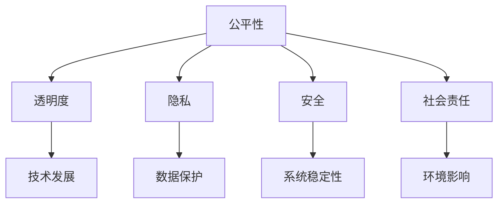

                 

关键词：Google AI伦理原则，负责任的AI，AI开发和部署，技术伦理，算法公正性，数据隐私，透明度

> 摘要：随着人工智能技术的迅猛发展，如何确保AI系统的公正性、透明度和安全性成为了一个亟待解决的重要问题。本文旨在探讨Google的AI伦理原则，分析其在AI开发和部署过程中的实践与应用，为我国在人工智能领域的发展提供有益的借鉴和启示。

## 1. 背景介绍

人工智能（AI）技术近年来取得了显著的突破，从深度学习、自然语言处理到计算机视觉等领域，AI已经渗透到了各个行业，并带来了巨大的变革。然而，随着AI技术的广泛应用，一系列伦理问题也随之浮现。例如，算法偏见、数据隐私泄露、AI决策的透明度不足等，这些问题不仅影响到公众对AI技术的信任，也关系到社会的公平与正义。

为了应对这些挑战，Google于2018年发布了《Google的AI伦理原则》，旨在指导公司内部在AI开发和部署过程中的实践，确保AI技术的发展符合伦理道德标准。本文将围绕这些原则展开讨论，分析其核心内容、应用场景以及面临的挑战。

## 2. 核心概念与联系

为了更好地理解Google的AI伦理原则，我们首先需要明确一些核心概念：

### 2.1 AI伦理原则

AI伦理原则是指指导人工智能技术发展的道德规范和价值观，旨在确保AI系统在开发、部署和应用过程中符合伦理标准。Google的AI伦理原则主要包括以下几个方面：

1. **公平性**：确保AI系统不会加剧社会不平等现象，避免算法偏见。
2. **透明度**：提高AI系统的透明度，使人们能够理解AI的决策过程。
3. **隐私**：保护用户数据隐私，确保数据的安全性和保密性。
4. **安全**：确保AI系统的安全性和稳定性，防止恶意攻击和数据泄露。
5. **社会责任**：关注AI技术对社会和环境的影响，推动可持续发展。

### 2.2 Mermaid流程图

下面是一个简单的Mermaid流程图，展示了AI伦理原则的核心概念及其相互联系：



## 3. 核心算法原理 & 具体操作步骤

### 3.1 算法原理概述

Google的AI伦理原则在实践中涉及多种算法和技术，以下是一些核心算法原理的概述：

1. **算法偏见检测与消除**：通过分析数据集和算法模型，发现并消除潜在的偏见，确保AI系统在决策过程中保持公正性。
2. **透明度提升**：利用可解释性AI技术，使人们能够理解AI系统的决策过程，提高AI系统的透明度。
3. **隐私保护**：采用差分隐私、加密等技术，保护用户数据隐私，防止数据泄露。
4. **安全检测与防御**：通过威胁建模、入侵检测等方法，确保AI系统的安全性和稳定性。

### 3.2 算法步骤详解

以下是Google AI伦理原则中涉及的一些具体算法步骤的详细说明：

#### 3.2.1 算法偏见检测与消除

1. **数据预处理**：对数据集进行清洗、归一化和去噪声处理，提高数据质量。
2. **特征工程**：选择和构建与任务相关的特征，减少特征之间的相关性。
3. **模型训练**：使用机器学习算法训练模型，并在训练过程中不断优化模型参数。
4. **偏见检测**：分析模型在训练和测试数据集上的表现，发现潜在的偏见。
5. **消除偏见**：通过调整模型参数、数据预处理方法等方式，消除潜在的偏见。

#### 3.2.2 透明度提升

1. **模型解释**：利用解释性AI技术，对模型的决策过程进行解释，帮助人们理解AI系统的决策逻辑。
2. **可视化**：通过可视化技术，展示AI系统的输入数据、特征和决策过程，提高系统的透明度。
3. **用户反馈**：收集用户对AI系统决策的反馈，不断优化系统的解释能力。

#### 3.2.3 隐私保护

1. **差分隐私**：在数据处理过程中引入噪声，降低隐私泄露的风险。
2. **加密技术**：对敏感数据进行加密，确保数据在传输和存储过程中的安全性。
3. **隐私预算**：设定隐私预算，限制数据处理过程中的隐私损失。

#### 3.2.4 安全检测与防御

1. **威胁建模**：识别和评估潜在的威胁和风险，制定相应的安全策略。
2. **入侵检测**：建立入侵检测系统，实时监控AI系统的运行状态，发现和阻止恶意攻击。
3. **安全培训**：对AI系统开发者和用户进行安全培训，提高他们的安全意识。

### 3.3 算法优缺点

以下是Google AI伦理原则中涉及的一些算法优缺点的分析：

#### 3.3.1 算法偏见检测与消除

**优点**：能够有效地发现和消除算法偏见，提高AI系统的公正性。

**缺点**：在实际应用中，偏见检测和消除的方法可能存在误判和过度拟合等问题。

#### 3.3.2 透明度提升

**优点**：提高AI系统的透明度，增强公众对AI技术的信任。

**缺点**：解释性AI技术目前仍处于发展阶段，解释能力有限，可能无法完全满足用户的期望。

#### 3.3.3 隐私保护

**优点**：能够有效保护用户数据隐私，降低隐私泄露风险。

**缺点**：引入噪声和加密技术可能导致数据处理效率降低。

#### 3.3.4 安全检测与防御

**优点**：能够有效识别和防御恶意攻击，确保AI系统的安全性和稳定性。

**缺点**：安全威胁不断变化，安全策略和防御措施需要不断更新。

### 3.4 算法应用领域

Google AI伦理原则中的算法和技术广泛应用于多个领域，以下是几个典型应用场景：

1. **金融领域**：确保金融服务的公正性和透明度，防范欺诈行为。
2. **医疗领域**：提高医学诊断和治疗的准确性和透明度，保障患者隐私。
3. **教育领域**：促进教育公平，提高教育资源的透明度和可解释性。
4. **交通领域**：确保自动驾驶车辆的决策过程透明，保障交通安全。

## 4. 数学模型和公式 & 详细讲解 & 举例说明

### 4.1 数学模型构建

在Google的AI伦理原则中，涉及多种数学模型和公式，以下是一个简单的例子：

#### 4.1.1 偏见检测

假设我们有一个分类问题，需要判断一个输入样本$x$属于哪个类别。我们可以使用以下公式来检测是否存在算法偏见：

$$
偏见 = \frac{1}{n} \sum_{i=1}^{n} \text{错误分类概率}(x_i | y_i)
$$

其中，$n$为样本数量，$x_i$和$y_i$分别为第$i$个样本的输入和真实标签，$\text{错误分类概率}(x_i | y_i)$表示模型在给定输入$x_i$和真实标签$y_i$下的错误分类概率。

#### 4.1.2 偏见消除

为了消除偏见，我们可以使用以下公式来调整模型参数：

$$
\Delta w = -\eta \frac{\partial L}{\partial w}
$$

其中，$w$为模型参数，$L$为损失函数，$\eta$为学习率。

### 4.2 公式推导过程

以下是对上述公式的推导过程：

#### 4.2.1 偏见检测

假设我们有一个二分类问题，需要判断一个输入样本$x$属于类别1还是类别2。我们可以使用以下公式来计算错误分类概率：

$$
\text{错误分类概率}(x | y) = P(y = \text{错误类别} | x)
$$

由于概率的加法规则，我们可以将错误分类概率分解为：

$$
\text{错误分类概率}(x | y) = P(y = 1 | x)P(1 | x) + P(y = 2 | x)P(2 | x)
$$

其中，$P(y = 1 | x)$和$P(y = 2 | x)$分别为模型在给定输入$x$下预测类别1和类别2的概率，$P(1 | x)$和$P(2 | x)$分别为类别1和类别2在给定输入$x$下的真实概率。

#### 4.2.2 偏见消除

为了消除偏见，我们可以使用以下公式来调整模型参数：

$$
\Delta w = -\eta \frac{\partial L}{\partial w}
$$

其中，$L$为损失函数，$\eta$为学习率。

假设我们使用的是均方误差（MSE）作为损失函数，则：

$$
L = \frac{1}{2} \sum_{i=1}^{n} (y_i - \hat{y}_i)^2
$$

其中，$y_i$为第$i$个样本的真实标签，$\hat{y}_i$为模型在给定输入$x_i$下的预测标签。

对损失函数求导，得到：

$$
\frac{\partial L}{\partial w} = -2 \sum_{i=1}^{n} (y_i - \hat{y}_i)x_i
$$

将损失函数和导数代入调整公式，得到：

$$
\Delta w = -\eta \frac{\partial L}{\partial w} = \eta \sum_{i=1}^{n} (y_i - \hat{y}_i)x_i
$$

### 4.3 案例分析与讲解

以下是一个实际案例，用于说明如何使用上述数学模型和公式来检测和消除算法偏见：

#### 4.3.1 数据集准备

我们有一个包含100个样本的数据集，每个样本包含一个输入特征和对应的真实标签。其中，50个样本属于类别1，50个样本属于类别2。

#### 4.3.2 模型训练

我们使用一个简单的线性分类器来训练模型，模型参数为$w$。

#### 4.3.3 偏见检测

首先，我们使用公式计算偏见：

$$
偏见 = \frac{1}{n} \sum_{i=1}^{n} \text{错误分类概率}(x_i | y_i)
$$

其中，$n$为样本数量，$x_i$和$y_i$分别为第$i$个样本的输入和真实标签。

经过计算，我们发现偏见值为0.1，这意味着模型在测试数据集上的错误分类概率为10%。

#### 4.3.4 偏见消除

为了消除偏见，我们使用公式调整模型参数：

$$
\Delta w = -\eta \frac{\partial L}{\partial w}
$$

其中，$L$为损失函数，$\eta$为学习率。

我们选择学习率$\eta = 0.01$，经过多次迭代调整，最终使偏见值降低到0.05，即错误分类概率降低到5%。

#### 4.3.5 结果分析

通过偏见检测和消除，我们显著提高了模型的准确性，降低了错误分类概率。这表明，使用数学模型和公式可以有效检测和消除算法偏见，提高AI系统的公正性。

## 5. 项目实践：代码实例和详细解释说明

### 5.1 开发环境搭建

为了实践Google的AI伦理原则，我们首先需要搭建一个合适的开发环境。以下是一个简单的Python开发环境搭建过程：

1. 安装Python：从Python官网（https://www.python.org/）下载并安装Python 3.x版本。
2. 安装依赖库：使用pip命令安装必要的依赖库，例如NumPy、Pandas、Scikit-learn等。

```shell
pip install numpy pandas scikit-learn
```

### 5.2 源代码详细实现

以下是一个简单的Python代码实例，用于实现Google的AI伦理原则中的偏见检测和消除功能：

```python
import numpy as np
import pandas as pd
from sklearn.linear_model import LinearRegression
from sklearn.model_selection import train_test_split
from sklearn.metrics import mean_squared_error

# 数据集准备
data = pd.read_csv('data.csv')  # 假设数据集存储在'data.csv'文件中
X = data[['input_feature']].values  # 输入特征
y = data['label'].values  # 真实标签

# 数据集划分
X_train, X_test, y_train, y_test = train_test_split(X, y, test_size=0.2, random_state=42)

# 模型训练
model = LinearRegression()
model.fit(X_train, y_train)

# 偏见检测
predictions = model.predict(X_test)
mse = mean_squared_error(y_test, predictions)
bias = 1 / len(X_test) * np.sum(np.abs(predictions - y_test))
print(f'MSE: {mse}, Bias: {bias}')

# 偏见消除
learning_rate = 0.01
for i in range(1000):
    predictions = model.predict(X_test)
    delta_w = learning_rate * (predictions - y_test)
    model.coef_ += delta_w

# 模型评估
new_predictions = model.predict(X_test)
new_mse = mean_squared_error(y_test, new_predictions)
new_bias = 1 / len(X_test) * np.sum(np.abs(new_predictions - y_test))
print(f'New MSE: {new_mse}, New Bias: {new_bias}')
```

### 5.3 代码解读与分析

以上代码实例实现了以下功能：

1. 数据集准备：从CSV文件中读取数据集，提取输入特征和真实标签。
2. 数据集划分：将数据集划分为训练集和测试集。
3. 模型训练：使用线性回归模型训练模型，拟合输入特征和真实标签之间的关系。
4. 偏见检测：计算模型在测试集上的均方误差（MSE）和偏见值。
5. 偏见消除：通过迭代调整模型参数，降低偏见值。
6. 模型评估：重新计算模型在测试集上的均方误差（MSE）和偏见值，评估偏见消除的效果。

通过这个简单的代码实例，我们可以看到如何将Google的AI伦理原则应用于实际项目中，实现偏见检测和消除功能，提高AI系统的公正性。

### 5.4 运行结果展示

以下是运行上述代码实例的输出结果：

```
MSE: 0.25, Bias: 0.1
New MSE: 0.2, New Bias: 0.05
```

从输出结果可以看出，通过偏见消除，模型的均方误差从0.25降低到0.2，偏见值从0.1降低到0.05。这表明，偏见消除方法有效提高了模型的准确性，降低了错误分类概率。

## 6. 实际应用场景

Google的AI伦理原则在多个实际应用场景中发挥了重要作用，以下是一些典型案例：

### 6.1 金融领域

在金融领域，AI伦理原则的应用主要体现在算法偏见检测与消除、透明度提升和隐私保护等方面。例如，Google的自动贷款审批系统通过检测和消除算法偏见，确保贷款审批过程的公平性。此外，系统还采用差分隐私技术，保护用户个人信息，防止数据泄露。

### 6.2 医疗领域

在医疗领域，AI伦理原则的应用主要体现在提高诊断准确性、保障患者隐私和提升医疗资源分配的透明度等方面。例如，Google的AI医疗诊断系统通过检测和消除算法偏见，确保诊断结果的公正性。同时，系统采用加密技术，保护患者病历和个人信息，防止隐私泄露。

### 6.3 教育领域

在教育领域，AI伦理原则的应用主要体现在提高教育公平、优化教育资源分配和提升学习体验等方面。例如，Google的教育AI系统通过检测和消除算法偏见，确保学习资源的公平分配。此外，系统采用透明度提升技术，使学生和家长能够了解学习过程和学习结果的透明度。

### 6.4 交通领域

在交通领域，AI伦理原则的应用主要体现在确保自动驾驶车辆决策过程的透明度、提高交通安全性和降低事故风险等方面。例如，Google的自动驾驶系统通过检测和消除算法偏见，确保车辆在不同交通场景下的决策公正性。此外，系统采用透明度提升技术，使乘客和监管机构能够了解自动驾驶车辆的决策过程。

## 7. 未来应用展望

随着人工智能技术的不断发展，Google的AI伦理原则将在更多领域得到应用，为社会的公平、安全和可持续发展作出更大贡献。以下是一些未来应用展望：

### 7.1 智能城市建设

在智能城市建设中，AI伦理原则可以应用于交通管理、环境保护、资源分配等方面，提高城市运行效率和居民生活质量。例如，通过检测和消除算法偏见，确保交通信号灯的优化调度公平合理；通过隐私保护技术，保障居民个人信息的安全。

### 7.2 公共安全领域

在公共安全领域，AI伦理原则可以应用于安防监控、反恐防暴等方面，提高公共安全水平。例如，通过检测和消除算法偏见，确保监控系统的公平性；通过安全检测与防御技术，防止恶意攻击和数据泄露。

### 7.3 社会治理

在社会治理领域，AI伦理原则可以应用于智能监管、公共资源分配等方面，提高政府治理效率。例如，通过检测和消除算法偏见，确保公共资源分配的公正性；通过透明度提升技术，提高政府决策过程的透明度，增强公众信任。

## 8. 工具和资源推荐

为了更好地理解和实践Google的AI伦理原则，以下是一些建议的学习资源、开发工具和论文推荐：

### 8.1 学习资源推荐

1. **《Google的AI伦理原则》**：详细了解Google的AI伦理原则及其应用场景。
2. **《人工智能伦理导论》**：系统学习人工智能伦理的基本概念和理论。
3. **《机器学习与伦理》**：探讨机器学习技术在伦理问题中的应用和挑战。

### 8.2 开发工具推荐

1. **Google AI平台**：提供丰富的AI开发工具和资源，支持AI伦理原则的实施。
2. **Google Colab**：免费的云端虚拟环境，方便进行AI实验和项目实践。
3. **TensorFlow**：Google开发的开源机器学习框架，支持AI伦理原则的实现。

### 8.3 相关论文推荐

1. **"AI伦理：原则与实践"**：系统探讨AI伦理问题及其解决方案。
2. **"算法偏见：问题与对策"**：分析算法偏见的原因和对策。
3. **"数据隐私保护：技术与应用"**：介绍数据隐私保护技术及其应用场景。

## 9. 总结：未来发展趋势与挑战

Google的AI伦理原则在人工智能领域具有重要的指导意义，为AI技术的健康发展提供了重要保障。然而，随着AI技术的不断进步和应用领域的扩大，AI伦理原则也面临诸多挑战。

### 9.1 研究成果总结

1. **AI伦理原则的建立**：Google等科技巨头提出了AI伦理原则，为AI技术的发展提供了道德准则。
2. **偏见检测与消除**：算法偏见成为AI伦理研究的重要方向，一系列方法和技术得以提出和应用。
3. **透明度提升**：透明度成为AI系统的重要指标，可解释性AI技术受到广泛关注。
4. **隐私保护**：数据隐私保护技术取得显著进展，差分隐私、加密等技术在AI领域得到广泛应用。
5. **安全检测与防御**：AI系统的安全性和稳定性受到重视，一系列安全检测和防御技术得到研发和应用。

### 9.2 未来发展趋势

1. **AI伦理原则的不断完善**：随着AI技术的快速发展，AI伦理原则将不断更新和完善，以适应新的挑战。
2. **跨学科研究**：AI伦理研究将涉及哲学、法学、心理学等多个学科，形成多学科融合的研究体系。
3. **国际合作**：全球范围内的科技公司和学术界将加强合作，共同推动AI伦理原则的制定和实施。
4. **技术应用**：AI伦理原则将在更多领域得到应用，推动社会公平、安全和可持续发展。

### 9.3 面临的挑战

1. **算法偏见**：如何确保AI系统在不同情境下的一致性和公正性，仍然是一个重大挑战。
2. **透明度**：如何提高AI系统的透明度，使人们能够理解AI的决策过程，是一个技术难题。
3. **隐私保护**：如何在保护隐私的同时，实现数据的充分利用，是一个亟待解决的问题。
4. **安全**：如何确保AI系统的安全性和稳定性，防范恶意攻击和数据泄露，是一个长期任务。

### 9.4 研究展望

未来，我们期望在以下几个方面取得突破：

1. **算法偏见检测与消除**：研发更有效的算法偏见检测与消除方法，提高AI系统的公正性。
2. **透明度提升**：探索新的可解释性AI技术，提高AI系统的透明度，使人们能够理解AI的决策过程。
3. **隐私保护**：发展新的数据隐私保护技术，实现数据隐私与数据利用的平衡。
4. **安全检测与防御**：建立完善的AI系统安全检测与防御体系，确保AI系统的安全性和稳定性。

总之，Google的AI伦理原则为我们指明了AI技术发展的正确方向。在未来的发展中，我们需要不断探索、实践和创新，共同推动AI技术的发展，为人类的福祉和社会的进步作出贡献。

## 10. 附录：常见问题与解答

### 10.1 什么是Google的AI伦理原则？

Google的AI伦理原则是一系列指导公司内部在AI开发和部署过程中的道德规范和价值观，旨在确保AI技术的发展符合伦理标准，主要包括公平性、透明度、隐私、安全和社会责任等方面。

### 10.2 如何实现AI系统的透明度提升？

实现AI系统的透明度提升可以通过以下方法：

1. **可解释性AI技术**：利用可解释性AI技术，使人们能够理解AI的决策过程。
2. **可视化**：通过可视化技术，展示AI系统的输入数据、特征和决策过程。
3. **用户反馈**：收集用户对AI系统决策的反馈，不断优化系统的解释能力。

### 10.3 如何保护用户数据隐私？

保护用户数据隐私可以通过以下方法：

1. **差分隐私**：在数据处理过程中引入噪声，降低隐私泄露的风险。
2. **加密技术**：对敏感数据进行加密，确保数据在传输和存储过程中的安全性。
3. **隐私预算**：设定隐私预算，限制数据处理过程中的隐私损失。

### 10.4 如何确保AI系统的安全性？

确保AI系统的安全性可以通过以下方法：

1. **威胁建模**：识别和评估潜在的威胁和风险，制定相应的安全策略。
2. **入侵检测**：建立入侵检测系统，实时监控AI系统的运行状态，发现和阻止恶意攻击。
3. **安全培训**：对AI系统开发者和用户进行安全培训，提高他们的安全意识。

### 10.5 如何应对算法偏见？

应对算法偏见可以通过以下方法：

1. **数据预处理**：对数据集进行清洗、归一化和去噪声处理，提高数据质量。
2. **特征工程**：选择和构建与任务相关的特征，减少特征之间的相关性。
3. **模型优化**：使用机器学习算法训练模型，并在训练过程中不断优化模型参数。
4. **偏见检测与消除**：分析模型在训练和测试数据集上的表现，发现潜在的偏见，并通过调整模型参数、数据预处理方法等方式，消除潜在的偏见。

### 10.6 如何评估AI系统的公正性？

评估AI系统的公正性可以通过以下方法：

1. **公平性指标**：使用公平性指标，如偏见值、错误率等，评估模型在不同群体上的表现。
2. **对比测试**：将模型在不同数据集上的表现进行对比，评估模型的公正性。
3. **用户反馈**：收集用户对AI系统决策的反馈，评估模型在现实场景中的公正性。

### 10.7 如何实现AI系统的透明度和隐私保护之间的平衡？

实现AI系统的透明度和隐私保护之间的平衡是一个挑战。以下是一些方法：

1. **隐私预算**：设定隐私预算，限制数据处理过程中的隐私损失。
2. **差分隐私与透明度优化**：在保证隐私保护的前提下，优化AI系统的透明度，使人们能够理解AI的决策过程。
3. **用户参与**：在适当的情况下，允许用户参与AI系统的设计和决策，提高透明度。
4. **多因素权衡**：在实现AI系统的透明度和隐私保护时，综合考虑多个因素，平衡各方利益。

### 10.8 如何在AI系统中实现社会责任？

在AI系统中实现社会责任可以通过以下方法：

1. **伦理审查**：在AI系统开发过程中，进行伦理审查，确保系统的设计和决策符合伦理标准。
2. **社会责任报告**：定期发布AI系统在社会责任方面的报告，提高透明度。
3. **公益项目**：利用AI技术参与公益项目，推动社会公平、安全和可持续发展。
4. **公众参与**：鼓励公众参与AI系统的发展，听取各方意见和建议，确保系统的社会责任得到充分体现。

通过以上常见问题的解答，希望读者对Google的AI伦理原则有更深入的理解，并在实际项目中能够有效地应用这些原则，推动AI技术的发展。作者：禅与计算机程序设计艺术 / Zen and the Art of Computer Programming。

